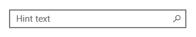

# <a name="auto-suggest-box"></a>자동 제안 상자
<link rel="stylesheet" href="https://az835927.vo.msecnd.net/sites/uwp/Resources/css/custom.css"> 

AutoSuggestBox를 사용하여 사용자가 입력과 동시에 선택할 수 있는 제안 사항 목록을 제공합니다.


<div class="important-apis" >
<b>중요 API</b><br/>
<ul>
<li>[**AutoSuggestBox 클래스**](https://msdn.microsoft.com/library/windows/apps/xaml/windows.ui.xaml.controls.autosuggestbox.aspx)</li>
<li>[**TextChanged 이벤트**](https://msdn.microsoft.com/library/windows/apps/xaml/windows.ui.xaml.controls.autosuggestbox.textchanged.aspx)</li>
<li>[**SuggestionChose 이벤트**](https://msdn.microsoft.com/library/windows/apps/xaml/windows.ui.xaml.controls.autosuggestbox.suggestionchosen.aspx)</li>
<li>[**QuerySubmitted 이벤트**](https://msdn.microsoft.com/library/windows/apps/xaml/windows.ui.xaml.controls.autosuggestbox.querysubmitted.aspx)</li>
</ul>
</div>


## <a name="is-this-the-right-control"></a>올바른 컨트롤인가요?

제안 목록을 통한 텍스트 검색을 허용하는 간단하고 사용자 지정 가능한 컨트롤을 원하는 경우에는 자동 제안 상자를 선택합니다.

올바른 텍스트 컨트롤을 선택하는 방법에 대한 자세한 내용은 [텍스트 컨트롤](text-controls.md) 문서를 참조하세요.

## <a name="examples"></a>예제

Groove 음악 앱의 자동 제안 상자입니다.


## <a name="anatomy"></a>구조
자동 제안 상자에 대한 진입점은 옵션 힌트 텍스트가 있는 입력란과 옵션 헤더로 구성됩니다.



사용자가 텍스트 입력을 시작하면 자동 제안 결과 목록이 자동으로 채워집니다. 결과 목록은 텍스트 입력 상자의 위 또는 아래에 나타날 수 있습니다. "모두 지우기" 단추가 표시됩니다.


## <a name="create-an-auto-suggest-box"></a>자동 제안 상자 만들기

AutoSuggestBox를 사용하려면 세 가지 사용자 작업에 응답해야 합니다.

- 텍스트가 변경됨 - 사용자가 텍스트를 입력하면 제안 목록을 업데이트합니다.
- 제안 사항이 선택됨 - 사용자가 제안 사항 목록에서 제안 사항을 선택하면 입력란을 업데이트합니다.
- 쿼리가 제출됨 - 사용자가 쿼리를 제출하면 쿼리 결과를 표시합니다.

### <a name="text-changed"></a>텍스트가 변경됨

입력란의 콘텐츠가 업데이트될 때마다 [**TextChanged**](https://msdn.microsoft.com/library/windows/apps/xaml/windows.ui.xaml.controls.autosuggestbox.textchanged.aspx) 이벤트가 발생합니다. 이벤트 인수 [Reason](https://msdn.microsoft.com/library/windows/apps/xaml/windows.ui.xaml.controls.autosuggestboxtextchangedeventargs.reason.aspx) 속성을 사용하여 사용자 입력으로 인해 변경되었는지 확인합니다. 변경 이유가 **UserInput**이면 입력에 따라 데이터를 필터링합니다. 그런 다음 필터링된 데이터를 AutoSuggestBox의 [ItemsSource](https://msdn.microsoft.com/library/windows/apps/xaml/windows.ui.xaml.controls.itemscontrol.itemssource.aspx)로 설정하여 제안 사항 목록을 업데이트합니다.

[DisplayMemberPath](https://msdn.microsoft.com/library/windows/apps/xaml/windows.ui.xaml.controls.itemscontrol.displaymemberpath.aspx) 또는 [ItemTemplate](https://msdn.microsoft.com/library/windows/apps/xaml/windows.ui.xaml.controls.itemscontrol.itemtemplate.aspx)을 사용하여 제안 사항 목록에 항목이 표시되는 방법을 제어할 수 있습니다.

- 데이터 항목의 단일 속성에 대한 텍스트를 표시하려면 제안 사항 목록에 표시할 개체의 속성을 선택하도록 DisplayMemberPath 속성을 설정합니다.
- 목록에서 각 항목의 사용자 지정 모양을 정의하려면 ItemTemplate 속성을 사용합니다.

### <a name="suggestion-chosen"></a>제안 사항이 선택됨

키보드를 사용하여 제안 사항 목록을 탐색할 때 이에 일치하도록 입력란의 텍스트를 업데이트해야 합니다.

입력란에 표시될 데이터 개체의 속성을 선택하도록 [TextMemberPath](https://msdn.microsoft.com/library/windows/apps/xaml/windows.ui.xaml.controls.autosuggestbox.textmemberpath.aspx) 속성을 선택할 수 있습니다. TextMemberPath를 지정하는 경우 입력란이 자동으로 업데이트됩니다. 제안 사항 목록과 입력란의 텍스트가 동일하도록 일반적으로 DisplayMemberPath와 TextMemberPath의 값을 동일하게 지정해야 합니다.

간단한 속성을 두 개 이상 표시해야 하는 경우 선택한 항목에 따라 사용자 지정된 텍스트로 입력란을 채우도록 [SuggestionChosen](https://msdn.microsoft.com/library/windows/apps/xaml/windows.ui.xaml.controls.autosuggestbox.suggestionchosen.aspx) 이벤트를 처리합니다.

### <a name="query-submitted"></a>쿼리가 제출됨

앱에 적절한 쿼리 작업을 수행하고 사용자에게 결과를 표시하도록 [QuerySubmitted](https://msdn.microsoft.com/library/windows/apps/xaml/windows.ui.xaml.controls.autosuggestbox.querysubmitted.aspx) 이벤트를 처리합니다.

QuerySubmitted 이벤트는 사용자가 쿼리 문자열을 커밋할 때 발생합니다. 사용자는 다음과 같은 방법 중 하나로 쿼리를 커밋할 수 있습니다.
- 포커스가 입력란에 있는 동안 Enter 키를 누르거나 쿼리 아이콘을 클릭합니다. 이벤트 인수 [ChosenSuggestion](https://msdn.microsoft.com/library/windows/apps/xaml/windows.ui.xaml.controls.autosuggestboxquerysubmittedeventargs.chosensuggestion.aspx) 속성은 **null**입니다.
- 포커스가 제안 목록에 있는 동안 Enter 키를 누르거나 항목을 클릭하거나 탭합니다. 이벤트 인수 ChosenSuggestion 속성은 목록에서 선택된 항목을 포함합니다.

모든 경우에 이벤트 인수 [QueryText](https://msdn.microsoft.com/library/windows/apps/xaml/windows.ui.xaml.controls.autosuggestboxquerysubmittedeventargs.querytext.aspx) 속성은 입력란의 텍스트를 포함합니다.

## <a name="use-autosuggestbox-for-search"></a>검색에 AutoSuggestBox 사용

AutoSuggestBox를 사용하여 사용자가 입력과 동시에 선택할 수 있는 제안 사항 목록을 제공합니다.

기본적으로 텍스트 입력 상자에 쿼리 단추가 표시되지 않습니다. 입력란의 오른쪽에 지정된 아이콘과 함께 단추를 추가하려면 [QueryIcon](https://msdn.microsoft.com/library/windows/apps/xaml/windows.ui.xaml.controls.autosuggestbox.queryicon.aspx) 속성을 설정할 수 있습니다. 예를 들어 AutoSuggestBox를 일반적인 검색 상자와 같이 표시하려면 다음과 같이 '찾기' 아이콘을 추가합니다.

```xaml
<AutoSuggestBox QueryIcon="Find"/>
```

다음은 '찾기' 아이콘이 있는 AutoSuggestBox입니다.


## <a name="get-the-sample-code"></a>샘플 코드 다운로드 

AutoSuggestBox의 전체 작업 예제를 보려면 [AutoSuggestBox 샘플](https://github.com/Microsoft/Windows-universal-samples/blob/master/Samples/XamlAutoSuggestBox) 및 [XAML UI 기본 사항 샘플](http://go.microsoft.com/fwlink/p/?LinkId=619992)을 참조하세요.

다음은 필수 이벤트 처리기가 포함된 간단한 AutoSuggestBox입니다.

```xaml
<AutoSuggestBox PlaceholderText="Search" QueryIcon="Find" Width="200"
                TextChanged="AutoSuggestBox_TextChanged"
                QuerySubmitted="AutoSuggestBox_QuerySubmitted"
                SuggestionChosen="AutoSuggestBox_SuggestionChosen"/>
```

```csharp
private void AutoSuggestBox_TextChanged(AutoSuggestBox sender, AutoSuggestBoxTextChangedEventArgs args)
{
    // Only get results when it was a user typing,
    // otherwise assume the value got filled in by TextMemberPath
    // or the handler for SuggestionChosen.
    if (args.Reason == AutoSuggestionBoxTextChangeReason.UserInput)
    {
        //Set the ItemsSource to be your filtered dataset
        //sender.ItemsSource = dataset;
    }
}


private void AutoSuggestBox_SuggestionChosen(AutoSuggestBox sender, AutoSuggestBoxSuggestionChosenEventArgs args)
{
    // Set sender.Text. You can use args.SelectedItem to build your text string.
}


private void AutoSuggestBox_QuerySubmitted(AutoSuggestBox sender, AutoSuggestBoxQuerySubmittedEventArgs args)
{
    if (args.ChosenSuggestion != null)
    {
        // User selected an item from the suggestion list, take an action on it here.
    }
    else
    {
        // Use args.QueryText to determine what to do.
    }
}
```

## <a name="dos-and-donts"></a>권장 사항 및 금지 사항

-   자동 제안 상자를 사용하여 검색을 수행했는데 입력한 텍스트에 대한 검색 결과가 없는 경우, 사용자가 검색 요청이 실행되었음을 알 수 있도록 "결과 없음" 메시지 한 줄을 결과로 표시하는 것이 좋습니다.

    

<div class="microsoft-internal-note">
**세계화 및 지역화 검사 목록**

<table>
<tr>
<th>세로 간격</th><td>세로 간격에 라틴어가 아닌 문자를 사용하여 라틴어가 아닌 스크립트가 숫자까지 제대로 표시되게 합니다.</td>
</tr>
<tr>
<th>스크롤</th><td>자동 제안 텍스트가 선택되면 사용자는 문자열의 끝까지 스크롤할 수 있어야 합니다.</td>
</tr>
</table>
</div>


## <a name="related-articles"></a>관련 문서

- [텍스트 컨트롤](text-controls.md)
- [맞춤법 검사](spell-checking-and-prediction.md)
- [검색](search.md)
- [**TextBox 클래스**](https://msdn.microsoft.com/library/windows/apps/br209683)
- [**Windows.UI.Xaml.Controls PasswordBox 클래스**](https://msdn.microsoft.com/library/windows/apps/br227519)
- [String.Length 속성](https://msdn.microsoft.com/library/system.string.length.aspx)

