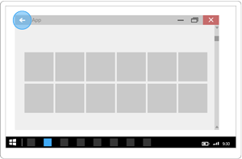
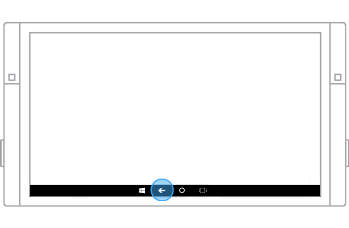

# 단추
단추를 사용하면 즉각적인 작업을 트리거할 수 있습니다.


<span class="sidebar_heading" style="font-weight: bold;">중요 API</span>

-   [**Button 클래스**](https://msdn.microsoft.com/library/windows/apps/windows.ui.xaml.controls.button.aspx)
-   [**RepeatButton 클래스**](https://msdn.microsoft.com/library/windows/apps/windows.ui.xaml.controls.primitives.repeatbutton.aspx)
-   [**Click 이벤트**](https://msdn.microsoft.com/library/windows/apps/windows.ui.xaml.controls.primitives.buttonbase.click.aspx)

## 올바른 컨트롤인가요?

단추를 사용하면 양식을 전송하는 등의 즉각적인 작업을 시작할 수 있습니다.

다른 페이지를 탐색하는 작업인 경우에는 단추 대신 링크를 사용합니다. 추가 정보는 [하이퍼링크](hyperlinks.md)를 참조하세요.
    
> 예외: 마법사 탐색인 경우에는 '뒤로' 및 '다음'이라는 레이블이 붙은 단추를 사용합니다. 역방향 탐색 또는 상위 수준 탐색 등의 경우에는 뒤로 단추를 사용합니다.

## 예제

이 예제에서는 Microsoft Edge 브라우저의 대화 상자에서 모두 닫기 및 취소의 두 가지 단추를 사용합니다. 


## 단추 만들기

이 예제에서는 클릭에 응답하는 단추를 보여 줍니다. 

XAML에서 단추를 만듭니다.

```xaml
<Button Content="Submit" Click="SubmitButton_Click"/>
```

또는 코드에서 단추를 만듭니다.

```csharp
Button submitButton = new Button();
submitButton.Content = "Submit";
submitButton.Click += SubmitButton_Click;

// Add the button to a parent container in the visual tree.
stackPanel1.Children.Add(submitButton);
```

Click 이벤트를 처리합니다.

```csharp
private async void SubmitButton_Click(object sender, RoutedEventArgs e)
{
    // Call app specific code to submit form. For example:
    // form.Submit();
    Windows.UI.Popups.MessageDialog messageDialog = 
        new Windows.UI.Popups.MessageDialog("Thank you for your submission.");
    await messageDialog.ShowAsync();
}
```

### 단추 조작

손가락 또는 스타일러스로 단추를 탭하거나 포인터가 단추 위에 있을 때 마우스 왼쪽 단추를 누르면 [**Click**](https://msdn.microsoft.com/library/windows/apps/windows.ui.xaml.controls.primitives.buttonbase.click.aspx) 이벤트가 발생합니다. 단추에 키보드 포커스가 있는 경우 Enter 키 또는 스페이스바 키를 눌러도 Click 이벤트가 발생합니다.

단추에는 대신 클릭 동작이 있기 때문에 일반적으로 단추에서 하위 수준의 [**PointerPressed**](https://msdn.microsoft.com/library/windows/apps/windows.ui.xaml.uielement.pointerpressed.aspx) 이벤트를 처리할 수 없습니다. 자세한 내용은 [이벤트 및 라우트된 이벤트 개요](https://msdn.microsoft.com/library/windows/apps/mt185584.aspx)를 참조하세요.

[**ClickMode**](https://msdn.microsoft.com/library/windows/apps/windows.ui.xaml.controls.primitives.buttonbase.clickmode.aspx) 속성을 변경하여 단추가 Click 이벤트를 발생시키는 방법을 변경할 수 있습니다. 기본 ClickMode 값은 **Release**입니다. ClickMode가 **Hover**인 경우 키보드 또는 터치로 Click 이벤트를 발생시킬 수 없습니다. 


### 단추 콘텐츠

단추는 [**ContentControl**](https://msdn.microsoft.com/library/windows/apps/xaml/windows.ui.xaml.controls.contentcontrol.aspx)입니다. 단추의 XAML 콘텐츠 속성은 [**Content**](https://msdn.microsoft.com/library/windows/apps/xaml/windows.ui.xaml.controls.contentcontrol.content.aspx)이며 XAML에 대해 다음과 같은 구문을 가능하게 합니다. `<Button>A button's content</Button>`. 어떠한 개체라도 단추 콘텐츠로 설정할 수 있습니다. 콘텐츠가 [UIElement](https://msdn.microsoft.com/library/windows/apps/xaml/windows.ui.xaml.uielement.aspx)인 경우 단추에서 렌더링됩니다. 콘텐츠가 다른 유형의 개체인 경우 해당 문자열 표현이 단추에 표시됩니다.

여기에서는 바나나 이미지 및 텍스트가 포함된 **StackPanel**이 Button의 Content로 설정됩니다.

```xaml
<Button Click="Button_Click" 
        Background="#FF0D6AA3" 
        Height="100" Width="80">
    <StackPanel>
        <Image Source="Assets/Slices.png" Height="62"/>
        <TextBlock Text="Orange"  Foreground="White"
                   HorizontalAlignment="Center"/>
    </StackPanel>
</Button>
```

단추는 다음과 같습니다.


## 반복 단추 만들기

[**RepeatButton**](https://msdn.microsoft.com/library/windows/apps/windows.ui.xaml.controls.primitives.repeatbutton.aspx)은 사용자가 눌렀다가 놓을 때까지 반복해서 [**Click**](https://msdn.microsoft.com/library/windows/apps/windows.ui.xaml.controls.primitives.buttonbase.click.aspx) 이벤트를 발생시키는 컨트롤입니다. [**Delay**](https://msdn.microsoft.com/library/windows/apps/windows.ui.xaml.controls.primitives.repeatbutton.delay.aspx) 속성을 설정하여 RepeatButton이 클릭 동작 반복을 시작하기 전에 눌러진 후 대기해야 하는 시간을 지정합니다. [**Interval**](https://msdn.microsoft.com/library/windows/apps/windows.ui.xaml.controls.primitives.repeatbutton.interval.aspx) 속성을 설정하여 클릭 동작의 반복 간 시간을 지정합니다. 두 속성에 대한 시간은 밀리초로 지정됩니다.

다음 예제에서는 두 RepeatButton 컨트롤(해당 Click 이벤트는 텍스트 블록에 표시되는 값을 늘리고 줄이는 데 사용함)을 보여 줍니다.

```xaml
<StackPanel>
    <RepeatButton Width="100" Delay="500" Interval="100" Click="Increase_Click">Increase</RepeatButton>
    <RepeatButton Width="100" Delay="500" Interval="100" Click="Decrease_Click">Decrease</RepeatButton>
    <TextBlock x:Name="clickTextBlock" Text="Number of Clicks:" />
</StackPanel>
```

```csharp
private static int _clicks = 0;
private void Increase_Click(object sender, RoutedEventArgs e)
{
    _clicks += 1;
    clickTextBlock.Text = "Number of Clicks: " + _clicks;
}

private void Decrease_Click(object sender, RoutedEventArgs e)
{
    if(_clicks > 0)
    {
        _clicks -= 1;
        clickTextBlock.Text = "Number of Clicks: " + _clicks;
    }
}
```

## 권장 사항

-   단추의 목적과 상태가 사용자에게 명확하게 전달되는지 확인합니다.
-   단추가 수행하는 작업을 명확히 설명해 주는 간결하고 구체적이며 설명적인 텍스트를 사용합니다. 일반적으로 단추 텍스트 콘텐츠는 한 단어로 된 동사입니다.
-   예를 들어 단추 텍스트 콘텐츠가 동적인 경우 단추 크기를 조정하는 방법과 주위의 컨트롤이 어떻게 되는지를 고려하세요.
-   텍스트 콘텐츠가 있는 명령 단추에는 최소 단추 너비를 사용합니다.
-   좁거나 짧거나 높은 명령 단추를 텍스트 콘텐츠와 함께 사용하지 마세요.
-   브랜드 지침에 다른 글꼴을 사용하도록 규정되어 있지 않은 경우 기본 글꼴을 사용하세요.
-   앱 내의 여러 페이지에서 작업을 사용할 수 있어야 하는 경우 단추를 여러 페이지에 복제하는 대신 [하단 앱 바](app-bars.md)를 사용하는 것이 좋습니다.
-   사용자에게 단추를 한 번에 한두 개(예: 수락 및 취소)만 표시합니다. 사용자에게 더 많은 작업을 표시해야 하는 경우 사용자가 하나의 명령 단추로 작업을 선택하여 트리거할 수 있도록 [확인란](checkbox.md) 또는 [라디오 단추](radio-button.md)를 사용하는 것이 좋습니다.
-   기본 명령 단추를 사용하여 가장 일반적이거나 권장되는 작업을 나타냅니다.
-   단추를 사용자 지정하는 것이 좋습니다. 단추의 모양은 기본적으로 사각형이지만 단추의 모양을 구성하는 시각 효과를 사용자 지정할 수 있습니다. Button의 Content는 일반적으로 텍스트(예: 수락 또는 취소)이지만 텍스트를 아이콘으로 바꾸거나 아이콘과 텍스트를 함께 사용할 수도 있습니다.
-   사용자가 단추를 조작할 때 단추의 상태와 모양이 변경되어 사용자에게 피드백을 제공하는지 확인합니다. 단추는 보통, 누름, 사용 안 함 상태 중 하나입니다.
-   사용자가 단추를 탭하거나 누르면 단추의 동작이 트리거됩니다. 일반적으로 사용자가 단추를 놓으면 작업이 트리거되지만 손가락으로 처음 누를 때 트리거하도록 단추 동작을 설정할 수도 있습니다.
-   상태를 설정하는 데 명령 단추를 사용하지 마세요.
-   앱이 실행 중일 때 단추의 텍스트를 변경하지 마세요. 예를 들어 "다음"이라는 단추 텍스트를 "계속"으로 변경하지 마세요.
-   기본 제출, 리셋 및 단추 스타일을 바꾸지 마세요.
-   단추 안에 너무 많은 콘텐츠를 넣지 마세요. 콘텐츠를 간결하고 이해하기 쉽게 유지하세요(그림과 일부 텍스트만 사용).

## 뒤로 단추
뒤로 단추는 뒤로 스택 또는 사용자의 탐색 기록을 통해 뒤로 탐색할 수 있게 하는 시스템 제공 UI 어포던스입니다.

탐색 기록(앱 내 또는 전역)의 범위는 디바이스 및 디바이스 모드에 따라 다릅니다.

## <span id="examples"></span><span id="EXAMPLES"></span>예제


시스템 뒤로 단추의 UI는 각 디바이스 및 입력 유형에 최적화되어 있지만 탐색 환경은 디바이스 및 UWP(유니버설 Windows 플랫폼) 앱 전체에서 전역적이고 일관됩니다. 이러한 다양한 환경은 다음과 같습니다.

디바이스 전화 
-   항상 제공됩니다.
-   장치 아래쪽에 있는 소프트웨어 단추 또는 하드웨어 버튼입니다.
-   앱 내 및 앱 간의 전역 뒤로 탐색 기능입니다.

<span id="Tablet"></span><span id="tablet"></span><span id="TABLET"></span>태블릿
-   태블릿 모드에서 항상 제공됩니다.

    데스크톱 모드에서는 사용할 수 없습니다. 대신 제목 표시줄 뒤로 단추를 사용할 수 있습니다. [PC, 노트북, 태블릿](#PC)을 참조하세요.

    사용자는 **설정 &gt; 시스템 &gt; 태블릿 모드**로 이동하여 **태블릿과 같은 디바이스를 사용할 때 Windows에서 더 쉽게 터치할 수 있습니다.**를 설정하여 태블릿 모드 실행과 데스크톱 모드 실행 간을 전환할 수 있습니다.

-   디바이스 아래쪽의 탐색 모음에 있는 소프트웨어 단추입니다.
-   앱 내 및 앱 간의 전역 뒤로 탐색 기능입니다.

<span id="PC"></span><span id="pc"></span>PC, 노트북, 태블릿 
-   데스크톱 모드에서는 옵션입니다.

    태블릿 모드에서는 사용할 수 없습니다. [태블릿](#Tablet)을 참조하세요.

    기본적으로 사용하지 않도록 설정되어 있습니다. 사용하도록 설정하려면 옵트인(opt in)해야 합니다.

    사용자는 **설정 &gt; 시스템 &gt; 태블릿 모드**로 이동하여 **태블릿과 같은 디바이스를 사용할 때 Windows에서 더 쉽게 터치할 수 있습니다.**를 설정하여 태블릿 모드 실행과 데스크톱 모드 실행 간을 전환할 수 있습니다.

-   앱의 제목 표시줄에 있는 소프트웨어 단추입니다.
-   앱 내에서만 뒤로 탐색 기능을 제공합니다. 앱 간 탐색 기능을 지원하지 않습니다.

Surface Hub 
-   항상 제공됩니다.
-   디바이스 아래쪽에 있는 소프트웨어 단추입니다.
-   앱 내 및 앱 간의 뒤로 탐색 기능입니다.

 

## 권장 사항 및 금지 사항


-   뒤로 탐색 기능을 사용하도록 설정합니다.

    뒤로 탐색 기능을 사용하도록 설정하지 않은 경우 앱이 전역 뒤로 스택에 포함되지만 앱 내 페이지 탐색 기록은 유지되지 않습니다.

-   데스크톱 모드에서 제목 표시줄 뒤로 단추를 사용하도록 설정합니다.

    앱 내 페이지 탐색 기록은 유지되고, 앱 간 뒤로 탐색은 지원되지 않습니다.

    **참고** 태블릿 모드에서 사용자가 디바이스의 위쪽에서 아래로 살짝 밀거나 디바이스 위쪽 가까이에서 마우스 포인터를 움직이면 제목 표시줄이 표시됩니다. 중복 및 혼동을 방지하기 위해 태블릿 모드에서는 제목 표시줄 뒤로 단추가 표시되지 않습니다.

     

-   앱 내 탐색 기록이 고갈되거나 사용할 수 없는 경우 데스크톱 모드에서 제목 표시줄 뒤로 단추를 숨기거나 사용하지 않도록 설정합니다.

    사용자에게 가능한 한 멀리 뒤로 탐색했음을 명확하게 표시해야 합니다.

-   각 뒤로 명령은 뒤로 스택에서 한 페이지를 돌아가거나 데스크톱 모드가 아닌 경우 즉시 이전 앱으로 돌아가야 합니다.

    뒤로 탐색이 직관적이지 않거나 일관되지 않거나 예측 불가능한 경우 사용자는 혼동될 수 있습니다.

## 관련 문서

- [라디오 단추](radio-button.md)
- [토글 스위치](toggles.md)
- [확인란](checkbox.md)

**개발자용(XAML)**
- [**Button 클래스**](https://msdn.microsoft.com/library/windows/apps/windows.ui.xaml.controls.button.aspx)


<!--HONumber=Jul16_HO2-->


