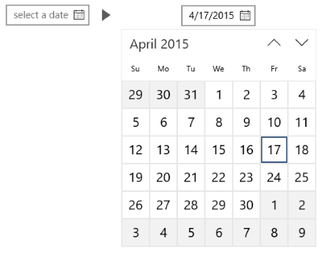

# 달력 날짜 선택

달력 날짜 선택은 요일이나 일정의 예약률과 같이 컨텍스트 정보가 중요한 달력 보기에서 단일 날짜를 선택하는 데 최적화된 드롭다운 컨트롤입니다. 달력을 수정하여 추가 컨텍스트를 제공하거나 사용할 수 있는 날짜를 제한할 수 있습니다.


-   [**CalendarDatePicker 클래스**](https://msdn.microsoft.com/library/windows/apps/xaml/windows.ui.xaml.controls.calendardatepicker.aspx)
-   [**Date 속성**](https://msdn.microsoft.com/library/windows/apps/xaml/windows.ui.xaml.controls.calendardatepicker.date.aspx)
-   [**DateChanged 이벤트**](https://msdn.microsoft.com/library/windows/apps/xaml/windows.ui.xaml.controls.calendardatepicker.datechanged.aspx)

## 올바른 컨트롤인가요?
**달력 날짜 선택**을 사용하여 상황별 달력 보기에서 단일 날짜를 선택할 수 있습니다. 약속 또는 출발 날짜 선택 등에 사용합니다.

생일과 같이 일정의 컨텍스트가 중요하지 않은 알려진 날짜를 선택하도록 하려면 [**날짜 선택**](date-picker.md)을 사용하는 것이 좋습니다.

올바른 컨트롤을 선택하는 방법에 대한 자세한 내용은 [날짜 및 시간 컨트롤](date-and-time.md) 문서를 참조하세요.

## 예제

날짜를 설정하지 않으면 진입점에 개체 틀 텍스트가 표시되며, 그러지 않으면 선택한 날짜가 표시됩니다. 사용자가 진입점을 선택하면 사용자가 날짜를 선택할 수 있도록 달력 보기가 확장됩니다. 이 달력 보기는 다른 UI에 겹쳐지며 다른 UI를 보이지 않도록 합니다.



## 날짜 선택 만들기

```xaml
<CalendarDatePicker x:Name="arrivalCalendarDatePicker" Header="Arrival date"/>
```

```csharp
CalendarDatePicker arrivalCalendarDatePicker = new CalendarDatePicker();
arrivalCalendarDatePicker.Header = "Arrival date";
```

결과 달력 날짜 선택은 다음과 같습니다.


달력 날짜 선택에는 날짜를 선택하기 위한 내부 [**CalendarView**](https://msdn.microsoft.com/library/windows/apps/xaml/windows.ui.xaml.controls.calendarview.aspx)가 있습니다. [**IsTodayHighlighted**](https://msdn.microsoft.com/library/windows/apps/xaml/windows.ui.xaml.controls.calendardatepicker.istodayhighlighted.aspx) 및 [**FirstDayOfWeek**](https://msdn.microsoft.com/library/windows/apps/xaml/windows.ui.xaml.controls.calendardatepicker.firstdayofweek.aspx)와 같은 CalendarView 속성의 하위 집합은 CalendarDatePicker에 있으며 수정할 수 있도록 내부 CalendarView에 전달됩니다. 

그러나 다중 선택을 하도록 내부 CalendarView의 [**SelectionMode**](https://msdn.microsoft.com/library/windows/apps/xaml/windows.ui.xaml.controls.calendarview.selectionmode.aspx)를 변경할 수 없습니다. 사용자가 여러 날짜를 선택하도록 하거나 달력이 항상 표시되도록 해야 하는 경우 달력 날짜 선택 대신 달력 보기를 사용하는 것이 좋습니다. 달력 표시를 수정할 수 있는 방법에 대한 자세한 내용은 [달력 보기](calendar-view.md) 문서를 참조하세요.

### 날짜 선택

[**Date**](https://msdn.microsoft.com/library/windows/apps/xaml/windows.ui.xaml.controls.calendardatepicker.date.aspx) 속성을 사용하여 선택한 날짜를 가져오거나 설정합니다. 기본적으로 Date 속성은 **null**입니다. 사용자가 달력 보기에서 날짜를 선택할 때 이 속성이 업데이트됩니다. 선택한 날짜를 선택 취소하기 위해 달력 보기에서 클릭하여 날짜를 삭제할 수 있습니다. 

다음과 같이 코드에서 날짜를 설정할 수 있습니다.

```csharp
myCalendarDatePicker.Date = new DateTime(1977, 1, 5);
```

코드에서 날짜를 설정할 때 값은 [**MinDate**](https://msdn.microsoft.com/library/windows/apps/xaml/windows.ui.xaml.controls.calendardatepicker.mindate.aspx) 및 [**MaxDate**](https://msdn.microsoft.com/library/windows/apps/xaml/windows.ui.xaml.controls.calendardatepicker.maxdate.aspx) 속성에 의해 제한됩니다.
- **Date**가 **MinDate**보다 작으면 값이 **MinDate**로 설정됩니다.
- **Date**가 **MaxDate**보다 크면 값이 **MaxDate**로 설정됩니다.

Date 값이 변경될 때 알림을 받도록 [**DateChanged**](https://msdn.microsoft.com/library/windows/apps/xaml/windows.ui.xaml.controls.calendardatepicker.datechanged.aspx) 이벤트를 처리할 수 있습니다.

> **참고** &nbsp;&nbsp;날짜 값에 대한 중요한 내용은 날짜 및 시간 컨트롤 문서의 [DateTime 및 Calendar 값](date-and-time.md#datetime-and-calendar-values)을 참조하세요.

### 헤더 및 개체 틀 텍스트 설정

[**헤더**](https://msdn.microsoft.com/library/windows/apps/xaml/windows.ui.xaml.controls.calendardatepicker.header.aspx)(또는 레이블) 및 [**PlaceholderText**](https://msdn.microsoft.com/library/windows/apps/xaml/windows.ui.xaml.controls.calendardatepicker.placeholdertext.aspx)(또는 워터마크)를 달력 날짜 선택에 추가하여 사용 목적 표시를 제공할 수 있습니다. 헤더의 모양을 사용자 지정하려면 헤더 대신 [**HeaderTemplate**](https://msdn.microsoft.com/library/windows/apps/xaml/windows.ui.xaml.controls.calendardatepicker.headertemplate.aspx) 속성을 설정할 수 있습니다.

기본 개체 틀 텍스트는 "날짜 선택"입니다. PlaceholderText 속성을 빈 문자열로 설정하여 이를 제거하거나 여기 표시된 대로 사용자 지정 텍스트를 제공할 수 있습니다.

```xaml
<CalendarDatePicker x:Name="arrivalCalendarDatePicker" Header="Arrival date" 
                    PlaceholderText="Choose your arrival date"/>
```


## 관련 문서

- [날짜 및 시간 컨트롤](date-and-time.md)
- [달력 보기](calendar-view.md)
- [날짜 선택기](date-picker.md)
- [시간 선택기](time-picker.md)


<!--HONumber=Jun16_HO5-->


