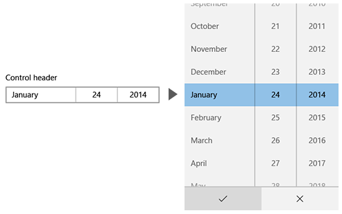

# <a name="date-picker"></a>날짜 선택기

<link rel="stylesheet" href="https://az835927.vo.msecnd.net/sites/uwp/Resources/css/custom.css"> 

날짜 선택은 사용자가 터치, 마우스 또는 키보드 입력을 사용하여 지역화된 날짜 값을 선택할 수 있는 표준화된 방법을 제공합니다. 

> **중요 API**: [DatePicker 클래스](https://msdn.microsoft.com/library/windows/apps/xaml/windows.ui.xaml.controls.datepicker.aspx), [Date 속성](https://msdn.microsoft.com/library/windows/apps/xaml/windows.ui.xaml.controls.datepicker.date.aspx)


## <a name="is-this-the-right-control"></a>올바른 컨트롤인가요?
날짜 선택을 사용하여 사용자는 달력의 컨텍스트가 중요하지 않은 생일과 같은 알려진 날짜를 선택할 수 있습니다.

올바른 날짜 컨트롤을 선택하는 방법에 대한 자세한 내용은 [날짜 및 시간 컨트롤](date-and-time.md) 문서를 참조하세요.

## <a name="examples"></a>예제

진입점에 선택한 날짜가 표시되고 사용자가 진입점을 선택하면 선택할 수 있게 선택 화면이 가운데에서 세로로 확장됩니다. 이 날짜 선택 컨트롤은 다른 UI에 겹쳐지며 다른 UI를 보이지 않도록 합니다.



## <a name="create-a-date-picker"></a>날짜 선택 만들기

이 예제에서는 머리글을 사용하여 간단한 날짜 선택을 만드는 방법을 보여 줍니다.

```xaml
<DatePicker x:Name=birthDatePicker Header="Date of birth"/>
```

```csharp
DatePicker birthDatePicker = new DatePicker();
birthDatePicker.Header = "Date of birth";
```

결과 날짜 선택은 다음과 같습니다.


> **참고**&nbsp;&nbsp;날짜 값에 대한 중요한 내용은 날짜 및 시간 컨트롤 문서의 [DateTime 및 Calendar 값](date-and-time.md#datetime-and-calendar-values)을 참조하세요.


## <a name="related-articles"></a>관련 문서

- [날짜 및 시간 컨트롤](date-and-time.md)
- [달력 날짜 선택](calendar-date-picker.md)
- [달력 보기](calendar-view.md)
- [시간 선택기](time-picker.md)
