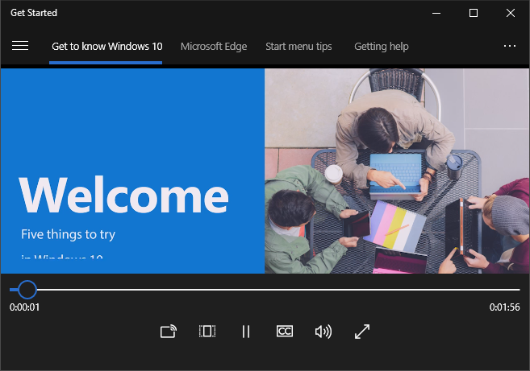
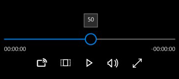
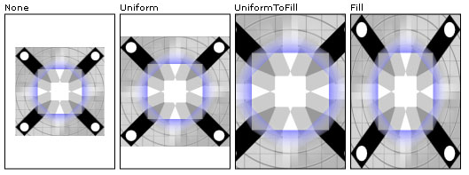

# 미디어 플레이어

미디어 플레이어는 동영상, 오디오 및 이미지를 감상하는 데 사용합니다. 미디어는 인라인(페이지에 포함되거나 다른 컨트롤의 그룹으로 포함)으로 또는 전용 전체 화면 보기로 재생할 수 있습니다. 플레이어의 단추 집합을 수정하고 컨트롤 막대의 배경을 변경하고 보기에 적합하게 레이아웃을 조정할 수 있습니다. 하지만 일반적으로 사용자는 기본 컨트롤 집합(재생/일시 중지, 뒤로 건너뛰기, 앞으로 건너뛰기)을 기대합니다.


<span class="sidebar_heading" style="font-weight: bold;">중요 API</span>

-   [**MediaElement 클래스**](https://msdn.microsoft.com/library/windows/apps/br242926)
-   [**MediaTransportControls 클래스**](https://msdn.microsoft.com/library/windows/apps/windows.ui.xaml.controls.mediatransportcontrols)

## 올바른 컨트롤인가요?

앱에서 오디오 또는 동영상을 재생하려는 경우 미디어 플레이어를 사용합니다. 이미지 컬렉션을 표시하려면 [대칭 이동 보기](flipview.md)를 사용합니다.

## 예제

Windows 10 시작 앱의 미디어 요소입니다.



## 미디어 플레이어 만들기
XAML로 [**MediaElement**](https://msdn.microsoft.com/library/windows/apps/br242926) 개체를 만들어 앱에 미디어를 추가하고 [**Source**](https://msdn.microsoft.com/library/windows/apps/br227419)를 오디오 또는 비디오 파일을 가리키는 URI(Uniform Resource Identifier)로 설정합니다.

이 XAML은 [**MediaElement**](https://msdn.microsoft.com/library/windows/apps/br242926)를 만들고 [**Source**](https://msdn.microsoft.com/library/windows/apps/br227419) 속성을 앱에 로컬인 비디오 파일의 URI로 설정합니다. **MediaElement**는 페이지가 로드되면 재생을 시작합니다. 미디어가 바로 시작되지 않게 하려면 [**AutoPlay**](https://msdn.microsoft.com/library/windows/apps/br227360) 속성을 **false**로 설정할 수 있습니다.

```xaml
<MediaElement x:Name="mediaSimple" 
              Source="Videos/video1.mp4" 
              Width="400" AutoPlay="False"/>
```

이 XAML은 기본 제공 컨트롤을 사용하도록 설정하고 [**AutoPlay**](https://msdn.microsoft.com/library/windows/apps/br227360) 속성을 **false**로 설정하여 [**MediaElement**](https://msdn.microsoft.com/library/windows/apps/br242926)를 만듭니다.


```csharp
<MediaElement x:Name="mediaPlayer" 
              Source="Videos/video1.mp4" 
              Width="400" 
              AutoPlay="False"
              AreTransportControlsEnabled="True"/>
```

### 미디어 전송 컨트롤
MediaElement에는 재생, 중지, 일시 중지, 볼륨, 음소거, 검색/진행 및 오디오 트랙 선택을 처리하는 기본 제공 전송 컨트롤이 있습니다. 이러한 컨트롤을 사용하도록 설정하려면 [**AreTransportControlsEnabled**](https://msdn.microsoft.com/library/windows/apps/dn298977)를 **true**로 설정합니다. 이러한 컨트롤을 사용하지 않도록 설정하려면 **AreTransportControlsEnabled**를 **false**로 설정합니다. 전송 컨트롤은 [**MediaTransportControls**](https://msdn.microsoft.com/library/windows/apps/dn831962) 클래스로 표현됩니다. 전송 컨트롤을 그대로 사용할 수도 있고 다양한 방법으로 사용자 지정할 수도 있습니다. 자세한 내용은 [**MediaTransportControls**](https://msdn.microsoft.com/library/windows/apps/dn831962) 클래스 참조 및 [사용자 지정 전송 컨트롤 만들기](custom-transport-controls.md)를 참조하세요.

전송 컨트롤을 통해 사용자는 [**MediaElement**](https://msdn.microsoft.com/library/windows/apps/br242926)의 대부분 측면을 제어할 수 있지만 **MediaElement** 역시 오디오 및 비디오 재생 제어에 사용할 수 있는 여러 속성과 메서드를 제공합니다. 자세한 내용은 이 문서의 뒷부분에 나오는 [프로그래밍 방식으로 MediaElement 제어](#control_mediaelement_programmatically) 섹션을 참조하세요.

전송 컨트롤은 단일 행 및 이중 행 레이아웃을 지원합니다. 첫 번째 예제는 미디어 타임라인의 왼쪽에 재생/일시 중지 단추가 있는 단일 행 레이아웃입니다. 이 레이아웃은 소형 화면에 가장 적합합니다. 


대부분의 시나리오, 특히 큰 화면의 경우에는 이중 행 컨트롤 레이아웃(아래 참조)을 사용하는 것이 좋습니다. 이 레이아웃의 경우 컨트롤을 위한 공간이 더 많으며, 사용자는 타임라인을 더욱 쉽게 조작할 수 있습니다.



**시스템 미디어 전송 컨트롤**

또한 [**MediaElement**](https://msdn.microsoft.com/library/windows/apps/br242926)를 시스템 미디어 전송 컨트롤과 통합할 수 있습니다. 시스템 전송 컨트롤은 키보드의 미디어 단추 등 하드웨어 미디어 키를 누를 때 팝업되는 컨트롤입니다. 사용자가 키보드에서 Pause 키를 누를 경우 앱이 [**SystemMediaTransportControls**](https://msdn.microsoft.com/library/windows/apps/dn278677)를 지원하면 앱이 알림을 받고 적절한 조치를 취할 수 있습니다. 자세한 내용은 [시스템 미디어 전송 컨트롤](https://msdn.microsoft.com/library/windows/apps/mt228338)을 참조하세요.

### 미디어 원본 설정
네트워크의 파일 또는 앱에 포함된 파일을 재생하려면 [**Source**](https://msdn.microsoft.com/library/windows/apps/br227419) 속성을 파일의 경로로 설정합니다.

**팁** 인터넷에서 파일을 열려면 앱의 매니페스트(Package.appxmanifest)에서 **Internet (Client)** 기능을 선언해야 합니다. 접근 권한 값 선언에 대한 자세한 내용은 [앱 접근 권한 값 선언](https://msdn.microsoft.com/library/windows/apps/mt270968)을 참조하세요.

 

다음 코드는 XAML로 정의된 [**MediaElement**](https://msdn.microsoft.com/library/windows/apps/br242926)의 [**Source**](https://msdn.microsoft.com/library/windows/apps/br227419) 속성을 [**TextBox**](https://msdn.microsoft.com/library/windows/apps/br209683)에 입력한 파일의 경로로 설정하려고 시도합니다.

```xaml
<TextBox x:Name="txtFilePath" Width="400" 
         FontSize="20"
         KeyUp="TxtFilePath_KeyUp"
         Header="File path"
         PlaceholderText="Enter file path"/>
```

```csharp
private void TxtFilePath_KeyUp(object sender, KeyRoutedEventArgs e)
{
    if (e.Key == Windows.System.VirtualKey.Enter)
    {
        TextBox tbPath = sender as TextBox;

        if (tbPath != null)
        {
            LoadMediaFromString(tbPath.Text);
        }
    }
}

private void LoadMediaFromString(string path)
{
    try
    {
        Uri pathUri = new Uri(path);
        mediaPlayer.Source = pathUri;
    }
    catch (Exception ex)
    {
        if (ex is FormatException)
        {
            // handle exception. 
            // For example: Log error or notify user problem with file
        }
    }
}
```

미디어 원본을 앱에 포함된 미디어 파일로 설정하려면 경로 앞에 **ms-appx:///**를 붙여 [**Uri**](https://msdn.microsoft.com/library/windows/apps/br226017)를 만든 다음 [**Source**](https://msdn.microsoft.com/library/windows/apps/br227419)를 이 URI로 설정합니다. 예를 들어 **Videos** 하위 폴더에 있는 **video1.mp4** 파일의 경우 경로는 **ms-appx:///Videos/video1.mp4**와 같습니다.

다음 코드는 이전에 XAML로 정의된 [**MediaElement**](https://msdn.microsoft.com/library/windows/apps/br242926)의 [**Source**](https://msdn.microsoft.com/library/windows/apps/br227419) 속성을 **ms-appx:///Videos/video1.mp4**로 설정합니다.

```csharp
private void LoadEmbeddedAppFile()
{
    try
    {
        Uri pathUri = new Uri("ms-appx:///Videos/video1.mp4");
        mediaPlayer.Source = pathUri;
    }
    catch (Exception ex)
    {
        if (ex is FormatException)
        {
            // handle exception. 
            // For example: Log error or notify user problem with file
        }
    }
}
```

### 로컬 미디어 파일 열기
로컬 시스템 또는 OneDrive에서 파일을 열려면 [**FileOpenPicker**](https://msdn.microsoft.com/library/windows/apps/br207847)를 사용하여 파일 및 [**SetSource**](https://msdn.microsoft.com/library/windows/apps/br244338)를 가져와서 미디어 원본을 설정하거나 프로그래밍 방식으로 사용자 미디어 폴더에 액세스할 수 있습니다.

**Music** 또는 **비디오** 폴더에 대한 사용자의 조작 없이 앱이 액세스가 필요할 경우(예: 사용자의 컬렉션에 있는 모든 음악 또는 동영상 파일을 열거하고 앱에 표시하려는 경우)에는 **Music Library** 및 **비디오 라이브러리** 접근 권한 값을 선언해야 합니다. 자세한 내용은 [음악, 사진 및 비디오 라이브러리의 파일 및 폴더](https://msdn.microsoft.com/library/windows/apps/mt188703)를 참조하세요.

사용자가 어떤 파일에 액세스할지 완전히 제어하므로 [**FileOpenPicker**](https://msdn.microsoft.com/library/windows/apps/br207847)에는 사용자의 **음악** 또는 **동영상** 폴더 등 로컬 파일 시스템에 있는 파일에 액세스하기 위해 특별한 접근 권한 값이 필요하지 않습니다. 보안 및 개인 정보 보호의 관점에서 볼 때 앱이 사용하는 접근 권한 값 수를 최소화하는 것이 가장 좋습니다.

**FileOpenPicker를 사용하여 로컬 미디어를 열려면**

1.  [
            **FileOpenPicker**](https://msdn.microsoft.com/library/windows/apps/br207847)를 호출하면 사용자가 미디어 파일을 선택할 수 있습니다.

    [
            **FileOpenPicker**](https://msdn.microsoft.com/library/windows/apps/br207847) 클래스를 사용하여 미디어 파일을 선택합니다. [
            **FileTypeFilter**](https://msdn.microsoft.com/library/windows/apps/br207850)를 설정하여 **FileOpenPicker**가 표시하는 파일 형식을 지정합니다. 파일 선택기를 실행하여 파일을 가져오려면 [**PickSingleFileAsync**](https://msdn.microsoft.com/library/windows/apps/jj635275)를 호출합니다.

2.  [
            **SetSource**](https://msdn.microsoft.com/library/windows/apps/br244338)를 호출하여 선택한 미디어 파일을 [**MediaElement.Source**](https://msdn.microsoft.com/library/windows/apps/br227419)로 설정합니다.

    [
            **MediaElement**](https://msdn.microsoft.com/library/windows/apps/br242926)의 [**Source**](https://msdn.microsoft.com/library/windows/apps/br227419)를 [**FileOpenPicker**](https://msdn.microsoft.com/library/windows/apps/br207847)에서 반환되는 [**StorageFile**](https://msdn.microsoft.com/library/windows/apps/br227171)로 설정하려면 스트림을 열어야 합니다. **StorageFile**의 [**OpenAsync**](https://msdn.microsoft.com/library/windows/apps/dn889851) 메서드를 호출하면 [**MediaElement.SetSource**](https://msdn.microsoft.com/library/windows/apps/br244338) 메서드에 전달할 수 있는 스트림을 반환합니다. 그런 다음 **MediaElement**에서 [**Play**](https://msdn.microsoft.com/library/windows/apps/br227402)를 호출하여 미디어를 시작합니다.

이 예제는 [**FileOpenPicker**](https://msdn.microsoft.com/library/windows/apps/br207847)를 사용하여 파일을 선택하고 [**MediaElement**](https://msdn.microsoft.com/library/windows/apps/br242926)의 [**Source**](https://msdn.microsoft.com/library/windows/apps/br227419)로 설정하는 방법을 보여 줍니다.

```xaml
<MediaElement x:Name="mediaPlayer"/>
...
<Button Content="Choose file" Click="Button_Click"/>
```

```csharp
private async void Button_Click(object sender, RoutedEventArgs e)
{
    await SetLocalMedia();
}

async private System.Threading.Tasks.Task SetLocalMedia()
{
    var openPicker = new Windows.Storage.Pickers.FileOpenPicker();

    openPicker.FileTypeFilter.Add(".wmv");
    openPicker.FileTypeFilter.Add(".mp4");
    openPicker.FileTypeFilter.Add(".wma");
    openPicker.FileTypeFilter.Add(".mp3");

    var file = await openPicker.PickSingleFileAsync();
    
    // mediaPlayer is a MediaElement defined in XAML
    if (file != null)
    {
        var stream = await file.OpenAsync(Windows.Storage.FileAccessMode.Read);
        mediaPlayer.SetSource(stream, file.ContentType);

        mediaPlayer.Play();
    }
}
```

### 포스터 원본 설정
[
            **PosterSource**](https://msdn.microsoft.com/library/windows/apps/br227409) 속성을 사용하여 미디어가 로드되기 전에 [**MediaElement**](https://msdn.microsoft.com/library/windows/apps/br242926)에 시각적 표현을 제공할 수 있습니다. **PosterSource**는 미디어 대신 표시되는 이미지(예제: 스크린샷, 영화 포스터)입니다. **PosterSource**는 다음과 같은 경우에 표시됩니다.

-   유효한 원본이 설정되지 않은 경우. 예를 들어 [**Source**](https://msdn.microsoft.com/library/windows/apps/br227419)가 설정되지 않았거나, **Source**가 **Null**로 설정되어 있거나, 원본이 잘못된 경우(예: [**MediaFailed**](https://msdn.microsoft.com/library/windows/apps/br227393) 이벤트가 발생한 경우)가 있습니다.
-   미디어를 로드하는 중. 예를 들어 유효한 원본이 설정되어 있지만 [**MediaOpened**](https://msdn.microsoft.com/library/windows/apps/br227394) 이벤트가 아직 발생하지 않은 경우가 있습니다.
-   미디어가 다른 디바이스로 스트리밍되는 경우
-   미디어가 오디오 전용인 경우

다음은 해당 [**Source**](https://msdn.microsoft.com/library/windows/apps/br227419)가 앨범 트랙으로 설정되고 해당 [**PosterSource**](https://msdn.microsoft.com/library/windows/apps/br227409)가 앨범 커버의 이미지로 설정된 [**MediaElement**](https://msdn.microsoft.com/library/windows/apps/br242926)입니다.

```xaml
<MediaElement Source="Media/Track1.mp4" PosterSource="Media/AlbumCover.png"/> 
```

### 디바이스의 화면을 활성 상태로 유지
일반적으로 디바이스는 사용자가 자리를 비우면 배터리 사용 시간을 절약하기 위해 디스플레이를 흐리게 하고 결국에는 꺼지지만, 동영상 앱의 경우 사용자가 돌아왔을 때 다시 볼 수 있으려면 화면을 그대로 유지해야 합니다. 앱이 전체 화면 동영상을 재생하고 있는 때와 같이 사용자 작업이 더 이상 검색되지 않을 때 디스플레이가 비활성화되지 않도록 하려면 [**DisplayRequest.RequestActive**](https://msdn.microsoft.com/library/windows/apps/br241818)를 호출하면 됩니다. [
            **DisplayRequest**](https://msdn.microsoft.com/library/windows/apps/br241816) 클래스를 사용하면 Windows가 디스플레이를 켠 상태로 유지하여 사용자가 동영상을 볼 수 있게 할 수 있습니다.

전원과 배터리 사용 시간을 절약하려면 [**DisplayRequest.RequestRelease**](https://msdn.microsoft.com/library/windows/apps/br241819)를 호출하여 더 이상 필요하지 않은 디스플레이 요청을 해제해야 합니다. Windows는 앱이 화면을 벗어나면 앱의 활성 디스플레이를 자동으로 비활성화하고 앱이 포그라운드로 돌아오면 다시 활성화합니다.

다음은 디스플레이 요청을 해제해야 하는 몇 가지 상황입니다.

-   사용자 작업, 버퍼링 또는 제한된 대역폭으로 인한 조정 등으로 비디오 재생이 일시 중지되었습니다.
-   재생이 중지되었습니다. 예를 들어 비디오 재생이 완료되거나 프레젠테이션이 끝난 경우입니다.
-   재생 오류가 발생했습니다. 예를 들어 네트워크 연결 문제 또는 손상된 파일의 경우입니다.

**화면을 활성 상태로 유지하려면**

1.  전역 [**DisplayRequest**](https://msdn.microsoft.com/library/windows/apps/br241816) 변수를 만듭니다. 이 변수를 null로 초기화합니다.
```csharp
// Create this variable at a global scope. Set it to null.
private DisplayRequest appDisplayRequest = null;
```

2.  [
            **RequestActive**](https://msdn.microsoft.com/library/windows/apps/br241818)를 호출하여 Windows에 앱이 디스플레이를 유지해야 함을 알립니다.

3.  동영상 재생이 재생 오류로 인해 중지, 일시 중지 또는 중단될 경우 디스플레이 요청을 해제하려면 [**RequestRelease**](https://msdn.microsoft.com/library/windows/apps/br241819)를 호출합니다. 앱에 활성 디스플레이 요청이 더 이상 없으면 Windows는 디바이스가 사용되지 않을 때 디스플레이를 흐리게 하고 결국에는 꺼서 배터리 사용 시간을 절약합니다.

    여기서 [**CurrentStateChanged**](https://msdn.microsoft.com/library/windows/apps/br227375) 이벤트를 사용하여 이러한 상황을 감지합니다. 그런 다음 [**IsAudioOnly**](https://msdn.microsoft.com/library/windows/apps/hh965334) 속성을 사용하여 오디오 또는 동영상 파일의 재생 여부를 결정하고 동영상이 재생되는 경우에만 화면을 활성 상태로 유지합니다.
    ```xaml
<MediaElement Source="Media/video1.mp4"
              CurrentStateChanged="MediaElement_CurrentStateChanged"/>
    ```
 
    ```csharp
private void MediaElement_CurrentStateChanged(object sender, RoutedEventArgs e)
{
    MediaElement mediaElement = sender as MediaElement;
    if (mediaElement != null && mediaElement.IsAudioOnly == false)
    {
        if (mediaElement.CurrentState == Windows.UI.Xaml.Media.MediaElementState.Playing)
        {                
            if (appDisplayRequest == null)
            {
                // This call creates an instance of the DisplayRequest object. 
                appDisplayRequest = new DisplayRequest();
                appDisplayRequest.RequestActive();
            }
        }
        else // CurrentState is Buffering, Closed, Opening, Paused, or Stopped. 
        {
            if (appDisplayRequest != null)
            {
                // Deactivate the display request and set the var to null.
                appDisplayRequest.RequestRelease();
                appDisplayRequest = null;
            }
        }            
    }
} 
    ```

### 프로그래밍 방식으로 미디어 플레이어 제어
[
            **MediaElement**](https://msdn.microsoft.com/library/windows/apps/br242926)는 오디오 및 비디오 재생을 제어할 수 있는 다양한 속성, 메서드 및 이벤트를 제공합니다. 전체 속성, 메서드 및 이벤트 목록을 보려면 [**MediaElement**](https://msdn.microsoft.com/library/windows/apps/br242926) 참조 페이지를 참조하세요.
    

### 다른 언어의 오디오 트랙 선택

[
            **AudioStreamIndex**](https://msdn.microsoft.com/library/windows/apps/br227358) 속성 및 [**GetAudioStreamLanguage**](https://msdn.microsoft.com/library/windows/apps/br227384) 메서드를 사용하면 비디오에서 오디오를 다른 언어 트랙으로 변경할 수 있습니다. 비디오에는 또한 동일한 언어로 된 여러 오디오 트랙이 포함될 수 있습니다(예: 영화에 대한 감독의 해설). 이 예제는 특히 다른 언어 간에 전환하는 방법을 보여 주지만 이 코드를 수정하여 모든 오디오 트랙 간에 전환할 수 있습니다.

**다른 언어의 오디오 트랙을 선택하려면**

1.  오디오 트랙 가져오기

    특정 언어로 된 트랙을 검색하려면 먼저 비디오에서 각 오디오 트랙을 반복합니다. **for** 루프의 최대값으로 [**AudioStreamCount**](https://msdn.microsoft.com/library/windows/apps/br227356)를 사용합니다.

2.  오디오 트랙의 언어 가져오기

    트랙의 언어를 가져오려면 [**GetAudioStreamLanguage**](https://msdn.microsoft.com/library/windows/apps/br227384) 메서드를 사용합니다. 트랙의 언어는 [언어 코드](http://msdn.microsoft.com/library/ms533052(vs.85).aspx)를 통해 식별됩니다(예제: 영어의 경우 **"en"**, 일본어의 경우 **"ja"**).

3.  활성 오디오 트랙 설정

    원하는 언어의 트랙을 찾으면 [**AudioStreamIndex**](https://msdn.microsoft.com/library/windows/apps/br227358)를 트랙의 인덱스로 설정합니다. **AudioStreamIndex**를 **null**로 설정하여 콘텐츠에 의해 정의되는 기본 오디오 트랙을 선택합니다.

다음은 오디오 트랙을 지정된 언어로 설정하려고 하는 일부 코드입니다. 또한 [**MediaElement**](https://msdn.microsoft.com/library/windows/apps/br242926) 개체에서 오디오 트랙을 반복하고 [**GetAudioStreamLanguage**](https://msdn.microsoft.com/library/windows/apps/br227384)를 사용하여 각 트랙의 언어를 가져옵니다. 원하는 언어 트랙이 있을 경우 [**AudioStreamIndex**](https://msdn.microsoft.com/library/windows/apps/br227358)는 해당 트랙의 인덱스로 설정됩니다.

```csharp
/// <summary>
/// Attemps to set the audio track of a video to a specific language
/// </summary>
/// <param name="lcid">The id of the language. For example, "en" or "ja"</param>
/// <returns>true if the track was set; otherwise, false.</returns>
private bool SetAudioLanguage(string lcid, MediaElement media)
{
    bool wasLanguageSet = false;

    for (int index = 0; index < media.AudioStreamCount; index++)
    {
        if (media.GetAudioStreamLanguage(index) == lcid)
        {
            media.AudioStreamIndex = index;
            wasLanguageSet = true;
        }
    }

    return wasLanguageSet;
}
```

### 전체 창 동영상 렌더링을 사용하도록 설정

전체 창 렌더링을 사용하거나 사용하지 않도록 설정하려면 [**IsFullWindow**](https://msdn.microsoft.com/library/windows/apps/dn298980) 속성을 설정합니다. 앱에서 전체 창 렌더링을 프로그래밍 방식으로 설정하는 경우 수동으로 설정하는 대신 항상 **IsFullWindow**를 사용해야 합니다. **IsFullWindow**는 시스템 수준의 최적화가 수행되도록 하여 성능과 배터리 사용 시간을 향상합니다. 전체 창 렌더링이 제대로 설정되어 있지 않으면 이러한 최적화를 사용할 수 없습니다.

다음은 전체 창 렌더링을 켜고 끄는 [**AppBarButton**](https://msdn.microsoft.com/library/windows/apps/dn279244)을 만드는 일부 코드입니다.

```xaml
<AppBarButton Icon="FullScreen" 
              Label="Full Window"
              Click="FullWindow_Click"/>>
```

```csharp
private void FullWindow_Click(object sender, object e)
{
    mediaPlayer.IsFullWindow = !media.IsFullWindow;
}
```

### 동영상 크기 조정 및 확대

[
            **Stretch**](https://msdn.microsoft.com/library/windows/apps/br227422) 속성을 사용하여 동영상 콘텐츠가 컨테이너를 채우는 방식을 변경할 수 있습니다. 그러면 [**Stretch**](https://msdn.microsoft.com/library/windows/apps/br242968) 값에 따라 동영상 크기를 조정하고 확대합니다. **Stretch**의 상태는 여러 TV 세트의 사진 크기 설정과 비슷합니다. 이 속성을 단추에 연결하고 사용자가 더 선호하는 설정을 선택하도록 할 수 있습니다.

-   [
            **None**](https://msdn.microsoft.com/library/windows/apps/br242968)은 원래 크기로 콘텐츠의 기본 해상도를 표시합니다.
-   [
            **Uniform**](https://msdn.microsoft.com/library/windows/apps/br242968)은 가로 세로 비율 및 이미지 콘텐츠를 유지하면서 공간을 최대한 채웁니다. 이 경우 동영상 가장자리에 가로 또는 세로의 검은색 막대가 표시될 수 있습니다. 이 상태는 와이드스크린 모드와 비슷합니다.
-   [
            **UniformToFill**](https://msdn.microsoft.com/library/windows/apps/br242968)은 가로 세로 비율을 유지하면서 전체 공간을 채웁니다. 이 경우 이미지 일부가 잘릴 수 있습니다. 이 상태는 전체 화면 모드와 비슷합니다.
-   [
            **Fill**](https://msdn.microsoft.com/library/windows/apps/br242968)은 전체 공간을 채우지만 가로 세로 비율을 유지하지 않습니다. 이미지가 잘리지는 않지만 늘어짐이 발생할 수 있습니다. 이 상태는 확대 모드와 비슷합니다.

 여기서 [**AppBarButton**](https://msdn.microsoft.com/library/windows/apps/dn279244)은 [**Stretch**](https://msdn.microsoft.com/library/windows/apps/br242968) 옵션을 순환하는 데 사용됩니다. **switch** 문은 [**Stretch**](https://msdn.microsoft.com/library/windows/apps/br227422) 속성의 현재 상태를 확인하고 **Stretch** 열거형의 다음 값으로 설정합니다. 그러면 사용자가 여러 확대 상태를 순환할 수 있습니다.

```xaml
<AppBarButton Icon="Switch" 
              Label="Resize Video"
              Click="PictureSize_Click" />
```

```csharp
private void PictureSize_Click(object sender, RoutedEventArgs e)
{
    switch (mediaPlayer.Stretch)
    {
        case Stretch.Fill:
            mediaPlayer.Stretch = Stretch.None;
            break;
        case Stretch.None:
            mediaPlayer.Stretch = Stretch.Uniform;
            break;
        case Stretch.Uniform:
            mediaPlayer.Stretch = Stretch.UniformToFill;
            break;
        case Stretch.UniformToFill:
            mediaPlayer.Stretch = Stretch.Fill;
            break;
        default:
            break;
    }
}
```

### 짧은 대기 시간 재생을 사용하도록 설정

[
            **RealTimePlayback**](https://msdn.microsoft.com/library/windows/apps/br227414) 속성을 [**MediaElement**](https://msdn.microsoft.com/library/windows/apps/br242926)에서 **true**로 설정하면 미디어 요소의 재생에 대한 초기 대기 시간을 줄일 수 있습니다. 이는 양방향 통신 앱에 중요하며 일부 게임 시나리오에 적용될 수 있습니다. 이 모드는 리소스를 더 많이 사용하고 전력 효율성이 떨어집니다.

이 예제에서는 [**MediaElement**](https://msdn.microsoft.com/library/windows/apps/br242926)를 만들고 [**RealTimePlayback**](https://msdn.microsoft.com/library/windows/apps/br227414)을 **true**로 설정합니다.

```xaml
<MediaElement x:Name="mediaPlayer" RealTimePlayback="True"/>
```

```csharp
MediaElement mediaPlayer = new MediaElement();
mediaPlayer.RealTimePlayback = true;
```
    
## 권장 사항 

미디어 플레이어는 밝은 테마 및 어두운 테마를 제공하지만, 대부분의 경우에 어두운 테마를 선택합니다. 어두운 배경은 특히 조명이 약한 조건에서 더욱 뛰어난 대비를 제공하며 컨트롤 막대가 보기 환경을 방해하지 않도록 제한합니다.

인라인 모드를 전체 화면 모드로 확장하여 전용 보기 환경을 사용합니다. 전체 화면 보기 모드가 최적의 환경이며 인라인 모드에서는 옵션이 제한됩니다.

화면 공간이 있는 경우 이중 행 레이아웃을 사용합니다. 이 레이아웃은 소형 단일 행 레이아웃보다 더 많은 공간을 컨트롤에 제공합니다.

필요한 사용자 지정 옵션을 미디어 플레이어에 모두 추가하여 앱에 최상의 환경을 제공합니다. 단, 다음 사항을 유념합니다.

-   미디어 재생 환경에 최적화된 기본 컨트롤의 사용자 지정을 제한합니다.
-   휴대폰 및 기타 모바일 디바이스에서 디바이스 크롬은 검은색으로 남아 있지만, 노트북 및 데스크톱에서 디바이스 크롬은 사용자의 테마 색을 상속합니다.
-   너무 많은 옵션을 사용하여 컨트롤 막대가 오버로드되지 않도록 합니다.
-   효율성을 매우 제한하므로 미디어 타임라인을 기본 최소 크기 이하로 축소하지 않도록 합니다.

## 관련 문서

- [UWP 앱의 명령 디자인 기본 사항](https://msdn.microsoft.com/library/windows/apps/dn958433)
- [UWP 앱의 콘텐츠 디자인 기본 사항](https://msdn.microsoft.com/library/windows/apps/dn958434)


<!--HONumber=May16_HO2-->


