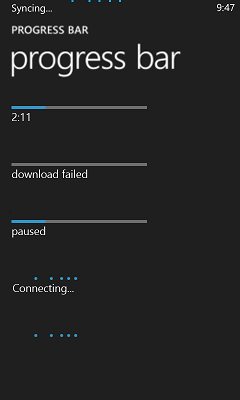
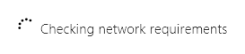

# 진행률 컨트롤

진행률 컨트롤은 긴 작업을 진행 중인 사용자에게 피드백을 제공합니다. *확정된* 진행률 표시줄에는 작업 완료율이 표시됩니다. *확정되지 않은* 진행률 표시줄 또는 진행률 링에서는 작업이 진행 중임을 보여 줍니다.

진행률 컨트롤은 읽기 전용이므로 조작할 수 없습니다.

<span class="sidebar_heading" style="font-weight: bold;">중요 API</span>

-   [**ProgressBar 클래스**](https://msdn.microsoft.com/library/windows/apps/xaml/windows.ui.xaml.controls.progressbar.aspx)
-   [**IsIndeterminate 속성**](https://msdn.microsoft.com/library/windows/apps/xaml/windows.ui.xaml.controls.progressbar.isindeterminate.aspx)
-   [**ProgressRing 클래스**](https://msdn.microsoft.com/library/windows/apps/xaml/windows.ui.xaml.controls.progressring.aspx)
-   [**IsActive 속성**](https://msdn.microsoft.com/library/windows/apps/xaml/windows.ui.xaml.controls.progressring.isactive.aspx)


Windows 앱: 확정되지 않은 진행률 표시줄, 진행률 링, 확정된 진행률 표시줄



Windows Phone 앱: 상태 표시줄 진행률 표시기 및 진행률 표시줄

## 예제

다음은 시작 화면에 있는 진행률 링 컨트롤의 예입니다.


진행률 표시줄에도 상태 또는 위치가 표시됩니다. 음악 추적에 사용되는 진행률 표시줄은 노래의 타임라인에 해당하고, 표시줄의 값은 노래 위치이고, 일시 중지 상태는 재생이 일시 중지됨을 나타냅니다.


## 올바른 컨트롤입니까?

진행률 컨트롤을 항상 표시해야 하는 것은 아닙니다. 작업의 진행률을 자체적으로 알 수 있거나 작업이 너무 빨리 완료되기 때문에 진행률 표시줄을 표시하면 산만해지는 경우도 있습니다. 다음은 진행률 컨트롤을 표시할지 여부를 결정할 때 고려할 사항입니다.

-   **작업을 완료하는 데 2초 이상 걸립니까?**

    그런 경우 작업이 시작되는 즉시 진행률 컨트롤을 표시하세요. 작업이 대부분 완료되는 데 2초 이상이 걸리지만 2초 미만에 완료되는 경우도 있는 경우 컨트롤을 표시하기 전에 500ms 대기하여 깜박거리지 않게 합니다.

-   **사용자 작업이 완료될 때까지 컴퓨터 작업이 대기합니까?**

    그렇다면 진행률 표시줄을 사용하지 않는 것이 좋습니다. 진행률 표시줄은 사용자 작업이 아닌 컴퓨터 작업을 위한 것입니다.

-   **어떤 일이 일어나고 있는지를 사용자가 알아야 합니까?**

    예를 들어 앱이 백그라운드에서 다운로드하고 있을 때 사용자가 다운로드를 시작하지 않았다면 사용자는 이를 알 필요가 없습니다.

-   **컴퓨터 작업이 사용자 작업을 차단하지 않으며 사용자와 거의 무관한 백그라운드 작업입니까?**

    항상 보일 필요는 없지만 상태를 표시할 필요는 있는 작업을 앱이 수행하고 있을 때는 텍스트와 말줄임표를 사용합니다.

    

    작업이 진행 중임을 표시할 때는 말줄임표를 사용합니다. 작업 또는 항목이 여러 개인 경우에는 남은 작업의 수를 표시할 수 있습니다. 모든 작업이 완료되면 표시기를 해제합니다.

-   **작업 내용을 사용하여 진행률을 보여줄 수 있습니까?**

    그럴 경우 진행률 컨트롤을 표시하지 않습니다. 예를 들어 디스크에서 로드한 /src/assets을 표시하면 /src/assets이 로드되면서 하나씩 화면에 나타납니다. 진행률 컨트롤을 표시하는 것이 아무 도움도 되지 않고 UI를 복잡하게만 만들 수도 있습니다.

-   **작업을 진행하는 동안 전체 작업 중 얼마나 작업이 완료되었는지를 확인할 수 있습니까?**

    이 경우 특히, 사용자를 차단하는 작업의 경우 확정된 진행률 표시줄을 사용합니다. 그렇지 않은 경우 확정되지 않은 진행률 표시줄 또는 링을 사용합니다. 사용자가 무슨 일이 벌어지고 있다는 사실만 알면 되는 경우에도 유용합니다.

## 확정된 진행률 컨트롤 만들기

확정된 진행률 표시줄에는 앱 진행 상황 정도가 표시됩니다. 작업이 진행되면 표시줄이 채워집니다. 남아있는 작업량을 시간, 바이트, 파일 또는 기타 정량적 측정 단위로 예측할 수 있으면 확정된 진행률 표시줄을 사용하세요.

진행률 표시줄은 진행률을 설정하고 결정하는 여러 속성을 제공합니다.
- [**IsIndeterminate**](https://msdn.microsoft.com/library/windows/apps/xaml/windows.ui.xaml.controls.progressbar.isindeterminate.aspx): 확정되지 않은 진행률 표시줄인지 여부를 지정합니다. 확정된 진행률 표시줄을 만들려면 **false**로 설정합니다.
- [**최소**](https://msdn.microsoft.com/library/windows/apps/xaml/windows.ui.xaml.controls.primitives.rangebase.minimum.aspx): 값 범위의 시작입니다. 기본값은 0.0입니다.
- [**최대**](https://msdn.microsoft.com/library/windows/apps/xaml/windows.ui.xaml.controls.primitives.rangebase.maximum.aspx): 값 범위의 끝입니다. 기본값은 1.0입니다. 
- [**Value**](https://msdn.microsoft.com/library/windows/apps/xaml/windows.ui.xaml.controls.primitives.rangebase.value.aspx): 현재 진행 상태를 지정하는 숫자입니다. 파일 다운로드 진행 상태를 보고 있는 경우 이 값은 다운로드한 바이트 수일 수 있습니다. Maximum을 다운로드할 총 바이트 수로 설정할 수 있습니다.
 
다음 예제에서는 값 기반의 확정된 진행률 표시줄을 보여 줍니다. 

```xaml
<ProgressBar IsIndeterminate="False" Maximum="100" Width="200"/>
```

```csharp
ProgressBar progressBar1 = new ProgressBar();
progressBar1.IsIndeterminate = false;
progressBar1.Maximum = 100;
progressBar1.Width = 200;

// Add the button to a parent container in the visual tree.
stackPanel1.Children.Add(progressBar1);
```

일반적으로 진행률 표시줄의 값은 태그로 지정하지 않습니다. 대신, 프로시저 코드 또는 데이터 바인딩을 사용하여 진행률의 일부 표시기에 대한 응답으로 진행률 표시줄의 값을 업데이트합니다. 예를 들어, 진행률 표시줄이 다운로드된 파일의 수를 나타내는 경우, 파일이 추가로 다운로드될 때마다 그 값을 업데이트합니다.

## 확정되지 않은 진행률 컨트롤 만들기

끝내야 할 작업이 얼마나 남아있는지 예측할 수 없고 해당 작업이 사용자 조작을 차단하지 않는 경우에는 확정되지 않은 진행률 표시줄 또는 진행률 링을 사용합니다. 확정되지 않은 진행률 표시줄은 진행이 완료되면 표시줄을 채우는 대신, 왼쪽에서 오른쪽으로 이동하는 점을 애니메이션으로 보여줍니다. 확정되지 않은 진행률 링은 원형으로 이동하는 연속된 움직이는 점을 보여 줍니다. 

확정되지 않은 진행률 표시줄을 만들려면 [**IsIndeterminate**](https://msdn.microsoft.com/library/windows/apps/xaml/windows.ui.xaml.controls.progressbar.isindeterminate.aspx) 속성을 **true**로 설정합니다.

```xaml
<ProgressBar IsIndeterminate="True" Width="200"/>
```

```csharp
ProgressBar progressBar1 = new ProgressBar();
progressBar1.IsIndeterminate = true;
progressBar1.Width = 200;

// Add the button to a parent container in the visual tree.
stackPanel1.Children.Add(progressBar1);
```

앱에서 진행률 링을 표시하려면 [**IsActive**](https://msdn.microsoft.com/library/windows/apps/xaml/windows.ui.xaml.controls.progressring.isactive.aspx) 속성을 **true**로 설정합니다.

```xaml
<ProgressRing IsActive="True"/>
```

```csharp
ProgressRing progressRing1 = new ProgressRing();
progressRing1.IsActive = true;

// Add the button to a parent container in the visual tree.
stackPanel1.Children.Add(progressRing1);
```

## 권장 사항

-   작업이 확정되어 잘 정의된 기간이나 예측 가능한 종료가 있는 경우 확정된 진행률 표시줄을 사용합니다. 예를 들어 남은 작업량을 시간, 바이트, 파일, 기타 수량화 가능한 단위로 예상할 수 있는 경우에는 확정된 진행률 표시줄을 사용합니다. 다음은 확정된 작업의 몇 가지 예입니다.

    -   앱이 500k 사진을 다운로드 중이며 지금까지 100k를 받았습니다.
    -   앱이 15초 광고를 표시 중이며 2초가 경과했습니다.

    

-   작업이 확정적이지 않고 모달(사용자 조작 차단)인 경우 확정되지 않은 진행률 링을 사용합니다.

    

-   작업이 확정적이지 않고 모달이 아닌 경우(사용자 조작 차단 안 함) 확정되지 않은 진행률 표시줄을 사용합니다.

    

-   모달 상태가 2초 미만으로 지속되는 경우 일부 모달 작업이 모달이 아닌 것으로 처리됩니다. 일부 작업은 어느 정도 진행될 때까지 상호 작용을 차단하므로 사용자는 앱과의 상호 작용을 다시 시작할 수 있습니다. 예를 들어, 사용자가 검색 쿼리를 수행할 때는 첫 번째 결과가 표시될 때까지 상호 작용이 차단됩니다. 이런 작업은 비 모달로 취급하고, 모달 상태가 2초 이내로 지속되는 경우에는 확정되지 않은 진행률 표시줄 스타일을 사용합니다. 모달 상태가 2초 이상 지속되면 작업의 모달 단계에는 확정되지 않은 진행률 링을 사용하고 모달이 아닌 단계에는 확정되지 않은 진행률 표시줄을 사용합니다.
-   작업이 완료될 때까지 기다리는 동안 사용자를 차단되고 남은 작업 시간을 알 수 있는 경우 진행 중인 작업을 취소하거나 일시 중지할 수 있는 방법을 제공하는 것이 좋습니다.
-   작업을 표시하기 위해 '대기 커서'를 사용하지 마세요. 시스템과의 상호 작용을 위해 누르기를 이용하는 사용자에게는 그것이 보이지 않을 것이며, 마우스를 이용하는 사용자는 작업을 표시하는 데 두 가지 방법(커서와 진행률 컨트롤)이나 필요하지는 않습니다.
-   활성 상태의 관련 작업이 여러 개라도 진행률 컨트롤은 하나만 표시합니다. 여러 개의 관련 항목이 동시에 작업을 수행하고 있는 경우 진행률 컨트롤을 여러 개 표시하지 마세요. 대신 마지막 작업이 완료될 때 끝나는 컨트롤을 하나만 표시합니다. 예를 들어, 앱이 여러 장의 사진을 다운로드하는 경우에는 모든 사진에 대한 진행률 컨트롤 대신 하나의 컨트롤만 표시합니다.
-   작업이 실행되는 동안 진행률 컨트롤의 위치나 크기를 변경하지 마세요.

### 확정된 작업에 대한 지침

-   작업이 사용자 조작을 차단하는 모달이고 10초 이상 걸리면 작업을 취소할 수 있는 방법을 제공합니다. 작업이 시작되면 취소 옵션을 사용할 수 있어야 합니다.
-   진행률 업데이트 간격을 일정하게 합니다. 작업이 80% 이상 진행된 후에 긴 시간 동안 중단되는 상황이 생기지 않도록 합니다. 진행 속도를 늦추지 않고 끝까지 가속화할 수 있습니다. 0%에서 90%로 급격히 점프하는 등의 동작은 피하세요.
-   진행률을 100%로 설정한 후에는 확정된 진행률 표시줄이 애니메이션 효과를 끝내고 숨겨질 때까지 기다립니다.
-   사용자 또는 외부 조건에 의해 작업이 중지된 경우 사용자가 작업을 다시 시작하고 진행이 일시 중지됨을 시각적으로 나타낼 수 있습니다. JavaScript 앱에서는 win-paused CSS 스타일을 사용하여 이 작업을 수행합니다. C\#/C++/VB 앱에서는 ShowPaused 속성을 true로 설정합니다. 사용자에게 진행 상황을 알리는 상태 텍스트를 진행률 표시줄 아래에 제공합니다.
-   작업이 중지되었지만 다시 시작할 수 없거나 처음부터 다시 시작해야 하는 경우 오류가 표시됩니다. JavaScript 앱에서는 win-error CSS 스타일을 사용하여 이 작업을 수행합니다. C\#/C++/VB 앱에서는 ShowError 속성을 true로 설정합니다. 표시줄 아래의 상태 텍스트를 사용자에게 발생한 오류와 문제 해결 방법(가능한 경우)을 알리는 메시지로 바꿉니다.
-   확정된 진행률을 제공하기 시작하는 데 시간(또는 작업)이 필요한 경우에는 먼저 확정되지 않은 표시줄을 사용한 후 확정된 표시줄로 전환합니다. 예를 들어, 다운로드 작업의 첫 단계가 서버에 연결하는 것이라면 시간이 얼마나 걸릴지 예상할 수 없습니다. 연결이 완료된 후에 확정된 진행률 표시줄로 전환하여 다운로드 진행률을 표시합니다. 전환 후 진행률 표시줄의 위치와 크기가 변경되면 안 됩니다.

    

-   프린터 목록과 같은 항목 목록을 갖고 있으며 특정 동작이 그 목록에 있는 항목에 대한 작업(예, 프린터 중 하나에 대한 드라이버 설치)을 시작할 수 있는 경우 항목 옆에 확정적인 진행률 표시줄이 표시됩니다.

    작업 제목(레이블)은 진행률 표시줄 위에 표시하고 상태는 아래쪽에 표시합니다. 어떤 상황인지가 명백한 경우에는 상태 텍스트를 제공하지 마세요. 작업이 완료된 후에는 진행률 표시줄을 숨기세요. 항목의 새로운 상태를 보여주려면 상태 텍스트를 사용합니다.

    

-   작업 목록을 표시하려면 그리드에 내용을 정렬하여 사용자가 상태를 한눈에 볼 수 있도록 합니다. 대기 중인 항목까지 포함하여 모든 항목에 대한 진행률 표시줄을 표시합니다.

    이 목록의 목적은 진행 중인 작업을 표시하는 것이므로 작업이 완료되면 목록에서 제거합니다.

    

-   사용자가 앱 바에서 작업을 시작했고 사용자 조작이 차단된 경우에는 앱 바에 진행률 컨트롤을 표시합니다.

    진행률 표시줄이 어떤 진행률을 표시하고 있는지 명확하다면 표시줄을 앱 바의 위쪽에 정렬하고 레이블과 상태는 생략할 수 있습니다. 그렇지 않다면 레이블과 상태 텍스트를 제공해야 합니다.

    앱 바의 컨트롤을 비활성화하고 내용 영역에 입력하는 것을 무시하는 방법을 사용하여 작업 도중에 상호 작용이 불가능하도록 하세요.

-   진행률이 감소하면 안 됩니다. 진행률 값은 항상 증가해야 합니다. 작업을 되돌려야 하는 경우에는 다른 작업의 진행률을 표시할 때처럼 역방향 진행률을 표시합니다.
-   현재 단계 또는 작업이 마지막 단계 또는 작업이 아니라는 것이 확실하지 않은 경우 진행률을 다시 시작하지 않습니다(100%에서 0%로). 예를 들어 작업이 데이터를 다운로드하는 부분과 데이터를 처리하고 표시하는 부분으로 나뉘어져 있다고 가정합니다. 다운로드가 완료된 후에는 진행률 표시줄을 0%로 재설정한 후 데이터 처리 상태를 다시 표시합니다. 작업에 여러 단계가 있음을 사용자가 잘 모르는 경우에는 작업을 하나의 0-100% 스케일로 축소시키고 한 작업에서 다음 작업으로 이동할 때 상태 텍스트를 업데이트합니다.

### 진행률 링을 사용하는 확정되지 않은 모달 작업에 대한 지침

-   작업 상황에서 진행률 링을 표시합니다. 사용자가 작업을 시작하는 위치 또는 결과 데이터가 나타나는 위치 근처에 표시해야 합니다.
-   진행률 링의 오른쪽에 상태 텍스트를 제공합니다.
-   진행률 링은 상태 텍스트와 같은 색상으로 만듭니다.
-   작업이 실행되는 동안 사용자가 상호 작용하지 말아야 할 컨트롤은 비활성화합니다.
-   작업이 오류를 일으키는 경우에는 진행률 표시기와 상태 텍스트를 숨기고 그 자리에 오류 메시지를 표시합니다.
-   대화 상자에서 다음 화면으로 이동하기 전에 작업을 완료해야 하는 경우 단추 영역 바로 위에 대화 상자의 콘텐츠의 왼쪽에 맞춘 상태로 진행률 링을 배치합니다.

    

-   오른쪽 맞춤 컨트롤이 있는 앱 창에서 동작을 일으킨 컨트롤의 왼쪽이나 바로 위에 진행률 링을 배치합니다. 진행률 링을 관련 내용과 왼쪽 맞춤이 되도록 합니다.

    

-   왼쪽 맞춤 컨트롤이 있는 앱 창에서 동작을 일으킨 컨트롤의 오른쪽이나 바로 아래에 진행률 링을 배치합니다.

    

    

-   여러 항목이 표시되는 경우 진행률 링과 상태 텍스트를 항목의 제목 아래쪽에 배치합니다. 오류가 발생하면 진행률 링과 상태 텍스트를 오류 메시지로 바꿉니다.

    

### 진행률 표시줄을 사용하는 확정되지 않은 모달이 아닌 작업에 대한 지침

-   플라이아웃에 진행률이 표시되는 경우 확정되지 않은 진행률 표시줄을 플라이아웃의 위쪽에 배치하고 폭은 전체 플라이아웃의 폭과 비슷하게 설정합니다. 그렇게 하면 주의가 산만해지지 않고 진행 중인 작업을 전달할 수 있습니다. 플라이아웃에 제목을 붙이지 마세요. 제목을 넣으면 플라이아웃 위쪽에 진행률 표시줄을 배치할 수 없게 됩니다.

    

-   앱 창에 진행률이 표시되는 경우 확정되지 않은 진행률 표시줄을 앱 창의 위쪽으로 전체 창의 폭과 비슷하게 배치합니다.

    

### 상태 텍스트에 대한 지침

-   확정된 진행률 표시줄을 사용할 때는 상태 텍스트에 진행률 백분율을 표시하지 마세요. 컨트롤이 이미 그 정보를 제공합니다.
-   진행률 컨트롤 없이 텍스트를 사용하여 작업을 표시하는 경우에는 말줄임표를 사용하여 작업이 진행 중임을 알립니다.
-   진행률 컨트롤을 사용하는 경우에는 상태 텍스트에 말줄임표를 사용하지 마세요. 진행률 컨트롤이 이미 작업 진행 중임을 표시하고 있습니다.

### 모양 및 레이아웃에 대한 지침

-   확정적인 진행률 표시줄은 회색 배경 막대를 채우는 색이 지정된 표시줄로 표시됩니다. 총 길이 중 색이 지정된 비율은 작업이 완료된 상대적 비율을 나타냅니다.
-   확정되지 않은 진행률 표시줄 또는 링은 계속해서 이동하는 색이 지정된 점으로 구성됩니다.
-   진행률 컨트롤의 위치와 중요성을 선택합니다.

    중요한 진행률 컨트롤은 시스템에서 작업이 완료된 이후에 특정 작업을 다시 시작하도록 알려주는 작업 호출 역할을 합니다. 일부 기본 제공 Windows Phone 앱에서는 중요 사례를 알리는 상태 표시줄의 진행률 표시기를 화면 위쪽에 사용합니다. 이 작업을 수행하여 확정된 진행률 표시기 또는 확정되지 않은 진행률 표시기로 구성할 수 있습니다.

    예를 들어 다운로드 중에 중요하지 않은 사례는 더 작게 표시되고 단일 보기로 제한됩니다.

-   레이블을 사용하여 진행률 값을 표시하거나, 수행 중인 작업의 진행률을 보여 주거나, 작업이 중지되었음을 나타낼 수 있습니다. 레이블은 선택 사항이지만 사용하는 것이 좋습니다.

    수행 중인 작업의 진행률을 표시하려면 동명사(동사+ing)를 사용합니다(예: ‘connecting’, ‘downloading’, ‘sending’).

    일시 중지되거나 예외가 발생한 상태의 진행률을 나타내려면 과거 분사(예: ‘paused’, ‘download failed’, ‘canceled’)를 사용합니다.

-   레이블 및 상태를 포함한 확정된 진행률 표시줄

    

-   복수의 진행률 표시줄

    

-   상태 텍스트를 포함한 확정되지 않은 진행률 링

    

-   확정되지 않은 진행률 표시줄

    

## 추가 사용법 지침

### 진행률 스타일을 선택하는 결정 트리

-   **어떤 일이 일어나고 있는지를 사용자가 알아야 합니까?**

    그렇지 않을 경우 진행률 컨트롤을 표시하지 않습니다.

-   **작업을 완료하는 데 걸리는 시간에 대한 정보를 사용할 수 있나요?**
    -   **예:** **작업을 완료하는 데 2초 이상 걸리나요?**
        -   **예:** 확정된 진행률 표시줄을 사용합니다. 10초 이상 걸리는 작업의 경우 작업을 취소하는 방법을 제공합니다.
        -   **아니요:** 진행률 컨트롤을 표시하지 않습니다.

    -   **아니요:** **작업이 완료될 때까지 사용자의 UI 조작이 차단되나요?**
        -   **예:** **이 작업이 사용자가 작업에 대한 특정 정보를 알고 있어야 하는 여러 단계로 이루어진 프로세스의 일부인가요?**
            -   **예:** 상태 텍스트가 화면의 가로 가운데에 배치된 확정되지 않은 진행률 표시원을 사용합니다.
            -   **아니요:** 텍스트가 화면의 중심에 없는 확장되지 않은 진행률 표시원을 사용합니다.
        -   **아니요:** **기본 활동인가요?**
            -   **예:** **진행률이 UI의 특정 단일 요소와 관련이 있나요?**
                -   **예:** 상태 텍스트가 관련 UI 요소 옆에 있는 인라인 확정되지 않은 진행률 표시원을 사용합니다.
                -   **아니요:** **많은 양의 데이터가 목록에 로드되고 있나요?**
                    -   **예:** 자리 표시자와 함께 맨 위의 확정되지 않은 진행률 표시줄을 사용하여 들어오는 콘텐츠를 나타냅니다.
                    -   **아니요:** 화면 또는 표면 맨 위에 있는 확정되지 않은 진행률 표시줄을 사용합니다.
            -   **아니요:** 화면의 위쪽 모서리에서 상태 텍스트를 사용합니다.

## 관련 문서


- [**ProgressBar 클래스**](https://msdn.microsoft.com/library/windows/apps/br227529)
- [**ProgressRing 클래스**](https://msdn.microsoft.com/library/windows/apps/br227538)

**개발자용(XAML)**
- [진행률 컨트롤 추가](https://msdn.microsoft.com/library/windows/apps/xaml/hh780651)
- [Windows Phone에 대한 확정되지 않은 사용자 지정 진행률 표시줄을 만드는 방법](http://go.microsoft.com/fwlink/p/?LinkID=392426)


<!--HONumber=Jun16_HO4-->


