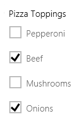
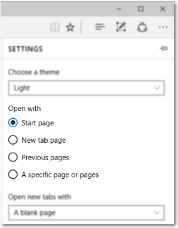
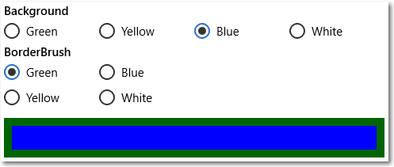

# <a name="radio-buttons"></a>라디오 단추

<link rel="stylesheet" href="https://az835927.vo.msecnd.net/sites/uwp/Resources/css/custom.css"> 

라디오 단추를 사용하면 두 가지 이상의 옵션 중 하나를 선택할 수 있습니다. 각 옵션은 하나의 라디오 단추로 표시됩니다. 사용자는 라디오 단추 그룹에서 하나의 라디오 단추만 선택할 수 있습니다.

> **중요 API**: [RadioButton 클래스](https://msdn.microsoft.com/library/windows/apps/br227544), [Checked 이벤트](https://msdn.microsoft.com/library/windows/apps/windows.ui.xaml.controls.primitives.togglebutton.checked.aspx), [IsChecked 속성](https://msdn.microsoft.com/library/windows/apps/windows.ui.xaml.controls.primitives.togglebutton.ischecked.aspx)

이름에 대해 궁금할 수 있는데, 라디오의 채널에 미리 설정된 단추에 라디오 단추의 이름이 지정됩니다.


## <a name="is-this-the-right-control"></a>올바른 컨트롤인가요?

라디오 단추를 사용하여 사용자에게 상호 배타적인 두 개 이상의 옵션을 제공합니다.


라디오 단추는 앱의 중요 옵션을 이해하기 쉽게 나타내어 한 차원 높여줍니다. 제공할 옵션이 중요하여 많은 화면 공간을 할당하고 선택 항목을 이해하여 쉽게 선택할 수 있는 명시적인 옵션이 요구되는 경우에 라디오 단추를 사용합니다.

라디오 단추는 모든 옵션을 똑같이 강조하므로 필요 이상으로 옵션에 주의를 끌 수도 있습니다. 옵션에 특별한 관심을 가질 필요가 있는 경우가 아니면 다른 컨트롤을 사용하는 것이 좋습니다. 예를 들어 대부분의 사용자가 대부분의 경우에 기본 옵션을 사용하는 것이 좋을 경우 [드롭다운 목록](lists.md)을 대신 사용하세요.

상호 배타적인 두 개의 옵션만 있는 경우 두 옵션을 하나의 [확인란](checkbox.md) 또는 [토글 스위치](toggles.md)로 결합합니다. 예를 들어 "동의함" 라디오 단추와 "동의 안 함" 라디오 단추를 각각 사용하는 대신 "동의함" 확인란을 사용합니다.


사용자가 여러 옵션을 선택할 수 있는 경우 대신 [확인란](checkbox.md) 또는 [목록 상자](lists.md) 컨트롤을 사용합니다.



옵션이 10, 20, 30과 같이 고정 단위를 가진 숫자인 경우에는 라디오 단추를 사용하지 마세요. 대신 [슬라이더](slider.md) 컨트롤을 사용합니다.

옵션이 9개 이상 있는 경우 대신 [드롭다운 목록](lists.md), 단일 선택 [목록 상자](lists.md) 또는 [목록 상자](lists.md)를 사용합니다.

사용 가능한 옵션이 앱의 현재 컨텍스트에 따라 달라지거나 동적으로 변경될 수 있는 경우 대신 단일 선택 [목록 상자](lists.md)를 사용하세요.

## <a name="example"></a>예제
Microsoft Edge 브라우저 설정의 라디오 단추입니다.



## <a name="create-a-radio-button"></a>라디오 단추 만들기

라디오 단추는 그룹으로 작동합니다. 다음 두 가지 방법으로 라디오 단추 컨트롤을 그룹화할 수 있습니다.
- 동일한 부모 컨테이너 내에 배치합니다.
- 각 라디오 단추의 [GroupName](https://msdn.microsoft.com/library/windows/apps/windows.ui.xaml.controls.radiobutton.groupname.aspx) 속성을 동일한 값으로 설정합니다.

> **참고**&nbsp;&nbsp;라디오 단추 그룹은 키보드를 통해 액세스한 경우 단일 컨트롤처럼 동작합니다. Tab 키를 사용하면 선택한 항목만 액세스할 수 있지만, 사용자가 화살표 키를 사용하면 그룹을 순환할 수 있습니다.

이 예제에서 첫 번째 라디오 단추 그룹은 동일한 스택 패널에 배치되어 암시적으로 그룹화됩니다. 두 번째 그룹은 두 스택 패널로 나뉘어 있으므로 GroupName별로 명시적으로 그룹화됩니다.

```xaml
<StackPanel>
    <StackPanel>
        <TextBlock Text="Background" Style="{ThemeResource BaseTextBlockStyle}"/>
        <StackPanel Orientation="Horizontal">
            <RadioButton Content="Green" Tag="Green" Checked="BGRadioButton_Checked"/>
            <RadioButton Content="Yellow" Tag="Yellow" Checked="BGRadioButton_Checked"/>
            <RadioButton Content="Blue" Tag="Blue" Checked="BGRadioButton_Checked"/>
            <RadioButton Content="White" Tag="White" Checked="BGRadioButton_Checked" IsChecked="True"/>
        </StackPanel>
    </StackPanel>
    <StackPanel>
        <TextBlock Text="BorderBrush" Style="{ThemeResource BaseTextBlockStyle}"/>
        <StackPanel Orientation="Horizontal">
            <StackPanel>
                <RadioButton Content="Green" GroupName="BorderBrush" Tag="Green" Checked="BorderRadioButton_Checked"/>
                <RadioButton Content="Yellow" GroupName="BorderBrush" Tag="Yellow" Checked="BorderRadioButton_Checked" IsChecked="True"/>
            </StackPanel>
            <StackPanel>
                <RadioButton Content="Blue" GroupName="BorderBrush" Tag="Blue" Checked="BorderRadioButton_Checked"/>
                <RadioButton Content="White" GroupName="BorderBrush" Tag="White"  Checked="BorderRadioButton_Checked"/>
            </StackPanel>
        </StackPanel>
    </StackPanel>
    <Border x:Name="BorderExample1" BorderThickness="10" BorderBrush="#FFFFD700" Background="#FFFFFFFF" Height="50" Margin="0,10,0,10"/>
</StackPanel>
```

```csharp
private void BGRadioButton_Checked(object sender, RoutedEventArgs e)
{
    RadioButton rb = sender as RadioButton;

    if (rb != null && BorderExample1 != null)
    {
        string colorName = rb.Tag.ToString();
        switch (colorName)
        {
            case "Yellow":
                BorderExample1.Background = new SolidColorBrush(Colors.Yellow);
                break;
            case "Green":
                BorderExample1.Background = new SolidColorBrush(Colors.Green);
                break;
            case "Blue":
                BorderExample1.Background = new SolidColorBrush(Colors.Blue);
                break;
            case "White":
                BorderExample1.Background = new SolidColorBrush(Colors.White);
                break;
        }
    }
}

private void BorderRadioButton_Checked(object sender, RoutedEventArgs e)
{
    RadioButton rb = sender as RadioButton;

    if (rb != null && BorderExample1 != null)
    {
        string colorName = rb.Tag.ToString();
        switch (colorName)
        {
            case "Yellow":
                BorderExample1.BorderBrush = new SolidColorBrush(Colors.Gold);
                break;
            case "Green":
                BorderExample1.BorderBrush = new SolidColorBrush(Colors.DarkGreen);
                break;
            case "Blue":
                BorderExample1.BorderBrush = new SolidColorBrush(Colors.DarkBlue);
                break;
            case "White":
                BorderExample1.BorderBrush = new SolidColorBrush(Colors.White);
                break;
        }
    }
}
```

라디오 단추 그룹의 모습은 다음과 같습니다.



라디오 단추에는 *selected* 또는 *cleared*의 두 가지 상태가 있습니다. 라디오 단추가 선택된 경우 해당 [IsChecked](https://msdn.microsoft.com/library/windows/apps/windows.ui.xaml.controls.primitives.togglebutton.ischecked.aspx) 속성은 **true**입니다. 라디오 단추가 선택 취소된 경우 해당 **IsChecked** 속성은 **false**입니다. 동일한 그룹의 다른 라디오 단추를 클릭하여 라디오 단추 선택을 취소할 수 있지만 다시 클릭하여 선택을 취소할 수는 없습니다. 그러나 IsChecked 속성을 **false**로 설정하여 프로그래밍 방식으로 라디오 단추 선택을 취소할 수 있습니다.

## <a name="recommendations"></a>권장 사항

-   라디오 단추 집합의 용도와 현재 상태가 명확한지 확인합니다.
-   사용자가 라디오 단추를 탭하면 항상 시각적 피드백이 제공됩니다.
-   사용자가 라디오 단추를 조작하면 시각적 피드백이 제공됩니다. 라디오 단추는 보통, 누름, 선택함, 사용 안 함 상태 중 하나입니다. 라디오 단추를 탭하여 관련 옵션을 활성화합니다. 활성화된 옵션을 탭해도 옵션이 비활성화되지 않지만 다른 옵션을 탭하면 해당 옵션이 활성화됩니다.
-   터치 피드백과 선택 상태에 대한 시각적 효과와 애니메이션이 예약되어 있습니다. 선택 취소된 라디오 단추 컨트롤은 사용되지 않거나 비활성화(사용 안 함 상태 아님)된 상태로 표시됩니다.
-   라디오 단추의 텍스트 콘텐츠를 한 줄로 제한합니다. 라디오 단추의 시각적 효과를 사용자 지정하여 옵션에 대한 설명을 기본 텍스트 줄 아래에 더 작은 글꼴 크기로 표시할 수 있습니다.
-   텍스트 콘텐츠가 동적인 경우 단추 크기를 조정하는 방법과 주위의 시각적 모양을 고려하세요.
-   브랜드 지침에 다른 글꼴을 사용하도록 규정되지 않은 경우 기본 글꼴을 사용합니다.
-   레이블을 탭하면 라디오 단추가 선택되도록 레이블 요소 내에 라디오 단추를 묶습니다.
-   레이블 텍스트를 라디오 단추 컨트롤 앞이나 위가 아닌 뒤에 배치합니다.
-   라디오 단추를 사용자 지정하는 것이 좋습니다. 기본적으로 라디오 단추는 약간의 텍스트 콘텐츠와 두 개의 동심원 즉, 채워진 내부 원(라디오 단추를 선택하면 표시됨)과 스트로크된 외부 원으로 구성되어 있습니다. 하지만 창의성을 발휘하세요. 사용자는 앱 콘텐츠를 직접적이고 쉽게 조작할 수 있습니다. 따라서 실제 콘텐츠를 그래픽, 텍스트 토글 단추 등으로 표시할 수 있습니다.
-   라디오 단추 그룹에 옵션을 9개 이상 넣지 마세요. 더 많은 옵션을 제공해야 하는 경우 대신 [드롭다운 목록](lists.md), [목록 상자](lists.md) 또는 [목록 보기](lists.md)를 사용하세요.
-   라디오 단추 두 개를 나란히 넣지 마세요. 두 라디오 단추 그룹이 나란히 배치된 경우 어느 단추가 어느 그룹에 속하는지 확인하는 데 어려움이 있습니다. 그룹 레이블을 사용하여 그룹을 분리합니다.

## <a name="additional-usage-guidance"></a>추가 사용법 지침

다음 그림에서는 라디오 단추를 배치하고 간격을 지정하는 적절한 방법을 보여 줍니다.


## <a name="related-topics"></a>관련 항목

**디자이너용**
- [단추에 대한 지침](buttons.md)
- [토글 스위치에 대한 지침](toggles.md)
- [확인란에 대한 지침](checkbox.md)
- [드롭다운 목록에 대한 지침](lists.md)
- [목록 보기 및 그리드 보기 컨트롤에 대한 지침](lists.md)
- [슬라이더에 대한 지침](slider.md)
- [선택 컨트롤에 대한 지침](lists.md)


**개발자용(XAML)**
- [Windows.UI.Xaml.Controls RadioButton 클래스](https://msdn.microsoft.com/library/windows/apps/br227544)
