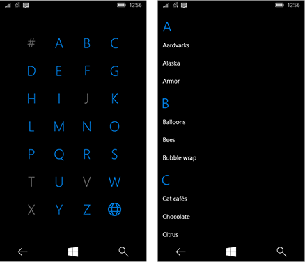

# <a name="semantic-zoom"></a>시맨틱 줌

<link rel="stylesheet" href="https://az835927.vo.msecnd.net/sites/uwp/Resources/css/custom.css"> 

시맨틱 줌을 사용하면 사용자가 그룹화된 큰 데이터 집합을 빠르게 탐색할 수 있도록 동일한 콘텐츠의 두 가지 보기 간을 전환할 수 있습니다.
 
- 확대 보기는 기본 콘텐츠 보기입니다. 개별 데이터 항목을 표시하는 기본 보기입니다. 
- 축소 보기는 동일한 콘텐츠의 상위 수준 보기입니다. 일반적으로 이 보기에서는 그룹화된 데이터 집합에 대해 그룹 헤더가 표시됩니다. 

예를 들어 주소록을 볼 때 사용자는 화면을 축소하여 "W" 문자로 신속하게 이동하거나, 화면을 확대하여 해당 문자와 연결된 이름을 확인할 수 있습니다. 

<div class="important-apis" >
<b>중요 API</b><br/>
<ul>
<li>[**SemanticZoom 클래스**](https://msdn.microsoft.com/library/windows/apps/hh702601)</li>
<li>[**ListView 클래스**](https://msdn.microsoft.com/library/windows/apps/xaml/windows.ui.xaml.controls.listview.aspx)</li>
<li>[**GridView 클래스**](https://msdn.microsoft.com/library/windows/apps/xaml/windows.ui.xaml.controls.gridview.aspx)</li>
</ul>
</div>

**기능**:

-   축소 보기의 크기는 시맨틱 줌 컨트롤의 범위에 의해 제한됩니다.
-   그룹 헤더를 탭하면 보기가 전환됩니다. 보기 간에 전환하는 방법으로 손가락 모으기를 사용할 수 있습니다.
-   활성 헤더는 보기 간에 전환합니다.

## <a name="is-this-the-right-control"></a>올바른 컨트롤인가요?

**SemanticZoom** 컨트롤은 하나 또는 두 페이지에 모두 표시할 수 없을 정도로 큰 그룹화된 데이터 집합 그룹을 표시해야 할 때 필요합니다.

시맨틱 줌을 광학 줌과 혼동하지 마세요. 두 확대 방식은 조작 방식과 기본 동작(확대 축소 비율에 따라 더 많이 또는 더 자세히 표시)은 같지만, 광학 줌은 사진처럼 개체나 콘텐츠 영역에 대해 배율을 조정하는 것을 의미합니다. 광학 줌을 수행하는 컨트롤에 대한 정보는 [**ScrollViewer**](https://msdn.microsoft.com/library/windows/apps/windows.ui.xaml.controls.scrollviewer.aspx) 컨트롤을 참조하세요.

## <a name="examples"></a>예제

**사진 앱**

사진 앱에 사용된 시맨틱 줌은 다음과 같습니다. 사진은 월별로 그룹화됩니다. 기본 그리드 보기에서 월 머리글을 선택하면 더 빠른 탐색을 위해 월 목록 보기로 화면이 축소됩니다.


**주소록**

주소록은 시맨틱 줌을 사용하여 훨씬 더 쉽게 탐색할 수 있는 데이터 집합의 또 다른 예입니다. 축소 보기를 사용하여 원하는 문자로 신속하게 이동하거나(왼쪽 이미지) 확대 보기를 사용하여 개별 데이터 항목을 표시할 수 있습니다(오른쪽 이미지).



## <a name="create-a-semantic-zoom"></a>시맨틱 줌 만들기

**SemanticZoom** 컨트롤은 자체적인 시각적 표현이 없습니다. 콘텐츠 보기를 제공하는 두 가지 다른 컨트롤(일반적으로 **ListView** 또는 **GridView** 컨트롤) 간의 전환을 관리하는 호스트 컨트롤입니다.  보기 컨트롤을 SemanticZoom의 [**ZoomedInView**](https://msdn.microsoft.com/library/windows/apps/xaml/windows.ui.xaml.controls.semanticzoom.zoomedinview.aspx) 및 [**ZoomedOutView**](https://msdn.microsoft.com/library/windows/apps/xaml/windows.ui.xaml.controls.semanticzoom.zoomedoutview.aspx) 속성으로 설정합니다.

시맨틱 줌에 필요한 3가지 요소는 다음과 같습니다.
- 그룹화된 데이터 원본
- 항목 수준의 데이터를 보여 주는 확대 보기
- 그룹 수준의 데이터를 보여 주는 축소 보기

시맨틱 줌을 사용하기 전에 그룹화된 데이터를 사용하여 목록 보기를 사용하는 방법을 이해해야 합니다. 자세한 내용은 [목록 보기 및 그리드 보기](listview-and-gridview.md) 및 [목록의 항목 그룹화]()를 참조하세요. 

> **참고**&nbsp;&nbsp;SemanticZoom 컨트롤의 확대 보기와 축소 보기를 정의하려면 [**ISemanticZoomInformation**]() 인터페이스를 구현하는 두 개의 컨트롤을 사용할 수 있습니다. XAML 프레임워크는 이 인터페이스를 구현하는 세 가지 컨트롤(ListView, GridView 및 Hub)을 제공합니다.
 
 이 XAML은 SemanticZoom 컨트롤의 구조를 보여 줍니다. ZoomedInView 및 ZoomedOutView 속성에 다른 컨트롤을 할당합니다.
 
 **XAML**
 ```xaml
<SemanticZoom>
    <SemanticZoom.ZoomedInView>
        <!-- Put the GridView for the zoomed out view here. -->   
    </SemanticZoom.ZoomedInView>

    <SemanticZoom.ZoomedOutView>
        <!-- Put the ListView for the zoomed in view here. -->       
    </SemanticZoom.ZoomedOutView>
</SemanticZoom>
 ```
 
다음 예제에서는 [XAML UI 기본 사항 샘플](http://go.microsoft.com/fwlink/p/?LinkId=619992)의 SemanticZoom 페이지에서 가져온 것입니다. 샘플을 다운로드하여 데이터 원본을 비롯한 전체 코드를 볼 수 있습니다. 이 시맨틱 줌은 GridView를 사용하여 확대 보기를 제공하고 ListView를 사용하여 축소 보기를 제공합니다.
  
**확대 보기 정의**

확대 보기의 GridView 컨트롤은 다음과 같습니다. 확대 보기에는 그룹의 개별 데이터 항목이 표시됩니다. 이 예제에서는 이미지 및 텍스트를 사용하여 항목을 그리드에 표시하는 방법을 보여 줍니다. 

**XAML**
```xaml
<SemanticZoom.ZoomedInView>
    <GridView ItemsSource="{x:Bind cvsGroups.View}" 
              ScrollViewer.IsHorizontalScrollChainingEnabled="False" 
              SelectionMode="None" 
              ItemTemplate="{StaticResource ZoomedInTemplate}">
        <GridView.GroupStyle>
            <GroupStyle HeaderTemplate="{StaticResource ZoomedInGroupHeaderTemplate}"/>
        </GridView.GroupStyle>
    </GridView>
</SemanticZoom.ZoomedInView>
```
 
그룹 헤더의 모양은 `ZoomedInGroupHeaderTemplate` 리소스에 정의되어 있습니다. 항목의 모양은 `ZoomedInTemplate` 리소스에 정의되어 있습니다. 

**XAML**   
```xaml
<DataTemplate x:Key="" x:DataType="data:ControlInfoDataGroup">
    <TextBlock Text="{x:Bind Title}" 
               Foreground="{ThemeResource ApplicationForegroundThemeBrush}" 
               Style="{StaticResource SubtitleTextBlockStyle}"/>
</DataTemplate>

<DataTemplate x:Key="ZoomedInTemplate" x:DataType="data:ControlInfoDataItem">
    <StackPanel Orientation="Horizontal" MinWidth="200" Margin="12,6,0,6">
        <Image Source="{x:Bind ImagePath}" Height="80" Width="80"/>
        <StackPanel Margin="20,0,0,0">
            <TextBlock Text="{x:Bind Title}" 
                       Style="{StaticResource BaseTextBlockStyle}"/>
            <TextBlock Text="{x:Bind Subtitle}" 
                       TextWrapping="Wrap" HorizontalAlignment="Left" 
                       Width="300" Style="{StaticResource BodyTextBlockStyle}"/>
        </StackPanel>
    </StackPanel>
</DataTemplate>
```

**축소 보기 정의**

이 XAML은 축소 보기의 ListView 컨트롤을 정의합니다. 이 예제에서는 그룹 헤더를 목록의 텍스트로 표시하는 방법을 보여 줍니다.

**XAML**
```xaml
<SemanticZoom.ZoomedOutView>
    <ListView ItemsSource="{x:Bind cvsGroups.View.CollectionGroups}" 
              SelectionMode="None" 
              ItemTemplate="{StaticResource ZoomedOutTemplate}" />
</SemanticZoom.ZoomedOutView>
```

 모양은 `ZoomedOutTemplate` 리소스에 정의되어 있습니다.
 
 **XAML**   
```xaml    
<DataTemplate x:Key="ZoomedOutTemplate" x:DataType="wuxdata:ICollectionViewGroup">
    <TextBlock Text="{x:Bind Group.(data:ControlInfoDataGroup.Title)}" 
               Style="{StaticResource SubtitleTextBlockStyle}" TextWrapping="Wrap"/>
</DataTemplate>
```

**보기 동기화**

확대 보기 및 축소 보기를 동기화해야 하므로 사용자가 축소 보기에서 그룹을 선택하면 동일한 그룹의 세부 정보가 확대 보기에 표시됩니다. [**CollectionViewSource**](https://msdn.microsoft.com/library/windows/apps/xaml/windows.ui.xaml.data.collectionviewsource.aspx)를 사용하거나 코드를 추가하여 보기를 동기화할 수 있습니다.

동일한 CollectionViewSource에 바인딩되는 모든 컨트롤은 항상 현재 항목이 동일합니다. 두 보기에서 동일한 CollectionViewSource를 데이터 원본으로 사용하는 경우 CollectionViewSource가 자동으로 보기를 동기화합니다. 자세한 내용은 [**CollectionViewSource**](https://msdn.microsoft.com/library/windows/apps/xaml/windows.ui.xaml.data.collectionviewsource.aspx)를 참조하세요.

CollectionViewSource를 사용하여 보기를 동기화하지 않는 경우 [**ViewChangeStarted**](https://msdn.microsoft.com/library/windows/apps/xaml/windows.ui.xaml.controls.semanticzoom.viewchangestarted.aspx) 이벤트를 처리하고 이벤트 처리기에서 다음과 같이 항목을 동기화해야 합니다.

**XAML**
```xaml
<SemanticZoom x:Name="semanticZoom" ViewChangeStarted="SemanticZoom_ViewChangeStarted">
```

**C#**
```csharp
private void SemanticZoom_ViewChangeStarted(object sender, SemanticZoomViewChangedEventArgs e)
{
    if (e.IsSourceZoomedInView == false)
    {
        e.DestinationItem.Item = e.SourceItem.Item;
    }
}
```

## <a name="recommendations"></a>권장 사항

-   앱에서 시맨틱 줌을 사용하는 경우 항목 레이아웃 및 이동 방향이 확대/축소 수준에 따라 변경되지 않아야 합니다. 레이아웃 및 이동 조작 방식은 확대/축소 수준이 달라져도 일관되고 예측 가능해야 합니다.
-   시맨틱 줌을 사용하면 콘텐츠로 신속하게 이동할 수 있으므로 축소 모드에서는 페이지/화면 수를 3개 이내로 제한합니다. 이동을 너무 많이 하면 시맨틱 줌의 실용성이 떨어집니다.
-   시맨틱 줌을 사용하여 콘텐츠 범위를 변경하지 않도록 합니다. 예를 들어 사진 앨범은 파일 탐색기에서 폴더 보기로 전환되지 않아야 합니다.
-   보기에 필수적인 구조 및 의미 체계를 사용합니다.
-   그룹화된 모음에 포함된 항목에는 그룹 이름을 사용합니다.
-   그룹화되지 않았지만 정렬된 컬렉션에는 정렬 순서(예: 날짜의 경우 시간순 또는 명단의 경우 사전순)를 사용합니다.


## <a name="get-the-sample-code"></a>샘플 코드 다운로드

- [XAML UI 기본 사항 샘플](http://go.microsoft.com/fwlink/p/?LinkId=619992)


## <a name="related-articles"></a>관련 문서

- [탐색 디자인 기본 사항](../layout/navigation-basics.md)
- [목록 보기 및 그리드 보기](listview-and-gridview.md)
- [목록 보기 항목 템플릿](listview-item-templates.md)


