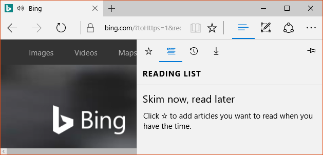

# 분할 보기 컨트롤

<link rel="stylesheet" href="https://az835927.vo.msecnd.net/sites/uwp/Resources/css/custom.css"> 

분할 보기 컨트롤에는 확장/축소 가능한 창 및 콘텐츠 영역이 있습니다.

<b>중요 API</b> 
<ul>
<li><a href="https://msdn.microsoft.com/library/windows/apps/dn864360"><strong>SplitView 클래스(XAML)</strong></a></li>
<li><a href="https://msdn.microsoft.com/library/windows/apps/dn919970"><strong>SplitView 개체(HTML)</strong></a></li>
</ul>

 분할 보기의 콘텐츠 영역은 항상 표시됩니다. 창은 확장하거나 축소할 수 있으며, 앱 창의 왼쪽 또는 오른쪽에 표시할 수 있습니다. 창에는 다음과 같은 네 가지 모드가 있습니다.

-   **오버레이**

    창이 열릴 때까지 표시되지 않습니다. 열린 창은 콘텐츠 영역을 오버레이합니다.

-   **인라인**

    창이 항상 표시되며 콘텐츠 영역을 오버레이하지 않습니다. 창 및 콘텐츠 영역이 사용 가능한 화면 공간을 나눕니다.

-   **CompactOverlay**

    창의 좁은 부분이 항상 이 모드로 표시되며 아이콘을 표시할 정도의 공간만 사용합니다. 닫힌 창의 기본 너비는 48px이며, `CompactPaneLength`에서 수정할 수 있습니다. 창이 열리면 콘텐츠 영역을 오버레이합니다.

-   **CompactInline**

    창의 좁은 부분이 항상 이 모드로 표시되며 아이콘을 표시할 정도의 공간만 사용합니다. 닫힌 창의 기본 너비는 48px이며, `CompactPaneLength`에서 수정할 수 있습니다. 창이 열릴 경우 콘텐츠에서 사용 가능한 공간이 줄어 들어 콘텐츠를 가리게 됩니다.

## 올바른 컨트롤인가요?

분할 보기 컨트롤은 [탐색 창](nav-pane.md)을 만드는 데 사용할 수 있습니다. 이 패턴을 구성하려면 확장/축소 단추("햄버거" 단추) 및 탐색 항목을 나타내는 목록 보기를 추가합니다.

또한 분할 보기 컨트롤을 사용하여 사용자가 보조 창을 여닫을 수 있는 "서랍" 환경을 만들 수 있습니다.

## 예

기본 양식의 분할 보기 컨트롤은 기본 컨테이너입니다. 다음은 SplitView를 사용하여 허브를 표시하는 Microsoft Edge 앱 예제입니다.

## 관련 항목

* [탐색 창 패턴](nav-pane.md)
* [목록 보기](lists.md)
 

 

<!--HONumber=Aug16_HO3-->

