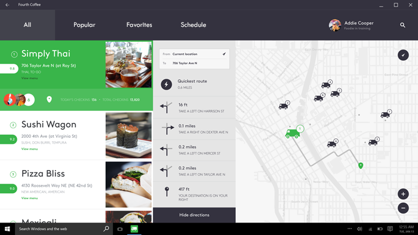

# 탭 및 피벗

탭 및 피벗은 자주 액세스되며 뚜렷이 다른 콘텐츠 범주를 탐색하는 데 사용됩니다. 탭/피벗 패턴은 해당 범주 헤더가 있는 둘 이상의 콘텐츠 창으로 구성됩니다. 헤더는 화면상에 유지되며 명확하게 표시되는 선택 상태가 있으므로 사용자는 현재 범주를 인식할 수 있습니다.


탭과 피벗은 실질적으로 동일한 패턴이며, 둘 다 [**피벗**](https://msdn.microsoft.com/library/windows/apps/xaml/windows.ui.xaml.controls.pivot.aspx) 컨트롤을 사용하여 빌드됩니다. 피벗 컨트롤의 기본 기능은 이 문서의 뒷부분에서 설명합니다.

<span class="sidebar_heading" style="font-weight: bold;">중요 API</span>

-   [**Pivot 클래스**](https://msdn.microsoft.com/library/windows/apps/dn608241)

## 탭/피벗 패턴

탭/피벗 패턴을 사용하여 앱을 빌드할 경우 패턴의 구성 가능한 기능 집합에 따라 고려할 주요 디자인 변수가 몇 가지 있습니다.

- **헤더 배치.**   헤더는 화면의 맨 위 또는 맨 아래에 배치할 수 있습니다.
    
    **참고**&nbsp;&nbsp;화면의 맨 아래에 헤더를 배치하려면 Pivot 컨트롤을 다시 템플릿으로 작성해야 합니다.
- **헤더 레이블.**  헤더에는 텍스트가 있는 아이콘이 있거나 텍스트만 있거나 아이콘만 있을 수 있습니다.
- **헤더 맞춤.**  헤더에는 왼쪽 맞춤 또는 가운데 맞춤을 적용할 수 있습니다.
- **최상위 또는 하위 수준 탐색.**  탭/피벗은 두 탐색 수준에 사용할 수 있으며, 최상위/하위 수준 패턴으로 배치할 수 있습니다. 탭/피벗의 두 수준이 있는 경우 사용자가 두 수준을 확실하게 구분할 수 있도록 최상위 및 하위 수준 헤더에 충분한 시각적 차이가 있어야 합니다.
- **터치 제스처 지원.**  터치 제스처를 지원하는 디바이스의 경우 다음 두 조작 집합 중 하나를 사용하여 콘텐츠 범주 간에 탐색할 수 있습니다.
    1. 해당 범주를 탐색하려면 탭/피벗 헤더를 탭하거나 인접한 범주를 탐색하려면 콘텐츠 영역에서 살짝 밉니다.
    2. 해당 범주를 탐색하려면 탭/피벗 헤더를 탭 합니다(살짝 밀기 없음).

### 패턴 구성

탭/피벗 패턴의 최적 정렬은 조작 시나리오 및 앱이 표시될 디바이스에 따라 달라집니다. 다음 표는 몇 가지 최상의 시나리오 및 패턴 구성을 설명하고 있습니다.

조작 시나리오|권장 구성
--------------------|-------------------------
휴대폰 또는 패블릿에서 2-5개의 최상위 목록 또는 그리드 보기 콘텐츠 범주 간에 수평으로 이동|탭/피벗: 화면의 맨 위에 배치, 가운데 맞춤
|헤더 레이블: 아이콘 + 텍스트
|콘텐츠 영역에서 살짝 밀기: 사용
콘텐츠 영역에서 살짝 밀기가 탐색에 도움이 되지 않는 휴대폰 또는 패블릿에서 다양한 콘텐츠 범주 간 이동|탭/피벗: 화면의 맨 아래에 배치, 가운데 맞춤
|헤더 레이블: 아이콘 + 텍스트
|콘텐츠 영역에서 살짝 밀기: 사용 안 함
마우스와 키보드를 사용하여 최상위 탐색|탭/피벗: 화면의 맨 위에 배치, 왼쪽 맞춤
 *또는*|헤더 레이블: 텍스트만
 터치 디바이스에서 페이지 수준 탐색|콘텐츠 영역에서 살짝 밀기: 사용 안 함

## 예제

이 푸드 트럭 앱의 디자인은 탭/피벗 헤더를 맨 위 또는 맨 아래에 배치하면 어떤 모습으로 표시되는지 보여 줍니다. 모바일 디바이스에서 탭/피벗 헤더를 맨 아래에 배치하면 도달 효율성이 좋습니다.


노트북/데스크톱의 푸드 트럭 앱 디자인은 텍스트만 있는 헤더를 사용합니다. 헤더에 텍스트가 있는 아이콘을 사용하면 대상을 터치하는 데 도움이 되지만, 마우스 및 키보드를 사용하는 경우 텍스트만 있는 헤더가 더 원활하게 작동합니다.



## 피벗 컨트롤 만들기

탭/피벗 탐색 패턴은 [**피벗**](https://msdn.microsoft.com/library/windows/apps/xaml/windows.ui.xaml.controls.pivot.aspx) 컨트롤을 사용하여 빌드됩니다. 컨트롤은 이 섹션에서 설명한 기본 기능과 함께 제공됩니다.

이 XAML은 3개의 콘텐츠 섹션이 있는 기본 피벗 컨트롤을 만듭니다.

```xaml
<Pivot x:Name="rootPivot" Title="PIVOT TITLE">
    <PivotItem Header="Pivot Item 1">
        <!--Pivot content goes here-->
        <TextBlock Text="Content of pivot item 1."/>
    </PivotItem>
    <PivotItem Header="Pivot Item 2">
        <!--Pivot content goes here-->
        <TextBlock Text="Content of pivot item 2."/>
    </PivotItem>
    <PivotItem Header="Pivot Item 3">
        <!--Pivot content goes here-->
        <TextBlock Text="Content of pivot item 3."/>
    </PivotItem>
</Pivot>
```

**피벗 항목**

피벗은 [**ItemsControl**](https://msdn.microsoft.com/library/windows/apps/xaml/windows.ui.xaml.controls.itemscontrol.aspx)이므로 모든 유형의 항목 컬렉션을 포함할 수 있습니다. 피벗에 추가한 항목 중 명시적으로 [**PivotItem**](https://msdn.microsoft.com/library/windows/apps/xaml/windows.ui.xaml.controls.pivotitem.aspx)이 아닌 항목은 모두 PivotItem에 암시적으로 래핑됩니다. 피벗은 콘텐츠 페이지 간 탐색에 사용되는 경우가 많기 때문에 [**Items**](https://msdn.microsoft.com/library/windows/apps/xaml/windows.ui.xaml.controls.itemscontrol.items.aspx) 컬렉션에 XAML UI 요소를 직접 채우는 것이 일반적입니다. 또는 데이터 원본에 [**ItemsSource**](https://msdn.microsoft.com/library/windows/apps/xaml/windows.ui.xaml.controls.itemscontrol.itemssource.aspx) 속성을 설정할 수 있습니다. ItemsSource에 바인딩된 항목은 임의 유형일 수 있지만 명시적으로 PivotItems가 아닌 경우 [**ItemTemplate**](https://msdn.microsoft.com/library/windows/apps/xaml/windows.ui.xaml.controls.itemscontrol.itemtemplate.aspx) 및 [**HeaderTemplate**](https://msdn.microsoft.com/library/windows/apps/xaml/windows.ui.xaml.controls.pivot.headertemplate.aspx)을 정의하여 항목의 표시 방법을 지정해야 합니다.

[
            **SelectedItem**](https://msdn.microsoft.com/library/windows/apps/xaml/windows.ui.xaml.controls.pivot.selecteditem.aspx) 속성을 사용하여 피벗의 활성 항목을 가져오거나 설정할 수 있습니다. 활성 항목의 인덱스를 설정하려면 [**SelectedIndex**](https://msdn.microsoft.com/library/windows/apps/xaml/windows.ui.xaml.controls.pivot.selectedindex.aspx) 속성을 사용합니다. 

**피벗 헤더**

[
            **LeftHeader**](https://msdn.microsoft.com/library/windows/apps/xaml/windows.ui.xaml.controls.pivot.leftheader.aspx) 및 [**RightHeader**](https://msdn.microsoft.com/library/windows/apps/xaml/windows.ui.xaml.controls.pivot.rightheader.aspx) 속성을 사용하여 피벗 헤더에 다른 컨트롤을 추가할 수 있습니다. 

### 피벗 조작

컨트롤을 통해 다음 터치 제스처 조작 기능을 사용할 수 있습니다.

-   헤더를 탭하면 해당 헤더의 섹션 콘텐츠로 이동합니다.
-   헤더를 왼쪽 또는 오른쪽으로 살짝 밀면 인접한 헤더/섹션으로 이동합니다.
-   섹션 콘텐츠에서 왼쪽 또는 오른쪽으로 살짝 밀면 인접한 헤더/섹션으로 이동합니다.

컨트롤은 다음 두 모드를 제공합니다.

**고정**

-   모든 피벗 헤더가 허용되는 공간 내에 맞는 경우 피벗은 고정됩니다.
-   피벗 레이블을 탭하면 피벗 자체는 움직이지 않지만, 해당 페이지로 이동합니다. 활성 피벗이 강조 표시됩니다.

**회전**

-   모든 피벗 헤더가 허용되는 공간 내에 맞지 않는 경우 피벗이 회전합니다.
-   피벗 레이블을 탭하면 해당 페이지로 이동하며 활성 피벗 레이블이 첫 번째 위치로 회전합니다.

컨트롤에는 헤더의 수 및 레이블의 문자열 길이를 기반으로 하는 기본 제공 중단점 기능이 있습니다.

## 권장 사항

-   탭/피벗 헤더의 맞춤은 화면 크기를 기준으로 합니다. 일반적으로 화면 너비가 720epx 이하인 경우 가운데 맞춤이 효과적이며 대부분의 경우 화면 너비가 720epx 이상인 경우 왼쪽 맞춤이 좋습니다.
-   창 크기 조정 시 탭/피벗 헤더 수가 사용 가능한 공간을 초과하면 오버플로 영역으로 헤더를 밀기 시작합니다.
-   탭/피벗은 두 화면 방향으로 사용할 수 있지만, 가로와 세로 방향 둘 다에서 동일한 전체 헤더 수(표시되고 숨겨진)를 유지해야 합니다.
-   회전(왕복) 모드를 사용할 경우 5개를 초과하는 헤더를 사용하면 사용자가 방향을 잃을 수 있으므로 5개를 초과하는 헤더를 사용하지 않도록 합니다.
-   모바일 디바이스에서 탭/피벗을 맨 아래에 배치하면 도달 효율성이 좋으며, UI의 다른 부분에서 살짝 밀기를 사용하는 경우 맨 위에 UI가 몰리는 것을 피할 수 있습니다.
-   화상 키보드를 사용하는 경우 공간을 유지하기 위해 헤더가 화면 밖으로 이동할 수 있습니다.

\[이 문서에는 UWP(유니버설 Windows 플랫폼) 앱 및 Windows 10과 관련된 정보가 있습니다. Windows 8.1 참고 자료는 [Windows 8.1 지침 PDF](https://go.microsoft.com/fwlink/p/?linkid=258743)를 다운로드하세요.\]

## 관련 항목

[탐색 디자인 기본 사항](https://msdn.microsoft.com/library/windows/apps/dn958438)


<!--HONumber=Mar16_HO1-->


