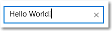

# 텍스트 컨트롤

<link rel="stylesheet" href="https://az835927.vo.msecnd.net/sites/uwp/Resources/css/custom.css"> 

텍스트 컨트롤은 텍스트 입력란, 암호 상자, 자동 제안 상자 및 텍스트 블록으로 구성됩니다. XAML 프레임워크는 텍스트를 렌더링, 입력 및 편집하는 여러 개의 컨트롤과 텍스트 서식을 지정하는 속성 집합을 제공합니다.

- 읽기 전용 텍스트를 표시하는 컨트롤은 [TextBlock](text-block.md) 및 [RichTextBlock](rich-text-block.md)입니다.
- 텍스트 입력 및 편집에 대한 컨트롤은 [TextBox](text-box.md), [AutoSuggestBox](auto-suggest-box.md), [PasswordBox](password-box.md) 및 [RichEditBox](rich-edit-box.md)입니다.


<div class="important-apis" >
<b>중요 API</b><br/>
<ul>
<li><a href="https://msdn.microsoft.com/library/windows/apps/xaml/windows.ui.xaml.controls.autosuggestbox.aspx"><strong>AutoSuggestBox 클래스</strong></a></li>
<li><a href="https://msdn.microsoft.com/library/windows/apps/xaml/windows.ui.xaml.controls.passwordbox.aspx"><strong>PasswordBox 클래스</strong></a></li>
<li><a href="https://msdn.microsoft.com/library/windows/apps/xaml/windows.ui.xaml.controls.richeditbox.aspx"><strong>RichEditBox 클래스</strong></a></li>
<li><a href="https://msdn.microsoft.com/library/windows/apps/xaml/windows.ui.xaml.controls.richtextblock.aspx"><strong>RichTextBlock 클래스</strong></a></li>
<li><a href="https://msdn.microsoft.com/library/windows/apps/xaml/windows.ui.xaml.controls.textblock.aspx"><strong>TextBlock 클래스</strong></a></li>
<li><a href="https://msdn.microsoft.com/library/windows/apps/xaml/windows.ui.xaml.controls.textbox.aspx"><strong>TextBox 클래스</strong></a></li>
</ul>

</div>
</div>


## 올바른 컨트롤인가요?

사용하는 텍스트 컨트롤은 시나리오에 따라 다릅니다. 이 정보를 사용하여 앱에서 사용할 올바른 텍스트 컨트롤을 선택합니다.

### 읽기 전용 텍스트 렌더링

앱에서 대부분의 읽기 전용 텍스트를 표시하려면 **TextBlock**을 사용합니다. 이 컨트롤을 사용하여 한 줄 또는 여러 줄 텍스트, 인라인 하이퍼링크 및 굵게, 기울임꼴 또는 밑줄 서식이 적용된 텍스트를 표시할 수 있습니다.

TextBlock은 일반적으로 RichTextBlock보다 사용하기 쉬우며 더 나은 텍스트 렌더링 성능을 제공하므로 대부분의 앱 UI 텍스트에서 기본으로 설정됩니다. [Text](https://msdn.microsoft.com/library/windows/apps/xaml/windows.ui.xaml.controls.textblock.text.aspx) 속성의 값을 가져와 앱에서 TextBlock의 텍스트에 쉽게 액세스하고 사용할 수 있습니다.

또한 텍스트가 렌더링되는 방식을 사용자 지정할 수 있도록 동일한 서식 옵션을 여러 개 제공합니다. 텍스트에 줄 바꿈을 넣을 수는 있지만, TextBlock은 단일 단락을 표시하도록 디자인되었으며 텍스트 들여쓰기를 지원하지 않습니다.

여러 단락, 다중 열 텍스트 또는 기타 복잡한 텍스트 레잉아웃, 이미지와 같은 인라인 UI 요소에 대한 지원이 필요한 경우 **RichTextBlock**을 사용하세요. RichTextBlock은 고급 텍스트 레이아웃에 대한 여러 기능을 제공합니다.

RichTextBlock의 콘텐츠 속성은 [Paragraph](https://msdn.microsoft.com/library/windows/apps/xaml/windows.ui.xaml.documents.paragraph.aspx) 요소를 통해 단락 기반 텍스트를 지원하는 [Blocks](https://msdn.microsoft.com/library/windows/apps/xaml/windows.ui.xaml.controls.richtextblock.blocks.aspx) 속성입니다. 쉽게 앱에서 컨트롤의 텍스트 콘텐츠에 액세스하는 데 사용할 수 있는 **Text** 속성이 없습니다.  

### 텍스트 입력

사용자가 양식 등에서 서식 없는 텍스트를 입력하고 편집할 수 있게 하려면 **TextBox** 컨트롤을 사용합니다. [Text](https://msdn.microsoft.com/library/windows/apps/xaml/windows.ui.xaml.controls.textbox.text.aspx) 속성을 사용하여 TextBox에 텍스트를 가져오고 설정할 수 있습니다.

TextBox를 읽기 전용으로 만들 수 있지만 일시적인 조건부 상태여야 합니다. 텍스트를 편집할 수 없는 경우 TextBlock을 대신 사용하는 것이 좋습니다.

**PasswordBox** 컨트롤을 사용하여 암호 또는 주민 등록 번호 등의 기타 개인 데이터를 수집합니다. 암호 상자는 개인 정보 보호를 위해 입력된 문자를 숨기는 텍스트 입력란입니다. 암호 상자는 텍스트 입력란처럼 보이지만 입력된 텍스트 대신 글머리 기호를 렌더링합니다. 글머리 기호 문자는 사용자 지정 가능합니다.

입력 시 선택할 제안 목록을 사용자에게 표시하려면 **AutoSuggestBox**를 사용합니다. 자동 제안 상자는 기본 검색 제안 목록을 트리거하는 텍스트 입력란입니다. 제안된 단어는 인기 있는 검색 단어와 이전에 사용자가 입력한 단어의 조합에서 뽑을 수 있습니다.

검색 상자를 구현하는 경우에도 AutoSuggestBox 컨트롤을 사용해야 합니다.

텍스트 파일을 표시하고 편집하려면 **RichEditBox**를 사용합니다. 다른 표준 텍스트 입력란을 사용하는 방식으로 사용자 입력을 앱으로 가져오기 위해 RichEditBox를 사용하지 마세요. 대신, 앱과 분리된 텍스트 파일 작업에 사용합니다. 일반적으로 RichEditBox에 입력된 텍스트는 .rtf 파일에 저장합니다.

**텍스트 입력이 최상의 옵션인가요?**

앱에서 사용자 입력을 가져올 수 있는 방법에는 여러 가지가 있습니다. 이러한 질문은 표준 텍스트 입력란 또는 다른 컨트롤 중 하나가 사용자 입력을 가져오는 데 가장 적합한지 여부를 결정하는 데 도움이 됩니다.

-   **유효한 값을 모두 효율적으로 열거하는 것이 효과적인가요?** 그렇다면 선택 컨트롤(예: [확인란](checkbox.md), [드롭다운 목록](lists.md), 목록 상자 [라디오 단추](radio-button.md), [슬라이더](slider.md), [토글 스위치](toggles.md), [날짜 선택기](date-and-time.md), 또는 시간 선택기) 중 하나를 사용하는 것이 좋습니다.
-   **유효한 값 집합이 매우 적은가요?** 이때 값이 일부 문자 길이보다 큰 경우 [드롭다운 목록](lists.md) 또는 목록 상자를 사용하는 것이 좋습니다.
-   **유효한 데이터는 아무런 제약이 없나요? 아니면 형식에 의해서만 제약을 받나요(길이 제한 또는 문자 형식 제한)?** 그렇다면 텍스트 입력 컨트롤을 사용합니다. 입력할 수 있는 문자 수를 제한하고 앱 코드 형식의 유효성을 검사할 수 있습니다.
-   **값이 특수한 공통 컨트롤이 있는 데이터 형식을 나타내나요?** 그렇다면 텍스트 입력 컨트롤 대신 적절한 컨트롤을 사용합니다. 예를 들어 데이터 입력을 수락하려면 텍스트 입력 컨트롤 대신 [**DatePicker**](https://msdn.microsoft.com/library/windows/apps/br211681)를 사용합니다.
-   데이터가 엄격히 숫자인 경우
    -   **값을 근사값 및/또는 동일한 페이지에 있는 다른 수량을 기준으로 입력하나요?** 그렇다면 [슬라이더](slider.md)를 사용하세요.
    -   **설정을 변경하면 어떤 효과가 있는지에 대해 즉각적인 피드백을 받게 되면 사용자에게 이익이 되나요?** 그렇다면 함께 표시되는 컨트롤과 함께 [슬라이더](slider.md)를 사용하세요.
    -   **결과를 확인한 후 입력한 값을 조정할 수 있나요(예: 볼륨 또는 화면 밝기)?** 그렇다면 [슬라이더](slider.md)를 사용하세요.

## 예

입력란



자동 제안 상자


비밀번호 상자


## 텍스트 컨트롤 만들기

각 텍스트 컨트롤과 관련된 정보와 예제는 다음 문서를 참조하세요.

-   [**AutoSuggestBox**](auto-suggest-box.md)
-   [**PasswordBox**](password-box.md)
-   [**RichEditBox**](rich-edit-box.md)
-   [**RichTextBlock**](rich-text-block.md)
-   [**TextBlock**](text-block.md)
-   [**TextBox**](text-box.md)

## 글꼴 및 스타일 지침
글꼴 지침은 다음 문서를 참조하세요.

- [**글꼴 지침**](fonts.md)
- [**Segoe MDL2 아이콘 목록 및 지침**](segoe-ui-symbol-font.md)


## 텍스트 컨트롤에 맞는 키보드를 선택합니다.

**적용 대상:** TextBox, PasswordBox RichEditBox

사용자가 입력할 것으로 예상되는 데이터 종류와 일치하도록 텍스트 컨트롤의 입력 범위를 설정하여 터치 키보드나 SIP(Soft Input Panel)를 사용한 데이터 입력을 도울 수 있습니다.

>팁 이 정보는 SIP에만 적용됩니다. Windows 접근성 옵션에서 제공되는 화상 키보드 또는 하드웨어 키보드에는 적용되지 않습니다.

터치 키보드는 앱이 터치 스크린이 있는 디바이스에서 실행될 때 텍스트 입력에 사용할 수 있습니다. 터치 키보드는 사용자가 TextBox 또는 RichEditBox 같이 편집 가능한 입력 필드를 탭할 때 호출됩니다. 사용자가 입력할 것으로 예상되는 데이터 종류와 일치하도록 텍스트 컨트롤의 입력 범위를 설정하여 사용자가 앱에서 데이터를 쉽고 빠르게 입력할 수 있도록 지원할 수 있습니다. 입력 범위는 시스템에서 해당 입력 형식에 맞는 특수한 터치 키보드를 제공할 수 있도록 컨트롤에서 예상되는 텍스트 입력 형식에 대한 힌트를 시스템에 제공합니다.

예를 들어 텍스트 상자가 4자리 숫자의 PIN을 입력하는 목적으로만 사용될 경우 [InputScope](https://msdn.microsoft.com/library/windows/apps/xaml/windows.ui.xaml.controls.textbox.inputscope.aspx) 속성을 **Number**로 설정합니다. 이렇게 하면 사용자가 PIN을 쉽게 입력할 수 있도록 시스템에서 숫자 키패드 레이아웃이 표시됩니다.

>중요  
>입력 범위는 입력 유효성 검사가 수행되지 않으며 사용자가 하드웨어 키보드 또는 다른 입력 디바이스를 사용해서 입력을 제공하지 못하도록 방지하지 않습니다. 따라서 필요에 따라 입력 코드에 대한 유효성을 검사해야 합니다.

자세한 내용은 [입력 범위를 사용해서 터치 키보드 변경](https://msdn.microsoft.com/library/windows/apps/mt280229)을 참조하세요.

## 컬러 글꼴

**적용 대상:** TextBlock, RichTextBlock, TextBox, RichEditBox

Windows에서는 글꼴이 각 문자 모양에 대해 색이 지정된 여러 계층을 포함할 수 있습니다. 예를 들어 Segoe UI Emoji 글꼴은 이모티콘 및 기타 이모티콘 문자의 컬러 버전을 정의합니다.

표준 및 서식 있는 텍스트 컨트롤은 컬러 글꼴 표시를 지원합니다. 기본적으로 **IsColorFontEnabled** 속성은 **true**이며 이러한 추가 계층이 있는 글꼴은 컬러로 렌더링됩니다. 시스템의 기본 컬러 글꼴은 Segoe UI Emoji이며 컨트롤은 문자 모양을 컬러로 표시하기 위해 이 글꼴로 대체됩니다.

```xaml
<TextBlock FontSize="30">Hello ☺⛄☂♨⛅</TextBlock>
```

렌더링된 텍스트는 다음과 같습니다.


자세한 내용은 [**IsColorFontEnabled**](https://msdn.microsoft.com/library/windows/apps/xaml/windows.ui.xaml.controls.textblock.iscolorfontenabled.aspx) 속성을 참조하세요.

## 줄 및 단락 구분 기호에 대한 지침

**적용 대상:** TextBlock, RichTextBlock, multi-line TextBox, RichEditBox

일반 텍스트를 나누려면 줄 구분 기호(0x2028) 및 단락 구분 기호(0x2029)를 사용합니다. 각 줄 구분 기호 뒤에서 새 줄이 시작됩니다. 각 단락 구분 기호 뒤에서 새 단락이 시작됩니다.

이러한 문자를 사용하여 파일의 첫 번째 줄 또는 단락을 시작하거나 마지막 줄 또는 단락을 끝내야 하는 것은 아닙니다. 이렇게 하면 해당 위치에 빈 줄이나 단락이 있음을 나타냅니다.

앱에서 줄 구분 기호를 사용하여 무조건적인 줄의 끝을 나타낼 수 있습니다. 그러나 줄 구분 기호는 별도의 캐리지 리턴 및 줄 바꿈 문자나 이러한 문자의 조합과 일치하지 않습니다. 줄 구분 기호는 캐리지 리턴 및 줄 바꿈 문자와 별도로 처리해야 합니다.

앱에서 텍스트 단락 사이에 단락 구분 기호를 삽입할 수 있습니다. 이 구분 기호를 사용하면 각 운영 체제에서 서로 다른 줄로 서식이 지정될 수 있는 일반 텍스트 파일을 만들 수 있습니다. 대상 시스템은 모든 줄 구분 기호를 무시하고 단락 구분 기호에서만 단락을 나눌 수 있습니다.

## 맞춤법 검사에 대한 지침

**적용 대상:** TextBox, RichEditBox

텍스트를 입력 및 편집하는 동안 맞춤법 검사는 빨간색 물결선으로 강조 표시하여 단어의 맞춤법이 틀렸음을 사용자에게 알리고 맞춤법을 수정하는 방법을 제공합니다.

다음은 기본 제공 맞춤법 검사를 보여 주는 예제입니다.


텍스트 입력 컨트롤을 이용한 맞춤법 검사는 다음 두 가지 목적에 사용합니다.

-   **오타 자동 수정**

    맞춤법 검사 엔진은 수정에 대한 확신이 있을 경우 철자가 틀린 단어를 자동으로 수정합니다. 예를 들어, 'teh'를 'the'로 자동 수정합니다.

-   **대신할 철자 표시**

    맞춤법 검사 엔진이 수정에 대한 확신이 없으면 철자가 틀린 단어 밑에 빨간 줄을 추가하며, 이 단어를 누르거나 마우스 오른쪽 단추로 클릭하면 대신할 철자들이 상황에 맞는 메뉴에 표시됩니다.

-   맞춤법 검사는 사용자가 텍스트 입력 컨트롤에 단어 또는 문장을 입력할 때 도움을 주기 위해 사용됩니다. 맞춤법 검사는 터치식, 마우스 및 키보드 입력으로 작동합니다.
-   단어가 사전에 없거나 사용자가 맞춤법 검사를 중요시하지 않는 경우에는 맞춤법 검사를 사용하지 마세요. 예를 들어 텍스트 상자가 전화 번호 또는 이름을 캡처하는 데 사용되는 경우 켜지 마세요.
-   현재 맞춤법 검사 엔진에서 앱 언어를 지원하지 않는다는 이유만으로 맞춤법 검사를 사용하지 않도록 설정하지 마세요. 맞춤법 검사에서 언어를 지원하지 않는 경우 아무 작업도 하지 않으므로 옵션을 켜진 상태로 두어도 상관없습니다. IME(입력기)를 사용하여 다른 언어를 앱에 입력하는 경우도 있는데, 그 언어가 지원될 수도 있습니다. 예를 들어 일본어 앱을 빌드할 때 맞춤법 검사 엔진이 현재 해당 언어를 인식하지 못하는 경우에도 맞춤법 검사를 끄지 마세요. 사용자가 영어 IME로 전환하여 앱에 영어를 입력할 수도 있습니다. 맞춤법 검사가 활성화되면 영어 맞춤법 검사가 실행됩니다.

TextBox 및 RichEditBox 컨트롤의 경우 맞춤법 검사가 기본적으로 켜져 있습니다. **IsSpellCheckEnabled** 속성을 **false**로 설정하면 기능을 끌 수 있습니다.

## 관련 문서

**디자이너용**
- [**글꼴 지침**](fonts.md)
- [**Segoe MDL2 아이콘 목록 및 지침**](segoe-ui-symbol-font.md)
- [검색 추가](https://msdn.microsoft.com/library/windows/apps/hh465231)

**개발자용(XAML)**
- [**TextBox 클래스**](https://msdn.microsoft.com/library/windows/apps/br209683)
- [**Windows.UI.Xaml.Controls PasswordBox 클래스**](https://msdn.microsoft.com/library/windows/apps/br227519)
- [String.Length 속성](https://msdn.microsoft.com/library/system.string.length.aspx)


<!--HONumber=Aug16_HO3-->


