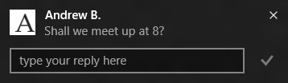
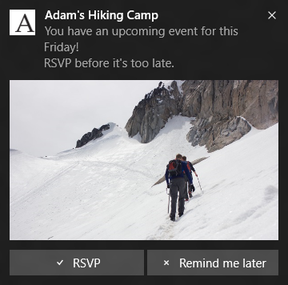

# 적응형 및 대화형 알림 메시지


\[ Windows 10의 UWP 앱에 맞게 업데이트되었습니다. Windows 8.x 문서는 [보관](http://go.microsoft.com/fwlink/p/?linkid=619132)을 참조하세요. \]


적응형 및 대화형 알림 메시지를 사용하면 더 많은 콘텐츠, 선택적 인라인 이미지 및 선택적 사용자 조작이 포함된 유연한 팝업 알림을 만들 수 있습니다.

적응형 및 대화형 알림 메시지 모델에는 레거시 알림 템플릿 카탈로그에 대한 다음 업데이트가 포함됩니다.

-   알림에 대한 단추와 입력을 포함하는 옵션.
-   기본 알림 메시지 및 각 작업에 대한 세 가지 활성화 유형.
-   알람, 미리 알림 및 수신 전화를 포함한 특정 시나리오에 대한 알림을 만드는 옵션.

**참고** Windows 8.1 및 Windows Phone 8.1의 레거시 템플릿을 확인하려면 [레거시 알림 템플릿 카탈로그](https://msdn.microsoft.com/library/windows/apps/hh761494)를 참조하세요.

 

## <span id="toast_structure"> </span> <span id="TOAST_STRUCTURE"> </span>알림 메시지 구조


알림 메시지는 XML을 사용하여 구성되며 이 XML에는 일반적으로 다음 키 요소가 포함됩니다.

-   &lt;visual&gt;은 텍스트와 이미지를 포함하여 사용자가 시각적으로 볼 수 있는 콘텐츠를 포함합니다.
-   &lt;actions&gt;는 개발자가 알림 내부에 추가하려는 단추/입력을 포함합니다.
-   &lt;audio&gt;는 알림이 나타날 때 재생되는 소리를 지정합니다.

코드 예제는 다음과 같습니다.

```XML
<toast launch="app-defined-string">
  <visual>
    <binding template="ToastGeneric">
      <text>Sample</text>
      <text>This is a simple toast notification example</text>
      <image placement="AppLogoOverride" src="oneAlarm.png" />
    </binding>
  </visual>
  <actions>
    <action content="check" arguments="check" imageUri="check.png" />
    <action content="cancel" arguments="cancel" />
  </actions>
  <audio src="ms-winsoundevent:Notification.Reminder"/>
</toast>
```

그리고 구조의 시각적 표현:


### <span id="Visual"> </span> <span id="visual"> </span> <span id="VISUAL"> </span>시각 효과

시각적 요소 내부에는 알림의 시각적 콘텐츠가 포함된 정확히 하나의 바인딩 요소가 있어야 합니다.

UWP(유니버설 Windows 플랫폼) 앱의 타일 알림은 다양한 타일 크기를 기반으로 하는 여러 템플릿을 지원합니다. 그러나 알림 메시지에는 단 하나의 템플릿 이름 **ToastGeneric**이 있습니다. 템플릿 이름이 하나만 있다는 것은 다음을 의미합니다.

-   다른 텍스트 줄을 추가하거나, 인라인 이미지를 추가하거나, 앱 아이콘 표시부터 다른 작업까지 미리 보기 이미지를 변경하는 것과 같이 알림 콘텐츠를 변경하고 템플릿 이름과 콘텐츠가 일치하지 않아서 잘못된 페이로드를 만들거나 전체 템플릿을 변경하는 것에 대해 결정하지 않고 이러한 작업을 수행할 수 있습니다.
-   같은 코드를 사용하여 휴대폰, 태블릿, PC, Xobx One을 비롯한 다양한 Microsoft Windows 디바이스 유형에 배달하도록 대상이 지정된 **toast notification**에 대한 같은 페이로드를 구성할 수 있습니다. 이러한 각 디바이스는 알림을 허용하고 적절한 시각적 어포던스 및 조작 모델을 사용하여 UI 정책에 따라 사용자에게 표시합니다.

시각적 섹션 및 하위 요소에서 지원되는 모든 특성에 대해서는 아래 스키마 섹션을 참조하세요. 추가 예제에 대해서는 아래 XML 예 섹션을 참조하세요.

### <span id="Actions"> </span> <span id="actions"> </span> <span id="ACTIONS"> </span>동작

UWP 앱에서는 사용자가 앱 외부에서 더 많은 작업을 수행하는 데 사용되는 단추와 다른 입력을 알림 메시지에 추가할 수 있습니다. 이들 작업은 &lt;actions&gt; 요소 아래에 다음 두 가지 형식으로 지정할 수 있습니다.

-   &lt;action&gt; 이 형식은 데스크톱 및 모바일 디바이스에 단추로 나타납니다. 알림 메시지 내부에 사용자 지정 또는 시스템 작업을 5개까지 지정할 수 있습니다.
-   &lt;input&gt; 이 형식을 사용하면 사용자가 메시지에 빠르게 회신하거나 드롭다운 메뉴에서 옵션을 선택하는 것 같이 입력을 제공할 수 있습니다.

&lt;action&gt; 및 &lt;input&gt;은 Windows 디바이스 패밀리 내에서 조정됩니다. 예를 들어 모바일 또는 데스크톱 디바이스에서 사용자에 대한 &lt;action&gt;은 탭/클릭할 단추입니다. 텍스트 &lt;input&gt;은 사용자가 물리적 키보드나 화면 키보드를 사용하여 텍스트를 입력할 수 있는 상자입니다. 이러한 요소는 음성으로 알린 작업이나 받아쓰기로 수행된 텍스트 입력 같이 이후 조작 시나리오에 맞게 조정됩니다.

사용자가 작업을 수행하면 &lt;action&gt; 요소 내부에서 [**ActivationType**](https://msdn.microsoft.com/library/windows/desktop/dn408447) 특성을 지정하여 다음의 하나를 수행할 수 있습니다.

-   특정 페이지/컨텍스트로 이동하는 데 사용될 수 있는 작업별 인수를 사용하여 앱을 포그라운드에서 활성화합니다.
-   사용자에게 영향을 주지 않고 앱의 백그라운드 작업을 활성화합니다.
-   프로토콜 실행을 통해 다른 앱을 활성화합니다.
-   수행할 시스템 작업을 지정합니다. 현재 사용 가능한 시스템 작업은 나중에 아래 섹션에서 설명할 예약된 알람/미리 알림을 다시 알리고 해제하는 작업입니다.

시각적 섹션 및 하위 요소에서 지원되는 모든 특성에 대해서는 아래 스키마 섹션을 참조하세요. 추가 예제에 대해서는 아래 XML 예 섹션을 참조하세요.

### <span id="Audio"> </span> <span id="audio"> </span> <span id="AUDIO"> </span>오디오

사용자 지정 소리는 현재 데스크톱 플랫폼을 대상으로 지정한 UWP 앱에서 지원되지 않습니다. 대신, 데스크톱의 목록에서 앱에 대한 ms-winsoundevents를 선택할 수 있습니다. 모바일 플랫폼의 UWP 앱은 다음 형식의 사용자 지정 소리와 함께 두 가지 ms-winsoundevents를 모두 지원합니다.

-   ms-appx:///
-   ms-appdata:///

ms-winsoundevents의 전체 목록을 포함하여 알림 메시지의 오디오에 대한 자세한 내용은 [오디오 스키마 페이지](https://msdn.microsoft.com/library/windows/apps/br230842)를 참조하세요.

## <span id="Alarms__reminders__and_incoming_calls"> </span> <span id="alarms__reminders__and_incoming_calls"> </span> <span id="ALARMS__REMINDERS__AND_INCOMING_CALLS"> </span>알람, 미리 알림 및 수신 전화


알람, 미리 알림 및 수신 전화에 알림 메시지를 사용할 수 있습니다. 이러한 특수 알림의 표준 토스트와 일치하지만 특수 알림은 시나리오 기반 사용자 지정 UI 및 패턴을 나타냅니다.

-   미리 알림은 사용자가 알림을 해제하거나 작업을 수행할 때까지 화면에 표시됩니다. Windows Mobile에서 미리 알림은 미리 확장된 상태로 표시됩니다.
-   위의 동작을 미리 알림과 공유할 뿐 아니라 알람 알림도 루핑 오디오를 자동으로 재생합니다.
-   Windows 모바일 디바이스에서 수신 전화 알림은 전체 화면으로 표시됩니다. 이 작업을 수행하려면 알림 메시지의 루트 요소 내부에 시나리오 특성 &lt;toast&gt;를 지정합니다.
    &lt;toast scenario=" { default | alarm | reminder | incomingCall } " &gt;

## <span id="xml_examples"> </span> <span id="XML_EXAMPLES"> </span>XML 예제


**참고** 아래 예제의 알림 메시지 스크린샷은 데스크톱의 앱에서 생성되었습니다. 모바일 디바이스에서 알림 메시지는 나타날 때 축소될 수 있고 이 경우 알림 아래쪽의 그래버를 통해 확장합니다.

 

**다양한 시각적 콘텐츠가 있는 알림**

이 예에서는 여러 텍스트 줄, 응용 프로그램 로고를 재정의할 선택적 작은 이미지, 선택적 인라인 이미지 미리 보기를 포함하는 방법을 보여 줍니다.

```XML
<toast launch="app-defined-string">
  <visual>
<binding template="ToastGeneric">
    <text>Photo Share</text>
      <text>Andrew sent you a picture</text>
      <text>See it in full size!</text>
      <image placement="appLogoOverride" src="A.png" />
    <image placement="inline" src="hiking.png" />
    </binding>
  </visual>
</toast>
```


 

**작업이 있는 알림, 예제 1**

이 예제의 내용...

```XML
<toast launch="app-defined-string">
  <visual>
    <binding template="ToastGeneric">
      <text>Microsoft Company Store</text>
      <text>New Halo game is back in stock!</text>
      <image placement="appLogoOverride" src="A.png" />
    </binding>
  </visual>
  <actions>
    <action activationType="foreground" content="see more details" arguments="details" imageUri="check.png"/>
    <action activationType="background" content="remind me later" arguments="later" imageUri="cancel.png"/>
  </actions>
</toast>
```


 

**작업이 있는 알림, 예제 2**

이 예제의 내용...

```XML
<toast launch="app-defined-string">
  <visual>
    <binding template="ToastGeneric">
      <text>Cortana</text>
      <text>We noticed that you are near Wasaki.</text>
      <text>Thomas left a 5 star rating after his last visit, do you want to try?</text>
      <image placement="appLogoOverride" src="A.png" />
    </binding>
  </visual>
  <actions>
    <action activationType="foreground" content="reviews" arguments="reviews" />
    <action activationType="protocol" content="show map" arguments="bingmaps:?q=sushi" />
  </actions>
</toast>
```


 

**텍스트 입력 및 작업이 있는 알림, 예제 1**

이 예제의 내용...

```XML
<toast launch="developer-defined-string">
  <visual>
    <binding template="ToastGeneric">
      <text>Andrew B.</text>
      <text>Shall we meet up at 8?</text>
      <image placement="appLogoOverride" src="A.png" />
    </binding>
  </visual>
  <actions>
    <input id="message" type="text" placeHolderContent="reply here" />
    <action activationType="background" content="reply" arguments="reply" />
    <action activationType="foreground" content="video call" arguments="video" />
  </actions>
</toast>
```


 

**텍스트 입력 및 작업이 있는 알림, 예제 2**

이 예제의 내용...

```XML
<toast launch="developer-defined-string">
  <visual>
    <binding template="ToastGeneric">
      <text>Andrew B.</text>
      <text>Shall we meet up at 8?</text>
      <image placement="appLogoOverride" src="A.png" />
    </binding>
  </visual>
  <actions>
    <input id="message" type="text" placeHolderContent="reply here" />
    <action activationType="background" content="reply" arguments="reply" imageUri="send.png" hint-inputId="message"/>
  </actions>
</toast>
```



 

**선택 입력 및 작업이 있는 알림**

이 예제의 내용...

```XML
<toast launch="developer-defined-string">
  <visual>
    <binding template="ToastGeneric">
      <text>Spicy Heaven</text>
      <text>When do you plan to come in tomorrow?</text>
      <image placement="appLogoOverride" src="A.png" />
    </binding>
  </visual>
  <actions>
    <input id="time" type="selection" defaultInput="2" >
  <selection id="1" content="Breakfast" />
  <selection id="2" content="Lunch" />
  <selection id="3" content="Dinner" />
    </input>
    <action activationType="background" content="Reserve" arguments="reserve" />
    <action activationType="background" content="Call Restaurant" arguments="call" />
  </actions>
</toast>
```


 

**미리 알림**

이 예제의 내용...

```XML
<toast scenario="reminder" launch="developer-pre-defined-string">
  <visual>
    <binding template="ToastGeneric">
      <text>Adam&#39;s Hiking Camp</text>
      <text>You have an upcoming event for this Friday!</text>
      <text>RSVP before it"s too late.</text>
      <image placement="appLogoOverride" src="A.png" />
      <image placement="inline" src="hiking.png" />
    </binding>
  </visual>
  <actions>
    <action activationType="background" content="RSVP" arguments="rsvp" />
    <action activationType="background" content="Reminder me later" arguments="later" />
  </actions>
</toast>
```



 

## <span id="Activation_samples"> </span> <span id="activation_samples"> </span> <span id="ACTIVATION_SAMPLES"> </span>활성화 샘플


위에서 설명한 대로 알림의 본문과 작업은 다양한 방법으로 앱을 활성화할 수 있습니다. 아래 샘플은 알림 본문 및/또는 알림 작업에서 다양한 활성화 형식을 처리하는 방법을 보여 줍니다.

**전경**

이 시나리오에서 앱은 포그라운드 활성화를 사용하여 앱을 시작하고 올바른 콘텐츠로 이동하는 방식으로 실행 가능한 알림 메시지 내부의 작업에 응답합니다.

OnLaunched()를 호출하는 데 사용되는 알림 메시지에서 활성화. Windows 10에서 알림에는 고유한 활성화가 있고 알림이 OnActivated()를 호출합니다.

```
async protected override void OnActivated(IActivatedEventArgs args)
{
        //Initialize your app if it&#39;s not yet initialized;
    //Find out if this is activated from a toast;
    If (args.Kind == ActivationKind.ToastNotification)
    {
                //Get the pre-defined arguments and user inputs from the eventargs;
        var toastArgs = args as ToastNotificationActivatedEventArgs;
        var arguments = toastArgs.Arguments;
        var input = toastArgs.UserInput["1"]; 
}
     
    //...
}
```

**배경**

이 시나리오에서 앱은 백그라운드 작업을 사용하여 대화형 알림 메시지 내부의 작업을 처리합니다. 아래 코드는 앱 매니페스트 내부에서 알림 활성화를 처리하기 위해 이 백그라운드 작업을 선언하는 방법과 단추를 클릭할 때 작업 및 사용자 입력에서 인수를 가져오는 방법을 보여 줍니다.

```
<!-- Manifest Declaration -->
<!-- A new task type toastNotification is added -->
<Extension Category = "windows.backgroundTasks" 
EntryPoint = "Tasks.BackgroundTaskClass" >
  <BackgroundTasks>
    <Task Type="systemEvent" />
  </BackgroundTasks>
</Extension>
```

```
namespace ToastNotificationTask
{
    public sealed class ToastNotificationBackgroundTask : IBackgroundTask
    {
        public void Run(IBackgroundTaskInstance taskInstance)
        {
        //Inside here developer can retrieve and consume the pre-defined 
        //arguments and user inputs;
        var details = taskInstance.TriggerDetails as ToastNotificationActionTriggerDetail;
        var arguments = details.Arguments;
        var input = details.Input.Lookup("1");

            // ...
        }        
    }
}
```

## <span id="Schemas___visual__and__audio_"> </span> <span id="schemas___visual__and__audio_"> </span> <span id="SCHEMAS___VISUAL__AND__AUDIO_"> </span>스키마: &lt;visual&gt; 및 &lt;audio&gt;


다음 스키마에서 "?" 접미사는 특성이 선택 사항임을 의미합니다.

```
<toast launch? duration? activationType? scenario? >
    <visual version? lang? baseUri? addImageQuery? >
        <binding template? lang? baseUri? addImageQuery? >
            <text lang? >content</text>
            <text />
            <image src placement? alt? addImageQuery? hint-crop? />
        </binding>
    </visual>
    <audio src? loop? silent? />
    <actions>
    </actions>
</toast>
```

**&lt;toast&gt;의 특성**

launch?

-   launch? = string
-   선택적 특성입니다.
-   알림에 의해 활성화될 때 응용 프로그램에 전달되는 문자열입니다.
-   activationType 값에 따라 이 값은 백그라운드 작업 내부 포그라운드의 앱이 수신하거나 원래 앱에서 시작된 프로토콜인 다른 앱이 수신할 수 있습니다.
-   이 문자열의 형식과 콘텐츠는 앱에서 앱 용도에 맞게 정의됩니다.
-   사용자가 알림을 탭하거나 클릭하여 연결된 앱을 시작하면 시작 문자열은 기본 방법으로 앱을 시작하는 대신 사용자에게 알림 콘텐츠에 관련된 뷰를 표시할 수 있도록 하는 앱 컨텍스트를 제공합니다.
-   사용자가 알림 본문 대신 작업을 클릭해서 활성화가 발생했다면 개발자는 다시 &lt;toast&gt; 태그에 미리 정의된 "launch" 대신 해당 &lt;action&gt; 태그에 미리 정의된 "arguments"를 검색합니다.

duration?

-   duration? = "short|long"
-   선택적 특성입니다. 기본값은 "short"입니다.
-   이 특성은 특정 시나리오 및 appCompat에만 해당합니다. 알람 시나리오에서는 이 특성이 더 필요하지 않습니다.
-   이 속성을 사용하지 않는 것이 좋습니다.

activationType?

-   activationType? = "foreground | background | protocol | system"
-   선택적 특성입니다.
-   기본값은 "foreground"입니다.

scenario?

-   scenario? = "default | alarm | reminder | incomingCall"
-   선택적 특성이고 기본값은 "default"입니다.
-   시나리오에서 알람, 미리 알림 또는 수신 전화를 표시하지 않을 경우 이 특성이 필요하지 않습니다.
-   화면에 알림을 계속 표시하기 위한 목적만으로 이 특성을 사용하지 마세요.

**&lt;visual&gt;의 특성**

version?

-   version? = nonNegativeInteger
-   &lt;visual&gt;에서 버전 관리가 더 사용되지 않으므로 이 특성이 필요하지 않습니다. 필요한 경우 더 높은 계층 구조에서 지정할 새 버전 관리 모델을 기대하시기 바랍니다.

lang?

-   이 선택적 특성에 대한 자세한 내용은 [이 요소 스키마 문서](https://msdn.microsoft.com/library/windows/apps/br230847)를 참조하세요.

baseUri?

-   이 선택적 특성에 대한 자세한 내용은 [이 요소 스키마 문서](https://msdn.microsoft.com/library/windows/apps/br230847)를 참조하세요.

addImageQuery?

-   이 선택적 특성에 대한 자세한 내용은 [이 요소 스키마 문서](https://msdn.microsoft.com/library/windows/apps/br230847)를 참조하세요.

**&lt;binding&gt;의 특성**

template?

-   \[Important\] template? = "ToastGeneric"
-   새로운 적응형 및 대화형 알림 기능을 사용 중이면 레거시 템플릿 대신 "ToastGeneric" 템플릿을 사용하여 시작하는지 확인하세요.
-   이제 레거시 템플릿을 새 작업과 함께 사용할 수 있지만 이는 의도된 사용 사례가 아니고 작업이 계속될지 보장할 수 없습니다.

lang?

-   이 선택적 특성에 대한 자세한 내용은 [이 요소 스키마 문서](https://msdn.microsoft.com/library/windows/apps/br230847)를 참조하세요.

baseUri?

-   이 선택적 특성에 대한 자세한 내용은 [이 요소 스키마 문서](https://msdn.microsoft.com/library/windows/apps/br230847)를 참조하세요.

addImageQuery?

-   이 선택적 특성에 대한 자세한 내용은 [이 요소 스키마 문서](https://msdn.microsoft.com/library/windows/apps/br230847)를 참조하세요.

**&lt;text&gt;의 특성**

lang?

-   이 선택적 특성에 대한 자세한 내용은 [이 요소 스키마 문서](https://msdn.microsoft.com/library/windows/apps/br230847)를 참조하세요.

**&lt;image&gt;의 특성**

src

-   이 필수 특성에 대한 자세한 내용은 [이 요소 스키마 문서](https://msdn.microsoft.com/library/windows/apps/br230844)를 참조하세요.

placement?

-   placement? = "inline" | "appLogoOverride"
-   이 특성은 선택 사항입니다.
-   이는 이 이미지가 표시되는 위치를 지정합니다.
-   "inline"은 알림 본문 내부, 텍스트 아래를 의미하고, "appLogoOverride"는 알림의 왼쪽 위에 나타나는 응용 프로그램 아이콘 배치를 의미합니다.
-   각 배치 값에 대한 이미지를 하나까지 포함할 수 있습니다.

alt?

-   이 선택적 특성에 대한 자세한 내용은 [이 요소 스키마 문서](https://msdn.microsoft.com/library/windows/apps/br230844)를 참조하세요.

addImageQuery?

-   이 선택적 특성에 대한 자세한 내용은 [이 요소 스키마 문서](https://msdn.microsoft.com/library/windows/apps/br230844)를 참조하세요.

hint-crop?

-   hint-crop? = "none" | "circle"
-   이 특성은 선택 사항입니다.
-   "none"은 자르기가 없음을 의미하는 기본값입니다.
-   "circle"은 이미지를 원 모양으로 자릅니다. 연락처의 프로필 이미지, 개인 이미지 등에 이 모양을 사용합니다.

**&lt;audio&gt;의 특성**

src?

-   이 선택적 특성에 대한 자세한 내용은 [이 요소 스키마 문서](https://msdn.microsoft.com/library/windows/apps/br230842)를 참조하세요.

loop?

-   이 선택적 특성에 대한 자세한 내용은 [이 요소 스키마 문서](https://msdn.microsoft.com/library/windows/apps/br230842)를 참조하세요.

silent?

-   이 선택적 특성에 대한 자세한 내용은 [이 요소 스키마 문서](https://msdn.microsoft.com/library/windows/apps/br230842)를 참조하세요.

## <span id="Schemas___action_"> </span> <span id="schemas___action_"> </span> <span id="SCHEMAS___ACTION_"> </span>스키마: &lt;action&gt;


다음 스키마에서 "?" 접미사는 특성이 선택 사항임을 의미합니다.

```
<toast>
    <visual>
    </visual>
    <audio />
    <actions>
        <input id type title? placeHolderContent? defaultInput? >
            <selection id content />
        </input>
        <action content arguments activationType? imageUri? hint-inputId />
    </actions>
</toast>
```

**&lt;input&gt;의 특성**

id

-   id = string
-   이 특성은 필수입니다.
-   id 특성은 필수이고 앱이 포그라운드 또는 백그라운드에서 활성화된 후 개발자가 사용자 입력을 검색하는 데 사용됩니다.

유형

-   type = "text | selection"
-   이 특성은 필수입니다.
-   텍스트 입력 및 미리 정의된 선택 목록의 입력을 지정하는 데 사용됩니다.
-   모바일 및 데스크톱에서 이 특성은 텍스트 상자 입력 또는 목록 상자 입력을 원하는지 지정합니다.

title?

-   title? = string
-   title 특성은 선택 사항이고 개발자가 어포던스가 있을 때 렌더링할 셸 입력의 제목을 지정하는 데 사용됩니다.
-   모바일 및 데스크톱에서 이 제목은 입력 위에 표시됩니다.

placeHolderContent?

-   placeHolderContent? = string
-   placeHolderContent 특성은 선택 사항이고 텍스트 입력 형식에 대한 회색으로 표시된 힌트 텍스트입니다. 입력 형식이 “text”가 아니면 이 특성이 무시됩니다.

defaultInput?

-   defaultInput? = string
-   defaultInput 특성은 선택 사항이고 기본 입력 값을 제공하는 데 사용됩니다.
-   입력 형식이 "text"이면 이는 문자열 입력으로 처리됩니다.
-   입력 형식이 "selection"이면 이는 이 입력 요소 내부에서 사용 가능한 선택 항목 중 하나의 ID여야 합니다.

**&lt;selection&gt;의 특성**

id

-   이 특성은 필수입니다. 사용자 선택을 식별하는 데 사용됩니다. id가 앱에 반환됩니다.

콘텐츠

-   이 특성은 필수입니다. 이 선택 요소에 대해 표시할 문자열을 제공합니다.

**&lt;action&gt;의 특성**

콘텐츠

-   content = string
-   content 특성은 필수입니다. 단추에 표시되는 텍스트 문자열을 제공합니다.

인수

-   arguments = string
-   arguments 특성은 필수입니다. 사용자가 이 작업을 수행해서 앱이 활성화된 후 앱에서 나중에 검색할 수 있는 앱 정의 데이터를 설명합니다.

activationType?

-   activationType? = "foreground | background | protocol | system"
-   activationType 특성은 선택 사항이고 기본값은 "foreground"입니다.
-   이 작업을 통해 수행되는 활성화 종류를 포그라운드, 백그라운드 또는 프로토콜 실행을 통한 다른 앱 시작이나 시스템 작업 호출로 설명합니다.

imageUri?

-   imageUri? = string
-   imageUri는 선택 사항이고 텍스트 콘텐츠와 함께 단추 내부에 표시할 이 작업의 이미지 아이콘을 제공하는 데 사용됩니다.

hint-inputId

-   hint-inputId = string
-   hint-inpudId 특성은 필수입니다. 특히 빠른 회신 시나리오에 사용됩니다.
-   값은 연결할 입력 요소의 ID여야 합니다.
-   모바일 및 데스크톱에서 이 특성은 입력란의 오른쪽 옆에 단추를 배치합니다.

## <span id="Attributes_for_system-handled_actions"> </span> <span id="attributes_for_system-handled_actions"> </span> <span id="ATTRIBUTES_FOR_SYSTEM-HANDLED_ACTIONS"> </span>시스템 처리 작업의 특성


앱이 알림의 다시 알림/재예약을 백그라운드 작업으로 처리하지 않게 하려면 알림을 다시 알리고 해제하기 위한 작업을 시스템에서 처리할 수 있습니다. 시스템 처리 작업을 결합하거나 개별적으로 지정할 수 있지만 다시 알림 작업을 구현하려면 해제 작업을 포함하는 것이 좋습니다.

시스템 명령 콤보: SnoozeAndDismiss

```
<toast>
    <visual>
    </visual>
    <audio />
    <actions hint-systemCommands? = "SnoozeAndDismiss" />
</toast>
```

개별 시스템 처리 작업

```
<toast>
    <visual>
    </visual>
    <audio />
<actions>
<input id="snoozeTime" type="selection" defaultInput="10">
  <selection id="5" content="5 minutes" />
  <selection id="10" content="10 minutes" />
  <selection id="20" content="20 minutes" />
  <selection id="30" content="30 minutes" />
  <selection id="60" content="1 hour" />
</input>
<action activationType="system" arguments="snooze" hint-inputId="snoozeTime" content=""/>
<action activationType="system" arguments="dismiss" content=""/>
</actions>
</toast>
```

개별 다시 알림 및 해제 작업을 구성하려면 다음을 수행합니다.

-   activationType = "system" 지정
-   arguments = "snooze" | "dismiss" 지정
-   콘텐츠 지정:
    -   "snooze" 및 "dismiss"의 지역화된 문자열을 작업에 표시하려면 콘텐츠를 빈 문자열로 지정합니다. &lt;action content = ""/&gt;
    -   사용자 지정 문자열이 필요하면 해당 값을 제공합니다. &lt;action content="Remind me later" /&gt;
-   입력 지정:
    -   사용자가 다시 알림 간격을 선택하게 하지 않고 OS 전체에서 일관성 있는 시스템 정의 시간 간격에 한 번만 알림을 다시 알리게 하려면 &lt;input&gt;을 구성하지 마세요.
    -   다시 알림 간격 선택 항목을 제공하려면:
        -   다시 알림 작업에서 hint-inputId를 지정합니다.
        -   입력 ID가 다시 알림 작업의 hint-inputId와 일치하도록 설정합니다. &lt;input id="snoozeTime"&gt;&lt;/input&gt;&lt;action hint-inputId="snoozeTime"/&gt;
        -   선택 ID를 다시 알림 간격(분)을 나타내는 nonNegativeInteger로 지정합니다. &lt;selection id="240" /&gt;은 4시간 간격으로 다시 알림을 의미합니다.
        -   &lt;input&gt;의 defaultInput 값이 &lt;selection&gt; 자식 요소의 ID 중 하나와 일치하는지 확인합니다.
        -   최대 5개 &lt;selection&gt; 값을 제공합니다.

 

 


<!--HONumber=Mar16_HO1-->


