---
Windows 10 운영 체제에서 다양한 형식으로 나타나는 앱 아이콘 자산은 UWP(유니버설 Windows 플랫폼) 앱에 대한 호출 카드입니다.
타일 및 아이콘 자산
ms.assetid: D6CE21E5-2CFA-404F-8679-36AA522206C7
타일 및 아이콘 자산
template: detail.hbs
---

# 타일 및 아이콘 자산에 대한 지침


\[ Windows 10의 UWP 앱에 맞게 업데이트되었습니다. Windows 8.x 문서는 [보관](http://go.microsoft.com/fwlink/p/?linkid=619132)을 참조하세요. \]


Windows 10 운영 체제에서 다양한 형식으로 나타나는 앱 아이콘 자산은 UWP(유니버설 Windows 플랫폼) 앱에 대한 호출 카드입니다. 다음 지침에서는 시스템에서 앱 아이콘 자산을 표시하는 위치에 대해 자세히 설명하고 가장 완성도 높은 아이콘을 만드는 방법에 대한 자세한 디자인 팁을 제공합니다.


## <span id="Adaptive_scaling"> </span> <span id="adaptive_scaling"> </span> <span id="ADAPTIVE_SCALING"> </span>적응형 크기 조정


먼저 자산 크기 조정 방법을 더 잘 이해하기 위한 적응형 크기 조정에 대한 간략한 개요입니다. Windows 10에는 기존 크기 조정 모델의 진화된 모델이 도입되었습니다. 배율 벡터 콘텐츠 외에 다양한 화면 크기 및 디스플레이 해상도에서 UI 요소에 대한 일관된 크기를 제공하는 통합된 배율 인수 집합이 있습니다. 배율은 iOS 및 Android와 같은 다른 운영 체제의 배율과도 호환되므로 해당 플랫폼 사이에서 더욱 쉽게 자산을 공유할 수 있습니다.

스토어에서는 디바이스의 DPI에 따라 다운로드할 자산을 선택합니다. 디바이스에 가장 적합한 자산만 다운로드됩니다.

## <span id="Tile_elements"> </span> <span id="tile_elements"> </span> <span id="TILE_ELEMENTS"> </span>타일 요소


시작 타일의 기본 구성 요소는 뒷판, 아이콘, 브랜딩 표시줄, 여백 및 앱 이름으로 구성됩니다.


타일의 아래쪽에 브랜딩 표시줄은 앱 이름, 배지 및 카운터(사용하는 경우)가 표시되는 위치입니다.

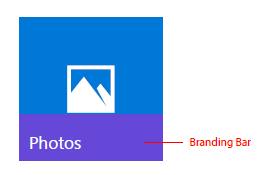

브랜딩 표시줄의 높이는 해당 표시줄이 표시되는 디바이스의 배율 인수를 기반으로 합니다.

| 배율 인수 | 픽셀 |
|--------------|--------|
| 100%         | 32     |
| 125%         | 40     |
| 150%         | 48     |
| 200%         | 64     |
| 400%         | 128    |

 

시스템이 타일 여백을 설정하며 수정될 수 없습니다. 이 예제에 표시된 대로 대부분의 콘텐츠는 여백 안에 표시됩니다.

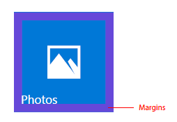

여백 너비는 해당 타일이 표시되는 디바이스에 대한 배율 인수를 기반으로 합니다.

| 배율 인수 | 픽셀 |
|--------------|--------|
| 100%         | 8      |
| 125%         | 10     |
| 150%         | 12     |
| 200%         | 16     |
| 400%         | 32     |

 

## <span id="Tile_assets"> </span> <span id="tile_assets"> </span> <span id="TILE_ASSETS"> </span>타일 자산


각 타일 자산은 해당 자산이 배치되는 타일 크기와 동일합니다. 두 개의 다른 표현 자산을 사용하여 앱의 타일을 브랜딩할 수 있습니다.

1. 안쪽 여백이 있으며 가운데 배치된 아이콘 또는 로고. 뒤 색판이 표시됩니다.


2. 안쪽 여백이 없는 풀 블리드(full-bleed)의 브랜딩 타일


디바이스 간의 일관성을 위해 각 타일 크기(작은 타일, 중간 크기 타일, 와이드 타일 및 큰 타일)에는 자체 크기 조정 관계가 있습니다. 타일에서 일관된 아이콘 배치를 구현하기 위해 다음 타일 크기에 대한 몇 가지 기본적인 안쪽 여백 지침을 권장합니다. 두 개의 보라색 오버레이 교차 영역은 아이콘에 대한 이상적인 공간을 나타냅니다. 아이콘이 이 공간에 항상 맞지는 않겠지만 아이콘의 시각적 볼륨은 제공된 예제와 거의 같습니다.

작은 타일 크기 조정:

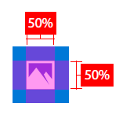

중간 크기 타일 크기 조정:


와이드 타일 크기 조정:


큰 타일 크기 조정:

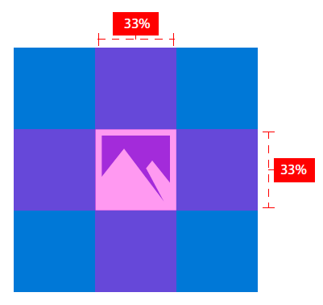

이 예제에서는 아이콘이 타일에 비해 너무 큽니다.


이 예제에서는 아이콘이 타일에 비해 너무 작습니다.

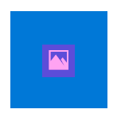

다음 안쪽 여백의 비율은 가로 또는 세로 방향의 아이콘에 맞게 최적화되어있습니다.

작은 타일의 경우 아이콘 너비와 높이를 타일 크기의 66%로 제한합니다.


중간 크기 타일의 경우 타일 크기의 66%로 아이콘 너비를 제한하고 50%로 높이를 제한합니다. 그러면 브랜딩 표시줄에서 요소가 겹치지 않게 됩니다.


와이드 타일의 경우 타일 크기의 66%로 아이콘 너비를 제한하고 높이를 50%로 제한합니다. 그러면 브랜딩 표시줄에서 요소가 겹치지 않게 됩니다.

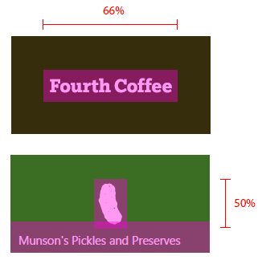

큰 타일의 경우 타일 크기의 50%로 아이콘 너비와 높이를 제한합니다.


일부 아이콘은 가로 또는 세로 방향이 되도록 디자인되었지만 또 다른 아이콘은 대상 크기 내에서 정사각형으로 배치할 수 없는 더 복잡한 모양을 가집니다. 가운데에 표시되는 아이콘이 한쪽으로 기울 수 있습니다. 이런 경우 정사각형에 맞는 아이콘과 동일한 시각적 공간을 차지하면 아이콘의 일부가 권장 공간 외부에 표시될 수 있습니다.


풀 블리드 자산을 사용할 경우 여백 및 타일의 가장자리 내에서 조작하는 계정 요소를 고려합니다. 타일의 너비 또는 높이의 최소 16%로 여백을 유지 관리합니다. 이 백분율은 가장 작은 타일 크기에서는 여백 너비의 두 배를 나타냅니다.


이 예제에서는 여백이 너무 작습니다.


## <span id="Tile_assets_in_list_views"> </span> <span id="tile_assets_in_list_views"> </span> <span id="TILE_ASSETS_IN_LIST_VIEWS"> </span>목록 보기의 타일 자산


타일은 목록 보기에도 나타날 수 있습니다. 목록 보기에 표시되는 타일 자산에 대한 크기 조정 지침은 이전에 설명한 자산 타일과 약간 다릅니다. 이 섹션에서는 이러한 크기 조정 관련 내용을 자세히 설명합니다.

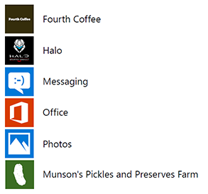

아이콘 너비와 높이를 타일 크기의 75%로 제한합니다.

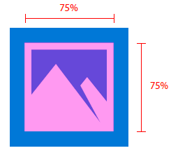

세로 및 가로 아이콘 형식의 경우 너비와 높이를 타일 크기의 75%로 제한합니다.


중요한 브랜드 요소의 풀 블리드 아트워크의 경우 최소 12.5%의 여백을 유지 관리합니다.


이 예제에서는 아이콘이 타일 내부에 비해 너무 큽니다.


이 예제에서는 아이콘이 타일 내부에 비해 너무 작습니다.


## <span id="Target-based_assets"> </span> <span id="target-based_assets"> </span> <span id="TARGET-BASED_ASSETS"> </span>대상 기반 자산


대상 기반 자산은 아이콘 및 타일을 위한 것으로 Windows 작업 표시줄, 작업 보기, Alt + Tab, 끌기 도우미 및 시작 타일의 오른쪽 아래 모서리에 표시됩니다. 이러한 자산에 안쪽 여백을 추가하지 않아도 됩니다. 필요한 경우 Windows에서 자동으로 안쪽 여백을 추가합니다. 이러한 자산에서는 16픽셀의 최소 공간을 고려해야 합니다. 다음은 Windows 작업 표시줄의 아이콘에 나타나는 이러한 자산의 예입니다.

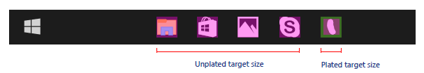

이러한 UI가 기본적으로 색이 있는 뒷판 위의 대상 기반 자산을 사용하지만 대상 기반의 판이 없는 자산도 사용할 수 있습니다. 판이 없는 자산은 다양한 배경색에 표시될 수 있는 가능성을 염두에 두고 만들어야 합니다.

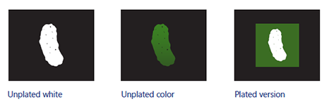

100% 배율로 대상 기반 자산에 대해 권장되는 크기는 다음과 같습니다.


**아이콘 템플릿 앱 자산**

아이콘 템플릿("IconWithBadge" 템플릿이라고도 함)을 사용하면 타일 중앙에 작은 이미지를 표시할 수 있습니다. Windows 10은 휴대폰과 태블릿/데스크톱 둘 다에서 이 템플릿을 지원합니다. ([특수 타일 템플릿 문서](tiles-and-notifications-special-tile-templates-catalog.md)에서 아이콘 타일을 만드는 방법을 알아봅니다.)

스토어, 메시지, 휴대폰 등 아이콘 템플릿을 사용하는 앱에는 배지(라이브 카운터 포함)를 특징으로 할 수 있는 대상 기반 자산이 있습니다. 다른 대상 기반 자산과 마찬가지로 안쪽 여백은 필요하지 않습니다. 아이콘 자산은 앱 매니페스트의 일부가 아닌 라이브 타일 페이로드의 일부입니다. 자산은 적합하게 배율 조정되고 3 2 비율 컨테이너 내에서 가운데에 배치됩니다.


정사각형 자산의 경우 컨테이너 내에서 자동으로 가운데에 배치됩니다.


정사각형이 아닌 자산의 경우 컨테이너의 너비/높이에 대한 자동 가로/세로 가운데 배치 및 맞추기가 발생합니다.


## <span id="Splash_screen_assets"> </span> <span id="splash_screen_assets"> </span> <span id="SPLASH_SCREEN_ASSETS"> </span>시작 화면 자산


시작 화면 이미지는 이미지 파일에 대한 직접 경로 또는 리소스로 지정될 수 있습니다. 리소스 참조를 사용하면 여러 크기의 이미지를 제공하여 Windows에서 디바이스 및 화면 해상도에 가장 잘 맞는 크기를 선택할 수 있습니다. 또한 접근성을 위한 고대비 이미지 및 다른 UI 언어에 맞게 지역화된 이미지를 제공할 수 있습니다.

텍스트 편집기에서 "Package.appxmanifest"를 열면 [**SplashScreen**](https://msdn.microsoft.com/library/windows/apps/br211467) 요소가 [**VisualElements**](https://msdn.microsoft.com/library/windows/apps/br211471) 요소의 자식 요소로 표시됩니다. 매니페스트 파일의 기본 시작 화면 태그는 텍스트 편집기에서 다음과 같이 나타납니다.

```XML
<uap:SplashScreen Image="Assets\SplashScreen.png" /></code></pre></td>
</tr>
</tbody>
</table>
```

시작 화면 자산은 해당 자산이 표시되는 디바이스에 의해 자동으로 가운데에 배치됩니다.

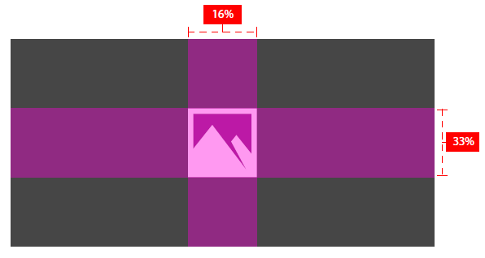

## <span id="High-contrast_assets"> </span> <span id="high-contrast_assets"> </span> <span id="HIGH-CONTRAST_ASSETS"> </span>고대비 자산


고대비 모드에서는 고대비 흰색(흰색 배경과 검은색 텍스트) 및 고대비 검은색(검은색 배경과 흰색 텍스트)에 대한 별도 자산 집합을 활용합니다. 앱에 대한 고대비 자산을 제공하지 않으면 표준 자산이 사용됩니다.

흑백 배경에서 렌더링될 때 앱의 표준 자산이 허용 가능한 보기 환경을 제공하는 경우 고대비 모드에서 앱은 적어도 만족스럽게 표시됩니다. 흑백 배경에서 렌더링될 때 표준 자산에서 허용 가능한 보기 환경을 지원하지 못하는 경우 특히 고대비 자산을 포함하는 것이 좋습니다. 다음 예제는 두 가지 유형의 고대비 자산을 보여 줍니다.


고대비 자산을 제공하려는 경우 두 집합, 즉 검은색 배경의 흰색과 흰색 배경의 검은색을 모두 포함해야 합니다. 패키지에 이러한 자산을 포함할 경우 검은색 배경의 흰색 자산을 위한 "contrast-black" 폴더와 흰색 배경의 검은색 자산을 위한 "contrast-white" 폴더를 만들 수 있습니다.

## <span id="Asset_size_tables"> </span> <span id="asset_size_tables"> </span> <span id="ASSET_SIZE_TABLES"> </span>자산 크기 테이블


최소한, 100, 200 및 400 배율 인수에 대한 자산을 제공하는 것이 좋습니다. 모든 배율 인수에 대한 자산을 제공하면 최적의 사용자 환경이 구현됩니다.

**배율 기반 자산**

| 범주             | 요소 이름      | 100% 배율에서 | 125% 배율에서 | 150% 배율에서 | 200% 배율에서 | 400% 배율에서 |
|----------------------|-------------------|---------------|---------------|---------------|---------------|---------------|
| 작은 타일                | Square71x71Logo   | 71x71         | 89x89         | 107x107       | 142x142       | 284x284       |
| 중간 크기 타일               | Square150x150Logo | 150x150       | 188x188       | 225x225       | 300x300       | 600x600       |
| 와이드 타일                 | Square310x150Logo | 310x150       | 388x188       | 465x225       | 620x300       | 1240x600      |
| 큰 타일(데스크톱만 해당) | Square310x310Logo | 310x310       | 388 x 388       | 465 x 465       | 620 x 620       | 1240 x 1240     |
| 앱 목록(아이콘)      | Square44x44Logo   | 44 x 44         | 55 x 55         | 66 x 66         | 88 x 88         | 176 x 176       |

 

**배율 기반 자산에 대한 파일 이름 예제**

| 범주             | 요소 이름      | 100% 배율에서                  | 125% 배율에서                  | 150% 배율에서                  |
|----------------------|-------------------|--------------------------------|--------------------------------|--------------------------------|
| 작은 타일                | Square71x71Logo   | AppNameSmallTile.scale-100.png | AppNameSmallTile.scale 125.png | AppNameSmallTile.scale 150.png |
| Medium               | Square150x150Logo | AppNameMedTile.scale-100.png   | AppNameMedTile.scale 125.png   | AppNameMedTile.scale 150.png   |
| 와이드 타일                 | Square310x150Logo | AppNameWideTile.scale-100.png  | AppNameWideTile.scale 125.png  | AppNameWideTile.scale 150.png  |
| 큰 타일(데스크톱만 해당) | Square310x310Logo | AppNameLargeTile.scale-100.png | AppNameLargeTile.scale 125.png | AppNameLargeTile.scale 150.png |
| 앱 목록(아이콘)      | Square44x44Logo   | AppNameLargeTile.scale-100.png | AppNameLargeTile.scale 125.png | AppNameLargeTile.scale 150.png |

 

| 범주             | 요소 이름      | 200% 배율에서                  | 400% 배율에서                  |
|----------------------|-------------------|--------------------------------|--------------------------------|
| 작은 타일                | Square71x71Logo   | AppNameSmallTile.scale 200.png | AppNameSmallTile.scale 400.png |
| 중간 크기 타일               | Square150x150Logo | AppNameMedTile.scale 200.png   | AppNameMedTile.scale 400.png   |
| 와이드 타일                 | Square310x150Logo | AppNameWideTile.scale 200.png  | AppNameWideTile.scale 400.png  |
| 큰 타일(데스크톱만 해당) | Square310x310Logo | AppNameLargeTile.scale 200.png | AppNameLargeTile.scale 400.png |
| 앱 목록(아이콘)      | Square44x44Logo   | AppNameLargeTile.scale 200.png | AppNameLargeTile.scale 400.png |

 

**대상 기반 자산**

대상 기반 자산은 여러 배율 인수로 사용됩니다. 대상 기반 자산의 요소 이름은 **Square44x44Logo**입니다. 최소한 다음 자산을 제출하는 것이 좋습니다.

16 x 16, 24 x 24, 32 x 32, 48 x 48, 256 x 256

다음 표에서는 모든 대상 기반 자산 크기와 해당 파일 이름 예제를 나열합니다.

| 자산 크기 | 파일 이름 예제                 |
|------------|-----------------------------------|
| 16x16\*    | AppNameAppList.targetsize 16.png  |
| 24x24\*    | AppNameAppList.targetsize 24.png  |
| 32x32\*    | AppNameAppList.targetsize 32.png  |
| 48x48\*    | AppNameAppList.targetsize 48.png  |
| 256x256\*  | AppNameAppList.targetsize 256.png |
| 20x20      | AppNameAppList.targetsize 20.png  |
| 30x30      | AppNameAppList.targetsize 30.png  |
| 36x36      | AppNameAppList.targetsize 36.png  |
| 40x40      | AppNameAppList.targetsize 40.png  |
| 60x60      | AppNameAppList.targetsize 60.png  |
| 64x64      | AppNameAppList.targetsize 64.png  |
| 72x72      | AppNameAppList.targetsize 72.png  |
| 80x80      | AppNameAppList.targetsize 80.png  |
| 96x96      | AppNameAppList.targetsize 96.png  |

 

\* 이러한 자산은 크기를 기준으로 제출

## <span id="Asset_types"> </span> <span id="asset_types"> </span> <span id="ASSET_TYPES"> </span>자산 유형


모든 자산 유형, 용도 및 권장 파일 이름이 다음에 나열되어 있습니다.

**타일 자산**

-   가운데 자산은 보통 시작 화면에서 앱을 표시하는 데 사용됩니다.
-   파일 이름 형식: \*Tile.scale-\*.PNG
-   영향을 받는 앱: 모든 UWP 앱
-   용도:
    -   기본 시작 타일(데스크톱 및 모바일)
    -   알림 센터(데스크톱 및 모바일)
    -   작업 전환기(모바일)
    -   공유 선택기(모바일)
    -   선택기(모바일)
    -   저장소

**판이 있는 확장 가능한 목록 자산**

-   이러한 자산은 배율 인수를 요청하는 화면에서 사용됩니다. 자산은 시스템을 통해 판을 가지거나 자체 배경색과 함께 제공됩니다(앱이 배경색을 포함하는 경우).
-   파일 이름 형식: \*AppList.scale-\*.PNG
-   영향을 받는 앱: 모든 UWP 앱
-   용도:
    -   모든 앱 목록 시작(데스크톱)
    -   가장 자주 사용하는 목록 시작(데스크톱)
    -   작업 관리자(데스크톱)
    -   Cortana 검색 결과
    -   모든 앱 목록 시작(모바일)
    -   설정

**판이 있는 대상 크기 목록 자산**

-   플라토에 따라 크기 조정되지 않는 고정된 자산 크기가 있습니다. 레거시 환경에 주로 사용됩니다. 자산은 시스템에 의해 확인됩니다.
-   파일 이름 형식: \*AppList.targetsize-\*.PNG
-   영향을 받는 앱: 모든 UWP 앱
-   용도:
    -   점프 목록 시작(데스크톱)
    -   타일의 하단 모서리 시작(데스크톱)
    -   바로 가기 키(데스크톱)
    -   제어판(데스크톱)

**판이 없는 대상 크기 목록 자산**

-   시스템에 의해 판이 제공되지 않거나 크기 조정되지 않는 자산이 있습니다.
-   파일 이름 형식: \*AppList.targetsize-\*\_altform-unplated.PNG
-   영향을 받는 앱: 모든 UWP 앱
-   용도:
    -   작업 표시줄 및 작업 표시줄 미리 보기(데스크톱)
    -   작업 표시줄 점프 목록
    -   작업 보기
    -   Alt+Tab

**파일 확장명 자산**

-   파일 확장명과 관련된 특정 자산이 있습니다. 이러한 자산은 파일 탐색기에서 Win32 스타일 파일 연결 아이콘 옆에 표시되며 테마 독립적이어야 합니다. 크기 조정은 데스크톱과 모바일 플랫폼에서 다릅니다.
-   파일 이름 형식: \*LogoExtensions.targetsize-\*.PNG
-   영향을 받는 앱: 음악, 동영상, 사진, Microsoft Edge, Microsoft Office
-   용도:
    -   파일 탐색기
    -   Cortana
    -   다양한 UI 화면(데스크톱)

**시작 화면**

-   앱의 시작 화면에 표시되는 자산입니다. 데스크톱 및 모바일 플랫폼에서 자동으로 조정됩니다.
-   파일 이름 형식: \*SplashScreen.screen-100.PNG
-   영향을 받는 앱: 모든 UWP 앱
-   용도:
    -   앱의 시작 화면

**아이콘 타일 자산**

-   아이콘 템플릿을 활용하는 앱용 자산입니다.
-   파일 이름 형식: 해당 없음
-   영향을 받는 앱: 메시지, 휴대폰, 스토어 등
-   용도:
    -   아이콘 타일

\[이 문서에는 UWP(유니버설 Windows 플랫폼) 앱 및 Windows 10과 관련된 정보가 있습니다. Windows 8.1 참고 자료는 [Windows 8.1 지침 PDF](https://go.microsoft.com/fwlink/p/?linkid=258743)를 다운로드하세요.\]

## <span id="related_topics"> </span>관련 항목


* [특수 타일 템플릿](tiles-and-notifications-special-tile-templates-catalog.md)
 

 


<!--HONumber=Mar16_HO1-->


