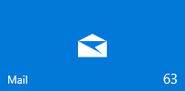

# <a name="badge-notifications-for-uwp-apps"></a>UWP 앱에 대한 배지 알림

<link rel="stylesheet" href="https://az835927.vo.msecnd.net/sites/uwp/Resources/css/custom.css"> 

<div style="float:left; font-size:80%; text-align:left; margin: 0px 15px 15px 0px;">
<br/>읽지 않은 메일 63개가 있다는 의미의 숫자 63이<br/> 표시된 숫자 배지를 포함하는 타일</div>

알림 배지는 앱에 대한 요약 또는 상태 정보를 전달합니다. 숫자(1-99) 또는 시스템 제공 문자 모양 중 하나일 수 있습니다. 배지를 통해 전달하기 적합한 정보로는 온라인 게임의 네트워크 연결 상태, 메시지 앱의 사용자 상태, 메일 앱의 읽지 않은 메일 수, 소셜 미디어 앱의 새 게시 수 등이 있습니다. 

알림 배지는 앱의 작업 표시줄 아이콘 및 시작 타일의 오른쪽 아래 모서리에 앱 실행 여부와 관계없이 나타납니다. 배지는 모든 타일 크기에 표시할 수 있습니다.  

> [!NOTE]
> 직접 만든 배지 이미지를 제공할 수는 없으며, 시스템 제공 배지 이미지만 사용할 수 있습니다.


## <a name="numeric-badges"></a>숫자 배지

<table>
    <tr>
        <th>값</th>
        <th>배지</th>
        <th>XML</th>
    </tr>
    <tr>
        <td>1-99 사이의 숫자. 값 0은 문자 값 "없음"과 동일하며 배지를 지웁니다.</td>
        <td></td>
        <td>`<badge value="1"/>`</td>
    </tr>
    <tr>
        <td>99보다 큰 모든 숫자</td>
        <td></td></td>
        <td>`<badge value="100"/>`</td>
    </tr>    
</table>

## <a name="glyph-badges"></a>문자 배지
배지는 숫자 대신 확장할 수 없는 상태 문자 모양 집합 중 하나를 표시할 수 있습니다. 

<table>
<tr>
    <th>상태</th>
    <th>문자 모양</th>
    <th>XML</th>
</tr>
<tr>
    <td>none</td>
    <td>표시되는 배지 없음</td>
    <td>`<badge value="none"/>`</td>
</tr>
<tr>
    <td>activity</td>
    <td></td>
    <td>`<badge value="activity"/>`</td>
</tr>
<tr>
    <td>alarm</td>
    <td></td>
    <td>`<badge value="alarm"/>`</td>
</tr>
<tr>
    <td>alert</td>
    <td></td>
    <td>`<badge value="alert"/>`</td>
</tr>
<tr>
    <td>attention</td>
    <td></td>
    <td>`<badge value="attention"/>`</td>
</tr>
<tr>
    <td>available</td>
    <td></td>
    <td>`<badge value="available"/>`</td>
</tr>
<tr>
    <td>away</td>
    <td></td>
    <td>`<badge value="away"/>`</td>
</tr>
<tr>
    <td>busy</td>
    <td></td>
    <td>`<badge value="busy"/>`</td>
</tr>
<tr>
    <td>error</td>
    <td></td>
    <td>`<badge value="error"/>`</td>
</tr>
<tr>
    <td>newMessage</td>
    <td></td>
    <td>`<badge value="newMessage"/>`</td>
</tr>
<tr>
    <td>paused</td>
    <td></td>
    <td>`<badge value="paused"/>`</td>
</tr>
<tr>
    <td>playing</td>
    <td></td>
    <td>`<badge value="playing"/>`</td>
</tr>
<tr>
    <td>unavailable</td>
    <td></td>
    <td>`<badge value="unavailable"/>`</td>
</tr>
</table>

## <a name="create-a-badge"></a>배지 만들기

다음 예제에서는 배지 업데이트를 만드는 방법을 보여 줍니다.

### <a name="create-a-numeric-badge"></a>숫자 배지 만들기

````csharp
private void setBadgeNumber(int num)
{

    // Get the blank badge XML payload for a badge number
    XmlDocument badgeXml = 
        BadgeUpdateManager.GetTemplateContent(BadgeTemplateType.BadgeNumber);

    // Set the value of the badge in the XML to our number
    XmlElement badgeElement = badgeXml.SelectSingleNode("/badge") as XmlElement;
    badgeElement.SetAttribute("value", num.ToString());

    // Create the badge notification
    BadgeNotification badge = new BadgeNotification(badgeXml);

    // Create the badge updater for the application
    BadgeUpdater badgeUpdater = 
        BadgeUpdateManager.CreateBadgeUpdaterForApplication();

    // And update the badge
    badgeUpdater.Update(badge);

}
````

### <a name="create-a-glyph-badge"></a>문자 모양 배지 만들기
````csharp
private void updateBadgeGlyph()
{
    string badgeGlyphValue = "alert";

    // Get the blank badge XML payload for a badge glyph
    XmlDocument badgeXml = 
        BadgeUpdateManager.GetTemplateContent(BadgeTemplateType.BadgeGlyph);

    // Set the value of the badge in the XML to our glyph value
    Windows.Data.Xml.Dom.XmlElement badgeElement = 
        badgeXml.SelectSingleNode("/badge") as Windows.Data.Xml.Dom.XmlElement;
    badgeElement.SetAttribute("value", badgeGlyphValue);

    // Create the badge notification
    BadgeNotification badge = new BadgeNotification(badgeXml);

    // Create the badge updater for the application
    BadgeUpdater badgeUpdater = 
        BadgeUpdateManager.CreateBadgeUpdaterForApplication();

    // And update the badge
    badgeUpdater.Update(badge);

}
````

### <a name="clear-a-badge"></a>배지 지우기

````csharp
private void clearBadge()
{
    BadgeUpdateManager.CreateBadgeUpdaterForApplication().Clear();
}
````

## <a name="get-the-sample-code"></a>샘플 코드 다운로드

* [알림 샘플](https://github.com/Microsoft/Windows-universal-samples/blob/master/Samples/Notifications)<br/> 라이브 타일을 만들고, 배지 업데이트를 보내고, 알림 메시지를 표시하는 방법을 보여 줍니다. 

## <a name="related-articles"></a>관련 문서

* [적응형 및 대화형 알림 메시지](tiles-and-notifications-adaptive-interactive-toasts.md)
* [타일 만들기](tiles-and-notifications-creating-tiles.md)
* [적응형 타일 만들기](tiles-and-notifications-create-adaptive-tiles.md)