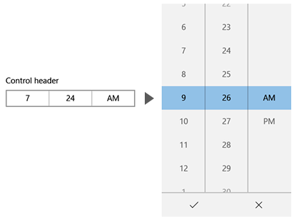
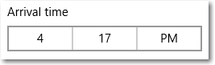

---
시간 선택기는 사용자가 터치, 마우스 또는 키보드 입력을 사용하여 시간 값을 선택할 수 있는 표준화된 방법을 제공합니다.
시간 선택기
ms.assetid: 5124ecda-09e6-449e-9d4a-d969dca46aa3
시간 선택기
template: detail.hbs
---

# 시간 선택기

시간 선택기는 사용자가 터치, 마우스 또는 키보드 입력을 사용하여 시간 값을 선택할 수 있는 표준화된 방법을 제공합니다. 

<span class="sidebar_heading" style="font-weight: bold;">중요 API</span>

-   [**TimePicker 클래스**](https://msdn.microsoft.com/library/windows/apps/xaml/windows.ui.xaml.controls.timepicker.aspx)
-   [**Time 속성**](https://msdn.microsoft.com/library/windows/apps/xaml/windows.ui.xaml.controls.timepicker.time.aspx)

## 올바른 컨트롤인가요?
사용자가 단일 시간 값을 선택할 수 있게 하려면 시간 선택기를 사용합니다.

올바른 컨트롤을 선택하는 방법에 대한 자세한 내용은 [날짜 및 시간 컨트롤](date-and-time.md) 문서를 참조하세요.

## 예제

진입점에 선택한 시간이 표시되고 사용자가 진입점을 선택하면 선택할 수 있게 선택기 화면이 가운데에서 세로로 확장됩니다. 이 시간 선택 컨트롤은 다른 UI에 겹쳐지며 다른 UI를 보이지 않도록 합니다.



## 시간 선택기 만들기

이 예제에서는 머리글을 사용하여 간단한 시간 선택기를 만드는 방법을 보여 줍니다.

```xaml
<TimePicker x:Name=arrivalTimePicker Header="Arrival time"/>
```

```csharp
TimePicker arrivalTimePicker = new TimePicker();
arrivalTimePicker.Header = "Arrival time";
```

이에 따라 표시되는 시간 선택기는 다음과 같습니다.



> **참고**&nbsp;&nbsp; 날짜 및 시간 값에 대한 중요한 정보는 *날짜 및 시간 컨트롤* 문서의 [DateTime 및 Calendar 값](date-and-time.md#datetime-and-calendar-values)을 참조하세요.

\[이 문서에는 UWP(유니버설 Windows 플랫폼) 앱 및 Windows 10과 관련된 정보가 있습니다. Windows 8.1 참고 자료는 [Windows 8.1 지침 PDF](https://go.microsoft.com/fwlink/p/?linkid=258743)를 다운로드하세요.\]

## 관련 항목

- [날짜 및 시간 컨트롤](date-and-time.md)
- [달력 날짜 선택](calendar-date-picker.md)
- [달력 보기](calendar-view.md)
- [날짜 선택기](date-picker.md)


<!--HONumber=Mar16_HO1-->


