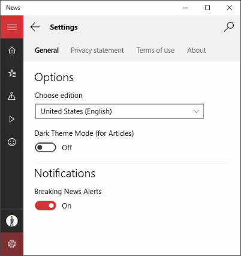

---
토글 스위치는 사용자가 켜거나 끌 수 있는 물리적 스위치를 나타냅니다.
토글 스위치 컨트롤에 대한 지침
ms.assetid: 753CFEA4-80D3-474C-B4A9-555F872A3DEF
토글 스위치
template: detail.hbs
---
# 토글 스위치

토글 스위치는 사용자가 켜거나 끌 수 있는 물리적 스위치를 나타냅니다. **ToggleSwitch** 컨트롤을 사용하여 사용자에게 서로 배타적인 두 옵션(예: 켜기/끄기)을 제공합니다. 이러한 옵션은 선택하는 즉시 동작이 실행됩니다.

<span class="sidebar_heading" style="font-weight: bold;">중요 API</span>

-   [**ToggleSwitch 클래스**](https://msdn.microsoft.com/library/windows/apps/windows.ui.xaml.controls.toggleswitch.aspx)
-   [**IsOn 속성**](https://msdn.microsoft.com/library/windows/apps/windows.ui.xaml.controls.toggleswitch.ison.aspx)
-   [**Toggled 이벤트**](https://msdn.microsoft.com/library/windows/apps/windows.ui.xaml.controls.toggleswitch.toggled.aspx)

## 올바른 컨트롤인가요?

사용자가 토글 스위치를 전환하면 바로 적용되는 이진 파일 작업용 토글 스위치를 사용합니다. 예를 들어 WiFi처럼 서비스 또는 하드웨어 구성 요소를 켜거나 끌 때 전환 스위치를 사용합니다.


물리적 스위치가 작업에 적용되는 경우 토글 스위치를 사용하면 좋습니다.

전환 스위치를 켜거나 끈 직후 해당 작업을 수행하는 것이 좋습니다.

### 전환 스위치와 확인란 중 선택

일부 작업에 대해 토글 스위치나 확인란을 사용할 수 있습니다. 어떤 컨트롤이 더 잘 작동하는지 결정하려면 다음 팁을 따르세요.

-   사용자가 변경하는 즉시 적용되는 이진 설정에는 토글 스위치를 사용합니다.

    

    위의 예제에서는 토글 스위치를 사용하여 무선을 “켜짐"으로 설정합니다. 그러나 확인란을 사용하면 무선이 현재 켜져 있는지 또는 무선을 켜기 위해 확인란을 선택해야 하는지 여부를 판단해야 합니다.

-   변경 사항을 적용하려면 추가 단계를 수행해야 하는 경우에는 확인란을 사용합니다. 예를 들어, 사용자가 '전송' 또는 '다음' 단추를 클릭하여 변경 사항을 적용해야 하는 경우에는 확인란을 사용합니다.

    

-   사용자가 여러 개의 항목을 선택할 수 있는 경우에는 확인란 또는 [목록 상자](lists.md)를 사용합니다.

    

## 예제

뉴스 앱의 일반 설정에서 있는 토글 스위치입니다.



Windows의 시작 메뉴 설정에 있는 토글 스위치입니다.


## 토글 스위치 만들기

간단한 토글 스위치를 만드는 방법은 다음과 같습니다. 이 XAML은 앞에 표시된 WiFi 토글 스위치를 만듭니다.

```xaml
<ToggleSwitch x:Name="wiFiToggle" Header="Wifi"/>
```
코드에서 동일한 토글 스위치를 만드는 방법은 다음과 같습니다.

```csharp
ToggleSwitch wiFiToggle = new ToggleSwitch();
wiFiToggle.Header = "WiFi";

// Add the toggle switch to a parent container in the visual tree.
stackPanel1.Children.Add(wiFiToggle);
```

### IsOn

스위치는 켜짐 또는 꺼짐일 수 있습니다. [
            **IsOn**](https://msdn.microsoft.com/library/windows/apps/windows.ui.xaml.controls.toggleswitch.ison.aspx) 속성을 사용하여 스위치의 상태를 확인합니다. 스위치를 사용하여 다른 이진 속성의 상태를 제어하는 경우 다음과 같이 바인딩을 사용할 수 있습니다.

```
<StackPanel Orientation="Horizontal">
    <ToggleSwitch x:Name="ToggleSwitch1" IsOn="True"/>
    <ProgressRing IsActive="{x:Bind ToggleSwitch1.IsOn, Mode=OneWay}" Width="130"/>
</StackPanel>
```

### Toggled

다른 경우에서는 [**Toggled**](https://msdn.microsoft.com/library/windows/apps/windows.ui.xaml.controls.toggleswitch.toggled.aspx) 이벤트를 처리하여 상태 변경에 응답할 수 있습니다.

이 예제에서는 XAML 및 코드에서 Toggled 이벤트 처리기를 추가하는 방법을 보여 줍니다. Toggled 이벤트를 처리하여 진행률 링을 켜거나 끄고 표시 여부를 변경합니다.

```xaml
<ToggleSwitch x:Name="toggleSwitch1" IsOn="True" 
              Toggled="ToggleSwitch_Toggled"/>
```

코드에서 동일한 토글 스위치를 만드는 방법은 다음과 같습니다.

```csharp
// Create a new toggle switch and add a Toggled event handler.
ToggleSwitch toggleSwitch1 = new ToggleSwitch();
toggleSwitch1.Toggled += ToggleSwitch_Toggled;

// Add the toggle switch to a parent container in the visual tree.
stackPanel1.Children.Add(toggleSwitch1);
```

Toggled 이벤트 처리기는 다음과 같습니다.

```csharp
private void ToggleSwitch_Toggled(object sender, RoutedEventArgs e)
{
    ToggleSwitch toggleSwitch = sender as ToggleSwitch;
    if (toggleSwitch != null)
    {
        if (toggleSwitch.IsOn == true)
        {
            progress1.IsActive = true;
            progress1.Visibility = Visibility.Visible;
        }
        else
        {
            progress1.IsActive = false;
            progress1.Visibility = Visibility.Collapsed;
        }
    }
}
```

### 켜짐/꺼짐 레이블

기본적으로 토글 스위치에는 자동으로 지역화되는 리터럴 켜짐 및 꺼짐 레이블이 포함됩니다. [
            **OnContent**](https://msdn.microsoft.com/library/windows/apps/windows.ui.xaml.controls.toggleswitch.oncontent.aspx) 및 [**OffContent**](https://msdn.microsoft.com/library/windows/apps/windows.ui.xaml.controls.toggleswitch.offcontent.aspx) 속성을 설정하여 이러한 레이블을 바꿀 수 있습니다.

이 예제에서는 켜짐/꺼짐 레이블을 표시/숨기기 레이블로 바꿉니다.  

```xaml
<ToggleSwitch x:Name="imageToggle" Header="Show images"
              OffContent="Show" OnContent="Hide" 
              Toggled="ToggleSwitch_Toggled"/>
```

[
            **OnContentTemplate**](https://msdn.microsoft.com/library/windows/apps/windows.ui.xaml.controls.toggleswitch.oncontenttemplate.aspx) 및 [**OffContentTemplate**](https://msdn.microsoft.com/library/windows/apps/windows.ui.xaml.controls.toggleswitch.offcontenttemplate.aspx) 속성을 설정하여 더 복잡한 콘텐츠를 사용할 수도 있습니다.

## 권장 사항

-   설정에 더 적합한 레이블이 있는 경우 켜짐 및 꺼짐 레이블을 바꿉니다. 특정 설정에 더 적합한 두 개의 상반되는 옵션을 나타내는 3-4자의 짧은 레이블이 있는 경우에는 해당 레이블을 사용합니다. 예를 들어 설정이 "이미지 표시"인 경우 "표시/숨기기"를 사용할 수 있습니다. 더 구체적인 레이블을 사용하면 UI를 지역화하는 데 도움이 될 수 있습니다.
-   꼭 그래야 하는 경우 외에는 켜짐과 꺼짐 레이블을 바꾸지 마세요. 사용자 지정 레이블이 필요한 경우 외에는 기본 레이블을 고수하세요.
-   레이블은 4자 이하여야 합니다.

## 관련 문서

[**ToggleSwitch**](https://msdn.microsoft.com/library/windows/apps/hh701411)
- [라디오 단추](radio-button.md)
- [토글 스위치](toggles.md)
- [확인란](checkbox.md)

**개발자용(XAML)**
- [**ToggleSwitch 클래스**](https://msdn.microsoft.com/library/windows/apps/br209712)


<!--HONumber=Mar16_HO1-->


