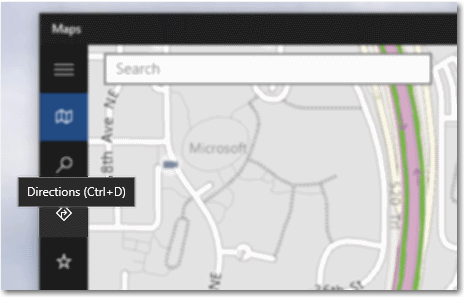

# 도구 설명
<link rel="stylesheet" href="https://az835927.vo.msecnd.net/sites/uwp/Resources/css/custom.css"> 

도구 설명은 다른 컨트롤이나 개체에 연결된 간단한 설명입니다. 도구 설명은 UI에서 직접 설명되지 않은 낯선 개체를 이해하는 데 도움을 줍니다. 도구 설명은 사용자가 포커스를 컨트롤로 이동하거나, 컨트롤을 길게 누르거나, 컨트롤을 마우스 포인터로 가리키면 자동으로 표시됩니다. 도구 설명은 몇 초 후에 또는 사용자가 손가락, 포인터 또는 키보드/게임 패드 포커스를 이동할 때 사라집니다.

<b>중요 API</b> 
<ul>
<li><a href="https://msdn.microsoft.com/library/windows/apps/br227608"><strong>ToolTip 클래스</strong></a></li>
<li><a href="https://msdn.microsoft.com/library/windows/apps/windows.ui.xaml.controls.tooltipservice"><strong>ToolTipService 클래스</strong></a></li>
</ul>

## 올바른 컨트롤인가요?

사용자에게 작업을 수행하도록 요청하기 전에 컨트롤에 대한 추가 정보를 보일 때 도구 설명을 사용합니다. 도구 설명은 작업을 완료하려는 사용자에게 필요한 경우에만 사용해야 합니다. 경험상, 동일한 환경의 다른 곳에서 정보를 사용할 수 있는 경우에는 도구 설명이 필요하지 않습니다. 도구 설명은 불명확한 작업을 확실하게 설명합니다.

도구 설명은 언제 사용해야 하나요? 결정하기 전에 다음 사항을 고려합니다.

-   **마우스로 가리킬 때 정보가 표시되어야 하나요?**
    그렇지 않다면 다른 컨트롤을 사용합니다. 도구 설명은 사용자 조작의 결과로만 표시합니다. 저절로 표시되도록 하지 마세요.

-   **컨트롤에 텍스트 레이블이 있나요?**
    없다면 도구 설명을 사용하여 레이블을 제공합니다. 대부분의 컨트롤에 인라인 레이블을 지정하는 것은 바람직한 UX 디자인 방법이며, 이러한 컨트롤에는 도구 설명이 필요 없습니다. 아이콘만 표시하는 도구 모음 컨트롤과 명령 단추에는 도구 설명이 필요합니다.

-   **개체에 설명이나 추가 정보를 제공하면 이점이 있나요?**
    그렇다면 도구 설명을 사용합니다. 그러나 텍스트는 추가 정보가 되어야 합니다. 즉, 기본 작업에 필수적인 요소가 아니어야 합니다. 필수적이라면 UI에 직접 텍스트를 추가하여 사용자가 설명을 찾아다닐 필요가 없게 합니다.

-   **추가 정보가 오류, 경고 또는 상태 정보입니까?**
    그렇다면 플라이아웃과 같은 UI 요소를 사용합니다.

-   **사용자가 설명과 상호 작용을 해야 합니까?**
    그렇다면 다른 컨트롤을 사용합니다. 도구 설명은 마우스를 움직이면 설명이 사라지므로 사용자 조작을 할 수 없습니다.

-   **사용자가 추가 정보를 인쇄해야 합니까?**
    그렇다면 다른 컨트롤을 사용합니다.

-   **도구 설명이 사용자를 짜증나게 하거나 주의를 분산시키나요?**
    그렇다면 다른 해결 방법을 생각해 보세요. 아무것도 하지 않는 방법도 있습니다. 주의가 산만해질 수 있는 곳에 도구 설명을 사용하고 있다면 사용자가 끌 수 있도록 합니다.

## 예제

Bing 지도 앱의 도구 설명입니다.

## 권장 사항

-   가능한 한 도구 설명을 사용하지 마세요. 도구 설명은 인터럽트입니다. 팝업처럼 도구 설명 때문에 주의가 분산될 수 있으므로 중요한 가치를 추가하지 않을 경우 사용하지 마세요.
-   도구 설명 텍스트를 간결하게 유지합니다. 도구 설명은 짧은 문장과 문장 조각에 적합합니다. 큰 텍스트 블록은 지나칠 수 있으며 사용자가 읽기를 완료하기 전에 도구 설명이 시간 초과될 수도 있습니다.
-   유용한 추가 도구 설명 텍스트를 만듭니다. 도구 설명 텍스트는 정보를 제공해야 합니다. 두드러지게 만들거나 이미 화면에 있는 내용을 단순히 반복하지 않습니다. 도구 설명 텍스트는 항상 보이는 것이 아니므로 사용자가 반드시 읽을 필요는 없는 추가 정보여야 합니다. 별도의 설명이 필요 없는 컨트롤 레이블 또는 적절한 추가 텍스트를 사용하여 중요한 정보를 전달합니다.
-   필요한 경우 이미지를 사용합니다. 도구 설명에 이미지를 사용하는 것이 더 나은 경우가 있습니다. 예를 들어 사용자가 하이퍼링크를 마우스로 가리킬 때 도구 설명을 사용하여 연결된 페이지의 미리 보기를 표시할 수 있습니다.
-   도구 설명을 사용하여 이미 UI에 보이는 텍스트를 표시하지 마세요. 예를 들어 동일한 단추 텍스트를 표시하는 도구 설명을 단추에 배치하지 마세요.
-   대화형 컨트롤을 도구 설명 안에 넣지 마세요.
-   대화형으로 보이는 이미지를 도구 설명에 넣지 마세요.

관련 항목
-----------------------------------------------

* [**ToolTip 클래스**](https://msdn.microsoft.com/library/windows/apps/br227608)

<!--HONumber=Aug16_HO3-->

