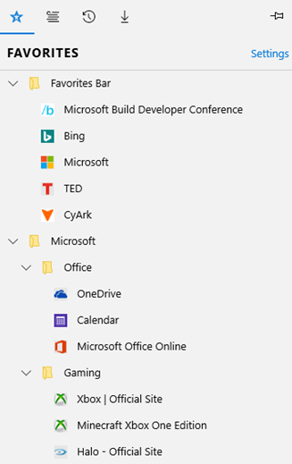
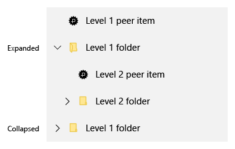
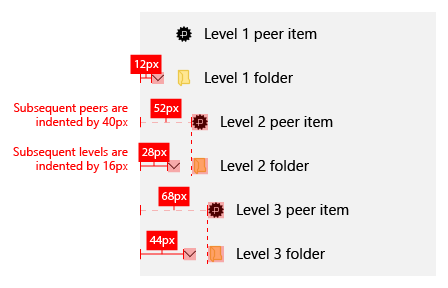

# 트리 뷰를 사용한 계층적 레이아웃
<link rel="stylesheet" href="https://az835927.vo.msecnd.net/sites/uwp/Resources/css/custom.css"> 


TreeView는 중첩된 항목이 포함된 노드를 확장 및 축소하는 계층적 목록 패턴입니다. 중첩된 항목은 추가 노드 또는 일반 목록 항목일 수 있습니다. [ListView](https://msdn.microsoft.com/library/windows/apps/windows.ui.xaml.controls.listview.aspx)를 사용하여 UI에서 폴더 구조 또는 중첩된 관계를 설명하는 트리 뷰를 빌드할 수 있습니다.

[TreeView 샘플](http://go.microsoft.com/fwlink/?LinkId=785018)은 **ListView**를 사용하여 빌드된 참조 구현입니다. 독립 실행형 컨트롤이 아닙니다. Microsoft Edge 브라우저에서 즐겨찾기 창에 표시된 TreeView는 이 참조 구현을 사용합니다.

샘플은 다음을 지원합니다.
- N 수준의 중첩
- 노드 확장/축소
- TreeView 내에서 노드 끌어서 놓기
- 기본 제공 접근성

 | 
-- | --
TreeView 참조 샘플 | Edge 브라우저의 TreeView

## 올바른 패턴인가요?

- 항목에 중첩된 목록 항목이 있고 해당 피어 및 노드에 대한 항목의 계층적 관계를 설명해야 하는 경우에 TreeView를 사용합니다.

- 우선 순위가 아닌 항목의 중첩된 관계를 강조해야 하는 경우에는 TreeView를 사용하지 않습니다. 대부분의 반복 연습 시나리오에서는 일반 목록 보기가 적절합니다.

## TreeView UI 구조

아이콘을 사용하여 TreeView의 노드를 나타낼 수 있습니다. 아이콘 및 들여쓰기의 조합은 폴더/부모 노드와 비폴더/자식 노드 사이의 중첩된 관계를 나타내는 데 사용할 수 있습니다. 다음은 이러한 방법에 대한 지침입니다.

### 아이콘

아이콘을 사용하여 노드 상태(확장 또는 축소)뿐만 아니라 항목이 노드임을 나타냅니다.

#### 펼침 단추

일관성을 위해 축소된 노드는 오른쪽을 가리키는 펼침 단추를 사용해야 하고 확장된 노드는 아래쪽을 가리키는 펼침 단추를 사용해야 합니다.


#### 폴더

폴더의 리터럴 표현에만 폴더 아이콘을 사용합니다.


#### 펼침 단추 및 폴더

TreeView에서 비노드 목록 항목에도 아이콘이 있는 경우에만 펼침 단추와 폴더의 조합을 사용해야 합니다.



#### 폴더 및 비폴더 노드 들여쓰기에 대한 검토

아래 스크린샷에서는 폴더 및 비폴더 노드 들여쓰기에 대해 검토를 사용합니다.



## TreeView 빌드

TreeView에는 다음과 같은 기본 클래스가 있습니다. 이 모두는 참조 구현에 정의되고 포함됩니다.

> **참고**&nbsp;&nbsp;TreeView는 C++로 작성된 [Windows 런타임 구성 요소](https://msdn.microsoft.com/windows/uwp/winrt-components/index)로 구현되어 UWP 앱에서 어느 언어로든 참조될 수 있습니다. 샘플에서 TreeView 코드는 *cpp/Control* 폴더에 위치합니다. C#의 경우 해당 *cs/Control* 폴더가 없습니다.

- `TreeNode` 클래스는 TreeView에 대한 계층적 레이아웃을 구현합니다. 또한 항목 템플릿에서 바인딩할 수 있는 데이터를 포함합니다.
- `TreeView` 클래스는 ItemClick, 폴더 확장/축소 및 끌기 시작 이벤트를 구현합니다.
- `TreeViewItem` 클래스는 놓기 작업에 대한 이벤트를 구현합니다.
- `ViewModel` 클래스는 키보드 탐색 및 끌어서 놓기 등의 작업이 ListView에서 상속될 수 있도록 TreeViewItems 목록을 일반화합니다.

## TreeViewItem에 대한 데이터 템플릿 만들기

다음은 폴더 및 비폴더 유형 항목에 대한 데이터 템플릿을 설정하는 XAML의 섹션입니다.
- ListViewItem을 폴더로 지정하려면 해당 ListViewItem에서 [AllowDrop](https://msdn.microsoft.com/library/windows/apps/windows.ui.xaml.uielement.allowdrop.aspx) 속성을 **true**로 명시적으로 설정해야 합니다. 이 XAML은 그러한 작업을 수행하는 하나의 방식을 보여 줍니다.
- ListViewItem을 비폴더로 지정하려면 ListViewItem 자체에서 어떤 속성도 지정할 필요가 없습니다. ListView에서 AllowDrop 속성을 True로 설정하면 됩니다.
- 확장된/축소된 폴더 아이콘 또는 펼침 단추를 사용하여 폴더가 확장되거나 축소된 경우 시각적으로 나타낼 수 있습니다.
- 변환기를 사용하여 이 예제에서와 같이 확장 및 축소된 상태에 필요한 서로 다른 아이콘을 선택할 수 있습니다.

```xaml
<!-- MainPage.xaml -->
<DataTemplate x:Key="TreeViewItemDataTemplate">
    <StackPanel Orientation="Horizontal" Height="40" Margin="{Binding Depth, Converter={StaticResource IntToIndConverter}}" AllowDrop="{Binding Data.IsFolder}">
        <FontIcon x:Name="expandCollapseChevron"
                  Glyph="{Binding IsExpanded, Converter={StaticResource expandCollapseGlyphConverter}}"
                  Visibility="{Binding Data.IsFolder, Converter={StaticResource booleanToVisibilityConverter}}"                           
                  FontSize="12"
                  Margin="12,8,12,8"
                  FontFamily="Segoe MDL2 Assets"                          
                  />
        <Grid>
            <FontIcon x:Name ="expandCollapseFolder"
                      Glyph="{Binding IsExpanded, Converter={StaticResource folderGlyphConverter}}"
                      Foreground="#FFFFE793"
                      FontSize="16"
                      Margin="0,8,12,8"
                      FontFamily="Segoe MDL2 Assets"
                      Visibility="{Binding Data.IsFolder, Converter={StaticResource booleanToVisibilityConverter}}"
                      />

            <FontIcon x:Name ="nonFolderIcon"
                      Glyph="&#xE160;"
                      Foreground="{ThemeResource SystemControlForegroundBaseLowBrush}"
                      FontSize="12"
                      Margin="20,8,12,8"
                      FontFamily="Segoe MDL2 Assets"
                      Visibility="{Binding Data.IsFolder, Converter={StaticResource inverseBooleanToVisibilityConverter}}"
                      />

            <FontIcon x:Name ="expandCollapseFolderOutline"
                      Glyph="{Binding IsExpanded, Converter={StaticResource folderOutlineGlyphConverter}}"
                      Foreground="#FFECC849"
                      FontSize="16"
                      Margin="0,8,12,8"
                      FontFamily="Segoe MDL2 Assets"
                      Visibility="{Binding Data.IsFolder, Converter={StaticResource booleanToVisibilityConverter}}"/>
        </Grid>

        <TextBlock Text="{Binding Data.Name}"
                   HorizontalAlignment="Stretch"
                   VerticalAlignment="Center"  
                   FontWeight="Medium"
                   FontFamily="Segoe MDL2 Assests"                           
                   Style="{ThemeResource BodyTextBlockStyle}"/>
    </StackPanel>
</DataTemplate>
```

## TreeView에서 데이터 설정

다음은 TreeView 샘플에서 데이터를 설정하는 코드입니다.

```csharp
 public MainPage()
 {
     this.InitializeComponent();

     TreeNode workFolder = CreateFolderNode("Work Documents");
     workFolder.Add(CreateFileNode("Feature Functional Spec"));
     workFolder.Add(CreateFileNode("Feature Schedule"));
     workFolder.Add(CreateFileNode("Overall Project Plan"));
     workFolder.Add(CreateFileNode("Feature Resource allocation"));
     sampleTreeView.RootNode.Add(workFolder);

     TreeNode remodelFolder = CreateFolderNode("Home Remodel");
     remodelFolder.IsExpanded = true;
     remodelFolder.Add(CreateFileNode("Contactor Contact Information"));
     remodelFolder.Add(CreateFileNode("Paint Color Scheme"));
     remodelFolder.Add(CreateFileNode("Flooring woodgrain types"));
     remodelFolder.Add(CreateFileNode("Kitchen cabinet styles"));

     TreeNode personalFolder = CreateFolderNode("Personal Documents");
     personalFolder.IsExpanded = true;
     personalFolder.Add(remodelFolder);

     sampleTreeView.RootNode.Add(personalFolder);
 }

 private static TreeNode CreateFileNode(string name)
 {
     return new TreeNode() { Data = new FileSystemData(name) };
 }

 private static TreeNode CreateFolderNode(string name)
 {
     return new TreeNode() { Data = new FileSystemData(name) { IsFolder = true } };
 }
```

위의 단계를 완료하고 나면 n 수준의 중첩, 폴더 확대/축소 지원, 폴더 간 끌어서 놓기 및 기본 제공 접근성 기능이 있는, 완전히 채워진 TreeView/계층적 레이아웃이 작성됩니다.

TreeView에서 항목을 추가/제거하는 기능을 사용자에게 제공하려면 사용자에게 해당 옵션을 표시하도록 상황에 맞는 메뉴를 추가하는 것이 좋습니다.


## 관련 문서

- [TreeView 샘플](http://go.microsoft.com/fwlink/?LinkId=785018)
- [**ListView**](https://msdn.microsoft.com/library/windows/apps/windows.ui.xaml.controls.listview.aspx)
- [ListView 및 GridView](listview-and-gridview.md)


<!--HONumber=Aug16_HO3-->


