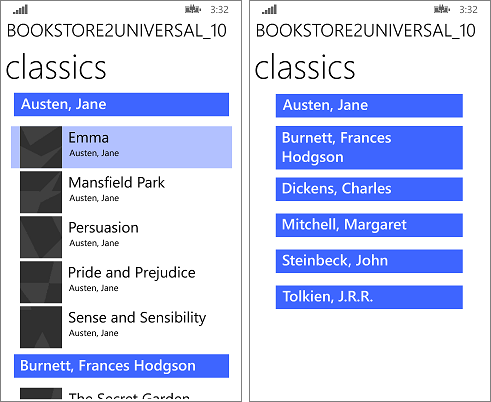

# 데이터 바인딩 심층 분석

\[ Windows 10의 UWP 앱에 맞게 업데이트되었습니다. Windows 8.x 문서는 [보관](http://go.microsoft.com/fwlink/p/?linkid=619132)을 참조하세요. \]


**중요 API**

-   [**Binding 클래스**](https://msdn.microsoft.com/library/windows/apps/BR209820)
-   [**DataContext**](https://msdn.microsoft.com/library/windows/apps/BR208713)
-   [**INotifyPropertyChanged**](https://msdn.microsoft.com/library/windows/apps/BR209899)

> **참고** &nbsp;&nbsp;이 항목에서는 데이터 바인딩 기능에 대해 자세히 설명합니다. 간단하고 실용적인 소개는 [데이터 바인딩 개요](data-binding-quickstart.md)를 참조하세요.


데이터 바인딩은 앱의 UI에서 데이터를 표시하고 선택적으로 해당 데이터와 동기화된 상태를 유지하는 하나의 방법입니다. 데이터 바인딩은 데이터 문제를 UI 문제와 분리하여 개념 모델을 간소화하고 앱의 가독성, 테스트 용이성 및 유지 관리성을 향상시킬 수 있도록 해줍니다.

이러한 데이터 바인딩을 사용하여 UI가 처음 표시될 때 데이터 원본 값의 변경에 반응하지 않고 해당 값을 표시하기만 하도록 할 수 있습니다. 일회성 바인딩이라는 이 기능은 런타임에 해당 값이 변경되지 않는 데이터에 적합합니다. 또한 값을 "관찰"하여 변경될 경우 UI를 업데이트할 수 있습니다. 단방향 바인딩이라는 이 기능은 읽기 전용 데이터에 적합합니다. 마지막으로 사용자가 UI에서 값을 변경한 경우 해당 값이 데이터 원본에 자동으로 다시 적용되도록 관찰하고 업데이트할 수 있습니다. 양방향 바인딩이라는 이 기능은 읽기-쓰기 데이터에 적합합니다. 예를 들면 다음과 같습니다.

-   일회성 바인딩을 사용하여 현재 사용자의 사진을 [**Image**](https://msdn.microsoft.com/library/windows/apps/BR242752)에 바인딩할 수 있습니다.
-   단방향 바인딩을 사용하여 신문 섹션별로 그룹화된 실시간 뉴스 기사 모음에 [**ListView**](https://msdn.microsoft.com/library/windows/apps/BR242878)를 바인딩할 수 있습니다.
-   양방향 바인딩을 사용하여 양식에 있는 고객의 이름에 [**TextBox**](https://msdn.microsoft.com/library/windows/apps/BR209683)를 바인딩할 수 있습니다.

바인딩에는 두 종류가 있으며, 일반적으로 둘 다 UI 태그에 있습니다. [{x:Bind} 태그 확장](https://msdn.microsoft.com/library/windows/apps/Mt204783) 또는 [{Binding} 태그 확장](https://msdn.microsoft.com/library/windows/apps/Mt204782)을 사용하도록 선택할 수 있습니다. 동일한 앱에서 이 둘을 혼합하여 사용할 수도 있으며, 동일한 UI 요소에도 마찬가지입니다. {x:Bind}는 Windows 10의 새로운 기능으로, 향상된 성능을 제공합니다. {Binding}에는 추가 기능이 있습니다. 이 항목에 설명된 모든 세부 정보는 명시적으로 설명하지 않더라도 두 종류의 바인딩 모두에 적용됩니다.

**{x:Bind}를 보여 주는 샘플 앱**

-   [{x:Bind} 샘플](http://go.microsoft.com/fwlink/p/?linkid=619989)
-   [QuizGame](https://github.com/Microsoft/Windows-appsample-quizgame)
-   [XAML UI 기본 사항 샘플](http://go.microsoft.com/fwlink/p/?linkid=619992)

**{Binding}을 보여 주는 샘플 앱**

-   [Bookstore1](http://go.microsoft.com/fwlink/?linkid=532950) 앱 다운로드
-   [Bookstore2](http://go.microsoft.com/fwlink/?linkid=532952) 앱 다운로드

## 모든 바인딩에 포함된 요소

-   *바인딩 소스*. 바인딩할 데이터의 소스이며, 해당 값을 UI에 표시할 멤버가 있는 모든 클래스의 인스턴스일 수 있습니다.
-   *바인딩 대상*. 데이터를 표시하는 UI에서 [**FrameworkElement**](https://msdn.microsoft.com/library/windows/apps/BR208706)의 [**DependencyProperty**](https://msdn.microsoft.com/library/windows/apps/BR242362)입니다.
-   *바인딩 개체*. 소스에서 대상으로, 그리고 선택적으로 대상에서 다시 소스로 데이터 값을 전송하는 요소입니다. 바인딩 개체는 XAML 로드 시 [{x:Bind}](https://msdn.microsoft.com/library/windows/apps/Mt204783) 또는 [{Binding}](https://msdn.microsoft.com/library/windows/apps/Mt204782) 태그 확장에서 만들어집니다.

다음 섹션에서는 바인딩 소스, 바인딩 대상 및 바인딩 개체에 대해 자세히 알아봅니다. 또한 단추의 콘텐츠를 **HostViewModel**이라는 클래스에 속한 **NextButtonText**라는 문자열 속성에 바인딩하는 예제를 이러한 섹션과 함께 링크합니다.

### 바인딩 소스

다음은 바인딩 소스로 사용할 수 있는 클래스의 매우 기본적인 구현입니다.

**참고** Visual C++ 구성 요소 확장(C++/CX)과 함께 [{Binding}](https://msdn.microsoft.com/library/windows/apps/Mt204782)을 사용하는 경우 바인딩 소스 클래스에 [**BindableAttribute**](https://msdn.microsoft.com/library/windows/apps/Hh701872) 특성을 추가해야 합니다. [{x:Bind}](https://msdn.microsoft.com/library/windows/apps/Mt204783)를 사용하는 경우 해당 특성을 추가할 필요가 없습니다. 코드 조각은 [세부 정보 보기 추가](data-binding-quickstart.md#adding-a-details-view)를 참조하세요.

```csharp
public class HostViewModel
{
    public HostViewModel()
    {
        this.NextButtonText = "Next";
    }

    public string NextButtonText { get; set; }
}
```

이 구현의 **HostViewModel**과 해당 속성인 **NextButtonText**는 일회성 바인딩에만 적합합니다. 그러나 단방향 및 양방향 바인딩은 매우 일반적이므로 이러한 종류의 바인딩에서는 바인딩 소스의 데이터 값 변경에 응답하여 UI가 자동으로 업데이트됩니다. 이러한 종류의 바인딩이 제대로 작동하려면 바인딩 개체에서 바인딩 소스를 "관찰할 수 있도록" 확인해야 합니다. 따라서 이 예제에서는 **NextButtonText** 속성에 단방향 또는 양방향 바인딩하려는 경우 해당 속성 값에 대해 런타임에 발생하는 모든 변경 내용을 바인딩 개체에서 관찰할 수 있도록 해야 합니다.

한 가지 방법은 바인딩 소스를 나타내는 클래스를 [**DependencyObject**](https://msdn.microsoft.com/library/windows/apps/BR242356)에서 파생하고 [**DependencyProperty**](https://msdn.microsoft.com/library/windows/apps/BR242362)를 통해 데이터 값을 노출하는 것입니다. 그러면 [**FrameworkElement**](https://msdn.microsoft.com/library/windows/apps/BR208706)가 관찰 가능하게 됩니다. **FrameworkElements**는 즉시 사용할 수 있는 유용한 바인딩 소스입니다.

클래스를 관찰 가능하게 하고 이미 기본 클래스가 있는 클래스에 필요한 클래스로 만드는 보다 간단한 방법은[**System.ComponentModel.INotifyPropertyChanged**](https://msdn.microsoft.com/library/windows/apps/xaml/system.componentmodel.inotifypropertychanged.aspx)를 구현하는 것입니다. 여기에는 실제로 **PropertyChanged**라는 단일 이벤트의 구현이 포함됩니다. **HostViewModel**을 사용하는 예제는 아래와 같습니다.

**참고** C++/CX의 경우 [**Windows::UI::Xaml::Data::INotifyPropertyChanged**](https://msdn.microsoft.com/library/windows/apps/BR209899)를 구현하며, 바인딩 소스 클래스에 [**BindableAttribute**](https://msdn.microsoft.com/library/windows/apps/Hh701872)가 있거나 [**ICustomPropertyProvider**](https://msdn.microsoft.com/library/windows/apps/BR209878)를 구현해야 합니다.

```csharp
public class HostViewModel : INotifyPropertyChanged
{
    private string nextButtonText;

    public event PropertyChangedEventHandler PropertyChanged = delegate { };

    public HostViewModel()
    {
        this.NextButtonText = "Next";
    }

    public string NextButtonText
    {
        get { return this.nextButtonText; }
        set
        {
            this.nextButtonText = value;
            this.OnPropertyChanged();
        }
    }

    public void OnPropertyChanged([CallerMemberName] string propertyName = null)
    {
        // Raise the PropertyChanged event, passing the name of the property whose value has changed.
        this.PropertyChanged(this, new PropertyChangedEventArgs(propertyName));
    }
}
```

이제 **NextButtonText** 속성을 관찰할 수 있습니다. 이 속성에 대한 단방향 또는 양방향 바인딩을 작성할 경우(방법은 나중에 설명) 결과 바인딩 개체는 **PropertyChanged** 이벤트를 구독합니다. 이 이벤트가 발생하면 바인딩 개체의 처리기에 변경된 속성 이름이 포함된 인수가 수신됩니다. 이를 통해 바인딩 개체는 다시 읽어야 하는 속성 값을 인식할 수 있습니다.

위에 표시된 패턴을 여러 번 구현할 필요가 없도록 [QuizGame](https://github.com/Microsoft/Windows-appsample-quizgame) 샘플("Common" 폴더)에 있는 **BindableBase** 기본 클래스에서 파생할 수 있습니다. 관련 예제는 다음과 같습니다.

```csharp
public class HostViewModel : BindableBase
{
    private string nextButtonText;

    public HostViewModel()
    {
        this.NextButtonText = "Next";
    }

    public string NextButtonText
    {
        get { return this.nextButtonText; }
        set { this.SetProperty(ref this.nextButtonText, value); }
    }
}
```

[
            **String.Empty**](https://msdn.microsoft.com/library/windows/apps/xaml/system.string.empty.aspx) 또는 **null** 인수를 사용하여 **PropertyChanged** 이벤트를 발생시킨 경우 이는 개체에 대한 모든 비인덱서 속성을 다시 읽어야 함을 나타냅니다. 특정 인덱서의 경우 "Item\[*indexer*\]"(여기서 *indexer*는 인덱스 값) 인수, 모든 인덱서의 경우 "Item\[\]" 값을 사용하여 개체에 대한 인덱서 속성이 변경되었음을 나타내는 이벤트를 발생시킬 수 있습니다.

바인딩 소스를 해당 속성에 데이터가 포함된 단일 개체 또는 개체 컬렉션으로 처리할 수 있습니다. C# 및 Visual Basic 코드에서는 런타임에 변경되지 않은 컬렉션을 표시하도록 [**List(Of T)**](https://msdn.microsoft.com/library/windows/apps/xaml/6sh2ey19.aspx)를 구현하는 개체에 일회성으로 바인딩할 수 있습니다. 관찰 가능한 컬렉션(컬렉션에서 항목이 추가 및 제거된 경우 관찰)의 경우에는 대신 [**ObservableCollection(Of T)**](https://msdn.microsoft.com/library/windows/apps/xaml/ms668604.aspx)에 단방향으로 바인딩합니다. C++ 코드에서는 관찰 가능한 컬렉션과 관찰 가능하지 않은 컬렉션 모두에 대해 [**Vector&lt;T&gt;**](https://msdn.microsoft.com/library/dn858385.aspx)에 바인딩할 수 있습니다. 사용자 컬렉션 클래스에 바인딩하려면 다음 표의 지침을 따르세요.

| 시나리오                                                        | C# 및 VB(CLR)                                                                                                                                                                                                                                                                                                                                                                                                                   | C++/CX                                                                                                                                                                                                                                                                                                                                                                                                                                                                     |
|-----------------------------------------------------------------|------------------------------------------------------------------------------------------------------------------------------------------------------------------------------------------------------------------------------------------------------------------------------------------------------------------------------------------------------------------------------------------------------------------------------------|----------------------------------------------------------------------------------------------------------------------------------------------------------------------------------------------------------------------------------------------------------------------------------------------------------------------------------------------------------------------------------------------------------------------------------------------------------------------------|
| 개체에 바인딩합니다.                                              | 어떤 개체든 가능합니다.                                                                                                                                                                                                                                                                                                                                                                                                                 | 개체는 [**BindableAttribute**](https://msdn.microsoft.com/library/windows/apps/Hh701872)을(를) 가지고 있거나 [**ICustomPropertyProvider**](https://msdn.microsoft.com/library/windows/apps/BR209878)을(를) 구현해야 합니다.                                                                                                                                                                                                                                                                                                             |
| 바운드 개체에서 속성 변경 업데이트를 가져옵니다.                | 개체는 [**System.ComponentModel. INotifyPropertyChanged**](https://msdn.microsoft.com/library/windows/apps/xaml/system.componentmodel.inotifypropertychanged.aspx)을(를) 구현해야 합니다.                                                                                                                                                                                                                                                                                                         | 개체는 [**Windows.UI.Xaml.Data. INotifyPropertyChanged**](https://msdn.microsoft.com/library/windows/apps/BR209899)을(를) 구현해야 합니다.                                                                                                                                                                                                                                                                                                                                                           |
| 컬렉션에 바인딩됩니다.                                           | [**List(Of T)**](https://msdn.microsoft.com/library/windows/apps/xaml/6sh2ey19.aspx)                                                                                                                                                                                                                                                                                                                                                                            | [**Platform::Collections::Vector&lt;T&gt;**](https://msdn.microsoft.com/library/windows/apps/xaml/hh441570.aspx)                                                                                                                                                                                                                                                                                                                                                                                         |
| 바운드 컬렉션에서 컬렉션 변경 업데이트를 가져옵니다.          | [**ObservableCollection(Of T)**](https://msdn.microsoft.com/library/windows/apps/xaml/ms668604.aspx)                                                                                                                                                                                                                                                                                                                                        | [**Platform::Collections::Vector&lt;T&gt;**](https://msdn.microsoft.com/library/windows/apps/xaml/hh441570.aspx)                                                                                                                                                                                                                                                                                                                                                                                         |
| 바인딩을 지원하는 컬렉션을 구현합니다.                   | [
            **List(Of T)**](https://msdn.microsoft.com/library/windows/apps/xaml/6sh2ey19.aspx)를 확장하거나 [**IList**](https://msdn.microsoft.com/library/windows/apps/xaml/system.collections.ilist.aspx), [**IList**](https://msdn.microsoft.com/library/windows/apps/xaml/5y536ey6.aspx)(Of [**Object**](https://msdn.microsoft.com/library/windows/apps/xaml/system.object.aspx)), [**IEnumerable**](https://msdn.microsoft.com/library/windows/apps/xaml/system.collections.ienumerable.aspx) 또는 [**IEnumerable**](https://msdn.microsoft.com/library/windows/apps/xaml/9eekhta0.aspx)(Of **Object**)를 구현합니다. 제네릭 **IList(Of T)** 및 **IEnumerable(Of T)**에는 바인딩할 수 없습니다. | [
            **IBindableVector**](https://msdn.microsoft.com/library/windows/apps/Hh701979), [**IBindableIterable**](https://msdn.microsoft.com/library/windows/apps/Hh701957), [**IVector**](https://msdn.microsoft.com/library/windows/apps/BR206631)&lt;[**Object**](https://msdn.microsoft.com/library/windows/apps/xaml/system.object.aspx)^&gt;, [**IIterable**](https://msdn.microsoft.com/library/windows/apps/BR226024)&lt;**Object**^&gt;, **IVector**&lt;[**IInspectable**](https://msdn.microsoft.com/library/BR205821)\*&gt;또는 **IIterable**&lt;**IInspectable**\*&gt;을 구현합니다. 제네릭 **IVector&lt;T&gt;** 및 **IIterable&lt;T&gt;**에는 바인딩할 수 없습니다. |
| 컬렉션 변경 업데이트를 지원하는 컬렉션을 구현합니다. | [
            **ObservableCollection(Of T)**](https://msdn.microsoft.com/library/windows/apps/xaml/ms668604.aspx)을(를) 확장하거나 제네릭이 아닌 [**IList**](https://msdn.microsoft.com/library/windows/apps/xaml/system.collections.ilist.aspx) 및 [**INotifyCollectionChanged**](https://msdn.microsoft.com/library/windows/apps/xaml/system.collections.specialized.inotifycollectionchanged.aspx)을(를) 구현합니다.                                                                                                                                                               | [
            **IBindableVector**](https://msdn.microsoft.com/library/windows/apps/Hh701979) 및 [**IBindableObservableVector**](https://msdn.microsoft.com/library/windows/apps/Hh701974)을(를) 구현합니다.                                                                                                                                                                                                                                                                                                                       |
| 증분 로드를 지원하는 컬렉션을 구현합니다.       | [
            **ObservableCollection(Of T)**](https://msdn.microsoft.com/library/windows/apps/xaml/ms668604.aspx)을(를) 확장하거나 제네릭이 아닌 [**IList**](https://msdn.microsoft.com/library/windows/apps/xaml/system.collections.ilist.aspx) 및 [**INotifyCollectionChanged**](https://msdn.microsoft.com/library/windows/apps/xaml/system.collections.specialized.inotifycollectionchanged.aspx)을(를) 구현합니다. 또한 [**ISupportIncrementalLoading**](https://msdn.microsoft.com/library/windows/apps/Hh701916)을(를) 구현합니다.                                                          | [
            **IBindableVector**](https://msdn.microsoft.com/library/windows/apps/Hh701979), [**IBindableObservableVector**](https://msdn.microsoft.com/library/windows/apps/Hh701974) 및 [**ISupportIncrementalLoading**](https://msdn.microsoft.com/library/windows/apps/Hh701916)을 구현합니다.                                                                                                                                                                                                                                         |

 
목록 컨트롤을 임의 크기의 데이터 원본에 바인딩하고 증분 로드를 사용하여 고성능을 유지할 수 있습니다. 예를 들어 한 번에 모든 결과를 로드할 필요 없이 목록 컨트롤을 Bing 이미지 쿼리 결과에 바인딩할 수 있습니다. 대신 일부 결과만 즉시 로드하고 필요에 따라 추가 결과를 로드합니다. 증분 로드를 지원하려면 컬렉션 변경 알림을 지원하는 데이터 원본에서 [**ISupportIncrementalLoading**](https://msdn.microsoft.com/library/windows/apps/Hh701916)을(를) 구현해야 합니다. 데이터 바인딩 엔진이 더 많은 데이터를 요청할 경우 데이터 원본는 적절한 요청을 하고 결과를 통합한 다음 UI를 업데이트하기 위해 적절한 알림을 보내야 합니다.

### 바인딩 대상

아래 두 예제에서 **Button.Content** 속성은 바인딩 대상이고 해당 값은 바인딩 개체를 선언하는 태그 확장으로 설정됩니다. 먼저 [{x:Bind}](https://msdn.microsoft.com/library/windows/apps/Mt204783)가 표시된 다음 [{Binding}](https://msdn.microsoft.com/library/windows/apps/Mt204782)이 표시됩니다. 태그에서 바인딩을 선언하는 것이 일반적입니다(편리하고 읽기 쉬우며 도구 사용이 간편함). 그러나 태그를 피하고 필요한 경우 명령을 통해(프로그래밍 방식으로) [**Binding**](https://msdn.microsoft.com/library/windows/apps/BR209820) 클래스의 인스턴스를 대신 만들 수 있습니다.

<!-- XAML lang specifier not yet supported in OP. Using XML for now. -->
```xml
<Button Content="{x:Bind ...}" ... />
```

```xml
<Button Content="{Binding ...}" ... />
```

### {x:Bind}를 사용하여 선언된 바인딩 개체

[{x:Bind}](https://msdn.microsoft.com/library/windows/apps/Mt204783) 태그를 작성하기 전에 수행해야 하는 한 가지 단계가 있습니다. 태그 페이지를 나타내는 클래스에서 바인딩 소스 클래스를 노출해야 합니다. **HostView** 페이지 클래스에 속성(이 예제의 경우 **HostViewModel** 형식)을 추가하면 됩니다.

```csharp
namespace QuizGame.View
{
    public sealed partial class HostView : Page
    {
        public HostView()
        {
            this.InitializeComponent();
            this.ViewModel = new HostViewModel();
        }
    
        public HostViewModel ViewModel { get; set; }
    }
}
```

이제 바인딩 개체를 선언하는 태그에 대해 좀 더 자세히 알아보겠습니다. 아래 예제에서는 위의 "바인딩 대상" 섹션에서 사용한 것과 동일한 **Button.Content** 바인딩 대상을 사용하여 이 대상이 **HostViewModel.NextButtonText** 속성에 바인딩됨을 보여 줍니다.

```xml
<Page x:Class="QuizGame.View.HostView" ... >
    <Button Content="{x:Bind Path=ViewModel.NextButtonText, Mode=OneWay}" ... />
</Page>
```

**Path**에 대해 지정한 값에 유의하세요. 이 값은 페이지 자체의 컨텍스트에서 해석되며, 이 예제에서는 **HostView** 페이지에 방금 추가한 **ViewModel** 속성을 참조하여 경로가 시작됩니다. 이 속성은 **HostViewModel** 인스턴스를 반환하므로 해당 개체에 점을 찍어 **HostViewModel.NextButtonText** 속성에 액세스할 수 있습니다. 또한 **Mode**를 지정하여 [{x:Bind}](https://msdn.microsoft.com/library/windows/apps/Mt204783) 기본값 일회성을 재정의합니다.

[
            **Path**](https://msdn.microsoft.com/library/windows/apps/windows.ui.xaml.data.binding.path) 속성은 중첩된 속성, 연결된 속성, 정수 및 문자열 인덱서 등에 바인딩하는 데 필요한 다양한 구문 옵션을 지원합니다. 자세한 내용은 [속성 경로 구문](https://msdn.microsoft.com/library/windows/apps/Mt185586)을 참조하세요. 문자열 인덱서에 바인딩하면 [**ICustomPropertyProvider**](https://msdn.microsoft.com/library/windows/apps/BR209878)을(를) 구현할 필요 없이 동적 속성에 바인딩하는 효과가 있습니다. 다른 설정은 [{x:Bind} 태그 확장](https://msdn.microsoft.com/library/windows/apps/Mt204783)을 참조하세요.

**참고** [**TextBox.Text**](https://msdn.microsoft.com/library/windows/apps/windows.ui.xaml.controls.textbox.text)에 대한 변경 내용은 모든 사용자 키 입력 후가 아니라 [**TextBox**](https://msdn.microsoft.com/library/windows/apps/BR209683)가 포커스를 잃을 때 양방향 바인딩 소스로 전송됩니다.

**DataTemplate 및 x:DataType**

[
            **DataTemplate**](https://msdn.microsoft.com/library/windows/apps/BR242348)(항목 템플릿, 콘텐츠 템플릿 또는 헤더 템플릿 중 무엇으로 사용되든지 관계없음) 내에서 **Path** 값은 페이지의 컨텍스트가 아니라 템플릿을 기반으로 만들 데이터 개체의 컨텍스트에서 해석됩니다. 컴파일 타임에 해당 바인딩의 유효성을 검사(그리고 해당 바인딩에 대해 효율적인 코드를 생성)할 수 있도록 **DataTemplate**에서 **x:DataType**을 사용하여 데이터 개체 형식을 선언해야 합니다. 아래 제공된 예제는 **SampleDataGroup** 개체의 컬렉션에 바인딩된 항목 컨트롤의 **ItemTemplate**으로 사용할 수 있습니다.

```xml
<DataTemplate x:Key="SimpleItemTemplate" x:DataType="data:SampleDataGroup">
    <StackPanel Orientation="Vertical" Height="50">
      <TextBlock Text="{x:Bind Title}"/>
      <TextBlock Text="{x:Bind Description}"/>
    </StackPanel>
  </DataTemplate>
```

**경로의 약한 형식의 개체**

Title이라는 문자열 속성을 구현하는 SampleDataGroup이라는 형식을 예로 들어보겠습니다. 또한 형식 개체이지만 실제로는 SampleDataGroup의 인스턴스를 반환하는 MainPage.SampleDataGroupAsObject라는 속성이 있습니다. `<TextBlock Text="{x:Bind SampleDataGroupAsObject.Title}"/>` 바인딩은 형식 개체에서 Title 속성을 찾을 수 없으므로 컴파일 오류를 발생시킵니다. 이 문제의 해결 방법은 다음과 같이 경로 구문에 캐스트를 추가하는 것입니다. `<TextBlock Text="{x:Bind SampleDataGroupAsObject.(data:SampleDataGroup.Title)}"/>`. 다음은 Element가 개체로 선언되지만 실제로는 TextBlock인 다른 예입니다. `<TextBlock Text="{x:Bind Element.Text}"/>`. 그리고 캐스트는 이 문제를 해결합니다. `<TextBlock Text="{x:Bind Element.(TextBlock.Text)}"/>`.

**데이터가 비동기적으로 로드되는 경우**

**{x:Bind}**를 지원하는 코드는 컴파일 시간에 페이지의 partial 클래스에서 생성됩니다. 이러한 파일은 `obj` 폴더(C#의 경우 이름이 `<view name>.g.cs`와 같음)에서 찾을 수 있습니다. 생성된 코드에는 페이지의 [**Loading**](https://msdn.microsoft.com/library/windows/apps/BR208706) 이벤트에 대한 처리기가 포함되며, 해당 처리기는 페이지의 바인딩을 나타내는 생성된 클래스의 **Initialize** 메서드를 호출합니다. 그러면 **Initialize**는 차례로 **Update**를 호출하여 바인딩 소스와 바인딩 대상 간에 데이터를 이동하기 시작합니다. **Loading**은 페이지 또는 사용자 정의 컨트롤의 첫 번째 측정 단계 바로 전에 발생합니다. 따라서 데이터가 비동기적으로 로드되는 경우 **Initialize**가 호출될 때까지 데이터가 준비되지 않을 수 있습니다. 그러므로 데이터를 로드한 후 `this->Bindings->Update();`을 호출하여 일회성 바인딩이 강제로 초기화되도록 할 수 있습니다. 비동기적으로 로드된 데이터에 대해서만 일회성 바인딩이 필요한 경우 이 방법으로 데이터를 초기화하는 것이 단방향 바인딩을 사용하고 변경 내용을 수신 대기하는 것보다 훨씬 비용이 저렴합니다. 데이터가 세분화된 변경을 거치지 않고 특정 작업의 일부로 업데이트될 가능성이 큰 경우 바인딩을 일회성으로 만들고 언제든지 **Update**를 호출하여 강제로 수동 업데이트를 수행할 수 있습니다.

**제한 사항**

**{x:Bind}**는 JSON 개체의 사전 구조를 탐색하는 것과 같은 런타임에 바인딩되는 시나리오에는 적합하지 않을 뿐만 아니라, 속성 이름에 대한 어휘 일치를 기반으로 한 약한 형식의 입력인 덕 타이핑(duck typing)("오리처럼 걷고 헤엄치고 꽥꽥거리면 그것은 오리입니다.")에도 적합하지 않습니다. 덕 타이핑(duck typing)을 사용할 경우 Age 속성에 대한 바인딩은 Person 또는 Wine 개체도 동일하게 만족합니다. 이러한 시나리오의 경우 **{Binding}**을 사용하세요.

### {Binding}을 사용하여 선언된 바인딩 개체

[{Binding}](https://msdn.microsoft.com/library/windows/apps/Mt204782)은 기본적으로 태그 페이지의 [**DataContext**](https://msdn.microsoft.com/library/windows/apps/BR208713)에 바인딩하는 것으로 가정합니다. 따라서 페이지의 **DataContext**를 바인딩 소스 클래스(이 예제의 경우 **HostViewModel** 형식)의 인스턴스로 설정합니다. 아래 예제에서는 바인딩 개체를 선언하는 태그를 보여 줍니다. 위의 "바인딩 대상" 섹션에서 사용한 것과 동일한 **Button.Content** 바인딩 대상을 사용하고 **HostViewModel.NextButtonText** 속성에 바인딩합니다.

```xml
<Page xmlns:viewmodel="using:QuizGame.ViewModel" ... >
    <Page.DataContext>
        <viewmodel:HostViewModel/>
    </Page.DataContext>
    ...
    <Button Content="{Binding Path=NextButtonText}" ... />
</Page>
```

**Path**에 대해 지정한 값에 유의하세요. 이 값은 페이지의 [**DataContext**](https://msdn.microsoft.com/library/windows/apps/BR208713) 컨텍스트(이 예제에서는 **HostViewModel**의 인스턴스로 설정됨)에서 해석됩니다. 경로는 **HostViewModel.NextButtonText** 속성을 참조합니다. 여기에서는 [{Binding}](https://msdn.microsoft.com/library/windows/apps/Mt204782)의 기본값 단방향이 적용되므로 **Mode**를 생략할 수 있습니다.

UI 요소에 대한 [**DataContext**](https://msdn.microsoft.com/library/windows/apps/BR208713)의 기본값은 해당 부모에서 상속된 값입니다. 물론 기본적으로 자식에서 상속되는 **DataContext**를 명시적으로 설정하여 기본값을 재정의할 수 있습니다. 요소에서 **DataContext**를 명시적으로 설정하는 것은 여러 바인딩에서 동일한 소스를 사용하려는 경우에 유용합니다.

바인딩 개체에는 기본적으로 바인딩이 선언된 UI 요소의 [**DataContext**](https://msdn.microsoft.com/library/windows/apps/BR208713)로 설정되는 **Source** 속성이 있습니다. 바인딩에서 **Source**, **RelativeSource** 또는 **ElementName**을 명시적으로 설정하여 이 기본값을 재정의할 수 있습니다(자세한 내용은 [{Binding}](https://msdn.microsoft.com/library/windows/apps/Mt204782) 참조).

[
            **DataTemplate**](https://msdn.microsoft.com/library/windows/apps/BR242348) 내에서 [**DataContext**](https://msdn.microsoft.com/library/windows/apps/BR208713)는 템플릿을 기반으로 만들 데이터 개체로 설정됩니다. 아래 제공된 예제는 **Title** 및 **Description**이라는 문자열 속성이 있는 모든 형식의 컬렉션에 바인딩된 항목 컨트롤의 **ItemTemplate**으로 사용할 수 있습니다.

```xml
<DataTemplate x:Key="SimpleItemTemplate">
    <StackPanel Orientation="Vertical" Height="50">
      <TextBlock Text="{Binding Title}"/>
      <TextBlock Text="{Binding Description"/>
    </StackPanel>
  </DataTemplate>
```

**참고** 기본적으로 [**TextBox.Text**](https://msdn.microsoft.com/library/windows/apps/windows.ui.xaml.controls.textbox.text)에 대한 변경 내용은 [**TextBox**](https://msdn.microsoft.com/library/windows/apps/BR209683)가 포커스를 잃을 때 양방향 바인딩 소스로 전송됩니다. 변경 내용이 모든 사용자 키 입력 후 전송되도록 하려면 태그의 바인딩에서 **UpdateSourceTrigger**를 **PropertyChanged**로 설정합니다. **UpdateSourceTrigger**를 **Explicit**로 설정하여 변경 내용이 소스로 전송되는 경우를 완전히 제어할 수도 있습니다. 그런 다음 텍스트 상자(일반적으로 [**TextBox.TextChanged**](https://msdn.microsoft.com/library/windows/apps/BR209683))에서 이벤트를 처리하고, 대상에서 [**GetBindingExpression**](https://msdn.microsoft.com/library/windows/apps/windows.ui.xaml.frameworkelement.getbindingexpression)을 호출하여 [**BindingExpression**](https://msdn.microsoft.com/library/windows/apps/windows.ui.xaml.data.bindingexpression.aspx) 개체를 가져온 다음 마지막으로 [**BindingExpression.UpdateSource**](https://msdn.microsoft.com/library/windows/apps/windows.ui.xaml.data.bindingexpression.updatesource.aspx)를 호출하여 데이터 원본을 프로그래밍 방식으로 업데이트합니다.

[
            **Path**](https://msdn.microsoft.com/library/windows/apps/windows.ui.xaml.data.binding.path) 속성은 중첩된 속성, 연결된 속성, 정수 및 문자열 인덱서 등에 바인딩하는 데 필요한 다양한 구문 옵션을 지원합니다. 자세한 내용은 [속성 경로 구문](https://msdn.microsoft.com/library/windows/apps/Mt185586)을 참조하세요. 문자열 인덱서에 바인딩하면 [**ICustomPropertyProvider**](https://msdn.microsoft.com/library/windows/apps/BR209878)을(를) 구현할 필요 없이 동적 속성에 바인딩하는 효과가 있습니다. [
            **ElementName**](https://msdn.microsoft.com/library/windows/apps/windows.ui.xaml.data.binding.elementname) 속성은 요소 간 바인딩에 유용합니다. [
            **RelativeSource**](https://msdn.microsoft.com/library/windows/apps/windows.ui.xaml.data.binding.relativesource) 속성은 다양하게 사용되며, 그중 하나로 [**ControlTemplate**](https://msdn.microsoft.com/library/windows/apps/BR209391) 내에서 템플릿 바인딩을 대신하여 더 유용하게 사용됩니다. 다른 설정은 [{Binding} 태그 확장](https://msdn.microsoft.com/library/windows/apps/Mt204782) 및 [**Binding**](https://msdn.microsoft.com/library/windows/apps/BR209820) 클래스를 참조하세요.

## 소스와 대상의 형식이 서로 다른 경우

부울 속성 값을 기반으로 UI 요소의 가시성을 제어하려는 경우, 숫자 값의 범위나 추세를 보여 주는 색상을 사용하여 UI 요소를 렌더링하려는 경우 또는 문자열이 필요한 UI 요소 속성에 날짜 및/또는 시간 값을 표시하려는 경우 형식 간에 값을 변환해야 합니다. 바인딩 소스 클래스에서 올바른 형식의 다른 속성을 노출하고 변환 논리를 캡슐화되고 테스트 가능하도록 유지하는 것이 올바른 해결 방법인 경우가 있습니다. 하지만 이 방법은 소스 및 대상 속성의 개수 또는 조합이 많은 경우 유연하지 않고 확장할 수도 없습니다. 이 경우 값 변환기라는 것을 사용할 수 있습니다. 이 섹션에서는 값 변환기를 구현하고 사용하는 방법을 설명합니다.

다음은 [**DateTime**](https://msdn.microsoft.com/library/windows/apps/xaml/system.datetime.aspx) 값을 월이 포함된 문자열 값으로 변환하는 일회성 또는 단방향 바인딩에 적합한 값 변환기입니다. 이 클래스는 [**IValueConverter**](https://msdn.microsoft.com/library/windows/apps/BR209903)를 구현합니다.

```csharp
public class DateToStringConverter : IValueConverter
{
    // Define the Convert method to convert a DateTime value to 
    // a month string.
    public object Convert(object value, Type targetType, 
        object parameter, string language)
    {
        // value is the data from the source object.
        DateTime thisdate = (DateTime)value;
        int monthnum = thisdate.Month;
        string month;
        switch (monthnum)
        {
            case 1:
                month = "January";
                break;
            case 2:
                month = "February";
                break;
            default:
                month = "Month not found";
                break;
        }
        // Return the value to pass to the target.
        return month;
    }

    // ConvertBack is not implemented for a OneWay binding.
    public object ConvertBack(object value, Type targetType, 
        object parameter, string language)
    {
        throw new NotImplementedException();
    }
}
```

```vbnet
Public Class DateToStringConverter
    Implements IValueConverter

    ' Define the Convert method to change a DateTime object to
    ' a month string.
    Public Function Convert(ByVal value As Object, -
        ByVal targetType As Type, ByVal parameter As Object, -
        ByVal language As String) As Object -
        Implements IValueConverter.Convert

        ' value is the data from the source object.
        Dim thisdate As DateTime = CType(value, DateTime)
        Dim monthnum As Integer = thisdate.Month
        Dim month As String
        Select Case (monthnum)
            Case 1
                month = "January"
            Case 2
                month = "February"
            Case Else
                month = "Month not found"
        End Select
        ' Return the value to pass to the target.
        Return month

    End Function

    ' ConvertBack is not implemented for a OneWay binding.
    Public Function ConvertBack(ByVal value As Object, -
        ByVal targetType As Type, ByVal parameter As Object, -
        ByVal language As String) As Object -
        Implements IValueConverter.ConvertBack

        Throw New NotImplementedException

    End Function
End Class
```

그리고 바인딩 개체 태그에서 해당 값 변환기를 사용할 방법을 다음과 같습니다.

```xml
<UserControl.Resources>
  <local:DateToStringConverter x:Key="Converter1"/>
</UserControl.Resources>

...

<TextBlock Grid.Column="0" 
  Text="{x:Bind ViewModel.Month, Converter={StaticResource Converter1}}"/>

<TextBlock Grid.Column="0" 
  Text="{Binding Month, Converter={StaticResource Converter1}}"/>
```

바인딩에 대해 [**Converter**](https://msdn.microsoft.com/library/windows/apps/windows.ui.xaml.data.binding.converter) 매개 변수가 정의되어 있는 경우 바인딩 엔진은 [**Convert**](https://msdn.microsoft.com/library/windows/apps/hh701934) 및 [**ConvertBack**](https://msdn.microsoft.com/library/windows/apps/hh701938) 메서드를 호출합니다. 소스에서 데이터가 전달되면 바인딩 엔진은 **Convert**를 호출하고 반환되는 데이터를 대상에 전달합니다. 대상에서 데이터가 전달되면(양방향 바인딩의 경우) 바인딩 엔진은 **ConvertBack**을 호출하고 반환되는 데이터를 소스에 전달합니다.

변환기는 다음과 같은 선택적 매개 변수를 사용합니다. [**ConverterLanguage**](https://msdn.microsoft.com/library/windows/apps/windows.ui.xaml.data.binding.converterlanguage) 매개 변수는 변환에 사용할 언어를 지정하는 데 사용되고, [**ConverterParameter**](https://msdn.microsoft.com/library/windows/apps/windows.ui.xaml.data.binding.converterparameter) 매개 변수는 변환 논리에 대한 매개 변수를 전달하는 데 사용됩니다. 변환기 매개 변수에 대한 사용 예제는 [**IValueConverter**](https://msdn.microsoft.com/library/windows/apps/BR209903)를 참조하세요.

**참고** 변환 중에 오류가 발생하더라도 예외가 throw되지 않습니다. 대신 [**DependencyProperty.UnsetValue**](https://msdn.microsoft.com/library/windows/apps/windows.ui.xaml.dependencyproperty.unsetvalue)을(를) 반환하고 데이터 전송을 중지합니다.

바인딩 소스를 확인할 수 없을 때마다 사용할 기본값을 표시하려면 태그에서 바인딩 개체에 대해 **FallbackValue** 속성을 설정합니다. 이 방법은 변환 및 형식 지정 오류를 처리하는 데 유용합니다. 또한 형식이 다른 바인딩된 컬렉션의 일부 개체에 존재하지 않을 수 있는 소스 속성에 바인딩하는 데에도 유용합니다.

텍스트 컨트롤을 문자열이 아닌 값에 바인딩하면 데이터 바인딩 엔진이 값을 문자열로 변환합니다. 값이 참조 형식이면 데이터 바인딩 엔진은 [**ICustomPropertyProvider.GetStringRepresentation**](https://msdn.microsoft.com/library/windows/apps/windows.ui.xaml.data.icustompropertyprovider.getstringrepresentation) 또는 [**IStringable.ToString**](https://msdn.microsoft.com/library/Dn302136)을 호출하여(있는 경우) 문자열 값을 검색하고, 그렇지 않으면 [**Object.ToString**](https://msdn.microsoft.com/library/windows/apps/system.object.tostring.aspx)을 호출합니다. 그러나 바인딩 엔진은 기본 클래스 구현을 숨기는 **ToString** 구현을 무시합니다. 대신 하위 클래스 구현은 기본 클래스 **ToString** 메서드를 재정의해야 합니다. 마찬가지로, 네이티브 언어에서는 모든 관리되는 개체가 [**ICustomPropertyProvider**](https://msdn.microsoft.com/library/windows/apps/BR209878) 및 [**IStringable**](https://msdn.microsoft.com/library/Dn302135)을 구현하는 것처럼 보입니다. 그러나 **GetStringRepresentation** 및 **IStringable.ToString**에 대한 모든 호출은 **Object.ToString** 또는 해당 메서드의 재정의로 라우팅되며, 기본 클래스 구현을 숨기는 새로운 **ToString** 구현으로는 라우팅되지 않습니다.

## {x:Bind}를 사용하는 리소스 사전

[{x:Bind} 태그 확장](https://msdn.microsoft.com/library/windows/apps/Mt204783)은 코드 생성에 종속되므로 **InitializeComponent**를 호출하여 생성된 코드를 초기화하는 생성자가 포함된 코드 숨김 파일이 필요합니다. 파일 이름을 참조하는 대신 해당 형식을 인스턴스화(**InitializeComponent**가 호출되도록)하여 리소스 사전을 다시 사용합니다. 다음은 기존 리소스 사전이 있고 해당 사전에서 {x:Bind}를 사용하려는 경우에 수행할 작업에 대한 예제입니다.

TemplatesResourceDictionary.xaml

```xml
<ResourceDictionary
    x:Class="ExampleNamespace.TemplatesResourceDictionary"
    .....
    xmlns:examplenamespace="using:ExampleNamespace">
    
    <DataTemplate x:Key="EmployeeTemplate" x:DataType="examplenamespace:IEmployee">
        <Grid>
            <TextBlock Text="{x:Bind Name}"/>
        </Grid>
    </DataTemplate>
</ResourceDictionary>
```

TemplatesResourceDictionary.xaml.cs

```csharp
using Windows.UI.Xaml.Data;
 
namespace ExampleNamespace
{
    public partial class TemplatesResourceDictionary
    {
        public TemplatesResourceDictionary()
        {
            InitializeComponent();
        }
    }
}
```

MainPage.xaml

```xml
<Page x:Class="ExampleNamespace.MainPage"
    ....
    xmlns:examplenamespace="using:ExampleNamespace">

    <Page.Resources>
        <ResourceDictionary>
            .... 
            <ResourceDictionary.MergedDictionaries>
                <examplenamespace:TemplatesResourceDictionary/>
            </ResourceDictionary.MergedDictionaries>
        </ResourceDictionary>
    </Page.Resources>
</Page>
```

## 이벤트 바인딩 및 ICommand

[{x:Bind}](https://msdn.microsoft.com/library/windows/apps/Mt204783)는 이벤트 바인딩이라는 기능을 지원합니다. 이 기능을 사용하면 바인딩을 사용하여 이벤트에 대한 처리기를 지정할 수 있습니다. 이는 코드 숨김 파일의 메서드를 사용하여 이벤트를 처리하는 것 외의 추가 옵션입니다. **MainPage** 클래스에 **RootFrame** 속성이 있다고 가정해 보겠습니다.

```csharp
    public sealed partial class MainPage : Page
    {
        ....    
        public Frame RootFrame { get { return Window.Current.Content as Frame; } }
    }
```

이와 같은 **RootFrame** 속성에서 반환되는 **Frame** 개체의 메서드에 단추의 **Click** 이벤트를 바인딩할 수 있습니다. 또한 단추의 **IsEnabled** 속성을 동일한 **Frame**의 다른 멤버에 바인딩할 수 있습니다.

```xml
    <AppBarButton Icon="Forward" IsCompact="True"
    IsEnabled="{x:Bind RootFrame.CanGoForward, Mode=OneWay}"
    Click="{x:Bind RootFrame.GoForward}"/>
```

오버로드된 메서드는 이 기술을 사용하여 이벤트를 처리하는 데 사용할 수 없습니다. 또한 이벤트를 처리하는 메서드에 매개 변수가 있는 경우 각각 모든 이벤트 매개 변수의 형식에서 할당 가능해야 합니다. 이 경우 [**Frame.GoForward**](https://msdn.microsoft.com/library/windows/apps/BR242693)는 오버로드되지 않고 매개 변수가 없습니다(그러나 두 개의 **object** 매개 변수를 사용한 경우에도 유효함). [
            **Frame.GoBack**](https://msdn.microsoft.com/library/windows/apps/Dn996568)은 오버로드되므로 이 기술에서는 이 메서드를 사용할 수 없습니다.

이벤트 바인딩 기술은 명령(명령은 [**ICommand**](https://msdn.microsoft.com/library/windows/apps/windows.ui.xaml.input.icommand.aspx) 인터페이스를 구현하는 개체를 반환하는 속성)을 구현하고 사용하는 것과 유사합니다. [{x:Bind}](https://msdn.microsoft.com/library/windows/apps/Mt204783)와 [{Binding}](https://msdn.microsoft.com/library/windows/apps/Mt204782) 둘 다 명령과 함께 작동합니다. 명령 패턴을 여러 번 구현할 필요가 없도록 [QuizGame](https://github.com/Microsoft/Windows-appsample-quizgame) 샘플("Common" 폴더)에 있는 **DelegateCommand** 도우미 클래스를 사용할 수 있습니다.


## 폴더 또는 파일 컬렉션에 바인딩

[
            **Windows.Storage**](https://msdn.microsoft.com/library/windows/apps/BR227346) 네임스페이스의 API를 사용하여 폴더 및 파일 데이터를 검색할 수 있습니다. 그러나 다양한 **GetFilesAsync**, **GetFoldersAsync** 및 **GetItemsAsync** 메서드는 목록 컨트롤에 바인딩하기에 적합한 값을 반환하지 않습니다. 대신 [**FileInformationFactory**](https://msdn.microsoft.com/library/windows/apps/BR207501) 클래스의 [**GetVirtualizedFilesVector**](https://msdn.microsoft.com/library/windows/apps/Hh701422), [**GetVirtualizedFoldersVector**](https://msdn.microsoft.com/library/windows/apps/Hh701428) 및 [**GetVirtualizedItemsVector**](https://msdn.microsoft.com/library/windows/apps/Hh701430) 메서드의 반환 값에 바인딩해야 합니다. [StorageDataSource 및 GetVirtualizedFilesVector 샘플](http://go.microsoft.com/fwlink/p/?linkid=228621)의 다음 코드 예제는 일반적인 사용 패턴을 보여 줍니다. 앱 패키지 매니페스트에서 **picturesLibrary** 기능을 선언하고 그림 라이브러리 폴더에 그림이 있는지 확인해야 합니다.

```csharp
        protected override void OnNavigatedTo(NavigationEventArgs e)
        {
            var library = Windows.Storage.KnownFolders.PicturesLibrary;
            var queryOptions = new Windows.Storage.Search.QueryOptions();
            queryOptions.FolderDepth = Windows.Storage.Search.FolderDepth.Deep;
            queryOptions.IndexerOption = Windows.Storage.Search.IndexerOption.UseIndexerWhenAvailable;

            var fileQuery = library.CreateFileQueryWithOptions(queryOptions);

            var fif = new Windows.Storage.BulkAccess.FileInformationFactory(
                fileQuery,
                Windows.Storage.FileProperties.ThumbnailMode.PicturesView,
                190,
                Windows.Storage.FileProperties.ThumbnailOptions.UseCurrentScale,
                false
                );

            var dataSource = fif.GetVirtualizedFilesVector();
            this.PicturesListView.ItemsSource = dataSource;
        }
```

일반적으로 이 접근 방식을 사용하여 파일 및 폴더 정보의 읽기 전용 보기를 만듭니다. 예를 들어 사용자가 음악 보기에서 노래를 평가할 수 있도록 파일 및 폴더 속성에 대한 양방향 바인딩을 만들 수 있습니다. 그러나 적절한 **SavePropertiesAsync** 메서드(예: [**MusicProperties.SavePropertiesAsync**](https://msdn.microsoft.com/library/windows/apps/BR207760))를 호출할 때까지 변경 사항은 지속되지 않습니다. 항목이 초점을 잃으면 선택 초기화가 트리거되므로 변경 사항을 적용해야 합니다.

이 기술을 사용한 양방향 바인딩은 음악과 같이 인덱싱된 위치에서만 작동합니다. [
            **FolderInformation.GetIndexedStateAsync**](https://msdn.microsoft.com/library/windows/apps/BR207627) 메서드를 호출하여 위치가 인덱싱되었는지 여부를 확인할 수 있습니다.

가상화된 벡터는 해당 값을 채우기 전에 일부 항목에 대해 **null**을 반환할 수도 있습니다. 예를 들어 가상화된 벡터에 바인딩된 목록 컨트롤의 [**SelectedItem**](https://msdn.microsoft.com/library/windows/apps/BR209770) 값을 사용하기 전에 **null**을 확인하거나 [**SelectedIndex**](https://msdn.microsoft.com/library/windows/apps/BR209768)를 대신 사용해야 합니다.

## 키별로 그룹화된 데이터에 바인딩

항목의 단순 컬렉션(예를 들어 **BookSku** 클래스로 표현되는 책)을 가져와 공용 속성(예를 들어 **BookSku.AuthorName** 속성)을 키로 사용하여 항목을 그룹화한 경우 그룹화된 데이터가 호출됩니다. 데이터를 그룹화한 경우 해당 데이터는 더 이상 단순 컬렉션이 아닙니다. 그룹화된 데이터는 각 그룹 개체에 a) 키 및 b) 속성이 해당 키와 일치하는 항목의 컬렉션이 있는 그룹 개체의 컬렉션입니다. 책을 다시 예로 들어 저자 이름별로 책을 그룹화하면 각 그룹에 a) 저자 이름인 키 및 b) **AuthorName** 속성이 그룹의 키와 일치하는 **BookSku** 컬렉션이 있는 저자 이름 그룹 컬렉션이 생성됩니다.

일반적으로 컬렉션을 표시하려면 항목 컨트롤의 [**ItemsSource**](https://msdn.microsoft.com/library/windows/apps/BR242828)(예: [**ListView**](https://msdn.microsoft.com/library/windows/apps/BR242878) 또는 [**GridView**](https://msdn.microsoft.com/library/windows/apps/BR242705))를 컬렉션을 반환하는 속성에 직접 바인딩합니다. 항목의 단순 컬렉션이 없는 경우에는 특별히 수행해야 하는 작업이 없습니다. 그러나 그룹화된 데이터에 바인딩하는 경우처럼 그룹 개체의 컬렉션인 경우 항목 컨트롤과 바인딩 소스 사이에 있는 [**CollectionViewSource**](https://msdn.microsoft.com/library/windows/apps/BR209833)라는 중간 개체의 서비스가 필요합니다. **CollectionViewSource**를 그룹화된 데이터를 반환하는 속성에 바인딩하고, 항목 컨트롤을 **CollectionViewSource**에 바인딩합니다. **CollectionViewSource**의 추가적인 부가 가치는 현재 항목을 추적하므로 둘 이상의 항목 컨트롤을 모두 동일한 **CollectionViewSource**에 바인딩하여 동기화된 상태로 유지할 수 있다는 점입니다. 또한 [**CollectionViewSource.View**](https://msdn.microsoft.com/library/windows/apps/windows.ui.xaml.data.collectionviewsource.view) 속성에서 반환되는 개체의 [**ICollectionView.CurrentItem**](https://msdn.microsoft.com/library/windows/apps/BR209857) 속성을 통해 현재 항목에 프로그래밍 방식으로 액세스할 수 있습니다.

[
            **CollectionViewSource**](https://msdn.microsoft.com/library/windows/apps/BR209833)의 그룹화 기능을 활성화하려면 [**IsSourceGrouped**](https://msdn.microsoft.com/library/windows/apps/windows.ui.xaml.data.collectionviewsource.issourcegrouped)를 **true**로 설정합니다. [
            **ItemsPath**](https://msdn.microsoft.com/library/windows/apps/windows.ui.xaml.data.collectionviewsource.itemspath) 속성을 설정해야 하는지 여부는 정확히 그룹 개체를 작성하는 방법에 따라 결정됩니다. 그룹 개체를 작성하는 방법에는 "is-a-group" 패턴과 "has-a-group" 패턴의 두 가지 방법이 있습니다. "is-a-group" 패턴에서는 그룹 개체가 컬렉션 형식(예: **List&lt;T&gt;**)에서 파생되므로 실제로 그룹 개체는 항목 그룹 자체입니다. 이 패턴을 사용하면 **ItemsPath**를 설정하지 않아도 됩니다. "has-a-group" 패턴에서는 그룹 개체가 하나 이상의 컬렉션 형식(예: **List&lt;T&gt;**) 속성을 가지므로 그룹에 속성 형식의 항목 그룹 "하나가 있습니다"(또는 여러 속성 형식의 여러 항목 그룹). 이 패턴을 사용하면 **ItemsPath**를 항목 그룹을 포함하는 속성 이름으로 설정해야 합니다.

아래 예제에서는 "has-a-group" 패턴을 보여 줍니다. 페이지 클래스에서 뷰 모델의 인스턴스를 반환하는 [**ViewModel**](https://msdn.microsoft.com/library/windows/apps/BR208713)이라는 속성이 있습니다. [
            **CollectionViewSource**](https://msdn.microsoft.com/library/windows/apps/BR209833)는 뷰 모델의 **Authors** 속성(**Authors**는 그룹 개체의 컬렉션)에 바인딩되며, 그룹화된 항목을 포함하는 **Author.BookSkus** 속성임을 지정합니다. 마지막으로 [**GridView**](https://msdn.microsoft.com/library/windows/apps/BR242705)는 **CollectionViewSource**에 바인딩되며, 그룹의 항목을 렌더링할 수 있도록 그룹 스타일이 정의되어 있습니다.

```csharp
    <Page.Resources>
        <CollectionViewSource
        x:Name="AuthorHasACollectionOfBookSku"
        Source="{x:Bind ViewModel.Authors}"
        IsSourceGrouped="true"
        ItemsPath="BookSkus"/>
    </Page.Resources>
    ...

    <GridView
    ItemsSource="{Binding Source={StaticResource AuthorHasACollectionOfBookSku}}" ...>
        <GridView.GroupStyle>
            <GroupStyle
                HeaderTemplate="{StaticResource AuthorGroupHeaderTemplateWide}" ... />
        </GridView.GroupStyle>
    </GridView>
```

[
            **ItemsSource**](https://msdn.microsoft.com/library/windows/apps/BR242828)는 **Source** 속성을 리소스로 설정해야 하므로 [{x:Bind}](https://msdn.microsoft.com/library/windows/apps/Mt204783)가 아니라 [{Binding}](https://msdn.microsoft.com/library/windows/apps/Mt204782)을 사용해야 합니다. 완전한 앱의 컨텍스트에서 위의 예제를 보려면 [Bookstore2](http://go.microsoft.com/fwlink/?linkid=532952) 샘플 앱을 다운로드하세요. 위에 표시된 태그와 달리 [Bookstore2](http://go.microsoft.com/fwlink/?linkid=532952)는 {Binding}을 단독으로 사용합니다.

"is-a-group" 패턴을 구현하는 방법에는 두 가지 방법이 있습니다. 한 가지 방법은 사용자 고유의 그룹 클래스를 작성하는 것입니다. **List&lt;T&gt;**(여기서 *T*는 항목의 형식)에서 클래스를 파생합니다. 예를 들면 `public class Author : List<BookSku>`입니다. 두 번째 방법은 [LINQ](http://msdn.microsoft.com/library/bb397926.aspx) 식을 사용하여 **BookSku** 항목의 유사한 속성 값에서 그룹 개체(및 그룹 클래스)를 동적으로 만드는 것입니다. 이 방법(항목의 단순 목록만 유지하고 즉석에서 그룹화)은 클라우드 서비스에서 데이터에 액세스하는 앱에 일반적입니다. **Author** 및 **Genre**와 같이 특정 그룹 클래스가 필요 없는 책을 저자 또는 장르 등으로 유연하게 그룹화할 수 있게 됩니다.

아래 예제에서는 [LINQ](http://msdn.microsoft.com/library/bb397926.aspx)를 사용하는 "is-a-group" 패턴을 보여 줍니다. 여기에서는 장르별로 책을 그룹화합니다. 따라서 그룹 머리글에 장르 이름으로 책이 표시됩니다. 이는 그룹 [**Key**](https://msdn.microsoft.com/library/windows/apps/bb343251.aspx) 값에 대한 "Key" 속성 경로로 표시됩니다.

```csharp
    using System.Linq;

    ...

    private IOrderedEnumerable<IGrouping<string, BookSku>> genres;

    public IOrderedEnumerable<IGrouping<string, BookSku>> Genres
    {
        get
        {
            if (this.genres == null)
            {
                this.genres = from book in this.bookSkus
                group book by book.genre into grp
                orderby grp.Key select grp;
            }
            return this.genres;
        }
    }
```

데이터 템플릿에서 [{x:Bind}](https://msdn.microsoft.com/library/windows/apps/Mt204783)를 사용할 때는 **x:DataType** 값을 설정하여 바인딩할 형식을 나타내야 합니다. 형식이 제네릭인 경우 태그로 표현할 수 없으므로 대신 그룹 스타일 헤더 템플릿에서 [{Binding}](https://msdn.microsoft.com/library/windows/apps/Mt204782)을 사용해야 합니다.

```xml
    <Grid.Resources>
        <CollectionViewSource x:Name="GenreIsACollectionOfBookSku"
        Source="{Binding Genres}"
        IsSourceGrouped="true"/>
    </Grid.Resources>
    <GridView ItemsSource="{Binding Source={StaticResource GenreIsACollectionOfBookSku}}">
        <GridView.ItemTemplate x:DataType="local:BookTemplate">
            <DataTemplate>
                <TextBlock Text="{x:Bind Title}"/>
            </DataTemplate>
        </GridView.ItemTemplate>
        <GridView.GroupStyle>
            <GroupStyle>
                <GroupStyle.HeaderTemplate>
                    <DataTemplate>
                        <TextBlock Text="{Binding Key}"/>
                    </DataTemplate>
                </GroupStyle.HeaderTemplate>
            </GroupStyle>
        </GridView.GroupStyle>
    </GridView>
```

[
            **SemanticZoom**](https://msdn.microsoft.com/library/windows/apps/Hh702601) 컨트롤은 사용자가 그룹화된 데이터를 보고 탐색하는 데 유용한 방법입니다. [Bookstore2](http://go.microsoft.com/fwlink/?linkid=532952) 샘플 앱은 **SemanticZoom**을 사용하는 방법을 보여 줍니다. 이 앱에서는 저자별로 그룹화된 책 목록을 보거나(확대 보기), 축소하여 저자의 점프 목록(축소 보기)을 볼 수 있습니다. 점프 목록은 책 목록을 스크롤할 때보다 훨씬 더 빠른 탐색이 가능케 합니다. 확대 및 축소 보기는 실제로 동일한 **CollectionViewSource**에 바인딩된 **ListView** 또는 **GridView** 컨트롤입니다.



계층적 데이터(예: 범주 내의 하위 범주)에 바인딩하는 경우 UI에서 일련의 항목 컨트롤이 포함된 계층 수준을 표시할 수 있습니다. 하나의 항목 컨트롤에서 선택한 사항에 따라 이후 항목 컨트롤의 콘텐츠가 결정됩니다. 각 목록을 자체 [**CollectionViewSource**](https://msdn.microsoft.com/library/windows/apps/BR209833) 및 **CollectionViewSource** 인스턴스에 체인으로 함께 바인딩하여 목록을 동기화 상태로 유지할 수 있습니다. 이를 마스터/세부 정보(또는 목록/세부 정보) 보기라고 합니다. 자세한 내용은 [계층적 데이터에 바인딩하고 마스터/세부 정보 보기를 만드는 방법](how-to-bind-to-hierarchical-data-and-create-a-master-details-view.md)을 참조하세요.

## 데이터 바인딩 문제 진단 및 디버깅

바인딩 태그는 속성(C#의 경우 때로 필드와 메서드도 포함됨) 이름을 포함합니다. 따라서 속성 이름을 바꾼 경우 해당 속성을 참조하는 바인딩도 변경해야 합니다. 그러지 않으면 일반적인 데이터 바인딩 버그가 발생하며 앱이 컴파일되지 않거나 제대로 작동하지 않습니다.

[{x:Bind}](https://msdn.microsoft.com/library/windows/apps/Mt204783) 및 [{Binding}](https://msdn.microsoft.com/library/windows/apps/Mt204782)에서 만든 바인딩 개체는 기능적으로 거의 동일합니다. 그러나 {x:Bind}는 바인딩 소스에 대한 형식 정보가 있으며, 컴파일 타임에 소스 코드를 생성합니다. {x:Bind}를 사용하면 코드의 나머지 부분에서 발생한 것과 동일한 종류의 문제를 검색할 수 있습니다. 여기에는 바인딩 식에 대한 컴파일 타임 유효성 검사와 페이지의 부분 클래스로 생성된 소스 코드에 중단점을 설정하는 방식의 디버깅이 포함됩니다. 이러한 클래스는 `obj` 폴더의 파일(C#의 경우 이름이 `<view name>.g.cs`와 같음)에서 찾을 수 있습니다. 바인딩에 문제가 있는 경우 Microsoft Visual Studio 디버거에서 **처리되지 않은 예외 발생 시 중단**을 설정합니다. 디버거가 이 시점에 실행을 중단하므로 잘못된 것을 디버그할 수 있습니다. {x:Bind}에 의해 생성된 코드는 바인딩 소스 코드 그래프의 각 부분에 대해 동일한 패턴을 따르며, **호출 스택** 창의 정보를 사용하여 문제에 이르는 호출 시퀀스를 결정할 수 있습니다.

[{Binding}](https://msdn.microsoft.com/library/windows/apps/Mt204782)에는 바인딩 소스에 대한 형식 정보가 없습니다. 그러나 디버거를 연결한 상태로 앱을 실행하면 Visual Studio의 **출력** 창에 모든 바인딩 오류가 표시됩니다.

## 코드에서 바인딩 만들기

**참고** 이 섹션은 [{Binding}](https://msdn.microsoft.com/library/windows/apps/Mt204782)에만 적용됩니다. 코드에서 [{x:Bind}](https://msdn.microsoft.com/library/windows/apps/Mt204783) 바인딩을 만들 수 없기 때문입니다. 그러나 모든 종속성 속성에 대한 변경 알림을 등록할 수 있는 [**DependencyObject.RegisterPropertyChangedCallback**](https://msdn.microsoft.com/library/windows/apps/windows.ui.xaml.dependencyobject.registerpropertychangedcallback.aspx)을 사용해서도 {x:Bind}를 사용할 때와 동일한 이점을 얻을 수 있습니다.

XAML 대신 절차 코드를 사용하여 UI 요소를 데이터에 연결할 수도 있습니다. 이렇게 하려면 새로운 [**Binding**](https://msdn.microsoft.com/library/windows/apps/BR209820) 개체를 만들고, 적절한 속성을 설정하고, [**FrameworkElement.SetBinding**](https://msdn.microsoft.com/library/windows/apps/br244257.aspx) 또는 [**BindingOperations.SetBinding**](https://msdn.microsoft.com/library/windows/apps/br244376.aspx)을 호출합니다. 런타임에 바인딩 속성 값을 선택하거나 여러 컨트롤 간에 단일 바인딩을 공유하려는 경우 프로그래밍 방식으로 바인딩을 만드는 것이 유용합니다. 그러나 **SetBinding**을 호출한 후에는 바인딩 속성 값을 변경할 수 없습니다.

다음 예제는 코드에서 바인딩을 구현하는 방법을 보여 줍니다.

```xml
<TextBox x:Name="MyTextBox" Text="Text"/>
```

```csharp
// Create an instance of the MyColors class 
// that implements INotifyPropertyChanged.
MyColors textcolor = new MyColors();

// Brush1 is set to be a SolidColorBrush with the value Red.
textcolor.Brush1 = new SolidColorBrush(Colors.Red);

// Set the DataContext of the TextBox MyTextBox.
MyTextBox.DataContext = textcolor;

// Create the binding and associate it with the text box.
Binding binding = new Binding() { Path = new PropertyPath("Brush1") };
MyTextBox.SetBinding(TextBox.ForegroundProperty, binding);
```

```vbnet
' Create an instance of the MyColors class 
' that implements INotifyPropertyChanged. 
Dim textcolor As New MyColors()

' Brush1 is set to be a SolidColorBrush with the value Red. 
textcolor.Brush1 = New SolidColorBrush(Colors.Red)

' Set the DataContext of the TextBox MyTextBox. 
MyTextBox.DataContext = textcolor

' Create the binding and associate it with the text box.
Dim binding As New Binding() With {.Path = New PropertyPath("Brush1")}
MyTextBox.SetBinding(TextBox.ForegroundProperty, binding)
```

## {x:Bind}와 {Binding}의 기능 비교

| 기능 | {x:Bind} | {Binding} | 참고 |
|---------|----------|-----------|-------|
| 경로가 기본 속성 | `{x:Bind a.b.c}` | `{Binding a.b.c}` | | 
| 속성 경로 | `{x:Bind Path=a.b.c}` | `{Binding Path=a.b.c}` | x:Bind에서는 경로의 루트가 기본적으로 DataContext가 아니라 Page에서 지정됩니다. | 
| 인덱서 | `{x:Bind Groups[2].Title}` | `{Binding Groups[2].Title}` | 컬렉션의 지정된 항목에 바인딩됩니다. 정수 기반 인덱스만 지원됩니다. | 
| 연결된 속성 | `{x:Bind Button22.(Grid.Row)}` | `{Binding Button22.(Grid.Row)}` | 연결된 속성은 괄호 안에 지정됩니다. XAML 네임스페이스에서 속성이 선언되지 않은 경우 문서 헤드의 코드 네임스페이스에 매핑되어야 하는 xml 네임스페이스를 접두사로 사용합니다. | 
| 캐스팅 | `{x:Bind groups[0].(data:SampleDataGroup.Title)}` | 필요하지 않습니다.&lt; | 캐스트는 괄호 안에 지정됩니다. XAML 네임스페이스에서 속성이 선언되지 않은 경우 문서 헤드의 코드 네임스페이스에 매핑되어야 하는 xml 네임스페이스를 접두사로 사용합니다. | 
| 변환기 | `{x:Bind IsShown, Converter={StaticResource BoolToVisibility}}` | `{Binding IsShown, Converter={StaticResource BoolToVisibility}}` | 변환기는 Page/ResourceDictionary 또는 App.xaml에서 선언해야 합니다. | 
| ConverterParameter, ConverterLanguage | `{x:Bind IsShown, Converter={StaticResource BoolToVisibility}, ConverterParameter=One, ConverterLanguage=fr-fr}` | `{Binding IsShown, Converter={StaticResource BoolToVisibility}, ConverterParameter=One, ConverterLanguage=fr-fr}` | 변환기는 Page/ResourceDictionary 또는 App.xaml에서 선언해야 합니다. | 
| TargetNullValue | `{x:Bind Name, TargetNullValue=0}` | `{Binding Name, TargetNullValue=0}` | 바인딩 식의 리프가 null일 때 사용됩니다. 문자열 값에 작은따옴표를 사용합니다. | 
| FallbackValue | `{x:Bind Name, FallbackValue='empty'}` | `{Binding Name, FallbackValue='empty'}` | 바인딩에 대한 경로의 일부(리프 제외)가 null일 때 사용됩니다. | 
| ElementName | `{x:Bind slider1.Value}` | `{Binding Value, ElementName=slider1}` | {x:Bind}를 사용하면 필드에 바인딩됩니다. 경로의 루트가 기본적으로 Page에서 지정되므로 해당 필드를 통해 모든 명명된 요소에 액세스할 수 있습니다. | 
| RelativeSource: Self | `<Rectangle x:Name="rect1" Width="200" Height="{x:Bind rect1.Width}" ... />` | `<Rectangle Width="200" Height="{Binding Width, RelativeSource={RelativeSource Self}}" ... />` | {x:Bind}를 사용하는 경우 요소의 이름을 지정하고 경로에서 해당 이름을 사용합니다. | 
| RelativeSource: TemplatedParent | 지원되지 않음 | `{Binding <path>, RelativeSource={RelativeSource TemplatedParent}}` | 일반 템플릿 바인딩은 대부분 컨트롤 템플릿에서 사용할 수 있습니다. 하지만 변환기 또는 양방향 바인딩을 사용해야 하는 경우 TemplatedParent를 사용합니다.&lt; | 
| 원본 | 지원되지 않음 | `<ListView ItemsSource="{Binding Orders, Source={StaticResource MyData}}"/>` | {x:Bind}의 경우 속성 또는 정적 경로를 대신 사용합니다. | 
| 모드 | `{x:Bind Name, Mode=OneWay}` | `{Binding Name, Mode=TwoWay}` | 모드는 OneTime, OneWay 또는 TwoWay일 수 있습니다. {x:Bind} defaults to OneTime; {Binding} defaults to OneWay. | 
| UpdateSourceTrigger | 지원되지 않음 | `<Binding UpdateSourceTrigger="Default [or] PropertyChanged [or] Explicit"/>` | {x:Bind}에서는 손실된 포커스에서 소스를 업데이트할 때까지 기다리는 TextBox.Text를 제외하고 모든 경우에 PropertyChanged 동작을 사용합니다. | 


<!--HONumber=Jun16_HO4-->


