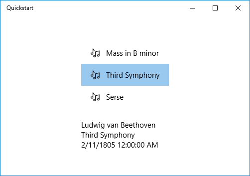

# <a name="data-binding-overview"></a>데이터 바인딩 개요

이 항목에서는 UWP(유니버설 Windows 플랫폼) 앱에서 컨트롤(또는 다른 UI 요소)을 단일 항목에 바인딩하거나 항목 컨트롤을 항목 컬렉션에 바인딩하는 방법을 보여 줍니다. 또한 항목의 렌더링을 제어하고 선택 항목을 기반으로 세부 정보 보기를 구현하고, 표시할 데이터를 변환하는 방법을 보여 줍니다. 자세한 내용은 [데이터 바인딩 심층 분석](data-binding-in-depth.md)을 참조하세요.

## <a name="prerequisites"></a>필수 조건

이 항목에서는 사용자가 기본 UWP 앱을 만드는 방법을 알고 있다고 가정합니다. 첫 UWP 앱을 만드는 방법은 [Windows 앱 시작](https://developer.microsoft.com/windows/getstarted)을 참조하세요.

## <a name="create-the-project"></a>프로젝트 만들기

**비어 있는 응용 프로그램(Windows 유니버설)** 프로젝트를 만듭니다. 이름을 "Quickstart"로 지정합니다.

## <a name="binding-to-a-single-item"></a>단일 항목에 바인딩

모든 바인딩은 바인딩 대상과 바인딩 소스로 구성됩니다. 일반적으로 대상은 컨트롤 또는 기타 UI 요소의 속성이고, 소스는 클래스 인스턴스(데이터 모델 또는 뷰 모델)의 속성입니다. 이 예제에서는 컨트롤을 단일 항목에 바인딩하는 방법을 보여 줍니다. 대상은 **TextBlock**의 **Text** 속성입니다. 소스는 오디오 녹음을 나타내는 **Recording**이라는 단순 클래스의 인스턴스를 나타냅니다. 먼저 클래스를 살펴보겠습니다.

C# 또는 C +를 사용 하는 경우 + /CX에서 새 클래스를 프로젝트에 추가 하 고 **녹음/녹화**클래스 이름을 지정 합니다.

사용 중인 경우 [C + + WinRT](/windows/uwp/cpp-and-winrt-apis/intro-to-using-cpp-with-winrt), 다음에 C + 표시 된 대로 명명 된 프로젝트에 새 **Midl 파일 (.idl)** 항목을 추가 + WinRT 코드 예제에서는 목록 아래 합니다. 새 파일의 내용을 목록에 표시 된 [MIDL 3.0](/uwp/midl-3/intro) 코드로 대체, 생성 하는 프로젝트 빌드 `Recording.h` 및 `.cpp` 및 `RecordingViewModel.h` 및 `.cpp`, 목록 일치 하도록 생성 된 파일에 다음 코드를 추가 합니다. 이러한 생성 된 파일에 대 한 자세한 정보 및 프로젝트에 복사 하는 방법에 대 한 참조 [XAML 컨트롤, 바인딩 C + + /winrt 속성](/windows/uwp/cpp-and-winrt-apis/binding-property)합니다.

```csharp
namespace Quickstart
{
    public class Recording
    {
        public string ArtistName { get; set; }
        public string CompositionName { get; set; }
        public DateTime ReleaseDateTime { get; set; }
        public Recording()
        {
            this.ArtistName = "Wolfgang Amadeus Mozart";
            this.CompositionName = "Andante in C for Piano";
            this.ReleaseDateTime = new DateTime(1761, 1, 1);
        }
        public string OneLineSummary
        {
            get
            {
                return $"{this.CompositionName} by {this.ArtistName}, released: "
                    + this.ReleaseDateTime.ToString("d");
            }
        }
    }
    public class RecordingViewModel
    {
        private Recording defaultRecording = new Recording();
        public Recording DefaultRecording { get { return this.defaultRecording; } }
    }
}
```

```cppwinrt
// Recording.idl
namespace Quickstart
{
    runtimeclass Recording
    {
        Recording(String artistName, String compositionName, Windows.Globalization.Calendar releaseDateTime);
        String ArtistName{ get; };
        String CompositionName{ get; };
        Windows.Globalization.Calendar ReleaseDateTime{ get; };
        String OneLineSummary{ get; };
    }
}

// RecordingViewModel.idl
import "Recording.idl";

namespace Quickstart
{
    runtimeclass RecordingViewModel
    {
        RecordingViewModel();
        Quickstart.Recording DefaultRecording{ get; };
    }
}

// Recording.h
// Add these fields:
...
#include <sstream>
...
private:
    std::wstring m_artistName;
    std::wstring m_compositionName;
    Windows::Globalization::Calendar m_releaseDateTime;
...

// Recording.cpp
// Implement like this:
...
Recording::Recording(hstring const& artistName, hstring const& compositionName, Windows::Globalization::Calendar const& releaseDateTime) :
    m_artistName{ artistName.c_str() },
    m_compositionName{ compositionName.c_str() },
    m_releaseDateTime{ releaseDateTime } {}

hstring Recording::ArtistName(){ return hstring{ m_artistName }; }
hstring Recording::CompositionName(){ return hstring{ m_compositionName }; }
Windows::Globalization::Calendar Recording::ReleaseDateTime(){ return m_releaseDateTime; }

hstring Recording::OneLineSummary()
{
    std::wstringstream wstringstream;
    wstringstream << m_compositionName.c_str();
    wstringstream << L" by " << m_artistName.c_str();
    wstringstream << L", released: " << m_releaseDateTime.MonthAsNumericString().c_str();
    wstringstream << L"/" << m_releaseDateTime.DayAsString().c_str();
    wstringstream << L"/" << m_releaseDateTime.YearAsString().c_str();
    return hstring{ wstringstream.str().c_str() };
}
...

// RecordingViewModel.h
// Add this field:
...
#include "Recording.h"
...
private:
    Quickstart::Recording m_defaultRecording{ nullptr };
...

// RecordingViewModel.cpp
// Implement like this:
...
Quickstart::Recording RecordingViewModel::DefaultRecording()
{
    Windows::Globalization::Calendar releaseDateTime;
    releaseDateTime.Year(1761);
    releaseDateTime.Month(1);
    releaseDateTime.Day(1);
    m_defaultRecording = winrt::make<Recording>(L"Wolfgang Amadeus Mozart", L"Andante in C for Piano", releaseDateTime);
    return m_defaultRecording;
}
...
```

```cppcx
// Recording.h
#include <sstream>
namespace Quickstart
{
    public ref class Recording sealed
    {
    private:
        Platform::String^ artistName;
        Platform::String^ compositionName;
        Windows::Globalization::Calendar^ releaseDateTime;
    public:
        Recording(Platform::String^ artistName, Platform::String^ compositionName,
            Windows::Globalization::Calendar^ releaseDateTime) :
            artistName{ artistName },
            compositionName{ compositionName },
            releaseDateTime{ releaseDateTime } {}
        property Platform::String^ ArtistName
        {
            Platform::String^ get() { return this->artistName; }
        }
        property Platform::String^ CompositionName
        {
            Platform::String^ get() { return this->compositionName; }
        }
        property Windows::Globalization::Calendar^ ReleaseDateTime
        {
            Windows::Globalization::Calendar^ get() { return this->releaseDateTime; }
        }
        property Platform::String^ OneLineSummary
        {
            Platform::String^ get()
            {
                std::wstringstream wstringstream;
                wstringstream << this->CompositionName->Data();
                wstringstream << L" by " << this->ArtistName->Data();
                wstringstream << L", released: " << this->ReleaseDateTime->MonthAsNumericString()->Data();
                wstringstream << L"/" << this->ReleaseDateTime->DayAsString()->Data();
                wstringstream << L"/" << this->ReleaseDateTime->YearAsString()->Data();
                return ref new Platform::String(wstringstream.str().c_str());
            }
        }
    };
    public ref class RecordingViewModel sealed
    {
    private:
        Recording ^ defaultRecording;
    public:
        RecordingViewModel()
        {
            Windows::Globalization::Calendar^ releaseDateTime = ref new Windows::Globalization::Calendar();
            releaseDateTime->Year = 1761;
            releaseDateTime->Month = 1;
            releaseDateTime->Day = 1;
            this->defaultRecording = ref new Recording{ L"Wolfgang Amadeus Mozart", L"Andante in C for Piano", releaseDateTime };
        }
        property Recording^ DefaultRecording
        {
            Recording^ get() { return this->defaultRecording; };
        }
    };
}

// Recording.cpp
#include "pch.h"
#include "Recording.h"
```

그런 다음 태그 페이지를 나타내는 클래스에서 바인딩 소스 클래스를 노출합니다. **RecordingViewModel** 형식의 속성을 **MainPage**에 바인딩하면 됩니다.

사용 중인 경우 [C + + WinRT](/windows/uwp/cpp-and-winrt-apis/intro-to-using-cpp-with-winrt), 첫 번째 업데이트 한 다음 `MainPage.idl`. 프로젝트를 다시 생성 `MainPage.h` 및 `.cpp`, 및 프로젝트에서 생성 된 파일의 변경 내용을 병합 합니다.

```csharp
namespace Quickstart
{
    public sealed partial class MainPage : Page
    {
        public MainPage()
        {
            this.InitializeComponent();
            this.ViewModel = new RecordingViewModel();
        }
        public RecordingViewModel ViewModel{ get; set; }
    }
}
```

```cppwinrt
// MainPage.idl
// Add this property:
import "RecordingViewModel.idl";
...
RecordingViewModel ViewModel{ get; };
...

// MainPage.h
// Add this property and this field:
...
#include "RecordingViewModel.h"
...
    Quickstart::RecordingViewModel ViewModel();

private:
    Quickstart::RecordingViewModel m_viewModel{ nullptr };
...

// MainPage.cpp
// Implement like this:
...
MainPage::MainPage()
{
    InitializeComponent();
    m_viewModel = winrt::make<RecordingViewModel>();
}
Quickstart::RecordingViewModel MainPage::ViewModel()
{
    return m_viewModel;
}
...
```

```cppcx
// MainPage.h
...
#include "Recording.h"

namespace Quickstart
{
    public ref class MainPage sealed
    {
    private:
        RecordingViewModel ^ viewModel;
    public:
        MainPage();

        property RecordingViewModel^ ViewModel
        {
            RecordingViewModel^ get() { return this->viewModel; };
        }
    };
}

// MainPage.cpp
...
MainPage::MainPage()
{
    InitializeComponent();
    this->viewModel = ref new RecordingViewModel();
}
```

마지막 부분은 **TextBlock**를 **ViewModel.DefaultRecording.OneLiner** 속성에 바인딩하는 것입니다.

```xml
<Page x:Class="Quickstart.MainPage" ... >
    <Grid Background="{ThemeResource ApplicationPageBackgroundThemeBrush}">
        <TextBlock Text="{x:Bind ViewModel.DefaultRecording.OneLineSummary}"
    HorizontalAlignment="Center"
    VerticalAlignment="Center"/>
    </Grid>
</Page>
```

사용 중인 경우 [C + + WinRT](/windows/uwp/cpp-and-winrt-apis/intro-to-using-cpp-with-winrt), 다음 빌드를 프로젝트에 대 한 순서로 **mainpage:: Clickhandler** 함수를 제거 해야 합니다.

다음은 결과입니다.


## <a name="binding-to-a-collection-of-items"></a>항목 컬렉션에 바인딩

비즈니스 개체 컬렉션에 바인딩하는 것이 일반적인 시나리오입니다. C# 및 Visual Basic에서 일반 [**ObservableCollection&lt;T&gt;**](https://msdn.microsoft.com/library/windows/apps/xaml/ms668604.aspx) 클래스는 [**INotifyPropertyChanged**](https://msdn.microsoft.com/library/windows/apps/xaml/system.componentmodel.inotifypropertychanged.aspx) 및 [**INotifyCollectionChanged**](https://msdn.microsoft.com/library/windows/apps/xaml/system.collections.specialized.inotifycollectionchanged.aspx) 인터페이스를 구현하므로 데이터 바인딩에 유용한 컬렉션 옵션이 됩니다. 이러한 인터페이스는 항목이 추가 또는 변경되거나 목록 자체의 속성이 변경될 경우 바인딩에 대한 변경 알림을 제공합니다. 또한 바인딩된 컨트롤을 컬렉션에 있는 개체의 속성 변경 사항으로 업데이트하려면 비즈니스 개체에서 **INotifyPropertyChanged**를 구현해야 합니다. 자세한 내용은 [데이터 바인딩 심층 분석](data-binding-in-depth.md)을 참조하세요.

사용 중인 경우 [C + + WinRT](/windows/uwp/cpp-and-winrt-apis/intro-to-using-cpp-with-winrt), 다음 관찰 가능한 컬렉션에 바인딩하는 방법에 대 한 자세히 알아볼 수 있습니다 [XAML 항목 컨트롤, 바인딩 C + + /winrt 컬렉션](/windows/uwp/cpp-and-winrt-apis/binding-collection)합니다. 하는 경우 해당 항목 읽기 먼저 다음 의도 C + + WinRT 코드 목록 아래 표시 된 명확 하 게 됩니다.

다음 예제에서는 [**ListView**](https://msdn.microsoft.com/library/windows/apps/BR242878)를 `Recording` 개체의 컬렉션에 바인딩합니다. 먼저 컬렉션을 뷰 모델에 추가합니다. 다음과 같은 새 멤버를 **RecordingViewModel** 클래스에 추가하면 됩니다.

```csharp
public class RecordingViewModel
{
    ...
    private ObservableCollection<Recording> recordings = new ObservableCollection<Recording>();
    public ObservableCollection<Recording> Recordings{ get{ return this.recordings; } }
    public RecordingViewModel()
    {
        this.recordings.Add(new Recording(){ ArtistName = "Johann Sebastian Bach",
            CompositionName = "Mass in B minor", ReleaseDateTime = new DateTime(1748, 7, 8) });
        this.recordings.Add(new Recording(){ ArtistName = "Ludwig van Beethoven",
            CompositionName = "Third Symphony", ReleaseDateTime = new DateTime(1805, 2, 11) });
        this.recordings.Add(new Recording(){ ArtistName = "George Frideric Handel",
            CompositionName = "Serse", ReleaseDateTime = new DateTime(1737, 12, 3) });
    }
}
```

```cppwinrt
// RecordingViewModel.idl
// Add this property:
...
Windows.Foundation.Collections.IVector<IInspectable> Recordings{ get; };
...

// RecordingViewModel.h
// Change the constructor declaration, and add this property and this field:
...
    RecordingViewModel();
    Windows::Foundation::Collections::IVector<Windows::Foundation::IInspectable> Recordings();

private:
    Windows::Foundation::Collections::IVector<Windows::Foundation::IInspectable> m_recordings;
...

// RecordingViewModel.cpp
// Implement like this:
...
RecordingViewModel::RecordingViewModel()
{
    std::vector<Windows::Foundation::IInspectable> recordings;

    Windows::Globalization::Calendar releaseDateTime;
    releaseDateTime.Month(7); releaseDateTime.Day(8); releaseDateTime.Year(1748);
    recordings.push_back(winrt::make<Recording>(L"Johann Sebastian Bach", L"Mass in B minor", releaseDateTime));

    releaseDateTime = Windows::Globalization::Calendar{};
    releaseDateTime.Month(11); releaseDateTime.Day(2); releaseDateTime.Year(1805);
    recordings.push_back(winrt::make<Recording>(L"Ludwig van Beethoven", L"Third Symphony", releaseDateTime));

    releaseDateTime = Windows::Globalization::Calendar{};
    releaseDateTime.Month(3); releaseDateTime.Day(12); releaseDateTime.Year(1737);
    recordings.push_back(winrt::make<Recording>(L"George Frideric Handel", L"Serse", releaseDateTime));

    m_recordings = winrt::single_threaded_observable_vector<Windows::Foundation::IInspectable>(std::move(recordings));
}

Windows::Foundation::Collections::IVector<Windows::Foundation::IInspectable> RecordingViewModel::Recordings() { return m_recordings; }
...
```

```cppcx
// Recording.h
...
public ref class RecordingViewModel sealed
{
private:
    ...
    Windows::Foundation::Collections::IVector<Recording^>^ recordings;
public:
    RecordingViewModel()
    {
        ...
        releaseDateTime = ref new Windows::Globalization::Calendar();
        releaseDateTime->Year = 1748;
        releaseDateTime->Month = 7;
        releaseDateTime->Day = 8;
        Recording^ recording = ref new Recording{ L"Johann Sebastian Bach", L"Mass in B minor", releaseDateTime };
        this->Recordings->Append(recording);
        releaseDateTime = ref new Windows::Globalization::Calendar();
        releaseDateTime->Year = 1805;
        releaseDateTime->Month = 2;
        releaseDateTime->Day = 11;
        recording = ref new Recording{ L"Ludwig van Beethoven", L"Third Symphony", releaseDateTime };
        this->Recordings->Append(recording);
        releaseDateTime = ref new Windows::Globalization::Calendar();
        releaseDateTime->Year = 1737;
        releaseDateTime->Month = 12;
        releaseDateTime->Day = 3;
        recording = ref new Recording{ L"George Frideric Handel", L"Serse", releaseDateTime };
        this->Recordings->Append(recording);
    }
    ...
    property Windows::Foundation::Collections::IVector<Recording^>^ Recordings
    {
        Windows::Foundation::Collections::IVector<Recording^>^ get()
        {
            if (this->recordings == nullptr)
            {
                this->recordings = ref new Platform::Collections::Vector<Recording^>();
            }
            return this->recordings;
        };
    }
};
```

그런 다음 [**ListView**](https://msdn.microsoft.com/library/windows/apps/BR242878)를 **ViewModel.Recordings** 속성에 바인딩합니다.

```xml
<Page x:Class="Quickstart.MainPage" ... >
    <Grid Background="{ThemeResource ApplicationPageBackgroundThemeBrush}">
        <ListView ItemsSource="{x:Bind ViewModel.Recordings}"
        HorizontalAlignment="Center" VerticalAlignment="Center"/>
    </Grid>
</Page>
```

**Recording** 클래스에 대한 데이터 템플릿을 아직 제공하지 않았으므로 UI 프레임워크에서 수행할 수 있는 최상의 작업은 [**ListView**](https://msdn.microsoft.com/library/windows/apps/BR242878)의 각 항목에 대해 [**ToString**](https://msdn.microsoft.com/library/windows/apps/system.object.tostring.aspx)을 호출하는 것입니다. **ToString**의 기본 구현은 형식 이름을 반환하는 것입니다.


이 해결 하려면 [**ToString**](https://msdn.microsoft.com/library/windows/apps/system.object.tostring.aspx) **OneLineSummary**값을 반환을 재정의 하거나 하 하거나 데이터 템플릿을 제공할 수 있습니다. 데이터 템플릿 옵션이 더 일반적인 솔루션 이며 보다 유연 하나. 콘텐츠 컨트롤의 [**ContentTemplate**](https://msdn.microsoft.com/library/windows/apps/BR209369) 속성 또는 항목 컨트롤의 [**ItemTemplate**](https://msdn.microsoft.com/library/windows/apps/BR242830) 속성을 사용하여 데이터 템플릿을 지정합니다. 결과에 대한 그림과 함께 **Recording**에 대한 데이터 템플릿을 디자인할 수 있는 두 가지 방법은 다음과 같습니다.

```xml
<ListView ItemsSource="{x:Bind ViewModel.Recordings}"
HorizontalAlignment="Center" VerticalAlignment="Center">
    <ListView.ItemTemplate>
        <DataTemplate x:DataType="local:Recording">
            <TextBlock Text="{x:Bind OneLineSummary}"/>
        </DataTemplate>
    </ListView.ItemTemplate>
</ListView>
```


```xml
<ListView ItemsSource="{x:Bind ViewModel.Recordings}"
HorizontalAlignment="Center" VerticalAlignment="Center">
    <ListView.ItemTemplate>
        <DataTemplate x:DataType="local:Recording">
            <StackPanel Orientation="Horizontal" Margin="6">
                <SymbolIcon Symbol="Audio" Margin="0,0,12,0"/>
                <StackPanel>
                    <TextBlock Text="{x:Bind ArtistName}" FontWeight="Bold"/>
                    <TextBlock Text="{x:Bind CompositionName}"/>
                </StackPanel>
            </StackPanel>
        </DataTemplate>
    </ListView.ItemTemplate>
</ListView>
```


XAML 구문에 대한 자세한 내용은 참조 [XAML을 사용하여 UI 만들기](https://msdn.microsoft.com/library/windows/apps/Mt228349)를 참조하세요. 컨트롤 레이아웃에 대한 자세한 내용은 [XAML을 사용하여 레이아웃 정의](https://msdn.microsoft.com/library/windows/apps/Mt228350)를 참조하세요.

## <a name="adding-a-details-view"></a>자세히 보기 추가

[**ListView**](https://msdn.microsoft.com/library/windows/apps/BR242878) 항목에서 **Recording** 개체의 모든 세부 정보를 표시할 수 있습니다. 그러나 이러한 정보는 많은 공간을 차지합니다. 따라서 대신 항목을 식별하는 데 충분한 데이터만 표시한 다음, 사용자가 선택한 경우 세부 정보 보기라는 UI의 별도 부분에 선택한 항목의 모든 세부 정보를 표시할 수 있습니다. 이 정렬을 마스터/세부 정보 보기 또는 목록/세부 정보 보기라고도 합니다.

두 가지 방법이 있습니다. 세부 정보 보기를 [**ListView**](https://msdn.microsoft.com/library/windows/apps/BR242878)의 [**SelectedItem**](https://msdn.microsoft.com/library/windows/apps/BR209770) 속성에 바인딩할 수 있습니다. 또는 경우 **CollectionViewSource** (현재 선택 된 항목의 하므로 주의를 수행)에 **ListView** 와 세부 정보 보기 바인딩 [**CollectionViewSource**](https://msdn.microsoft.com/library/windows/apps/BR209833)를 사용할 수 있습니다. 두 기술 모두 아래 나와 및 (그림에 표시 됨) 동일한 결과 모두 제공 합니다.

> [!NOTE]
> 지금까지 이 항목에서는 [{x:Bind} 태그 확장](https://msdn.microsoft.com/library/windows/apps/Mt204783)만 사용했지만 아래에서 살펴볼 두 기술에는 모두 보다 유연한(그러나 성능이 낮은) [{Binding} 태그 확장](https://msdn.microsoft.com/library/windows/apps/Mt204782)이 필요합니다.

C + 사용 중인 경우 + WinRT 또는 VisualC + + 구성 요소 확장 (C + + CX) 한 다음, [{Binding}](https://msdn.microsoft.com/library/windows/apps/Mt204782) 태그 확장을 사용 하려면 해야 [**BindableAttribute**](https://msdn.microsoft.com/library/windows/apps/Hh701872) 특성에 바인딩할 모든 런타임 클래스를 추가 합니다. [{X: Bind}](https://msdn.microsoft.com/library/windows/apps/Mt204783)를 사용 하려면 해당 특성이 필요 하지 않습니다.

> [!IMPORTANT]
> 사용 중인 경우 [C + + WinRT](/windows/uwp/cpp-and-winrt-apis/intro-to-using-cpp-with-winrt), [**BindableAttribute**](https://msdn.microsoft.com/library/windows/apps/Hh701872) 특성은 Windows SDK 버전 (Windows 10, 버전 1809) 10.0.17763.0 설치한 경우 사용할 수 있는 다음 이상. 해당 특성이 없는 [{Binding}](https://msdn.microsoft.com/library/windows/apps/Mt204782) 태그 확장을 사용 하려면 [ICustomPropertyProvider](/uwp/api/windows.ui.xaml.data.icustompropertyprovider) 및 [ICustomProperty](/uwp/api/windows.ui.xaml.data.icustomproperty) 인터페이스를 구현 해야 합니다.

먼저, 다음은 [**SelectedItem**](https://msdn.microsoft.com/library/windows/apps/BR209770) 기술입니다.

```csharp
// No code changes necessary for C#.
```

```cppwinrt
// Recording.idl
// Add this attribute:
...
[Windows.UI.Xaml.Data.Bindable]
runtimeclass Recording
...
```

```cppcx
[Windows::UI::Xaml::Data::Bindable]
public ref class Recording sealed
{
    ...
};
```

달리 더 변경할 사항은 태그뿐입니다.

```xml
<Page x:Class="Quickstart.MainPage" ... >
    <Grid Background="{ThemeResource ApplicationPageBackgroundThemeBrush}">
        <StackPanel HorizontalAlignment="Center" VerticalAlignment="Center">
            <ListView x:Name="recordingsListView" ItemsSource="{x:Bind ViewModel.Recordings}">
                <ListView.ItemTemplate>
                    <DataTemplate x:DataType="local:Recording">
                        <StackPanel Orientation="Horizontal" Margin="6">
                            <SymbolIcon Symbol="Audio" Margin="0,0,12,0"/>
                            <StackPanel>
                                <TextBlock Text="{x:Bind CompositionName}"/>
                            </StackPanel>
                        </StackPanel>
                    </DataTemplate>
                </ListView.ItemTemplate>
            </ListView>
            <StackPanel DataContext="{Binding SelectedItem, ElementName=recordingsListView}"
            Margin="0,24,0,0">
                <TextBlock Text="{Binding ArtistName}"/>
                <TextBlock Text="{Binding CompositionName}"/>
                <TextBlock Text="{Binding ReleaseDateTime}"/>
            </StackPanel>
        </StackPanel>
    </Grid>
</Page>
```

[**CollectionViewSource**](https://msdn.microsoft.com/library/windows/apps/BR209833) 기술의 경우 먼저 **CollectionViewSource**를 페이지 리소스로 추가합니다.

```xml
<Page.Resources>
    <CollectionViewSource x:Name="RecordingsCollection" Source="{x:Bind ViewModel.Recordings}"/>
</Page.Resources>
```

그런 다음 [**CollectionViewSource**](https://msdn.microsoft.com/library/windows/apps/BR209833)를 사용하도록 [**ListView**](https://msdn.microsoft.com/library/windows/apps/BR242878)(더 이상 이름을 지정할 필요 없음)와 세부 정보 보기에 대한 바인딩을 조정합니다. 세부 정보 보기를 **CollectionViewSource**에 직접 바인딩하면 컬렉션 자체에서 경로를 찾을 수 없는 바인딩에서 현재 항목에 바인딩할 수 있습니다. **CurrentItem** 속성을 바인딩 경로로 지정할 필요는 없습니다(모호한 경우에는 지정할 수 있음).

```xml
...
<ListView ItemsSource="{Binding Source={StaticResource RecordingsCollection}}">
...
<StackPanel DataContext="{Binding Source={StaticResource RecordingsCollection}}" ...>
...
```

다음은 각 경우의 동일한 결과입니다.

> [!NOTE]
> C + +를 사용 하는 UI 아래 그림과 같이 정확 하 게 표시 되지 않습니다: **ReleaseDateTime** 속성의 렌더링은 다릅니다. 에 대 한 자세한 설명은 다음 섹션을 참조 하세요.



## <a name="formatting-or-converting-data-values-for-display"></a>표시할 데이터 값 필터링 또는 변환

위 렌더링을 사용 하 여 문제가 발생 합니다. **ReleaseDateTime** 속성 날짜를 (c + +를 사용 하는 것은 [**일정**](/uwp/api/windows.globalization.calendar)) 하는 경우에 [**DateTime**](/uwp/api/windows.foundation.datetime) 을 합니다. 따라서 C#에서는 되 고 표시 됩니다 필요한 것 보다 더 정밀 합니다. 및 c + +에서 렌더링 되는 형식 이름으로 합니다. 문자열 속성에 해당 하는 반환 하는 **녹음/녹화** 클래스에 추가 하는 한 가지 방법은 `this.ReleaseDateTime.ToString("d")`. **ReleaseDate** 속성은 반환 하지는 날짜 및 시간 및 날짜를 나타냅니다. **ReleaseDateAsString**으로 지정하면 문자열이 반환됩니다.

보다 유연한 해결 방법은 값 변환기라는 것을 사용하는 것입니다. 다음은 사용자 고유의 값 변환기를 작성하는 방법에 대한 예제입니다. 이 코드를 Recording.cs 소스 코드 파일에 추가합니다.

```csharp
public class StringFormatter : Windows.UI.Xaml.Data.IValueConverter
{
    // This converts the value object to the string to display.
    // This will work with most simple types.
    public object Convert(object value, Type targetType,
        object parameter, string language)
    {
        // Retrieve the format string and use it to format the value.
        string formatString = parameter as string;
        if (!string.IsNullOrEmpty(formatString))
        {
            return string.Format(formatString, value);
        }

        // If the format string is null or empty, simply
        // call ToString() on the value.
        return value.ToString();
    }

    // No need to implement converting back on a one-way binding
    public object ConvertBack(object value, Type targetType,
        object parameter, string language)
    {
        throw new NotImplementedException();
    }
}
```

```cppwinrt
// StringFormatter.idl
namespace Quickstart
{
    runtimeclass StringFormatter : Windows.UI.Xaml.Data.IValueConverter
    {
        StringFormatter();
    }
}

// StringFormatter.h
#pragma once

#include "StringFormatter.g.h"
#include <sstream>

namespace winrt::Quickstart::implementation
{
    struct StringFormatter : StringFormatterT<StringFormatter>
    {
        StringFormatter() = default;

        Windows::Foundation::IInspectable Convert(Windows::Foundation::IInspectable const& value, Windows::UI::Xaml::Interop::TypeName const& targetType, Windows::Foundation::IInspectable const& parameter, hstring const& language);
        Windows::Foundation::IInspectable ConvertBack(Windows::Foundation::IInspectable const& value, Windows::UI::Xaml::Interop::TypeName const& targetType, Windows::Foundation::IInspectable const& parameter, hstring const& language);
    };
}

namespace winrt::Quickstart::factory_implementation
{
    struct StringFormatter : StringFormatterT<StringFormatter, implementation::StringFormatter>
    {
    };
}

// StringFormatter.cpp
#include "pch.h"
#include "StringFormatter.h"

namespace winrt::Quickstart::implementation
{
    Windows::Foundation::IInspectable StringFormatter::Convert(Windows::Foundation::IInspectable const& value, Windows::UI::Xaml::Interop::TypeName const& /* targetType */, Windows::Foundation::IInspectable const& /* parameter */, hstring const& /* language */)
    {
        // Retrieve the value as a Calendar.
        Windows::Globalization::Calendar valueAsCalendar{ value.as<Windows::Globalization::Calendar>() };

        std::wstringstream wstringstream;
        wstringstream << L"Released: ";
        wstringstream << valueAsCalendar.MonthAsNumericString().c_str();
        wstringstream << L"/" << valueAsCalendar.DayAsString().c_str();
        wstringstream << L"/" << valueAsCalendar.YearAsString().c_str();
        return winrt::box_value(hstring{ wstringstream.str().c_str() });
    }

    Windows::Foundation::IInspectable StringFormatter::ConvertBack(Windows::Foundation::IInspectable const& /* value */, Windows::UI::Xaml::Interop::TypeName const& /* targetType */, Windows::Foundation::IInspectable const& /* parameter */, hstring const& /* language */)
    {
        throw hresult_not_implemented();
    }
}
```

```cppcx
...
public ref class StringFormatter sealed : Windows::UI::Xaml::Data::IValueConverter
{
public:
    virtual Platform::Object^ Convert(Platform::Object^ value, TypeName targetType, Platform::Object^ parameter, Platform::String^ language)
    {
        // Retrieve the value as a Calendar.
        Windows::Globalization::Calendar^ valueAsCalendar = dynamic_cast<Windows::Globalization::Calendar^>(value);

        std::wstringstream wstringstream;
        wstringstream << L"Released: ";
        wstringstream << valueAsCalendar->MonthAsNumericString()->Data();
        wstringstream << L"/" << valueAsCalendar->DayAsString()->Data();
        wstringstream << L"/" << valueAsCalendar->YearAsString()->Data();
        return ref new Platform::String(wstringstream.str().c_str());
    }

    // No need to implement converting back on a one-way binding
    virtual Platform::Object^ ConvertBack(Platform::Object^ value, TypeName targetType, Platform::Object^ parameter, Platform::String^ language)
    {
        throw ref new Platform::NotImplementedException();
    }
};
...
```

이제 **StringFormatter**의 인스턴스를 페이지 리소스로 추가하고 바인딩에서 사용할 수 있습니다.

```xml
<Page.Resources>
    <local:StringFormatter x:Key="StringFormatterValueConverter"/>
</Page.Resources>
...
<TextBlock Text="{Binding ReleaseDateTime,
    Converter={StaticResource StringFormatterValueConverter},
    ConverterParameter=Released: \{0:d\}}"/>
...
```

위에서 알 수 있듯이 유연성 서식을 사용 하 여 태그 변환기 매개 변수를 통해 변환기로 형식 문자열을 전달 합니다. 에서는이 항목에서는 C# 값 변환기에에서 표시 된 코드 예제에서 사용 하 여 해당 매개 변수입니다. 하지만 쉽게 변환기 매개 변수로 스타일 c + + 형식 문자열을 전달 하 고 값 변환기 **wprintf** 등 **swprintf**서식 함수를 사용 하 여 사용할 수 있습니다.

다음은 결과입니다.


> [!NOTE]
> Windows 10, 버전 1607부터 XAML 프레임 워크는 기본 제공 하는 부울-표시 변환기를 제공 합니다. 변환기가 매핑됩니다 **true** **Visibility.Visible** 열거형 값과 **false** **Visibility.Collapsed** 변환기를 만들지 않고 Visibility 속성을 부울 바인딩할 수 있습니다. 기본 제공 변환기를 사용하려면 앱의 최소 대상 SDK 버전이 14393 이상이어야 합니다. 앱이 이전 버전의 Windows 10을 대상으로 하는 경우 기본 제공 변환기를 사용할 수 없습니다. 대상 버전에 대 한 자세한 내용은 [버전 적응 코드](https://msdn.microsoft.com/windows/uwp/debug-test-perf/version-adaptive-code)를 참조 하세요.

## <a name="see-also"></a>참고 항목
* [데이터 바인딩](index.md)
