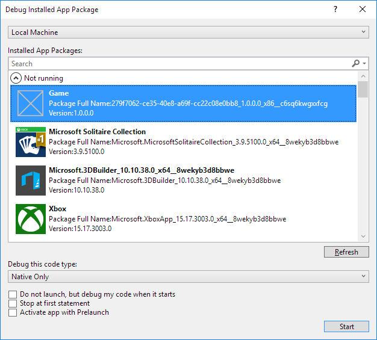
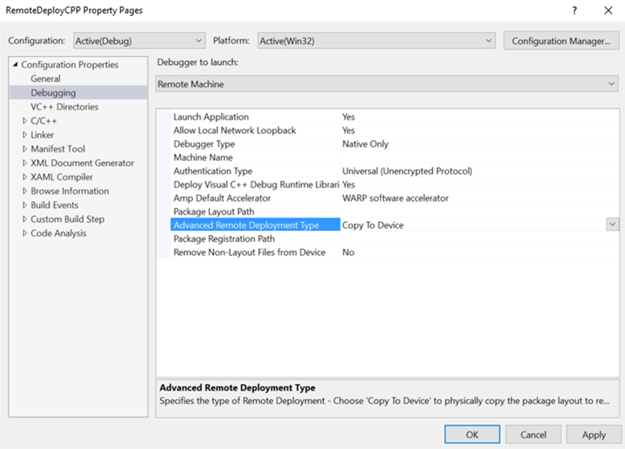

# <a name="deploying-and-debugging-uwp-apps"></a>UWP 앱 배포 및 디버그


이 문서에서는 다양한 배포를 대상으로 지정하고 대상을 디버깅하는 단계를 안내합니다.

Microsoft Visual Studio를 사용 하면 배포 하 고 다양 한 Windows10 디바이스에서 유니버설 Windows 플랫폼 (UWP) 앱을 디버그할 수 있습니다. Visual Studio는 대상 디바이스에 앱을 빌드하고 등록하는 프로세스를 처리합니다.

## <a name="picking-a-deployment-target"></a>배포 대상 선택

대상을 선택하려면 **디버깅 시작** 단추 옆의 디버그 대상 드롭다운으로 이동하여 앱을 배포할 대상을 선택합니다. 대상을 선택한 후 **디버깅 시작(F5)** 을 선택하여 대상에서 배포하고 디버깅하거나 **Ctrl+F5**를 선택하여 대상에서 배포만 수행합니다.


-   **시뮬레이터**가 현재 개발 컴퓨터의 시뮬레이트된 환경에 앱을 배포합니다. 이 옵션은 앱의 **대상 플랫폼 최소 버전**이 개발 컴퓨터의 운영 체제보다 작거나 같을 경우에만 사용할 수 있습니다.
-   **로컬 컴퓨터**가 현재 개발 컴퓨터에 앱을 배포합니다. 이 옵션은 앱의 **대상 플랫폼 최소 버전**이 개발 컴퓨터의 운영 체제보다 작거나 같을 경우에만 사용할 수 있습니다.
-   **원격 컴퓨터**에서 원격 대상을 지정하여 앱을 배포할 수 있습니다. 원격 컴퓨터에 배포하는 방법에 대한 자세한 내용은 [원격 디바이스 지정](#specifying-a-remote-device)에서 볼 수 있습니다.
-   **디바이스**가 USB 연결 디바이스에 앱을 배포합니다. 장치는 개발자가 잠금 해제해야 하며 화면이 잠금 해제되어 있어야 합니다.
-   **에뮬레이터** 대상이 부팅되고 해당 이름에 지정된 구성으로 에뮬레이터에 앱을 배포합니다. 에뮬레이터는 이상을 활성화 된 Hyper-v에서 사용할 수 있는 Windows8.1 실행 하는 컴퓨터 에서만 합니다.


## <a name="debugging-deployed-apps"></a>배포된 앱 디버깅
Visual Studio는 **디버그**, **프로세스에 연결**을 차례로 선택하여 실행 중인 모든 UWP 앱 프로세스에 연결할 수도 있습니다. 실행 중인 프로세스에 연결하기 위해 원본 Visual Studio 프로젝트가 필요하지는 않지만 프로세스의 [기호](#symbols)를 로드하면 원본 코드가 없는 프로세스를 디버그할 때 훨씬 도움이 됩니다.  

또한 **디버그**, **기타**, **설치된 앱 패키지 디버그**를 차례로 선택하여 설치된 앱 패키지를 연결하고 디버그할 수 있습니다.   

   

**실행하지 않지만 시작되면 내 코드 디버그**를 선택하면 사용자 지정 시간에 시작할 때 Visual Studio 디버거가 UWP 앱에 연결합니다. 사용자 지정 매개 변수를 사용한 프로토콜 활성화 등 [다양한 시작 메서드](../xbox-apps/automate-launching-uwp-apps.md)의 제어 경로를 디버그하는 효과적인 방법입니다.  

UWP 앱은 Windows 8.1 이상에서 개발하고 컴파일할 수 있지만 실행하려면 Windows 10이 필요합니다. Windows 8.1 PC에서 UWP 앱을 개발하는 경우 호스트 및 대상 컴퓨터가 모두 동일한 LAN에 있다면 다른 Windows 10 디바이스에서 실행되는 UWP 앱을 원격으로 디버그할 수 있습니다. 이렇게 하려면 두 컴퓨터에서 모두 [Visual Studio용 원격 도구](https://www.visualstudio.com/downloads/)를 다운로드하여 설치합니다. 설치된 버전이 설치한 Visual Studio의 기존 버전과 일치해야 하며 선택한 아키텍처(x86, x64)도 대상 앱의 아키텍처와 일치해야 합니다.   

## <a name="package-layout"></a>패키지 레이아웃
Visual Studio 2015 업데이트 3 부터는 하 여 UWP 앱에 대 한 레이아웃 패스를 지정 하는 개발자 용 옵션이 추가 되었습니다. 이 옵션은 앱을 빌드할 때 패키지 레이아웃을 복사할 디스크의 위치를 결정합니다. 기본적으로 이 속성은 프로젝트의 루트 디렉터리를 기준으로 설정됩니다. 이 속성을 수정하지 않으면 이전 버전의 Visual Studio와 동일한 동작이 유지됩니다.

이 속성은 프로젝트의 **디버그** 속성에서 수정할 수 있습니다.

앱에 대한 패키지를 만들 때 패키지에 모든 레이아웃 파일을 포함하려는 경우 `<IncludeLayoutFilesInPackage>true</IncludeLayoutFilesInPackage>` 프로젝트 속성을 추가해야 합니다.

이 속성을 추가하려면

1. 프로젝트를 마우스 오른쪽 단추로 클릭한 다음 **프로젝트 언로드**를 선택합니다.
2. 프로젝트를 마우스 오른쪽 단추로 클릭한 다음 **[projectname].xxproj 편집**을 선택합니다. .xxproj는 프로젝트 언어에 따라 변경됩니다.
3. 속성을 추가한 다음 프로젝트를 다시 로드합니다.

## <a name="specifying-a-remote-device"></a>원격 디바이스 지정

### <a name="c-and-microsoft-visual-basic"></a>C# 및 Microsoft Visual Basic

C# 또는 Microsoft Visual Basic 앱에 대한 원격 컴퓨터를 지정하려면 디버그 대상 드롭다운에서 **원격 컴퓨터**를 선택합니다. IP 주소를 지정하거나 검색된 디바이스를 선택할 수 있는 **원격 연결** 대화 상자가 나타납니다. 기본적으로 **유니버설** 인증 모드가 선택됩니다. 사용할 인증 모드를 결정하려면 [인증 모드](#authentication-modes)를 참조하세요.


이 대화 상자로 돌아가려면 프로젝트 속성 열고 **디버그** 탭으로 이동 합니다. 여기에서 선택 **찾기** 옆에 **원격 컴퓨터:**


크리에이터스 업데이트 이전 버전의 원격 PC에 앱을 배포하려면 Visual Studio 원격 도구를 대상 PC에 다운로드하고 설치해야 합니다. 전체 지침을 보려면 [원격 PC 지침](#remote-pc-instructions)을 참조하세요.  그러나 크리에이터스 업데이트 PC부터는 원격 배포도 지원합니다.  

### <a name="c-and-javascript"></a>C++ 및 JavaScript

C + + 또는 JavaScriptUWP 앱에 대 한 원격 컴퓨터 대상을 지정 합니다.

1. **솔루션 탐색기**에서 프로젝트를 마우스 오른쪽 단추로 클릭한 다음 **속성**을 클릭합니다.
2. **디버깅** 설정으로 이동하여 **실행할 디버거**에서 **원격 컴퓨터**를 선택합니다.
3. **컴퓨터 이름**을 입력하고(또는 **찾기**를 클릭하여 컴퓨터 이름 찾기) **인증 유형** 속성을 설정합니다.


컴퓨터를 지정한 후에는 디버그 대상 드롭다운에서 **원격 컴퓨터**를 선택하여 지정된 컴퓨터로 돌아갈 수 있습니다. 원격 컴퓨터는 한 번에 하나만 선택할 수 있습니다.

### <a name="remote-pc-instructions"></a>원격 PC 지침

> [!NOTE]
> 이러한 지침은 이전 버전의 Windows 10에서만 필요합니다.  크리에이터스 업데이트부터 PC를 Xbox와 같이 처리할 수 있습니다.  즉, PC의 개발자 모드에서 장치 검색을 사용하도록 설정하고, 유니버설 인증을 사용하여 PIN 페어링하고 PC에 연결할 수 있습니다. 

크리에이터스 업데이트 이전 버전의 원격 PC에 배포하려면 대상 PC에 Visual Studio 원격 도구가 설치되어 있어야 합니다. 원격 PC에도 앱의 **대상 플랫폼 최소 버전** 속성보다 크거나 같은 버전의 Windows가 실행되고 있어야 합니다. 원격 도구를 설치한 후 대상 PC에서 원격 디버거를 실행해야 합니다.

이렇게 하려면 **시작** 메뉴에서 **원격 디버거**를 검색하여 열고 메시지가 나타나면 디버거에서 방화벽 설정을 구성하도록 허용합니다. 기본적으로 디버거는 Windows 인증을 사용하여 실행됩니다. 따라서 로그인된 사용자가 두 PC에서 동일하지 않으면 사용자 자격 증명이 필요합니다.

**인증 없음**으로 변경하려면 **원격 디버거**에서 **도구** -&gt; **옵션**으로 이동하여 **인증 없음**으로 설정합니다. 원격 디버거를 설정한 후 호스트 디바이스를 [개발자 모드](https://msdn.microsoft.com/windows/uwp/get-started/enable-your-device-for-development)로 설정했는지도 확인해야 합니다. 그런 다음 개발 컴퓨터에서 배포할 수 있습니다.

자세한 내용은 [Visual Studio 다운로드 센터](https://www.visualstudio.com/downloads/)를 참조하세요.

## <a name="passing-command-line-debug-arguments"></a>명령줄 디버그 인수 전달 
Visual Studio 2017에서는 디버깅 UWP 응용 프로그램을 시작할 때 명령줄 디버그 인수를 전달할 수 있습니다. [**응용 프로그램**](https://docs.microsoft.com/en-us/uwp/api/windows.ui.xaml.application) 클래스의 **OnLaunched** 메서드에 있는 *args* 매개 변수에서 명령줄 디버그 인수에 액세스할 수 있습니다. 명령줄 디버그 인수를 지정하려면 프로젝트 속성을 열고 **디버그** 탭으로 이동합니다. 

> [!NOTE]
> 이 기능은 C#, VB, C++용 Visual Studio 2017(버전 15.1)에 사용할 수 있습니다. JavaScript는 Visual Studio 2017의 이후 버전에서 제공됩니다. 명령줄 디버그 인수는 시뮬레이터를 제외한 모든 배포 형식에서 사용할 수 있습니다.

C# 및 VB UWP 프로젝트의 경우 **시작 옵션** 아래에 **명령줄 인수** 필드가 나타납니다. 


C++ 및 JS UWP 프로젝트의 경우 **디버깅 속성**에 **명령줄 인수**가 필드로 나타납니다.


명령줄 인수를 지정하면 앱의 **OnLaunched** 메서드에서 인수 값에 액세스할 수 있습니다. [**LaunchActivatedEventArgs**](https://docs.microsoft.com/en-us/uwp/api/windows.applicationmodel.activation.launchactivatedeventargs) 개체 *args*는 **인수** 속성을 가지며 값이 **명령줄 인수** 필드에서 문자로 설정됩니다. 


## <a name="authentication-modes"></a>인증 모드

원격 컴퓨터 배포에 세 가지 인증 모드를 사용할 수 있습니다.

- **유니버설(암호화되지 않은 프로토콜)**: 원격 장치에 배포할 때마다 이 인증 모드를 사용합니다. 현재 이 인증 모드는 IoT 디바이스, Xbox 디바이스 및 HoloLens 디바이스, 크리에이터스 업데이트 버전 이상의 PC용입니다. 유니버설(암호화되지 않은 프로토콜)은 신뢰할 수 있는 네트워크에서만 사용해야 합니다. 디버깅 연결은 개발 컴퓨터와 원격 컴퓨터 간에 전달되는 데이터를 가로채고 변경할 수 있는 악의적인 사용자에게 취약합니다.
- **Windows**: 이 인증 모드는 Visual Studio 원격 도구를 실행하는 원격 PC 배포(데스크톱 또는 노트북)에만 사용할 수 있습니다. 대상 컴퓨터의 로그인된 사용자의 자격 증명에 액세스할 수 있는 경우 이 인증 모드를 사용합니다. 원격 배포에 가장 안전한 채널입니다.
- **없음**: 이 인증 모드는 Visual Studio 원격 도구를 실행하는 원격 PC 배포(데스크톱 또는 노트북)에만 사용할 수 있습니다. 테스트 계정이 로그인되어 있는 환경에서 테스트 컴퓨터가 설정되어 있고 자격 증명을 입력할 수 없는 경우 이 인증 모드를 사용합니다. 원격 디버거 설정이 인증 없음을 허용하도록 설정되어 있는지 확인합니다.

## <a name="advanced-remote-deployment-options"></a>고급 원격 배포 옵션
Visual Studio 2015 업데이트 3과 Windows 10 1 주년 업데이트 릴리스의 많으면 새로운 고급 원격 배포 옵션 특정 Windows 10 장치. 고급 원격 배포 옵션은 프로젝트 속성의 **디버그** 메뉴에 있습니다.

새 속성은 다음과 같습니다.
* 배포 유형
* 패키지 등록 경로
* 레이아웃의 일부가 아닌 경우에도 디바이스에 모든 파일 보관

### <a name="requirements"></a>요구 사항
고급 원격 배포 옵션을 활용하려면 다음 요구 사항을 충족해야 합니다.
* Visual Studio 2015 업데이트 3 또는 일부 이상 Visual Studio 릴리스 설치 된 Windows 10 도구 1.4.1 이상 (Windows 10 1 주년 업데이트 SDK 포함)는 모든을 얻을 수 있도록 업데이트로 최신 버전의 Visual Studio를 사용 하는 것이 좋습니다 합니다 최신 개발 및 보안 기능입니다.
* Windows 10 1주년 업데이트 Xbox 원격 디바이스 또는 Windows 10 크리에이터스 업데이트 PC를 대상으로 지정 
* 유니버설 인증 모드 사용

### <a name="properties-pages"></a>속성 페이지
C# 또는 Visual Basic UWP 앱의 경우 속성 페이지는 다음과 같이 표시됩니다.


C++ UWP 앱의 경우 속성 페이지는 다음과 같이 표시됩니다.



### <a name="copy-files-to-device"></a>디바이스에 파일 복사
**디바이스에 파일 복사**는 네트워크를 통해 원격 디바이스에 파일을 실제로 전송합니다. **레이아웃 폴더 경로**로 빌드된 패키지 레이아웃을 복사하고 등록합니다. Visual Studio는 Visual Studio 프로젝트의 파일과 동기화된 디바이스에 복사된 파일을 유지하지만 **레이아웃의 일부가 아닌 경우에도 디바이스에 모든 파일 보관** 옵션이 있습니다. 이 옵션을 선택하면 이전에 원격 디바이스로 복사했지만 더 이상 프로젝트에 포함되지 않는 모든 파일이 원격 디바이스에 유지됩니다.

**디바이스에 파일 복사** 시 지정된 **패키지 등록 경로**는 파일이 복사되는 원격 디바이스의 실제 위치입니다. 이 경로는 상대 경로로 지정할 수 있습니다. 파일이 배포되는 위치는 개발 파일 루트를 기준으로 지정되며 이는 대상 디바이스에 따라 달라집니다. 이 경로 지정은 여러 개발자가 동일한 디바이스를 공유하고 일부 빌드 차이가 있는 패키지에서 작업하는 데 유용합니다.

> [!NOTE]
> **디바이스에 파일 복사**는 현재 Windows 10 1주년 업데이트를 실행하는 Xbox 또는 Windows 10 크리에이터스 업데이트를 실행하는 PC에서 지원됩니다.

원격 디바이스에서 레이아웃은 다음 기본 위치에 복사됩니다. `\\MY-DEVKIT\DevelopmentFiles\PACKAGE-REGISTRATION-PATH`

### <a name="register-layout-from-network"></a>네트워크에서 레이아웃 등록
네트워크에서 레이아웃을 등록하려는 경우 네트워크 공유로 패키지 레이아웃을 빌드한 다음 네트워크에서 직접 원격 디바이스에 레이아웃을 등록할 수 있습니다. 그러려면 원격 디바이스에서 액세스할 수 있는 레이아웃 폴더 경로(네트워크 공유)를 지정해야 합니다. **레이아웃 폴더 경로** 속성은 Visual Studio를 실행하는 PC를 기준으로 설정된 경로이고, **패키지 등록 경로** 속성은 동일한 경로지만 원격 디바이스를 기준으로 지정됩니다.

네트워크에서 레이아웃을 성공적으로 등록하려면 먼저 **레이아웃 폴더 경로**를 공유 네트워크 폴더로 만들어야 합니다. 그러려면 파일 탐색기에서 폴더를 마우스 오른쪽 단추로 클릭하고 **공유 대상 &gt; 특정 사용자**를 선택한 다음 폴더를 공유할 사용자를 선택합니다. 네트워크에서 레이아웃을 등록하려고 하면 공유할 액세스 권한이 있는 사용자로 등록하기 위해 자격 증명을 묻는 메시지가 나타납니다.

이 작업에 대한 도움말은 다음 예제를 참조하세요.

- 예제 1(네트워크 공유로 액세스할 수 있는 로컬 레이아웃 폴더):
  * **레이아웃 폴더 경로** = `D:\Layouts\App1`
  * **패키지 등록 경로** = `\\NETWORK-SHARE\Layouts\App1`

- 예제 2(네트워크 레이아웃 폴더):
  * **레이아웃 폴더 경로** = `\\NETWORK-SHARE\Layouts\App1`
  * **패키지 등록 경로** = `\\NETWORK-SHARE\Layouts\App1`

네트워크에서 레이아웃을 처음 등록할 경우 대상 디바이스에 자격 증명이 캐시되므로 반복해서 로그인할 필요가 없습니다. 캐시된 자격 증명을 제거하려면 Windows 10 SDK에서 **deletecreds** 명령이 있는 [WinAppDeployCmd.exe 도구](https://msdn.microsoft.com/windows/uwp/packaging/install-universal-windows-apps-with-the-winappdeploycmd-tool)를 사용할 수 있습니다.

원격 디바이스에 실제로 복사된 파일이 없기 때문에 네트워크에서 레이아웃을 등록할 때 **디바이스에 모든 파일 보관**을 선택할 수 없습니다.

> [!NOTE]
> **네트워크에서 레이아웃 등록**은 현재 Windows 10 1주년 업데이트를 실행하는 Xbox 또는 Windows 10 크리에이터스 업데이트를 실행하는 PC에서 지원됩니다.

원격 디바이스에서 레이아웃은 디바이스 패밀리에 따라 다음 기본 위치에 등록: `Xbox: \\MY-DEVKIT\DevelopmentFiles\XrfsFiles` -이 **패키지 등록 경로** PC에 대 한 symlink를 사용 하지 않는 고 대신 **패키지를 직접 등록 등록 경로**


## <a name="debugging-options"></a>디버깅 옵션

Windows10, 사전 실행 및 앱 [사전 실행](https://msdn.microsoft.com/library/windows/apps/Mt593297)이라는 기술을 일시 중단 함으로써 UWP 앱의 시작 성능이 개선 되었습니다. 대부분의 앱은 이 모드에서 작동되기 위해 특별히 수행해야 할 작업은 없지만 일부 앱에서는 동작을 조정해야 할 수 있습니다. 코드 경로의 문제를 디버깅하기 위해 Visual Studio에서 앱 디버깅을 사전 실행 모드로 시작할 수 있습니다.

디버깅은 Visual Studio 프로젝트(**디버그** -&gt; **기타 디버그 대상** -&gt; **유니버설 Windows 앱 사전 실행 디버그**)와 컴퓨터에 이미 설치된 앱(**사전 실행으로 앱 활성화** 확인란 선택을 선택하여 **디버그** -&gt; **기타 디버그 대상** -&gt; **설치된 앱 패키지 디버그**) 둘 다에서 지원됩니다. 자세한 내용은 [UWP 사전 실행 디버그](http://go.microsoft.com/fwlink/p/?LinkId=717245)를 참조하세요.

시작 프로젝트의 **디버그** 속성 페이지에서 다음 배포 옵션을 설정할 수 있습니다.

- **로컬 네트워크 루프백 허용**

  보안 상의 이유로, 표준 방식으로 설치되는 UWP 앱은 이 앱이 설치되는 장치에 네트워크 호출이 허용되지 않습니다. 기본적으로 Visual Studio 배포에서는 배포된 앱에 대해 이 규칙이 면제됩니다. 이러한 예외를 통해 단일 컴퓨터에서 통신 절차를 테스트할 수 있습니다. Microsoft Store에 앱을 제출 하기 전에 규칙의 예외 없이 앱을 테스트 해야 합니다.

  앱에서 네트워크 루프백 예외를 제거하려면 다음을 수행하세요.

  -   C# 및 Visual Basic**디버그** 속성 페이지에서 **로컬 네트워크 루프백 허용** 확인란의 선택을 취소 합니다.
  -   JavaScript 및 C++ **디버깅** 속성 페이지에서 **로컬 네트워크 루프백 허용** 값을 **아니요**로 설정합니다.

- **시작하지 않음(시작 시 코드 디버그) / 응용 프로그램 시작**

  앱이 실행될 때 디버깅 세션이 자동으로 시작되도록 배포를 구성하려면 다음을 수행하세요.

  -   C# 및 Visual Basic**디버그** 속성 페이지를 **실행 하지 않지만 시작 되 면 내 코드 디버그** 확인란을 선택 합니다.
  -   JavaScript 및 C++ **디버깅** 속성 페이지에서, **응용 프로그램 실행** 값을 **예**로 설정합니다.

## <a name="symbols"></a>기호

기호 파일에는 변수, 함수 이름, 진입점 주소 등 코드를 디버그할 때 유용한 여러 데이터가 포함되어 있으므로 예외 및 호출 스택 실행 순서를 이해하는 데 도움이 됩니다. 대부분의 Windows 변형에 대한 기호는 [Microsoft 기호 서버](http://msdl.microsoft.com/download/symbols)를 통해 사용할 수 있거나, 더 빨리 오프라인에서 조회하기 위해 [Windows 기호 패키지 다운로드](http://aka.ms/winsymbols)에서 다운로드할 수 있습니다.

Visual Studio에 대한 기호 옵션을 설정하려면 **도구 &gt; 옵션**을 선택한 다음 대화 창에서 **디버깅 &gt; 기호**로 이동합니다.


[WinDbg](#windbg)를 사용한 디버깅 세션에서 기호를 로드하려면 **sympath** 변수를 기호 패키지 위치로 설정합니다. 예를 들어 다음 명령을 실행하면 Microsoft 기호 서버에서 기호가 로드된 다음 C:\Symbols 디렉터리에 캐시됩니다.

```
.sympath SRV*C:\Symbols*http://msdl.microsoft.com/download/symbols
.reload
```

`‘;’` 구분 기호를 사용하여 경로를 더 추가하거나 `.sympath+` 명령을 사용할 수 있습니다. WinDbg를 사용하는 고급 기호 작업의 경우 [공용 및 개인 기호](https://msdn.microsoft.com/library/windows/hardware/ff553493)를 참조하세요.

## <a name="windbg"></a>WinDbg

WinDbg는 [Windows SDK](http://go.microsoft.com/fwlink/p/?LinkID=271979)에 포함된 Windows용 디버깅 도구 제품군의 일부로 제공되는 강력한 디버거입니다. Windows SDK 설치를 사용하면 Windows용 디버깅 도구를 독립 실행형 제품으로 설치할 수 있습니다. 네이티브 코드 디버깅에 매우 유용하지만 관리 코드 또는 HTML5로 작성된 앱에는 WinDbg를 사용하지 않는 것이 좋습니다.

UWP 앱으로 WinDbg를 사용하려면 [PLM(프로세스 수명 관리) 테스트 및 디버깅 도구](testing-debugging-plm.md)에서 설명한 대로 먼저 PLMDebug를 사용하여 앱 패키지에 대해 PLM(프로세스 수명 관리)을 사용하지 않도록 설정해야 합니다.

```
plmdebug /enableDebug [PackageFullName] ""C:\Program Files\Debugging Tools for Windows (x64)\WinDbg.exe\" -server npipe:pipe=test"
```

Visual Studio와 달리 WinDbg의 핵심 기능은 대부분 명령 창에 명령을 제공해야 합니다. 제공된 명령을 사용하여 실행 상태를 보고, 사용자 모드 크래시 덤프를 조사하고, 다양한 모드로 디버그할 수 있습니다.

WinDbg에서 자주 사용하는 명령 중 하나는 다음을 포함하여 현재 예외에 대한 자세한 정보를 검색하는 데 사용되는 `!analyze -v`입니다.

- FAULTING_IP: 오류 시 명령 포인터
- EXCEPTION_RECORD: 현재 예외의 주소, 코드 및 플래그
- STACK_TEXT: 예외 전의 스택 추적

모든 WinDbg 명령의 전체 목록은 [디버거 명령](https://msdn.microsoft.com/library/ff540507)을 참조하세요.

## <a name="related-topics"></a>관련 항목
- [PLM(프로세스 수명 관리) 테스트 및 디버깅 도구](testing-debugging-plm.md)
- [디버깅, 테스트 및 성능](index.md)
