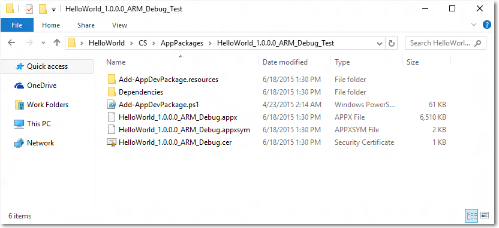

# <a name="windows-device-portal-overview"></a>Windows Device Portal 개요

Windows Device Portal을 사용하면 네트워크 또는 USB 연결을 통해 원격으로 디바이스를 구성하고 관리할 수 있습니다. 또한 Windows 디바이스의 실시간 성능 보기 및 문제 해결 방법을 안내 하는 고급 진단 도구를 제공 합니다.

Windows Device Portal은 pc의 웹 브라우저에서에 연결할 수 있는 장치에서 웹 서버입니다. 디바이스의 웹 브라우저에 있는 경우 연결할 수도 있습니다 로컬로 해당 장치에서 브라우저를 사용 합니다.

Windows Device Portal은 각 장치 패밀리에서 사용할 수 있지만 기능 및 설정은 각 디바이스의 요구 사항에 따라 다릅니다. 이 문서는 디바이스 포털에 대한 일반적인 설명과 각 디바이스 패밀리에 대해 구체적인 정보가 있는 문서의 링크를 제공합니다.

Windows Device Portal의 기능 데이터에 액세스 하 고 디바이스를 프로그래밍 방식으로 제어에 직접 사용할 수 있는 [REST Api](device-portal-api-core.md) 를 사용 하 여 구현 됩니다.

## <a name="setup"></a>설치

각 디바이스에는 디바이스 포털에 연결하기 위한 특정 지침이 있지만 각 디바이스 모두 다음과 같은 일반적인 단계가 필요합니다.
1. (설정 앱의 구성) 장치에서 개발자 모드 및 디바이스 포털을 사용 합니다.
2. 로컬 네트워크를 통해 또는 USB를 사용 하 여 장치와 PC를 연결 합니다.
3. 브라우저에서 디바이스 포털 페이지로 이동합니다. 이 표에서 포트와 각 장치 제품군에 사용 되는 프로토콜을 보여줍니다.

디바이스 패밀리 | 기본 설정 여부 | HTTP | HTTPS | USB
--------------|----------------|------|-------|----
HoloLens | 예, 개발자 모드에서 | 80(기본값) | 443(기본값) | http://127.0.0.1:10080
IoT | 예, 개발자 모드에서 | 8080 | regkey를 통해 사용 설정 | 해당 없음
Xbox | 개발자 모드 내에서 사용 설정 | 사용 안 함 | 11443 | 해당 없음
데스크톱| 개발자 모드 내에서 사용 | 50080\* | 50043\* | 해당 없음
전화 | 개발자 모드 내에서 사용 설정 | 80| 443 | http://127.0.0.1:10080

\* 디바이스의 기존 포트 클레임과 충돌을 방지하기 위해 데스크톱의 디바이스 포털은 임시 범위(&gt;50,000)의 포트를 클레임하기 때문에 항상 적용되지는 않습니다. 자세한 내용은 데스크톱용 [포트 설정](device-portal-desktop.md#registry-based-configuration-for-device-portal) 섹션을 참조하세요.  

디바이스별 설치 지침은 다음을 참조하세요.
- [HoloLens용 디바이스 포털](https://docs.microsoft.com/windows/uwp/debug-test-perf/device-portal-hololens)
- [IoT용 디바이스 포털](https://go.microsoft.com/fwlink/?LinkID=616499)
- [모바일용 디바이스 포털](device-portal-mobile.md)
- [Xbox용 디바이스 포털](device-portal-xbox.md)
- [데스크톱 디바이스 포털](device-portal-desktop.md#set-up-device-portal-on-windows-desktop)

## <a name="features"></a>기능

### <a name="toolbar-and-navigation"></a>도구 모음 및 탐색

페이지 맨 위에 있는 도구 모음에서 자주 사용 되는 기능에 대 한 액세스를 제공합니다.
- **전원**: 전원 옵션에 액세스 합니다.
  - **종료**: 디바이스를 끕니다.
  - **다시 시작**: 디바이스의 전원을 순환합니다.
- **도움말**: 도움말 페이지를 엽니다.

페이지의 왼쪽 탐색 창에 있는 링크를 사용하여 디바이스에서 사용 가능한 관리 및 모니터링 도구로 이동합니다.

여기에 디바이스 패밀리의 공통 된 도구에 설명 되어 있습니다. 다른 옵션은 디바이스에 따라 사용할 수 있습니다. 자세한 내용은 장치 유형에 대 한 특정 페이지를 참조 하세요.

### <a name="apps-manager"></a>앱 관리자.

앱 관리자는 설치/제거를 제공 하 고 관리 기능을 앱 패키지 및 번들의 등급을 호스트 장치에 합니다.


- **설치 된 앱**: 드롭다운 메뉴를 사용 하 여 제거 하거나 장치에 설치 된 앱을 시작 합니다. **추가**클릭 하 여 새 앱을 설치 합니다. 로컬에서 패키지 된 앱을 배포 하는 UX 설치를 시작, 네트워크 또는 웹을 호스트 하 고 네트워크 공유에서 느슨한 파일 등록 합니다.
- **실행 중인 앱**: 현재 실행 중인 및 필요에 따라 지연을 닫습니다는 앱에 대 한 정보를 가져옵니다.

#### <a name="install-an-app"></a>앱 설치

1.  앱 패키지를 만들면 이를 원격으로 디바이스에 설치할 수 있습니다. Visual Studio에서 빌드한 후 출력 폴더가 생성됩니다.
  
2.  장치 포털의 앱 관리자 섹션에서 **추가** 클릭 하 고 **로컬 저장소에서 앱 패키지 설치**를 선택 합니다.
3.  **찾아보기** 를 클릭 하 고 앱 패키지를 찾습니다.
3.  **찾아보기** 를 클릭 하 고 인증서 (_.cer_) 파일 (필요 없음 모든 장치에서).
4.  해당 상자 하려는 경우 설치 옵션 또는 프레임 워크 패키지 앱 설치와 함께 확인 합니다. 두 개 이상 있는 경우 개별적으로 각각 추가합니다.     
5.  **다음** 설치를 시작 하는 다음 단계 **설치할** 이동 하려면 클릭 합니다. 

#### <a name="uninstall-an-app"></a>앱 제거
1.  앱이 실행되고 있지 않은지 확인합니다. 
2.  인 경우에 **실행 중인 앱으로** 이동 하 고 닫습니다. 앱이 실행 되는 동안 제거 하려고 하면 앱을 다시 설치 하려고 할 때 문제가 발생 합니다. 
3.  드롭다운 목록에서 앱을 선택 하 고 **제거**를 클릭 합니다.

### <a name="running-processes"></a>실행 중인 프로세스

이 페이지에는 호스트 디바이스에서 현재 실행 중인 프로세스에 대 한 세부 정보가 표시 됩니다. 앱 및 시스템 프로세스 모두 포함합니다. 일부 플랫폼 (데스크톱, IoT, 및 HoloLens)에서 프로세스를 종료할 수 있습니다.


### <a name="file-explorer"></a>파일 탐색기

이 페이지 보기 및 테스트용으로 로드 된 앱에서 저장 한 파일을 조작할 수 있습니다. [앱 파일 탐색기를 사용 하 여](https://blogs.windows.com/buildingapps/2016/06/08/using-the-app-file-explorer-to-see-your-app-data/) 블로그 게시물 파일 탐색기 및 그 사용 방법에 대 한 자세한 정보를 참조 하세요. 


### <a name="performance"></a>성능

성능 페이지 전력 사용량, 프레임 속도 같은 시스템 진단 정보를 실시간 그래프로 및 CPU 로드 합니다.

사용 가능한 메트릭은 다음과 같습니다.
- **CPU**: 총 사용 가능한 CPU 사용률 백분율
- **메모리**: 총 사용 가능, 커밋, 페이징 및 비페이징
- **I/O**: 읽기 및 쓰기 데이터 수량
- **네트워크**: 수신 및 데이터를 전송 합니다.
- **GPU**: %의 총 사용 가능한 GPU 엔진 사용률


### <a name="event-tracing-for-windows-etw-logging"></a>이벤트 추적에 대 한 ETW (Windows) 로깅

ETW 로깅 페이지 디바이스에서 실시간 ETW 용 이벤트 추적 Windows () 정보를 관리합니다.


**공급자 숨기기**를 선택하여 이벤트 목록만 표시합니다.
- **등록 된 공급자**: 이벤트 공급자와 추적 수준을 선택 합니다. 추적 수준은 다음이 값 중 하나:
  1. 비정상적인 끝내기 또는 종료
  2. 심각한 오류
  3. 경고
  4. 오류가 아닌 경고
  5. 세부 추적

  추적을 시작하려면 **사용**을 클릭 또는 탭합니다. 공급자가 **활성화된 공급자** 드롭다운에 추가됩니다.
- **사용자 지정 공급자**: 사용자 지정 ETW 공급자 및 추적 수준을 선택합니다. 공급자를 GUID로 식별합니다. GUID에 대괄호를 포함 하지 마세요.
- **Enabled 공급자**:이 활성화 된 공급자를 나열 합니다. 추적을 중지하려면 드롭다운에서 공급자를 선택하고 **사용 안 함**을 클릭 또는 탭합니다. 모든 추적을 일시 중단하려면 **모두 중지**를 클릭 또는 탭합니다.
- **공급자 기록**: 현재 세션 중 활성화 된 ETW 공급자를 표시 합니다. 비활성화된 공급자를 활성화하려면 **사용**을 클릭 또는 탭합니다. 기록을 지우려면 **지우기**를 클릭 또는 탭합니다.
- **필터 / 이벤트**: **이벤트** 섹션 표 형식으로 선택 된 공급자의 ETW 이벤트가 나열 되어 있습니다. 표는 실시간으로 업데이트 됩니다. **필터** 메뉴를 사용 하 여 이벤트 표시 될 사용자 지정 필터를 설정 합니다. 테이블에서 모든 ETW 이벤트를 삭제 하려면 **지우기** 단추를 클릭 합니다. 이렇게 해도 공급자는 비활성화되지 않습니다. 로컬 CSV 파일을 현재 수집 된 ETW 이벤트를 내보냅니다 **파일에 저장** 을 클릭할 수 있습니다.

ETW 로깅을 사용에 대 한 자세한 내용은 [디버그 로그 보기를 사용 하 여 Device Portal](https://blogs.windows.com/buildingapps/2016/06/10/using-device-portal-to-view-debug-logs-for-uwp/) 블로그 게시물을 참조 하세요. 

### <a name="performance-tracing"></a>성능 추적

성능 추적 페이지 하면 보기에 대 한 호스트 장치에서 [Windows Performance Recorder (WPR)](https://msdn.microsoft.com/library/hh448205.aspx) 추적 합니다.


- **사용 가능한 프로필**: 드롭다운 목록에서 WPR 프로필을 선택하고, 추적을 시작하려면 **시작**을 클릭 또는 탭합니다.
- **사용자 지정 프로필**: PC에서 WPR 프로필을 선택하려면 **찾아보기**를 클릭 또는 탭합니다. 추적을 시작하려면 **업로드 및 시작**을 클릭 또는 탭합니다.

추적을 중지하려면 **중지**를 클릭합니다. 이 페이지에 추적 파일 될 때까지 계속 (합니다. ETL) 다운로드를 완료 합니다.

캡처됩니다. [Windows Performance Analyzer](https://msdn.microsoft.com/library/windows/desktop/hh448170.aspx)분석을 위해 ETL 파일을 열 수 있습니다.

### <a name="device-manager"></a>장치 관리자

장치 관리자 페이지 장치에 연결 된 모든 주변 장치를 열거 합니다. 각각의 속성을 설정 아이콘을 클릭할 수 있습니다.


### <a name="networking"></a>네트워킹

네트워킹 페이지 디바이스에서 네트워크 연결을 관리 합니다. USB 통해 디바이스 포털에 연결 하지 않는 한 이러한 설정을 변경 연결이 끊어질 수 장치 포털에서.
- **사용 가능한 네트워크**: 장치에 사용할 수 있는 WiFi 네트워크를 보여 줍니다. 네트워크에서 클릭 또는 탭하면 여기에 연결되며 필요한 경우 암호를 제공합니다. 장치 포털 아직 엔터프라이즈 인증을 지원 하지 않습니다. 또한 **프로필** 드롭다운을 사용 하 여 알려진 장치에 WiFi 프로필 중 하나에 연결 하려고 합니다.
- **IP 구성**: 디바이스의 네트워크 포트 각 호스트에 대 한 주소 정보를 보여 줍니다.


## <a name="service-features-and-notes"></a>서비스 기능 및 참고 사항

### <a name="dns-sd"></a>DNS-SD

디바이스 포털은 DNS-SD를 사용하여 로컬 네트워크에서 존재 여부를 알립니다. 모든 디바이스 포털 인스턴스는 디바이스 유형에 관계없이 "WDP._wdp._tcp.local"에서 알립니다. 서비스 인스턴스에 대한 TXT 레코드는 다음을 제공합니다.

키 | 유형 | 설명 
----|------|-------------
S | int | 디바이스 포털의 보안 포트입니다. 0(영)인 경우 디바이스 포털은 HTTPS 연결을 수신 대기하지 않습니다. 
D | string | 디바이스의 유형입니다. "Windows.*" 형식으로 제공됩니다(예: Windows.Xbox 또는 Windows.Desktop).
A | string | 디바이스 아키텍처입니다. ARM, x86 또는 AMD64입니다.  
T | null 문자로 구분된 문자열 목록 | 디바이스에 대해 사용자가 적용한 태그입니다. 사용 방법은 태그 REST API를 참조하세요. 목록은 이중 null로 종료됩니다.  

일부 디바이스는 DNS-SD 레코드에 의해 알려진 HTTP 포트에서 수신 대기하지 않으므로 HTTPS 포트에서 연결하는 것이 좋습니다. 

### <a name="csrf-protection-and-scripting"></a>CSRF 보호 및 스크립팅

[CSRF 공격](https://wikipedia.org/wiki/Cross-site_request_forgery)으로부터 보호하기 위해 모든 비 GET 요청에서 고유한 토큰이 필요합니다. 이 토큰(X-CSRF-Token 요청 헤더)은 세션 쿠키(CSRF-Token)에서 파생됩니다. 디바이스 포털 웹 UI에서 CSRF-Token 쿠키는 각 요청에서 X-CSRF-Token 헤더로 복사됩니다.

> [!IMPORTANT]
> 이 보호는 독립 실행형 클라이언트 (예: 명령줄 유틸리티)에서 REST Api의 사용을 방지 합니다. 이 문제는 다음 세 가지 방법으로 해결할 수 있습니다. 
> - "Auto-" 사용자를 사용 합니다. 사용자 이름 앞에 "auto-"를 추가하는 클라이언트는 CSRF 보호를 우회하게 됩니다. 이 사용자 이름은 브라우저를 통해 디바이스 포털에 로그인하는 데 사용할 수 없습니다. 서비스가 CSRF 공격에 노출되기 때문입니다. 예: 디바이스 포털의 사용자 이름이 “admin”인 경우 CSRF 보호를 우회하려면 ```curl -u auto-admin:password <args>```를 사용해야 합니다. 
> - 클라이언트에서 쿠키-헤더 체계를 구현합니다. 이를 위해서는 GET 요청으로 세션 쿠키를 설정한 다음 모든 후속 요청에서 헤더와 쿠키를 둘 다 포함해야 합니다. 
> - 인증을 사용하지 않도록 설정하고 HTTP를 사용합니다. CSRF 보호는 HTTPS 끝점에만 적용되므로 HTTP 끝점의 연결에서는 위의 작업을 수행할 필요가 없습니다. 

#### <a name="cross-site-websocket-hijacking-cswsh-protection"></a>CSWSH(사이트 간 WebSocket 하이재킹) 보호

[CSWSH 공격](https://www.christian-schneider.net/CrossSiteWebSocketHijacking.html)으로부터 보호하려면 디바이스 포털에 대한 WebSocket 연결을 여는 모든 클라이언트에서 호스트 헤더와 일치하는 원본 헤더도 제공해야 합니다. 이를 통해 요청이 디바이스 포털 UI 또는 유효한 클라이언트 응용 프로그램에서 비롯되었음을 디바이스 포털에 입증할 수 있습니다. 원본 헤더가 없으면 요청이 거부됩니다. 
