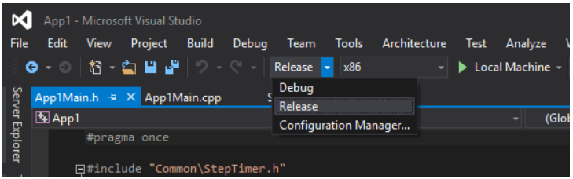
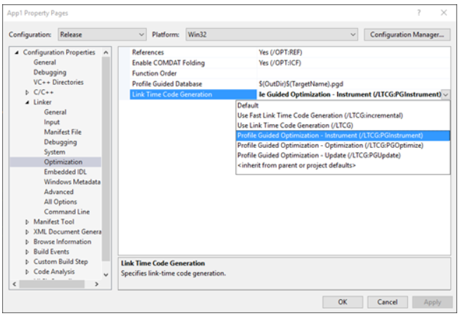
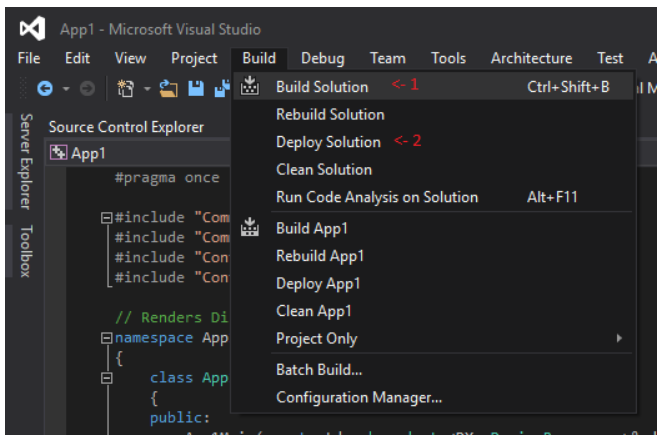

# <a name="running-profile-guided-optimization-on-universal-windows-platform-apps"></a>유니버설 Windows 플랫폼 앱에서 프로필 기반 최적화 실행 
 
이 항목에서는 UWP(유니버설 Windows 플랫폼) 앱에 PGO(프로필 기반 최적화)를 적용하는 단계별 가이드를 제공합니다. 클래식 win32 응용 프로그램에서 사용할 수 있는 모든 단계를 UWP 앱에서 사용할 수 있는 것은 아니므로 최적화 및 UWP 개발자의 접근성 향상을 위해 PGO를 통합하는 데 필요한 프로세스를 설명하는 것이 목표입니다.

다음은 Visual Studio 2015 업데이트 3을 사용하여 기본 DirectX 11 앱(UWP) 템플릿에 PGO를 적용하는 기본 연습입니다.
 
이 가이드의 스크린샷은 다음 새 프로젝트를 기반으로 합니다. 

DirectX 11 앱 템플릿에 PGO를 적용하려면

1. 솔루션 구성을 **릴리스**로 설정하거나 릴리스에 최적화된 코드를 생성 중인 솔루션 구성을 선택합니다. 이론적으로는 디버그 빌드에서 PGO를 실행할 수 있지만 PGO를 사용하여 다른 방법으로 최적화되지 않는 빌드를 최적화하는 것은 효과적이지 않습니다. 
 
 
 
2. **전체 프로그램 최적화**에 대해 /GL 플래그로 빌드 중인 프로젝트 속성(**속성** > **C/C++** > **최적화**)에서 확인합니다(구성에서 이미 설정되어 있을 수 있음).

 

3. 링커 속성(**속성** > **링커** > **최적화**)으로 이동하여 **링크 타임 코드 생성**을 **프로필 기반 최적화 - 계측(LTCG:PGInstrument)**으로 설정합니다.
 
 

4. **솔루션 빌드**를 선택한 후 **솔루션 배포**를 선택합니다. 

 
 
 빌드 출력 위치를 보고 .pgd 파일이 생성되었는지 확인하여 모든 항목이 제대로 작동했는지 다시 확인할 수 있습니다. 이 예제에서는 다음 파일이 빌드 출력과 함께 생성되었다는 것을 의미합니다.
 
 `C:\Users\<USER>\Documents\Visual Studio 2015\Projects\App1\Release\App1\App1.pgd`

 기본적으로 .pgd 파일의 이름은 실행 파일과 같습니다. **프로필 기반 데이터베이스** 링커 옵션을 변경하여 생성된 .pgd 파일의 이름을 변경할 수도 있습니다. 
 
5. Visual Studio VC 이진 디렉터리(기본적으로 `C:\Program Files (x86)\Microsoft Visual Studio 14.0\VC\bin`)로 이동합니다. x86 실행 파일의 경우 `pgort140.dll`을 복사하고 x64 실행 파일의 경우 `amd64\pgort140.dll`에서 x64 버전을 복사합니다. 적절한 버전의 `pgort140.dll`을 배포된 패키지의 루트에 붙여넣습니다. 이 샘플의 경로는 다음과 같습니다.

 `C:\Users\<USER>\Documents\Visual Studio 2015\Projects\App1\Release\App1\AppX\`

 이 단계는 UWP 앱에서 패키지 내에 있는 라이브러리만 로드할 수 있기 때문에 필요합니다.

 
 
6. 시작 메뉴 또는 Visual Studio **디버그** 메뉴에서 **디버깅하지 않고 시작** 옵션을 사용하여 앱을 실행합니다. 

 
 
7. 실행이 계측 중이고 PGO 데이터가 생성 중인 빌드입니다. 이 시점에서 가장 자주 사용하는 몇 가지 최적화 시나리오를 통해 응용 프로그램을 실행해야 합니다. 프로그램이 원하는 시나리오를 통해 실행되면 적절한 버전의 `pgort140.dll`이 있는 폴더에서 pgosweep.exe 도구를 찾습니다. 또는 Visual Studio(x86/x64) 네이티브 도구 명령 프롬프트에는 이미 적절한 버전이 해당 경로에 있습니다. PGO 데이터를 수집하려면 응용 프로그램 실행 중 다음 명령을 실행하여 프로파일링 데이터가 포함되는 .pgc 파일을 생성합니다.
 
  `pgosweep.exe <executable name> <output file>` 
 
  pgosweep.exe 도움말(`pgosweep.exe /help`)에서 PGO 데이터를 수집하는 방법을 제어하기 위한 다른 옵션 인수를 볼 수도 있습니다.
 
  .pgc 파일을 .pgd가 위치한 빌드 위치로 출력하고 파일 이름을 `<PGDName>!<RunIdentifier>.pgc`로 지정하는 것이 좋습니다. 이 예제에서는 다음을 의미합니다.
 
  ```
  pgosweep.exe App1.exe “C:\Users\<USER>\Documents\Visual Studio 2015\Projects\App1\Release\App1\App1!1.pgc”
  ```
 
  추가 수집은 `App1!CoreScenario.pgc`, `App1!UseCase5.pgc` 등일 수 있습니다. .pgc 파일의 이름을 이런 방식으로 지정하고 빌드 출력 위치가 .pgd와 같은 경우 9단계에서 연결할 때 자동으로 병합됩니다.
 
8. 선택 사항: 기본적으로 7단계의 설명처럼 이름을 지정하고 .pgd와 함께 배치된 모든 .pgc 파일은 연결 시 병합되고 동일한 가중치가 부여되지만 특정 실행의 가중치 수준 제어를 높일 수도 있습니다. 이렇게 하려면 `pgort140.dll` 복사본을 처음 검색한 폴더에 있는 **pgomgr.exe** 도구를 사용합니다. 예를 들어 `CoreScenario` 실행을 다른 실행의 우선 순위 3배로 병합하려면 다음 명령을 사용합니다.
 
 ```
 pgomgr.exe -merge:3 “C:\Users\<USER>\Documents\Visual Studio 2015\Projects\App1\Release\App1\App1!CoreScenario.pgc” “C:\Users\<USER>\Documents\Visual Studio 2015\Projects\App1\Release\App1\App1.pgd”
 ```
 
9. 하나 이상의 .pgc 파일을 생성하고 .pgd와 함께 배치하거나 수동으로 병합(8단계)한 후 링커를 사용하여 최종 최적화 빌드를 만들 수 있습니다. 링커 속성(**속성** > **링커** > **최적화**)으로 이동하여 **링크 타임 코드 생성**을 **프로필 기반 최적화 - 최적화(LTCG:PGOptimize)**로 설정하고 **프로필 기반 데이터베이스**가 사용하려는 .pgd를 가리키는지 확인합니다. 이 설정을 변경하지 않은 경우 순서대로 실행합니다.

 
 
10. 이제 프로젝트가 빌드되면 링커가 pgomgr.exe를 호출하여 `<PGDName>!*.pgc` 파일을 기본 가중치 값 1로 .pgd와 병합하고 프로파일링 데이터를 기준으로 결과 응용 프로그램이 최적화됩니다.

## <a name="see-also"></a>참고 항목
- [성능](performance-and-xaml-ui.md)

 

