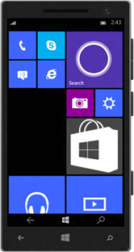
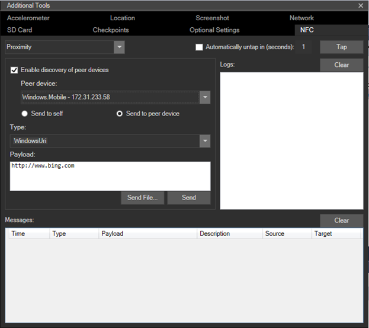

# <a name="test-with-the-microsoft-emulator-for-windows-10-mobile"></a>Windows 10 Mobile용 Microsoft 에뮬레이터로 테스트

\[ Windows 10의 UWP 앱에 맞게 업데이트되었습니다. Windows 8.x 문서는 [보관](http://go.microsoft.com/fwlink/p/?linkid=619132)을 참조하세요. \]

Windows 10 Mobile용 Microsoft 에뮬레이터에 포함된 도구를 사용하여 실제 디바이스 조작을 시뮬레이트하고 앱의 기능을 테스트합니다. 이 에뮬레이터는 Windows 10을 실행하는 모바일 디바이스를 에뮬레이트하는 데스크톱 응용 프로그램입니다. 이 응용 프로그램은 실제 디바이스 없이 Windows 앱을 디버그 및 테스트할 수 있는 가상화된 환경을 제공합니다. 또한 응용 프로그램 프로토타입을 위한 격리된 환경을 제공합니다.

에뮬레이터는 실제 디바이스에 필적하는 성능을 제공합니다. 그러나 Windows 스토어에 앱을 게시하기 전에 실제 디바이스에서 앱을 테스트하는 것이 좋습니다.

다양한 화면 해상도 및 화면 크기 구성에 고유한 Windows 10 Mobile K 에뮬레이터 이미지를 사용하여 유니버설 앱을 테스트할 수 있습니다. Microsoft 에뮬레이터에 포함된 도구를 사용하여 실제 디바이스 조작을 시뮬레이트하고 앱의 다양한 기능을 테스트할 수 있습니다.

## <a name="system-requirements"></a>시스템 요구 사항

컴퓨터는 다음 요구 사항을 만족해야 합니다.

BIOS

-   하드웨어 지원 가상화
-   SLAT(Second Level Address Translation)
-   하드웨어 기반 DEP(데이터 실행 방지)

RAM

-   4GB 이상

운영 체제

-   Windows 8 이상(Windows 10을 사용하는 것이 좋음)
-   64비트
-   Pro 버전 이상

BIOS 요구 사항을 확인하려면 [Windows Phone 8용 에뮬레이터에 Hyper-V를 사용하는 방법](https://msdn.microsoft.com/library/windows/apps/xaml/jj863509.aspx)을 참조하세요.

RAM 및 운영 체제 요구 사항을 확인하려면 제어판에서 **시스템 및 보안**을 클릭한 다음 **시스템**을 클릭합니다.

Windows 10 Mobile K용 Microsoft 에뮬레이터에는 Visual Studio 2015가 필요합니다. 이전 버전의 Visual Studio와는 호환되지 않습니다.

Windows 10 Mobile용 Microsoft 에뮬레이터는 Windows Phone OS 7.1 이전 버전의 Windows Phone OS를 대상으로 하는 앱을 로드할 수 없습니다.

## <a name="installing-and-uninstalling"></a>설치 및 제거

-   **설치**.

    Windows 10 Mobile용 Microsoft 에뮬레이터는 Windows 10 SDK의 일부로 제공됩니다. Windows 10 SDK 및 에뮬레이터는 Visual Studio 2015 설치 과정에서 설치될 수 있습니다. [Visual Studio 다운로드 페이지](https://go.microsoft.com/fwlink/p/?LinkId=534785)를 참조하세요.

    또한 Microsoft 에뮬레이터 설치 프로그램을 사용하여 Windows 10 Mobile K용 Microsoft 에뮬레이터를 설치할 수 있습니다. [Windows 10 도구 다운로드 페이지](https://go.microsoft.com/fwlink/p/?LinkID=534189)를 참조하세요.

-   **제거**.

    Visual Studio 설치/복구를 사용하여 Windows 10 Mobile용 Microsoft 에뮬레이터를 제거할 수 있습니다. 또는 **제어판**에서 **프로그램 및 기능**을 사용하여 에뮬레이터를 제거할 수 있습니다.

    Windows 10 Mobile K용 Microsoft 에뮬레이터를 제거할 때 에뮬레이터에서 사용하도록 생성된 Hyper-V 가상 이더넷 어댑터는 자동으로 제거되지 않습니다. 이 가상 어댑터는 **제어판**의 **네트워크 연결**에서 수동으로 제거할 수 있습니다.

## <a name="whats-new-in-microsoft-emulator-for-windows-10-mobile"></a>Windows 10 Mobile K용 Microsoft 에뮬레이터의 새로운 기능

에뮬레이터는 UWP(유니버설 Windows 플랫폼)에 대한 지원을 제공할 뿐만 아니라 다음 기능도 추가되었습니다.

-   마우스와 단일 터치 입력을 식별하는 마우스 입력 모드 지원
-   NFC 지원. 에뮬레이터를 사용하면 NFC를 시뮬레이트하고 NFC/근접 연결 사용 유니버설 앱을 테스트 및 개발할 수 있습니다.
-   기본 하드웨어 가속은 로컬 그래픽 카드를 사용하여 에뮬레이터의 그래픽 성능을 향상시킵니다. 지원되는 그래픽 카드가 설치되어 있어야 하며 에뮬레이터의 **추가 도구** 설정 사용자 인터페이스의 **센서** 탭에서 가속을 사용하도록 설정해야 가속을 사용할 수 있습니다.

## <a name="features-that-you-can-test-in-the-emulator"></a>에뮬레이터에서 테스트할 수 있는 기능

이전 섹션에서 설명한 새로운 기능 외에도 Windows 10 Mobile용 Microsoft 에뮬레이터에서 자주 사용되는 다음과 같은 기능을 테스트할 수 있습니다.

-   **화면 해상도, 화면 크기 및 메모리**. 다양한 화면 해상도, 실제 크기 및 메모리 제약을 시뮬레이트하기 위해 다양한 에뮬레이터 이미지에서 앱을 테스트하여 광범위한 앱 시장에 접근합니다.

    

-   **화면 구성**. 에뮬레이터를 세로에서 가로 모드로 변경합니다. 에뮬레이터가 데스크톱 화면에 맞도록 확대/축소 설정을 변경합니다.

-   **네트워킹**. 네트워킹 지원은 Windows Phone 에뮬레이터와 통합되어 있습니다. 기본적으로 네트워킹은 사용하도록 설정되어 있습니다. 대부분의 환경에서 Windows Phone 에뮬레이터의 네트워크 드라이버를 설치하거나 네트워킹 옵션을 수동으로 구성하지 않아도 됩니다.

    에뮬레이터는 호스트 컴퓨터의 네트워크 연결을 사용합니다. 네트워크에서 개별 디바이스로 표시되지 않습니다. 따라서 Windows Phone SDK 8.0 에뮬레이터에서 발생하는 몇 가지 구성 문제점이 제거됩니다.

-   **언어 및 지역 설정**. Windows Phone 에뮬레이터에서 표시 언어 및 지역 설정을 변경하여 해외 시장용으로 앱을 준비합니다.

    실행 중인 에뮬레이터에서 **설정** 앱으로 이동하여 **시스템** 설정을 선택한 다음 **언어** 또는 **지역**을 선택합니다. 테스트할 설정을 변경합니다. 프롬프트가 표시되면 **전화 다시 시작**을 클릭하여 새 설정을 적용하고 에뮬레이터를 다시 시작합니다.

-   **응용 프로그램 수명 주기 및 삭제 표시**. 프로젝트 속성의 **디버그** 페이지에서 **디버깅 중 비활성화되면 삭제 표시** 옵션 값을 변경하여 앱이 비활성화되거나 삭제 표시될 때 앱의 동작을 테스트합니다.

-   **로컬 폴더 저장소(이전에는 격리된 저장소라고도 함)**. 격리된 저장소의 데이터는 에뮬레이터가 실행 중인 동안에는 지속되지만 에뮬레이터가 닫히고 나면 손실됩니다.

-   **마이크**. 호스트 컴퓨터에서는 마이크가 필요하며 마이크를 사용합니다.

-   **Phone 키보드**. 에뮬레이터는 개발 컴퓨터의 하드웨어 키보드를 Windows Phone의 키보드에 매핑하도록 지원합니다. 키보드 동작은 Windows Phone 디바이스와 동일합니다.

-   **잠금 화면**. 에뮬레이터를 열고 컴퓨터 키보드에서 F12 키를 두 번 누릅니다. F12 키는 휴대폰의 전원 버튼을 에뮬레이션합니다. 첫 번째 키를 누르면 화면이 꺼집니다. 두 번째 키를 누르면 화면이 다시 켜지고 잠금 화면이 표시됩니다. 마우스를 사용하여 잠금 화면을 위로 밀어 올려 화면의 잠금을 해제합니다.

## <a name="features-that-you-cant-test-in-the-emulator"></a>에뮬레이터에서 테스트할 수 없는 기능

다음 기능은 실제 디바이스에서만 테스트합니다.

-   나침반
-   자이로스코프
-   진동 컨트롤러
-   밝기. 에뮬레이터의 밝기 수준은 항상 높습니다.
-   고해상도 동영상. 특히 512MB의 메모리만 사용하는 에뮬레이터 이미지에서 VGA 해상도(640 x 480)보다 높은 해상도의 동영상은 안정적으로 표시할 수 없습니다.

## <a name="mouse-input"></a>마우스 입력

Windows PC에서 실제 마우스 또는 트랙 패드를 사용하고 에뮬레이터 도구 모음에서 마우스 입력 단추를 사용하여 마우스 입력을 시뮬레이트합니다. 이 기능은 앱에서 Windows 10 디바이스와 쌍으로 연결된 마우스를 활용하는 기능을 사용자에게 제공하여 입력을 제공하는 경우에 유용합니다.

마우스 입력을 사용하려면 에뮬레이터 도구 모음에서 마우스 입력 단추를 탭합니다. 이제 에뮬레이터 크롬 내의 모든 클릭 이벤트는 에뮬레이터 VM 내에서 실행되는 Windows 10 Mobile K OS에 마우스 이벤트로 전송됩니다.



마우스 입력이 활성화된 에뮬레이터 화면입니다.


에뮬레이터 도구 모음의 마우스 입력 단추입니다.

## <a name="keyboard-input"></a>키보드 입력

에뮬레이터는 개발 컴퓨터의 하드웨어 키보드를 Windows Phone의 키보드에 매핑하도록 지원합니다. 키보드 동작은 Windows Phone 디바이스와 동일합니다. 

기본적으로 하드웨어 키보드는 사용하도록 설정되어 있지 않습니다. 이 구현 작업은 배포해야 사용할 수 있는 슬라이딩 키보드와 동일합니다. 하드웨어 키보드를 사용하도록 설정하기 전에는 에뮬레이터가 Ctrl 키의 키 입력만 허용합니다.

지역화된 Windows 개발 컴퓨터 버전의 키보드에 있는 특수 문자는 에뮬레이터에서 지원되지 않습니다. 지역화된 키보드에 있는 특수 문자를 입력하려면 대신 SIP(소프트웨어 입력 패널)를 사용합니다. 

에뮬레이터에서 컴퓨터 키보드를 사용하려면 F4 키를 누릅니다.

에뮬레이터에서 컴퓨터 키보드 사용을 중지하려면 F4 키를 누릅니다.

다음 표에는 Windows Phone에서 버튼 및 기타 컨트롤을 에뮬레이션하는 데 사용할 수 있는 하드웨어 키보드의 키가 나열되어 있습니다.

에뮬레이터 빌드 10.0.14332에서 컴퓨터 하드웨어 키 매핑이 변경되었습니다. 아래 테이블의 두 번째 열 값이 이러한 새 키를 나타냅니다. 

컴퓨터 하드웨어 키(에뮬레이터 빌드 10.0.14295 및 이전 버전) | 컴퓨터 하드웨어 키(에뮬레이터 빌드 10.0.14332 이상) | Windows Phone 하드웨어 버튼 | 참고
--------------------- | ------------------------- | ----------------------------- | -----
F1 | WIN + ESC | 뒤로 | 길게 누르기가 예상대로 작동합니다.
F2 | WIN + F2 | 시작 | 길게 누르기가 예상대로 작동합니다.
F3 | WIN + F3 | 검색 |  
F4 | F4(변경 없음) | 로컬 컴퓨터 키보드를 사용할지 또는 사용하지 않을지 전환합니다. | 
F6 | WIN + F6 | 카메라 절반 | 절반만 누른 전용 카메라 버튼입니다.
F7 | WIN + F7 | 카메라 전체 | 전용 카메라 버튼입니다.
F9 | WIN + F9 | 음량 크게 | 
F10 | WIN + F10 | 음량 작게 | 
F12 | WIN + F12 | 전원 | F12 키를 두 번 눌러 잠금 화면을 사용하도록 설정합니다. 길게 누르기가 예상대로 작동합니다.
Esc | WIN + ESC | 뒤로 | 길게 누르기가 예상대로 작동합니다.
 


## <a name="near-field-communications-nfc"></a>NFC(근거리 통신)

에뮬레이터에서 **추가 도구** 메뉴의 **NFC** 탭을 사용하여 Windows 10 Mobile K의 NFC(근거리 통신) 사용 기능을 이용하는 앱을 빌드 및 테스트합니다. NFC는 근접 시나리오(예: 공유하기 위해 탭)에서 카드 에뮬레이션(예: 지급하기 위해 탭)에 이르기까지 여러 시나리오에 유용합니다.

한 쌍의 에뮬레이터를 사용함으로써 함께 탭하는 한 쌍의 휴대폰을 시뮬레이트하여 앱을 테스트하거나 태그에 탭을 시뮬레이트하여 앱을 테스트할 수 있습니다. 또한 Windows 10에서 모바일 디바이스에서 HCE(호스트 카드 에뮬레이션) 기능을 활성화하고 휴대폰 에뮬레이터를 사용하여 APDU 명령-응답 트래픽에 대한 결제 터미널에 디바이스를 탭하는 것을 시뮬레이트할 수 있습니다.

NFC 탭은 다음의 세 가지 모드를 지원합니다.

-   근접 연결 모드
-   HCE(호스트 카드 에뮬레이션) 모드
-   스마트 카드 판독기 모드

모든 모드에서 에뮬레이터 창에 세 가지 관심 영역이 있습니다.

-   왼쪽 상단 섹션은 선택한 모드와 관련이 있습니다. 이 섹션의 기능은 모드에 따라 다르며 아래의 모드별 섹션에 자세히 설명되어있습니다.
-   오른쪽 상단 섹션에서는 로그를 나열합니다. 한 쌍의 디바이스를 함께 탭(또는 POS 터미널에 탭)할 때 탭 이벤트가 기록되며 디바이스가 언탭될 때 언탭 이벤트가 기록됩니다. 또한 이 섹션은 연결이 끊어지기 전에 또는 타임스탬프와 함께 에뮬레이터 UI에서 수행한 다른 작업 전에 앱에서 응답한 경우를 기록합니다. 로그는 모드 전환 간에 지속되며, **로그** 화면 위의 **지우기** 단추를 눌러 언제든지 로그를 지울 수 있습니다.
-   화면의 아래쪽은 메시지 로그이며, 선택한 모드에 따라 현재 선택한 연결을 통해 주고받은 모든 메시지 기록을 보여 줍니다.

> **중요**  태퍼 도구를 처음 시작하면 Windows 방화벽 프롬프트가 표시됩니다. 3가지 확인란을 모두 선택하고 방화벽을 통한 도구를 허용해야 합니다. 그러지 않으면 도구가 자동으로 작동하지 않습니다.

빠른 시작 설치 관리자를 시작한 후 위의 지침에 따라 방화벽 프롬프트에서 3가지 확인란을 모두 선택했는지 확인합니다. 또한 Microsoft 에뮬레이터와 동일한 실제 호스트 컴퓨터에서 태퍼 도구를 설치하고 사용해야 합니다.

### <a name="proximity-mode"></a>근접 연결 모드

한 쌍의 휴대폰을 함께 탭하는 것을 시뮬레이트하려면 한 쌍의 Windows Phone 8 에뮬레이터를 시작해야 합니다. Visual Studio에서 두 개의 동일한 에뮬레이터 동시 실행을 지원하지 않으므로 각 에뮬레이터에 서로 다른 해상도를 선택하여 이를 해결해야 합니다.



**피어 디바이스 검색 사용** 확인란을 선택한 경우 **피어 디바이스** 드롭다운 상자에 시뮬레이터 드라이버를 실행하는 Windows 컴퓨터(동일한 컴퓨터 또는 로컬 네트워크에서 실행)뿐만 아니라 Microsoft 에뮬레이터(동일한 실제 호스트 컴퓨터 또는 로컬 네트워크에서 실행)가 표시됩니다.

두 에뮬레이터가 실행되면:

-   **피어 디바이스** 목록에서 대상으로 할 에뮬레이터를 선택합니다.
-   **피어 디바이스로 보내기** 라디오 단추를 선택합니다.
-   **탭** 단추를 클릭합니다. 그러면 두 디바이스를 함께 탭하는 시뮬레이트가 실행되며 NFC 탭 알림 사운드가 들립니다.
-   두 디바이스의 연결을 끊으려면 간단히 **언탭** 단추를 누릅니다.

또는 디바이스를 탭하는 시간(초)을 지정할 수 있는 **자동 언탭(초)** 확인란을 사용할 수 있습니다. 그러면 지정한 시간(초)이 지나면 자동으로 언탭됩니다(실제로 사용자의 예상 시간을 시뮬레이트함. 사용자는 짧은 시간 동안만 휴대폰을 들고 있음). 그러나 현재 연결이 언탭된 후에는 메시지 로그를 사용할 수 없습니다.

태그에서 메시지를 읽거나 다른 디바이스에서 메시지를 받는 동작을 시뮬레이트하려면

-   **자신에게 보내기** 라디오 단추 디바이스를 선택하여 NFC 사용 디바이스가 하나만 필요한 시나리오를 테스트합니다.
-   **탭** 단추를 클릭합니다. 그러면 태그에 디바이스를 탭하는 시뮬레이트가 실행되며 NFC 탭 알림 사운드가 들립니다.
-   연결을 끊으려면 간단히 **언탭** 단추를 누릅니다.

근접 연결 모드를 사용하여 태그 또는 다른 피어 디바이스에서 가져온 것처럼 메시지를 삽입할 수 있습니다. 도구를 사용하면 다음과 같은 유형의 메시지를 보낼 수 있습니다.

-   WindowsURI
-   WindowsMime
-   WritableTag
-   Pairing:Bluetooth
-   NDEF
-   NDEF:MIME
-   NDEF:URI
-   NDEF:wkt.U

파일에서 **페이로드** 창을 편집하거나 제공하여 이러한 메시지를 만들 수 있습니다. 이러한 유형 및 그 사용 방법에 대한 자세한 내용은 [**ProximityDevice.PublishBinaryMessage**](https://msdn.microsoft.com/library/windows/apps/Hh701129) 참조 페이지의 설명 섹션을 참조하세요.

WDK(Windows 8 드라이버 키트)에는 Windows Phone 8 에뮬레이터와 동일한 프로토콜을 표시하는 드라이버 샘플이 포함되어 있습니다. Windows 8 디바이스에 DDK를 다운로드하고 해당 샘플 드라이버를 빌드하고 설치한 후 Windows 8 디바이스의 IP 주소 또는 호스트 이름을 디바이스 목록에 추가하고 다른 Windows 8 디바이스 또는 Windows Phone 8 에뮬레이터와 함께 탭해야 합니다.

### <a name="host-card-emulation-hce-mode"></a>HCE(호스트 카드 에뮬레이션) 모드

HCE(호스트 카드 에뮬레이션) 모드에서 POS(Point of Sale) 터미널과 같은 스마트 카드 판독기 터미널을 시뮬레이트하도록 고유한 사용자 지정 스크립트를 작성하여 HCE 기반 카드 에뮬레이션 응용 프로그램을 테스트할 수 있습니다. 이 도구에서는 판독기 터미널(예: POS, 배지 판독기 또는 대중교통 카드 판독기)과 응용 프로그램에서 에뮬레이션하는 스마트 카드 간에 전송되는 명령 응답 쌍(ISO-7816-4 규격)에 익숙하다고 가정합니다.


-   스크립트 편집기 섹션에서 **추가** 단추를 클릭하여 새 스크립트를 만듭니다. 스크립트의 이름을 지정할 수 있으며, 편집을 완료하면 **저장** 단추를 사용하여 스크립트를 저장할 수 있습니다.
-   저장한 스크립트는 다음에 에뮬레이터를 시작할 때 사용할 수 있습니다.
-   스크립트 편집기 창에서 **재생** 단추를 눌러 스크립트를 실행합니다. 이 작업의 결과로 터미널에 휴대폰을 탭하고 스크립트에서 작성한 명령을 보내는 시뮬레이트가 수행됩니다. 또는 **탭** 단추, **재생** 단추를 차례로 누를 수 있으며, **재생**을 누를 때까지 스크립트가 실행되지 않습니다.
-   **중지** 단추를 눌러 명령 전송을 중지합니다. 그러면 응용 프로그램으로의 명령 전송이 중지되지만, **언탭** 단추를 누를 때까지 디바이스에서 탭 상태를 유지합니다.
-   드롭다운 메뉴에서 스크립트를 선택하고 **삭제** 단추를 눌러 스크립트를 삭제합니다.
-   **재생** 단추를 사용하여 스크립트를 실행할 때까지 에뮬레이터 도구는 스크립트의 구문을 확인하지 않습니다. 스크립트에서 보낸 메시지는 카드 에뮬레이션 앱의 구현에 따라 달라집니다.

또한 지급 앱 테스트를 위해 MasterCard의 터미널 시뮬레이터 도구([https://www.terminalsimulator.com/](https://www.terminalsimulator.com/ ))를 사용할 수도 있습니다.

-   스크립트 편집기 창 아래의 **MasterCard 수신기 사용** 확인란을 선택하고 MasterCard의 시뮬레이터를 시작합니다.
-   도구를 사용하면 NFC 도구를 통해 에뮬레이터에서 실행 중인 응용 프로그램에 전달되는 명령을 생성할 수 있습니다.

HCE 지원 및 Windows 10 Mobile K에서 HCE 앱을 개발하는 방법에 대한 자세한 내용을 알아보려면 [Microsoft NFC 팀 블로그](http://go.microsoft.com/fwlink/?LinkId=534749)를 참조하세요.

### <a name="how-to-create-scripts-for-hce-testing"></a>HCE 테스트를 위한 스크립트를 작성하는 방법

스크립트는 C# 코드로 작성하며, **재생** 단추를 클릭할 때 스크립트의 Run 메서드가 호출됩니다. 이 메서드는 APDU 명령의 송수신, 로그 창으로의 출력 및 휴대폰의 APDU 응답을 기다리는 시간 제한 제어에 사용되는 IScriptProcessor 인터페이스를 사용합니다.

다음은 사용 가능한 기능에 대한 참조입니다.

```csharp     
        public interface IScriptProcessor
        {
            // Sends an APDU command given as a hex-encoded string, and returns the APDU response
            string Send(string s);

            // Sends an APDU command given as a byte array, and returns the APDU response
            byte[] Send(byte[] s);

            // Logs a string to the log window
            void Log(string s);

            // Logs a byte array to the log window
            void Log(byte[] s);

            // Sets the amount of time the Send functions will wait for an APDU response, after which
            // the function will fail
            void SetResponseTimeout(double seconds);
        }
```

### <a name="smart-card-reader-mode"></a>스마트 카드 판독기 모드

에뮬레이터를 호스트 컴퓨터의 스마트 카드 판독기 디바이스에 연결할 수 있습니다. 이렇게 스마트 카드를 삽입하거나 탭하면 휴대폰 응용 프로그램에 표시되고 [**Windows.Devices.SmartCards.SmartCardConnection**](https://msdn.microsoft.com/library/windows/apps/Dn608002) 클래스를 사용하여 APDU와 통신할 수 있습니다. 이렇게 하려면 호환되는 스마트 카드 판독기 디바이스를 컴퓨터에 연결해야 합니다. USB 스마트 카드 판독기(NFC/비접촉 및 삽입/접촉)는 폭넓게 사용할 수 있습니다. 에뮬레이터가 연결된 스마트 카드 판독기를 작동하려면 먼저 **카드 판독기** 모드를 선택하여 호스트 시스템에 연결된 호환되는 모든 스마트 카드 판독기를 나열하는 드롭다운 상자를 표시한 다음 드롭다운 메뉴에서 연결할 스마트 카드 판독기 디바이스를 선택합니다.

일부 NFC 지원 스마트 카드 판독기는 몇 가지 NFC 카드 유형을 지원하지 않으며 일부는 표준 PC/SC 저장소 카드 APDU 명령을 지원하지 않습니다.

## <a name="multi-point-input"></a>다중 지점 입력

에뮬레이터 도구 모음의 **멀티 터치 입력** 버튼을 사용하여 개체를 확대/축소, 회전 및 이동하는 멀티 터치 입력을 시뮬레이트합니다. 이 기능은 앱에서 사진, 지도 또는 사용자가 확대/축소, 회전 또는 이동할 수 있는 기타 시각적 요소를 표시하는 경우 유용합니다.

1.  에뮬레이터 도구 모음에서 **멀티 터치 입력** 버튼을 탭하여 다중 지점 입력을 사용합니다. 에뮬레이터 화면의 가운데 지점을 중심으로 두 개의 터치 포인트가 표시됩니다.
2.  마우스 오른쪽 단추를 클릭하고 터치 포인트 중 하나를 끌어서 화면을 터치하지 않고 터치 포인트를 배치합니다.
3.  마우스를 클릭하고 터치 포인트 중 하나를 끌어 확대/축소, 회전 또는 이동을 시뮬레이트합니다.
4.  에뮬레이터 도구 모음의 **단일 지점 입력** 버튼을 탭하여 정상 입력으로 복원합니다.

다음 스크린샷은 멀티 터치 입력을 보여 줍니다.

1.  왼쪽에 있는 작은 이미지는 에뮬레이터 도구 모음에 있는 **멀티 터치 입력** 버튼을 표시합니다.
2.  중간에 있는 이미지는 터치 포인트를 표시하기 위해 **멀티 터치 입력** 버튼을 탭한 다음의 에뮬레이터 화면을 표시합니다.
3.  오른쪽 이미지는 이미지를 확대/축소하기 위해 터치 포인트를 끌어온 후의 에뮬레이터 화면을 나타냅니다.


## <a name="accelerometer"></a>가속도계

에뮬레이터의 **추가 도구 모음**에 있는 **가속도계** 탭을 사용하여 전화의 움직임을 추적하는 앱을 테스트합니다.

실시간 입력 또는 미리 기록된 입력을 사용하여 가속도계 센서를 테스트할 수 있습니다. 사용할 수 있는 유일한 형식의 기록된 데이터는 전화 흔들기를 시뮬레이트합니다. 가속도계 시뮬레이션을 기록하거나 저장할 수 없습니다.

1.  **방향** 드롭다운 목록에서 원하는 시작 방향을 선택합니다.

2.  -   입력 형식을 선택합니다.

        **실시간 입력을 통해 시뮬레이션을 실행하려면 다음을 수행합니다.**

        가속도계 시뮬레이터의 중간에서 색상이 지정된 점을 끌어와 3D 평면에서 디바이스의 움직임을 시뮬레이트합니다.

        가로 액세스의 점을 이동하면 시뮬레이터가 좌우로 회전합니다. 수직 액세스의 점을 이동하면 시뮬레이터가 x축을 중심으로 앞뒤로 회전합니다. 점을 끌어오면 회전 계산에 따라 X, Y 및 Z 좌표가 업데이트됩니다. 터치 패드 영역의 테두리 원 바깥쪽으로 점을 이동할 수 없습니다.

        선택적으로 **재설정**을 클릭하여 시작 방향을 복원합니다.

    -   **기록된 입력을 사용하여 시뮬레이션을 실행하려면 다음을 수행합니다.**

        **기록된 데이터** 섹션에서 **재생** 버튼을 클릭하여 시뮬레이트된 데이터를 재생하기 시작합니다. **기록된 데이터** 목록에서 사용할 수 있는 유일한 옵션은 흔들기입니다. 시뮬레이터는 데이터를 재생할 때 화면을 이동하지 않습니다.


## <a name="location-and-driving"></a>위치 및 운전

에뮬레이터의 **추가 도구**에 있는 **위치** 탭을 사용하여 탐색 또는 지오펜스를 사용하는 앱을 테스트합니다. 이 기능은 실제 세계와 비슷한 조건에서 운전, 자전거 타기 또는 걷기를 시뮬레이트하는 데 유용합니다.

여러 다른 정확도 프로필을 사용하여 서로 다른 속도로 한 위치에서 다른 위치로의 이동을 시뮬레이트하는 동안 앱을 테스트할 수 있습니다. 위치 시뮬레이터를 사용하면 위치 API 사용의 변화를 알 수 있으므로 사용자 환경이 향상됩니다. 예를 들어, 이 도구를 사용하면 여러 다른 시나리오에서 성공적으로 지오펜스를 검색하기 위해 크기 또는 체류 시간과 같은 지오펜스 매개 변수를 조정해야 하는지를 알 수 있습니다.

**위치** 탭은 세 가지 모드를 지원합니다. 모든 모드에서 에뮬레이터가 새 위치를 받으면 [**PositionChanged**](https://msdn.microsoft.com/library/windows/apps/BR225540) 이벤트를 트리거하거나 위치 인식 앱에서 [**GetGeopositionAsync**](https://msdn.microsoft.com/library/windows/apps/Hh973536) 호출에 응답하는 데 이 위치를 사용할 수 있습니다.

-   **핀** 모드에서 지도에 고정핀을 둡니다. **모든 지점 재생**을 클릭하면 위치 시뮬레이터가 **핀당 초** 텍스트 상자에 지정된 간격으로 각 핀의 위치를 에뮬레이터에 차례대로 보냅니다.

-   **실시간** 모드에서 지도에 고정핀을 둡니다. 사용자가 지도에 핀을 두는 즉시 위치 시뮬레이터가 각 핀의 위치를 에뮬레이터에 보냅니다.

-   **경로** 모드에서 중간 지점을 표시하기 위해 지도에 고정핀을 두면 위치 시뮬레이터가 자동으로 경로를 계산합니다. 경로에는 경로를 따라 1초 간격으로 생성되는 보이지 않는 핀이 포함됩니다. 예를 들어, 시간당 5킬로미터의 속도라고 가정하는 **보행** 속도 프로필을 선택하면, 보이지 않는 핀이 1.39미터 간격으로 생성됩니다. **모든 지점 재생**을 클릭하면 위치 시뮬레이터가 드롭다운 목록에서 선택한 속도 프로필에 따라 결정된 간격으로 각 핀의 위치를 에뮬레이터에 차례대로 보냅니다.

위치 시뮬레이터의 모든 모드에서 다음을 수행할 수 있습니다.

-   **검색** 상자를 사용하여 위치를 검색할 수 있습니다.

-   지도에서 **확대** 및 **축소**할 수 있습니다.

-   현재 데이터 지점 집합을 XML 파일에 저장하고 나중에 파일을 다시 로드하여 동일한 데이터 지점을 다시 사용할 수 있습니다.

-   **고정핀 모드를 켜거나 끄고** **모든 지점을 지울 수** 있습니다.

핀 및 경로 모드에서 다음도 수행할 수 있습니다.

-   나중에 사용하기 위해 만든 경로를 저장합니다.

-   이전에 만든 경로를 로드합니다. 이전 버전의 도구에서 만든 경로 파일도 로드할 수 있습니다.

-   고정핀(핀 모드) 또는 중간 지점(경로 모드)을 삭제하여 경로를 수정합니다.

**정확도 프로필**

위치 시뮬레이터의 모든 모드에서, **정확도 프로필** 드롭다운 목록에서 다음 정확도 프로필 중 하나를 선택할 수 있습니다.

| 프로필  | 설명                                        |
|----------|----------------------------------------------------|
| 고정점 | 완전히 정확한 위치 표시값을 추정합니다. 이 설정은 현실적이지 않지만 앱의 논리를 테스트하는 데 유용합니다.  |
| 도시    | 빌딩으로 인해 볼 수 있는 위성의 수가 제한되지만 위치 지정에 사용할 수 있는 Wi-Fi 액세스 지점과 셀 타워의 밀도가 높은 경우가 많습니다. |
| 교외 | 위성 배치는 비교적 양호하며 셀 타워의 밀도도 우수하지만 Wi-Fi 액세스 지점의 밀도는 높지 않습니다.  |
| 시골    | 위성 배치는 우수하지만 위치 지정에 사용할 수 있는 Wi-Fi 액세스 지점은 거의 없으며 셀 타워의 밀도도 낮습니다. |

**속도 프로필**

**경로** 모드에서는 드롭다운 목록에서 다음 속도 프로필 중 하나를 선택할 수 있습니다.

| 프로필 | 시간당 속도               | 초당 속도 | 설명 | 
|---------|------------------------------|------------------|-------------|
| 속도 제한 | 경로의 속도 제한 | 해당 없음   | 게시된 제한 속도로 경로를 횡단합니다. |
| 보행     | 5km/h                   | 1.39 m           | 5km/h의 자연스러운 보행 속도로 경로를 횡단합니다. |
| 자전거      | 25 km/h                  | 6.94 m           | 25km/h의 자연스러운 자전거 속도로 경로를 횡단합니다. |
| 빠름        |                          |                  |게시된 제한 속도보다 빠르게 경로를 횡단합니다. | 

**경로 모드**

경로 모드에는 다음과 같은 기능과 제한이 있습니다.

-   경로 모드를 사용하려면 인터넷을 연결해야 합니다.

-   도시, 교외 또는 시골 정확도 프로필을 선택하면 위치 시뮬레이터가 각 핀에 대해 시뮬레이트된 위성 기반 위치, 시뮬레이트된 Wi-Fi 위치 및 시뮬레이트된 셀 타워 위치를 계산합니다. 앱은 이러한 위치 중 하나만 받습니다. 현재 위치의 세 가지 좌표 집합이 서로 다른 색상으로 지도와 **현재 위치** 목록에 표시됩니다.

-   경로에 따라 생성되는 핀의 정확도는 일정하지 않습니다. 일부 핀은 위성 정확도를 사용하고, 일부는 Wi-Fi 정확도를 사용하며, 다른 핀은 셀 타워 정확도를 사용합니다.

-   경로의 중간 지점을 20개 이상 선택할 수 없습니다.

-   새 정확도 프로필을 선택하면 지도에 표시되는 핀과 표시되지 않는 핀의 위치가 한 번만 생성됩니다. 동일한 에뮬레이터 세션 중에 동일한 정확도 프로필을 사용하여 경로를 두 번 이상 재생하는 경우 이전에 생성된 위치가 다시 사용됩니다.

다음 스크린샷은 경로 모드를 보여 줍니다. 주황색 선은 경로를 나타냅니다. 파란색 점은 위성 기반 위치 지정에 따라 판별된 자동차의 정확한 위치를 나타냅니다. 빨강 및 녹색 점은 Wi-Fi와 셀 타워 위치 및 교외 정확도 프로필을 사용하여 계산한 정확도가 떨어지는 위치를 나타냅니다. 계산된 이 세 가지 위치는 **현재 위치** 목록에도 표시됩니다.


**위치 시뮬레이터에 대한 자세한 내용**

-   정확도를 기본값으로 설정하여 위치를 요청할 수 있습니다. Windows Phone 8 버전의 위치 시뮬레이터에 있던 제한사항과 정확도를 높음으로 설정하여 위치를 요청해야 하는 문제가 수정되었습니다.

-   에뮬레이터에서 지오펜스를 테스트할 때, 지오펜스 엔진이 이동 패턴을 파악하고 이 패턴에 맞게 조정하는 "준비" 기간을 허용하는 시뮬레이션을 만듭니다.

-   시뮬레이트되는 위치 속성은 위도, 경도, 정확도 및 PositionSource뿐입니다. 위치 시뮬레이터는 속도, 방향 등의 기타 속성을 시뮬레이트하지 않습니다.

## <a name="network"></a>네트워크

에뮬레이터의 **추가 도구**에 있는 **네트워크** 탭을 사용하여 여러 다른 네트워크 속도와 여러 다른 신호 강도로 앱을 테스트합니다. 이 기능은 앱에서 웹 서비스를 호출하거나 데이터를 전송하는 경우 유용합니다.

네트워크 시뮬레이션 기능을 사용하면 앱이 실제 상황에서 잘 실행되는지 확인할 수 있습니다. Windows Phone 에뮬레이터는 일반적으로 빠른 WiFi 또는 이더넷 연결이 있는 컴퓨터에서 실행됩니다. 그러나 사용자의 앱은 일반적으로 속도가 느린 무선 통신 연결을 통해 연결되어 있는 전화에서 실행됩니다.

1.  **네트워크 시뮬레이션 사용**을 선택하여 여러 다른 네트워크 속도와 여러 다른 신호 강도로 앱을 테스트합니다.
2.  **네트워크 속도** 드롭다운 목록에서 다음 옵션 중 하나를 선택합니다.
    -   네트워크 없음
    -   2G
    -   3G
    -   4G

3.  **신호 강도** 드롭다운 목록에서 다음 옵션 중 하나를 선택합니다.
    -   좋음
    -   평균
    -   나쁨

4.  **네트워크 시뮬레이션 사용**을 선택 취소하여 개발 컴퓨터의 네트워크 설정을 사용하는 기본 동작을 복원합니다.

**네트워크** 탭에서 현재 네트워크 설정도 검토할 수 있습니다.


## <a name="sd-card"></a>SD 카드

에뮬레이터의 **추가 도구**의 **SD 카드** 탭을 사용하여 시뮬레이트된 이동식 SD 카드로 앱을 테스트합니다. 이 기능은 앱에서 파일을 읽거나 쓰는 경우 유용합니다.


**SD 카드** 탭은 개발 컴퓨터의 폴더를 사용하여 휴대전화의 이동식 SD 카드를 시뮬레이트합니다.

1.  **폴더 선택**.

    **찾아보기**를 클릭하여 시뮬레이트된 SD 카드의 콘텐츠를 보관할 개발 컴퓨터의 폴더를 선택합니다.

2.  **SD 카드 삽입**.

    폴더를 선택한 후 **SD 카드 삽입**을 클릭합니다. SD 카드를 삽입하면 다음과 같은 동작이 발생합니다.

    -   폴더를 지정하지 않았거나 폴더가 유효하지 않은 경우 오류가 발생합니다.
    -   개발 컴퓨터의 지정된 폴더에 있는 파일이 에뮬레이터에 있는 시뮬레이트된 SD 카드의 루트 폴더에 복사됩니다. 진행률 표시줄은 동기화 작업의 진행률을 표시합니다.
    -   **SD 카드 삽입** 버튼이 **SD 카드 꺼내기**로 변경됩니다.
    -   동기화 작업을 진행하는 중에 **SD 카드 꺼내기**를 클릭하면 작업이 취소됩니다.

3.  선택적으로 **SD 카드를 꺼낼 때 업데이트된 파일을 로컬 폴더에 다시 동기화**를 선택하거나 선택 취소합니다.

    이 옵션은 기본적으로 사용됩니다. 이 옵션을 사용하면 SD 카드를 꺼낼 때 에뮬레이터에서 개발 컴퓨터의 폴더로 파일이 다시 동기화됩니다.

4.  **SD 카드 꺼내기**.

    **SD 카드 꺼내기**를 클릭합니다. SD 카드를 꺼내면 다음과 같은 동작이 발생합니다.

    -   **SD 카드를 꺼낼 때 업데이트된 파일을 로컬 폴더로 다시 동기화**를 선택한 경우 다음과 같은 동작이 발생합니다.
        -   에뮬레이터의 시뮬레이트된 SD 카드에 있는 파일이 개발 컴퓨터의 지정된 폴더에 복사됩니다. 진행률 표시줄은 동기화 작업의 진행률을 표시합니다.
        -   **SD 카드 꺼내기** 단추가 **동기화 취소**로 변경됩니다.
        -   동기화 작업이 진행 중인 동안 **동기화 취소**를 클릭하면 카드가 나오고 동기화 작업의 결과는 불완전합니다.
    -   **SD 카드 꺼내기** 버튼이 다시 **SD 카드 삽입**으로 변경됩니다.

> **참고**  휴대폰에서 사용하는 SD 카드는 FAT32 파일 시스템으로 포맷되므로 32GB가 최대 크기입니다.

시뮬레이트된 SD 카드에서 읽고 쓰는 속도는 실제 속도에 맞게 조절됩니다. SD 카드에 액세스하는 것은 컴퓨터의 하드 드라이브에 액세스하는 것보다 느립니다.

## <a name="notifications"></a>알림

에뮬레이터의 **추가 도구**에 있는 **알림** 탭을 사용하여 앱에 푸시 알림을 보냅니다. 이 기능은 앱이 푸시 알림을 받는 경우 유용합니다.

앱을 게시한 후 필요한 작업 클라우드 서비스를 만들지 않고 푸시 알림을 쉽게 테스트할 수 있습니다.

1.  **시뮬레이션을 사용합니다.**

    **사용**을 선택하고 나면, 시뮬레이션을 사용하지 않도록 설정할 때까지 에뮬레이터에 배포된 모든 앱에서 WNS나 MPN 서비스가 아니라 시뮬레이션 엔진을 사용합니다.

2.  **알림을 받을 앱을 선택합니다.**

    **AppId** 목록은 에뮬레이터에 배포되어 푸시 알림에 사용된 모든 앱으로 자동으로 채워집니다. 드롭다운 목록에서 앱을 선택합니다.

    시뮬레이션을 사용한 다음 또 다른 푸시 사용 앱을 배포하는 경우 **새로 고침**을 클릭하여 목록에 앱을 추가합니다.

3.  **알림 채널을 선택합니다.**

    **AppId** 목록에서 앱을 선택하고 나면 선택한 앱에 등록된 모든 알림 채널로 **URI** 목록이 자동으로 채워집니다. 드롭다운 목록에서 알림 채널을 선택합니다.

4.  **알림 형식을 선택합니다.**

    **URI** 목록에서 알림 채널을 선택하고 나면 **알림 형식** 목록이 자동으로 알림 서비스에 사용 가능한 모든 형식으로 채워집니다. 드롭다운 목록에서 알림 형식을 선택합니다.

    시뮬레이터는 Uri 형식의 알림 채널을 사용하여 앱에서 사용하는 푸시 알림이 WNS인지 아니면 MPN인지를 판별합니다.

    시뮬레이션은 모든 형식의 알림을 지원합니다. 기본 알림 형식은 **타일**입니다.

    -   다음과 같은 WNS 알림 형식이 지원됩니다.

        -   원시
        -   알림

            앱에서 WNS 알림을 사용하고 사용자가 **알림** 메시지 형식을 선택하는 경우 시뮬레이션 탭에 **태그**와 **그룹** 필드가 표시됩니다. 이 옵션을 선택하고 **태그**와 **그룹** 값을 입력하여 알림 센터에서 알림 메시지를 관리할 수 있습니다.

        -   타일
        -   배지

    -   다음과 같은 MPN 알림 형식이 지원됩니다.

        -   원시
        -   알림
        -   타일

5.  **알림 템플릿을 선택합니다.**

    **알림 형식** 목록에서 알림 형식을 선택하고 나면 **템플릿** 목록이 알림 형식에 사용 가능한 모든 템플릿으로 자동으로 채워집니다. 드롭다운 목록에서 템플릿을 선택합니다.

    시뮬레이션은 모든 템플릿 형식을 지원합니다.

6.  **선택적으로 알림 페이로드를 변경합니다.**

    **템플릿** 목록에서 템플릿을 선택하고 나면 **알림 페이로드** 텍스트 상자가 자동으로 템플릿의 샘플 페이로드로 채워집니다. **알림 페이로드** 텍스트 상자의 샘플 페이로드를 검토합니다.

    -   샘플 페이로드를 변경하지 않고 보낼 수 있습니다.

    -   텍스트 상자에서 샘플 페이로드를 편집할 수 있습니다.

    -   **로드**를 클릭하여 텍스트나 XML 파일에서 페이로드를 로드할 수 있습니다.

    -   **저장**을 클릭하여 나중에 다시 사용할 페이로드의 XML 텍스트를 저장할 수 있습니다.

    시뮬레이터는 페이로드의 XML 텍스트를 확인하지 않습니다.

7.  **푸시 알림을 보냅니다.**

    **보내기**를 클릭하여 선택한 앱에 푸시 알림을 전달합니다.

    성공 또는 실패를 나타내는 메시지가 화면에 표시됩니다.


## <a name="sensors"></a>센서

에뮬레이터의 **추가 도구**에 있는 **센서** 탭을 사용하여 모든 선택적 센서나 카메라 기능이 없는 저가 휴대폰에서 앱이 작동하는 방식을 테스트합니다. 이 기능은 앱에서 휴대전화의 일부 센서나 카메라를 사용하며 앱이 최대한 광범위한 시장에 진출하기를 바라는 경우 유용합니다.

-   기본적으로 **선택적 센서** 목록에 있는 모든 센서는 사용하도록 설정되어 있습니다. 개별 확인란을 선택하거나 선택 취소하여 개별 센서를 사용하거나 사용하지 않도록 설정합니다.
-   선택사항을 변경한 다음 **적용**을 클릭합니다. 그런 다음 에뮬레이터를 다시 시작해야 합니다.
-   변경한 다음 **적용**을 클릭하지 않고 탭을 전환하거나 **추가 도구** 창을 닫는 경우 변경이 무시됩니다.
-   설정은 변경하거나 다시 설정할 때까지 에뮬레이터 세션 간에 유지됩니다. 검사점을 캡처하는 경우 검사점과 함께 설정이 저장됩니다. 설정은 사용 중인 특정 에뮬레이터에서만 유지됩니다(예: **Emulator 8.1 WVGA 4" 512MB**).


**센서 옵션**

다음 선택적 하드웨어 센서를 사용하거나 사용하지 않도록 설정할 수 있습니다.

-   주변 광원 센서
-   전면 카메라
-   자이로스코프
-   나침반(자력계)
-   NFC
-   소프트웨어 버튼(일부 고해상도 에뮬레이터 이미지에서만)

**카메라 옵션**

**선택적 센서** 목록에서 확인란을 선택하거나 선택 취소하여 선택적 전면 카메라를 사용하거나 사용하지 않도록 설정할 수 있습니다.

**카메라** 드롭다운 목록에서 다음 카메라 프로필 중 하나를 선택할 수도 있습니다.

-   Windows Phone 8.0 카메라
-   Windows Phone 8.1 카메라

다음은 각 프로필에서 지원하는 카메라 기능 목록입니다.

| 기능            | Windows Phone 8.0 카메라 | Windows Phone 8.1 카메라  |
|--------------------|--------------------------|---------------------------|
| 해결 방법         | 640 x 480(VGA)          | 640 x 480(VGA) 이상 |
| 자동 초점          | 예                      | 예                       |
| 플래시              | 아니요                       | 예                       |
| 줌               | 2x(디지털 또는 광학)  | 2x(디지털 또는 광학)   |
| 비디오 해상도   | 640 x 480(VGA)          | 640 x 480(VGA) 이상 |
| 미리 보기 해상도 | 640 x 480(VGA)          | 640 x 480(VGA)           |

## <a name="frame-rate-counters"></a>프레임 속도 카운터

Windows Phone 에뮬레이터의 프레임 속도 카운터를 사용하여 실행 중인 앱의 성능을 모니터합니다.


**프레임 속도 카운터에 대한 설명**

다음 표에서 각 프레임 속도 카운터에 대해 설명합니다.

| 프레임 속도 카운터                           | 설명        |
|----------------------------------------------|--------------------|
| 컴포지션(렌더링) 스레드 프레임 속도(FPS) | 화면 업데이트 속도.  |
| 사용자 인터페이스 스레드 프레임 속도(FPS)       | UI 스레드가 실행되는 속도.    |
| 텍스처 메모리(Texture Memory) 사용                         | 앱에서 사용 중인 텍스처의 비디오 메모리 및 시스템 메모리 사본.    |
| 표면 카운터                              | 처리를 위해 GPU에 전달 중인 명시적 표면 수.     |
| 중간 표면 카운터                 | 표면을 캐시한 결과 생성된 암시적 표면의 수.    |
| 화면 채우기 비율 카운터                     | 화면 측면에서 프레임당 그려지는 픽셀 수. 값 1은 현재 화면 해상도의 픽셀 수를 나타냅니다(예: 480 x 800 픽셀). |

**프레임 속도 카운터 사용하도록 설정 및 해제**

코드에서 프레임 속도 카운터 표시를 사용하거나 사용하지 않도록 설정할 수 있습니다. Visual Studio에서 Windows Phone 앱 프로젝트를 만들 때, 프레임 속도 카운터를 사용하도록 설정하는 다음 코드가 기본적으로 App.xaml.cs 파일에 추가됩니다. 프레임 속도 카운터를 사용하지 않도록 설정하려면 **EnableFrameRateCounter**를 **false**로 설정하거나 코드 줄을 주석으로 처리합니다.

> [!div class="tabbedCodeSnippets"]
>```csharp
>// Show graphics profiling information while debugging.
>if (System.Diagnostics.Debugger.IsAttached)
>{
>    // Display the current frame rate counters.
>    Application.Current.Host.Settings.EnableFrameRateCounter = true;
>    
>    // other code…
>}
>```
>```vb
>' Show graphics profiling information while debugging.
>If System.Diagnostics.Debugger.IsAttached Then
>
>    ' Display the current frame rate counters.
>    Application.Current.Host.Settings.EnableFrameRateCounter = True
>
>    ' other code...
>End If
>```

## <a name="known-issues"></a>알려진 문제

다음은 에뮬레이터와 관련해서 알려진 문제이며, 발생할 경우 문제를 해결하는 제안 방법이 포함되어 있습니다.

### <a name="error-message-failed-while-removing-virtual-ethernet-switch"></a>오류 메시지: "가상 이더넷 스위치를 제거하는 동안 오류가 발생했습니다."

새 Windows 10 플라이트로 업데이트한 후를 포함하여 에뮬레이터와 관련된 가상 네트워크 스위치가 사용자 인터페이스를 통해 삭제할 수 없는 상태로 전환되는 경우가 있습니다.

이 상황에서 복구하려면 관리자 명령 프롬프트에서 "netcfg -d"를 실행합니다. `C:\Program Files (x86)\Microsoft XDE\<version>\XdeCleanup.exe`. 명령 실행이 완료되면 컴퓨터를 다시 부팅하여 복구 프로세스를 완료합니다.

**참고**  이 명령은 에뮬레이터와 관련된 장치뿐만 아니라 모든 네트워킹 장치를 삭제합니다. 컴퓨터가 다시 시작되면 모든 하드웨어 네트워킹 디바이스가 자동으로 검색됩니다.
 
### <a name="unable-to-launch-the-emulators"></a>에뮬레이터를 시작할 수 없음

Microsoft 에뮬레이터는 모든 VM, diff 디스크 및 에뮬레이터 특정 네트워크 스위치를 삭제하는 도구인 XDECleanup.exe를 포함하며, 에뮬레이터(XDE) 이진 파일과 함께 제공됩니다. 잘못된 상태로 전환될 경우 이 도구를 사용하여 에뮬레이터 VM을 정리해야 합니다. 관리자 명령 프롬프트에서 도구를 실행합니다.`C:\Program Files (x86)\Microsoft XDE\<version>\XdeCleanup.exe`

> **참고**  XDECleanup.exe는 모든 에뮬레이터 특정 Hyper-V VM을 삭제하며, 모든 VM 검사점 또는 저장된 상태도 삭제합니다.

### <a name="uninstall-windows-10-for-mobile-image"></a>모바일용 Windows 10 이미지 제거

에뮬레이터를 설치하면 모바일용 Windows 10 VHD 이미지가 설치되고 제어판의 **프로그램 및 기능** 목록에 해당 항목이 표시됩니다. 이미지를 제거하려면 설치된 프로그램 목록에서 **모바일용 Windows 10 이미지 - <version>**을 찾아 마우스 오른쪽 단추로 클릭하고 **제거**를 선택합니다.

그런 다음 현재 릴리스에서 에뮬레이터용 VHD 파일을 수동으로 삭제해야 합니다. 기본 경로에 에뮬레이터를 설치한 경우 VHD 파일은 C:\\Program Files (x86)\\Windows Kits\\10\\Emulation\\Mobile\\<version>\\flash.vhd에 있습니다.

###<a name="how-to-disable-hardware-accelerated-graphics"></a>하드웨어 가속 그래픽을 사용하지 않도록 설정하는 방법

기본적으로 Windows 10 Mobile 에뮬레이터는 하드웨어 가속 그래픽을 사용합니다. 하드웨어 가속을 사용하도록 설정하여 에뮬레이터를 시작하는 데 문제가 있는 경우 레지스트리 값을 설정하여 끌 수 있습니다.

하드웨어 가속을 사용하지 않도록 설정하려면

1. 레지스트리 편집기를 시작합니다.
2. 없는 경우 다음 레지스트리 하위 키를 만듭니다. HKEY_LOCAL_MACHINE\SOFTWARE\Wow6432Node\Microsoft\Xde\10.0
3. 10.0 폴더를 마우스 오른쪽 단추로 클릭하고 **새로 만들기**를 가리킨 다음 **DWORD 값**을 클릭합니다.
4. **DisableRemoteFx**를 입력하고 Enter 키를 누릅니다.
5. **DisableRemoteFx**를 두 번 클릭하고 **값** 데이터 상자에 1을 입력한 다음 **10진수** 옵션을 선택하고 **확인**을 클릭합니다.
6. 레지스트리 편집기를 닫습니다.

**참고:** 이 레지스트리 값을 설정한 후 Visual Studio에서 시작한 구성에 대한 Hyper-V 관리자의 가상 컴퓨터를 삭제하고 소프트웨어 렌더링된 그래픽을 사용하여 에뮬레이터를 다시 시작해야 합니다.

## <a name="support-resources"></a>지원 리소스

Windows 10 도구를 사용하여 작업을 시작할 때 해답을 찾아 문제를 해결하려면 [Windows 10 도구 포럼](http://go.microsoft.com/fwlink/?LinkId=534765)을 방문하세요. Windows 10 개발을 위한 모든 포럼을 확인하려면 [이 링크](http://go.microsoft.com/fwlink/?LinkId=535000)를 방문하세요.

## <a name="related-topics"></a>관련 항목

* [에뮬레이터에서 Windows Phone 앱 실행](https://msdn.microsoft.com/library/windows/apps/xaml/dn632391.aspx)
* [Windows 및 Windows Phone SDK 아카이브](https://dev.windows.com/downloads/sdk-archive)
 


