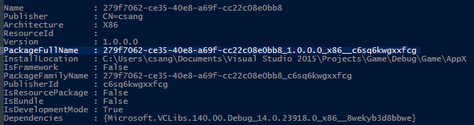

# <a name="testing-and-debugging-tools-for-process-lifetime-management-plm"></a>PLM(프로세스 수명 관리) 테스트 및 디버깅 도구

UWP 앱과 기존 데스크톱 응용 프로그램 간의 주요 차이점 중 하나는 PLM(Process Lifecycle Management)이 적용되는 앱 컨테이너에 UWP 타이틀이 있다는 것입니다. 런타임 브로커 서비스가 모든 플랫폼에서 UWP 앱을 일시 중단, 다시 시작 또는 종료할 수 있으며, 처리하는 코드를 테스트 또는 디버그할 때 강제로 이러한 전환을 수행하는 데 사용할 전용 도구가 있습니다.

## <a name="features-in-visual-studio-2015"></a>Visual Studio 2015의 기능

Visual Studio 2015의 기본 제공 디버거는 UWP 전용 기능을 사용하는 경우의 잠재적인 문제를 조사하는 데 도움이 됩니다. 타이틀을 실행하고 디버그할 때 표시되는 **수명 주기 이벤트** 도구 모음을 사용하여 응용 프로그램을 강제로 다양한 PLM 상태로 전환할 수 있습니다.


## <a name="the-plmdebug-tool"></a>PLMDebug 도구

PLMDebug.exe는 응용 프로그램 패키지의 PLM 상태를 제어할 수 있도록 하며 Windows SDK의 일부로 제공되는 명령줄 도구입니다. 이 도구는 설치된 후 기본적으로 *C:\Program Files (x86)\Windows Kits\10\Debuggers\x64*에 있습니다. 

또한 PLMDebug를 사용하면 설치된 앱 패키지에 대해 PLM을 사용하지 않도록 설정할 수 있습니다. 이 작업은 일부 디버거에 필요합니다. PLM을 사용하지 않도록 설정하면 디버그하기 전에 런타임 브로커 서비스가 앱을 종료하지 못하도록 차단됩니다. PLM을 사용하지 않도록 설정하려면 **/enableDebug** 스위치, UWP 앱의 *전체 패키지 이름*을 차례로 사용합니다(패키지의 짧은 이름, 패키지 패밀리 이름 또는 AUMID는 작동하지 않음).

```
plmdebug /enableDebug [PackageFullName]
```

Visual Studio에서 UWP 앱을 배포한 후 전체 패키지 이름이 출력 창에 표시됩니다. 또는 PowerShell 콘솔에서 **Get-AppxPackage**를 실행하여 전체 패키지 이름을 검색할 수도 있습니다.



선택적으로 앱 패키지를 활성화할 때 자동으로 시작되는 디버거의 절대 경로를 지정할 수 있습니다. Visual Studio를 사용하여 이 작업을 수행하려는 경우 VSJITDebugger.exe를 디버거로 지정해야 합니다. 그러나 VSJITDebugger.exe를 사용하는 경우 "-p" 스위치와 함께 UWP 앱의 PID(프로세스 ID)를 지정해야 합니다. UWP 앱의 PID를 미리 알 수 없기 때문에 이 시나리오는 기본적으로 불가능합니다.

게임의 프로세스를 식별하는 스크립트 또는 도구를 작성하면 이 제한을 해결할 수 있으며, 셸이 UWP 앱의 PID를 전달하여 VSJITDebugger.exe를 실행합니다. 다음 C# 코드 샘플은 이 작업을 수행하는 간단한 방법을 보여 줍니다.

```
using System.Diagnostics;

namespace VSJITLauncher
{
    class Program
    {
        static void Main(string[] args)
        {
            // Name of UWP process, which can be retrieved via Task Manager.
            Process[] processes = Process.GetProcessesByName(args[0]);

            // Get PID of most recent instance
            // Note the highest PID is arbitrary. Windows may recycle or wrap the PID at any time.
            int highestId = 0;
            foreach (Process detectedProcess in processes)
            {
                if (detectedProcess.Id > highestId)
                    highestId = detectedProcess.Id;
            }

            // Launch VSJITDebugger.exe, which resides in C:\Windows\System32
            ProcessStartInfo startInfo = new ProcessStartInfo("vsjitdebugger.exe", "-p " + highestId);
            startInfo.UseShellExecute = true;

            Process process = new Process();
            process.StartInfo = startInfo;
            process.Start();
        }
    }
}
```

PLMDebug에서 이 샘플의 사용 예

```
plmdebug /enableDebug 279f7062-ce35-40e8-a69f-cc22c08e0bb8_1.0.0.0_x86__c6sq6kwgxxfcg "\"C:\VSJITLauncher.exe\" Game"
```
여기서 `Game`은 프로세스 이름이고 `279f7062-ce35-40e8-a69f-cc22c08e0bb8_1.0.0.0_x86__c6sq6kwgxxfcg`는 예제 UWP 앱 패키지의 전체 패키지 이름입니다.

모든 **/enableDebug** 호출은 나중에 **/disableDebug** 스위치가 포함된 다른 PLMDebug 호출과 결합되어야 합니다. 또한 디버거 경로는 절대 경로여야 합니다(상대 경로는 지원되지 않음).

## <a name="related-topics"></a>관련 항목
- [UWP 앱 디버그 및 배포](deploying-and-debugging-uwp-apps.md)
- [디버깅, 테스트 및 성능](index.md)
