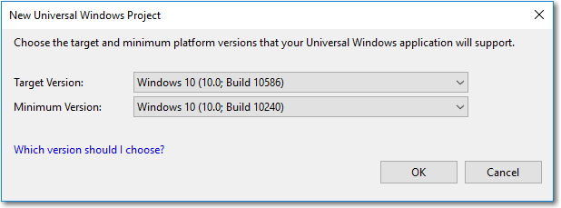

# <a name="version-adaptive-apps-use-new-apis-while-maintaining-compatibility-with-previous-versions"></a>버전 적응 앱: 이전 버전과 호환성을 유지하면서 새로운 API 사용

Windows 10 SDK의 각 릴리스에서는 활용하고 싶어할 만한 멋진 기능이 새로 추가됩니다. 그러나 모든 고객이 동시에 최신 버전의 Windows 10으로 디바이스를 업데이트하지는 않을 것이므로 앱이 가능한 한 가장 광범위한 디바이스에서 작동하도록 해야 합니다. 여기서는 이전 버전의 Windows 10에서 실행되지만 최신 업데이트가 설치된 디바이스에서 앱이 실행될 때마다 새로운 기능도 활용하도록 앱을 설계하는 방법을 보여 줍니다.

앱이 가장 광범위한 Windows 10 디바이스를 지원하도록 하려면 세 단계를 수행해야 합니다.

- 첫째, 최신 API를 대상으로 하도록 Visual Studio 프로젝트를 구성합니다. 이렇게 하면 앱을 컴파일할 때 발생하는 상황에 영향을 주게 됩니다.
- 둘째, 앱이 실행되고 있는 디바이스에 있는 API만 호출하도록 런타임 검사를 수행합니다.
- 셋째, Windows 10의 최소 버전과 대상 버전에서 앱을 테스트합니다.

## <a name="configure-your-visual-studio-project"></a>Visual Studio 프로젝트 구성

여러 Windows 10 버전을 지원하기 위한 첫 번째 단계는 Visual Studio 프로젝트에서 *대상* 및 *최소* 지원 OS/SDK 버전을 지정하는 것입니다.

- *대상*: Visual Studio에서 앱 코드를 컴파일하고 모든 도구를 실행하는 SDK 버전입니다. 이 SDK 버전의 모든 API 및 리소스는 컴파일 시에 앱 코드에서 사용할 수 있습니다.
- *최소*: 앱이 실행될 수 있는 가장 이전 OS 버전을 지원하는(그리고 스토어에서 배포될) SDK 버전과 Visual Studio에서 앱 태그 코드를 컴파일하는 버전입니다. 

런타임 중에 앱은 배포 대상인 OS 버전에 대해 실행되므로 해당 버전에서 사용할 수 없는 리소스를 사용하거나 API를 호출하는 경우 앱에서 예외가 발생합니다. 이 문서의 뒷부분에서 런타임 검사를 사용하여 올바른 API를 호출하는 방법을 보여 줍니다.

대상 및 최소 설정은 OS/SDK 버전 범위의 끝을 지정합니다. 그러나 최소 버전에서 앱을 테스트하는 경우 최소 및 대상 간의 모든 버전에서 앱이 실행될 것을 확인할 수 있습니다.

> [!TIP]
> Visual Studio에서는 API 호환성에 대해 경고하지 않습니다. 최소 및 대상을 포함하여 그 사이에 속하는 모든 OS 버전에서 앱이 예상대로 수행되는지 테스트하고 확인하는 것은 사용자의 책임입니다.

Visual Studio 2015, 업데이트 2 이상에서 새 프로젝트를 만들 때 앱이 지원하는 대상 및 최소 버전을 설정하라는 메시지가 표시됩니다. 기본적으로 대상 버전은 설치된 최상위 SDK 버전이고, 최소 버전은 설치된 최하위 SDK 버전입니다. 컴퓨터에 설치된 SDK 버전에서만 대상 및 최소를 선택할 수 있습니다. 



일반적으로 기본값을 그대로 유지하는 것이 좋습니다. 그러나 SDK의 Preview 버전이 설치되어 있고 프로덕션 코드를 작성하는 경우 대상 버전을 Preview SDK에서 최신 공식 SDK 버전으로 변경해야 합니다. 

Visual Studio에서 이미 만들어진 프로젝트에 대한 최소 및 대상 버전을 변경하려면 프로젝트 -&gt; 속성 -&gt; 응용 프로그램 탭 -&gt; 대상 지정으로 이동합니다.


참조를 위해, 다음 표는 각 SDK에 대한 빌드 번호를 보여 줍니다.

| 이름 | 버전 | OS/SDK 빌드 |
| ---- | ---- | ---- |
| RTM | 1507 | 10240 |
| 11월 업데이트 | 1511 | 10586 |
| 1주년 업데이트 | 1607 | 14393 |
| 크리에이터스 업데이트 | 1703 | 15063 |
| Fall Creators Update | 1709 | 16299 |
| 2018년 4월 업데이트 | 1803 | 17134 |
| 2018 년 10 월 업데이트 | 1809 | _Insider Preview_ |

출시된 모든 버전의 SDK는 [Windows SDK 및 에뮬레이터 아카이브](https://developer.microsoft.com/downloads/sdk-archive)에서 다운로드할 수 있습니다. 최신 Windows Insider Preview SDK는 [Windows 참가자](https://insider.windows.com/Home/BuildWithWindows) 사이트의 개발자 섹션에서 다운로드할 수 있습니다.

 Windows 10 업데이트에 대 한 자세한 내용은 [Windows 10 릴리스 정보를](https://technet.microsoft.com/windows/release-info)참조 하세요. Windows 10에 대 한 중요 정보에 대 한 지원 수명 주기, [Windows 수명 주기 정보 시트](https://support.microsoft.com/help/13853/windows-lifecycle-fact-sheet)를 참조 하세요.

## <a name="perform-api-checks"></a>API 검사 수행

버전 적응 앱의 핵심은 API 계약과 [ApiInformation](https://docs.microsoft.com/uwp/api/windows.foundation.metadata.apiinformation) 클래스의 조합입니다. 이 클래스를 사용하여 지정된 API 계약, 유형 또는 구성원이 있는지 감지할 수 있으므로, 다양한 디바이스와 OS 버전 사이에서 안전하게 API를 호출할 수 있습니다.

### <a name="api-contracts"></a>API 계약

장치 패밀리 내의 API 집합은 API 계약이라고 하는 하위 분류로 나뉘어 있습니다. **ApiInformation.IsApiContractPresent** 메서드를 사용하여 API 계약의 존재 여부를 테스트할 수 있습니다. 이는 모두 같은 버전의 API 계약에 존재하는 많은 API의 존재 여부를 테스트하려는 경우에 유용합니다.

```csharp
    bool isScannerDeviceContract_1_Present =
        Windows.Foundation.Metadata.ApiInformation.IsApiContractPresent
            ("Windows.Devices.Scanners.ScannerDeviceContract", 1);
```

API 계약이란? 기본적으로 API 계약은 기능을 나타냅니다. 특정 일부 기능을 제공하는 관련된 API의 집합입니다. 가상 API 계약은 두 개의 클래스, 다섯 개의 인터페이스, 하나의 구조, 두 개의 열거형 등이 포함된 API 집합을 나타낼 수 있습니다.

논리적으로 관련된 유형은 API 계약으로 그룹화됩니다. 그리고 Windows 10부터 모든 Windows 런타임 API는 일부 API 계약의 구성원입니다. API 계약을 사용하여 디바이스에서 특정 기능 또는 API를 사용할 수 있는지 확인할 수 있으므로, 특정 디바이스나 OS를 검사하는 대신 디바이스의 기능을 효율적으로 검사할 수 있습니다. API 계약에서 API를 구현하려면 API 계약의 모든 API를 구현하는 플랫폼이 필요합니다. 즉, 실행 중인 운영 체제가 특정 API 계약을 지원하는지 테스트할 수 있으며, 지원한다면 API 각각을 확인하지 않고 API 계약의 모든 API를 호출할 수 있다는 의미입니다.

가장 크고 자주 사용되는 API 계약은 **Windows.Foundation.UniversalApiContract**입니다. 여기에는 유니버설 Windows 플랫폼의 대부분 API가 포함되어 있습니다. 사용할 수 있는 다양한 API 계약은 [장치 패밀리 확장 SDK 및 API 계약](https://docs.microsoft.com/uwp/extension-sdks/) 설명서에서 찾을 수 있습니다. 대부분의 API 계약은 기능적으로 관련된 API의 집합입니다.

> [!NOTE]
> 아직 설명서가 없는 미리 보기 버전의 Windows SDK(소프트웨어 개발 키트)가 설치되어 있다면, SDK 설치 폴더인 ‘\(Program Files (x86))\Windows Kits\10\Platforms\<platform>\<SDK version>\Platform.xml’에 있는 ‘Platform.xml’ 파일에서도 API 계약 지원에 대한 정보를 찾을 수 있습니다.

### <a name="version-adaptive-code-and-conditional-xaml"></a>버전 적응 코드 및 조건부 XAML

모든 버전의 Windows 10에서 ApiInformation 클래스를 사용하여 호출할 API의 존재 여부를 테스트할 수 있습니다. 적응 코드에서는 세부적으로 필요한 API를 테스트하기 위해 IsTypePresent, IsEventPresent, IsMethodPresent IsPropertyPresent 등의 다양한 클래스의 메서드를 사용할 수 있습니다.

자세한 정보와 예는 **[버전 적응 코드](version-adaptive-code.md)** 를 참조하세요.

앱 최소 버전이 빌드 15063(크리에이터스 업데이트) 이상일 경우, 코드 숨김 파일을 사용하지 않고 *조건부 XAML*을 사용하여 태그에서 속성을 설정하고 개체를 인스턴스화할 수 있습니다. 조건부 XAML은 태그에서 ApiInformation.IsApiContractPresent 메서드를 사용하는 방법을 제공합니다.

자세한 내용과 예는 **[조건부 XAML](conditional-xaml.md)** 을 참조하세요.

## <a name="test-your-version-adaptive-app"></a>버전 적응 앱 테스트

버전 적응 코드나 조건부 XAML을 사용하여 버전 적응 앱을 제작할 경우, Windows 10의 최소 버전을 실행하는 디바이스와 대상 버전을 실행하는 디바이스에서 테스트해야 합니다.

한 디바이스에서 모든 조건부 코드 경로를 테스트할 수는 없습니다. 모든 코드 경로를 테스트하려면 지원되는 최소 OS 버전을 실행하는 원격 디바이스(또는 가상 컴퓨터)에 앱을 배포하고 테스트해야 합니다.
원격 디버깅에 대한 자세한 내용은 [UWP 앱 배포 및 디버깅](deploying-and-debugging-uwp-apps.md)을 참조하세요.

## <a name="related-articles"></a>관련 문서

- [UWP 앱](https://docs.microsoft.com/windows/uwp/get-started/universal-application-platform-guide)
- [API 계약을 사용하여 동적으로 기능 검색](https://blogs.windows.com/buildingapps/2015/09/15/dynamically-detecting-features-with-api-contracts-10-by-10/)
- [API 계약](https://channel9.msdn.com/Events/Build/2015/3-733)(빌드 2015 비디오)