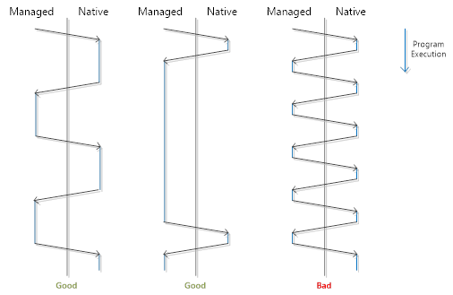

# UWP 구성 요소 및 interop 최적화

Interop 성능 문제를 방지하면서 네이티브 형식과 관리되는 형식 간의 Interop 및 UWP(유니버설 Windows 플랫폼) 구성 요소를 사용하는 UWP 앱을 만듭니다.

## UWP 구성 요소와의 상호 운용성을 위한 모범 사례

주의하지 않으면 UWP 구성 요소 사용이 앱 성능에 큰 영향을 미칠 수 있습니다. 이 섹션에서는 앱에서 UWP 구성 요소를 사용할 때 우수한 성능을 얻는 방법을 설명합니다.

### 소개

상호 운용성이 성능에 큰 영향을 미칠 수 있으며, 자신도 모르는 새 상호 운용성을 이용하고 있는 경우도 있습니다. UWP는 사용자가 생산성을 높이고 다른 언어로 개발된 코드를 다시 사용할 수 있도록 여러 상호 운용성 문제를 다룹니다. UWP의 기능을 효과적으로 활용하는 것이 좋지만, 성능에 미칠 영향도 알아둘 필요가 있습니다. 이 섹션에서는 상호 운용성이 앱의 성능에 미칠 영향을 줄일 수 있는 방법을 설명합니다.

UWP에는 UWP 앱을 만들 수 있는 모든 언어에서 액세스 가능한 형식의 라이브러리가 있습니다. C# 또는 Microsoft Visual Basic에서 .NET 개체를 사용하는 것과 동일한 방법으로 UWP 형식을 사용합니다. UWP 구성 요소에 액세스하기 위해 플랫폼에서 메서드를 호출하게 할 필요 없습니다. 그러면 훨씬 더 간단하게 앱을 만들 수 있지만, 상호 운용성이 예상보다 클 수 있음을 알고 있어야 합니다. UWP 구성 요소가 C# 또는 Visual Basic이 아닌 언어로 개발된 경우 그 구성 요소를 사용할 때 상호 운용성의 경계를 넘게 됩니다. 상호 운용성의 경계를 넘으면 앱의 성능에 영향을 줄 수 있습니다.

C# 또는 Visual Basic으로 UWP 앱을 개발할 때 자주 사용하는 두 가지 API 집합은 UWP API와 UWP 앱용 .NET API입니다. 일반적으로 UWP에 정의되는 형식은 "Windows"로 시작하는 네임스페이스에 있고 .NET 형식은 "System"으로 시작하는 네임스페이스에 있습니다. 그러나 예외가 있습니다. UWP 앱용 .NET의 형식을 사용할 때는 상호 운용성이 필요하지 않습니다. UWP를 사용하는 영역에서 성능이 저조할 경우 UWP 앱용 .NET API를 사용하여 성능을 높일 수도 있습니다.

**참고**  C# 또는 Visual Basic에서 사용 하면 상호 운용성의 경계를 교차 하므로 Windows10 사용 하 여 제공 되는 UWP 구성 요소의 대부분 c + +에서 구현 됩니다. 언제나 그렇듯 코드 변경에 투자하기 전에 UWP 구성 요소의 사용이 앱의 성능에 영향을 주는지 확인하기 위해 앱을 측정해 봐야 합니다.

이 항목에서 "UWP 구성 요소"는 C#이나 Visual Basic이 아닌 언어로 만든 구성 요소를 의미합니다.

 

UWP 구성 요소의 속성에 액세스하거나 메서드를 호출할 때마다 상호 운용성의 부담이 발생합니다. 실제로 UWP 구성 요소를 생성할 때 .NET 개체를 생성하는 것보다 더 부담이 큽니다. UWP에서는 앱의 언어에서 구성 요소의 언어로 변환하는 코드를 실행해야 하기 때문입니다. 또한 구성 요소에 데이터를 전달할 경우 관리되는 형식과 관리되지 않는 형식 간에 데이터를 변환해야 합니다.

### 효율적으로 UWP 구성 요소 사용

성능을 개선할 필요가 있는 경우 코드에서 UWP 구성 요소를 최대한 효율적으로 사용하는지 확인할 수 있습니다. 이 섹션에서는 UWP 구성 요소를 사용할 때 성능을 개선할 수 있는 몇 가지 방법을 소개합니다.

성능에 미치는 영향을 확인할 수 있으려면 짧은 시간에 무수히 많은 호출을 수행해야 합니다. 비즈니스 논리 및 다른 관리 코드에서 UWP 구성 요소에 대한 호출을 캡슐화하는 잘 설계된 응용 프로그램이라면 상호 운용성으로 인한 부담이 크지 않을 것입니다. 그러나 UWP 구성 요소 사용이 앱의 성능에 영향을 주고 있음이 테스트를 통해 확인된 경우 이 섹션의 팁을 참조하여 성능을 개선할 수 있습니다.

### UWP 앱용 .NET 사용 고려

UWP 또는 UWP 앱용 .NET을 사용하여 작업을 수행할 수 있는 경우가 있습니다. .NET 형식과 UWP 형식을 혼용하지 않는 것이 좋습니다. 둘 중 하나만 선택하여 계속 사용하세요. 예를 들어, [**Windows.Data.Xml.Dom.XmlDocument**](https://msdn.microsoft.com/library/windows/apps/BR206173) 형식(UWP 형식) 또는 [**System.Xml.XmlReader**](https://msdn.microsoft.com/library/windows/apps/xaml/system.xml.xmlreader.aspx) 형식(.NET 형식) 중 하나를 사용하여 xml 스트림을 구문 분석할 수 있습니다. 스트림과 동일한 기술의 API를 사용하세요. 예를 들어, [**MemoryStream**](https://msdn.microsoft.com/library/windows/apps/xaml/system.io.memorystream.aspx)의 xml을 읽는 경우 **System.Xml.XmlReader** 형식을 사용합니다.둘 다 .NET 형식이기 때문입니다. 파일에서 읽는 경우 **Windows.Data.Xml.Dom.XmlDocument** 형식을 사용합니다. 파일 API와 **XmlDocument**는 UWP 구성 요소이기 때문입니다.

### Windows 런타임 개체를 .NET 형식에 복사

UWP 구성 요소가 UWP 개체를 반환할 때 그 개체를 .NET 개체로 복사하는 것이 유용할 수 있습니다. 이는 컬렉션과 스트림을 다룰 때 특히 중요합니다.

컬렉션을 반환하는 UWP API를 호출하고 그 컬렉션을 여러 차례 저장하고 액세스하는 경우, 컬렉션을 .NET 컬렉션으로 복사한 다음 .NET 버전을 계속 사용하는 것이 효과적일 수 있습니다.

### UWP 구성 요소에 대한 호출 결과를 캐시에 저장하여 나중에 사용

UWP 형식에 여러 차례 액세스하기보다는 로컬 변수에 값을 저장하는 방법으로 성능을 개선할 수도 있습니다. 이는 루프의 내부에서 값을 사용할 경우 특히 유용할 수 있습니다. 앱을 측정하여 로컬 변수 사용으로 앱의 성능이 개선되는지 확인하세요. 캐시 값을 사용하면 상호 운용성에 소요되는 시간이 단축되므로 앱의 속도가 향상될 수 있습니다.

### UWP 구성 요소에 대한 호출 통합

가급적 UWP 개체에 대한 호출 횟수를 최소화하면서 작업을 완료하세요. 예를 들어 하나의 스트림에서 많은 양의 데이터를 한꺼번에 읽는 것이 한 번에 소량씩 읽는 것보다 낫습니다.

수행하는 작업은 적으면서 필요한 호출이 많은 API 대신 가급적 적은 호출을 통해 번들 방식으로 작업하는 API를 사용하세요. 예를 들어 기본 생성자를 호출하고 한 번에 하나씩 속성을 할당하기보다는 여러 속성을 초기화하는 생성자를 호출하여 개체를 만드는 것이 좋습니다.

### UWP 구성 요소 빌드

C++ 또는 JavaScript로 개발되는 앱에서 사용 가능한 UWP 구성 요소를 만드는 경우, 우수한 성능을 염두에 두고 구성 요소를 설계해야 합니다. 앱의 성능을 높이기 위한 모든 제안은 구성 요소의 성능을 높이기 위한 방법입니다. 구성 요소를 측정하여 어떤 API가 높은 트래픽 패턴을 보이는지 확인하고, 그러한 영역에서는 사용자가 적은 수의 호출로 작업을 수행하게 해주는 API를 사용해 보세요.

## 관리 코드에서 interop를 사용할 경우 앱을 빠르게 유지

UWP는 네이티브 코드와 관리 코드 간의 상호 운용을 간편하게 하지만 주의하지 않을 경우 성능 비용이 발생할 수 있습니다. 여기에서는 관리되는 UWP 앱에서 interop를 사용할 경우 우수한 성능을 얻는 방법을 보여 줍니다.

UWP를 통해 개발자는 각 언어로 사용 가능한 UWP API의 프로젝션 덕분에 선택한 언어로 XAML을 사용하는 UWP 앱을 작성할 수 있습니다. C# 또는 Visual Basic으로 앱을 작성하면 UWP API가 대개 네이티브 코드로 구현되기 때문에 interop 비용으로 이런 편의가 제공되고 C# 또는 Visual Basic에서 UWP를 호출하려면 CLR이 관리 스택 프레임에서 네이티브 스택 프레임으로 전환되고 함수 매개 변수를 네이티브 코드를 통해 액세스할 수 있는 표현으로 마샬링해야 합니다. 대부분 앱의 경우 이 오버헤드는 무시할 수 있습니다. 그러나 앱의 중요 경로에서 UWP API에 대해 수십만 개에서 수백만 개까지 많은 호출을 생성하면 이 부담이 눈에 띌 수 있습니다. 일반적으로 언어 간 전환에 소요되는 시간은 나머지 코드 실행에 비해 작아야 합니다. 이에 대해서는 다음 다이어그램에 나와 있습니다.

[**.NET for Windows apps**](https://msdn.microsoft.com/library/windows/apps/xaml/br230232.aspx)에 나열된 유형은 C# 또는 Visual Basic에서 사용될 경우 이 interop 비용을 유발하지 않습니다. 대략 “Windows.”로 시작되는 네임스페이스의 유형은 UWP의 일부이고 “System.”로 시작되는 네임스페이스의 유형은 .NET 유형이라고 간주할 수 있습니다. 할당 또는 속성 액세스와 같은 UWP 유형의 단순한 사용에서도 interop 비용이 발생합니다.

앱을 측정하고 interop가 앱 실행 시간의 많은 부분을 차지하고 있는지 확인한 다음 interop 비용을 최적화해야 합니다. Visual Studio에서 앱의 성능을 분석할 때 **함수** 보기를 사용하여 UWP를 호출하는 메서드에 소요된 포괄 시간을 확인하여 interop 비용의 상한값을 쉽게 알 수 있습니다.

interop 오버헤드로 인해 앱이 느려지면 활발한 코드 경로에서 UWP API에 대한 호출을 줄여 성능을 개선할 수 있습니다. 예를 들어 [**UIElements**](https://msdn.microsoft.com/library/windows/apps/BR208911)의 위치 및 크기를 지속적으로 쿼리하여 많은 물리학 계산을 수행하고 있는 게임 엔진이 필요한 정보를 **UIElements**에서 로컬 변수로 저장하고 이 캐시된 값에서 계산을 수행하고 계산이 완료된 후 최종 결과를 다시 **UIElements**에 할당하여 많은 시간을 절약할 수 있습니다. 다른 예제: C# 또는 Visual Basic 코드에서 컬렉션에 많이 액세스하는 경우에는 [**Windows.Foundation.Collections**](https://msdn.microsoft.com/library/windows/apps/BR206657) 네임스페이스의 컬렉션이 아니라 [**System.Collections**](https://msdn.microsoft.com/library/windows/apps/xaml/system.collections.aspx) 네임스페이스의 컬렉션을 사용하는 것이 보다 효율적입니다. UWP 구성 요소에 대한 호출을 통합할 수도 있습니다. 이것이 가능한 한 가지 예제는 [**Windows.Storage.BulkAccess**](https://msdn.microsoft.com/library/windows/apps/BR207676) API를 사용하는 것입니다.

### UWP 구성 요소 빌드

C++ 또는 JavaScript로 개발되는 앱에서 사용하기 위한 UWP 구성 요소를 작성하는 경우 우수한 성능을 염두에 두고 구성 요소를 설계해야 합니다. API 표면에서는 interop 경계를 정의하고 사용자가 이 항목의 지침에 대해 고려해야 하는 정도를 정의합니다. 구성 요소를 다른 당사자에게 배포하려는 경우 이는 특히 중요합니다.

앱의 성능을 높이기 위한 모든 제안은 구성 요소의 성능을 높이는 데에도 적용됩니다. 구성 요소를 측정하여 어떤 API가 높은 트래픽 패턴을 보이는지 확인하고, 그러한 영역에서는 사용자가 적은 수의 호출로 작업을 수행할 수 있는 API를 제공하세요. 앱에서 interop 경계를 자주 넘지 않고 UWP를 사용할 수 있도록 하기 위해 UWP를 설계하는 데 상당한 노력을 기울였습니다.

 

