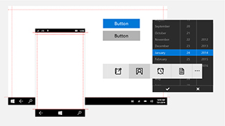

<link rel="stylesheet" href="https://az835927.vo.msecnd.net/sites/uwp/Resources/css/custom.css"> 

# UWP 앱용 디자인 다운로드

이 섹션에는 UWP 앱용 디자인 및 UI 관련 다운로드가 들어 있습니다. Visual Studio 같은 추가 도구는 [Microsoft 기본 다운로드 페이지](https://developer.microsoft.com/downloads)를 참조하세요. 

## 디자인 템플릿

  

    
<b>PowerPoint</b> 
이 모음에는 컨트롤과 레이아웃을 포함하여 UWP 앱의 와이어프레임을 빠르게 모형화하는 데 필요한 모든 것이 있습니다. [PowerPoint용 디자인 템플릿 다운로드](https://go.microsoft.com/fwlink/p/?LinkId=534632)

  

  

  

  

            
<b>Adobe Illustrator</b> 
이러한 Adobe Illustrator 템플릿은 UWP 앱 디자인을 위한 컨트롤 및 레이아웃을 제공합니다. [Adobe Illustrator용 디자인 템플릿 다운로드](https://go.microsoft.com/fwlink/p/?LinkId=534634)
    
  

  

  

  

            
<b>Adobe Photoshop</b> 
Adobe Photoshop에서 UWP 앱을 디자인하기 위한 컨트롤 및 레이아웃입니다. [Adobe Photoshop용 디자인 템플릿 다운로드](http://go.microsoft.com/fwlink/p/?LinkId=626453)
    
  

  

  

## 도구

  

            
<b>Adobe Photoshop용 타일 및 아이콘 생성기</b> 
이 Adobe Photoshop용 작업 집합은 단 7개의 파일에서 68개의 권장 타일 및 아이콘 자산을 생성합니다.  [타일 및 아이콘 생성기 다운로드](http://go.microsoft.com/fwlink/p/?LinkId=760394)
    
  

  

  

  

            
<b>Adobe Illustrator용 Redliner 도구</b> 
Illustrator 프로토타입에서 쉽게 redline을 생성합니다. (Adobe Illustrator CC 이상이 필요합니다.) [Adobe Illustrator용 Redliner 도구 다운로드](https://go.microsoft.com/fwlink/p/?LinkId=534641)
  
  

  

  

## 샘플

  

            
<b>사진 공유 앱</b>  
이 예제 앱은 실제 소셜 미디어를 통한 사진 공유 기능을 보여 줍니다. 반응형 디자인, 앱에서 바로 구매, Azure 서비스, 푸시 알림 등을 보여 줍니다.  [사진 공유 앱 샘플 다운로드](http://go.microsoft.com/fwlink/p/?LinkId=760402) [PhotoSharingApp에 대한 자세한 정보](http://go.microsoft.com/fwlink/p/?LinkId=760401)
    
  

  

  

  

            
<b>Hue Lights </b> 
이 예제는 Windows 기능을 지능형 홈 자동화와 통합합니다. 특히 Cortana 및 Bluetooth LE(Bluetooth 저에너지)를 사용하여 Phillips Hue Lights(Wi-Fi 지원 조명 시스템)를 통한 대화형 환경을 만드는 방법을 보여 줍니다.  [Hue Lights 샘플 다운로드](https://github.com/Microsoft/Windows-appsample-huelightcontroller/archive/master.zip) [Hue Lights 샘플에 대한 자세한 정보](https://github.com/Microsoft/Windows-appsample-huelightcontroller)
    
  

  

  

<b>더 많은 코드가 필요하세요?</b> Windows 샘플 페이지에서 모든 UWP 앱 샘플의 전체 목록을 확인하세요. [샘플 포털로 이동](https://developer.microsoft.com/samples)

<!--HONumber=Aug16_HO5-->

