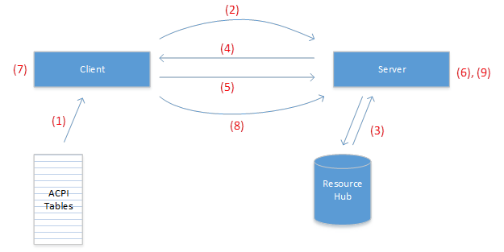
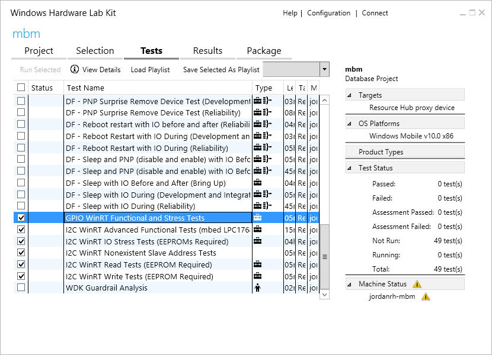

# <a name="enable-usermode-access-to-gpio-i2c-and-spi"></a>GPIO, I2C 및 SPI에 대한 사용자 모드 액세스를 사용하도록 설정


Windows 10에는 사용자 모드에서 직접 GPIO, I2C, SPI 및 UART에 액세스하기 위한 새로운 API가 포함되어 있습니다. Raspberry Pi 2와 같은 개발 보드는 사용자 지정 회로로 기본 컴퓨팅 모듈을 확장하여 특정 응용 프로그램을 처리할 수 있도록 하는 이러한 연결 일부를 노출합니다. 이러한 낮은 수준의 버스는 일반적으로 GPIO 핀 및 버스 일부만 헤더에 노출된 상태로 다른 중요한 온보드 기능과 공유됩니다. 시스템의 안정성을 유지하기 위해서는 사용자 모드 응용 프로그램에 의해 수정해도 안전한 핀 및 버스를 지정해야 합니다. 

이 문서에서는 ACPI에서 이 구성을 지정하는 방법을 설명하고 구성이 올바르게 지정되었는지 확인하기 위한 도구를 제공합니다. 

> [!IMPORTANT]
> 이 문서의 대상 사용자는 UEFI 및 ACPI 개발자입니다. 이러한 개발자는 ACPI, ASL 제작 및 SpbCx/GpioClx에 대해 어느 정도 친숙한 것으로 간주됩니다.

Windows의 하위 수준 버스에 대한 사용자 모드 액세스는 기존 `GpioClx` 및 `SpbCx` 프레임워크를 통해 연결됩니다. Windows IoT Core 및 Windows Enterprise에서만 사용할 수 있는 *RhProxy*라는 새 드라이버는 `GpioClx` 및 `SpbCx` 리소스를 사용자 모드에 공개합니다. 이 API를 사용하도록 설정하려면 사용자 모드에 공개해야 하는 각 GPIO 및 SPB 리소스를 사용하여 ACPI 테이블에서 rhproxy에 대한 디바이스 노드를 선언해야 합니다. 이 문서에서는 ASL의 제작 및 확인 과정을 안내합니다. 


## <a name="asl-by-example"></a>예제별 ASL

Raspberry Pi 2에 대한 rhproxy 디바이스 노드 선언을 살펴보겠습니다. 먼저 \\_SB 범위에서 ACPI 장치 선언을 만듭니다.  

```cpp
Device(RHPX) 
{ 
    Name(_HID, "MSFT8000") 
    Name(_CID, "MSFT8000") 
    Name(_UID, 1) 
    
```

* _HID – Hardware Id. 공급업체 특정 하드웨어 ID로 설정합니다. 
* _CID – Compatible Id. “MSFT8000”입니다.  
* _UID – Unique Id. 1로 설정되어 있습니다.  

다음으로 사용자 모드에 노출해야 하는 각 GPIO 및 SPB 리소스를 선언합니다. 리소스 인덱스는 속성을 리소스와 연결하는 데 사용되므로 리소스가 선언되는 순서는 중요합니다. 여러 I2C 또는 SPI 버스가 노출된 경우 첫 번째로 선언된 버스가 해당 유형의 '기본' 버스로 간주되고 [Windows.Devices.I2c.I2cController](https://msdn.microsoft.com/library/windows/apps/windows.devices.i2c.i2ccontroller.aspx) 및 [Windows.Devices.Spi.SpiController](https://msdn.microsoft.com/library/windows/apps/windows.devices.spi.spicontroller.aspx)의 `GetDefaultAsync()` 메서드에 의해 반환되는 인스턴스가 됩니다. 

### <a name="spi"></a>SPI 

Raspberry Pi에는 노출된 SPI 버스가 2개 있습니다. SPI0에는 하드웨어 칩 선택 줄이 2개 있고 및 SPI1에는 하드웨어 칩 선택 줄이 1개 있습니다. 각 버스의 각 칩 선택 줄에 대해 하나의 SPISerialBus() 리소스 선언이 필요합니다. 다음 두 가지 SPISerialBus 리소스 선언은 SPI0의 두 칩 선택 줄에 대한 것입니다. DeviceSelection 필드에는 드라이버가 하드웨어 칩 선택 줄 식별자로 해석하는 고유한 값이 포함되어 있습니다. DeviceSelection 필드에 삽입하는 정확한 값은 드라이버가 ACPI 연결 설명자의 이 필드를 해석하는 방식에 따라 다릅니다.  

```cpp
// Index 0 
SPISerialBus(              // SCKL - GPIO 11 - Pin 23 
                           // MOSI - GPIO 10 - Pin 19 
                           // MISO - GPIO 9  - Pin 21 
                           // CE0  - GPIO 8  - Pin 24 
    0,                     // Device selection (CE0) 
    PolarityLow,           // Device selection polarity 
    FourWireMode,          // wiremode 
    0,                     // databit len: placeholder 
    ControllerInitiated,   // slave mode 
    0,                     // connection speed: placeholder 
    ClockPolarityLow,      // clock polarity: placeholder 
    ClockPhaseFirst,       // clock phase: placeholder 
    "\\_SB.SPI0",          // ResourceSource: SPI bus controller name 
    0,                     // ResourceSourceIndex 
                           // Resource usage 
    )                      // Vendor Data 

// Index 1 
SPISerialBus(              // SCKL - GPIO 11 - Pin 23 
                           // MOSI - GPIO 10 - Pin 19 
                           // MISO - GPIO 9  - Pin 21 
                           // CE1  - GPIO 7  - Pin 26 
    1,                     // Device selection (CE1) 
    PolarityLow,           // Device selection polarity 
    FourWireMode,          // wiremode 
    0,                     // databit len: placeholder 
    ControllerInitiated,   // slave mode 
    0,                     // connection speed: placeholder 
    ClockPolarityLow,      // clock polarity: placeholder 
    ClockPhaseFirst,       // clock phase: placeholder 
    "\\_SB.SPI0",          // ResourceSource: SPI bus controller name 
    0,                     // ResourceSourceIndex 
                           // Resource usage 
    )                      // Vendor Data 

```

소프트웨어는 이러한 두 리소스가 같은 버스에 연결되어야 하는지를 어떻게 알 수 있을까요? 다음과 같이 버스 이름 및 리소스 인덱스 간의 매핑이 DSD에 지정됩니다.  

```cpp
Package(2) { "bus-SPI-SPI0", Package() { 0, 1 }}, 
```

다음은 2개의 칩 선택 줄인 리소스 인덱스 0과 1이 있는 "SPI0"라는 버스를 만듭니다. SPI 버스의 기능을 선언하기 위해서는 몇 가지 추가 속성이 있습니다.  

```cpp
Package(2) { "SPI0-MinClockInHz", 7629 }, 
Package(2) { "SPI0-MaxClockInHz", 125000000 },
```

**MinClockInHz** 및 **MaxClockInHz** 속성은 컨트롤러에서 지원하는 최소 및 최대 클럭 속도를 지정합니다. API는 사용자가 이 범위를 벗어나는 값을 지정하지 못하게 합니다. 클럭 속도는 연결 설명자(ACPI 섹션 6.4.3.8.2.2)의 _SPE 필드를 통해 SPB 드라이버에 전달됩니다.  

```cpp
Package(2) { "SPI0-SupportedDataBitLengths", Package() { 8 }}, 
```

**SupportedDataBitLengths** 속성은 컨트롤러가 지원하는 데이터 비트 길이를 나열합니다. 쉼표로 구분된 목록으로 여러 값을 지정할 수 있습니다. API는 사용자가 이 목록 외부의 값을 지정하지 못하게 합니다. 데이터 비트 길이는 연결 설명자(ACPI 섹션 6.4.3.8.2.2)의 _LEN 필드를 통해 SPB 드라이버에 전달됩니다.  

이러한 리소스 선언을 "템플릿"으로 간주할 수 있습니다. 시스템 부팅 시에 고정되는 필드도 있고 런타임에 동적으로 지정되는 필드도 있습니다. SPISerialBus 설명자의 다음 필드는 고정되어 있습니다. 

* DeviceSelection 
* DeviceSelectionPolarity 
* WireMode 
* SlaveMode 
* ResourceSource 

다음 필드는 런타임 시 사용자가 지정한 값의 자리 표시자에 해당합니다. 

* DataBitLength 
* ConnectionSpeed 
* ClockPolarity 
* ClockPhase 

SPI1에는 단일 칩 선택 줄만 포함되므로 단일 `SPISerialBus()` 리소스가 선언됩니다. 

```cpp
// Index 2 

SPISerialBus(              // SCKL - GPIO 21 - Pin 40 
                           // MOSI - GPIO 20 - Pin 38 
                           // MISO - GPIO 19 - Pin 35 
                           // CE1  - GPIO 17 - Pin 11 
    1,                     // Device selection (CE1) 
    PolarityLow,           // Device selection polarity 
    FourWireMode,          // wiremode 
    0,                     // databit len: placeholder 
    ControllerInitiated,   // slave mode 
    0,                     // connection speed: placeholder 
    ClockPolarityLow,      // clock polarity: placeholder 
    ClockPhaseFirst,       // clock phase: placeholder 
    "\\_SB.SPI1",          // ResourceSource: SPI bus controller name 
    0,                     // ResourceSourceIndex 
                           // Resource usage 
    )                      // Vendor Data 

```

필수 항목인 이름 선언이 DSD에 지정되고 이 리소스 선언의 인덱스를 나타냅니다. 

```cpp
Package(2) { "bus-SPI-SPI1", Package() { 2 }}, 
```

이렇게 하면 "SPI1"이라는 버스가 만들어진 후 리소스 인덱스 2에 연결됩니다.  

#### <a name="spi-driver-requirements"></a>SPI 드라이버 요구 사항 

* `SpbCx`를 사용하거나 SpbCx에 호환되어야 합니다. 
* [MITT SPI 테스트](https://msdn.microsoft.com/library/windows/hardware/dn919873.aspx)를 통과한 것이어야 합니다.
* 4Mhz 클럭 속도를 지원해야 합니다. 
* 8비트 데이터 길이를 지원해야 합니다. 
* 모든 SPI 모드(0, 1, 2, 3)를 지원해야 합니다. 

### <a name="i2c"></a>I2C 

다음으로 I2C 리소스를 선언합니다. Raspberry Pi는 핀 3와 5에서 단일 I2C 버스를 노출합니다. 

```cpp
// Index 3 
I2CSerialBus(              // Pin 3 (GPIO2, SDA1), 5 (GPIO3, SCL1) 
    0xFFFF,                // SlaveAddress: placeholder 
    ,                      // SlaveMode: default to ControllerInitiated 
    0,                     // ConnectionSpeed: placeholder 
    ,                      // Addressing Mode: placeholder 
    "\\_SB.I2C1",          // ResourceSource: I2C bus controller name 
    , 
    , 
    )                      // VendorData 

```

필수 항목인 이름 선언이 DSD에 지정됩니다. 

```cpp
Package(2) { "bus-I2C-I2C1", Package() { 3 }}, 
```

이 항목은 위에서 선언한 I2CSerialBus() 리소스의 인덱스인 리소스 인덱스 3을 나타내는 이름 “I2C1”을 사용하여 I2C 버스를 선언합니다. 

I2CSerialBus() 설명자의 다음 필드는 고정되어 있습니다. 

* SlaveMode 
* ResourceSource 

다음 필드는 런타임 시 사용자가 지정한 값의 자리 표시자에 해당합니다. 

* SlaveAddress 
* ConnectionSpeed 
* AddressingMode 

#### <a name="i2c-driver-requirements"></a>I2C 드라이버 요구 사항 

* SpbCx를 사용하거나 SpbCx에 호환되어야 합니다. 
* [MITT I2C 테스트](https://msdn.microsoft.com/library/windows/hardware/dn919852.aspx)를 통과한 것이어야 합니다. 
* 7비트 주소 지정을 지원해야 합니다. 
* 100khz 클럭 속도를 지원해야 합니다. 
* 400kHz 클럭 속도를 지원해야 합니다. 

### <a name="gpio"></a>GPIO 

다음으로 사용자 모드에 노출되는 모든 GPIO 핀을 선언합니다. 노출될 핀을 결정할 때는 다음 지침을 따릅니다. 

* 노출된 헤더의 모든 핀을 선언합니다. 
* 단추 및 LED와 같은 유용한 온보드 기능에 연결되어 있는 핀을 선언합니다. 
* 시스템 기능용으로 예약되어 있거나 어디에도 연결되지 않은 핀은 선언하지 않습니다. 

ASL의 다음 블록은 두 개의 핀 GPIO4 및 GPIO5를 선언합니다. 간략히 나타내기 위해 다른 핀은 여기에 표시되지 않았습니다. 부록 C에는 GPIO 리소스를 생성하는 데 사용할 수 있는 샘플 powershell 스크립트가 포함되어 있습니다. 

```cpp
// Index 4 – GPIO 4 
GpioIO(Shared, PullUp, , , , “\\_SB.GPI0”, , , , ) { 4 } 
GpioInt(Edge, ActiveBoth, Shared, PullUp, 0, “\\_SB.GPI0”,) { 4 } 

// Index 6 – GPIO 5 
GpioIO(Shared, PullUp, , , , “\\_SB.GPI0”, , , , ) { 5 } 
GpioInt(Edge, ActiveBoth, Shared, PullUp, 0, “\\_SB.GPI0”,) { 5 } 
```

GPIO 핀을 선언하는 경우 다음 요구 사항은 준수해야 합니다. 

* 메모리 매핑 GPIO 컨트롤러만 지원됩니다. I2C/SPI를 통해 연결되는 GPIO 컨트롤러는 지원되지 않습니다. 컨트롤러 드라이버가 [CLIENT_QueryControllerBasicInformation](https://msdn.microsoft.com/library/windows/hardware/hh439399.aspx) 콜백에 대한 응답으로 [CLIENT_CONTROLLER_BASIC_INFORMATION](https://msdn.microsoft.com/library/windows/hardware/hh439358.aspx) 구조의 [MemoryMappedController](https://msdn.microsoft.com/library/windows/hardware/hh439449.aspx) 플래그에 설정되는 경우 메모리 매핑 컨트롤러에 해당합니다. 
* 각 핀에는 GpioIO 및 GpioInt 리소스가 둘 다 필요합니다. GpioInt 리소스는 GpioIO 리소스 바로 뒤에 나와야 하고 동일한 핀 번호를 참조해야 합니다. 
* GPIO 리소스는 핀 번호를 늘려 정렬해야 합니다. 
* 각 GpioIO 및 GpioInt 리소스는 핀 목록에 정확히 1개의 핀 번호만 포함해야 합니다. 
* 두 설명자의 ShareType 필드는 Shared여야 합니다. 
* GpioInt 설명자의 EdgeLevel 필드는 Edge여야 합니다. 
* GpioInt 설명자의 ActiveLevel 필드는 ActiveBoth여야 합니다. 
* PinConfig 필드 
  * GpioIO와 GpioInt 설명자 둘 다에서 동일해야 합니다. 
  * PullUp, PullDown 또는 PullNone 중 하나여야 합니다. PullDefault일 수 없습니다.
  * 풀 구성은 핀의 전원 켜짐 상태와 일치해야 합니다. 핀을 전원 켜짐 상태에서 지정된 풀 모드로 전환해도 핀의 상태는 변경되지 않아야 합니다. 예를 들어 데이터 시트에 핀이 풀업을 따르도록 지정되면 PinConfig를 PullUp으로 지정합니다.  

펌웨어, UEFI 및 드라이버 초기화 코드는 부팅하는 동안 핀을 전원 켜짐 상태에서 다른 상태로 변경하지 않아야 합니다. 사용자만 핀에 연결된 항목과 어떤 상태 전환이 안전한 것인지 알고 있습니다. 사용자가 핀에 적절히 연결되는 하드웨어를 디자인할 수 있도록 각 핀의 전원 켜짐 상태를 문서화해야 합니다. 부팅 중에 예기치 않게 핀 상태가 변경되지 않아야 합니다.  

#### <a name="supported-drive-modes"></a>지원되는 드라이브 모드 

GPIO 컨트롤러가 높은 임피던스의 입력 및 CMOS 출력 외에 기본 제공된 풀업 및 풀다운 저항기를 지원하는 경우 선택적 SupportedDriveModes 속성을 사용해서 이를 지정해야 합니다. 

```cpp
Package (2) { “GPIO-SupportedDriveModes”, 0xf }, 
```

SupportedDriveModes 속성은 GPIO 컨트롤러에서 지원하는 드라이브 모드를 나타냅니다. 위 예제에서는 다음 드라이브 모드가 모두 지원됩니다. 속성은 다음 값의 비트 마스크입니다. 

| 플래그 값 | 드라이브 모드 | 설명 |
|------------|------------|-------------|
| 0x1        | InputHighImpedance | 핀은 ACPI의 "PullNone" 값에 해당하는 높은 임피던스 입력을 지원합니다. |
| 0x2        | InputPullUp | 핀은 ACPI의 "PullUp" 값에 해당하는 기본 제공 풀업 저항기를 지원합니다. |
| 0x4        | InputPullDown | 핀은 ACPI의 "PullDown" 값에 해당하는 기본 제공 풀다운 저항기를 지원합니다. |
| 0x8        | OutputCmos | 핀은 강력한 높은 값과 강력한 낮은 값의 생성을 모두 지원합니다(오픈 드레인과 반대임). |

InputHighImpedance 및 OutputCmos는 거의 모든 GPIO 컨트롤러에서 지원됩니다. SupportedDriveModes 속성을 지정하지 않으면 이것이 기본값입니다. 

노출된 헤더에 도달하기 전에 GPIO 신호가 수준 변환기에 닿으면 외부 헤더에서 드라이브 모드를 확인할 수 없더라도 SOC에서 지원되는 드라이브 모드를 선언합니다. 예를 들어 핀이 양방향 수준 전환기를 거쳐 저항 풀업의 오픈 드레인으로 나타날 경우 핀이 높은 임피던스 입력으로 구성된 경우에도 노출된 헤더에서 높은 임피던스 상태가 확인되지 않습니다. 핀이 높은 임피던스 입력을 지원한다는 사실을 계속 선언해야 합니다. 

#### <a name="pin-numbering"></a>핀 번호 매기기 

Windows는 다음 두 가지 핀 번호 매기기 체계를 지원합니다. 

* 순차 핀 번호 매기기 – 0, 1, 2...부터 노출된 최대 핀 수까지 번호가 표시됩니다. 0은 ASL에 선언된 첫 번째 GpioIo 리소스이고, 1은 ASL에 선언된 두 번째 GpioIo 리소스이며 이와 같은 방식으로 계속 적용됩니다. 
* 네이티브 핀 번호 매기기 – GpioIo 설명자에 지정된 핀 번호(예: 4, 5, 12, 13...)가 표시됩니다  

```cpp
Package (2) { “GPIO-UseDescriptorPinNumbers”, 1 }, 
```

**UseDescriptorPinNumbers** 속성은 순차 핀 번호 매기기 대신 네이티브 핀 번호 매기기를 사용하도록 Windows에 지시합니다. UseDescriptorPinNumbers 속성이 지정되지 않았거나 해당 값이 0인 경우 Windows는 기본적으로 순차 핀 번호 매기기로 지정됩니다. 

네이티브 핀 번호 매기기가 사용되는 경우 **PinCount** 속성도 지정해야 합니다. 

```cpp
Package (2) { “GPIO-PinCount”, 54 }, 
```

**PinCount** 속성은 `GpioClx` 드라이버의 [CLIENT_QueryControllerBasicInformation](https://msdn.microsoft.com/library/windows/hardware/hh439399.aspx) 콜백에 포함된 **TotalPins** 속성을 통해 반환되는 값과 일치해야 합니다. 

보드에 대해 발표된 기존 설명서와 가장 잘 호환되는 번호 매기기 체계를 선택합니다. 예를 들어 Raspberry Pi는 기존의 많은 핀아웃 다이어그램이 BCM2835 핀 번호를 사용하기 때문에 네이티브 핀 번호 매기기를 사용합니다. MinnowBoardMax는 기존의 핀아웃 다이어그램이 거의 없고, 200개 넘는 핀 중에서 10개만 노출되므로 순차 핀 번호 매기기가 개발자 환경을 간소화하기 때문에 순차 핀 번호 매기기를 사용합니다. 순차 핀 번호 매기기를 사용할지 또는 네이티브 핀 번호 매개기를 사용할지 결정할 때는 개발자 혼동을 줄이기 것을 고려해야 합니다. 

#### <a name="gpio-driver-requirements"></a>GPIO 드라이버 요구 사항 

* 다음을 사용해야 합니다. `GpioClx`
* SOC 메모리 매핑되어야 합니다. 
* 에뮬레이트된 ActiveBoth 인터럽트 처리를 사용해야 합니다. 

### <a name="uart"></a>UART 

UART 드라이버가 `SerCx`또는 `SerCx2`를 사용하는 경우, rhproxy를 사용하여 사용자 모드에 드라이버를 노출할 수 있습니다. `GUID_DEVINTERFACE_COMPORT` 형식의 디바이스 인터페이스를 만드는 UART 드라이버에서는 rhproxy를 사용할 필요가 없습니다. 받은 편지함 `Serial.sys` 드라이버는 이러한 경우 중 하나입니다.

`SerCx` 스타일 UART를 사용자 모드에 노출하려면 다음과 같이 `UARTSerialBus` 리소스를 선언합니다.

```cpp
// Index 2 
UARTSerialBus(           // Pin 17, 19 of JP1, for SIO_UART2 
    115200,                // InitialBaudRate: in bits ber second 
    ,                      // BitsPerByte: default to 8 bits 
    ,                      // StopBits: Defaults to one bit 
    0xfc,                  // LinesInUse: 8 1-bit flags to declare line enabled 
    ,                      // IsBigEndian: default to LittleEndian 
    ,                      // Parity: Defaults to no parity 
    ,                      // FlowControl: Defaults to no flow control 
    32,                    // ReceiveBufferSize 
    32,                    // TransmitBufferSize 
    "\\_SB.URT2",          // ResourceSource: UART bus controller name 
    , 
    , 
    , 
    )
```

다른 모든 필드는 런타임 시 사용자가 지정하는 값에 대한 자리 표시자이므로 ResourceSource 필드만 고정됩니다. 

함께 제공되는 이름 선언은 다음과 같습니다. 

```cpp
Package(2) { "bus-UART-UART2", Package() { 2 }}, 
```

이 이름 선언은 사용자가 사용자 모드에서 버스에 액세스하는 데 사용하는 식별자에 해당하는 이름 "UART2"를 컨트롤러에 할당합니다.  

## <a name="runtime-pin-muxing"></a>런타임 핀 Muxing 

핀 muxing은 다양한 기능에 동일한 물리적 핀을 사용하는 기능입니다. I2C 컨트롤러, SPI 컨트롤러, GPIO 컨트롤러와 같은 여러 다른 온칩 주변 장치를 SOC의 동일한 물리적 핀으로 라우팅할 수 있습니다. mux 블록은 지정된 시간에 핀에서 활성 상태인 기능을 제어합니다. 일반적으로 펌웨어가 부팅 시 기능 할당을 설정하며, 이러한 할당은 부팅 세션 동안 정적 상태를 유지합니다. 런타임 핀 muxing은 런타임에 핀 기능 할당을 다시 구성할 수 있는 기능을 추가합니다. 사용자가 런타임에 핀의 기능을 선택할 수 있도록 하면 보드의 핀을 빠르게 재구성할 수 있으므로 개발 속도가 빨라지고, 하드웨어가 정적 구성을 사용할 때보다 더 광범위한 응용 프로그램을 지원할 수 있게 됩니다. 

사용자는 추가 코드를 작성하지 않고도 GPIO, I2C, SPI 및 UART에 대한 muxing 지원을 사용합니다. 사용자가 [OpenPin()](https://msdn.microsoft.com/library/dn960157.aspx) 또는 [FromIdAsync()](https://msdn.microsoft.com/windows.devices.i2c.i2cdevice.fromidasync)를 사용하여 GPIO 또는 버스를 열면 기본 실제 핀이 요청된 기능으로 자동으로 muxing됩니다. 핀이 이미 다른 기능에 사요외는 경우 OpenPin() 또는 FromIdAsync() 호출이 실패합니다. 사용자가 [GpioPin](https://msdn.microsoft.com/library/windows/apps/windows.devices.gpio.gpiopin.aspx), [I2cDevice](https://msdn.microsoft.com/library/windows/apps/windows.devices.i2c.i2cdevice.aspx), [SpiDevice](https://msdn.microsoft.com/library/windows/apps/windows.devices.spi.spidevice.aspx) 또는 [SerialDevice](https://msdn.microsoft.com/library/windows/apps/windows.devices.serialcommunication.serialdevice.aspx) 개체를 삭제하여 디바이스를 닫으면 핀이 해제되면서 다른 기능을 위해 열릴 수 있게 됩니다. 

Windows의 [GpioClx](https://msdn.microsoft.com/library/windows/hardware/hh439515.aspx), [SpbCx](https://msdn.microsoft.com/library/windows/hardware/hh406203.aspx) 및 [SerCx](https://msdn.microsoft.com/library/windows/hardware/dn265349.aspx) 프레임워크에는 핀 muxing에 대한 지원이 기본적으로 포함되어 있습니다. 이러한 프레임워크는 함께 작동하면서 GPIO 핀 또는 버스가 액세스될 때 핀을 자동으로 올바른 기능으로 전환합니다. 핀에 대한 액세스는 여러 클라이언트 간 충돌을 방지하기 위해 중재됩니다. 이 기본 제공 지원 외에 핀 muxing을 위한 인터페이스와 프로토콜은 범용이며 추가 장치 및 시나리오를 지원하도록 확장될 수 있습니다. 

이 문서에서는 먼저 핀 muxing과 관련된 기본 인터페이스 및 프로토콜에 대해 설명한 다음 GpioClx와 SpbCx, SerCx 컨트롤러 드라이버에 핀 muxing에 대한 지원을 추가하는 방법에 대해 설명합니다. 

### <a name="pin-muxing-architecture"></a>핀 Muxing 아키텍처 

이 섹션에서는 핀 muxing과 관련된 기본 인터페이스 및 프로토콜에 대해 설명합니다. GpioClx/SpbCx/SerCx 드라이버와의 핀 muxing을 지원하기 위해 기본 프로토콜에 대한 지식이 반드시 필요한 것은 아닙니다. GpioCls/SpbCx/SerCx 드라이버와의 핀 muxing을 지원하는 방법에 대한 자세한 내용은 [GpioClx 클라이언트 드라이버에서 핀 muxing 지원 구현](#supporting-muxing-support-in-gpioclx-client-drivers) 및 [SpbCx 및 SerCx 컨트롤러 드라이버에서 muxing 지원 사용](#supporting-muxing-in-spbcx-and-sercx-controller-drivers)을 참조하세요. 

핀 muxing은 여러 구성 요소가 함께 작동하면서 구현됩니다. 

* 핀 muxing 서버 – 핀 muxing 제어 블록을 제어하는 드라이버입니다. 핀 muxing 서버는 muxing 리소스에 대한 예약 요청(*IRP_MJ_CREATE* 요청를 통해)과 핀의 기능 전환 요청(*IOCTL_GPIO_COMMIT_FUNCTION_CONFIG_PINS* 요청을 통해)을 통해 클라이언트에서 핀 muxing 요청을 수신합니다. muxing 블록이 GPIO 블록의 일부인 경우가 가끔 있으므로 핀 muxing 서버는 일반적으로 GPIO 드라이버입니다. muxing 블록은 별도의 주변 장치이지만 GPIO 드라이버는 muxing 기능을 배치할 논리적 위치입니다. 
* 핀 muxing 클라이언트 - 핀 muxing을 소비하는 드라이버입니다. 핀 muxing 클라이언트는 ACPI 펌웨어에서 핀 muxing 리소스를 받습니다. 핀 muxing 리소스는 일종의 연결 리소스로, 리소스 허브에 의해 관리됩니다. 핀 muxing 클라이언트는 리소스에 대한 핸들을 열어 핀 muxing 리소스를 예약합니다. 하드웨어 변경 내용을 적용하려면 클라이언트는 *IOCTL_GPIO_COMMIT_FUNCTION_CONFIG_PINS* 요청을 보내 구성을 커밋해야 합니다. 클라이언트는 핸들을 닫아 핀 muxing 리소스를 해제하며 이때 muxing 구성은 기본 상태로 복구됩니다. 
* ACPI 펌웨어 - `MsftFunctionConfig()` 리소스를 사용한 muxing 구성을 지정합니다. MsftFunctionConfig 리소스는 muxing 구성에는 클라이언트에 의해 요청되는 핀을 나타냅니다. MsftFunctionConfig 리소스에는 기능 번호, 풀 구성 및 핀 번호 목록이 포함되어 있습니다. MsftFunctionConfig 리소스는 GPIO 및 SPB 연결 리소스의 경우와 비슷하게 PrepareHardware 콜백에서 드라이버에 의해 수신되는 하드웨어 리소스로서 핀 muxing 클라이언트에 제공됩니다. 클라이언트는 리소스에 대한 핸들을 여는 데 사용할 수 있는 리소스 허브 ID를 수신합니다. 

> `MsftFunctionConfig()` 설명자는 ACPI 작업 위원회에서 검토 중이므로 `/MsftInternal` 명령줄 스위치를 `asl.exe`에 전달하여 이 설명자가 포함된 ASL 파일을 컴파일해야 합니다. 예: `asl.exe /MsftInternal dsdt.asl`

핀 muxing과 관련된 작업 순서는 다음과 같습니다. 



1.  클라이언트는 해당 [EvtDevicePrepareHardware()](https://msdn.microsoft.com/library/windows/hardware/ff540880.aspx) 콜백 시 ACPI 펌웨어에서 MsftFunctionConfig 리소스를 수신합니다.
2.  클라이언트는 리소스 허브 도우미 함수 `RESOURCE_HUB_CREATE_PATH_FROM_ID()`를 사용하여 리소스 ID의 경로를 만든 다음 해당 경로에 대한 핸들([ZwCreateFile()](https://msdn.microsoft.com/library/windows/hardware/ff566424.aspx), [IoGetDeviceObjectPointer()](https://msdn.microsoft.com/library/windows/hardware/ff549198.aspx) 또는 [WdfIoTargetOpen()](https://msdn.microsoft.com/library/windows/hardware/ff548634.aspx))을 엽니다.
3.  서버는 리소스 허브 도우미 함수 `RESOURCE_HUB_ID_FROM_FILE_NAME()`을 사용하여 파일 경로에서 리소스 허브 ID를 추출하고 리소스 허브를 쿼리하여 리소스 설명자를 가져옵니다.
4.  서버는 설명자의 각 핀에 대해 공유 중재를 수행하고 IRP_MJ_CREATE 요청을 완료합니다.
5.  클라이언트는 수신된 핸들에 대해 *IOCTL_GPIO_COMMIT_FUNCTION_CONFIG_PINS* 요청을 실행합니다.
6.  서버는 *IOCTL_GPIO_COMMIT_FUNCTION_CONFIG_PINS*에 대한 응답으로 각 핀에서 지정된 기능을 활성화하여 하드웨어 muxing 작업을 수행합니다.
7.  클라이언트는 요청한 핀 muxing 구성에 종속된 작업을 계속 진행합니다.
8.  클라이언트는 더 이상 핀 muxing이 필요하지 않으면 핸들을 닫습니다.
9.  핸들이 닫히면 서버는 핀을 초기 상태로 되돌립니다.

### <a name="protocol-description-for-pin-muxing-clients"></a>핀 muxing 클라이언트에 대한 프로토콜 설명

이 섹션에서는 클라이언트가 핀 muxing 기능을 사용하는 방법을 설명합니다. 이 내용은 `SerCx` 및 `SpbCx` 컨트롤러 드라이버에는 적용되지 않습니다. 해당 프레임워크가 컨트롤러 드라이버를 대신해서 이 프로토콜을 구현하기 때문입니다.

####    <a name="parsing-resources"></a>리소스 구문 분석

WDF 드라이버는 해당 [EvtDevicePrepareHardware()](https://msdn.microsoft.com/library/windows/hardware/ff540880.aspx) 루틴에서 `MsftFunctionConfig()` 리소스를 수신합니다. MsftFunctionConfig 리소스는 다음 필드로 식별할 수 있습니다.

```cpp
CM_PARTIAL_RESOURCE_DESCRIPTOR::Type = CmResourceTypeConnection
CM_PARTIAL_RESOURCE_DESCRIPTOR::u.Connection.Class = CM_RESOURCE_CONNECTION_CLASS_FUNCTION_CONFIG
CM_PARTIAL_RESOURCE_DESCRIPTOR::u.Connection.Type = CM_RESOURCE_CONNECTION_TYPE_FUNCTION_CONFIG
```

`EvtDevicePrepareHardware()` 루틴은 다음과 같이 MsftFunctionConfig 리소스를 추출할 수 있습니다.

```cpp
EVT_WDF_DEVICE_PREPARE_HARDWARE evtDevicePrepareHardware;

_Use_decl_annotations_
NTSTATUS
evtDevicePrepareHardware (
    WDFDEVICE WdfDevice,
    WDFCMRESLIST ResourcesTranslated
    )
{
    PAGED_CODE();

    LARGE_INTEGER connectionId;
    ULONG functionConfigCount = 0;

    const ULONG resourceCount = WdfCmResourceListGetCount(ResourcesTranslated);
    for (ULONG index = 0; index < resourceCount; ++index) {
        const CM_PARTIAL_RESOURCE_DESCRIPTOR* resDescPtr =
            WdfCmResourceListGetDescriptor(ResourcesTranslated, index);

        switch (resDescPtr->Type) {
        case CmResourceTypeConnection:
            switch (resDescPtr->u.Connection.Class) {
            case CM_RESOURCE_CONNECTION_CLASS_FUNCTION_CONFIG:
                switch (resDescPtr->u.Connection.Type) {
                case CM_RESOURCE_CONNECTION_TYPE_FUNCTION_CONFIG:                    
                    switch (functionConfigCount) {
                    case 0:
                        // save the connection ID
                        connectionId.LowPart = resDescPtr->u.Connection.IdLowPart;
                        connectionId.HighPart = resDescPtr->u.Connection.IdHighPart;
                        break;
                    } // switch (functionConfigCount)
                    ++functionConfigCount;
                    break; // CM_RESOURCE_CONNECTION_TYPE_FUNCTION_CONFIG

                } // switch (resDescPtr->u.Connection.Type)
                break; // CM_RESOURCE_CONNECTION_CLASS_FUNCTION_CONFIG
            } // switch (resDescPtr->u.Connection.Class)
            break;
        } // switch
    } // for (resource list)

    if (functionConfigCount < 1) {
        return STATUS_INVALID_DEVICE_CONFIGURATION;
    }
    // TODO: save connectionId in the device context for later use

    return STATUS_SUCCESS;
}
```

####    <a name="reserving-and-committing-resources"></a>리소스 예약 및 커밋

클라이언트는 핀 muxing을 원할 경우 MsftFunctionConfig 리소스를 예약하고 커밋합니다. 다음 예제에서는 클라이언트가 MsftFunctionConfig 리소스를 예약하고 커밋하는 방법을 보여 줍니다.

```cpp
_IRQL_requires_max_(PASSIVE_LEVEL)
NTSTATUS AcquireFunctionConfigResource (
    WDFDEVICE WdfDevice,
    LARGE_INTEGER ConnectionId,
    _Out_ WDFIOTARGET* ResourceHandlePtr
    )
{
    PAGED_CODE();

    //
    // Form the resource path from the connection ID
    //
    DECLARE_UNICODE_STRING_SIZE(resourcePath, RESOURCE_HUB_PATH_CHARS);
    NTSTATUS status = RESOURCE_HUB_CREATE_PATH_FROM_ID(
            &resourcePath,
            ConnectionId.LowPart,
            ConnectionId.HighPart);
    if (!NT_SUCCESS(status)) {
        return status;
    }
    
    //
    // Create a WDFIOTARGET
    //
    WDFIOTARGET resourceHandle;
    status = WdfIoTargetCreate(WdfDevice, WDF_NO_ATTRIBUTES, &resourceHandle);
    if (!NT_SUCCESS(status)) {
        return status;
    }

    //
    // Reserve the resource by opening a WDFIOTARGET to the resource
    //
    WDF_IO_TARGET_OPEN_PARAMS openParams;
    WDF_IO_TARGET_OPEN_PARAMS_INIT_OPEN_BY_NAME(
        &openParams,
        &resourcePath,
        FILE_GENERIC_READ | FILE_GENERIC_WRITE);

    status = WdfIoTargetOpen(resourceHandle, &openParams);
    if (!NT_SUCCESS(status)) {
        return status;
    }
    //
    // Commit the resource
    //
    status = WdfIoTargetSendIoctlSynchronously(
            resourceHandle,
            WDF_NO_HANDLE,      // WdfRequest
            IOCTL_GPIO_COMMIT_FUNCTION_CONFIG_PINS,
            nullptr,            // InputBuffer
            nullptr,            // OutputBuffer
            nullptr,            // RequestOptions
            nullptr);           // BytesReturned
    
    if (!NT_SUCCESS(status)) {
        WdfIoTargetClose(resourceHandle);
        return status;
    }

    //
    // Pins were successfully muxed, return the handle to the caller
    //
    *ResourceHandlePtr = resourceHandle;
    return STATUS_SUCCESS;
}
```

드라이버는 나중에 닫힐 수 있도록 해당 컨텍스트 영역 중 하나에 WDFIOTARGET을 저장해야 합니다. 드라이버는 muxing 구성을 해제할 준비가 되면 [WdfObjectDelete()](https://msdn.microsoft.com/library/windows/hardware/ff548734.aspx) 또는 [WdfIoTargetClose()](https://msdn.microsoft.com/library/windows/hardware/ff548586.aspx)(WDFIOTARGET을 다시 사용하려는 경우)를 호출하여 리소스 핸들을 닫습니다.

```cpp
    WdfObjectDelete(resourceHandle);
```

클라이언트가 리소스 핸들을 닫으면 핀은 초기 상태로 다시 muxing되며 다른 클라이언트서 획득될 수 있습니다.

### <a name="protocol-description-for-pin-muxing-servers"></a>핀 muxing 서버에 대한 프로토콜 설명

이 섹션에서는 핀 muxing 서버가 클라이언트에 해당 기능을 노출하는 방법을 설명합니다. 이 내용은 `GpioClx` 미니 포트 드라이버에는 적용되지 않습니다. 해당 프레임워크가 클라이언트 드라이버를 대신해서 이 프로토콜을 구현하기 때문입니다. `GpioClx` 클라이언트 드라이버에서 핀 muxing을 지원하는 방법에 대한 자세한 내용은 [GpioClx 클라이언트 드라이버에서 muxing 지원 구현](#supporting-muxing-support-in-gpioclx-client-drivers)을 참조하세요.

####    <a name="handling-irpmjcreate-requests"></a>IRP_MJ_CREATE 요청 처리

클라이언트는 핀 muxing 리소스를 예약하려는 경우 리소스에 대한 핸들을 엽니다. 핀 muxing 서버는 리소스 허브에서 재분석 작업을 통해 *IRP_MJ_CREATE* 요청을 수신합니다. *IRP_MJ_CREATE* 요청 맨 뒤에 오는 경로 구성 요소에는 16진수 형식의 64비트 정수인 리소스 허브 ID가 포함됩니다. 서버는 reshub.h의 `RESOURCE_HUB_ID_FROM_FILE_NAME()`을 사용하여 리소스 허브 ID를 추출하고 리소스 허브로 *IOCTL_RH_QUERY_CONNECTION_PROPERTIES*를 전송하여 `MsftFunctionConfig()` 설명자를 가져옵니다.

서버는 설명자가 유효한지 검사한 후 설명자에서 공유 모드와 핀 목록을 추출해야 합니다. 그런 다음 핀에 대한 공유 중재를 수행하고 성공하면 요청을 완료하기 전에 핀을 예약된 상태로 표시해야 합니다.

핀 목록의 각 핀에 대해 공유 중재가 성공하면 공유 중재가 전체적으로 성공합니다. 각 핀은 다음과 같이 중재됩니다.

*   핀이 아직 예약되지 않은 경우 공유 중재가 성공합니다.
*   핀이 이미 전용으로 예약된 경우 공유 중재가 실패합니다.
*   핀이 이미 공유로 예약된 경우
  * 수신 요청이 공유이면 공유 중재가 성공합니다.
  * 수신 요청이 전용이면 공유 중재가 실패합니다.

공유 중재가 실패하면 요청은 *STATUS_GPIO_INCOMPATIBLE_CONNECT_MODE*로 완료됩니다. 공유 중재가 성공하면 요청은 *STATUS_SUCCESS*로 완료됩니다.

수신 요청의 공유 모드는 [IrpSp-&gt;Parameters.Create.ShareAccess](https://msdn.microsoft.com/library/windows/hardware/ff548630.aspx)가 아닌 MsftFunctionConfig 설명자에서 가져옵니다.

####    <a name="handling-ioctlgpiocommitfunctionconfigpins-requests"></a>IOCTL_GPIO_COMMIT_FUNCTION_CONFIG_PINS 요청 처리

클라이언트는 핸들을 열어 성공적으로 예약된 MsftFunctionConfig 리소스를 확보하게 되면 *IOCTL_GPIO_COMMIT_FUNCTION_CONFIG_PINS*를 전송하여 서버가 실제 하드웨어 muxing 작업을 수행하도록 요청할 수 있습니다. 서버가 *IOCTL_GPIO_COMMIT_FUNCTION_CONFIG_PINS*를 수신하면 핀 목록의 각 핀에 대해 다음을 수행합니다. 

*   하드웨어에 대해 PNP_FUNCTION_CONFIG_DESCRIPTOR 구조의 PinConfiguration 멤버에 지정된 풀 모드를 설정합니다.
*   PNP_FUNCTION_CONFIG_DESCRIPTOR 구조의 FunctionNumber 멤버에 의해 지정된 함수에 핀을 Mux합니다.

그러면 서버에서는 *STATUS_SUCCESS*를 사용하여 요청을 완료합니다.

FunctionNumber의 의미는 서버에 의해 정의되며 서버가 이 필드를 해석하는 방식을 토대로 MsftFunctionConfig 설명자가 작성된 것으로 이해됩니다.

핸들이 닫히면 서버는 IOCTL_GPIO_COMMIT_FUNCTION_CONFIG_PINS를 수신할 때의 구성으로 핀을 되돌려야 하므로 서버는 핀을 수정하기 전에 핀의 상태를 저장해야 할 수 있습니다.

####    <a name="handling-irpmjclose-requests"></a>IRP_MJ_CLOSE 요청 처리

클라이언트는 muxing 리소스를 더 이상 필요하지 않으면 해당 핸들을 닫습니다. 서버는 *IRP_MJ_CLOSE* 요청을 수신하면 *IOCTL_GPIO_COMMIT_FUNCTION_CONFIG_PINS*를 수신할 때의 상태로 핀을 되돌려야 합니다. 클라이언트가 *IOCTL_GPIO_COMMIT_FUNCTION_CONFIG_PINS*를 보낸 적이 없는 경우 필요한 작업은 없습니다. 그러면 서버는 공유 중재와 관련해서 핀을 사용 가능 상태로 표시하고 요청을 *STATUS_SUCCESS*로 완료합니다. *IRP_MJ_CLOSE* 처리를 *IRP_MJ_CREATE* 처리와 적절히 동기화해야 합니다.

### <a name="authoring-guidelines-for-acpi-tables"></a>ACPI 테이블에 대한 제작 지침

이 섹션에서는 클라이언트 드라이버에 muxing 리소스를 제공하는 방법을 설명합니다. `MsftFunctionConfig()` 리소스가 포함된 테이블을 컴파일하려면 Microsoft ASL 컴파일러 빌드 14327 이상이 필요합니다. `MsftFunctionConfig()` 리소스는 핀 muxing 클라이언트에 하드웨어 리소스로 제공됩니다. `MsftFunctionConfig()` 리소스는 일반적으로 SPB 핀 muxing 변경이 필요한 드라이버(일반적으로 SPB 및 직렬 컨트롤러 드라이버)에 제공되어야 하며 SPB 및 직렬 주변 장치 드라이버의 경우는 muxing 구성을 처리하므로 제공될 필요가 없습니다.
`MsftFunctionConfig()` ACPI 매크로는 다음과 같이 정의됩니다.

```cpp
  MsftFunctionConfig(Shared/Exclusive
                PinPullConfig,
                FunctionNumber,
                ResourceSource,
                ResourceSourceIndex,
                ResourceConsumer/ResourceProducer,
                VendorData) { Pin List }

```

* 공유/전용 – 공유인 경우 한 번에 클라이언트 하나에서 이 핀을 획득할 수 있습니다. 공유인 경우 여러 공유 클라이언트에서 리소스를 획득할 수 있습니다. 조정되지 않은 여러 클라이언트가 변경 가능한 리소스에 액세스할 수 있도록 하면 데이터 경합이 발생하여 예측할 수 없는 결과가 발생할 수 있으므로 이 옵션은 항상 전용으로 설정하세요. 
* PinPullConfig – 다음 중 하나 
  * PullDefault – SOC 정의 전원 켜짐 기본 풀 구성 사용 
  * PullUp – 풀업 저항기 사용 
  * PullDown - 풀다운 저항기 사용 
  * PullNone – 모든 풀 저항기 사용 안 함 
* FunctionNumber - mux에 프로그래밍할 함수 번호 
* ResourceSource – 핀 muxing 서버의 ACPI 네임스페이스 경로 
* ResourceSourceIndex – 0으로 설정 
* ResourceConsumer/ResourceProducer – ResourceConsumer로 설정 
* VendorData - 핀 muxing 서버에 의해 의미가 정의되는 선택적 이진 데이터입니다. 일반적으로는 비워 두어야 합니다.
* 핀 목록 - 구성이 적용되는 핀의 번호의 쉼표로 구분된 목록입니다. 핀 muxing 서버가 GpioClx 드라이버이면 이것은 GPIO 핀 번호이며 GpioIo 설명의 핀 번호와 같은 의미를 갖습니다. 

다음 예제에서는 I2C 컨트롤러 드라이버에 MsftFunctionConfig() 리소스를 제공할 수 있는 방법을 보여 줍니다. 

```cpp
Device(I2C1) 
{ 
    Name(_HID, "BCM2841") 
    Name(_CID, "BCMI2C") 
    Name(_UID, 0x1) 
    Method(_STA) 
    { 
        Return(0xf) 
    } 
    Method(_CRS, 0x0, NotSerialized) 
    { 
        Name(RBUF, ResourceTemplate() 
        { 
            Memory32Fixed(ReadWrite, 0x3F804000, 0x20) 
            Interrupt(ResourceConsumer, Level, ActiveHigh, Shared) { 0x55 } 
            MsftFunctionConfig(Exclusive, PullUp, 4, "\\_SB.GPI0", 0, ResourceConsumer, ) { 2, 3 } 
        }) 
        Return(RBUF) 
    } 
} 
```

컨트롤러 드라이버에 일반적으로 필요한 메모리 및 인터럽트 리소스 외에, `MsftFunctionConfig()` 리소스도 지정됩니다. 이 리소스는 풀업 저항기가 활성화된 상태로 I2C 컨트롤러 드라이버에서 디바이스 노드에 의해 관리되는 핀 2 및 3을 기능 4의 \\_SB.GPIO0에 추가할 수 있도록 합니다. 

## <a name="supporting-muxing-support-in-gpioclx-client-drivers"></a>GpioClx 클라이언트 드라이버의 muxing 지원 

`GpioClx` 에서는 기본적으로 핀 muxing을 지원합니다. GpioClx 미니 포트 드라이버("GpioClx 클라이언트 드라이버"라고도 함)는 GPIO 컨트롤러 하드웨어를 구동합니다. Windows 10 빌드 14327 현재, GpioClx 미니 포트 드라이버는 다음 두 가지 새로운 DDI를 구현하여 핀 muxing 지원을 추가할 수 있습니다. 

* CLIENT_ConnectFunctionConfigPins – 지정된 muxing 구성을 적용할 것을 미니 포트 드라이버에 명령하기 위해 `GpioClx`에 의해 호출됩니다. 
* CLIENT_DisconnectFunctionConfigPins – muxing 구성을 복구할 것을 미니 포트 드라이버에 명령하기 위해 `GpioClx`에 의해 호출됩니다. 

이러한 루틴에 대한 설명을 보려면 [GpioClx 이벤트 콜백 함수](https://msdn.microsoft.com/library/windows/hardware/hh439464.aspx)를 참조하세요.

이러한 두 가지 새로운 DDI 외에, 기존 DDI의 핀 muxing 호환성을 감사해야 합니다. 

* CLIENT_ConnectIoPins/CLIENT_ConnectInterrupt – GPIO 입력 또는 출력을 위한 핀 설정을 구성할 것을 미니 포트 드라이버에 명령하기 위해 CLIENT_ConnectIoPins가 GpioClx에 의해 호출됩니다. GPIO는 MsftFunctionConfig와 함께 사용할 수 없습니다. 즉, 핀이 GPIO와 MsftFunctionConfig에 절대로 동시에 연결되지 않습니다. 핀의 기본 기능이 GPIO일 필요는 없으므로 ConnectIoPins가 호출될 경우 핀이 반드시 GPIO에 muxing되지는 않을 수 있습니다. ConnectIoPins는 muxing 작업을 비롯해서 핀을 GPIO IO에 사용하기 위한 준비를 갖추는 데 필요한 모든 작업에 필요합니다. 인터럽트는 GPIO 입력의 특별한 경우로 간주될 수 있으므로 *CLIENT_ConnectInterrupt*는 비슷하게 동작합니다. 
* CLIENT_DisconnectIoPins/CLIENT_DisconnectInterrupt – PreserveConfiguration 플래그가 지정되지 않을 경우 이러한 루틴은 CLIENT_ConnectIoPins/CLIENT_ConnectInterrupt가 호출되었을 때의 상태로 핀을 복구해야 합니다. 핀 방향을 기본 상태로 복구하는 것 외에, 미니 포트는 각 핀의 muxing 상태도 _Connect 루틴이 호출될 때의 상태로 되돌려야 합니다. 

예를 들어 핀의 기본 muxing 구성이 UART이고 핀을 GPIO로도 사용할 수 있다고 가정할 경우 GPIO를 위해 핀을 연결하기 위해 CLIENT_ConnectIoPins가 호출되면 핀을 GPIO에 muxing해야 하며 CLIENT_DisconnectIoPins에서는 핀을 다시 UART로 muxing해야 합니다. 일반적으로 _Disconnect 루틴은 _Connect 루틴에 의해 완료된 작업을 실행 취소합니다. 

## <a name="supporting-muxing-in-spbcx-and-sercx-controller-drivers"></a>SpbCx 및 SerCx 컨트롤러 드라이버의 Muxing 지원 

Windows 10 빌드 14327 현재, `SpbCx` 및 `SerCx` 프레임워크에는 해당 코드 자체를 변경하지 않고 `SpbCx` 및 `SerCx` 컨트롤러 드라이버가 핀 muxing 클라이언트가 되도록 하는 핀 muxing에 대한 기본 제공 지원이 포함되어 있습니다. 확장에 의해 muxing 사용 SpbCx/SerCx 컨트롤러 드라이버에 연결되는 SpbCx/SerCx 주변 장치 드라이버는 핀 muxing 활동을 트리거합니다. 

다음 다이어그램에서는 이러한 각 구성 요소 간의 종속성을 보여 줍니다. 여기서 알 수 있듯이 핀 muxing이 진행되면 SerCx 및 SpbCx 컨트롤러 드라이버가 일반적으로 muxing을 담당하는 GPIO 드라이버에 종속됩니다. 


디바이스가 초기화되면 `SpbCx` 및 `SerCx` 프레임워크는 디바이스에 하드웨어 리소스로 제공된 모든 `MsftFunctionConfig()` 리소스를 구문 분석합니다. 그러면 SpbCx/SerCx는 핀 muxing 리소스를 획득한 후 필요할 때 해제합니다.

`SpbCx` 는 클라이언트 드라이버의 [EvtSpbTargetConnect()](https://msdn.microsoft.com/library/windows/hardware/hh450818.aspx) 콜백을 호출하기 바로 전에 해당 *IRP_MJ_CREATE* 처리기에 핀 muxing 구성을 적용합니다. muxing 구성을 적용할 수 없으면 컨트롤러 드라이버의 `EvtSpbTargetConnect()` 콜백이 호출되지 않습니다. 따라서 SPB 컨트롤러 드라이버는 `EvtSpbTargetConnect()` 호출 시에 핀이 SPB 기능에 muxing된다고 간주할 수 있습니다.

`SpbCx` 는 컨트롤러 드라이버의 [EvtSpbTargetDisconnect()](https://msdn.microsoft.com/library/windows/hardware/hh450820.aspx) 콜백을 호출한 직후에 해당 *IRP_MJ_CLOSE*에서 핀 muxing 구성을 되돌립니다. 결과적으로 주변 장치 드라이버가 SPB 컨트롤러 드라이버에 대한 핸들을 열 때마다 핀이 SPB 기능에 muxing되고, 주변 장치 드라이버가 해당 핸들을 닫으면 muxing이 해제됩니다.

`SerCx` 는 비슷하게 동작합니다. `SerCx` 는 *IRP_MJ_CREATE* 컨트롤러 드라이버의 [EvtSerCx2FileOpen()](https://msdn.microsoft.com/library/windows/hardware/dn265209.aspx) 콜백을 호출하기 전에 모든 `MsftFunctionConfig()` 리소스를 획득하고, 컨트롤러 드라이버의 [EvtSerCx2FileClose](https://msdn.microsoft.com/library/windows/hardware/dn265208.aspx) 콜백을 호출한 직후에 해당 IRP_MJ_CLOSE 처리기의 모든 리소스를 해제합니다.

`SerCx` 및 `SpbCx` 컨트롤러 드라이버에 대해 동적 핀 muxing이 진행되면 특정 시간에 SPB/UART 기능에서 muxing 해제되는 핀을 허용할 수 있어야 합니다. 컨트롤러 드라이버는 `EvtSpbTargetConnect()` 또는 `EvtSerCx2FileOpen()`이 호출될 때까지 핀이 muxing되지 않는다고 가정해야 합니다. 핀이 다음 콜백 동안 SPB/UART 기능에 반드시 muxing되어야 하는 것은 아닙니다. 다음은 전체 목록이 아니지만 컨트롤러 드라이버에 의해 구현되는 가장 일반적인 PNP 루틴을 나타냅니다.

* DriverEntry 
* EvtDriverDeviceAdd 
* EvtDevicePrepareHardware/EvtDeviceReleaseHardware 
* EvtDeviceD0Entry/EvtDeviceD0Exit 

## <a name="verification"></a>확인 

rhproxy 테스트를 준비가 되면 다음과 같이 단계별 절차를 사용하는 데 도움이 됩니다.

1. 각각의 `SpbCx`, `GpioClx` 및 `SerCx` 컨트롤러 드라이버가 올바르게 로드 및 작동 중인지 확인
1. `rhproxy`가 시스템에 존재하는지 확인하세요. Windows의 일부 버전 및 빌드에는 없습니다.
1. rhproxy 노드를 컴파일 및 로드 `ACPITABL.dat`
1. `rhproxy` 디바이스 노드가 존재하는지 확인
1. `rhproxy`가 로드 및 시작 중인지 확인
1. 예상되는 디바이스가 사용자 모드에 노출되는지 확인
1. 명령줄에서 각 디바이스와 상호 작용이 가능한지 확인
1. UWP 앱에서 각 디바이스와 상호 작용이 가능한지 확인
1. HLK 테스트 실행

### <a name="verify-controller-drivers"></a>컨트롤러 드라이버 확인

rhproxy는 시스템의 다른 디바이스들을 사용자 모드에 노출하기 때문에 이러한 디바이스들이 이미 작동 중인 경우에만 작동합니다. 첫 번째 단계로 이러한 디바이스들, 즉 노출하고 싶은 I2C, SPI, GPIO 컨트롤러가 이미 작동 중인지 확인합니다.

명령 프롬프트에서 실행합니다.
```
devcon status *
```

출력을 살펴보고 원하는 모든 디바이스들이 시작되었는지 확인합니다. 디바이스에 문제 코드가 있는 경우, 디바이스가 로드 중이지 않은 문제를 해결해야 합니다. 초기에 플랫폼 표시되는 동안 모든 디바이스들이 사용할 수 있는 상태여야 합니다. `SpbCx`, `GpioClx` 또는 `SerCx` 컨트롤러 드라이버 문제를 해결하는 방법은 이 문서의 범위를 벗어납니다.

### <a name="verify-that-rhproxy-is-present-on-the-system"></a>rhproxy가 시스템에 존재하는지 확인

`rhproxy` 서비스가 시스템에 존재하는지 확인하세요.

```
reg query HKEY_LOCAL_MACHINE\SYSTEM\ControlSet001\Services\rhproxy
```

레지스트리 키가 존재하지 않으면 시스템에 rhproxy가 존재하지 않습니다. 모든 IoT Core 빌드와 Windows Enterprise 빌드 15063 이상에는 rhproxy가 존재합니다.

### <a name="compile-and-load-asl-with-acpitabldat"></a>ACPITABL.dat을 사용하여 ASL 컴파일 및 로드 

rhproxy ASL 노드를 작성했다면 이제는 이를 컴파일 및 로드할 때입니다. 시스템 ACPI 테이블에 추가할 수 있는 독립 실행형 AML 파일로 rhproxy 노드를 컴파일할 수 있습니다. 또는 시스템의 ACPI 소스에 액세스할 수 있는 경우에는 플랫폼의 ACPI 테이블에 직접 rhproxy 노드를 삽입할 수 있습니다. 그러나 초기 표시 동안에 `ACPITABL.dat`를 사용하기가 훨씬 쉬울 수 있습니다.

1. yourboard.asl이라는 파일을 만들고 RHPX 디바이스 노드를 DefinitionBlock 내에 추가합니다. 
```
DefinitionBlock ("ACPITABL.dat", "SSDT", 1, "MSFT", "RHPROXY", 1)
{
    Scope (\_SB)
    {
        Device(RHPX)
        {
        ...
        }
    }
}
```
2.  [WDK](https://docs.microsoft.com/windows-hardware/drivers/download-the-wdk)를 다운로드하고 `asl.exe`를 찾기 `C:\Program Files (x86)\Windows Kits\10\Tools\x64\ACPIVerify`
3.  다음 명령을 실행하여 ACPITABL.dat을 생성합니다.
```
asl.exe yourboard.asl
```
4.  결과로 생성된 ACPITABL.dat 파일을 테스트 중인 시스템의 c:\windows\system32에 복사합니다.
5.  테스트 중인 시스템에서 testsigning을 켭니다.
```
bcdedit /set testsigning on
```
6.  테스트 중인 시스템을 다시 부팅합니다. ACPITABL.dat에 정의된 ACPI 테이블이 시스템 펌웨어 테이블에 추가됩니다.

### <a name="verify-that-the-rhproxy-device-node-exists"></a>rhproxy 디바이스 노드가 존재하는지 확인

다음 명령을 실행하여 rhproxy 디바이스 노드를 열거합니다.
```
devcon status *msft8000
```
devcon의 출력에는 디바이스의 존재 여부가 표시되어야 합니다. 디바이스 노드가 존재하지 않으면 ACPI 테이블이 시스템에 제대로 추가되지 않습니다.

### <a name="verify-that-rhproxy-is-loading-and-starting"></a>rhproxy가 로드 및 시작 중인지 확인

다음과 같이 rhproxy의 상태를 확인합니다.
```
devcon status *msft8000
```
rhproxy가 시작된 것으로 출력에 나타나면 rhproxy가 제대로 로드 및 시작된 것입니다. 문제 코드가 없으면 조사를 해야 합니다. 몇 가지 일반적인 문제 코드는 다음과 같습니다.
* 문제 51 - `CM_PROB_WAITING_ON_DEPENDENCY` - 종속 프로그램 중 하나가 로드에 실패하였기 때문에 시스템에서 rhproxy가 시작되지 않고 있습니다. 이는 곧 리소스가 유효하지 않은 ACPI 노드로 rhproxy 지점을 전달했거나 대상 디바이스가 시작되지 않고 있다는 뜻입니다. 먼저, 모든 디바이스들이 제대로 실행되고 있는지 다시 확인합니다(위의 '컨트롤러 드라이버 확인' 참조). 그런 다음, ASL을 다시 확인하여 모든 리소스 경로(예: `\_SB.I2C1`)가 올바르고 DSDT의 유효한 노드를 가리키도록 합니다.
* 문제 10 - `CM_PROB_FAILED_START` - 리소스 구문 분석 문제로 인해 rhproxy가 시작하지 못했을 가능성이 높습니다. ASL를 검토해서 DSD에서 리소스 인덱스를 다시 확인하고 GPIO 리소스의 핀 번호 순서가 증가하도록 지정되었는지 확인합니다.

### <a name="verify-that-the-expected-devices-are-exposed-to-usermode"></a>예상되는 디바이스가 사용자 모드에 노출되는지 확인

rhproxy가 실행 중이면 사용자 모드에서 액세스가 가능한 디바이스 인터페이스가 생성된 것입니다. 몇 가지 명령줄 도구를 사용하여 디바이스를 열거하고 이들이 존재하는지 확인하게 됩니다.

복제는 [https://github.com/ms-iot/samples](https://github.com/ms-iot/samples) 리포지토리를 빌드는 `GpioTestTool`, `I2cTestTool`, `SpiTestTool`, 및 `Mincomm` 샘플입니다. 테스트 동안 디바이스로 도구를 복사하고 다음 명령을 사용하여 디바이스를 열거합니다.
```
I2cTestTool.exe -list
SpiTestTool.exe -list
GpioTestTool.exe -list
MinComm.exe -list
```
디바이스와 이름이 나열되어 보일 것입니다. 올바른 디바이스와 이름이 보이지 않으면 ASL을 다시 확인합니다.

### <a name="verify-each-device-on-the-command-line"></a>명령줄에서 각 디바이스 확인

다음 단계로 명령줄 도구를 사용하여 디바이스를 열고 상호 작용합니다.

I2CTestTool 예:
```
I2cTestTool.exe 0x55 I2C1
> write {1 2 3}
> read 3
> writeread {1 2 3} 3
```

SpiTestTool 예:
```
SpiTestTool.exe -n SPI1
> write {1 2 3}
> read 3
```

GpioTestTool 예:
```
GpioTestTool.exe 12
> setdrivemode output
> write 0
> write 1
> setdrivemode input
> read
> interrupt on
> interrupt off
```

MinComm(직렬) 예. 다음과 같이 실행 전에 Rx를 Tx에 연결합니다.
```
MinComm "\\?\ACPI#FSCL0007#3#{86e0d1e0-8089-11d0-9ce4-08003e301f73}\0000000000000006"
(type characters and see them echoed back)
```

### <a name="verify-each-device-from-a-uwp-app"></a>UWP 앱에서 각 디바이스 확인

다음 샘플을 사용하여 UWP에서 디바이스가 작동하는지 확인합니다.

| 샘플 | 링크 |
|------|------|
| IoT-GPIO | https://github.com/Microsoft/Windows-universal-samples/tree/master/Samples/IoT-GPIO |
| IoT-I2C | https://github.com/Microsoft/Windows-universal-samples/tree/master/Samples/IoT-I2C | 
| IoT-SPI | https://github.com/Microsoft/Windows-universal-samples/tree/master/Samples/IoT-SPI |
| CustomSerialDeviceAccess | https://github.com/Microsoft/Windows-universal-samples/tree/master/Samples/CustomSerialDeviceAccess |

### <a name="run-the-hlk-tests"></a>HLK 테스트 실행

[하드웨어 랩 키트(HLK)](https://docs.microsoft.com/windows-hardware/test/hlk/windows-hardware-lab-kit)를 다운로드합니다. 다음 테스트가 제공되고 있습니다.
 * [GPIO WinRT 기능 및 스트레스 테스트](https://docs.microsoft.com/windows-hardware/test/hlk/testref/f1fc0922-1186-48bd-bfcd-c7385a2f6f96)
 * [I2C WinRT 쓰기 테스트(EEPROM이 필요)](https://docs.microsoft.com/windows-hardware/test/hlk/testref/2ab0df1b-3369-4aaf-a4d5-d157cb7bf578)
 * [I2C WinRT 읽기 테스트(EEPROM이 필요)](https://docs.microsoft.com/windows-hardware/test/hlk/testref/ca91c2d2-4615-4a1b-928e-587ab2b69b04)
 * [I2C WinRT 존재하지 않는 슬레이브 주소 테스트](https://docs.microsoft.com/windows-hardware/test/hlk/testref/2746ad72-fe5c-4412-8231-f7ed53d95e71)
 * [I2C WinRT 고급 기능 테스트(mbed LPC1768이 필요)](https://docs.microsoft.com/windows-hardware/test/hlk/testref/a60f5a94-12b2-4905-8416-e9774f539f1d)
 * [SPI WinRT 클럭 주기 확인 테스트(mbed LPC1768이 필요)](https://docs.microsoft.com/windows-hardware/test/hlk/testref/50cf9ccc-bbd3-4514-979f-b0499cb18ed8)
 * [SPI WinRT IO 전송 테스트(mbed LPC1768이 필요)](https://docs.microsoft.com/windows-hardware/test/hlk/testref/00c892e8-c226-4c71-9c2a-68349fed7113)
 * [SPI WinRT 진행 속도 확인 테스트](https://docs.microsoft.com/windows-hardware/test/hlk/testref/20c6b079-62f7-4067-953f-e252bd271938)
 * [SPI WinRT IO 전송 간격 감지 테스트(mbed LPC1768이 필요)](https://docs.microsoft.com/windows-hardware/test/hlk/testref/6da79d04-940b-4c49-8f00-333bf0cfbb19)

HLK 관리자에서 rhproxy 디바이스 노드를 선택하면 적용 가능한 테스트가 자동으로 선택됩니다.

HLK 관리자에서 "리소스 허브 프록시 장치"를 선택합니다.


그런 다음 테스트 탭을 클릭하고 I2C WinRT, Gpio WinRT 및 Spi WinRT 테스트를 선택합니다.



선택 항목 실행을 클릭합니다. 각 테스트에 대한 추가 구현은 테스트를 마우스 오른쪽 단추로 클릭하고 "테스트 설명"을 클릭하여 사용할 수 있습니다.

## <a name="resources"></a>리소스

| 대상 | 링크 |
|-------------|------|
| ACPI 5.0 사양 | http://acpi.info/spec.htm |
| Asl.exe(Microsoft ASL 컴파일러) | https://msdn.microsoft.com/library/windows/hardware/dn551195.aspx |
| Windows.Devices.Gpio  | https://msdn.microsoft.com/library/windows/apps/windows.devices.gpio.aspx | 
| Windows.Devices.I2c | https://msdn.microsoft.com/library/windows/apps/windows.devices.i2c.aspx |
| Windows.Devices.Spi | https://msdn.microsoft.com/library/windows/apps/windows.devices.spi.aspx |
| Windows.Devices.SerialCommunication | https://msdn.microsoft.com/library/windows/apps/windows.devices.serialcommunication.aspx |
| TAEF(테스트 작성 및 실행 프레임워크) | https://msdn.microsoft.com/library/windows/hardware/hh439725.aspx |
| SpbCx | https://msdn.microsoft.com/library/windows/hardware/hh450906.aspx |
| GpioClx   | https://msdn.microsoft.com/library/windows/hardware/hh439508.aspx |
| SerCx | https://msdn.microsoft.com/library/windows/hardware/ff546939.aspx |
| MITT I2C 테스트 | https://msdn.microsoft.com/library/windows/hardware/dn919852.aspx |
| GpioTestTool | https://developer.microsoft.com/windows/iot/samples/GPIOTestTool |
| I2cTestTool   | https://developer.microsoft.com/windows/iot/samples/I2cTestTool | 
| SpiTestTool | https://developer.microsoft.com/windows/iot/samples/spitesttool |
| MinComm(Serial) |    https://github.com/ms-iot/samples/tree/develop/MinComm |
| HLK(하드웨어 랩 키트) | https://msdn.microsoft.com/library/windows/hardware/dn930814.aspx |

## <a name="apendix"></a>부록

### <a name="appendix-a---raspberry-pi-asl-listing"></a>부록 A - Raspberry Pi ASL 목록

헤더 핀아웃:https://developer.microsoft.com/windows/iot/samples/PinMappingsRPi2

```
DefinitionBlock ("ACPITABL.dat", "SSDT", 1, "MSFT", "RHPROXY", 1)
{

    Scope (\_SB)
    {
        //
        // RHProxy Device Node to enable WinRT API
        //
        Device(RHPX)
        {
            Name(_HID, "MSFT8000")
            Name(_CID, "MSFT8000")
            Name(_UID, 1)

            Name(_CRS, ResourceTemplate()
            {
                // Index 0
                SPISerialBus(              // SCKL - GPIO 11 - Pin 23
                                           // MOSI - GPIO 10 - Pin 19
                                           // MISO - GPIO 9  - Pin 21
                                           // CE0  - GPIO 8  - Pin 24
                    0,                     // Device selection (CE0)
                    PolarityLow,           // Device selection polarity
                    FourWireMode,          // wiremode
                    0,                     // databit len: placeholder
                    ControllerInitiated,   // slave mode
                    0,                     // connection speed: placeholder
                    ClockPolarityLow,      // clock polarity: placeholder
                    ClockPhaseFirst,       // clock phase: placeholder
                    "\\_SB.SPI0",          // ResourceSource: SPI bus controller name
                    0,                     // ResourceSourceIndex
                                           // Resource usage
                    )                      // Vendor Data

                // Index 1
                SPISerialBus(              // SCKL - GPIO 11 - Pin 23
                                           // MOSI - GPIO 10 - Pin 19
                                           // MISO - GPIO 9  - Pin 21
                                           // CE1  - GPIO 7  - Pin 26
                    1,                     // Device selection (CE1)
                    PolarityLow,           // Device selection polarity
                    FourWireMode,          // wiremode
                    0,                     // databit len: placeholder
                    ControllerInitiated,   // slave mode
                    0,                     // connection speed: placeholder
                    ClockPolarityLow,      // clock polarity: placeholder
                    ClockPhaseFirst,       // clock phase: placeholder
                    "\\_SB.SPI0",          // ResourceSource: SPI bus controller name
                    0,                     // ResourceSourceIndex
                                           // Resource usage
                    )                      // Vendor Data

                // Index 2
                SPISerialBus(              // SCKL - GPIO 21 - Pin 40
                                           // MOSI - GPIO 20 - Pin 38
                                           // MISO - GPIO 19 - Pin 35
                                           // CE1  - GPIO 17 - Pin 11
                    1,                     // Device selection (CE1)
                    PolarityLow,           // Device selection polarity
                    FourWireMode,          // wiremode
                    0,                     // databit len: placeholder
                    ControllerInitiated,   // slave mode
                    0,                     // connection speed: placeholder
                    ClockPolarityLow,      // clock polarity: placeholder
                    ClockPhaseFirst,       // clock phase: placeholder
                    "\\_SB.SPI1",          // ResourceSource: SPI bus controller name
                    0,                     // ResourceSourceIndex
                                           // Resource usage
                    )                      // Vendor Data
                // Index 3
                I2CSerialBus(              // Pin 3 (GPIO2, SDA1), 5 (GPIO3, SCL1)
                    0xFFFF,                // SlaveAddress: placeholder
                    ,                      // SlaveMode: default to ControllerInitiated
                    0,                     // ConnectionSpeed: placeholder
                    ,                      // Addressing Mode: placeholder
                    "\\_SB.I2C1",          // ResourceSource: I2C bus controller name
                    ,
                    ,
                    )                      // VendorData

                // Index 4 - GPIO 4 -
                GpioIO(Shared, PullUp, , , , "\\_SB.GPI0", , , , ) { 4 }
                GpioInt(Edge, ActiveBoth, Shared, PullUp, 0, "\\_SB.GPI0",) { 4 }
                // Index 6 - GPIO 5 -
                GpioIO(Shared, PullUp, , , , "\\_SB.GPI0", , , , ) { 5 }
                GpioInt(Edge, ActiveBoth, Shared, PullUp, 0, "\\_SB.GPI0",) { 5 }
                // Index 8 - GPIO 6 -
                GpioIO(Shared, PullUp, , , , "\\_SB.GPI0", , , , ) { 6 }
                GpioInt(Edge, ActiveBoth, Shared, PullUp, 0, "\\_SB.GPI0",) { 6 }
                // Index 10 - GPIO 12 -
                GpioIO(Shared, PullDown, , , , "\\_SB.GPI0", , , , ) { 12 }
                GpioInt(Edge, ActiveBoth, Shared, PullDown, 0, "\\_SB.GPI0",) { 12 }
                // Index 12 - GPIO 13 -
                GpioIO(Shared, PullDown, , , , "\\_SB.GPI0", , , , ) { 13 }
                GpioInt(Edge, ActiveBoth, Shared, PullDown, 0, "\\_SB.GPI0",) { 13 }
                // Index 14 - GPIO 16 -
                GpioIO(Shared, PullDown, , , , "\\_SB.GPI0", , , , ) { 16 }
                GpioInt(Edge, ActiveBoth, Shared, PullDown, 0, "\\_SB.GPI0",) { 16 }
                // Index 16 - GPIO 18 -
                GpioIO(Shared, PullDown, , , , "\\_SB.GPI0", , , , ) { 18 }
                GpioInt(Edge, ActiveBoth, Shared, PullDown, 0, "\\_SB.GPI0",) { 18 }
                // Index 18 - GPIO 22 -
                GpioIO(Shared, PullDown, , , , "\\_SB.GPI0", , , , ) { 22 }
                GpioInt(Edge, ActiveBoth, Shared, PullDown, 0, "\\_SB.GPI0",) { 22 }
                // Index 20 - GPIO 23 -
                GpioIO(Shared, PullDown, , , , "\\_SB.GPI0", , , , ) { 23 }
                GpioInt(Edge, ActiveBoth, Shared, PullDown, 0, "\\_SB.GPI0",) { 23 }
                // Index 22 - GPIO 24 -
                GpioIO(Shared, PullDown, , , , "\\_SB.GPI0", , , , ) { 24 }
                GpioInt(Edge, ActiveBoth, Shared, PullDown, 0, "\\_SB.GPI0",) { 24 }
                // Index 24 - GPIO 25 -
                GpioIO(Shared, PullDown, , , , "\\_SB.GPI0", , , , ) { 25 }
                GpioInt(Edge, ActiveBoth, Shared, PullDown, 0, "\\_SB.GPI0",) { 25 }
                // Index 26 - GPIO 26 -
                GpioIO(Shared, PullDown, , , , "\\_SB.GPI0", , , , ) { 26 }
                GpioInt(Edge, ActiveBoth, Shared, PullDown, 0, "\\_SB.GPI0",) { 26 }
                // Index 28 - GPIO 27 -
                GpioIO(Shared, PullDown, , , , "\\_SB.GPI0", , , , ) { 27 }
                GpioInt(Edge, ActiveBoth, Shared, PullDown, 0, "\\_SB.GPI0",) { 27 }
                // Index 30 - GPIO 35 -
                GpioIO(Shared, PullUp, , , , "\\_SB.GPI0", , , , ) { 35 }
                GpioInt(Edge, ActiveBoth, Shared, PullUp, 0, "\\_SB.GPI0",) { 35 }
                // Index 32 - GPIO 47 -
                GpioIO(Shared, PullUp, , , , "\\_SB.GPI0", , , , ) { 47 }
                GpioInt(Edge, ActiveBoth, Shared, PullUp, 0, "\\_SB.GPI0",) { 47 }
            })

            Name(_DSD, Package()
            {
                ToUUID("daffd814-6eba-4d8c-8a91-bc9bbf4aa301"),
                Package()
                {
                    // Reference http://www.raspberrypi.org/documentation/hardware/raspberrypi/spi/README.md
                    // SPI 0
                    Package(2) { "bus-SPI-SPI0", Package() { 0, 1 }},                       // Index 0 & 1
                    Package(2) { "SPI0-MinClockInHz", 7629 },                               // 7629 Hz
                    Package(2) { "SPI0-MaxClockInHz", 125000000 },                          // 125 MHz
                    Package(2) { "SPI0-SupportedDataBitLengths", Package() { 8 }},          // Data Bit Length
                    // SPI 1
                    Package(2) { "bus-SPI-SPI1", Package() { 2 }},                          // Index 2
                    Package(2) { "SPI1-MinClockInHz", 30518 },                              // 30518 Hz
                    Package(2) { "SPI1-MaxClockInHz", 125000000 },                          // 125 MHz
                    Package(2) { "SPI1-SupportedDataBitLengths", Package() { 8 }},          // Data Bit Length
                    // I2C1
                    Package(2) { "bus-I2C-I2C1", Package() { 3 }},
                    // GPIO Pin Count and supported drive modes
                    Package (2) { "GPIO-PinCount", 54 },
                    Package (2) { "GPIO-UseDescriptorPinNumbers", 1 },
                    Package (2) { "GPIO-SupportedDriveModes", 0xf },                        // InputHighImpedance, InputPullUp, InputPullDown, OutputCmos
                }
            })
        }
    }
}

```

### <a name="appendix-b---minnowboardmax-asl-listing"></a>부록 B – MinnowBoardMax ASL 목록

헤더 핀아웃:https://developer.microsoft.com/windows/iot/samples/PinMappingsMBM

```
DefinitionBlock ("ACPITABL.dat", "SSDT", 1, "MSFT", "RHPROXY", 1)
{
    Scope (\_SB)
    {
        Device(RHPX)
        {
            Name(_HID, "MSFT8000")
            Name(_CID, "MSFT8000")
            Name(_UID, 1)

            Name(_CRS, ResourceTemplate() 
            {  
                // Index 0 
                SPISerialBus(            // Pin 5, 7, 9 , 11 of JP1 for SIO_SPI
                    1,                     // Device selection
                    PolarityLow,           // Device selection polarity
                    FourWireMode,          // wiremode
                    8,                     // databit len
                    ControllerInitiated,   // slave mode
                    8000000,               // Connection speed
                    ClockPolarityLow,      // Clock polarity
                    ClockPhaseSecond,      // clock phase
                    "\\_SB.SPI1",          // ResourceSource: SPI bus controller name
                    0,                     // ResourceSourceIndex
                    ResourceConsumer,      // Resource usage
                    JSPI,                  // DescriptorName: creates name for offset of resource descriptor
                    )                      // Vendor Data  
    
                // Index 1     
                I2CSerialBus(            // Pin 13, 15 of JP1, for SIO_I2C5 (signal)
                    0xFF,                  // SlaveAddress: bus address
                    ,                      // SlaveMode: default to ControllerInitiated
                    400000,                // ConnectionSpeed: in Hz
                    ,                      // Addressing Mode: default to 7 bit
                    "\\_SB.I2C6",          // ResourceSource: I2C bus controller name (For MinnowBoard Max, hardware I2C5(0-based) is reported as ACPI I2C6(1-based))
                    ,
                    ,
                    JI2C,                  // Descriptor Name: creates name for offset of resource descriptor
                    )                      // VendorData
    
                // Index 2
                UARTSerialBus(           // Pin 17, 19 of JP1, for SIO_UART2
                    115200,                // InitialBaudRate: in bits ber second
                    ,                      // BitsPerByte: default to 8 bits
                    ,                      // StopBits: Defaults to one bit
                    0xfc,                  // LinesInUse: 8 1-bit flags to declare line enabled
                    ,                      // IsBigEndian: default to LittleEndian
                    ,                      // Parity: Defaults to no parity
                    ,                      // FlowControl: Defaults to no flow control
                    32,                    // ReceiveBufferSize
                    32,                    // TransmitBufferSize
                    "\\_SB.URT2",          // ResourceSource: UART bus controller name
                    ,
                    ,
                    UAR2,                  // DescriptorName: creates name for offset of resource descriptor
                    )                      
    
                // Index 3
                GpioIo (Shared, PullNone, 0, 0, IoRestrictionNone, "\\_SB.GPO2",) {0}  // Pin 21 of JP1 (GPIO_S5[00])
                // Index 4
                GpioInt(Edge, ActiveBoth, SharedAndWake, PullNone, 0,"\\_SB.GPO2",) {0} 
    
                // Index 5
                GpioIo (Shared, PullNone, 0, 0, IoRestrictionNone, "\\_SB.GPO2",) {1}  // Pin 23 of JP1 (GPIO_S5[01])
                // Index 6
                GpioInt(Edge, ActiveBoth, SharedAndWake, PullNone, 0,"\\_SB.GPO2",) {1}
    
                // Index 7
                GpioIo (Shared, PullNone, 0, 0, IoRestrictionNone, "\\_SB.GPO2",) {2}  // Pin 25 of JP1 (GPIO_S5[02])
                // Index 8
                GpioInt(Edge, ActiveBoth, SharedAndWake, PullNone, 0,"\\_SB.GPO2",) {2} 
    
                // Index 9
                UARTSerialBus(           // Pin 6, 8, 10, 12 of JP1, for SIO_UART1
                    115200,                // InitialBaudRate: in bits ber second
                    ,                      // BitsPerByte: default to 8 bits
                    ,                      // StopBits: Defaults to one bit
                    0xfc,                  // LinesInUse: 8 1-bit flags to declare line enabled
                    ,                      // IsBigEndian: default to LittleEndian
                    ,                      // Parity: Defaults to no parity
                    FlowControlHardware,   // FlowControl: Defaults to no flow control
                    32,                    // ReceiveBufferSize
                    32,                    // TransmitBufferSize
                    "\\_SB.URT1",          // ResourceSource: UART bus controller name
                    ,
                    ,
                    UAR1,              // DescriptorName: creates name for offset of resource descriptor
                    )  
    
                // Index 10
                GpioIo (Shared, PullNone, 0, 0, IoRestrictionNone, "\\_SB.GPO0",) {62}  // Pin 14 of JP1 (GPIO_SC[62])
                // Index 11
                GpioInt(Edge, ActiveBoth, SharedAndWake, PullNone, 0,"\\_SB.GPO0",) {62} 

                // Index 12
                GpioIo (Shared, PullNone, 0, 0, IoRestrictionNone, "\\_SB.GPO0",) {63}  // Pin 16 of JP1 (GPIO_SC[63])
                // Index 13
                GpioInt(Edge, ActiveBoth, SharedAndWake, PullNone, 0,"\\_SB.GPO0",) {63} 
    
                // Index 14
                GpioIo (Shared, PullNone, 0, 0, IoRestrictionNone, "\\_SB.GPO0",) {65}  // Pin 18 of JP1 (GPIO_SC[65])
                // Index 15
                GpioInt(Edge, ActiveBoth, SharedAndWake, PullNone, 0,"\\_SB.GPO0",) {65} 
    
                // Index 16
                GpioIo (Shared, PullNone, 0, 0, IoRestrictionNone, "\\_SB.GPO0",) {64}  // Pin 20 of JP1 (GPIO_SC[64])
                // Index 17
                GpioInt(Edge, ActiveBoth, SharedAndWake, PullNone, 0,"\\_SB.GPO0",) {64} 
    
                // Index 18
                GpioIo (Shared, PullNone, 0, 0, IoRestrictionNone, "\\_SB.GPO0",) {94}  // Pin 22 of JP1 (GPIO_SC[94])
                // Index 19
                GpioInt(Edge, ActiveBoth, SharedAndWake, PullNone, 0,"\\_SB.GPO0",) {94} 
    
                // Index 20
                GpioIo (Shared, PullNone, 0, 0, IoRestrictionNone, "\\_SB.GPO0",) {95}  // Pin 24 of JP1 (GPIO_SC[95])
                // Index 21
                GpioInt(Edge, ActiveBoth, SharedAndWake, PullNone, 0,"\\_SB.GPO0",) {95} 
    
                // Index 22
                GpioIo (Shared, PullNone, 0, 0, IoRestrictionNone, "\\_SB.GPO0",) {54}  // Pin 26 of JP1 (GPIO_SC[54])
                // Index 23
                GpioInt(Edge, ActiveBoth, SharedAndWake, PullNone, 0,"\\_SB.GPO0",) {54}
            })
    
            Name(_DSD, Package() 
            {
                ToUUID("daffd814-6eba-4d8c-8a91-bc9bbf4aa301"),
                Package() 
                {
                    // SPI Mapping
                    Package(2) { "bus-SPI-SPI0", Package() { 0 }},

                    Package(2) { "SPI0-MinClockInHz", 100000 },
                    Package(2) { "SPI0-MaxClockInHz", 15000000 },
                    // SupportedDataBitLengths takes a list of support data bit length
                    // Example : Package(2) { "SPI0-SupportedDataBitLengths", Package() { 8, 7, 16 }},
                    Package(2) { "SPI0-SupportedDataBitLengths", Package() { 4, 5, 6, 7, 8, 9, 10, 11, 12, 13, 14, 15, 16, 17, 18, 19, 20, 21, 22, 23, 24, 25, 26, 27, 28, 29, 30, 31, 32 }},
                     // I2C Mapping
                    Package(2) { "bus-I2C-I2C5", Package() { 1 }},
                    // UART Mapping
                    Package(2) { "bus-UART-UART2", Package() { 2 }},
                    Package(2) { "bus-UART-UART1", Package() { 9 }},
                }
            })
        }
    }
}
```

### <a name="appendix-c---sample-powershell-script-to-generate-gpio-resources"></a>부록 C - GPIO 리소스를 생성하기 위한 샘플 Powershell 스크립트

다음 스크립트를 사용하여 Raspberry Pi에 대한 GPIO 리소스 선언을 생성할 수 있습니다.

```
$pins = @(
    @{PinNumber=4;PullConfig='PullUp'},
    @{PinNumber=5;PullConfig='PullUp'},
    @{PinNumber=6;PullConfig='PullUp'},
    @{PinNumber=12;PullConfig='PullDown'},
    @{PinNumber=13;PullConfig='PullDown'},
    @{PinNumber=16;PullConfig='PullDown'},
    @{PinNumber=18;PullConfig='PullDown'},
    @{PinNumber=22;PullConfig='PullDown'},
    @{PinNumber=23;PullConfig='PullDown'},
    @{PinNumber=24;PullConfig='PullDown'},
    @{PinNumber=25;PullConfig='PullDown'},
    @{PinNumber=26;PullConfig='PullDown'},
    @{PinNumber=27;PullConfig='PullDown'},
    @{PinNumber=35;PullConfig='PullUp'},
    @{PinNumber=47;PullConfig='PullUp'})
    
# generate the resources
$FIRST_RESOURCE_INDEX = 4
$resourceIndex = $FIRST_RESOURCE_INDEX
$pins | % {
    $a = @"
// Index $resourceIndex - GPIO $($_.PinNumber) - $($_.Name)
GpioIO(Shared, $($_.PullConfig), , , , "\\_SB.GPI0", , , , ) { $($_.PinNumber) }
GpioInt(Edge, ActiveBoth, Shared, $($_.PullConfig), 0, "\\_SB.GPI0",) { $($_.PinNumber) }
"@    
    Write-Host $a
    $resourceIndex += 2;
}
```
