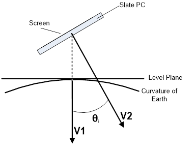

# 센서

센서를 사용하면 앱에서 디바이스와 디바이스를 둘러싼 실제 주변 환경 간의 관계를 알 수 있습니다. 센서는 장치의 방향과 움직임을 앱에 알려줄 수 있습니다. 이러한 센서는 장치의 동작을 사용하여 화면의 캐릭터 정렬, 조종석에서 장치를 조종 핸들로 사용하는 상황 시뮬레이트 등 고유한 형태의 입력을 제공하여 게임, 증강 현실 앱 또는 유틸리티 앱을 더 유용하고 대화형으로 만드는 데 도움이 될 수 있습니다.

일반적으로 앱에서 센서만 사용할지 또는 센서를 통해 추가적인 제어 메커니즘만 제공할지 여부를 처음부터 결정합니다. 예를 들어 장치를 가상 조종 핸들로 사용하는 드라이빙 게임의 경우 화면의 GUI를 통해 제어할 수 있습니다. 이렇게 하면 시스템에서 사용할 수 있는 센서에 관계없이 앱이 작동합니다. 반면, 구슬 이동 미로는 적절한 센서가 있는 시스템에서만 작동하도록 코딩할 수 있습니다. 전적으로 센서에만 의존할지 여부를 전략적으로 선택해야 합니다. 마우스/터치 제어 체계는 제어를 강화하는 대신 몰입도가 저하됩니다.

| 항목                                                       | 설명  |
|-------------------------------------------------------------|--------------|
| [센서 보정](calibrate-sensors.md)                   | 나침반, 경사계 방향 센서 같이 자력계를 기반으로 한 디바이스의 센서는 환경 요인으로 인해 보정이 필요해질 수 있습니다. [<strong>MagnetometerAccuracy</strong>](https://msdn.microsoft.com/library/windows/apps/Dn297552) 열거형은 디바이스에 보정이 필요한 경우 작업 과정을 결정하는 데 도움이 될 수 있습니다. |
| [센서 방향](sensor-orientation.md)                 | [<strong>OrientationSensor</strong>](https://msdn.microsoft.com/library/windows/apps/BR206371) 클래스의 센서 데이터는 참조 축에 의해 정의됩니다. 이러한 축은 디바이스의 가로 방향에서 정의되고 사용자가 돌릴 때 디바이스와 함께 회전합니다. |
| [가속도계 사용](use-the-accelerometer.md)           | 가속도계를 사용하여 사용자의 동작에 응답하는 방법을 알아봅니다. |
| [나침반 사용](use-the-compass.md)                       | 나침반을 사용하여 현재 전면부를 판단하는 방법을 알아봅니다. |
| [회전계 사용](use-the-gyrometer.md)                   | 회전계를 사용하여 사용자의 동작 변화를 탐지하는 방법을 알아봅니다. | 
| [경사계 사용](use-the-inclinometer.md)             | 경사계를 사용하여 피치, 롤 및 요를 판단하는 방법을 알아봅니다. |
| [광원 센서 사용](use-the-light-sensor.md)             | 주변 광원 센서를 사용하여 광원 변화를 탐지하는 방법을 알아봅니다. |
| [방향 센서 사용](use-the-orientation-sensor.md) | 방향 센서를 사용하여 디바이스 방향을 확인하는 방법을 알아봅니다.|

## 센서 일괄 처리

일부 센서는 일괄 처리 개념을 지원합니다. 이는 사용할 수 있는 개별 센서에 따라 다릅니다. 센서에서 일괄 처리를 구현하는 경우 지정된 시간 간격 동안 여러 데이터 요소를 수집한 후 해당 데이터 전부를 한 번에 전송합니다. 이는 센서가 읽기를 수행하자마자 발견한 결과를 보고하는 일반적인 동작과 다릅니다. 데이터를 수집한 후 전달하는 방식을 보여 주는 다음 다이어그램을 고려하세요(먼저 일반적인 전달, 그 후 일괄 처리 전달).

센서 일괄 처리의 기본 장점은 배터리 수명이 연장된다는 것입니다. 데이터가 즉시 전송되지 않으면 프로세서 전원이 절약되고 데이터를 즉시 처리해야 할 필요성이 방지됩니다. 시스템의 일부는 필요할 때까지 절전 상태를 유지할 수 있어 상당한 절전 효과가 발생합니다.

대기 시간을 조정하여 센서가 일괄 처리를 보내는 빈도에 영향을 줄 수 있습니다. 예를 들어 [**Accelerometer**](https://msdn.microsoft.com/library/windows/apps/BR225687) 센서에는 [**ReportLatency**](https://msdn.microsoft.com/library/windows/apps/windows.devices.sensors.accelerometer.reportlatency) 속성이 있습니다. 응용 프로그램에 대해 이 속성을 설정하면 센서가 지정된 시간 후에 데이터를 보냅니다. [**ReportInterval**](https://msdn.microsoft.com/library/windows/apps/windows.devices.sensors.accelerometer.reportinterval) 속성을 설정하여 지정된 대기 시간 동안 누적되는 데이터의 양을 제어할 수 있습니다.

대기 시간 설정과 관련하여 염두에 둬야 할 몇 가지 주의 사항이 있습니다. 첫 번째 주의 사항은 각 센서에 센서 자체를 기반으로 지원할 수 있는 [**MaxBatchSize**](https://msdn.microsoft.com/library/windows/apps/windows.devices.sensors.accelerometer.maxbatchsize.aspx)이(가) 있다는 점입니다. 이는 센서가 강제로 이벤트를 보내기 전에 캐시할 수 있는 이벤트 수입니다. **MaxBatchSize**에 [**ReportInterval**](https://msdn.microsoft.com/library/windows/apps/windows.devices.sensors.accelerometer.reportinterval)을 곱하면 최대 [**ReportLatency**](https://msdn.microsoft.com/library/windows/apps/windows.devices.sensors.accelerometer.reportlatency) 값이 결정됩니다. 이 값보다 높은 값을 지정하는 경우 데이터가 손실되지 않도록 최대 대기 시간이 사용됩니다. 또한 여러 응용 프로그램에서 각각 원하는 대기 시간을 설정할 수 있습니다. 모든 응용 프로그램의 요구 사항을 충족하기 위해 최단 대기 시간이 사용됩니다. 이러한 사실 때문에 응용 프로그램에 설정한 대기 시간이 관찰된 대기 시간과 일치하지 않을 수 있습니다.

센서에서 일괄 처리 보고를 사용하는 경우 [**GetCurrentReading**](https://msdn.microsoft.com/library/windows/apps/windows.devices.sensors.accelerometer.getcurrentreading)을(를) 호출하면 데이터의 현재 일괄 처리가 지워지고 새 대기 시간이 시작됩니다.

## 가속도계

[**Accelerometer**](https://msdn.microsoft.com/library/windows/apps/BR225687) 센서는 장치의 X, Y 및 Z축에서 G 힘 값을 측정하며 간단한 동작 기반 응용 프로그램에 유용합니다. G 힘 값에는 중력으로 인한 가속도가 포함됩니다. 테이블에서 디바이스의 [**SimpleOrientation**](https://msdn.microsoft.com/library/windows/apps/BR206399)이 **FaceUp**인 경우 가속도계는 Z축에서 -1G로 표시됩니다. 따라서 가속도계는 좌표 가속도만 측정하는 것이 아니라 속도의 변화율을 측정합니다. 가속도계를 사용하는 경우 중력의 중력 벡터와 동작의 선형 가속도 벡터를 구분해야 합니다. 움직이지 않는 장치의 경우 중력 벡터가 1로 정규화되어야 합니다.

다음 다이어그램에서 각 항목은 다음을 나타냅니다.

-   V1 = 벡터 1 = 중력으로 인한 힘
-   V2 = 벡터 2 = 장치 섀시의 Z축(화면 뒤쪽에서 가리킴)
-   Θi = 기울기 각도(경사) = 장치 섀시의 –Z축과 중력 벡터 사이의 각도

가속도계 센서를 사용할 수 있는 앱에는 장치를 기울이는 방향으로 화면의 구슬이 굴러가는 게임(중력 벡터)이 포함됩니다. 이러한 유형의 기능은 [**Inclinometer**](https://msdn.microsoft.com/library/windows/apps/BR225766)의 기능과 유사하며, 피치 및 롤의 조합을 사용하여 해당 센서로 수행할 수도 있습니다. 가속도계의 중력 벡터를 사용하면 장치 이동을 위해 수학적으로 쉽게 조작되는 벡터가 제공되므로 이 작업이 간소화됩니다. 또 다른 예로 사용자가 장치를 그을 때 채찍 소리를 내는 앱(선형 가속도 벡터)이 있습니다.

구현의 예는 [가속도계 샘플](https://github.com/Microsoft/Windows-universal-samples/tree/master/Samples/Accelerometer)을 참조하세요.

## 활동 센서

[**Activity**](https://msdn.microsoft.com/library/windows/apps/Dn785096) 센서는 센서에 연결된 장치의 현재 상태를 확인합니다. 이 센서는 디바이스를 휴대한 사용자가 뛰거나 걸을 때 이를 추적하는 피트니스 응용 프로그램에 자주 사용됩니다. 이 센서 API에서 감지할 수 있는 활동 목록은 [**ActivityType**](https://msdn.microsoft.com/library/windows/apps/Dn785128)을 참조하세요.

구현의 예는 [활동 센서 샘플](https://github.com/Microsoft/Windows-universal-samples/tree/master/Samples/ActivitySensor)을 참조하세요.

## 고도계

[**Altimeter**](https://msdn.microsoft.com/library/windows/apps/Dn858893) 센서는 센서의 고도를 나타내는 값을 반환합니다. 이를 통해 해수면으로부터의 고도 변화를 추적할 수 있습니다. 이 센서를 사용할 수 있는 앱의 한 가지 예로는 뛰는 동안의 고도 변화를 추적하여 소모된 칼로리를 계산하는 런닝 앱이 있습니다. 이 경우 이 센서 데이터를 [**Activity**](https://msdn.microsoft.com/library/windows/apps/Dn785096) 센서와 함께 사용하면 더 정확한 추적 정보를 얻을 수 있습니다.

구현의 예는 [고도계 샘플](https://github.com/Microsoft/Windows-universal-samples/tree/master/Samples/Altimeter)을 참조하세요.

## 기압계

[**Barometer**](https://msdn.microsoft.com/library/windows/apps/Dn872405) 센서는 응용 프로그램에 기압 판독값을 제공합니다. 날씨 응용 프로그램에서 이 정보를 사용하여 현재 대기압을 제공할 수 있습니다. 이 센서는 보다 자세한 정보를 제공하고 잠재적인 날씨 변화를 예측하는 데 사용될 수 있습니다.

구현의 예는 [기압계 샘플](https://github.com/Microsoft/Windows-universal-samples/tree/master/Samples/Barometer)을 참조하세요.

## 나침반

[**Compass**](https://msdn.microsoft.com/library/windows/apps/BR225705) 센서는 지구의 수평면을 기준으로 자북과 관련된 2D 침로를 반환합니다. 특정 디바이스 방향을 확인하거나 3D 공간의 항목을 나타내는 데 나침반 센서를 사용하면 안 됩니다. 지리적 특성으로 인해 침로에 자연 편차가 발생할 수 있으므로 일부 시스템은 [**HeadingMagneticNorth**](https://msdn.microsoft.com/library/windows/apps/windows.devices.sensors.compassreading.headingmagneticnorth.aspx) 및 [**HeadingTrueNorth**](https://msdn.microsoft.com/library/windows/apps/windows.devices.sensors.compassreading.headingtruenorth.aspx)를 둘 다 지원합니다. 앱에 적합한 값을 고려하지만, 모든 시스템에서 실제 북쪽 값을 보고하는 것은 아닙니다. 회전계 및 자력계(자기 강도 세기를 측정하는 장치) 센서는 해당 데이터를 결합하여 나침반 침로를 생성하므로 데이터 안정화 효과가 있습니다(자기장 세기는 전기 시스템 구성 요소로 인해 불안정함).

나침도를 표시하거나 지도를 탐색하려는 앱은 일반적으로 나침반 센서를 사용합니다.

구현의 예는 [나침반 샘플](https://github.com/Microsoft/Windows-universal-samples/tree/master/Samples/Compass)을 참조하세요.

## 회전계

[**Gyrometer**](https://msdn.microsoft.com/library/windows/apps/BR225718) 센서는 X, Y 및 Z축에서 각 속도를 측정합니다. 장치 방향은 관련이 없고 장치 회전 속도가 중요한 간단한 동작 기반 앱에서 유용합니다. 회전계에서 하나 이상의 축을 따라 데이터 노이즈나 일정한 바이어스가 발생할 수 있습니다. 회전계에서 바이어스가 발생하는지 확인한 다음 앱에서 적절하게 보정하기 위해 가속도계 쿼리를 통해 장치가 이동 중인지 여부를 확인해야 합니다.

회전계 센서를 사용할 수 있는 앱의 예로 장치의 빠른 회전을 기준으로 룰렛 휠을 돌리는 게임이 있습니다.

구현의 예는 [회전계 샘플](https://github.com/Microsoft/Windows-universal-samples/tree/master/Samples/Gyrometer)을 참조하세요.

## 경사계

[**Inclinometer**](https://msdn.microsoft.com/library/windows/apps/BR225766) 센서는 장치의 요, 피치 및 롤 값을 지정하며 장치의 공간 위치가 중요한 앱에 가장 적합합니다. 피치와 롤은 가속도계의 중력 벡터를 가져오고 회전계의 데이터를 통합하여 파생됩니다. 요는 자력계 및 회전계(나침반 침로와 유사함) 데이터에서 설정됩니다. 경사계는 쉽게 이해할 수 있는 방식으로 고급 방향 데이터를 제공합니다. 장치 방향이 필요하지만 센서 데이터를 조작할 필요가 없는 경우 경사계를 사용합니다.

장치의 방향에 맞게 보기를 변경하는 앱은 경사계 센서를 사용할 수 있습니다. 장치의 요, 피치 및 롤과 일치하는 비행기를 표시하는 앱도 경사계 값을 사용합니다.

예제 구현을, 경사 계 샘플을 참조 하세요. [https://github.com/Microsoft/Windows-universal-samples/tree/master/Samples/Inclinometer](https://github.com/Microsoft/Windows-universal-samples/tree/master/Samples/Inclinometer).

## 광원 센서

[**Light**](https://msdn.microsoft.com/library/windows/apps/BR225790) 센서는 센서 주변 광원을 확인할 수 있습니다. 이를 통해 앱에서 장치 주변의 광원 설정이 변경된 경우를 확인할 수 있습니다. 예를 들어 슬레이트 장치를 가진 사용자가 화창한 날 실내에서 야외로 나갈 수 있습니다. 스마트 응용 프로그램은 이 값을 사용하여 배경과 렌더링할 글꼴 간의 대비를 높일 수 있습니다. 따라서 밝은 야외 설정에서도 콘텐츠를 읽을 수 있습니다.

구현의 예는 [광원 센서 샘플](https://github.com/Microsoft/Windows-universal-samples/tree/master/Samples/LightSensor)을 참조하세요.

## 방향 센서

장치 방향은 사원수 및 회전 행렬을 통해 표시됩니다. [**OrientationSensor**](https://msdn.microsoft.com/library/windows/apps/BR206371)는 절대 침로를 기준으로 디바이스의 공간 위치를 결정할 때 높은 정밀도를 제공합니다. **OrientationSensor** 데이터는 가속도계, 회전계 및 자력계에서 파생됩니다. 따라서 경사계 및 나침반 센서는 둘 다 사원수 값에서 파생될 수 있습니다. 사원수 및 회전 행렬은 고급 수학적 조작에 적합하며 그래픽 프로그래밍에서 자주 사용됩니다. 대부분의 변형이 사원수 및 회전 행렬을 기반으로 하기 때문에 복잡한 조작을 사용하는 앱은 방향 센서를 사용하는 것이 좋습니다.

방향 센서는 장치의 뒤쪽이 가리키는 방향에 따라 환경에 오버레이를 그리는 고급 강화 현실 앱에서 자주 사용됩니다.

구현의 예는 [방향 센서 샘플](https://github.com/Microsoft/Windows-universal-samples/tree/master/Samples/OrientationSensor)을 참조하세요.

## 만보계

[**Pedometer**](https://msdn.microsoft.com/library/windows/apps/Dn878203) 센서는 연결된 장치를 휴대한 사용자의 도보 횟수를 추적합니다. 이 센서는 지정된 기간 동안의 도보 횟수를 추적하도록 구성되어 있습니다. 여러 피트니스 응용 프로그램에서 사용자가 여러 목표를 설정하고 이를 달성하도록 도와주기 위해 도보 횟수를 추적합니다. 그런 다음 이 정보를 수집하고 저장하여 시간별 진행률을 표시할 수 있습니다.

구현의 예는 [만보계 샘플](https://github.com/Microsoft/Windows-universal-samples/tree/master/Samples/Pedometer)을 참조하세요.

## 근접 센서

[**Proximity**](https://msdn.microsoft.com/library/windows/apps/Dn872427) 센서를 사용하여 개체가 센서에 의해 감지되는지 여부를 나타낼 수 있습니다. 근접 센서는 개체가 장치 범위 내에 있는지 여부뿐 아니라 감지된 개체까지의 거리도 확인할 수 있습니다. 이 센서를 사용할 수 있는 한 가지 예로는 사용자가 지정된 범위 내로 들어오면 절전 상태를 해제하려는 응용 프로그램을 들 수 있습니다. 장치는 근접 센서가 개체를 감지할 때까지 저전력 절전 상태로 있다가 활성 상태로 전환할 수 있습니다.

구현의 예는 [근접 센서 샘플](https://github.com/Microsoft/Windows-universal-samples/tree/master/Samples/ProximitySensor)을 참조하세요.

## 단순 방향

[**SimpleOrientationSensor**](https://msdn.microsoft.com/library/windows/apps/windows.devices.sensors.simpleorientationsensor.aspx)는 지정된 디바이스의 현재 사분면 방향이나 앞면 위로 또는 앞면 아래로 상태인지 감지합니다. 6개의 가능한 [**SimpleOrientation**](https://msdn.microsoft.com/library/windows/apps/BR206399) 상태(**NotRotated**, **Rotated90**, **Rotated180**, **Rotated270**, **FaceUp**, **FaceDown**)가 있습니다.

지면에 수평 또는 수직으로 디바이스를 잡고 있는지에 따라 표시를 변경하는 뷰어 앱은 SimpleOrientationSensor의 값을 사용하여 디바이스를 잡고 있는 방식을 확인합니다.

구현의 예는 [단순 방향 센서 샘플](https://github.com/Microsoft/Windows-universal-samples/tree/master/Samples/SimpleOrientationSensor)을 참조하세요.
