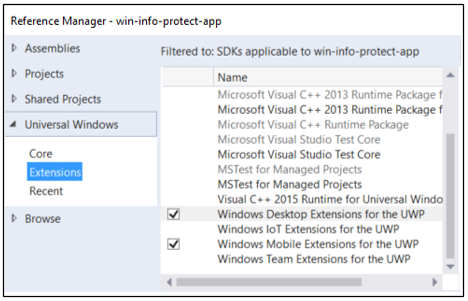

# <a name="windows-information-protection-wip-developer-guide"></a>WIP(Windows Information Protection) 개발자 가이드

*지원* 앱은 회사 데이터와 개인 데이터를 구분하고 관리자에 의해 정의된 WIP(Windows Information Protection) 정책에 따라 보호할 데이터를 지원합니다.

이 가이드에서는 앱을 빌드하는 방법을 살펴보겠습니다. 완료되면 정책 관리자는 앱을 신뢰하여 조직의 데이터를 사용할 수 있습니다. 또한 직원은 조직의 MDM(모바일 디바이스 관리)에서 등록을 취소하거나 조직에서 완전히 퇴사한 경우에도 자신의 개인 데이터가 디바이스에 그대로 유지되기를 바랍니다.

__참고__ 이 가이드는 UWP 앱을 인식하는 데 도움이 됩니다. C++ Windows 데스크톱 앱을 인식하려는 경우 [WIP(Windows Information Protection) 개발자 가이드(C++)](http://go.microsoft.com/fwlink/?LinkId=822192)를 참조하세요.

WIP 및 인식 앱에 대한 자세한 내용은 [WIP(Windows Information Protection)](wip-hub.md)를 참조하세요.

전체 샘플은 [여기](https://github.com/Microsoft/Windows-universal-samples/tree/master/Samples/EnterpriseDataProtection)에서 찾을 수 있습니다.

각 작업을 진행할 준비가 되었으면 시작하겠습니다.

## <a name="first-gather-what-you-need"></a>사전 준비 사항

다음 사항이 필요합니다.

* Windows10 버전 1607 이상이 실행되는 테스트 VM(가상 컴퓨터). 이 테스트 VM에 대해 앱을 디버그합니다.

* Windows10 버전 1607 이상을 실행하는 개발 컴퓨터. Visual Studio가 설치된 경우 테스트 VM이 될 수 있습니다.

## <a name="setup-your-development-environment"></a>개발 환경 설정

다음 작업을 수행합니다.

* [테스트 VM에 WIP 설정 개발자 도우미 설치](#install-assistant)

* [WIP 설정 개발자 도우미를 사용하여 보호 정책 작성](#create-protection-policy)

* [Visual Studio 프로젝트 설정](#setup-vs-project)

* [원격 디버깅 설정](#setup-remote-debugging)

* [코드 파일에 네임스페이스 추가](#add-namespaces)

<a id="install-assistant" />

### <a name="install-the-wip-setup-developer-assistant-onto-your-test-vm"></a>테스트 VM에 WIP 설정 개발자 도우미 설치

 이 도구를 사용하여 테스트 VM에서 Windows Information Protection 정책을 설정합니다.

 여기서 [WIP 설정 개발자 도우미](https://www.microsoft.com/store/p/wip-setup-developer-assistant/9nblggh526jf) 도구를 다운로드합니다.

<a id="create-protection-policy" />

### <a name="create-a-protection-policy"></a>보호 정책 만들기

WIP 설정 개발자 도우미의 각 섹션에 정보를 추가하여 정책을 정의합니다. 설정 옆에 있는 도움말 아이콘을 선택하여 사용 방법을 자세히 알아볼 수 있습니다.

이 도구를 사용하는 방법에 대한 일반적인 지침은 앱 다운로드 페이지에서 버전 참고 섹션을 참조하세요.

<a id="setup-vs-project" />

### <a name="setup-a-visual-studio-project"></a>Visual Studio 프로젝트 설정

1. 개발 컴퓨터에서 프로젝트를 엽니다.

2. UWP(유니버설 Windows 플랫폼)의 데스크톱 및 모바일 확장에 대한 참조를 추가합니다.

    

3. 패키지 매니페스트 파일에 이 기능을 추가합니다.

    ```xml
       <rescap:Capability Name="enterpriseDataPolicy"/>
    ```
   >*참고*: "rescap" 접두사는 *제한된 접근 권한 값*을 의미합니다. [특수 및 제한된 접근 권한 값](https://msdn.microsoft.com/windows/uwp/packaging/app-capability-declarations)을 참조하세요.

4. 패키지 매니페스트 파일에 이 네임스페이스를 추가합니다.

    ```xml
      xmlns:rescap="http://schemas.microsoft.com/appx/manifest/foundation/windows10/restrictedcapabilities"
    ```
5. 패키지 매니페스트 파일의 ``<ignorableNamespaces>`` 요소에 네임스페이스 접두사를 추가합니다.

    ```xml
        <IgnorableNamespaces="uap mp rescap">
    ```

    이렇게 하면 제한된 접근 권한 값을 지원하지 않는 Windows 운영 체제 버전에서 앱을 실행하는 경우 Windows가 ``enterpriseDataPolicy`` 접근 권한 값을 무시합니다.

<a id="setup-remote-debugging" />

### <a name="setup-remote-debugging"></a>원격 디버깅 설정

VM이 아닌 컴퓨터에서 앱을 개발하는 경우에만 테스트 VM에 Visual Studio 원격 도구를 설치합니다. 그런 다음 개발 컴퓨터에서 원격 디버거를 시작하고 테스트 VM에서 앱이 실행되는지 확인합니다.

[원격 PC 지침](https://msdn.microsoft.com/windows/uwp/debug-test-perf/deploying-and-debugging-uwp-apps#remote-pc-instructions)을 참조하세요.

<a id="add-namespaces" />

### <a name="add-these-namespaces-to-your-code-files"></a>코드 파일에 네임스페이스 추가

코드 파일의 위쪽에 다음 using 문을 추가합니다(이 가이드의 코드 조각에서 사용).

```csharp
using System;
using System.Collections.Generic;
using System.Linq;
using System.Text;
using System.Threading.Tasks;
using Windows.Security.EnterpriseData;
using Windows.Web.Http;
using Windows.Storage.Streams;
using Windows.ApplicationModel.DataTransfer;
using Windows.UI.Xaml.Controls;
using Windows.UI.Xaml;
using Windows.ApplicationModel.Activation;
using Windows.Web.Http.Filters;
using Windows.Storage;
using Windows.Data.Xml.Dom;
using Windows.Foundation.Metadata;
using Windows.Web.Http.Headers;
```

## <a name="determine-whether-to-use-wip-apis-in-your-app"></a>앱에서 WIP API를 사용할지 결정

앱을 실행하는 운영 체제가 WIP를 지원하며, 장치에서 WIP를 사용하도록 설정되어 있는지 확인하십시오.

```csharp
bool use_WIP_APIs = false;

if ((ApiInformation.IsApiContractPresent
    ("Windows.Security.EnterpriseData.EnterpriseDataContract", 3)
    && ProtectionPolicyManager.IsProtectionEnabled))
{
    use_WIP_APIs = true;
}
else
{
    use_WIP_APIs = false;
}
```
운영 체제가 WIP를 지원하지 않거나 사용하지 않도록 설정된 경우 WIP API를 호출하지 마십시오.

## <a name="read-enterprise-data"></a>엔터프라이즈 데이터 읽기

보호된 파일, 네트워크 끝점, 클립보드 데이터 및 공유 계약에서 수락한 데이터를 읽으려면 앱에서 액세스를 요청해야 합니다.

Windows Information Protection은 앱이 보호 정책의 허용된 목록에 있으면 앱에 권한을 제공합니다.

**이 섹션의 내용:**

* [파일에서 데이터 읽기](#read-file)
* [네트워크 끝점에서 데이터 읽기](#read-network)
* [클립보드에서 데이터 읽기](#read-clipboard)
* [공유 계약에서 데이터 읽기](#read-share)

<a id="read-file" />

### <a name="read-data-from-a-file"></a>파일에서 데이터 읽기

**1단계: 파일 핸들 가져오기**

```csharp
    Windows.Storage.StorageFolder storageFolder =
        Windows.Storage.ApplicationData.Current.LocalFolder;

    Windows.Storage.StorageFile file =
        await storageFolder.GetFileAsync(fileName);
```

**2단계: 앱에서 파일을 열 수 있는지 확인**

[FileProtectionManager.GetProtectionInfoAsync](https://msdn.microsoft.com/library/windows/apps/windows.security.enterprisedata.fileprotectionmanager.getprotectioninfoasync.aspx)를 호출하여 앱에서 파일을 열 수 있는지 확인합니다.

```csharp
FileProtectionInfo protectionInfo = await FileProtectionManager.GetProtectionInfoAsync(file);

if ((protectionInfo.Status != FileProtectionStatus.Protected &&
    protectionInfo.Status != FileProtectionStatus.Unprotected))
{
    return false;
}
else if (protectionInfo.Status == FileProtectionStatus.Revoked)
{
    // Code goes here to handle this situation. Perhaps, show UI
    // saying that the user's data has been revoked.
}
```

[FileProtectionStatus](https://msdn.microsoft.com/library/windows/apps/windows.security.enterprisedata.fileprotectionstatus.aspx) 값이 **Protected**이면 파일이 보호되어 있고, 앱이 정책의 허용된 목록에 있어 앱에서 파일을 열 수 있다는 것을 의미합니다.

[FileProtectionStatus](https://msdn.microsoft.com/library/windows/apps/windows.security.enterprisedata.fileprotectionstatus.aspx) 값이 **UnProtected**이면 파일이 보호되지 않아 앱이 정책의 허용된 목록에 없어도 읽을 수 있음을 의미합니다.

> **API** <br>
[FileProtectionManager.GetProtectionInfoAsync](https://msdn.microsoft.com/library/windows/apps/windows.security.enterprisedata.fileprotectionmanager.getprotectioninfoasync.aspx)<br>
[FileProtectionInfo](https://msdn.microsoft.com/library/windows/apps/windows.security.enterprisedata.fileprotectioninfo.aspx)<br>
[FileProtectionStatus](https://msdn.microsoft.com/library/windows/apps/windows.security.enterprisedata.fileprotectionstatus.aspx)<br>
[ProtectionPolicyManager.IsIdentityManaged](https://msdn.microsoft.com/library/windows/apps/windows.security.enterprisedata.protectionpolicymanager.isidentitymanaged.aspx)

**3단계: 스트림이나 버퍼로 파일 읽기**

*스트림으로 파일 읽기*

```csharp
var stream = await file.OpenAsync(Windows.Storage.FileAccessMode.ReadWrite);
```

*버퍼로 파일 읽기*

```csharp
var buffer = await Windows.Storage.FileIO.ReadBufferAsync(file);
```
<a id="read-network" />

### <a name="read-data-from-a-network-endpoint"></a>네트워크 끝점에서 데이터 읽기

엔터프라이즈 끝점에서 읽기 위해 보호된 스레드 컨텍스트를 만듭니다.

**1단계: 네트워크 끝점의 ID 가져오기**

```csharp
Uri resourceURI = new Uri("http://contoso.com/stockData.xml");

Windows.Networking.HostName hostName =
    new Windows.Networking.HostName(resourceURI.Host);

string identity = await ProtectionPolicyManager.
    GetPrimaryManagedIdentityForNetworkEndpointAsync(hostName);
```

끝점이 정책에 따라 관리되지 않으면 빈 문자열을 받게 됩니다.

> **API** <br>
[ProtectionPolicyManager.GetPrimaryManagedIdentityForNetworkEndpointAsync](https://msdn.microsoft.com/library/windows/apps/windows.security.enterprisedata.protectionpolicymanager.getprimarymanagedidentityfornetworkendpointasync.aspx)


**2단계: 보호된 스레드 컨텍스트 만들기**

끝점이 정책에 따라 관리되는 경우 보호된 스레드 컨텍스트를 만듭니다. 그러면 동일한 스레드에서 만든 네트워크 연결에 ID로 태그가 지정됩니다.

또한 해당 정책에 따라 관리되는 엔터프라이즈 네트워크 리소스에 액세스할 수 있습니다.

```csharp
if (!string.IsNullOrEmpty(identity))
{
    using (ThreadNetworkContext threadNetworkContext =
            ProtectionPolicyManager.CreateCurrentThreadNetworkContext(identity))
    {
        return await GetDataFromNetworkRedirectHelperMethod(resourceURI);
    }
}
else
{
    return await GetDataFromNetworkRedirectHelperMethod(resourceURI);
}
```
이 예제에서는 ``using`` 블록으로 소켓 호출을 묶습니다. 이렇게 하지 않으면 리소스를 검색한 후 스레드 컨텍스트를 닫아야 합니다. [ThreadNetworkContext.Close](https://msdn.microsoft.com/library/windows/apps/windows.security.enterprisedata.threadnetworkcontext.close.aspx)를 참조하세요.

자동으로 암호화되므로 보호된 해당 스레드에서 어떤 개인 파일도 만들지 마세요.

[**ProtectionPolicyManager.CreateCurrentThreadNetworkContext**](https://msdn.microsoft.com/library/windows/apps/windows.security.enterprisedata.protectionpolicymanager.createcurrentthreadnetworkcontext.aspx) 메서드는 끝점이 정책에 따라 관리되는지 여부와 상관없이 [**ThreadNetworkContext**](https://msdn.microsoft.com/library/windows/apps/windows.security.enterprisedata.threadnetworkcontext.aspx) 개체를 반환합니다. 앱이 개인 및 엔터프라이즈 리소스를 모두 처리하는 경우 모든 ID에 대한 [**ProtectionPolicyManager.CreateCurrentThreadNetworkContext**](https://msdn.microsoft.com/library/windows/apps/windows.security.enterprisedata.protectionpolicymanager.createcurrentthreadnetworkcontext.aspx)를 호출합니다.  리소스를 가져온 후 ThreadNetworkContext를 삭제하여 현재 스레드에서 모든 ID 태그를 지웁니다.

> **API** <br>
[ProtectionPolicyManager.GetForCurrentView](https://msdn.microsoft.com/library/windows/apps/windows.security.enterprisedata.protectionpolicymanager.getforcurrentview.aspx)<br>
[ProtectionPolicyManager.Identity](https://msdn.microsoft.com/library/windows/apps/windows.security.enterprisedata.protectionpolicymanager.aspx)<br>
[ProtectionPolicyManager.CreateCurrentThreadNetworkContext](https://msdn.microsoft.com/library/windows/apps/windows.security.enterprisedata.protectionpolicymanager.createcurrentthreadnetworkcontext.aspx)

**3단계: 버퍼로 리소스 읽기**

```csharp
private static async Task<IBuffer> GetDataFromNetworkHelperMethod(Uri resourceURI)
{
    HttpClient client;

    client = new HttpClient();

    try { return await client.GetBufferAsync(resourceURI); }

    catch (Exception) { return null; }
}
```

**(선택 사항) 보호된 스레드 컨텍스트를 만드는 대신 헤더 토큰 사용**

```csharp
public static async Task<IBuffer> GetDataFromNetworkbyUsingHeader(Uri resourceURI)
{
    HttpClient client;

    Windows.Networking.HostName hostName =
        new Windows.Networking.HostName(resourceURI.Host);

    string identity = await ProtectionPolicyManager.
        GetPrimaryManagedIdentityForNetworkEndpointAsync(hostName);

    if (!string.IsNullOrEmpty(identity))
    {
        client = new HttpClient();

        HttpRequestHeaderCollection headerCollection = client.DefaultRequestHeaders;

        headerCollection.Add("X-MS-Windows-HttpClient-EnterpriseId", identity);

        return await GetDataFromNetworkbyUsingHeaderHelperMethod(client, resourceURI);
    }
    else
    {
        client = new HttpClient();
        return await GetDataFromNetworkbyUsingHeaderHelperMethod(client, resourceURI);
    }

}

private static async Task<IBuffer> GetDataFromNetworkbyUsingHeaderHelperMethod(HttpClient client, Uri resourceURI)
{

    try { return await client.GetBufferAsync(resourceURI); }

    catch (Exception) { return null; }
}
```

**페이지 리디렉션 처리**

경우에 따라 웹 서버는 리소스의 현재 버전으로 트래픽을 리디렉션합니다.

이를 처리하려면 요청 응답 상태 값이 **OK**가 될 때까지 요청을 보냅니다.

그런 다음 해당 응답의 URI를 사용하여 끝점의 ID를 가져옵니다. 이 작업을 수행하는 한 가지 방법은 다음과 같습니다.

```csharp
private static async Task<IBuffer> GetDataFromNetworkRedirectHelperMethod(Uri resourceURI)
{
    HttpClient client = null;

    HttpBaseProtocolFilter filter = new HttpBaseProtocolFilter();
    filter.AllowAutoRedirect = false;

    client = new HttpClient(filter);

    HttpResponseMessage response = null;

        HttpRequestMessage message = new HttpRequestMessage(HttpMethod.Get, resourceURI);
        response = await client.SendRequestAsync(message);

    if (response.StatusCode == HttpStatusCode.MultipleChoices ||
        response.StatusCode == HttpStatusCode.MovedPermanently ||
        response.StatusCode == HttpStatusCode.Found ||
        response.StatusCode == HttpStatusCode.SeeOther ||
        response.StatusCode == HttpStatusCode.NotModified ||
        response.StatusCode == HttpStatusCode.UseProxy ||
        response.StatusCode == HttpStatusCode.TemporaryRedirect ||
        response.StatusCode == HttpStatusCode.PermanentRedirect)
    {
        message = new HttpRequestMessage(HttpMethod.Get, message.RequestUri);
        response = await client.SendRequestAsync(message);

        try { return await response.Content.ReadAsBufferAsync(); }

        catch (Exception) { return null; }
    }
    else
    {
        try { return await response.Content.ReadAsBufferAsync(); }

        catch (Exception) { return null; }
    }
}

```

> **API** <br>
[ProtectionPolicyManager.GetPrimaryManagedIdentityForNetworkEndpointAsync](https://msdn.microsoft.com/library/windows/apps/windows.security.enterprisedata.protectionpolicymanager.getprimarymanagedidentityfornetworkendpointasync.aspx)<br>
[ProtectionPolicyManager.CreateCurrentThreadNetworkContext](https://msdn.microsoft.com/library/windows/apps/windows.security.enterprisedata.protectionpolicymanager.createcurrentthreadnetworkcontext.aspx)<br>
[ProtectionPolicyManager.GetForCurrentView](https://msdn.microsoft.com/library/windows/apps/windows.security.enterprisedata.protectionpolicymanager.getforcurrentview.aspx)<br>
[ProtectionPolicyManager.Identity](https://msdn.microsoft.com/library/windows/apps/windows.security.enterprisedata.protectionpolicymanager.aspx)

<a id="read-clipboard" />

### <a name="read-data-from-the-clipboard"></a>클립보드에서 데이터 읽기

**클립보드에서 데이터를 사용할 수 있는 권한 얻기**

클립보드에서 데이터를 가져오려면 Windows에 권한을 요청합니다. 이를 위해 [**DataPackageView.RequestAccessAsync**](https://msdn.microsoft.com/library/windows/apps/dn706645.aspx)를 사용합니다.

```csharp
public static async Task PasteText(TextBox textBox)
{
    DataPackageView dataPackageView = Clipboard.GetContent();

    if (dataPackageView.Contains(StandardDataFormats.Text))
    {
        ProtectionPolicyEvaluationResult result = await dataPackageView.RequestAccessAsync();

        if (result == ProtectionPolicyEvaluationResult..Allowed)
        {
            string contentsOfClipboard = await dataPackageView.GetTextAsync();
            textBox.Text = contentsOfClipboard;
        }
    }
}
```

> **API** <br>
[DataPackageView.RequestAccessAsync](https://msdn.microsoft.com/library/windows/apps/dn706645.aspx)

**클립보드 데이터를 사용하는 기능 숨기기 또는 사용 안 함**

현재 보기에 클립보드의 데이터를 가져올 권한이 있는지 여부를 결정합니다.

권한이 없을 경우, 클립보드의 정보를 붙여넣거나 해당 콘텐츠를 미리 보는 컨트롤을 사용하지 않거나 숨길 수 있습니다.

```csharp
private bool IsClipboardAllowedAsync()
{
    ProtectionPolicyEvaluationResult protectionPolicyEvaluationResult = ProtectionPolicyEvaluationResult.Blocked;

    DataPackageView dataPackageView = Clipboard.GetContent();

    if (dataPackageView.Contains(StandardDataFormats.Text))

        protectionPolicyEvaluationResult =
            ProtectionPolicyManager.CheckAccess(dataPackageView.Properties.EnterpriseId,
                ProtectionPolicyManager.GetForCurrentView().Identity);

    return (protectionPolicyEvaluationResult == ProtectionPolicyEvaluationResult.Allowed |
        protectionPolicyEvaluationResult == ProtectionPolicyEvaluationResult.ConsentRequired);
}
```

> **API** <br>
[ProtectionPolicyEvaluationResult](https://msdn.microsoft.com/library/windows/apps/windows.security.enterprisedata.protectionpolicyevaluationresult.aspx)<br>
[ProtectionPolicyManager.GetForCurrentView](https://msdn.microsoft.com/library/windows/apps/windows.security.enterprisedata.protectionpolicymanager.getforcurrentview.aspx)<br>
[ProtectionPolicyManager.Identity](https://msdn.microsoft.com/library/windows/apps/windows.security.enterprisedata.protectionpolicymanager.aspx)

**사용자에게 동의 대화 상자 표시 안 함**

새 문서는 *개인* 또는 *엔터프라이즈* 문서가 아닙니다. 그저 새 문서입니다. 엔터프라이즈 데이터를 새 문서에 붙여넣으면 정책이 적용되고 동의하라는 대화 상자가 표시됩니다. 이 코드는 이러한 대화 상자가 표시되지 않도록 합니다. 이 작업은 데이터 보호와는 관련이 없습니다. 앱이 완전히 새로운 항목을 만드는 경우에 사용자에게 동의 확인 대화 상자가 표시되지 않도록 하는 작업입니다.

```csharp
private async void PasteText(bool isNewEmptyDocument)
{
    DataPackageView dataPackageView = Clipboard.GetContent();

    if (dataPackageView.Contains(StandardDataFormats.Text))
    {
        if (!string.IsNullOrEmpty(dataPackageView.Properties.EnterpriseId))
        {
            if (isNewEmptyDocument)
            {
                ProtectionPolicyManager.TryApplyProcessUIPolicy(dataPackageView.Properties.EnterpriseId);
                string contentsOfClipboard = contentsOfClipboard = await dataPackageView.GetTextAsync();
                // add this string to the new item or document here.          

            }
            else
            {
                ProtectionPolicyEvaluationResult result = await dataPackageView.RequestAccessAsync();

                if (result == ProtectionPolicyEvaluationResult.Allowed)
                {
                    string contentsOfClipboard = contentsOfClipboard = await dataPackageView.GetTextAsync();
                    // add this string to the new item or document here.
                }
            }
        }
    }
}
```

> **API** <br>
[DataPackageView.RequestAccessAsync](https://msdn.microsoft.com/library/windows/apps/dn706645.aspx)<br>
[ProtectionPolicyEvaluationResult](https://msdn.microsoft.com/library/windows/apps/windows.security.enterprisedata.protectionpolicyevaluationresult.aspx)<br>
[ProtectionPolicyManager.TryApplyProcessUIPolicy](https://msdn.microsoft.com/library/windows/apps/windows.security.enterprisedata.protectionpolicymanager.tryapplyprocessuipolicy.aspx)

<a id="read-share" />

### <a name="read-data-from-a-share-contract"></a>공유 계약에서 데이터 읽기

직원이 정보를 공유할 앱을 선택할 경우 앱은 해당 콘텐츠를 포함하는 새 항목을 엽니다.

앞에서 언급한 것처럼 새 항목은 *개인* 또는 *엔터프라이즈* 항목이 아닙니다. 그저 새 문서입니다. 코드가 항목에 엔터프라이즈 콘텐츠를 추가하면 Windows에서 정책을 적용하고 사용자에게 동의 확인 대화 상자가 표시됩니다. 이 코드는 이러한 대화 상자가 표시되지 않도록 합니다.

```csharp
protected override async void OnShareTargetActivated(ShareTargetActivatedEventArgs args)
{
    bool isNewEmptyDocument = true;
    string identity = "corp.microsoft.com";

    ShareOperation shareOperation = args.ShareOperation;
    if (shareOperation.Data.Contains(StandardDataFormats.Text))
    {
        if (!string.IsNullOrEmpty(shareOperation.Data.Properties.EnterpriseId))
        {
            if (isNewEmptyDocument)
                // If this is a new and empty document, and we're allowed to access
                // the data, then we can avoid popping the consent dialog
                ProtectionPolicyManager.TryApplyProcessUIPolicy(shareOperation.Data.Properties.EnterpriseId);
            else
            {
                // In this case, we can't optimize the workflow, so we just
                // request consent from the user in this case.

                ProtectionPolicyEvaluationResult protectionPolicyEvaluationResult = await shareOperation.Data.RequestAccessAsync();

                if (protectionPolicyEvaluationResult == ProtectionPolicyEvaluationResult.Allowed)
                {
                    string text = await shareOperation.Data.GetTextAsync();

                    // Do something with that text.
                }
            }
        }
        else
        {
            // If the data has no enterprise identity, then we already have access.
            string text = await shareOperation.Data.GetTextAsync();

            // Do something with that text.
        }

    }

}
```

> **API** <br>
[ProtectionPolicyManager.RequestAccessAsync](https://msdn.microsoft.com/library/windows/apps/dn705789.aspx)<br>
[ProtectionPolicyEvaluationResult](https://msdn.microsoft.com/library/windows/apps/windows.security.enterprisedata.protectionpolicyevaluationresult.aspx)<br>
[ProtectionPolicyManager.TryApplyProcessUIPolicy](https://msdn.microsoft.com/library/windows/apps/windows.security.enterprisedata.protectionpolicymanager.tryapplyprocessuipolicy.aspx)

## <a name="protect-enterprise-data"></a>엔터프라이즈 데이터 보호

앱을 떠나는 엔터프라이즈 데이터를 보호합니다. 앱을 떠나는 데이터가 페이지에 표시되면 공유 계약을 통해 또는 파일이나 네트워크 끝점에 데이터를 저장합니다.

**이 섹션의 내용:**

* [페이지에 표시되는 데이터 보호](#protect-pages)
* [백그라운드 프로세스로 파일에 데이터 보호](#protect-background)
* [파일의 일부 보호](#protect-part-file)
* [보호된 파일 일부 읽기](#read-protected)
* [폴더로 데이터 보호](#protect-folder)
* [네트워크 끝점으로 데이터 보호](#protect-network)
* [공유 계약을 통해 앱이 공유하는 데이터 보호](#protect-share)
* [다른 위치에 복사하는 파일 보호](#protect-other-location)
* [디바이스의 화면이 잠겨 있을 때 엔터프라이즈 데이터 보호](#protect-locked)

<a id="protect-pages" />

### <a name="protect-data-that-appears-in-pages"></a>페이지에 표시되는 데이터 보호

페이지에 데이터를 표시할 때 Windows에서 데이터 유형(개인 또는 엔터프라이즈)을 알 수 있도록 합니다. 이렇게 하려면 현재 앱 보기 또는 전체 앱 프로세스에 *태그*를 지정합니다.

보기 또는 프로세스에 태그를 지정하면 Windows가 정책을 적용합니다. 이렇게 하면 앱이 제어하지 않는 작업으로 인해 발생하는 데이터 누출을 방지할 수 있습니다. 예를 들어 컴퓨터에서 사용자는 CTRL-V를 사용하여 보기에서 엔터프라이즈 정보를 복사한 다음 해당 정보를 다른 앱에 붙여넣을 수 있습니다. Windows가 이러한 동작을 방지합니다. 또한 Windows는 공유 계약을 적용할 수 있습니다.

**현재 앱 보기에 태그 지정**

일부 보기는 엔터프라이즈 데이터를 사용하고 일부는 개인 데이터를 사용하는 여러 보기가 앱에 있을 경우 이 작업을 수행합니다.

```csharp

// tag as enterprise data. "identity" the string that contains the enterprise ID.
// You'd get that from a file, network endpoint, or clipboard data package.
ProtectionPolicyManager.GetForCurrentView().Identity = identity;

// tag as personal data.
ProtectionPolicyManager.GetForCurrentView().Identity = String.Empty;
```

> **API** <br>
[ProtectionPolicyManager.GetForCurrentView](https://msdn.microsoft.com/library/windows/apps/windows.security.enterprisedata.protectionpolicymanager.getforcurrentview.aspx)<br>
[ProtectionPolicyManager.Identity](https://msdn.microsoft.com/library/windows/apps/windows.security.enterprisedata.protectionpolicymanager.aspx)

**프로세스에 태그 지정**

앱의 모든 보기가 한 가지 유형의 데이터(개인 또는 엔터프라이즈)만으로 작동하는 경우 이 작업을 수행합니다.

이렇게 하면 태그가 지정된 보기를 독립적으로 관리할 필요가 없습니다.

```csharp


// tag as enterprise data. "identity" the string that contains the enterprise ID.
// You'd get that from a file, network endpoint, or clipboard data package.
bool result =
            ProtectionPolicyManager.TryApplyProcessUIPolicy(identity);

// tag as personal data.
ProtectionPolicyManager.ClearProcessUIPolicy();
```

> **API** <br>
[ProtectionPolicyManager.TryApplyProcessUIPolicy](https://msdn.microsoft.com/library/windows/apps/windows.security.enterprisedata.protectionpolicymanager.tryapplyprocessuipolicy.aspx)

<a id="protect-file" />

### <a name="protect-data-to-a-file"></a>파일에 데이터 보호

보호된 파일을 만들고 이 파일에 씁니다.

**1단계: 앱이 엔터프라이즈 파일을 만들 수 있는지 확인**

ID 문자열이 정책에 따라 관리되고 앱이 해당 정책의 허용 목록에 있는 경우 앱이 엔터프라이즈 파일을 만들 수 있습니다.

```csharp
  if (!ProtectionPolicyManager.IsIdentityManaged(identity)) return false;
```

> **API** <br>
[ProtectionPolicyManager.IsIdentityManaged](https://msdn.microsoft.com/library/windows/apps/windows.security.enterprisedata.protectionpolicymanager.isidentitymanaged.aspx)


**2단계: 파일을 만들고 ID로 보호**

```csharp
StorageFolder storageFolder = ApplicationData.Current.LocalFolder;
StorageFile storageFile = await storageFolder.CreateFileAsync("sample.txt",
    CreationCollisionOption.ReplaceExisting);

FileProtectionInfo fileProtectionInfo =
    await FileProtectionManager.ProtectAsync(storageFile, identity);
```

> **API** <br>
[FileProtectionManager.ProtectAsync](https://msdn.microsoft.com/library/windows/apps/windows.security.enterprisedata.fileprotectionmanager.protectasync.aspx)

**3단계: 파일에 해당 스트림 또는 버퍼 작성**

*스트림 작성*

```csharp
    if (fileProtectionInfo.Status == FileProtectionStatus.Protected)
    {
        var stream = await storageFile.OpenAsync(FileAccessMode.ReadWrite);

        using (var outputStream = stream.GetOutputStreamAt(0))
        {
            using (var dataWriter = new DataWriter(outputStream))
            {
                dataWriter.WriteString(enterpriseData);
            }
        }

    }
```

*버퍼 작성*

```csharp
     if (fileProtectionInfo.Status == FileProtectionStatus.Protected)
     {
         var buffer = Windows.Security.Cryptography.CryptographicBuffer.ConvertStringToBinary(
             enterpriseData, Windows.Security.Cryptography.BinaryStringEncoding.Utf8);

         await FileIO.WriteBufferAsync(storageFile, buffer);

      }
```

> **API** <br>
[FileProtectionInfo](https://msdn.microsoft.com/library/windows/apps/windows.security.enterprisedata.fileprotectioninfo.aspx)<br>
[FileProtectionStatus](https://msdn.microsoft.com/library/windows/apps/windows.security.enterprisedata.fileprotectionstatus.aspx)<br>

<a id="protect-background" />

### <a name="protect-data-to-a-file-as-a-background-process"></a>백그라운드 프로세스로 파일에 데이터 보호

이 코드는 디바이스 화면이 잠겨 있는 동안 실행할 수 있습니다. 관리자가 보안 "DPL(잠금 상태에서 데이터 보호)" 정책을 구성한 경우 Windows는 디바이스 메모리에서 보호된 리소스에 액세스하는 데 필요한 암호화 키를 제거합니다. 따라서 디바이스 분실 시에도 데이터 누출이 방지됩니다. 이 동일한 기능은 또한 핸들이 닫혀 있을 때 보호되는 파일과 연결된 키를 제거합니다.

파일을 만들 때 파일 핸들을 열어 두는 방법을 사용해야 합니다.  

**1단계: 엔터프라이즈 파일을 만들 수 있는지 확인**

사용 중인 ID가 정책에 따라 관리되고 앱이 해당 정책의 허용 목록에 있는 경우 엔터프라이즈 파일을 만들 수 있습니다.

```csharp
if (!ProtectionPolicyManager.IsIdentityManaged(identity)) return false;
```

> **API** <br>
[ProtectionPolicyManager.IsIdentityManaged](https://msdn.microsoft.com/library/windows/apps/windows.security.enterprisedata.protectionpolicymanager.isidentitymanaged.aspx)

**2단계: 파일을 만들고 ID로 보호**

[**FileProtectionManager.CreateProtectedAndOpenAsync**](https://msdn.microsoft.com/library/windows/apps/windows.security.enterprisedata.fileprotectionmanager.createprotectedandopenasync.aspx)는 보호된 파일을 만들고 그 파일에 작성하는 동안 파일 핸들을 열어 둡니다.

```csharp
StorageFolder storageFolder = ApplicationData.Current.LocalFolder;

ProtectedFileCreateResult protectedFileCreateResult =
    await FileProtectionManager.CreateProtectedAndOpenAsync(storageFolder,
        "sample.txt", identity, CreationCollisionOption.ReplaceExisting);
```

> **API** <br>
[FileProtectionManager.CreateProtectedAndOpenAsync](https://msdn.microsoft.com/library/windows/apps/windows.security.enterprisedata.fileprotectionmanager.createprotectedandopenasync.aspx)

**3단계: 파일에 스트림 또는 버퍼 작성**

이 예제에서는 파일에 스트림을 작성합니다.

```csharp
if (protectedFileCreateResult.ProtectionInfo.Status == FileProtectionStatus.Protected)
{
    IOutputStream outputStream =
        protectedFileCreateResult.Stream.GetOutputStreamAt(0);

    using (DataWriter writer = new DataWriter(outputStream))
    {
        writer.WriteString(enterpriseData);
        await writer.StoreAsync();
        await writer.FlushAsync();
    }

    outputStream.Dispose();
}
else if (protectedFileCreateResult.ProtectionInfo.Status == FileProtectionStatus.AccessSuspended)
{
    // Perform any special processing for the access suspended case.
}

```

> **API** <br>
[ProtectedFileCreateResult.ProtectionInfo](https://msdn.microsoft.com/library/windows/apps/windows.security.enterprisedata.protectedfilecreateresult.protectioninfo.aspx)<br>
[FileProtectionStatus](https://msdn.microsoft.com/library/windows/apps/windows.security.enterprisedata.fileprotectionstatus.aspx)<br>
[ProtectedFileCreateResult.Stream](https://msdn.microsoft.com/library/windows/apps/windows.security.enterprisedata.protectedfilecreateresult.stream.aspx)<br>

<a id="protect-part-file" />

### <a name="protect-part-of-a-file"></a>파일의 일부 보호

대부분의 경우 엔터프라이즈 및 개인 데이터를 별도로 저장하는 것이 더 깔끔하지만 원하는 경우 동일한 파일에 저장할 수 있습니다. 예를 들어 Microsoft Outlook은 단일 보관 파일에 개인 메일과 함께 엔터프라이즈 메일을 저장할 수 있습니다.

엔터프라이즈 데이터를 암호화하지만 전체 파일을 암호화하지는 않습니다. 이렇게 하면 사용자가 MDM에서 등록을 취소하거나 해당 엔터프라이즈 데이터 액세스 권한이 해지되더라도 계속해서 해당 파일을 사용할 수 있습니다. 또한 앱은 파일을 메모리로 다시 읽을 때 보호해야 할 데이터를 알 수 있도록 암호화하는 데이터를 계속 추적해야 합니다.

**1단계: 암호화된 스트림 또는 버퍼에 엔터프라이즈 데이터 추가**

```csharp
string enterpriseDataString = "<employees><employee><name>Bill</name><social>xxx-xxx-xxxx</social></employee></employees>";

var enterpriseData= Windows.Security.Cryptography.CryptographicBuffer.ConvertStringToBinary(
        enterpriseDataString, Windows.Security.Cryptography.BinaryStringEncoding.Utf8);

BufferProtectUnprotectResult result =
   await DataProtectionManager.ProtectAsync(enterpriseData, identity);

enterpriseData= result.Buffer;
```

> **API** <br>
[DataProtectionManager.ProtectAsync](https://msdn.microsoft.com/library/windows/apps/windows.security.enterprisedata.dataprotectionmanager.protectasync.aspx)<br>
[BufferProtectUnprotectResult.buffer](https://msdn.microsoft.com/library/windows/apps/windows.security.enterprisedata.bufferprotectunprotectresult.buffer.aspx)


**2단계: 암호화되지 않은 스트림 또는 버퍼에 개인 데이터 추가**

```csharp
string personalDataString = "<recipies><recipe><name>BillsCupCakes</name><cooktime>30</cooktime></recipe></recipies>";

var personalData = Windows.Security.Cryptography.CryptographicBuffer.ConvertStringToBinary(
    personalDataString, Windows.Security.Cryptography.BinaryStringEncoding.Utf8);
```

**3단계: 파일에 스트림 또는 버퍼 모두 작성**

```csharp
StorageFolder storageFolder = ApplicationData.Current.LocalFolder;

StorageFile storageFile = await storageFolder.CreateFileAsync("data.xml",
    CreationCollisionOption.ReplaceExisting);

 // Write both buffers to the file and save the file.

var stream = await storageFile.OpenAsync(FileAccessMode.ReadWrite);

using (var outputStream = stream.GetOutputStreamAt(0))
{
    using (var dataWriter = new DataWriter(outputStream))
    {
        dataWriter.WriteBuffer(enterpriseData);
        dataWriter.WriteBuffer(personalData);

        await dataWriter.StoreAsync();
        await outputStream.FlushAsync();
    }
}
```

**4단계: 파일에서 엔터프라이즈 데이터의 위치 추적**

엔터프라이즈 데이터를 소유한 해당 파일의 데이터를 추적하는 것은 앱의 책임입니다.

파일과 연결된 속성, 데이터베이스 또는 파일의 일부 머리글 텍스트에 해당 정보를 저장할 수 있습니다.

이 예제에서는 별도의 XML 파일에 해당 정보를 저장합니다.

```csharp
StorageFile metaDataFile = await storageFolder.CreateFileAsync("metadata.xml",
   CreationCollisionOption.ReplaceExisting);

await Windows.Storage.FileIO.WriteTextAsync
    (metaDataFile, "<EnterpriseDataMarker start='0' end='" + enterpriseData.Length.ToString() +
    "'></EnterpriseDataMarker>");
```
<a id="read-protected" />

### <a name="read-the-protected-part-of-a-file"></a>보호된 파일 일부 읽기

해당 파일에서 엔터프라이즈 데이터를 읽는 방법은 다음과 같습니다.

**1단계: 파일에서 엔터프라이즈 데이터의 위치 가져오기**

```csharp
Windows.Storage.StorageFolder storageFolder =
    Windows.Storage.ApplicationData.Current.LocalFolder;

 Windows.Storage.StorageFile metaDataFile =
   await storageFolder.GetFileAsync("metadata.xml");

string metaData = await Windows.Storage.FileIO.ReadTextAsync(metaDataFile);

XmlDocument doc = new XmlDocument();

doc.LoadXml(metaData);

uint startPosition =
    Convert.ToUInt16((doc.FirstChild.Attributes.GetNamedItem("start")).InnerText);

uint endPosition =
    Convert.ToUInt16((doc.FirstChild.Attributes.GetNamedItem("end")).InnerText);
```

**2단계: 데이터 파일을 열고 보호되지 않는지 확인**

```csharp
Windows.Storage.StorageFile dataFile =
    await storageFolder.GetFileAsync("data.xml");

FileProtectionInfo protectionInfo =
    await FileProtectionManager.GetProtectionInfoAsync(dataFile);

if (protectionInfo.Status == FileProtectionStatus.Protected)
    return false;
```

> **API** <br>
[FileProtectionManager.GetProtectionInfoAsync](https://msdn.microsoft.com/library/windows/apps/windows.security.enterprisedata.fileprotectionmanager.getprotectioninfoasync.aspx)<br>
[FileProtectionInfo](https://msdn.microsoft.com/library/windows/apps/windows.security.enterprisedata.fileprotectioninfo.aspx)<br>
[FileProtectionStatus](https://msdn.microsoft.com/library/windows/apps/windows.security.enterprisedata.fileprotectionstatus.aspx)<br>

**3단계: 파일에서 엔터프라이즈 데이터 읽기**

```csharp
var stream = await dataFile.OpenAsync(Windows.Storage.FileAccessMode.ReadWrite);

stream.Seek(startPosition);

Windows.Storage.Streams.Buffer tempBuffer = new Windows.Storage.Streams.Buffer(50000);

IBuffer enterpriseData = await stream.ReadAsync(tempBuffer, endPosition, InputStreamOptions.None);
```

**4단계: 엔터프라이즈 데이터를 포함하는 버퍼 암호 해독**

```csharp
DataProtectionInfo dataProtectionInfo =
   await DataProtectionManager.GetProtectionInfoAsync(enterpriseData);

if (dataProtectionInfo.Status == DataProtectionStatus.Protected)
{
    BufferProtectUnprotectResult result = await DataProtectionManager.UnprotectAsync(enterpriseData);
    enterpriseData = result.Buffer;
}
else if (dataProtectionInfo.Status == DataProtectionStatus.Revoked)
{
    // Code goes here to handle this situation. Perhaps, show UI
    // saying that the user's data has been revoked.
}

```

> **API** <br>
[DataProtectionInfo](https://msdn.microsoft.com/library/windows/apps/windows.security.enterprisedata.dataprotectioninfo.aspx)<br>
[DataProtectionManager.GetProtectionInfoAsync](https://msdn.microsoft.com/library/windows/apps/windows.security.enterprisedata.dataprotectionmanager.getstreamprotectioninfoasync.aspx)<br>

<a id="protect-folder" />

### <a name="protect-data-to-a-folder"></a>폴더로 데이터 보호

폴더를 만들고 보호할 수 있습니다. 이렇게 하면 해당 폴더에 추가하는 항목이 자동으로 보호됩니다.

```csharp
private async Task<bool> CreateANewFolderAndProtectItAsync(string folderName, string identity)
{
    if (!ProtectionPolicyManager.IsIdentityManaged(identity)) return false;

    StorageFolder storageFolder = ApplicationData.Current.LocalFolder;
    StorageFolder newStorageFolder =
        await storageFolder.CreateFolderAsync(folderName);

    FileProtectionInfo fileProtectionInfo =
        await FileProtectionManager.ProtectAsync(newStorageFolder, identity);

    if (fileProtectionInfo.Status != FileProtectionStatus.Protected)
    {
        // Protection failed.
        return false;
    }
    return true;
}
```

보호하기 전에 폴더는 비어 있어야 합니다. 이미 항목이 포함된 폴더는 보호할 수 없습니다.

> **API** <br>
[ProtectionPolicyManager.IsIdentityManaged](https://msdn.microsoft.com/library/windows/apps/windows.security.enterprisedata.protectionpolicymanager.isidentitymanaged.aspx)<br>
[FileProtectionManager.ProtectAsync](https://msdn.microsoft.com/library/windows/apps/windows.security.enterprisedata.fileprotectionmanager.protectasync.aspx)<br>
[FileProtectionInfo.Identity](https://msdn.microsoft.com/library/windows/apps/windows.security.enterprisedata.fileprotectioninfo.identity.aspx)<br>
[FileProtectionInfo.Status](https://msdn.microsoft.com/library/windows/apps/windows.security.enterprisedata.fileprotectioninfo.status.aspx)

<a id="protect-network" />

### <a name="protect-data-to-a-network-end-point"></a>네트워크 끝점으로 데이터 보호

보호된 스레드 컨텍스트를 만들어 엔터프라이즈 끝점으로 데이터를 보냅니다.  

**1단계: 네트워크 끝점의 ID 가져오기**

```csharp
Windows.Networking.HostName hostName =
    new Windows.Networking.HostName(resourceURI.Host);

string identity = await ProtectionPolicyManager.
    GetPrimaryManagedIdentityForNetworkEndpointAsync(hostName);
```

> **API** <br>
[ProtectionPolicyManager.GetPrimaryManagedIdentityForNetworkEndpointAsync](https://msdn.microsoft.com/library/windows/apps/windows.security.enterprisedata.protectionpolicymanager.getprimarymanagedidentityfornetworkendpointasync.aspx)

**2단계: 보호된 스레드 컨텍스트 만들기 및 네트워크 끝점으로 데이터 보내기**

```csharp
HttpClient client = null;

if (!string.IsNullOrEmpty(m_EnterpriseId))
{
    ProtectionPolicyManager.GetForCurrentView().Identity = identity;

    using (ThreadNetworkContext threadNetworkContext =
            ProtectionPolicyManager.CreateCurrentThreadNetworkContext(identity))
    {
        client = new HttpClient();
        HttpRequestMessage message = new HttpRequestMessage(HttpMethod.Put, resourceURI);
        message.Content = new HttpStreamContent(dataToWrite);

        HttpResponseMessage response = await client.SendRequestAsync(message);

        if (response.StatusCode == HttpStatusCode.Ok)
            return true;
        else
            return false;
    }
}
else
{
    return false;
}
```

> **API** <br>
[ProtectionPolicyManager.GetForCurrentView](https://msdn.microsoft.com/library/windows/apps/windows.security.enterprisedata.protectionpolicymanager.getforcurrentview.aspx)<br>
[ProtectionPolicyManager.Identity](https://msdn.microsoft.com/library/windows/apps/windows.security.enterprisedata.protectionpolicymanager.aspx)<br>
[ProtectionPolicyManager.CreateCurrentThreadNetworkContext](https://msdn.microsoft.com/library/windows/apps/windows.security.enterprisedata.protectionpolicymanager.createcurrentthreadnetworkcontext.aspx)

<a id="protect-share" />

### <a name="protect-data-that-your-app-shares-through-a-share-contract"></a>공유 계약을 통해 앱이 공유하는 데이터 보호

사용자가 앱에서 콘텐츠를 공유하도록 하려면 공유 계약을 구현하고 [**DataTransferManager.DataRequested**](https://msdn.microsoft.com/library/windows/apps/windows.applicationmodel.datatransfer.datatransfermanager.datarequested) 이벤트를 처리해야 합니다.

이벤트 처리기에서 데이터 패키지의 엔터프라이즈 ID 컨텍스트를 설정합니다.

```csharp
private void OnShareSourceOperation(object sender, RoutedEventArgs e)
{
    // Register the current page as a share source (or you could do this earlier in your app).
    DataTransferManager.GetForCurrentView().DataRequested += OnDataRequested;
    DataTransferManager.ShowShareUI();
}

private void OnDataRequested(DataTransferManager sender, DataRequestedEventArgs args)
{
    if (!string.IsNullOrEmpty(this.shareSourceContent))
    {
        var protectionPolicyManager = ProtectionPolicyManager.GetForCurrentView();
        DataPackage requestData = args.Request.Data;
        requestData.Properties.Title = this.shareSourceTitle;
        requestData.Properties.EnterpriseId = protectionPolicyManager.Identity;
        requestData.SetText(this.shareSourceContent);
    }
}
```

> **API** <br>
[ProtectionPolicyManager.GetForCurrentView](https://msdn.microsoft.com/library/windows/apps/windows.security.enterprisedata.protectionpolicymanager.getforcurrentview.aspx)<br>
[ProtectionPolicyManager.Identity](https://msdn.microsoft.com/library/windows/apps/windows.security.enterprisedata.protectionpolicymanager.aspx)

<a id="protect-other-location" />

### <a name="protect-files-that-you-copy-to-another-location"></a>다른 위치에 복사하는 파일 보호

```csharp
private async void CopyProtectionFromOneFileToAnother
    (StorageFile sourceStorageFile, StorageFile targetStorageFile)
{
    bool copyResult = await
        FileProtectionManager.CopyProtectionAsync(sourceStorageFile, targetStorageFile);

    if (!copyResult)
    {
        // Copying failed. To diagnose, you could check the file's status.
        // (call FileProtectionManager.GetProtectionInfoAsync and
        // check FileProtectionInfo.Status).
    }
}
```

> **API** <br>
[FileProtectionManager.CopyProtectionAsync](https://msdn.microsoft.com/library/windows/apps/windows.security.enterprisedata.fileprotectionmanager.copyprotectionasync.aspx)<br>

<a id="protect-locked" />

### <a name="protect-enterprise-data-when-the-screen-of-the-device-is-locked"></a>디바이스의 화면이 잠겨 있을 때 엔터프라이즈 데이터 보호

디바이스가 잠겨 있을 때 메모리의 모든 중요한 데이터를 제거합니다. 사용자가 디바이스를 잠금 해제하면 앱은 다시 데이터를 안전하게 추가할 수 있습니다.

앱에서 화면이 잠겨 있는 경우를 알 수 있도록 [**ProtectionPolicyManager.ProtectedAccessSuspending**](https://msdn.microsoft.com/library/windows/apps/windows.security.enterprisedata.protectionpolicymanager.protectedaccesssuspending.aspx) 이벤트를 처리합니다. 이 이벤트는 관리자가 잠금 정책에 따라 보안 데이터 보호를 구성하는 경우에만 발생합니다. Windows는 디바이스에 프로비전된 데이터 보호 키를 일시적으로 제거합니다. Windows가 이러한 키를 제거함으로써, 디바이스가 잠겨 있고 해당 소유자의 소유가 아닐 수 있는 동안 암호화된 데이터에 무단으로 액세스할 수 없도록 합니다.  

앱에서 화면이 잠금 해제된 경우를 알 수 있도록 [**ProtectionPolicyManager.ProtectedAccessResumed**](https://msdn.microsoft.com/library/windows/apps/windows.security.enterprisedata.protectionpolicymanager.protectedaccessresumed.aspx) 이벤트를 처리합니다. 이 이벤트는 관리자가 잠금 정책에 따라 보안 데이터 보호를 구성하는지 여부에 관계없이 발생합니다.

#### <a name="remove-sensitive-data-in-memory-when-the-screen-is-locked"></a>화면이 잠겨 있을 때 메모리에서 중요한 데이터 제거

시스템이 메모리에 중요한 데이터를 캐시하지 않도록 하기 위해 중요한 데이터를 보호하고 앱이 보호된 파일에서 연 모든 파일 스트림을 닫습니다.

이 예제에서는 textblock의 콘텐츠를 암호화된 버퍼에 저장하고 해당 textblock에서 콘텐츠를 제거 합니다.

```csharp
private async void ProtectionPolicyManager_ProtectedAccessSuspending(object sender, ProtectedAccessSuspendingEventArgs e)
{
    Deferral deferral = e.GetDeferral();

    if (ProtectionPolicyManager.GetForCurrentView().Identity != String.Empty)
    {
        IBuffer documentBodyBuffer = CryptographicBuffer.ConvertStringToBinary
           (documentTextBlock.Text, BinaryStringEncoding.Utf8);

        BufferProtectUnprotectResult result = await DataProtectionManager.ProtectAsync
            (documentBodyBuffer, ProtectionPolicyManager.GetForCurrentView().Identity);

        if (result.ProtectionInfo.Status == DataProtectionStatus.Protected)
        {
            this.protectedDocumentBuffer = result.Buffer;
            documentTextBlock.Text = null;
        }
    }

    // Close any open streams that you are actively working with
    // to make sure that we have no unprotected content in memory.

    // Optionally, code goes here to use e.Deadline to determine whether we have more
    // than 15 seconds left before the suspension deadline. If we do then process any
    // messages queued up for sending while we are still able to access them.

    deferral.Complete();
}
```

> **API** <br>
[ProtectionPolicyManager.ProtectedAccessSuspending](https://msdn.microsoft.com/library/windows/apps/windows.security.enterprisedata.protectionpolicymanager.protectedaccesssuspending.aspx)<br>
[ProtectionPolicyManager.GetForCurrentView](https://msdn.microsoft.com/library/windows/apps/windows.security.enterprisedata.protectionpolicymanager.getforcurrentview.aspx)<br>
[ProtectionPolicyManager.Identity](https://msdn.microsoft.com/library/windows/apps/windows.security.enterprisedata.protectionpolicymanager.aspx)</br>
[DataProtectionManager.ProtectAsync](https://msdn.microsoft.com/library/windows/apps/windows.security.enterprisedata.dataprotectionmanager.protectasync.aspx)<br>
[BufferProtectUnprotectResult.buffer](https://msdn.microsoft.com/library/windows/apps/windows.security.enterprisedata.bufferprotectunprotectresult.buffer.aspx)<br>
[ProtectedAccessSuspendingEventArgs.GetDeferral](https://msdn.microsoft.com/library/windows/apps/windows.security.enterprisedata.protectedaccesssuspendingeventargs.getdeferral.aspx)<br>
[Deferral.Complete](https://msdn.microsoft.com/library/windows/apps/windows.foundation.deferral.complete.aspx)<br>

#### <a name="add-back-sensitive-data-when-the-device-is-unlocked"></a>디바이스 잠금이 해제될 때 중요한 데이터 다시 추가

디바이스 잠금이 해제되고 디바이스에서 다시 키를 사용할 수 있는 경우 [**ProtectionPolicyManager.ProtectedAccessResumed**](https://msdn.microsoft.com/library/windows/apps/windows.security.enterprisedata.protectionpolicymanager.protectedaccessresumed.aspx)가 발생합니다.

관리자가 잠금 정책에 따라 보안 데이터 보호를 구성하지 않은 경우 [**ProtectedAccessResumedEventArgs.Identities**](https://msdn.microsoft.com/library/windows/apps/windows.security.enterprisedata.protectedaccessresumedeventargs.identities.aspx)는 빈 컬렉션입니다.

이 예제에서는 이전 예제의 반대로 작업을 수행합니다. 버퍼의 암호를 해독하고 해당 버퍼의 정보를 textbox에 다시 추가한 다음 버퍼를 삭제합니다.

```csharp
private async void ProtectionPolicyManager_ProtectedAccessResumed(object sender, ProtectedAccessResumedEventArgs e)
{
    if (ProtectionPolicyManager.GetForCurrentView().Identity != String.Empty)
    {
        BufferProtectUnprotectResult result = await DataProtectionManager.UnprotectAsync
            (this.protectedDocumentBuffer);

        if (result.ProtectionInfo.Status == DataProtectionStatus.Unprotected)
        {
            // Restore the unprotected version.
            documentTextBlock.Text = CryptographicBuffer.ConvertBinaryToString
                (BinaryStringEncoding.Utf8, result.Buffer);
            this.protectedDocumentBuffer = null;
        }
    }

}
```

> **API** <br>
[ProtectionPolicyManager.ProtectedAccessResumed](https://msdn.microsoft.com/library/windows/apps/windows.security.enterprisedata.protectionpolicymanager.protectedaccessresumed.aspx)<br>
[ProtectionPolicyManager.GetForCurrentView](https://msdn.microsoft.com/library/windows/apps/windows.security.enterprisedata.protectionpolicymanager.getforcurrentview.aspx)<br>
[ProtectionPolicyManager.Identity](https://msdn.microsoft.com/library/windows/apps/windows.security.enterprisedata.protectionpolicymanager.aspx)</br>
[DataProtectionManager.UnprotectAsync](https://msdn.microsoft.com/library/windows/apps/windows.security.enterprisedata.dataprotectionmanager.unprotectasync.aspx)<br>
[BufferProtectUnprotectResult.Status](https://msdn.microsoft.com/library/windows/apps/windows.security.enterprisedata.bufferprotectunprotectresult.aspx)<br>

## <a name="handle-enterprise-data-when-protected-content-is-revoked"></a>보호된 콘텐츠 해지 시 엔터프라이즈 데이터 처리

디바이스가 MDM에서 등록이 취소되거나 정책 관리자가 엔터프라이즈 데이터에 대한 액세스를 명시적으로 해지하는 경우에 앱이 알림을 받도록 하려면 [**ProtectionPolicyManager_ProtectedContentRevoked**](https://msdn.microsoft.com/library/windows/apps/windows.security.enterprisedata.protectionpolicymanager.protectedcontentrevoked.aspx) 이벤트를 처리합니다.

이 예제에서는 메일 앱의 엔터프라이즈 사서함 데이터가 해지되었는지 확인합니다.

```csharp
private string mailIdentity = "contoso.com";

void MailAppSetup()
{
    ProtectionPolicyManager.ProtectedContentRevoked += ProtectionPolicyManager_ProtectedContentRevoked;
    // Code goes here to set up mailbox for 'mailIdentity'.
}

private void ProtectionPolicyManager_ProtectedContentRevoked(object sender, ProtectedContentRevokedEventArgs e)
{
    if (!new System.Collections.Generic.List<string>(e.Identities).Contains
        (this.mailIdentity))
    {
        // This event is not for our identity.
        return;
    }

    // Code goes here to delete any metadata associated with 'mailIdentity'.
}
```

> **API** <br>
[ProtectionPolicyManager_ProtectedContentRevoked](https://msdn.microsoft.com/library/windows/apps/windows.security.enterprisedata.protectionpolicymanager.protectedcontentrevoked.aspx)<br>

## <a name="related-topics"></a>관련 항목

[WIP(Windows Information Protection) 샘플](http://go.microsoft.com/fwlink/p/?LinkId=620031&clcid=0x409)
