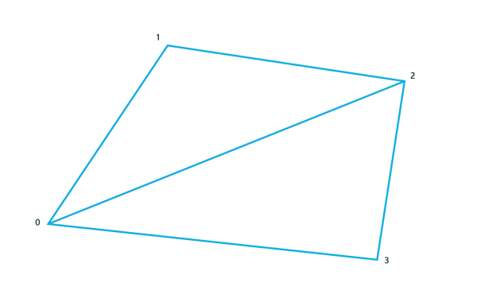

# <a name="create-and-display-a-basic-mesh"></a>기본 메시 만들기 및 표시


3-D UWP(유니버설 Windows 플랫폼) 게임에서는 대개 다각형을 사용하여 게임의 개체와 표면을 나타냅니다. 이러한 다각형 개체와 표면의 구조로 이루어진 꼭짓점의 목록을 메시라고 합니다. 여기서는 큐브 개체에 대한 기본 메시를 만들고 이를 렌더링 및 표시할 수 있도록 셰이더 파이프라인에 제공해 보겠습니다.

> **중요 한**  형식 (예: directx:: Xmfloat3 and directx:: Xmfloat4x4) 및 인라인 메서드에서는 DirectXMath.h에 선언 된 여기 포함 된 예제 코드를 사용 합니다. 이 코드를 잘라서 붙여넣을 경우 프로젝트에 &lt;DirectXMath.h&gt;를 포함하세요.

 

## <a name="what-you-need-to-know"></a>알아야 할 사항


### <a name="technologies"></a>기술

-   [Direct3D](https://msdn.microsoft.com/library/windows/desktop/hh769064)

### <a name="prerequisites"></a>필수 조건

-   선형 대수 및 3D 좌표계에 대한 기본 지식
-   Visual Studio 2015 또는 이후 Direct3D 템플릿

## <a name="instructions"></a>지침

다음 단계에서는 기본 메시 큐브를 만드는 방법을 보여 줍니다. 


이러한 개념에 대해 말로 하는 설명을 듣고 싶으면 다음 비디오를 시청하세요.
</br>
</br>
<iframe src="https://channel9.msdn.com/Series/Introduction-to-C-and-DirectX-Game-Development/03/player#time=7m39s:paused" width="600" height="338" allowFullScreen frameBorder="0"></iframe>


### <a name="step-1-construct-the-mesh-for-the-model"></a>1단계: 모델에 대한 메시 구성

대부분의 게임에서 게임 개체의 메시는 특정 꼭짓점 데이터가 포함된 파일에서 로드됩니다. 이러한 꼭짓점의 순서는 앱에 따라 다르지만 대개 줄 모양 또는 부채꼴로 직렬화됩니다. 꼭짓점 데이터는 어떤 소프트웨어 소스에서나 가져올 수 있으며 직접 만들 수도 있습니다. 이 데이터를 꼭짓점 셰이더가 효과적으로 처리할 수 있는 방식으로 해석하는 능력은 게임에 달려 있습니다.

이 예제에서는 간단한 큐브용 메시를 사용합니다. 큐브는 파이프라인의 이 단계에서 다른 개체 메시와 마찬가지로 자체 좌표계를 사용하여 나타냅니다. 꼭짓점 셰이더는 해당 좌표를 사용하고 개발자가 제공하는 변환 매트릭스를 적용하여 같은 유형의 좌표계에 최종 2D 보기 및 투영을 반환합니다.

큐브용 메시를 정의합니다. 또는 파일에서 로드합니다. 이는 개발자가 결정할 수 있습니다.

```cpp
SimpleCubeVertex cubeVertices[] =
{
    { DirectX::XMFLOAT3(-0.5f, 0.5f, -0.5f), DirectX::XMFLOAT3(0.0f, 1.0f, 0.0f) }, // +Y (top face)
    { DirectX::XMFLOAT3( 0.5f, 0.5f, -0.5f), DirectX::XMFLOAT3(1.0f, 1.0f, 0.0f) },
    { DirectX::XMFLOAT3( 0.5f, 0.5f,  0.5f), DirectX::XMFLOAT3(1.0f, 1.0f, 1.0f) },
    { DirectX::XMFLOAT3(-0.5f, 0.5f,  0.5f), DirectX::XMFLOAT3(0.0f, 1.0f, 1.0f) },

    { DirectX::XMFLOAT3(-0.5f, -0.5f,  0.5f), DirectX::XMFLOAT3(0.0f, 0.0f, 1.0f) }, // -Y (bottom face)
    { DirectX::XMFLOAT3( 0.5f, -0.5f,  0.5f), DirectX::XMFLOAT3(1.0f, 0.0f, 1.0f) },
    { DirectX::XMFLOAT3( 0.5f, -0.5f, -0.5f), DirectX::XMFLOAT3(1.0f, 0.0f, 0.0f) },
    { DirectX::XMFLOAT3(-0.5f, -0.5f, -0.5f), DirectX::XMFLOAT3(0.0f, 0.0f, 0.0f) },
};
```

큐브의 좌표계는 큐브의 중심을 원점에 배치하고, 왼손용 좌표계를 사용하여 위에서 아래로 향하는 Y축을 그립니다. 좌표 값은 -1에서 1 사이의 32비트 부동 값으로 표현됩니다.

괄호로 묶인 각 쌍에서 두 번째 DirectX::XMFLOAT3 값 그룹은 꼭짓점과 연결된 색을 RGB 값으로 지정합니다. 예를 들어, (-0.5, 0.5, -0.5)에 있는 첫 번째 꼭짓점은 G 값이 1.0으로 설정되고 "R" 및 "B" 값은 0으로 설정된 완전한 녹색입니다.

따라서 각각 특정 색이 지정된 8개의 꼭짓점이 있습니다. 각 꼭짓점/색 쌍은 이 예제에서 꼭짓점에 대한 전체 데이터입니다. 꼭짓점 버퍼를 지정할 경우 이 특정 레이아웃을 염두에 두어야 합니다. 꼭짓점 셰이더가 꼭짓점 데이터를 잘 해석할 수 있도록 이 입력 레이아웃을 꼭짓점 셰이더에 제공합니다.

### <a name="step-2-set-up-the-input-layout"></a>2단계; 입력 레이아웃 설정

이제 메모리에 꼭짓점 데이터가 있습니다. 그러나 그래픽 장치에는 자체 메모리가 있으므로 Direct3D를 사용하여 꼭짓점 데이터에 액세스합니다. 꼭짓점 데이터를 처리하기 위해 그래픽 장치로 가져오려면 그 방식을 분명히 해야 합니다. 즉, 그래픽 장치가 게임에서 꼭짓점 데이터를 가져올 때 이를 해석할 수 있도록 꼭짓점 데이터가 배치되는 방식을 선언해야 합니다. 이를 위해 [**ID3D11InputLayout**](https://msdn.microsoft.com/library/windows/desktop/ff476575)를 사용합니다.

꼭짓점 버퍼에 대한 입력 레이아웃을 선언하고 설정합니다.

```cpp
const D3D11_INPUT_ELEMENT_DESC basicVertexLayoutDesc[] =
{
    { "POSITION", 0, DXGI_FORMAT_R32G32B32_FLOAT, 0,  0, D3D11_INPUT_PER_VERTEX_DATA, 0 },
    { "COLOR",    0, DXGI_FORMAT_R32G32B32_FLOAT, 0, 12, D3D11_INPUT_PER_VERTEX_DATA, 0 },
};

ComPtr<ID3D11InputLayout> inputLayout;
m_d3dDevice->CreateInputLayout(
                basicVertexLayoutDesc,
                ARRAYSIZE(basicVertexLayoutDesc),
                vertexShaderBytecode->Data,
                vertexShaderBytecode->Length,
                &inputLayout)
);
```

이 코드에서 꼭짓점의 레이아웃, 특히 꼭짓점 목록의 각 요소에 포함된 데이터를 지정합니다. 여기서는 **basicVertexLayoutDesc**에 두 개의 데이터 구성 요소를 지정합니다.

-   **POSITION**: 셰이더에 제공되는 위치 데이터의 HLSL 시맨틱입니다. 이 코드에서는 DirectX::XMFLOAT3이며, 더욱 구체적으로는 3D 좌표(x, y, z)에 해당하는 32비트 부동 소수점 값이 3개 있는 구조입니다. 같은 유형의 "w" 좌표를 제공 중인 경우 float4도 사용할 수 있으며, 그런 경우 DXGI\_FORMAT\_R32G32B32A32\_FLOAT를 지정합니다. DirectX::XMFLOAT3과 float4 중 어떤 것을 사용할지는 게임의 특정 요구 사항에 따라 결정합니다. 메시의 꼭짓점 데이터는 개발자가 사용하는 형식에 정확히 일치한다는 것에 유의하세요.

    각 좌표 값은 개체의 좌표 공간에서 -1부터 1 사이의 부동 소수점 값으로 나타냅니다. 꼭짓점 셰이더가 완성되면 변환된 꼭짓점은 같은 유형의(원근이 수정된) 보기 투영 공간에 표시됩니다.

    "그런데 열거 값이 XYZ가 아니라 RGB를 나타냅니다!" 란 사실을 알아차리셨나요? 색 데이터와 좌표 데이터의 경우 모두 일반적으로 3개 또는 4개의 구성 요소 값을 사용하는데 왜 동일한 형식을 사용하지 않을까요? 셰이더가 데이터를 처리하는 방식을 나타내는 것은 형식 이름이 아니라 HLSL 시맨틱입니다.

-   **COLOR**: 색 데이터에 대한 HLSL 시맨틱입니다. **POSITION**과 마찬가지로, 이는 3개의 32비트 부동 소수점 값(DirectX::XMFLOAT3)으로 구성됩니다. 각 값은 0에서 1 사이의 부동 숫자로 표현된 색 구성 요소인 빨강(r), 파랑(b) 또는 녹색(g)을 포함합니다.

    **COLOR** 값은 대개 셰이더 파이프라인의 끝에 4-구성 요소 RGBA로 반환됩니다. 이 예제의 경우 모든 픽셀에 대한 셰이더 파이프라인에서 "A" 알파 값은 1.0(최대 불투명도)으로 설정하게 됩니다.

전체 형식 목록을 보려면 [**DXGI\_FORMAT**](https://msdn.microsoft.com/library/windows/desktop/bb173059)을 참조하세요. 전체 HLSL 시맨틱 목록을 보려면 [시맨틱](https://msdn.microsoft.com/library/windows/desktop/bb509647)을 참조하세요.

Direct3D 장치에서 [**ID3D11Device::CreateInputLayout**](https://msdn.microsoft.com/library/windows/desktop/ff476512)을 호출하고 입력 레이아웃을 만듭니다. 이제 실제로 데이터를 보유할 수 있는 버퍼를 만들어야 합니다.

### <a name="step-3-populate-the-vertex-buffers"></a>3단계: 꼭짓점 버퍼 채우기

꼭짓점 버퍼는 메시에 있는 각 삼각형의 꼭짓점 목록을 포함합니다. 이 목록에서 모든 꼭짓점은 고유해야 합니다. 이 예제에서는 큐브에 대한 8개의 꼭짓점이 있습니다. 꼭짓점 셰이더는 그래픽 장치에서 실행되어 꼭짓점 버퍼에서 읽고, 이전 단계에서 지정한 입력 레이아웃을 기반으로 데이터를 해석합니다.

다음 예제에서는 꼭짓점 데이터의 실제 매핑 및 그래픽 장치의 메모리에서 이를 처리하는 방식에 관해 많은 정보를 Direct3D에 알려 주는 버퍼에 대한 설명과 하위 리소스를 제공합니다. 포함 항목이 없을 수도 있는 일반 [**ID3D11Buffer**](https://msdn.microsoft.com/library/windows/desktop/ff476351)를 사용하므로 이 과정이 필요합니다. [**D3D11\_BUFFER\_DESC**](https://msdn.microsoft.com/library/windows/desktop/ff476092) 및 [**D3D11\_SUBRESOURCE\_DATA**](https://msdn.microsoft.com/library/windows/desktop/ff476220) 구조는 Direct3D가 버퍼의 각 꼭짓점 요소의 크기와 꼭짓점 목록의 최대 크기를 비롯하여 버퍼의 실제 메모리 레이아웃을 이해하도록 하기 위해 제공됩니다. 여기서 버퍼 메모리에 대한 액세스 및 버퍼 메모리가 이동하는 방법도 제어할 수 있지만 이 내용은 이 자습서의 범위를 벗어납니다.

버퍼를 구성한 후 [**ID3D11Device::CreateBuffer**](https://msdn.microsoft.com/library/windows/desktop/ff476501)를 호출하여 실제로 버퍼를 만듭니다. 개체가 둘 이상이면 각 고유 모델별로 버퍼를 만듭니다.

꼭짓점 버퍼를 선언하고 만듭니다.

```cpp
D3D11_BUFFER_DESC vertexBufferDesc = {0};
vertexBufferDesc.ByteWidth = sizeof(SimpleCubeVertex) * ARRAYSIZE(cubeVertices);
vertexBufferDesc.Usage = D3D11_USAGE_DEFAULT;
vertexBufferDesc.BindFlags = D3D11_BIND_VERTEX_BUFFER;
vertexBufferDesc.CPUAccessFlags = 0;
vertexBufferDesc.MiscFlags = 0;
vertexBufferDesc.StructureByteStride = 0;

D3D11_SUBRESOURCE_DATA vertexBufferData;
vertexBufferData.pSysMem = cubeVertices;
vertexBufferData.SysMemPitch = 0;
vertexBufferData.SysMemSlicePitch = 0;

ComPtr<ID3D11Buffer> vertexBuffer;
m_d3dDevice->CreateBuffer(
                &vertexBufferDesc,
                &vertexBufferData,
                &vertexBuffer);
```

꼭짓점이 로드됩니다. 그런데 이러한 꼭짓점의 처리 순서는 어떻게 될까요? 이는 꼭짓점에 인덱스 목록을 제공하면 처리됩니다. 이러한 인덱스의 순서는 꼭짓점 셰이더가 인덱스를 처리하는 순서입니다.

### <a name="step-4-populate-the-index-buffers"></a>4단계: 인덱스 버퍼 채우기

이제 각 꼭짓점에 대한 인덱스 목록을 제공합니다. 이러한 인덱스는 꼭짓점 버퍼에서 꼭짓점의 위치에 해당하며 0으로 시작합니다. 이를 시각화하는 데 도움을 받으려면 메시의 각 꼭짓점에 ID 같은 고유 번호를 할당하는 것을 고려해 보세요. 이 ID는 꼭짓점 버퍼에서 꼭짓점의 정수 위치입니다.


이 예제 큐브에서는 각 변에 대한 6개의 사각형을 만드는 8개의 꼭짓점이 있습니다. 8개의 꼭짓점을 사용하는 총 12개의 삼각형으로 사각형을 분할합니다. 삼각형마다 3개의 꼭짓점이 있으므로 인덱스 버퍼에는 36개의 항목이 있습니다. 이 예제에서 이 인덱스 패턴을 삼각형 목록이라고 하며, primitive 토폴로지를 설정할 때 Direct3D에 **D3D11\_PRIMITIVE\_TOPOLOGY\_TRIANGLELIST**로 나타냅니다.

삼각형이 점과 변을 공유하면 많은 중복이 있으므로 이는 아마 목록 인덱스에 가장 비효율적인 방법일 것입니다. 예를 들어, 삼각형이 마름모 모양에서 변을 공유할 경우 다음과 같이 4개의 꼭짓점에 6개의 인덱스를 나열합니다.



-   삼각형 1: \[0, 1, 2\]
-   삼각형 2: \[0, 2, 3\]

줄 모양 또는 부채꼴 토폴로지에서 횡단 중에 중복되는 여러 면을 제거하는 방식으로 꼭짓점의 순서를 지정합니다(예: 이 이미지의 경우 인덱스 0에서 인덱스 2까지의 변). 대형 메시의 경우 이는 꼭짓점 셰이더의 실행 횟수를 대폭 줄이므로 성능이 크게 향상됩니다. 여기서는 편의를 위해 이 삼각형 목록을 계속 사용하겠습니다.

꼭짓점 버퍼에 대한 인덱스를 간단한 삼각형 목록 토폴로지로 선언합니다.

```cpp
unsigned short cubeIndices[] =
{   0, 1, 2,
    0, 2, 3,

    4, 5, 6,
    4, 6, 7,

    3, 2, 5,
    3, 5, 4,

    2, 1, 6,
    2, 6, 5,

    1, 7, 6,
    1, 0, 7,

    0, 3, 4,
    0, 4, 7 };
```

8개의 꼭짓점만 있으면 버퍼에서 36개의 인덱스 요소가 많이 중복됩니다. 이러한 중복 중 일부를 제거하고 줄 모양이나 부채꼴 등, 다른 꼭짓점 목록 형식을 사용하려면 특정 [**D3D11\_PRIMITIVE\_TOPOLOGY**](https://msdn.microsoft.com/library/windows/desktop/ff476189) 값을 [**ID3D11DeviceContext::IASetPrimitiveTopology**](https://msdn.microsoft.com/library/windows/desktop/ff476455) 메서드에 제공할 때 해당 형식을 지정해야 합니다.

다른 인덱스 목록 기술에 대한 자세한 내용은 [Primitive 토폴로지](https://msdn.microsoft.com/library/windows/desktop/bb205124)를 참조하세요.

### <a name="step-5-create-a-constant-buffer-for-your-transformation-matrices"></a>5단계: 변환 매트릭스에 대한 상수 버퍼 만들기

꼭짓점 처리를 시작하려면 먼저 처리가 실행될 때 각 꼭짓점에 적용할(곱할) 변환 매트릭스를 제공해야 합니다. 대부분의 3-D 게임에서는 3가지 매트릭스를 사용합니다.

-   개체(모델) 좌표계에서 월드 좌표계로 변환하는 4x4 매트릭스
-   월드 좌표계에서 카메라(보기) 좌표계로 변환하는 4x4 매트릭스
-   카메라 좌표계에서 2-D 보기 투영 시스템으로 변환하는 4x4 매트릭스

이러한 매트릭스는 *상수 버퍼*의 셰이더로 전달됩니다. 상수 버퍼는 셰이더 파이프라인의 다음 전달 실행에서 변하지 않는 메모리 영역으로, HLSL 코드에서 셰이더에 의해 직접 액세스될 수 있습니다. 각 상수 버퍼를 두 번 정의합니다. 우선 게임의 C++ 코드에서, 그리고 셰이더 코드에 대한 C-like HLSL 구문에서 (최소한) 한 번입니다. 두 번의 선언은 형식 및 데이터 정렬에 직접적으로 해당되어야 합니다. 셰이더가 HLSL 선언을 사용하여 C++에 선언된 데이터를 해석하면 찾기 어려운 오류를 쉽게 찾을 수 있고, 일치하지 않는 형식이나 데이터 정렬이 제거됩니다.

상수 버퍼는 HLSL에 의해 변경되지 않으며, 게임이 특정 데이터를 업데이트할 때 변경할 수 있습니다. 간혹 게임 개발자가 4가지 종류의 상수 버퍼를 만드는 경우가 있습니다. 각각 프레임별 업데이트용, 모델/개체별 업데이트용, 게임 상태 새로 고침별 업데이트용, 그리고 게임 수명 주기 동안 변경되지 않는 데이터용입니다.

이 예제에서는 변경되지 않는 데이터, 즉, 3개의 매트릭스에 대한 DirectX::XMFLOAT4X4 데이터용 상수 버퍼만 있습니다.

> **참고**  여기에 나온 예제 코드는 열 중심 매트릭스를 사용 합니다. HLSL에서 **row\_major** 키워드 대신 행 중심 매트릭스를 사용할 수 있고, 원본 매트릭스 데이터 또한 열 중심이 되도록 할 수 있습니다. DirectXMath는 행 중심 매트릭스를 사용하며 **row\_major** 키워드로 정의된 HLSL 매트릭스에 직접 사용할 수 있습니다.

 

각 꼭짓점을 변환하는 데 사용하는 3개의 매트릭스에 대한 상수 버퍼를 선언하고 만듭니다.

```cpp
struct ConstantBuffer
{
    DirectX::XMFLOAT4X4 model;
    DirectX::XMFLOAT4X4 view;
    DirectX::XMFLOAT4X4 projection;
};
ComPtr<ID3D11Buffer> m_constantBuffer;
ConstantBuffer m_constantBufferData;

// ...

// Create a constant buffer for passing model, view, and projection matrices
// to the vertex shader.  This allows us to rotate the cube and apply
// a perspective projection to it.

D3D11_BUFFER_DESC constantBufferDesc = {0};
constantBufferDesc.ByteWidth = sizeof(m_constantBufferData);
constantBufferDesc.Usage = D3D11_USAGE_DEFAULT;
constantBufferDesc.BindFlags = D3D11_BIND_CONSTANT_BUFFER;
constantBufferDesc.CPUAccessFlags = 0;
constantBufferDesc.MiscFlags = 0;
constantBufferDesc.StructureByteStride = 0;
m_d3dDevice->CreateBuffer(
                &constantBufferDesc,
                nullptr,
                &m_constantBuffer
             );

m_constantBufferData.model = DirectX::XMFLOAT4X4( // Identity matrix, since you are not animating the object
            1.0f, 0.0f, 0.0f, 0.0f,
            0.0f, 1.0f, 0.0f, 0.0f,
            0.0f, 0.0f, 1.0f, 0.0f,
            0.0f, 0.0f, 0.0f, 1.0f);

);
// Specify the view (camera) transform corresponding to a camera position of
// X = 0, Y = 1, Z = 2.  

m_constantBufferData.view = DirectX::XMFLOAT4X4(
            -1.00000000f, 0.00000000f,  0.00000000f,  0.00000000f,
             0.00000000f, 0.89442718f,  0.44721359f,  0.00000000f,
             0.00000000f, 0.44721359f, -0.89442718f, -2.23606800f,
             0.00000000f, 0.00000000f,  0.00000000f,  1.00000000f);
```

> **참고**하므로 일반적으로 선언 투영 행렬 디바이스 별 리소스를 설정할 때 곱셈 결과가 현재 2-d 뷰포트 크기 매개 변수와 일치 해야 합니다 (픽셀 높이 및 너비를 사용 하 여 해당 되는 표시). 변경되면 그에 따라 x 및 y 좌표 값을 조정해야 합니다.

 

```cpp
// Finally, update the constant buffer perspective projection parameters
// to account for the size of the application window.  In this sample,
// the parameters are fixed to a 70-degree field of view, with a depth
// range of 0.01 to 100.  

float xScale = 1.42814801f;
float yScale = 1.42814801f;
if (backBufferDesc.Width > backBufferDesc.Height)
{
    xScale = yScale *
                static_cast<float>(backBufferDesc.Height) /
                static_cast<float>(backBufferDesc.Width);
}
else
{
    yScale = xScale *
                static_cast<float>(backBufferDesc.Width) /
                static_cast<float>(backBufferDesc.Height);
}
m_constantBufferData.projection = DirectX::XMFLOAT4X4(
            xScale, 0.0f,    0.0f,  0.0f,
            0.0f,   yScale,  0.0f,  0.0f,
            0.0f,   0.0f,   -1.0f, -0.01f,
            0.0f,   0.0f,   -1.0f,  0.0f
            );
```

여기서는 [ID3D11DeviceContext](https://msdn.microsoft.com/library/windows/desktop/ff476149)에 꼭짓점과 인덱스 버퍼, 사용 중인 토폴로지를 설정합니다.

```cpp
// Set the vertex and index buffers, and specify the way they define geometry.
UINT stride = sizeof(SimpleCubeVertex);
UINT offset = 0;
m_d3dDeviceContext->IASetVertexBuffers(
                0,
                1,
                vertexBuffer.GetAddressOf(),
                &stride,
                &offset);

m_d3dDeviceContext->IASetIndexBuffer(
                indexBuffer.Get(),
                DXGI_FORMAT_R16_UINT,
                0);

 m_d3dDeviceContext->IASetPrimitiveTopology(D3D11_PRIMITIVE_TOPOLOGY_TRIANGLELIST);
```

이로써 입력 어셈블리가 완료되었습니다. 렌더링을 위한 모든 작업이 끝났습니다. 꼭짓점 셰이더를 계속 진행하겠습니다.

### <a name="step-6-process-the-mesh-with-the-vertex-shader"></a>6단계: 꼭짓점 셰이더를 사용하여 메시 처리

이제 메시를 정의하는 꼭짓점이 포함된 꼭짓점 버퍼 및 꼭짓점이 처리되는 순서를 정의하는 인덱스 버퍼가 있습니다. 이를 꼭짓점 셰이더에 보냅니다. 컴파일된 고급 셰이더 언어로 표현되는 꼭짓점 셰이더 코드는 꼭짓점 버퍼의 각 꼭짓점에 대해 한 번 실행되고, 꼭짓점별 변환을 수행할 수 있게 해 줍니다. 최종 결과는 일반적으로 2-D 투영입니다.

꼭짓점 셰이더를 로드하셨나요? 아직 로드하지 않았으면 [DirectX 게임에 리소스를 로드하는 방법](load-a-game-asset.md)을 참조하세요.

이제 꼭짓점 셰이더를 만듭니다.

``` syntax
// Set the vertex and pixel shader stage state.
m_d3dDeviceContext->VSSetShader(
                vertexShader.Get(),
                nullptr,
                0);
```

그리고 상수 버퍼를 설정합니다.

``` syntax
m_d3dDeviceContext->VSSetConstantBuffers(
                0,
                1,
                m_constantBuffer.GetAddressOf());
```

개체 좌표에서 월드 좌표, 그런 다음 2-D 보기 투영 좌표계로의 변환을 처리하는 꼭짓점 셰이더 코드가 다음에 나와 있습니다. 또한 간단한 꼭짓점별 조명 효과를 적용하여 보기 좋게 만듭니다. 이 작업은 꼭짓점 셰이더의 HLSL 파일(이 예제에서는 SimplerVertexShader.hlsl)에서 수행됩니다.

``` syntax
cbuffer simpleConstantBuffer : register( b0 )
{
    matrix model;
    matrix view;
    matrix projection;
};

struct VertexShaderInput
{
    DirectX::XMFLOAT3 pos : POSITION;
    DirectX::XMFLOAT3 color : COLOR;
};

struct PixelShaderInput
{
    float4 pos : SV_POSITION;
    float4 color : COLOR;
};

PixelShaderInput SimpleVertexShader(VertexShaderInput input)
{
    PixelShaderInput vertexShaderOutput;
    float4 pos = float4(input.pos, 1.0f);

    // Transform the vertex position into projection space.
    pos = mul(pos, model);
    pos = mul(pos, view);
    pos = mul(pos, projection);
    vertexShaderOutput.pos = pos;

    // Pass the vertex color through to the pixel shader.
    vertexShaderOutput.color = float4(input.color, 1.0f);

    return vertexShaderOutput;
}
```

맨 위에 **cbuffer**가 보이시나요? 이는 앞서 C++ 코드에서 선언했던 동일한 상수 버퍼에 대한 HLSL 아날로그입니다. **VertexShaderInputstruct**는 어떤가요? 이는 마치 입력 레이아웃 및 꼭짓점 데이터 선언처럼 보입니다. C++ 코드에서 상수 버퍼와 꼭짓점 데이터 선언은 HLSL 코드의 선언과 일치해야 합니다. 이 코드는 부호, 형식 및 데이터 정렬을 포함합니다.

**PixelShaderInput**은 꼭짓점 셰이더의 기본 함수에서 반환된 데이터 레이아웃을 지정합니다. 꼭짓점 처리를 마치면 2-D 투영 공간의 꼭짓점 위치와 꼭짓점별 조명 효과에 사용된 색을 반환합니다. 그래픽 카드는 셰이더에 의한 데이터 출력을 사용하여 파이프라인의 다음 단계에서 픽셀 셰이더가 실행될 때 색을 지정해야 할 "프래그먼트"(가능한 픽셀)를 계산합니다.

### <a name="step-7-passing-the-mesh-through-the-pixel-shader"></a>7단계: 픽셀 셰이더를 사용하여 메시 전달

일반적으로 그래픽 파이프라인의 이 단계에서는 개체의 보이는 투영 표면에 픽셀별 작업을 수행합니다. (이때 텍스처를 많이 사용합니다.) 샘플 목적이긴 하지만 간단히 이 단계를 거칩니다.

먼저 픽셀 셰이더의 인스턴스를 만들겠습니다. 픽셀 셰이더는 장면의 2-D 투영에서 모든 픽셀에 대해 실행되며, 해당 픽셀에 색을 지정합니다. 이 경우 꼭짓점 셰이더에서 반환된 픽셀의 색을 직접 전달합니다.

픽셀 셰이더를 설정합니다.

``` syntax
m_d3dDeviceContext->PSSetShader( pixelShader.Get(), nullptr, 0 );
```

HLSL로 통과 픽셀 셰이더를 정의합니다.

``` syntax
struct PixelShaderInput
{
    float4 pos : SV_POSITION;
};

float4 SimplePixelShader(PixelShaderInput input) : SV_TARGET
{
    // Draw the entire triangle yellow.
    return float4(1.0f, 1.0f, 0.0f, 1.0f);
}
```

이 코드를 꼭짓점 셰이더 HLSL과 별개인 HLSL 파일에 넣습니다(예: SimplePixelShader.hlsl). 이 코드는 개발자의 뷰포트에서 보이는 모든 픽셀에 대해 한 번 실행되며(그리고 있는 화면 부분에 대한 메모리 내 표현), 이 경우 전체 화면에 매핑됩니다. 이제 그래픽 파이프라인이 완벽하게 정의되었습니다.

### <a name="step-8-rasterizing-and-displaying-the-mesh"></a>8단계: 메시 래스터 및 표시

파이프라인을 실행하겠습니다. [**ID3D11DeviceContext::DrawIndexed**](https://msdn.microsoft.com/library/windows/desktop/bb173565)를 호출하기만 하면 되므로 쉽습니다.

큐브를 그리세요.

```cpp
// Draw the cube.
m_d3dDeviceContext->DrawIndexed( ARRAYSIZE(cubeIndices), 0, 0 );
            
```

그래픽 카드 내에서 각 꼭짓점은 인덱스 버퍼에 지정된 순서대로 처리됩니다. 코드가 꼭짓점 셰이더를 실행하고 2-D 프래그먼트가 정의되고 나면 픽셀 셰이더가 호출되고 삼각형에 색이 입혀집니다.

이제 큐브를 화면에 배치합니다.

표시할 프레임 버퍼를 나타냅니다.

```cpp
// Present the rendered image to the window.  Because the maximum frame latency is set to 1,
// the render loop is generally  throttled to the screen refresh rate, typically around
// 60 Hz, by sleeping the app on Present until the screen is refreshed.

m_swapChain->Present(1, 0);
```

이로써 모든 작업이 끝났습니다. 모델로 가득 찬 장면의 경우 여러 꼭짓점과 인덱스 버퍼를 사용합니다. 모델 형식별로 서로 다른 셰이더를 가질 수 있습니다. 각 모델에는 고유의 좌표계가 있으며, 이를 상수 버퍼에 정의한 매트릭스를 사용하여 월드 좌표계로 변환해야 합니다.

## <a name="remarks"></a>설명

이 항목에서는 간단한 기하 도형을 직접 만들고 표시하는 내용을 설명했습니다. 파일에서 보다 복잡한 기하 도형을 로드하고 이를 샘플별 꼭짓점 버퍼 개체(.vbo) 형식으로 변환하는 방법에 대한 자세한 내용은 [DirectX 게임에 리소스를 로드하는 방법](load-a-game-asset.md)을 참조하세요.  

 

## <a name="related-topics"></a>관련 항목


* [DirectX 게임에 리소스를 로드하는 방법](load-a-game-asset.md)

 

 


