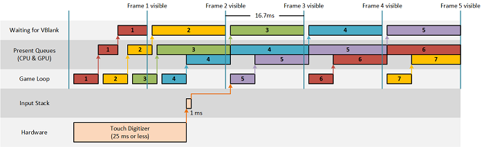

#  <a name="optimize-input-latency-for-universal-windows-platform-uwp-directx-games"></a>UWP(유니버설 Windows 플랫폼) DirectX 게임에 대한 입력 대기 시간 최적화


입력 대기 시간은 게임 환경에 큰 영향을 줄 수 있으며, 최적화하면 게임에 더 세련된 느낌을 줄 수 있습니다. 또한 입력 이벤트를 적절하게 최적화하면 배터리 수명을 향상시킬 수 있습니다. 올바른 CoreDispatcher 입력 이벤트 처리 옵션을 선택하여 게임에서 입력을 가능한 한 매끄럽게 처리하도록 하는 방법을 알아봅니다.

## <a name="input-latency"></a>입력 대기 시간


입력 대기 시간은 시스템이 사용자 입력에 응답하는 데 걸리는 시간입니다. 응답은 화면에 표시되는 내용이나 오디오 피드백을 통해 들리는 소리의 변화인 경우가 많습니다.

터치 포인터, 마우스 포인터 또는 키보드에서 제공되었든 관계없이 모든 입력 이벤트는 이벤트 처리기에서 처리할 메시지를 생성합니다. 최신 터치 디지타이저와 게임 주변 장치는 포인터당 최소 100Hz로 입력 이벤트를 보고하며, 따라서 앱은 포인터(또는 키 입력)별로 초당 100개 이상의 이벤트를 수신할 수 있습니다. 여러 포인터가 동시에 발생하거나 더 높은 정밀도의 입력 장치를 사용하는 경우(예: 게임 마우스) 이 업데이트 속도가 증가합니다. 이벤트 메시지 큐는 매우 빠르게 채워질 수 있습니다.

시나리오에 가장 적합한 방식으로 이벤트가 처리되도록 게임의 입력 대기 시간 요구를 이해하는 것이 중요합니다. 모든 게임에 대한 하나의 해결 방법은 없습니다.

## <a name="power-efficiency"></a>전원 효율성


입력 지연 컨텍스트에서 "전원 효율성"은 게임에 사용되는 GPU 양을 가리킵니다. GPU 리소스를 적게 사용하는 게임이 더 전원 효율적이며 배터리 수명이 더 깁니다. CPU의 경우도 마찬가지입니다.

게임이 사용자 환경의 저하 없이 초당 60프레임(현재 대부분의 디스플레이에서 최대 렌더링 속도) 미만의 속도로 화면 전체를 그릴 수 있는 경우 그리는 빈도를 줄이면 전원 효율성이 커집니다. 일부 게임은 초당 60프레임의 속도로 동일한 콘텐츠를 반복해서 그리지 않도록 사용자 입력에 대한 응답으로만 화면을 업데이트합니다.

## <a name="choosing-what-to-optimize-for"></a>최적화할 대상 선택


DirectX 앱을 디자인하는 경우 몇 가지 선택을 해야 합니다. 매끄러운 애니메이션을 제공하기 위해 앱이 초당 60프레임을 렌더링해야 하나요, 아니면 입력에 대한 응답으로만 렌더링되어야 하나요? 입력 대기 시간이 가능한 한 짧아야 하나요, 아니면 약간의 지연이 허용되나요? 사용자가 앱의 배터리 사용이 적을 것으로 기대하나요?

이러한 질문에 대한 답변은 대체로 앱을 다음 시나리오 중 하나에 맞춤으로써 얻을 수 있습니다.

1.  요구 시 렌더링. 이 범주의 게임은 특정 입력 유형에 대한 응답으로만 화면을 업데이트해야 합니다. 앱이 동일한 프레임을 반복적으로 렌더링하지 않으므로 전원 효율성이 우수하고 앱이 입력을 기다리는 데 대부분의 시간을 소비하므로 입력 대기 시간이 낮습니다. 이 범주에 속하는 앱의 예로는 보드 게임과 뉴스 리더가 있습니다.
2.  임시 애니메이션을 사용하여 요청 시 렌더링. 이 시나리오는 첫 번째 시나리오와 비슷하지만, 애니메이션이 사용자의 후속 입력에 종속되지 않고 특정 유형의 입력으로 시작됩니다. 게임이 동일한 프레임을 반복적으로 렌더링하지 않으므로 전원 효율성이 좋은 편이며 게임이 에니메이션 효과를 나타내지 않는 동안은 입력 대기 시간이 낮습니다. 이 범주에 속하는 앱의 예로는 각각의 움직임에 대해 애니메이션 효과를 주는 대화형 어린이 게임과 보드 게임이 있습니다.
3.  초당 60프레임 렌더링. 이 시나리오에서는 게임이 화면을 지속적으로 업데이트합니다. 디스플레이에서 표시할 수 있는 최대 프레임 수를 렌더링하므로 전원 효율성이 좋지 않습니다. 콘텐츠가 표시되는 동안 DirectX가 스레드를 차단하므로 입력 대기 시간이 높습니다. 따라서 스레드에서 사용자에게 표시될 수 있는 것보다 더 많은 프레임을 디스플레이로 보낼 수 없습니다. 이 범주에 속하는 앱의 예로는 1인치 슈팅 게임, 실시간 전략 게임 및 물리학 기반 게임이 있습니다.
4.  초당 60프레임 렌더링 및 최저 입력 대기 시간 실현. 시나리오 3과 비슷하며, 앱이 화면을 지속적으로 업데이트하므로 전원 효율성이 좋지 않습니다. 단, 게임이 별도 스레드에서 입력에 응답하므로 그래픽을 디스플레이에 제공함으로써 입력 처리가 차단되지 않도록 한다는 점이 다릅니다. 온라인 멀티플레이어 게임, 격투 게임 또는 리듬/타이밍 게임은 엄격한 이벤트 시간 내에서 이동 입력을 지원하므로 이 범주에 속할 수 있습니다.

## <a name="implementation"></a>구현


대부분의 DirectX 게임은 게임 루프에 의해 제어됩니다. 기본 알고리즘은 사용자가 게임이나 앱을 종료할 때까지 이러한 단계를 수행하는 것입니다.

1.  입력 처리
2.  게임 상태 업데이트
3.  게임 콘텐츠 그리기

DirectX 게임의 콘텐츠가 렌더링되고 화면에 표시할 준비가 되면 GPU가 다시 입력을 처리하기 전에 새 프레임을 수신할 준비가 될 때까지 게임 루프가 기다립니다.

간단한 퍼즐 게임을 반복하여 앞에서 언급한 각 시나리오에 대한 게임 루프의 구현을 보여 줍니다. 각 구현에 대해 설명한 결정 사항, 이점 및 장단점은 짧은 대기 시간 입력과 전원 효율성을 위해 앱을 최적화하기 위한 가이드 역할을 할 수 있습니다.

## <a name="scenario-1-render-on-demand"></a>시나리오 1: 요청 시 렌더링


퍼즐 게임의 첫 번째 반복에서는 사용자가 퍼즐 조각을 이동할 때만 화면을 업데이트합니다. 사용자는 퍼즐 조각을 원하는 위치로 끌거나 퍼즐 조각을 선택한 다음 정확한 목적지를 터치하여 제자리에 맞출 수 있습니다. 두 번째 경우에는 퍼즐 조각이 애니메이션 또는 효과 없이 목적지로 이동합니다.

코드에서 **CoreProcessEventsOption::ProcessOneAndAllPending**을 사용하는 [**IFrameworkView::Run**](https://msdn.microsoft.com/library/windows/apps/hh700505) 메서드 내에 단일 스레드 게임 루프가 있습니다. 이 옵션을 사용하면 큐에서 현재 사용 가능한 모든 이벤트가 디스패치됩니다. 대기 중인 이벤트가 없을 경우 이벤트가 나타날 때까지 게임 루프가 기다립니다.

``` syntax
void App::Run()
{
    
    while (!m_windowClosed)
    {
        // Wait for system events or input from the user.
        // ProcessOneAndAllPending will block the thread until events appear and are processed.
        CoreWindow::GetForCurrentThread()->Dispatcher->ProcessEvents(CoreProcessEventsOption::ProcessOneAndAllPending);

        // If any of the events processed resulted in a need to redraw the window contents, then we will re-render the
        // scene and present it to the display.
        if (m_updateWindow || m_state->StateChanged())
        {
            m_main->Render();
            m_deviceResources->Present();

            m_updateWindow = false;
            m_state->Validate();
        }
    }
}
```

## <a name="scenario-2-render-on-demand-with-transient-animations"></a>시나리오 2: 임시 애니메이션을 사용하여 요청 시 렌더링


두 번째 반복에서는 사용자가 퍼즐 조각을 선택한 다음 해당 조각의 올바른 목적지를 터치할 때 목적지에 도착할 때까지 화면에서 애니메이트되도록 게임이 수정됩니다.

이전과 마찬가지로, 코드에 **ProcessOneAndAllPending**을 사용하여 큐의 입력 이벤트를 디스패치하는 단일 스레드 게임 루프가 있습니다. 여기서는 애니메이션 중 루프가 **CoreProcessEventsOption::ProcessAllIfPresent**를 사용하도록 변경되어 새 입력 이벤트를 기다리지 않는 차이가 있습니다. 대기 중인 이벤트가 없을 경우 [**ProcessEvents**](https://msdn.microsoft.com/library/windows/apps/br208215)가 즉시 반환되어 앱이 애니메이션의 다음 프레임을 표시할 수 있도록 합니다. 애니메이션이 완료되면 루프가 **ProcessOneAndAllPending**으로 다시 전환되어 화면 업데이트를 제한합니다.

``` syntax
void App::Run()
{

    while (!m_windowClosed)
    {
        // 2. Switch to a continuous rendering loop during the animation.
        if (m_state->Animating())
        {
            // Process any system events or input from the user that is currently queued.
            // ProcessAllIfPresent will not block the thread to wait for events. This is the desired behavior when
            // you are trying to present a smooth animation to the user.
            CoreWindow::GetForCurrentThread()->Dispatcher->ProcessEvents(CoreProcessEventsOption::ProcessAllIfPresent);

            m_state->Update();
            m_main->Render();
            m_deviceResources->Present();
        }
        else
        {
            // Wait for system events or input from the user.
            // ProcessOneAndAllPending will block the thread until events appear and are processed.
            CoreWindow::GetForCurrentThread()->Dispatcher->ProcessEvents(CoreProcessEventsOption::ProcessOneAndAllPending);

            // If any of the events processed resulted in a need to redraw the window contents, then we will re-render the
            // scene and present it to the display.
            if (m_updateWindow || m_state->StateChanged())
            {
                m_main->Render();
                m_deviceResources->Present();

                m_updateWindow = false;
                m_state->Validate();
            }
        }
    }
}
```

**ProcessOneAndAllPending**과 **ProcessAllIfPresent** 간의 전환을 지원하려면 앱이 애니메이트 중인지 확인하기 위해 상태를 추적해야 합니다. 퍼즐 앱에서는 게임 루프 중 GameState 클래스에 대해 호출될 수 있는 새 메서드를 추가하여 상태를 추적합니다. 게임 루프의 애니메이션 분기는 GameState의 새 Update 메서드를 호출하여 애니메이션 상태의 업데이트를 제어합니다.

## <a name="scenario-3-render-60-frames-per-second"></a>시나리오 3: 초당 60프레임 렌더링


세 번째 반복에서 앱은 퍼즐 작업이 수행된 기간을 사용자에게 보여 주는 타이머를 표시합니다. 밀리초까지 경과 시간을 표시하기 때문에 디스플레이를 최신 상태로 유지하려면 초당 60프레임을 렌더링해야 합니다.

시나리오 1, 2와 마찬가지로 앱에는 단일 스레드 게임 루프가 있습니다. 이 시나리오의 차이점은 항상 렌더링되기 때문에 처음 두 시나리오와 달리 더 이상 게임 상태의 변경을 추적할 필요가 없다는 것입니다. 따라서 기본적으로 **ProcessAllIfPresent**를 사용하여 이벤트를 처리할 수 있습니다. 대기 중인 이벤트가 없을 경우 **ProcessEvents**가 즉시 반환되어 다음 프레임을 계속 렌더링합니다.

``` syntax
void App::Run()
{

    while (!m_windowClosed)
    {
        if (m_windowVisible)
        {
            // 3. Continuously render frames and process system events and input as they appear in the queue.
            // ProcessAllIfPresent will not block the thread to wait for events. This is the desired behavior when
            // trying to present smooth animations to the user.
            CoreWindow::GetForCurrentThread()->Dispatcher->ProcessEvents(CoreProcessEventsOption::ProcessAllIfPresent);

            m_state->Update();
            m_main->Render();
            m_deviceResources->Present();
        }
        else
        {
            // 3. If the window isn't visible, there is no need to continuously render.
            // Process events as they appear until the window becomes visible again.
            CoreWindow::GetForCurrentThread()->Dispatcher->ProcessEvents(CoreProcessEventsOption::ProcessOneAndAllPending);
        }
    }
}
```

이 접근 방법은 렌더링해야 하는 시기를 결정하기 위해 추가 상태를 추적할 필요가 없기 때문에 게임을 작성하는 가장 쉬운 방법입니다. 타이머 간격에서 적절한 입력 응답과 더불어 가능한 가장 빠른 렌더링을 구현합니다.

그러나 개발이 용이한 대신 단점이 있습니다. 초당 60프레임으로 렌더링할 경우 요청 시 렌더링보다 많은 전원이 사용됩니다. 게임에서 각 프레임에 표시되는 내용이 변경될 때 **ProcessAllIfPresent**를 사용하는 것이 좋습니다. 또한, 이제 앱이 **ProcessEvents** 대신 디스플레이의 동기화 간격에서 게임 루프를 차단하기 때문에 입력 대기 시간이 16.7ms만큼 증가합니다. 큐가 프레임당 한 번만(60Hz) 처리되므로 일부 입력 이벤트가 삭제될 수도 있습니다.

## <a name="scenario-4-render-60-frames-per-second-and-achieve-the-lowest-possible-input-latency"></a>시나리오 4: 초당 60프레임 렌더링 및 가능한 가장 짧은 입력 대기 시간 구현


일부 게임은 시나리오 3의 입력 대기 시간 증가를 무시하거나 보상할 수 있습니다. 그러나 짧은 입력 대기 시간이 게임 환경과 플레이어 피드백에 중요한 경우 초당 60프레임을 렌더링하는 게임이 별도 스레드에서 입력을 처리해야 합니다.

퍼즐 게임의 네 번째 반복은 시나리오 3을 기반으로 하며, 게임 루프의 입력 처리와 그래픽 렌더링을 별도 스레드로 분할합니다. 각각 별도 스레드를 사용하면 입력이 그래픽 출력으로 인해 지연되지 않지만, 그 결과로 코드가 더 복잡해집니다. 시나리오 4에서 입력 스레드는 [**CoreProcessEventsOption::ProcessUntilQuit**](https://msdn.microsoft.com/library/windows/apps/br208217)로 [**ProcessEvents**](https://msdn.microsoft.com/library/windows/apps/br208215)를 호출하며, 새 이벤트를 기다리고 사용 가능한 모든 이벤트를 디스패치합니다. 창이 닫히거나 게임이 [**CoreWindow::Close**](https://msdn.microsoft.com/library/windows/apps/br208260)를 호출할 때까지 이 동작을 계속합니다.

``` syntax
void App::Run()
{
    // 4. Start a thread dedicated to rendering and dedicate the UI thread to input processing.
    m_main->StartRenderThread();

    // ProcessUntilQuit will block the thread and process events as they appear until the App terminates.
    CoreWindow::GetForCurrentThread()->Dispatcher->ProcessEvents(CoreProcessEventsOption::ProcessUntilQuit);
}

void JigsawPuzzleMain::StartRenderThread()
{
    // If the render thread is already running, then do not start another one.
    if (IsRendering())
    {
        return;
    }

    // Create a task that will be run on a background thread.
    auto workItemHandler = ref new WorkItemHandler([this](IAsyncAction^ action)
    {
        // Notify the swap chain that this app intends to render each frame faster
        // than the display's vertical refresh rate (typically 60 Hz). Apps that cannot
        // deliver frames this quickly should set this to 2.
        m_deviceResources->SetMaximumFrameLatency(1);

        // Calculate the updated frame and render once per vertical blanking interval.
        while (action->Status == AsyncStatus::Started)
        {
            // Execute any work items that have been queued by the input thread.
            ProcessPendingWork();

            // Take a snapshot of the current game state. This allows the renderers to work with a
            // set of values that won't be changed while the input thread continues to process events.
            m_state->SnapState();

            m_sceneRenderer->Render();
            m_deviceResources->Present();
        }

        // Ensure that all pending work items have been processed before terminating the thread.
        ProcessPendingWork();
    });

    // Run the task on a dedicated high priority background thread.
    m_renderLoopWorker = ThreadPool::RunAsync(workItemHandler, WorkItemPriority::High, WorkItemOptions::TimeSliced);
}
```

Microsoft Visual Studio2015에서 **DirectX 11 및 XAML 앱 (유니버설 Windows)** 템플릿을 유사한 방식으로 여러 스레드로 게임 루프를 분할 합니다. [**Windows::UI::Core::CoreIndependentInputSource**](https://msdn.microsoft.com/library/windows/apps/dn298460) 개체를 사용하여 입력 처리 전용 스레드를 시작하고 XAML UI 스레드와 독립적인 렌더링 스레드도 만듭니다. 이러한 템플릿에 대한 자세한 내용은 [템플릿에서 유니버설 Windows 플랫폼 및 DirectX 게임 프로젝트 만들기](user-interface.md)를 참조하세요.

## <a name="additional-ways-to-reduce-input-latency"></a>입력 대기 시간을 줄이는 추가 방법


### <a name="use-waitable-swap-chains"></a>대기 가능 스왑 체인 사용

DirectX 게임은 사용자에게 표시되는 화면 내용을 업데이트하여 사용자 입력에 응답합니다. 60Hz 디스플레이에서는 화면이 16.7ms(1초/60프레임)마다 새로 고쳐집니다. 그림 1에서는 초당 60프레임을 렌더링하는 앱의 16.7ms 새로 고침 신호(VBlank)를 기준으로 입력 이벤트에 대한 응답과 대략적인 수명 주기를 보여 줍니다.

그림 1



Windows8.1, DXGI는 앱을 쉽게 Present 큐를 빈 상태로 유지 하기 위해 추론을 구현 하지 않고도이 대기 시간을 줄일 수 있는 스왑 체인에 대 한 **DXGI\_SWAP\_CHAIN\_FLAG\_FRAME\_LATENCY\_WAITABLE\_OBJECT** 플래그를 도입 했습니다. 이 플래그를 사용하여 만든 스왑 체인을 대기 가능 스왑 체인이라고 합니다. 그림 2에서는 대기 가능 스왑 체인을 사용할 경우의 입력 이벤트에 대한 응답과 대략적인 수명 주기를 보여 줍니다.

그림 2


이러한 다이어그램을 통해 게임이 디스플레이의 새로 고침 빈도로 정의된 16.7ms 할당 내에서 각 프레임을 렌더링 및 표시할 수 있는 경우 입력 대기 시간을 전체 프레임 2개만큼 줄일 수 있음을 알 수 있습니다. 퍼즐 샘플은 대기 가능 스왑 체인을 사용하며 다음을 호출하여 Present 큐 제한을 제어합니다.` m_deviceResources->SetMaximumFrameLatency(1);`

 

 


