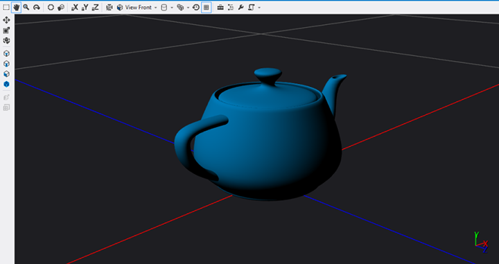

# <a name="visual-studio-tools-for-game-programming"></a>게임 프로그래밍용 Visual Studio 도구


\[ Windows 10의 UWP 앱에 맞게 업데이트되었습니다. Windows 8.x 문서는 [보관](http://go.microsoft.com/fwlink/p/?linkid=619132)을 참조하세요. \]

**요약**

-   [템플릿에서 DirectX 게임 프로젝트 만들기](user-interface.md)
-   DirectX 게임 프로그래밍용 Visual Studio 도구


Visual Studio Ultimate을 사용하여 DirectX 앱을 개발하는 경우 이미지, 모델, 셰이더 리소스 만들기, 편집, 미리 보기 및 내보내기에 사용할 수 있는 추가 도구가 있습니다. 빌드 시 리소스를 변환하고 DirectX 그래픽 코드를 디버그하는 데 사용할 수 있는 도구도 있습니다.

이 항목에서는 이러한 그래픽 도구에 대해 전체적으로 간략히 설명합니다.

## <a name="image-editor"></a>이미지 편집기


이미지 편집기를 사용하여 DirectX가 사용하는 여러 가지 풍부한 텍스처와 이미지 형식으로 작업할 수 있습니다. 이미지 편집기는 다음 형식을 지원합니다.

-   .png
-   .jpg, .jpeg, .jpe, .jfif
-   .dds
-   .gif
-   .bmp
-   .dib
-   .tif, .tiff
-   .tga

[사용자 지정 빌드 파일](#build-customizations-for-3d-assets)을 만들어 빌드 시 이러한 파일을 .dds 파일로 변환합니다.

자세한 내용은 [텍스처 및 이미지 작업](https://msdn.microsoft.com/library/windows/apps/hh873119.aspx)을 참조하세요.

> **참고**  이미지 편집기는 전체 기능의 이미지 편집 앱에 대한 대체용이 아니지만 단순한 여러 가지 보기 및 편집 시나리오에 적합합니다.

 

## <a name="model-editor"></a>모델 편집기


모델 편집기를 사용하여 처음부터 기본 3D 모델을 만들거나 모든 기능을 갖춘 3D 모델링 도구에서 더 복잡한 3D 모델을 보고 수정할 수 있습니다. 모델 편집기는 DirectX 앱 개발에 사용되는 여러 가지 3D 모델 형식을 지원합니다. [사용자 지정 빌드 파일](#build-customizations-for-3d-assets)을 만들어 빌드 시 이러한 파일을 .cmo 파일로 변환할 수 있습니다.

-   .fbx
-   .dae
-   .obj

편집기에서 조명이 적용된 모델의 스크린샷은 다음과 같습니다.



자세한 내용은 [3D 모델 작업](https://msdn.microsoft.com/library/windows/apps/hh873114.aspx)을 참조하세요.

> **참고**  모델 편집기는 전체 기능의 모델 편집 앱에 대한 대체용이 아니지만 단순한 여러 가지 보기 및 편집 시나리오에 적합합니다.

 

## <a name="shader-designer"></a>셰이더 디자이너


셰이더 디자이너를 사용하여 HLSL 프로그래밍을 모르는 경우에도 게임 또는 앱에 대한 사용자 지정 시각 효과를 만들 수 있습니다.

그래프로 셰이더를 시각적으로 만듭니다. 각 노드는 해당 작업까지 출력 미리 보기를 표시합니다. 구 미리 보기에서 Lambert 조명을 적용하는 예는 다음과 같습니다.


셰이더 편집기를 사용하여 셰이더를 .dgsl 형식으로 디자인, 편집 및 저장합니다. 또한 다음과 같은 형식을 내보냅니다.

-   .hlsl(소스 코드)
-   .cso(바이트코드)
-   .h(HLSL 바이트코드 배열)

[사용자 지정 빌드 파일](#build-customizations-for-3d-assets)을 만들어 빌드 시 이러한 형식을 .cso 파일로 변환합니다.

셰이더 편집기에서 내보낸 HLSL 코드의 일부는 다음과 같습니다. Lambert 조명 노드에 대한 코드만 나옵니다.

```hlsl
//
// Lambert lighting function
//
float3 LambertLighting(
    float3 lightNormal,
    float3 surfaceNormal,
    float3 materialAmbient,
    float3 lightAmbient,
    float3 lightColor,
    float3 pixelColor
    )
{
    // Compute the amount of contribution per light.
    float diffuseAmount = saturate(dot(lightNormal, surfaceNormal));
    float3 diffuse = diffuseAmount * lightColor * pixelColor;

    // Combine ambient with diffuse.
    return saturate((materialAmbient * lightAmbient) + diffuse);
}
```

자세한 내용은 [셰이더 작업](https://msdn.microsoft.com/library/windows/apps/hh873117.aspx)을 참조하세요.

## <a name="build-customizations-for-3d-assets"></a>3D 자산에 대한 사용자 지정 빌드


Visual Studio가 리소스를 사용할 수 있는 형식으로 변환하도록 프로젝트에 사용자 지정 빌드를 추가할 수 있습니다. 그 후 다른 DirectX 앱에서와 마찬가지로 DirectX 리소스를 만들고 채워서 앱에 자산을 로드하고 사용할 수 있습니다.

사용자 지정 빌드를 추가하려면 **솔루션 탐색기**에서 프로젝트를 마우스 오른쪽 단추로 클릭하고 **사용자 지정 빌드...**를 선택합니다. 다음과 같은 유형의 사용자 지정 빌드를 프로젝트에 추가할 수 있습니다.

-   이미지 콘텐츠 파이프라인은 입력으로 이미지 파일을 가져오고 DirectDraw Surface(.dds) 파일을 출력합니다.
-   메시 콘텐츠 파이프라인은 메시 파일(.fbx)을 가져오고 .cmo 메시 파일을 출력합니다.
-   셰이더 콘텐츠 파이프라인은 Visual Studio 셰이더 편집기에서 비주얼 셰이더 그래프(.dgsl)를 가져오고 컴파일된 셰이더 출력(.cso) 파일을 출력합니다.

자세한 내용은 [게임 또는 앱에서 3D 자산 사용](https://msdn.microsoft.com/library/windows/apps/hh972446.aspx)을 참조하세요.

## <a name="debugging-directx-graphics"></a>DirectX 그래픽 디버깅


Visual Studio는 그래픽 관련 디버깅 도구를 제공합니다. 이러한 도구를 사용하여 다음과 같은 사항을 디버그합니다.

-   그래픽 파이프라인
-   이벤트 호출 스택
-   개체 표
-   기본 상태
-   셰이더 버그
-   초기화되지 않거나 잘못된 상수 버퍼 및 매개 변수
-   DirectX 버전 호환성
-   제한된 Direct2D 지원
-   운영 체제 및 SDK 요구 사항

자세한 내용은 [DirectX 그래픽 디버깅](https://msdn.microsoft.com/library/windows/apps/hh315751.aspx)을 참조하세요.

> **참고**  이 문서는 UWP(유니버설 Windows 플랫폼) 앱을 작성하는 Windows 10 개발자용입니다. Windows 8.x 또는 Windows Phone 8.x를 개발하는 경우 [보관된 문서](http://go.microsoft.com/fwlink/p/?linkid=619132)를 참조하세요.

 

 

 


