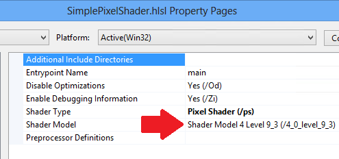

# <a name="convert-the-rendering-framework"></a>렌더링 프레임워크 변환


**요약**

-   [1부: Direct3D 11 초기화](simple-port-from-direct3d-9-to-11-1-part-1--initializing-direct3d.md)
-   2부: 렌더링 프레임워크 변환
-   [3부: 게임 루프 포팅](simple-port-from-direct3d-9-to-11-1-part-3--viewport-and-game-loop.md)


기하 도형 버퍼를 포팅하는 방법, HLSL 셰이더 프로그램을 컴파일하고 로드하는 방법 및 Direct3D 11에서 렌더링 체인을 구현하는 방법을 포함하여 간단한 렌더링 프레임 워크를 Direct3D 9에서 Direct3D 11로 변환하는 방법을 보여 줍니다. [간단한 Direct3D 9 앱을 DirectX 11 및 UWP(유니버설 Windows 플랫폼)으로 포팅](walkthrough--simple-port-from-direct3d-9-to-11-1.md) 연습의 2부.

## <a name="convert-effects-to-hlsl-shaders"></a>HLSL 셰이더로 효과 변환


다음 예제에서는 하드웨어 꼭짓점 변환 및 통과 색상 데이터에 대한 레거시 효과 API용으로 작성된 간단한 D3DX 기술입니다.

Direct3D 9 셰이더 코드

```cpp
// Global variables
matrix g_mWorld;        // world matrix for object
matrix g_View;          // view matrix
matrix g_Projection;    // projection matrix

// Shader pipeline structures
struct VS_OUTPUT
{
    float4 Position   : POSITION;   // vertex position
    float4 Color      : COLOR0;     // vertex diffuse color
};

struct PS_OUTPUT
{
    float4 RGBColor : COLOR0;  // Pixel color    
};

// Vertex shader
VS_OUTPUT RenderSceneVS(float3 vPos : POSITION, 
                        float3 vColor : COLOR0)
{
    VS_OUTPUT Output;
    
    float4 pos = float4(vPos, 1.0f);

    // Transform the position from object space to homogeneous projection space
    pos = mul(pos, g_mWorld);
    pos = mul(pos, g_View);
    pos = mul(pos, g_Projection);

    Output.Position = pos;
    
    // Just pass through the color data
    Output.Color = float4(vColor, 1.0f);
    
    return Output;
}

// Pixel shader
PS_OUTPUT RenderScenePS(VS_OUTPUT In) 
{ 
    PS_OUTPUT Output;

    Output.RGBColor = In.Color;

    return Output;
}

// Technique
technique RenderSceneSimple
{
    pass P0
    {          
        VertexShader = compile vs_2_0 RenderSceneVS();
        PixelShader  = compile ps_2_0 RenderScenePS(); 
    }
}
```

Direct3D 11에서는 HLSL 셰이더를 계속 사용할 수 있습니다. 각 셰이더를 자체 HLSL 파일에 넣어 Visual Studio가 별도 파일로 컴파일하게 하고 나중에 별도의 Direct3D 리소스로 로드할 것입니다. 이러한 셰이더는 DirectX 9.1 GPU에 대해 작성되었기 때문에 대상 수준을 [셰이더 모델 4 수준 9\_1(/4\_0\_level\_9\_1)](https://msdn.microsoft.com/library/windows/desktop/ff476876)로 설정합니다.

입력 레이아웃을 정의했을 때 시스템 메모리와 GPU 메모리에서 꼭짓점별 데이터를 저장하는 데 사용하는 동일한 데이터 구조를 나타내는지 확인했습니다. 마찬가지로 꼭짓점 셰이더의 출력은 픽셀 셰이더에 대한 입력으로 사용되는 구조와 일치해야 합니다. 규칙은 C++에서의 한 함수에서 다른 함수로 데이터 전달과 동일 하지 않습니다. 구조의 끝에서 사용하지 않는 변수를 생략할 수 있습니다. 하지만 순서를 다시 정렬할 수 없으며 데이터 구조의 가운데에서 콘텐츠를 건너뛸 수 없습니다.

> **참고**  픽셀 셰이더에 꼭 짓 점 셰이더 바인딩 위한 Direct3D 9의 규칙은 Direct3D 11의 규칙 보다 더 완화 된 합니다. Direct3D 9 정렬은 유연하지만 비효율적이었습니다.

 

HLSL 파일은 셰이더 의미 체계에 대한 이전 구문을 사용할 수 있습니다(예: SV\_TARGET 대신 COLOR). 그러한 경우 HLSL 호환성 모드(/Gec 컴파일러 옵션)를 사용하거나 셰이더 [의미 체계](https://msdn.microsoft.com/library/windows/desktop/bb509647)를 현재 구문으로 업데이트해야 합니다. 이 예제의 꼭짓점 셰이더는 현재 구문으로 업데이트되었습니다.

하드웨어 변환 꼭짓점 셰이더는 다음과 같습니다. 이번에는 고유한 파일에 정의되어 있습니다.

> **참고**꼭 짓 점 셰이더는 SV\_POSITION 시스템 값 의미 체계를 출력 하는 데 필요한 합니다. 이 의미 체계는 꼭짓점 위치 데이터를 결정하여 값을 조정합니다. 여기서 x는 -1과 1 사이입니다. y는 -1과 1 사이입니다. z는 원래 같은 유형의 좌표 w 값으로 나눕니다(z/w). w는 원래 w 값으로 1을 나눈 값입니다(1/w).

 

HLSL 꼭짓점 셰이더(기능 수준 9.1)

```cpp
cbuffer ModelViewProjectionConstantBuffer : register(b0)
{
    matrix mWorld;       // world matrix for object
    matrix View;        // view matrix
    matrix Projection;  // projection matrix
};

struct VS_INPUT
{
    float3 vPos   : POSITION;
    float3 vColor : COLOR0;
};

struct VS_OUTPUT
{
    float4 Position : SV_POSITION; // Vertex shaders must output SV_POSITION
    float4 Color    : COLOR0;
};

VS_OUTPUT main(VS_INPUT input) // main is the default function name
{
    VS_OUTPUT Output;

    float4 pos = float4(input.vPos, 1.0f);

    // Transform the position from object space to homogeneous projection space
    pos = mul(pos, mWorld);
    pos = mul(pos, View);
    pos = mul(pos, Projection);
    Output.Position = pos;

    // Just pass through the color data
    Output.Color = float4(input.vColor, 1.0f);

    return Output;
}
```

통과 픽셀 셰이더에는 이것만 있으면 됩니다. 이를 통과라고 하지만 각 픽셀에 대한 보간된 원근 수정 색상 데이터를 실제로 가져옵니다. SV\_TARGET 시스템 값 의미 체계는 API에서 필요한 대로 픽셀 셰이더에 의해 색상 값 출력에 적용됩니다.

> **참고**셰이더 수준 9 \_x 픽셀 셰이더는 SV\_POSITION 시스템 값 의미 체계를 읽을 수 없습니다. Model 4.0 이상 픽셀 셰이더는 SV\_POSITION을 사용하여 화면에서 픽셀 위치를 검색합니다. 여기서 x는 0과 렌더링 대상 너비 사이이고 y는 0과 렌더링 대상 높이 사이입니다(각각 0.5 기준 오프셋).

 

대부분 픽셀 셰이더는 통과보다 훨씬 더 복잡합니다. Direct3D 기능 수준에서는 셰이더 프로그램당 계산 수를 훨씬 더 많이 허용합니다.

HLSL 픽셀 셰이더(기능 수준 9.1)

```cpp
struct PS_INPUT
{
    float4 Position : SV_POSITION;  // interpolated vertex position (system value)
    float4 Color    : COLOR0;       // interpolated diffuse color
};

struct PS_OUTPUT
{
    float4 RGBColor : SV_TARGET;  // pixel color (your PS computes this system value)
};

PS_OUTPUT main(PS_INPUT In)
{
    PS_OUTPUT Output;

    Output.RGBColor = In.Color;

    return Output;
}
```

## <a name="compile-and-load-shaders"></a>셰이더 컴파일 및 로드


Direct3D 9 게임은 프로그래밍 가능한 파이프라인을 구현하는 편리한 방법으로 효과 라이브러리를 종종 사용합니다. 효과는 런타임에서 [**D3DXCreateEffectFromFile function**](https://msdn.microsoft.com/library/windows/desktop/bb172768) 메서드를 사용하여 컴파일할 수 있습니다.

Direct3D 9에서 효과 로드

```cpp
// Turn off preshader optimization to keep calculations on the GPU
DWORD dwShaderFlags = D3DXSHADER_NO_PRESHADER;

// Only enable debug info when compiling for a debug target
#if defined (DEBUG) || defined (_DEBUG)
dwShaderFlags |= D3DXSHADER_DEBUG;
#endif

D3DXCreateEffectFromFile(
    m_pd3dDevice,
    L"CubeShaders.fx",
    NULL,
    NULL,
    dwShaderFlags,
    NULL,
    &m_pEffect,
    NULL
    );
```

Direct3D 11은 이진 리소스로 셰이더 프로그램에서 작동합니다. 프로젝트가 빌드된 다음 리소스로 처리되는 경우 셰이더가 컴파일됩니다. 예제에서는 셰이더 바이트 코드를 시스템 메모리에 로드하고, Direct3D 장치 인터페이스를 사용하여 각 셰이더에 대한 Direct3D 리소스를 만들고, 각 프레임을 설정할 때 Direct3D 셰이더 리소스를 가리킵니다.

Direct3D 11에서 셰이더 리소스 로드

```cpp
// BasicReaderWriter is a tested file loader used in SDK samples.
BasicReaderWriter^ readerWriter = ref new BasicReaderWriter();


// Load vertex shader:
Platform::Array<byte>^ vertexShaderData =
    readerWriter->ReadData("CubeVertexShader.cso");

// This call allocates a device resource, validates the vertex shader 
// with the device feature level, and stores the vertex shader bits in 
// graphics memory.
m_d3dDevice->CreateVertexShader(
    vertexShaderData->Data,
    vertexShaderData->Length,
    nullptr,
    &m_vertexShader
    );
```

셰이더 바이트 코드를 컴파일된 앱 패키지에 포함하려면 HLSL 파일을 Visual Studio 프로젝트에 추가하기만 하면 됩니다. Visual Studio는 [효과 컴파일러 도구](https://msdn.microsoft.com/library/windows/desktop/bb232919)(FXC)를 사용하여 HLSL 파일을 컴파일된 셰이더 개체(.CSO 파일)로 컴파일하여 앱 패키지에 포함합니다.

> **참고**  HLSL 컴파일러에 대 한 올바른 대상 기능 수준을 설정 해야 합니다: Visual Studio에서 HLSL 소스 파일을 마우스 오른쪽 단추로 클릭 하 고 속성을 선택 하는 **셰이더 모델** 설정 변경 **HLSL 컴파일러-&gt; 일반**합니다. 앱이 Direct3D 셰이더 자원을 만들 때 Direct3D는 하드웨어 기능에 대해 이 속성을 확인합니다.

 



Direct3D 9에서 꼭짓점 스트림 선언에 해당하는 입력 레이아웃을 만들기 데 좋은 위치입니다. 꼭짓점별 데이터 구조는 꼭짓점 셰이더가 사용하는 것과 일치해야 합니다. Direct3D 11에는 입력 레이아웃에 대한 추가 컨트롤이 있습니다. 부동 소수점 벡터의 배열 크기 및 비트 길이를 정의하고 꼭짓점 셰이더의 의미 체계를 지정할 수 있습니다. [**D3D11\_INPUT\_ELEMENT\_DESC**](https://msdn.microsoft.com/library/windows/desktop/ff476180) 구조를 만들고 이 구조를 사용하여 꼭짓점별 데이터 모양을 Direct3D에 알려 줍니다. API가 꼭짓점 셰이더 리소스에 대해 입력 레이아웃을 확인하므로 입력 레이아웃을 정의하기 위해 꼭짓점 셰이더를 로드할 때까지 대기했습니다. 입력 레이아웃이 호환되지 않는 경우 Direct3D가 예외를 throw합니다.

꼭짓점별 데이터는 시스템 메모리에서 호환되는 형식으로 저장해야 합니다. DirectXMath 데이터 형식을 활용할 수 있습니다. 예를 들어 DXGI\_FORMAT\_R32G32B32\_FLOAT는 [**XMFLOAT3**](https://msdn.microsoft.com/library/windows/desktop/ee419475)에 해당합니다.

> **참고**  상수 버퍼는 한 번에 4 개의 부동 소수점 숫자에 정렬 되는 고정 된 입력된 레이아웃을 사용 합니다. [**XMFLOAT4**](https://msdn.microsoft.com/library/windows/desktop/ee419608)(및 해당 파생물)가 상수 버퍼 데이터에 권장됩니다.

 

Direct3D 11에서 입력 레이아웃 설정

```cpp
// Create input layout:
const D3D11_INPUT_ELEMENT_DESC vertexDesc[] = 
{
    { "POSITION", 0, DXGI_FORMAT_R32G32B32_FLOAT,
        0, 0,  D3D11_INPUT_PER_VERTEX_DATA, 0 },

    { "COLOR",    0, DXGI_FORMAT_R32G32B32_FLOAT, 
        0, 12, D3D11_INPUT_PER_VERTEX_DATA, 0 },
};
```

## <a name="create-geometry-resources"></a>기하 도형 리소스 만들기


Direct3D 9에서는 Direct3D 장치에서 버퍼를 만들고, 메모리를 잠그고, CPU 메모리에서 GPU 메모리로 데이터를 복사하여 기하 도형 리소스를 저장했습니다.

Direct3D 9

```cpp
// Create vertex buffer:
VOID* pVertices;

// In Direct3D 9 we create the buffer, lock it, and copy the data from 
// system memory to graphics memory.
m_pd3dDevice->CreateVertexBuffer(
    sizeof(CubeVertices),
    0,
    D3DFVF_XYZ | D3DFVF_DIFFUSE,
    D3DPOOL_MANAGED,
    &pVertexBuffer,
    NULL);

pVertexBuffer->Lock(
    0,
    sizeof(CubeVertices),
    &pVertices,
    0);

memcpy(pVertices, CubeVertices, sizeof(CubeVertices));
pVertexBuffer->Unlock();
```

DirectX 11은 보다 간단한 프로세스를 따릅니다. API는 자동으로 시스템 메모리에서 GPU로 데이터를 복사합니다. COM 스마트 포인터를 사용하여 프로그래밍을 보다 쉽게 할 수 있습니다.

DirectX 11

```cpp
D3D11_SUBRESOURCE_DATA vertexBufferData = {0};
vertexBufferData.pSysMem = CubeVertices;
vertexBufferData.SysMemPitch = 0;
vertexBufferData.SysMemSlicePitch = 0;
CD3D11_BUFFER_DESC vertexBufferDesc(
    sizeof(CubeVertices),
    D3D11_BIND_VERTEX_BUFFER);
  
// This call allocates a device resource for the vertex buffer and copies
// in the data.
m_d3dDevice->CreateBuffer(
    &vertexBufferDesc,
    &vertexBufferData,
    &m_vertexBuffer
    );
```

## <a name="implement-the-rendering-chain"></a>렌더링 체인 구현


Direct3D 9 게임은 종종 효과 기반 렌더링 체인을 사용합니다. 이러한 유형의 렌더링 체인은 효과 개체를 설정하고, 필요로 하는 리소스와 함께 이 개체를 제공하며, 각 단계가 렌더링되게 합니다.

Direct3D 9 렌더링 체인

```cpp
// Clear the render target and the z-buffer.
m_pd3dDevice->Clear(
    0, NULL,
    D3DCLEAR_TARGET | D3DCLEAR_ZBUFFER,
    D3DCOLOR_ARGB(0, 45, 50, 170),
    1.0f, 0
    );

// Set the effect technique
m_pEffect->SetTechnique("RenderSceneSimple");

// Rotate the cube 1 degree per frame.
D3DXMATRIX world;
D3DXMatrixRotationY(&world, D3DXToRadian(m_frameCount++));


// Set the matrices up using traditional functions.
m_pEffect->SetMatrix("g_mWorld", &world);
m_pEffect->SetMatrix("g_View", &m_view);
m_pEffect->SetMatrix("g_Projection", &m_projection);

// Render the scene using the Effects library.
if(SUCCEEDED(m_pd3dDevice->BeginScene()))
{
    // Begin rendering effect passes.
    UINT passes = 0;
    m_pEffect->Begin(&passes, 0);
    
    for (UINT i = 0; i < passes; i++)
    {
        m_pEffect->BeginPass(i);
        
        // Send vertex data to the pipeline.
        m_pd3dDevice->SetFVF(D3DFVF_XYZ | D3DFVF_DIFFUSE);
        m_pd3dDevice->SetStreamSource(
            0, pVertexBuffer,
            0, sizeof(VertexPositionColor)
            );
        m_pd3dDevice->SetIndices(pIndexBuffer);
        
        // Draw the cube.
        m_pd3dDevice->DrawIndexedPrimitive(
            D3DPT_TRIANGLELIST,
            0, 0, 8, 0, 12
            );
        m_pEffect->EndPass();
    }
    m_pEffect->End();
    
    // End drawing.
    m_pd3dDevice->EndScene();
}

// Present frame:
// Show the frame on the primary surface.
m_pd3dDevice->Present(NULL, NULL, NULL, NULL);
```

DirectX 11 렌더링 체인도 동일한 작업을 수행하지만 렌더링 단계는 다르게 구현해야 합니다. FX 파일에 세부 사항을 넣고 렌더링 기술을 C++ 코드처럼 불투명하게 하는 대신 C++에서 모든 렌더링을 설정할 것입니다.

렌더링 체인 모양은 다음과 같습니다. 꼭짓점 셰이더를 로드한 후 만든 입력 레이아웃을 제공하고, 각 셰이더 개체를 제공하고 각 셰이더가 사용할 상수 버퍼를 지정해야 합니다. 이 예제에는 여러 렌더링 단계가 포함되어 있지 않지만 각 단계에 대한 비슷한 렌더링 체인을 수행하는 경우 필요에 따라 설정을 변경합니다.

Direct3D 11 렌더링 체인

```cpp
// Clear the back buffer.
const float midnightBlue[] = { 0.098f, 0.098f, 0.439f, 1.000f };
m_d3dContext->ClearRenderTargetView(
    m_renderTargetView.Get(),
    midnightBlue
    );

// Set the render target. This starts the drawing operation.
m_d3dContext->OMSetRenderTargets(
    1,  // number of render target views for this drawing operation.
    m_renderTargetView.GetAddressOf(),
    nullptr
    );


// Rotate the cube 1 degree per frame.
XMStoreFloat4x4(
    &m_constantBufferData.model, 
    XMMatrixTranspose(XMMatrixRotationY(m_frameCount++ * XM_PI / 180.f))
    );

// Copy the updated constant buffer from system memory to video memory.
m_d3dContext->UpdateSubresource(
    m_constantBuffer.Get(),
    0,      // update the 0th subresource
    NULL,   // use the whole destination
    &m_constantBufferData,
    0,      // default pitch
    0       // default pitch
    );


// Send vertex data to the Input Assembler stage.
UINT stride = sizeof(VertexPositionColor);
UINT offset = 0;

m_d3dContext->IASetVertexBuffers(
    0,  // start with the first vertex buffer
    1,  // one vertex buffer
    m_vertexBuffer.GetAddressOf(),
    &stride,
    &offset
    );

m_d3dContext->IASetIndexBuffer(
    m_indexBuffer.Get(),
    DXGI_FORMAT_R16_UINT,
    0   // no offset
    );

m_d3dContext->IASetPrimitiveTopology(D3D11_PRIMITIVE_TOPOLOGY_TRIANGLELIST);
m_d3dContext->IASetInputLayout(m_inputLayout.Get());


// Set the vertex shader.
m_d3dContext->VSSetShader(
    m_vertexShader.Get(),
    nullptr,
    0
    );

// Set the vertex shader constant buffer data.
m_d3dContext->VSSetConstantBuffers(
    0,  // register 0
    1,  // one constant buffer
    m_constantBuffer.GetAddressOf()
    );


// Set the pixel shader.
m_d3dContext->PSSetShader(
    m_pixelShader.Get(),
    nullptr,
    0
    );


// Draw the cube.
m_d3dContext->DrawIndexed(
    m_indexCount,
    0,  // start with index 0
    0   // start with vertex 0
    );
```

스왑 체인은 그래픽 인프라의 일부이므로 DXGI 스왑 체인을 사용하여 완성된 프레임을 표시합니다. DXGI는 다음 vsync까지 호출을 차단합니다. 그런 후 반환하고, 게임 루프가 다음 반복으로 계속할 수 있습니다.

DirectX 11을 사용하여 화면에 프레임 표시

```cpp
m_swapChain->Present(1, 0);
```

방금 만든 렌더링 체인은 [**IFrameworkView::Run**](https://msdn.microsoft.com/library/windows/apps/hh700505) 메서드에서 구현되는 게임 루프에서 호출됩니다. 이 체인은 [3 부: 뷰포트 및 게임 루프](simple-port-from-direct3d-9-to-11-1-part-3--viewport-and-game-loop.md)에 나와 있습니다.

 

 


