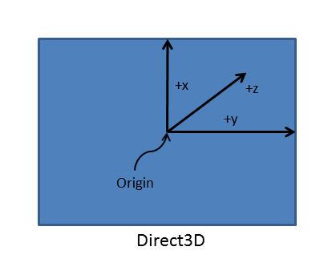

# <a name="supporting-screen-orientation-directx-and-c"></a>화면 방향 지원(DirectX 및 C++)


[**DisplayInformation::OrientationChanged**](https://msdn.microsoft.com/library/windows/apps/dn264268) 이벤트를 처리할 때 UWP(유니버설 Windows 플랫폼) 앱은 여러 화면 방향을 지원할 수 있습니다. 여기에서는 Windows10 디바이스의 그래픽 하드웨어가 효율적 이면 서 효과적으로 사용 되도록 UWP DirectX 앱에서 화면 회전을 처리 하는 것에 대 한 유용한 설명 하겠습니다.

시작하기 전에 그래픽 하드웨어는 장치 방향에 관계없이 항상 같은 방향으로 픽셀 데이터를 출력한다는 점을 기억해 두세요. Windows10 장치 (특정 유형의 센서 또는 소프트웨어 토글)는 현재 디스플레이 방향을 확인 하 고 사용자가 디스플레이 설정을 변경할 수 있도록 합니다. 이 Windows10 인해 자체 있는지 "수직" 장치의 방향에 따라 이미지의 회전을 처리 합니다. 기본적으로 앱은 방향에서 달라진 점(예: 창 크기)이 있다는 알림을 받게 됩니다. 이 경우 Windows10 최종 표시에 대 한 이미지를 즉시 회전 합니다. 4 개의 특정 화면 방향 (나중에 설명) 중 세 가지 Windows10를 사용 하 여 추가적인 그래픽 리소스와 계산 최종 이미지를 표시 합니다.

UWP DirectX 앱에서 [**DisplayInformation**](https://msdn.microsoft.com/library/windows/apps/dn264258) 개체는 앱이 쿼리할 수 있는 기본 디스플레이 방향 데이터를 제공합니다. 기본 방향은 디스플레이의 픽셀 너비가 높이보다 큰 *가로*이고, 대체 방향은 디스플레이가 한쪽 방향으로 90도 회전하여 너비가 높이보다 작아지는 *세로*입니다.

Windows10 네 가지 특정 디스플레이 방향 모드를 정의합니다.

-   가로-기본 디스플레이 방향에 대 한 Windows10, 및 기준 또는 각도 (0도) 회전을 위한 것으로 간주 됩니다.
-   세로 - 디스플레이가 시계 방향으로 90도(또는 시계 반대 방향으로 270도) 회전된 상태입니다.
-   가로, 대칭 이동 - 디스플레이가 180도 회전된 상태입니다(위아래가 뒤집힘)
-   세로, 대칭 이동 - 디스플레이가 시계 방향으로 270도(또는 시계 반대 방향으로 90도) 회전된 상태입니다.

다른 디스플레이 방향을 회전, Windows10 내부적으로 새 방향으로 그려지는 이미지에 맞게 회전 작업을 수행 하 고 립 이미지가 화면에 표시 합니다.

또한 Windows10 한 방향에서 이동 하는 경우 원활한 사용자 환경을 만들기 위해 자동 전환 애니메이션을 표시 합니다. 디스플레이 방향이 전환될 때 사용자에게는 이러한 전환이 표시된 화면 이미지의 고정된 확대/축소 및 회전 애니메이션으로 표시됩니다. 시간은 Windows10 하 여 새 방향에서 레이아웃에 대 한 앱에 할당 됩니다.

화면 방향의 변화를 처리하는 일반적인 프로세스는 다음과 같습니다.

1.  창 경계 값과 디스플레이 방향 데이터를 조합해서 사용하여 장치의 기본 디스플레이 방향에 스왑 체인을 맞춥니다.
2.  [**Idxgiswapchain1:: Setrotation**](https://msdn.microsoft.com/library/windows/desktop/hh446801)를 사용 하 여 스왑 체인의 방향을 Windows10에 게 알립니다.
3.  렌더링 코드를 변경하여 장치의 사용자 방향에 맞는 이미지를 생성합니다.

## <a name="resizing-the-swap-chain-and-pre-rotating-its-contents"></a>스왑 체인의 크기 조정 및 내용 미리 회전


UWP DirectX 앱에서 기본 디스플레이 크기를 조정하고 내용을 미리 회전하려면 다음 단계를 구현하세요.

1.  [**DisplayInformation::OrientationChanged**](https://msdn.microsoft.com/library/windows/apps/dn264268) 이벤트를 처리합니다.
2.  스왑 체인의 크기를 창의 새 크기로 조정합니다.
3.  [**IDXGISwapChain1::SetRotation**](https://msdn.microsoft.com/library/windows/desktop/hh446801)을 호출하여 스왑 체인 방향을 설정합니다.
4.  렌더링 대상 및 기타 픽셀 데이터 버퍼와 같은 창 크기 종속 리소스를 다시 만듭니다.

이제 각 단계를 좀더 자세히 살펴보겠습니다.

첫 번째 단계는 [**DisplayInformation::OrientationChanged**](https://msdn.microsoft.com/library/windows/apps/dn264268) 이벤트에 대한 처리기를 등록하는 것입니다. 이 이벤트는 화면 방향이 변경될 때마다(예: 디스플레이가 회전될 때) 앱에서 발생합니다.

[**DisplayInformation::OrientationChanged**](https://msdn.microsoft.com/library/windows/apps/dn264268) 이벤트를 처리하려면 뷰 공급자가 구현해야 하는 [**IFrameworkView**](https://msdn.microsoft.com/library/windows/apps/hh700478) 인터페이스의 메서드 중 하나인 필수 [**SetWindow**](https://msdn.microsoft.com/library/windows/apps/hh700509) 메서드에서 **DisplayInformation::OrientationChanged**에 대한 처리기를 연결합니다.

이 코드 예제에서 [**DisplayInformation::OrientationChanged**](https://msdn.microsoft.com/library/windows/apps/dn264268)에 대한 이벤트 처리기는 **OnOrientationChanged**라는 메서드입니다. **DisplayInformation::OrientationChanged**가 발생하면 **SetCurrentOrientation**이라는 메서드가 호출되고, 이 메서드가 **CreateWindowSizeDependentResources**를 호출합니다.

```cpp
void App::SetWindow(CoreWindow^ window)
{
  // ... Other UI event handlers assigned here ...
  
    currentDisplayInformation->OrientationChanged +=
        ref new TypedEventHandler<DisplayInformation^, Object^>(this, &App::OnOrientationChanged);

  // ...
}
}
```

```cpp
void App::OnOrientationChanged(DisplayInformation^ sender, Object^ args)
{
    m_deviceResources->SetCurrentOrientation(sender->CurrentOrientation);
    m_main->CreateWindowSizeDependentResources();
}

// This method is called in the event handler for the OrientationChanged event.
void DX::DeviceResources::SetCurrentOrientation(DisplayOrientations currentOrientation)
{
    if (m_currentOrientation != currentOrientation)
    {
        m_currentOrientation = currentOrientation;
        CreateWindowSizeDependentResources();
    }
}
```

다음에는 렌더링이 수행될 때 새 화면 방향에 대한 스왑 체인의 크기를 조정하고 그래픽 파이프라인의 콘텐츠 회전을 준비합니다. 이 예제에서 **DirectXBase::CreateWindowSizeDependentResources**는 IDXGISwapChain::ResizeBuffers 호출, 3D 및 2D 회전 행렬 설정, SetRotation 호출, 리소스 다시 만들기를 처리하는 메서드입니다.

```cpp
void DX::DeviceResources::CreateWindowSizeDependentResources() 
{
    // Clear the previous window size specific context.
    ID3D11RenderTargetView* nullViews[] = {nullptr};
    m_d3dContext->OMSetRenderTargets(ARRAYSIZE(nullViews), nullViews, nullptr);
    m_d3dRenderTargetView = nullptr;
    m_d2dContext->SetTarget(nullptr);
    m_d2dTargetBitmap = nullptr;
    m_d3dDepthStencilView = nullptr;
    m_d3dContext->Flush();

    // Calculate the necessary render target size in pixels.
    m_outputSize.Width = DX::ConvertDipsToPixels(m_logicalSize.Width, m_dpi);
    m_outputSize.Height = DX::ConvertDipsToPixels(m_logicalSize.Height, m_dpi);
    
    // Prevent zero size DirectX content from being created.
    m_outputSize.Width = max(m_outputSize.Width, 1);
    m_outputSize.Height = max(m_outputSize.Height, 1);

    // The width and height of the swap chain must be based on the window's
    // natively-oriented width and height. If the window is not in the native
    // orientation, the dimensions must be reversed.
    DXGI_MODE_ROTATION displayRotation = ComputeDisplayRotation();

    bool swapDimensions = displayRotation == DXGI_MODE_ROTATION_ROTATE90 || displayRotation == DXGI_MODE_ROTATION_ROTATE270;
    m_d3dRenderTargetSize.Width = swapDimensions ? m_outputSize.Height : m_outputSize.Width;
    m_d3dRenderTargetSize.Height = swapDimensions ? m_outputSize.Width : m_outputSize.Height;

    if (m_swapChain != nullptr)
    {
        // If the swap chain already exists, resize it.
        HRESULT hr = m_swapChain->ResizeBuffers(
            2, // Double-buffered swap chain.
            lround(m_d3dRenderTargetSize.Width),
            lround(m_d3dRenderTargetSize.Height),
            DXGI_FORMAT_B8G8R8A8_UNORM,
            0
            );

        if (hr == DXGI_ERROR_DEVICE_REMOVED || hr == DXGI_ERROR_DEVICE_RESET)
        {
            // If the device was removed for any reason, a new device and swap chain will need to be created.
            HandleDeviceLost();

            // Everything is set up now. Do not continue execution of this method. HandleDeviceLost will reenter this method 
            // and correctly set up the new device.
            return;
        }
        else
        {
            DX::ThrowIfFailed(hr);
        }
    }
    else
    {
        // Otherwise, create a new one using the same adapter as the existing Direct3D device.
        DXGI_SWAP_CHAIN_DESC1 swapChainDesc = {0};

        swapChainDesc.Width = lround(m_d3dRenderTargetSize.Width); // Match the size of the window.
        swapChainDesc.Height = lround(m_d3dRenderTargetSize.Height);
        swapChainDesc.Format = DXGI_FORMAT_B8G8R8A8_UNORM; // This is the most common swap chain format.
        swapChainDesc.Stereo = false;
        swapChainDesc.SampleDesc.Count = 1; // Don't use multi-sampling.
        swapChainDesc.SampleDesc.Quality = 0;
        swapChainDesc.BufferUsage = DXGI_USAGE_RENDER_TARGET_OUTPUT;
        swapChainDesc.BufferCount = 2; // Use double-buffering to minimize latency.
        swapChainDesc.SwapEffect = DXGI_SWAP_EFFECT_FLIP_SEQUENTIAL; // All UWP apps must use this SwapEffect.
        swapChainDesc.Flags = 0;    
        swapChainDesc.Scaling = DXGI_SCALING_NONE;
        swapChainDesc.AlphaMode = DXGI_ALPHA_MODE_IGNORE;

        // This sequence obtains the DXGI factory that was used to create the Direct3D device above.
        ComPtr<IDXGIDevice3> dxgiDevice;
        DX::ThrowIfFailed(
            m_d3dDevice.As(&dxgiDevice)
            );

        ComPtr<IDXGIAdapter> dxgiAdapter;
        DX::ThrowIfFailed(
            dxgiDevice->GetAdapter(&dxgiAdapter)
            );

        ComPtr<IDXGIFactory2> dxgiFactory;
        DX::ThrowIfFailed(
            dxgiAdapter->GetParent(IID_PPV_ARGS(&dxgiFactory))
            );

        DX::ThrowIfFailed(
            dxgiFactory->CreateSwapChainForCoreWindow(
                m_d3dDevice.Get(),
                reinterpret_cast<IUnknown*>(m_window.Get()),
                &swapChainDesc,
                nullptr,
                &m_swapChain
                )
            );

        // Ensure that DXGI does not queue more than one frame at a time. This both reduces latency and
        // ensures that the application will only render after each VSync, minimizing power consumption.
        DX::ThrowIfFailed(
            dxgiDevice->SetMaximumFrameLatency(1)
            );
    }

    // Set the proper orientation for the swap chain, and generate 2D and
    // 3D matrix transformations for rendering to the rotated swap chain.
    // Note the rotation angle for the 2D and 3D transforms are different.
    // This is due to the difference in coordinate spaces.  Additionally,
    // the 3D matrix is specified explicitly to avoid rounding errors.

    switch (displayRotation)
    {
    case DXGI_MODE_ROTATION_IDENTITY:
        m_orientationTransform2D = Matrix3x2F::Identity();
        m_orientationTransform3D = ScreenRotation::Rotation0;
        break;

    case DXGI_MODE_ROTATION_ROTATE90:
        m_orientationTransform2D = 
            Matrix3x2F::Rotation(90.0f) *
            Matrix3x2F::Translation(m_logicalSize.Height, 0.0f);
        m_orientationTransform3D = ScreenRotation::Rotation270;
        break;

    case DXGI_MODE_ROTATION_ROTATE180:
        m_orientationTransform2D = 
            Matrix3x2F::Rotation(180.0f) *
            Matrix3x2F::Translation(m_logicalSize.Width, m_logicalSize.Height);
        m_orientationTransform3D = ScreenRotation::Rotation180;
        break;

    case DXGI_MODE_ROTATION_ROTATE270:
        m_orientationTransform2D = 
            Matrix3x2F::Rotation(270.0f) *
            Matrix3x2F::Translation(0.0f, m_logicalSize.Width);
        m_orientationTransform3D = ScreenRotation::Rotation90;
        break;

    default:
        throw ref new FailureException();
    }


    //SDM: only instance of SetRotation
    DX::ThrowIfFailed(
        m_swapChain->SetRotation(displayRotation)
        );

    // Create a render target view of the swap chain back buffer.
    ComPtr<ID3D11Texture2D> backBuffer;
    DX::ThrowIfFailed(
        m_swapChain->GetBuffer(0, IID_PPV_ARGS(&backBuffer))
        );

    DX::ThrowIfFailed(
        m_d3dDevice->CreateRenderTargetView(
            backBuffer.Get(),
            nullptr,
            &m_d3dRenderTargetView
            )
        );

    // Create a depth stencil view for use with 3D rendering if needed.
    CD3D11_TEXTURE2D_DESC depthStencilDesc(
        DXGI_FORMAT_D24_UNORM_S8_UINT, 
        lround(m_d3dRenderTargetSize.Width),
        lround(m_d3dRenderTargetSize.Height),
        1, // This depth stencil view has only one texture.
        1, // Use a single mipmap level.
        D3D11_BIND_DEPTH_STENCIL
        );

    ComPtr<ID3D11Texture2D> depthStencil;
    DX::ThrowIfFailed(
        m_d3dDevice->CreateTexture2D(
            &depthStencilDesc,
            nullptr,
            &depthStencil
            )
        );

    CD3D11_DEPTH_STENCIL_VIEW_DESC depthStencilViewDesc(D3D11_DSV_DIMENSION_TEXTURE2D);
    DX::ThrowIfFailed(
        m_d3dDevice->CreateDepthStencilView(
            depthStencil.Get(),
            &depthStencilViewDesc,
            &m_d3dDepthStencilView
            )
        );
    
    // Set the 3D rendering viewport to target the entire window.
    m_screenViewport = CD3D11_VIEWPORT(
        0.0f,
        0.0f,
        m_d3dRenderTargetSize.Width,
        m_d3dRenderTargetSize.Height
        );

    m_d3dContext->RSSetViewports(1, &m_screenViewport);

    // Create a Direct2D target bitmap associated with the
    // swap chain back buffer and set it as the current target.
    D2D1_BITMAP_PROPERTIES1 bitmapProperties = 
        D2D1::BitmapProperties1(
            D2D1_BITMAP_OPTIONS_TARGET | D2D1_BITMAP_OPTIONS_CANNOT_DRAW,
            D2D1::PixelFormat(DXGI_FORMAT_B8G8R8A8_UNORM, D2D1_ALPHA_MODE_PREMULTIPLIED),
            m_dpi,
            m_dpi
            );

    ComPtr<IDXGISurface2> dxgiBackBuffer;
    DX::ThrowIfFailed(
        m_swapChain->GetBuffer(0, IID_PPV_ARGS(&dxgiBackBuffer))
        );

    DX::ThrowIfFailed(
        m_d2dContext->CreateBitmapFromDxgiSurface(
            dxgiBackBuffer.Get(),
            &bitmapProperties,
            &m_d2dTargetBitmap
            )
        );

    m_d2dContext->SetTarget(m_d2dTargetBitmap.Get());

    // Grayscale text anti-aliasing is recommended for all UWP apps.
    m_d2dContext->SetTextAntialiasMode(D2D1_TEXT_ANTIALIAS_MODE_GRAYSCALE);

}

```

다음번에 이 메서드가 호출되는 동안 창의 현재 높이와 너비 값이 저장되면 디스플레이 경계에 대한 DIP(디바이스 독립적 픽셀) 값을 픽셀로 변환합니다. 이 샘플에서는 다음 코드를 실행하는 간단한 함수인 **ConvertDipsToPixels**를 호출합니다.

` floor((dips * dpi / 96.0f) + 0.5f);`

0.5f를 추가하여 가장 가까운 정수 값으로 반올림합니다.

부연하지만 [**CoreWindow**](https://msdn.microsoft.com/library/windows/apps/br208225) 좌표는 항상 DIP로 정의됩니다. Windows10 및 이전 버전의 Windows에 대 한 DIP는 1/96 인치, 및 *최대*OS의 정의에 맞춰집니다으로 정의 됩니다. 디스플레이 방향이 세로 모드로 회전되면 앱은 **CoreWindow**의 너비와 높이를 대칭 이동하며 렌더링 대상 크기(경계)가 그에 따라 변경되어야 합니다. Direct3D의 좌표는 항상 물리적 픽셀로 되어 있으므로 이러한 값을 Direct3D에 전달하여 스왑 체인을 설정하기 전에 **CoreWindow**의 DIP 값을 정수 픽셀 값으로 변환해야 합니다.

프로세스 측면에서 볼 때 단순히 스왑 체인 크기를 조정하는 경우보다 좀 더 많은 작업을 수행하게 됩니다. 즉, 표시를 위해 이미지를 작성하기 전에 이미지의 Direct2D 및 Direct3D 구성 요소를 실제로 회전하고 결과를 새 방향으로 렌더링했음을 스왑 체인에 알립니다. 다음에서는 **DX::DeviceResources::CreateWindowSizeDependentResources**에 대한 코드 예제에 표시된 대로 이 프로세스를 보다 자세히 설명합니다.

-   디스플레이의 새 방향을 결정합니다. 디스플레이가 가로에서 세로로 대칭 이동되었거나 그 반대로 대칭 이동되었으면 디스플레이 경계에 대한 높이 및 너비 값을 바꿉니다(DIP 값이 픽셀로 변경됨).

-   그런 후 스왑 체인이 만들어졌는지 확인합니다. 아직 만들어지지 않았으면 [**IDXGIFactory2::CreateSwapChainForCoreWindow**](https://msdn.microsoft.com/library/windows/desktop/hh404559)를 호출하여 만듭니다. 그렇지 않은 경우 [**IDXGISwapchain:ResizeBuffers**](https://msdn.microsoft.com/library/windows/desktop/bb174577)를 호출하여 기존 스왑 체인의 버퍼 크기를 새 디스플레이 크기로 조정합니다. 렌더링 파이프라인에 의해 이미 콘텐츠가 회전되었으므로 회전 이벤트에 대한 스왑 체인 크기는 조정할 필요가 없지만 크기 조정이 필요한 끌기 및 채우기 이벤트와 같은 다른 크기 변경 이벤트가 있을 수 있습니다.

-   그런 다음 스왑 체인으로 렌더링할 때 그래픽 파이프라인의 픽셀 또는 꼭짓점에 각각 적용할 2차원 또는 3차원 행렬 변환을 설정합니다. 회전 행렬은 다음 네 가지가 가능합니다.

    -   가로(DXGI\_MODE\_ROTATION\_IDENTITY)
    -   세로(DXGI\_MODE\_ROTATION\_ROTATE270)
    -   가로, 대칭 이동(DXGI\_MODE\_ROTATION\_ROTATE180)
    -   세로, 대칭 이동(DXGI\_MODE\_ROTATION\_ROTATE90)

    디스플레이 방향을 결정 (예: [**:: Orientationchanged**](https://msdn.microsoft.com/library/windows/apps/dn264268)결과) Windows10에서 제공 하는 데이터를 토대로 올바른 행렬이 선택 하 고 화면의 각 픽셀 (Direct2D) 또는 꼭 짓 점 좌표 곱해 져 있어야 합니다. (Direct3D)는 장면에서 효과적으로 회전 시킵니다 화면 방향에 맞춥니다. (Direct2D에서는 화면 원점이 왼쪽 위 구석으로 정의되지만 Direct3D에서는 원점이 창의 논리적 중심으로 정의됩니다.)

> **참고**  를 정의 하는 방법과 회전에 사용 되는 2 차원 변환에 대 한 자세한 내용은 [(2 차원) 화면 회전을 위한 행렬 정의](#appendix-a-applying-matrices-for-screen-rotation-2-d)참조 하세요. 회전에 사용되는 3차원 변환에 대한 자세한 내용은 [화면 회전을 위한 행렬 정의(3차원)](#appendix-b-applying-matrices-for-screen-rotation-3-d)를 참조하세요.

 

이제 [**IDXGISwapChain1::SetRotation**](https://msdn.microsoft.com/library/windows/desktop/hh446801)을 호출한 후 업데이트된 회전 행렬을 제공해야 합니다. 이 과정은 중요합니다.

`m_swapChain->SetRotation(rotation);`

또한 렌더 메서드가 새 프로젝션을 계산할 때 가져올 수 있는 선택된 회전 행렬을 저장합니다. 이 행렬은 최종 3차원 프로젝션을 렌더링하거나 최종 2차원 레이아웃을 작성할 때 사용합니다. (자동으로 적용되지는 않습니다.)

그런 다음 회전된 3차원 보기에 대한 새로운 렌더링 대상과 보기에 대한 새 깊이 스텐실 버퍼를 만듭니다. [**ID3D11DeviceContext:RSSetViewports**](https://msdn.microsoft.com/library/windows/desktop/ff476480)를 호출하여 회전된 화면에 대한 3차원 렌더링 뷰포트를 설정합니다.

마지막으로 회전하거나 배치할 2차원 이미지가 있는 경우 [**ID2D1DeviceContext::CreateBitmapFromDxgiSurface**](https://msdn.microsoft.com/library/windows/desktop/hh404482)를 사용하여 2차원 렌더링 대상을 크기 조정된 스왑 체인에 대한 쓰기 가능 비트맵으로 만들고 업데이트된 방향에 대한 새 레이아웃을 작성합니다. 앤티앨리어싱 모드와 같이 렌더링 대상에 대해 필요한 속성을 설정합니다(코드 예제 참조).

이제 스왑 체인을 표시합니다.

## <a name="reduce-the-rotation-delay-by-using-corewindowresizemanager"></a>CoreWindowResizeManager를 사용하여 회전 지연 단축


기본적으로 Windows10는 짧지만 앱 모델이 나 이미지의 회전을 완료 하려면 언어에 관계 없이 모든 앱에 대 한 시간을 제공 합니다. 그러나 앱이 여기에 설명된 기법 중 하나를 사용하여 회전 계산을 수행하면 이 기간이 끝나기 전에 작업을 끝낼 수 있을 것입니다. 여러분은 이 시간을 다시 얻고 회전 애니메이션을 완료하려고 할 것입니다. [**CoreWindowResizeManager**](https://msdn.microsoft.com/library/windows/apps/jj215603)를 통해 이러한 결과를 얻을 수 있습니다.

다음은 [**CoreWindowResizeManager**](https://msdn.microsoft.com/library/windows/apps/jj215603)의 사용 방법입니다. [**DisplayInformation::OrientationChanged**](https://msdn.microsoft.com/library/windows/apps/dn264268) 이벤트가 발생하면 이벤트에 대한 처리기 내에서 [**CoreWindowResizeManager::GetForCurrentView**](https://msdn.microsoft.com/library/windows/apps/hh404170)를 호출하여 **CoreWindowResizeManager**의 인스턴스를 획득하고, 새 방향의 레이아웃이 완료되고 표시되면 [**NotifyLayoutCompleted**](https://msdn.microsoft.com/library/windows/apps/jj215605)를 호출하여 회전 애니메이션을 완료하고 앱 화면을 표시할 수 있음을 Windows에 알립니다.

[**DisplayInformation::OrientationChanged**](https://msdn.microsoft.com/library/windows/apps/dn264268)에 대한 이벤트 처리기의 코드는 다음과 유사할 수 있습니다.

```cpp
CoreWindowResizeManager^ resizeManager = Windows::UI::Core::CoreWindowResizeManager::GetForCurrentView();

// ... build the layout for the new display orientation ...

resizeManager->NotifyLayoutCompleted();
```

사용자가 디스플레이 방향을 회전, Windows10 애니메이션은 독립적인 표시 앱 피드백으로 사용자에 게 합니다. 이 애니메이션의 세 부분이 다음 순서로 나타납니다.

-   Windows10에서 원래 이미지가 축소 합니다.
-   Windows10 새 레이아웃을 다시 작성 하는 데 걸리는 시간에 대 한 이미지를 저장 합니다. 앱에는 이러한 시간이 필요하지 않으므로 사용자는 이 시간을 단축하려고 할 것입니다.
-   레이아웃 시간이 만료되거나 레이아웃 완료 알림이 수신되면 Windows는 이미지를 회전한 다음 새 방향으로 크로스페이드하면서 확대/축소합니다.

세 번째 글머리 기호에서 제안 된 앱 [**NotifyLayoutCompleted**](https://msdn.microsoft.com/library/windows/apps/jj215605)호출 하면 Windows10 제한 시간은 중지, 회전 애니메이션을 완료 및 새 디스플레이 방향으로 그리기가 앱에 컨트롤을 반환 합니다. 전체적으로 앱은 약간 더 유연해지고 더 빠르게 응답하는 것처럼 느껴지고 좀 더 효율적으로 작동하는 효과를 얻게 됩니다.

## <a name="appendix-a-applying-matrices-for-screen-rotation-2-d"></a>부록 A: 화면 회전을 위한 행렬 적용(2차원)


[스왑 체인의 크기 조정 및 내용 미리 회전](#resizing-the-swap-chain-and-pre-rotating-its-contents)(및 [DXGI 스왑 체인 회전 샘플](http://go.microsoft.com/fwlink/p/?linkid=257600))의 예제 코드를 통해 Direct2D 출력과 Direct3D 출력에 대해 다른 회전 행렬을 적용했다는 사실을 알게 되었을 것입니다. 먼저 2차원 행렬을 살펴보겠습니다.

Direct2D 콘텐츠와 Direct3D 콘텐츠에 동일한 회전 행렬을 적용할 수 없는 이유에는 두 가지가 있습니다.

-   첫째, 두 콘텐츠는 다른 카티전 좌표 모델을 사용합니다. Direct2D는 y 좌표의 양수 값이 원점에서 위로 커지는 오른손잡이 규칙 을 사용합니다. 그러나 Direct3D는 y 좌표의 양수 값이 원점에서 오른쪽으로 커지는 왼손잡이 규칙을 사용합니다. 결과적으로 Direct2D의 경우 화면 좌표의 원점이 왼쪽 위에 있고 Direct3D의 경우 화면의 원점(프로젝션 평명)이 왼쪽 아래에 있게 됩니다. (자세한 내용은 [3차원 좌표계](https://msdn.microsoft.com/library/windows/apps/bb324490.aspx)를 참조하세요.)

    

-   반올림 오차를 피하려면 2개의 3차원 회전 행렬을 명시적으로 지정해야 합니다.

스왑 체인은 원점이 왼쪽 아래에 있다고 간주하므로 오른손잡이용 Direct2D 좌표계를 스왑 체인에 사용되는 왼손잡이용 Direct2D 좌표계에 맞추기 위해 회전을 수행해야 합니다. 특히 회전 행렬에 회전된 좌표계 원점에 대한 변환 행렬을 곱하여 새로운 왼손잡이용 방향으로 이미지를 다시 배치하고 [**CoreWindow**](https://msdn.microsoft.com/library/windows/apps/br208225)의 좌표 영역에서 스왑 체인의 좌표 영역으로 이미지를 변환합니다. 또한 앱은 Direct2D 렌더링 대상이 스왑 체인에 연결되어 있을 때 이러한 변환을 일관되게 적용해야 합니다. 그러나 앱이 스왑 체인과 직접적으로 연결되어 있지 않은 중간 화면에 그리는 경우에는 이 좌표 영역 변환을 적용하지 마세요.

네 가지 가능한 회전 중에서 올바른 행렬을 선택하는 코드는 다음과 같습니다(새 좌표계 원점으로 전환).

```cpp
   
// Set the proper orientation for the swap chain, and generate 2D and
// 3D matrix transformations for rendering to the rotated swap chain.
// Note the rotation angle for the 2D and 3D transforms are different.
// This is due to the difference in coordinate spaces.  Additionally,
// the 3D matrix is specified explicitly to avoid rounding errors.

switch (displayRotation)
{
case DXGI_MODE_ROTATION_IDENTITY:
    m_orientationTransform2D = Matrix3x2F::Identity();
    m_orientationTransform3D = ScreenRotation::Rotation0;
    break;

case DXGI_MODE_ROTATION_ROTATE90:
    m_orientationTransform2D = 
        Matrix3x2F::Rotation(90.0f) *
        Matrix3x2F::Translation(m_logicalSize.Height, 0.0f);
    m_orientationTransform3D = ScreenRotation::Rotation270;
    break;

case DXGI_MODE_ROTATION_ROTATE180:
    m_orientationTransform2D = 
        Matrix3x2F::Rotation(180.0f) *
        Matrix3x2F::Translation(m_logicalSize.Width, m_logicalSize.Height);
    m_orientationTransform3D = ScreenRotation::Rotation180;
    break;

case DXGI_MODE_ROTATION_ROTATE270:
    m_orientationTransform2D = 
        Matrix3x2F::Rotation(270.0f) *
        Matrix3x2F::Translation(0.0f, m_logicalSize.Width);
    m_orientationTransform3D = ScreenRotation::Rotation90;
    break;

default:
    throw ref new FailureException();
}
    
```

2차원 이미지에 대해 올바른 회전 행렬과 원점이 지정되면 [**ID2D1DeviceContext::BeginDraw**](https://msdn.microsoft.com/library/windows/desktop/dd371768) 및 [**ID2D1DeviceContext::EndDraw**](https://msdn.microsoft.com/library/windows/desktop/dd371924) 호출 중에서 [**ID2D1DeviceContext::SetTransform**](https://msdn.microsoft.com/library/windows/desktop/dd742857) 호출을 사용하여 설정합니다.

**경고**  Direct2D에는 변환 스택이 없습니다. 앱이 그리기 코드의 일부로 [**ID2D1DeviceContext::SetTransform**](https://msdn.microsoft.com/library/windows/desktop/dd742857)도 사용하는 경우 나중에 적용한 다른 변환을 이 행렬에 곱해야 합니다.

 

```cpp
    ID2D1DeviceContext* context = m_deviceResources->GetD2DDeviceContext();
    Windows::Foundation::Size logicalSize = m_deviceResources->GetLogicalSize();

    context->SaveDrawingState(m_stateBlock.Get());
    context->BeginDraw();

    // Position on the bottom right corner.
    D2D1::Matrix3x2F screenTranslation = D2D1::Matrix3x2F::Translation(
        logicalSize.Width - m_textMetrics.layoutWidth,
        logicalSize.Height - m_textMetrics.height
        );

    context->SetTransform(screenTranslation * m_deviceResources->GetOrientationTransform2D());

    DX::ThrowIfFailed(
        m_textFormat->SetTextAlignment(DWRITE_TEXT_ALIGNMENT_TRAILING)
        );

    context->DrawTextLayout(
        D2D1::Point2F(0.f, 0.f),
        m_textLayout.Get(),
        m_whiteBrush.Get()
        );

    // Ignore D2DERR_RECREATE_TARGET here. This error indicates that the device
    // is lost. It will be handled during the next call to Present.
    HRESULT hr = context->EndDraw();
```

다음번에 스왑 체인을 나타낼 때 2차원 이미지는 새 디스플레이 방향에 맞게 회전됩니다.

## <a name="appendix-b-applying-matrices-for-screen-rotation-3-d"></a>부록 B: 화면 회전을 위한 행렬 적용(3차원)


[스왑 체인의 크기 조정 및 내용 미리 회전](#resizing-the-swap-chain-and-pre-rotating-its-contents)(및 [DXGI 스왑 체인 회전 샘플](http://go.microsoft.com/fwlink/p/?linkid=257600))의 예제 코드에서 가능한 각 화면 방향에 대한 특정 변환 행렬을 정의했습니다. 이제 3차원 화면 회전을 위한 행렬을 살펴보겠습니다. 앞에 나온 것처럼 가능한 네 가지 방향 각각에 대해 행렬 집합을 만듭니다. 반올림 오차를 방지하고 시각적으로 불필요한 부분을 최소화하려면 코드에서 명시적으로 행렬을 선언합니다.

이러한 3차원 회전 행렬을 다음과 같이 설정합니다. 다음 코드 예제에 표시되는 행렬은 카메라의 3차원 화면 영역에 있는 점을 정의하는 꼭짓점의 0, 90, 180 및 270도 회전에 대한 표준 회전 행렬입니다. 화면의 2차원 프로젝션이 계산될 때 화면의 각 꼭짓점 \[x, y, z\] 좌표 값에 이 회전 행렬을 곱해집니다.

```cpp
   
// 0-degree Z-rotation
static const XMFLOAT4X4 Rotation0( 
    1.0f, 0.0f, 0.0f, 0.0f,
    0.0f, 1.0f, 0.0f, 0.0f,
    0.0f, 0.0f, 1.0f, 0.0f,
    0.0f, 0.0f, 0.0f, 1.0f
    );

// 90-degree Z-rotation
static const XMFLOAT4X4 Rotation90(
    0.0f, 1.0f, 0.0f, 0.0f,
    -1.0f, 0.0f, 0.0f, 0.0f,
    0.0f, 0.0f, 1.0f, 0.0f,
    0.0f, 0.0f, 0.0f, 1.0f
    );

// 180-degree Z-rotation
static const XMFLOAT4X4 Rotation180(
    -1.0f, 0.0f, 0.0f, 0.0f,
    0.0f, -1.0f, 0.0f, 0.0f,
    0.0f, 0.0f, 1.0f, 0.0f,
    0.0f, 0.0f, 0.0f, 1.0f
    );

// 270-degree Z-rotation
static const XMFLOAT4X4 Rotation270( 
    0.0f, -1.0f, 0.0f, 0.0f,
    1.0f, 0.0f, 0.0f, 0.0f,
    0.0f, 0.0f, 1.0f, 0.0f,
    0.0f, 0.0f, 0.0f, 1.0f
    );            
    }
```

다음과 같이 [**IDXGISwapChain1::SetRotation**](https://msdn.microsoft.com/library/windows/desktop/hh446801)을 호출하여 스왑 체인에 대한 회전 유형을 설정합니다.

`   m_swapChain->SetRotation(rotation);`

이제 render 메서드에서 다음과 비슷한 코드를 구현합니다.

``` syntax
struct ConstantBuffer // This struct is provided for illustration.
{
    // Other constant buffer matrices and data are defined here.

    float4x4 projection; // Current matrix for projection
} ;
ConstantBuffer  m_constantBufferData;          // Constant buffer resource data

// ...

// Rotate the projection matrix as it will be used to render to the rotated swap chain.
m_constantBufferData.projection = mul(m_constantBufferData.projection, m_rotationTransform3D);
```

render 메서드를 호출하면 현재 회전 행렬(클래스 변수 **m\_orientationTransform3D**로 지정)에 현재 프로젝션 행렬을 곱한 다음 작업 결과를 렌더러의 새 프로젝션 행렬로 할당합니다. 스왑 체인을 표시하여 업데이트된 디스플레이 방향으로 화면을 나타냅니다.

 

 


