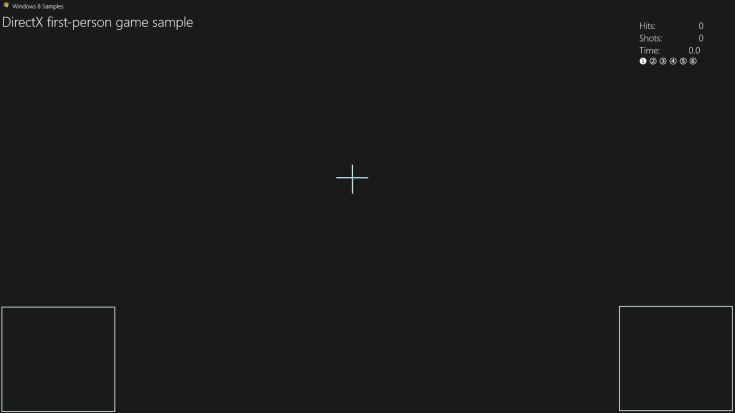
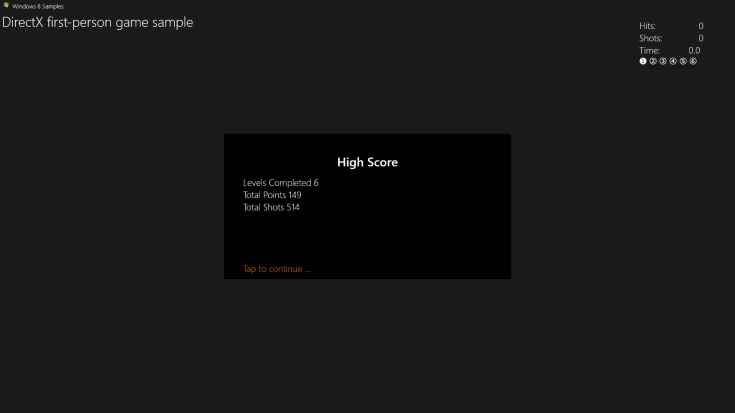
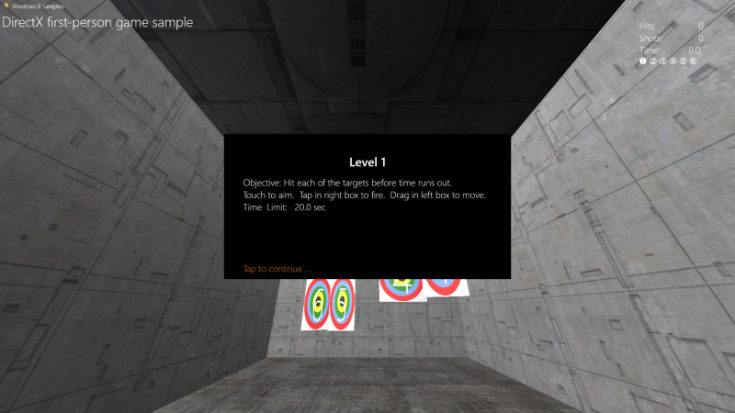

# 사용자 인터페이스 추가


\[ Windows 10의 UWP 앱에 맞게 업데이트되었습니다. Windows 8.x 문서는 [보관](http://go.microsoft.com/fwlink/p/?linkid=619132)을 참조하세요. \]

샘플 게임에서 주 게임 개체 및 기본 렌더링 프레임워크를 구현하는 방법을 살펴보았습니다. 이제 샘플 게임에서 플레이어의 게임 상태에 대한 피드백을 제공하는 방법을 살펴보겠습니다. 여기서는 3D 그래픽 파이프라인 출력의 맨 위에 간단한 메뉴 옵션 및 주의 표시 구성 요소를 추가하는 방법에 대해 알아봅니다.

## 목표


-   기본 사용자 인터페이스 그래픽 및 동작을 UWP(유니버설 Windows 플랫폼) DirectX 게임에 추가합니다.

## 사용자 인터페이스 오버레이


DirectX 게임에 텍스트 및 사용자 인터페이스 요소를 표시하는 방법은 많이 있지만 여기서는 한 가지 [Direct2D](https://msdn.microsoft.com/library/windows/apps/dd370990.aspx)(텍스트 요소에 대한 [DirectWrite](https://msdn.microsoft.com/library/windows/desktop/dd368038) 포함)를 중점적으로 살펴보겠습니다.

먼저 Direct2D가 아닌 경우를 명확히 살펴보겠습니다. Direct2D는 HTML이나 XAML 같은 사용자 인터페이스나 레이아웃을 위해 특별히 디자인된 것이 아닙니다. 또한 목록 상자나 단추 같은 사용자 인터페이스 구성 요소를 제공하지 않으며 div, 테이블, 그리드 같은 레이아웃 구성 요소도 제공하지 않습니다.

Direct2D는 픽셀 기반 기본 그래픽 및 효과를 그리는 데 사용되는 2D 그리기 API입니다. Direct2D를 시작하기만 하면 매우 간단합니다. 복잡한 레이아웃 및 인터페이스 동작에는 시간과 계획이 필요합니다. 시뮬레이션 및 전략 게임처럼 게임을 재생하는 데 복잡한 사용자 인터페이스가 필요한 경우 XAML을 대신 사용해 보세요.

UWP DirectX 게임에서 XAML을 사용하여 사용자 인터페이스를 개발하는 방법에 대한 자세한 내용은 [게임 샘플 확장](tutorial-resources.md)을 참조하세요.

이 게임 샘플에는 점수와 게임 내 제어를 위한 주의 표시와 게임 상태 텍스트 및 옵션(일시 중단 정보 및 수준 시작 옵션 등)을 표시하는 데 사용되는 오버레이라는 두 개의 주요 UI 구성 요소가 있습니다.

### 주의 표시에 Direct2D 사용

다음은 게임 화면 효과가 없는 게임 샘플의 게임 내 주의 표시입니다. 이 표시는 단순하고 깔끔하여 플레이어가 3D 세계 탐색 및 타겟 사격에만 집중할 수 있습니다. 뛰어난 인터페이스나 주의 표시는 플레이어가 게임에서 이벤트를 처리하고 대응하는 능력을 방해하면 안 됩니다.



알 수 있듯이 오버레이는 기본 항목인 십자 모양의 교차하는 선 세그먼트 두 개와 [이동-보기 컨트롤러](tutorial--adding-controls.md)의 사각형 두 개로 구성됩니다. 오른쪽 위에 있는 DirectWrite 텍스트는 현재 성공한 명중 수, 플레이어의 사격 수, 레벨의 남은 시간 및 현재 레벨 번호를 플레이어에게 알려줍니다. 오버레이의 게임 내 주의 표시 상태는 **GameHud** 클래스의 **Render** 메서드로 그리며 다음과 같이 코딩됩니다.

```cpp
void GameHud::Render(
    _In_ Simple3DGame^ game,
    _In_ ID2D1DeviceContext* d2dContext,
    _In_ Windows::Foundation::Rect windowBounds
    )
{
    if (m_showTitle)
    {
        d2dContext->DrawBitmap(
            m_logoBitmap.Get(),
            D2D1::RectF(
                GameConstants::Margin,
                GameConstants::Margin,
                m_logoSize.width + GameConstants::Margin,
                m_logoSize.height + GameConstants::Margin
                )
            );
        d2dContext->DrawTextLayout(
            Point2F(m_logoSize.width + 2.0f * GameConstants::Margin, GameConstants::Margin),
            m_titleHeaderLayout.Get(),
            m_textBrush.Get()
            );
        d2dContext->DrawTextLayout(
            Point2F(GameConstants::Margin, m_titleBodyVerticalOffset),
            m_titleBodyLayout.Get(),
            m_textBrush.Get()
            );
    }

    if (game != nullptr)
    {
        // This section is only used after the game state has been initialized.
        static const int bufferLength = 256;
        static char16 wsbuffer[bufferLength];
        int length = swprintf_s(
            wsbuffer,
            bufferLength,
            L"Hits:\t%10d\nShots:\t%10d\nTime:\t%8.1f",
            game->TotalHits(),
            game->TotalShots(),
            game->TimeRemaining()
            );

        d2dContext->DrawText(
            wsbuffer,
            length,
            m_textFormatBody.Get(),
            D2D1::RectF(
                windowBounds.Width - GameConstants::HudRightOffset,
                GameConstants::HudTopOffset,
                windowBounds.Width,
                GameConstants::HudTopOffset + (GameConstants::HudBodyPointSize + GameConstants::Margin) * 3
                ),
            m_textBrush.Get()
            );

        // Using the unicode characters starting at 0x2780 ( ➀ ) for the consecutive levels of the game.
        // For completed levels, start with 0x278A ( ➊ ) (This is 0x2780 + 10).
        uint32 levelCharacter[6];
        for (uint32 i = 0; i < 6; i++)
        {
            levelCharacter[i] = 0x2780 + i + ((static_cast<uint32>(game->LevelCompleted()) == i) ? 10 : 0);
        }
        length = swprintf_s(
            wsbuffer,
            bufferLength,
            L"%lc %lc %lc %lc %lc %lc",
            levelCharacter[0],
            levelCharacter[1],
            levelCharacter[2],
            levelCharacter[3],
            levelCharacter[4],
            levelCharacter[5]
            );
        d2dContext->DrawText(
            wsbuffer,
            length,
            m_textFormatBodySymbol.Get(),
            D2D1::RectF(
                windowBounds.Width - GameConstants::HudRightOffset,
                GameConstants::HudTopOffset + (GameConstants::HudBodyPointSize + GameConstants::Margin) * 3 + GameConstants::Margin,
                windowBounds.Width,
                GameConstants::HudTopOffset + (GameConstants::HudBodyPointSize+ GameConstants::Margin) * 4
                ),
            m_textBrush.Get()
            );

        if (game->IsActivePlay())
        {
            // Draw a rectangle for the touch input for the move control.
            d2dContext->DrawRectangle(
                D2D1::RectF(
                    0.0f,
                    windowBounds.Height - GameConstants::TouchRectangleSize,
                    GameConstants::TouchRectangleSize,
                    windowBounds.Height
                    ),
                m_textBrush.Get()
                );
            // Draw a rectangle for the touch input for the fire control.
            d2dContext->DrawRectangle(
                D2D1::RectF(
                    windowBounds.Width - GameConstants::TouchRectangleSize,
                    windowBounds.Height - GameConstants::TouchRectangleSize,
                    windowBounds.Width,
                    windowBounds.Height
                    ),
                m_textBrush.Get()
                );

            // Draw the cross hairs.
            d2dContext->DrawLine(
                D2D1::Point2F(windowBounds.Width / 2.0f - GameConstants::CrossHairHalfSize, windowBounds.Height / 2.0f),
                D2D1::Point2F(windowBounds.Width / 2.0f + GameConstants::CrossHairHalfSize, windowBounds.Height / 2.0f),
                m_textBrush.Get(),
                3.0f
                );
            d2dContext->DrawLine(
                D2D1::Point2F(windowBounds.Width / 2.0f, windowBounds.Height / 2.0f - GameConstants::CrossHairHalfSize),
                D2D1::Point2F(windowBounds.Width / 2.0f, windowBounds.Height / 2.0f + GameConstants::CrossHairHalfSize),
                m_textBrush.Get(),
                3.0f
                );
        }
    }
}
```

이 코드에서는 오버레이에 대해 설정된 Direct2D 렌더링 대상이 명중 수, 남은 시간 및 수준 번호를 반영하도록 업데이트됩니다. 사각형은 [**DrawRect**](https://msdn.microsoft.com/library/windows/desktop/dd371902)를 호출하여 그리고 십자 모양은 한 쌍의 [**DrawLine**](https://msdn.microsoft.com/library/windows/desktop/dd371895)을 호출하여 그립니다.

> **참고** **GameHud::Render** 호출에서는 주 창 사각형의 크기를 포함하는 [**Windows::Foundation::Rect**](https://msdn.microsoft.com/library/windows/apps/br225994) 매개 변수를 사용합니다. 여기서는 DIP(디바이스 독립적 픽셀) 측정값에서 창 크기 가져오기 같은 UI 프로그래밍의 필수적인 부분을 보여 줍니다. 이때 DIP는 1인치의 1/96로 정의됩니다. Direct2D에서는 그리기가 수행될 때 실제 픽셀에 맞춰 그리기 단위의 크기를 조정하며 Windows DPI(인치당 도트 수) 설정을 사용하여 이 작업을 수행합니다. 마찬가지로 DirectWrite를 사용하여 텍스트를 그리는 경우에도 글꼴 크기에 대한 포인트가 아닌 DIP를 지정합니다. DIP는 부동 소수점 수로 표현됩니다.

 

### 오버레이에 게임 상태 정보 표시

이 주의 표시 외에도 게임 샘플에는 5가지 게임 상태를 나타내는 오버레이가 있습니다. 이 상태는 모두 플레이어가 읽어야 하는 텍스트가 포함된 큰 검은색 사각형으로 되어 있습니다. 이동-보기 컨트롤러 사각형은 이러한 상태에서 활성화되지 않으므로 그려지지 않습니다. 이러한 오버레이 상태는 다음과 같습니다.

-   게임 시작 오버레이입니다. 플레이어가 게임을 시작하면 표시됩니다. 게임 세션에서 최고 점수가 포함되어 있습니다.

    

-   일시 정지 상태.

    

-   레벨 시작 상태. 플레이어가 새 레벨을 시작하면 표시됩니다.

    

-   게임 종료 상태. 플레이어가 레벨에 실패하면 표시됩니다.

    

-   게임 시작 표시 상태. 플레이어가 게임에 승리하면 표시됩니다. 플레이어가 달성한 최종 점수가 포함되어 있습니다.

    

이러한 5가지 상태에 대해 오버레이를 초기화하고 그리는 방법을 살펴보겠습니다.

### 오버레이 초기화 및 그리기

5가지 명시적 상태에는 공통된 점이 있습니다. 첫 번째는 모두 화면의 가운데에 있는 검은색 사각형을 배경으로 사용한다는 점이고, 두 번째는 표시된 텍스트가 제목 텍스트 또는 본문 텍스트라는 점, 세 번째는 텍스트에서 맑은 고딕 글꼴을 사용하고 배경 사각형 위에 그려진다는 점입니다. 따라서 필요한 리소스와 해당 리소스를 구현하는 메서드가 매우 유사합니다.

게임 샘플에는 4개의 메서드(**GameInfoOverlay::Initialize**, **GameInfoOverlay::SetDpi**, **GameInfoOverlay::RecreateDirectXResources** 및 **GameInfoOverlay::RecreateDpiDependentResources**)가 있으며 각각 초기화하고, 인치당 도트 수를 설정하고, DirectWrite 리소스(텍스트 요소)를 다시 만들고, 이 오버레이 표시를 생성하는 데 사용됩니다. 다음은 이러한 4개 메서드에 대한 코드입니다.

```cpp
void GameInfoOverlay::Initialize(
    _In_ ID2D1Device*         d2dDevice,
    _In_ ID2D1DeviceContext*  d2dContext,
    _In_ IDWriteFactory*      dwriteFactory,
    _In_ float                dpi)
{
    m_initialized = true;

    m_dwriteFactory = dwriteFactory;
    m_dpi = dpi;
    m_d2dDevice = d2dDevice;
    m_d2dContext = d2dContext;

    ComPtr<ID2D1Factory> factory;
    d2dDevice->GetFactory(&factory);

    DX::ThrowIfFailed(
        factory.As(&m_d2dFactory)
        );

    RecreateDirectXResources();
}
```

```cpp
void GameInfoOverlay::SetDpi(float dpi)
{
    if (m_initialized)
    {
        if (dpi != m_dpi)
        {
            m_dpi = dpi;
            RecreateDpiDependentResources();
        }
    }
}
```

```cpp
void GameInfoOverlay::RecreateDirectXResources()
{
    if (!m_initialized)
    {
        return;
    }

    // Create D2D Resources.
    DX::ThrowIfFailed(
        m_dwriteFactory->CreateTextFormat(
            L"Segoe UI",
            nullptr,
            DWRITE_FONT_WEIGHT_MEDIUM,
            DWRITE_FONT_STYLE_NORMAL,
            DWRITE_FONT_STRETCH_NORMAL,
            32,         // font size
            L"en-us",   // locale
            &m_textFormatTitle
            )
        );

    DX::ThrowIfFailed(
        m_dwriteFactory->CreateTextFormat(
            L"Segoe UI",
            nullptr,
            DWRITE_FONT_WEIGHT_LIGHT,
            DWRITE_FONT_STYLE_NORMAL,
            DWRITE_FONT_STRETCH_NORMAL,
            24,         // font size
            L"en-us",   // locale
            &m_textFormatBody
            )
        );

    DX::ThrowIfFailed(
        m_textFormatTitle->SetTextAlignment(DWRITE_TEXT_ALIGNMENT_CENTER)
        );
    DX::ThrowIfFailed(
        m_textFormatTitle->SetParagraphAlignment(DWRITE_PARAGRAPH_ALIGNMENT_NEAR)
        );
    DX::ThrowIfFailed(
        m_textFormatBody->SetTextAlignment(DWRITE_TEXT_ALIGNMENT_LEADING)
        );
    DX::ThrowIfFailed(
        m_textFormatBody->SetParagraphAlignment(DWRITE_PARAGRAPH_ALIGNMENT_NEAR)
        );

    DX::ThrowIfFailed(
        m_d2dContext->CreateSolidColorBrush(
            D2D1::ColorF(D2D1::ColorF::White),
            &m_textBrush
            )
        );
    DX::ThrowIfFailed(
        m_d2dContext->CreateSolidColorBrush(
            D2D1::ColorF(D2D1::ColorF::Black),
            &m_backgroundBrush
            )
        );
     DX::ThrowIfFailed(
        m_d2dContext->CreateSolidColorBrush(
            D2D1::ColorF(0xdb7100, 1.0f),
            &m_actionBrush
            )
        );

     RecreateDpiDependentResources();
}
```

```cpp
void GameInfoOverlay::RecreateDpiDependentResources()
{
    m_levelBitmap = nullptr;

    // Create a D2D bitmap to be used for Game Info Overlay when waiting to
    // start a level or to display game statistics.
    D2D1_BITMAP_PROPERTIES1 properties;
    properties.pixelFormat.format = DXGI_FORMAT_B8G8R8A8_UNORM;
    properties.pixelFormat.alphaMode = D2D1_ALPHA_MODE_PREMULTIPLIED;
    properties.dpiX = m_dpi;
    properties.dpiY = m_dpi;
    properties.bitmapOptions = D2D1_BITMAP_OPTIONS_TARGET;
    properties.colorContext = nullptr;
    DX::ThrowIfFailed(
        m_d2dContext->CreateBitmap(
            D2D1::SizeU(
                static_cast<UINT32>(GameInfoOverlayConstant::Width * m_dpi / 96.0f),
                static_cast<UINT32>(GameInfoOverlayConstant::Height * m_dpi / 96.0f)
                ),
            nullptr,
            0,
            &properties,
            &m_levelBitmap
            )
        );
    m_d2dContext->SetTarget(m_levelBitmap.Get());
    m_d2dContext->BeginDraw();
    m_d2dContext->SetTransform(D2D1::Matrix3x2F::Identity());
    m_d2dContext->Clear(D2D1::ColorF(D2D1::ColorF::Black));
    HRESULT hr = m_d2dContext->EndDraw();
    if (hr != D2DERR_RECREATE_TARGET)
    {
        // The D2DERR_RECREATE_TARGET indicates there has been a problem with the underlying
        // D3D device.  All subsequent rendering will be ignored until the device is recreated.
        // This error will be propagated and the appropriate D3D error will be returned from the
        // swapchain->Present(...) call.   At that point, the sample will recreate the device
        // and all associated resources.  As a result, the D2DERR_RECREATE_TARGET doesn't
        // need to be handled here.
        DX::ThrowIfFailed(hr);
    }
}

```

**Initialize** 메서드는 해당 메서드에 전달된 [**ID2D1Device**](https://msdn.microsoft.com/library/windows/desktop/hh404478) 개체에서 팩터리를 가져와 오버레이 개체 자체에서 그릴 수 있는 [**ID2D1DeviceContext**](https://msdn.microsoft.com/library/windows/desktop/hh404479)를 만드는 데 사용하고 **m\_dWriteFactory** 필드를 제공된 [**IDWriteFactory**](https://msdn.microsoft.com/library/windows/desktop/dd368183) 참조로 설정합니다. 컨텍스트에 대한 DPI도 설정합니다. 그런 다음 **RecreateDeviceResources**를 호출하여 오버레이를 어셈블하고 그립니다.

**RecreateDeviceResources**는 DirectWrite 팩터리 개체를 사용하여 오버레이에 표시된 제목 및 본문 텍스트 문자열에 대한 포맷터(브러시)를 만듭니다. 텍스트를 그리는 흰색 브러시, 배경을 그리는 검은색 브러시 및 작업 메시지를 그리는 주황색 브러시를 만듭니다. 그런 다음 **RecreateDpiDependentResources**를 호출하여 텍스트를 그릴 비트맵을 준비합니다([**ID2D1DeviceContext::CreateBitmap**](https://msdn.microsoft.com/library/windows/desktop/hh404480) 호출). 마지막으로 **RecreateDpiDependentResources**는 Direct2D 디바이스 컨텍스트의 렌더링 대상을 비트맵으로 설정하고 지운 다음 비트맵의 각 픽셀을 검은색으로 설정합니다.

이제 오버레이에 몇 가지 텍스트만 표시하면 됩니다.

### 오버레이에 게임 상태 표시

게임 샘플에 있는 5가지 오버레이의 **GameInfoOverlay** 개체에는 각각 해당하는 메서드가 있습니다. 이러한 메서드는 오버레이의 변형을 그려 게임 자체에 대한 명시적 정보를 플레이어에게 전달합니다. 물론 이러한 전달은 제목 문자열과 본문 문자열의 두 문자열로 표현됩니다. 샘플은 **RecreateDeviceResources** 메서드에서 이 정보에 대한 리소스 및 레이아웃을 이미 구성했으므로 오버레이 상태 관련 문자열만 제공하면 됩니다.

이제 **GameInfoOverlay** 클래스 정의에서 샘플은 다음과 같이 오버레이의 특정 영역에 해당하는 세 개의 사각형 영역을 선언했습니다.

```cpp
static const D2D1_RECT_F titleRectangle = D2D1::RectF(50.0f, 50.0f, GameInfoOverlayConstant::Width - 50.0f, 100.0f);
static const D2D1_RECT_F bodyRectangle = D2D1::RectF(50.0f, 110.0f, GameInfoOverlayConstant::Width - 50.0f, GameInfoOverlayConstant::Height - 50.0f);
static const D2D1_RECT_F actionRectangle = D2D1::RectF(50.0f, GameInfoOverlayConstant::Height - 45.0f, GameInfoOverlayConstant::Width - 50.0f, GameInfoOverlayConstant::Height - 5.0f);
```

이러한 영역은 각각 특정 용도로 사용됩니다.

-   **titleRectangle**에는 제목 텍스트가 그려집니다.
-   **bodyRectangle**에는 본문 텍스트가 그려집니다.
-   **actionRectangle**에는 플레이어에 특정 작업을 수행하도록 알리는 텍스트가 그려집니다. 이 영역은 오버레이 비트맵의 왼쪽 아래에 있습니다.

이러한 영역에 주의하면서 상태 관련 메서드 중 하나인 **GameInfoOverlay::SetGameStats**에 대해 살펴보고 오버레이를 그리는 방법을 알아보겠습니다.

```cpp
void GameInfoOverlay::SetGameStats(int maxLevel, int hitCount, int shotCount)
{
    int length;
    Platform::String^ string;

    m_d2dContext->SetTarget(m_levelBitmap.Get());
    m_d2dContext->BeginDraw();
    m_d2dContext->SetTransform(D2D1::Matrix3x2F::Identity());
    m_d2dContext->FillRectangle(&titleRectangle, m_backgroundBrush.Get());
    m_d2dContext->FillRectangle(&bodyRectangle, m_backgroundBrush.Get());
    string = "High Score";

    m_d2dContext->DrawText(
        string->Data(),
        string->Length(),
        m_textFormatTitle.Get(),
        titleRectangle,
        m_textBrush.Get()
        );
    length = swprintf_s(
        wsbuffer,
        bufferLength,
        L"Levels Completed %d\nTotal Points %d\nTotal Shots %d",
        maxLevel,
        hitCount,
        shotCount
        );
    string = ref new Platform::String(wsbuffer, length);
    m_d2dContext->DrawText(
        string->Data(),
        string->Length(),
        m_textFormatBody.Get(),
        bodyRectangle,
        m_textBrush.Get()
        );
    HRESULT hr = m_d2dContext->EndDraw();
    if (hr != D2DERR_RECREATE_TARGET)
    {
        // The D2DERR_RECREATE_TARGET indicates there has been a problem with the underlying
        // D3D device.  All subsequent rendering will be ignored until the device is recreated.
        // This error will be propagated and the appropriate D3D error will be returned from the
        // swapchain->Present(...) call.   At that point, the sample will recreate the device
        // and all associated resources.  As a result, the D2DERR_RECREATE_TARGET doesn't
        // need to be handled here.
        DX::ThrowIfFailed(hr);
    }
}
```

**GameInfoOverlay** 개체가 **Initialize** 및 **RecreateDirectXResources**를 사용하여 초기화하고 구성한 Direct2D 디바이스 컨텍스트를 사용하여 이 메서드는 배경 브러시를 통해 검은색으로 제목 및 본문 사각형을 채웁니다. 이 메서드는 흰색 텍스트 브러시를 사용하여 "High Score" 문자열에 대한 텍스트를 제목 사각형에 그리고 게임 상태 업데이트 정보를 포함하는 문자열을 본문 사각형에 그립니다.

작업 사각형은 다음에 **DirectXApp** 개체의 메서드에서 **GameInfoOverlay::SetAction**을 호출하여 업데이트하며, 이 사각형은 **SetAction**에서 플레이어에게 적합한 메시지(예: "계속하려면 탭하세요.")를 결정하는 데 필요한 게임 상태 정보를 제공합니다.

지정된 상태에 대한 오버레이는 다음과 같이 **DirectXApp**의 **SetGameInfoOverlay** 메서드에서 선택합니다.

```cpp
void DirectXApp::SetGameInfoOverlay(GameInfoOverlayState state)
{
    m_gameInfoOverlayState = state;
    switch (state)
    {
    case GameInfoOverlayState::Loading:
        m_renderer->InfoOverlay()->SetGameLoading(m_loadingCount);
        break;

    case GameInfoOverlayState::GameStats:
        m_renderer->InfoOverlay()->SetGameStats(
            m_game->HighScore().levelCompleted + 1,
            m_game->HighScore().totalHits,
            m_game->HighScore().totalShots
            );
        break;

    case GameInfoOverlayState::LevelStart:
        m_renderer->InfoOverlay()->SetLevelStart(
            m_game->LevelCompleted() + 1,
            m_game->CurrentLevel()->Objective(),
            m_game->CurrentLevel()->TimeLimit(),
            m_game->BonusTime()
            );
        break;

    case GameInfoOverlayState::GameOverCompleted:
        m_renderer->InfoOverlay()->SetGameOver(
            true,
            m_game->LevelCompleted() + 1,
            m_game->TotalHits(),
            m_game->TotalShots(),
            m_game->HighScore().totalHits
            );
        break;

    case GameInfoOverlayState::GameOverExpired:
        m_renderer->InfoOverlay()->SetGameOver(
            false,
            m_game->LevelCompleted(),
            m_game->TotalHits(),
            m_game->TotalShots(),
            m_game->HighScore().totalHits
            );
        break;

    case GameInfoOverlayState::Pause:
        m_renderer->InfoOverlay()->SetPause();
        break;
    }
}
```

이제 게임 샘플에서 게임 상태에 따라 텍스트 정보를 플레이어에게 전달할 수 있습니다.

### 다음 단계

다음 항목인 [컨트롤 추가](tutorial--adding-controls.md)에서는 플레이어가 게임 샘플과 상호 작용하는 방법 및 입력을 통해 게임 상태를 변경하는 방법에 대해 살펴봅니다.

### 이 섹션에 대한 전체 샘플 코드

GameHud.h

```cpp
//// THIS CODE AND INFORMATION IS PROVIDED "AS IS" WITHOUT WARRANTY OF
//// ANY KIND, EITHER EXPRESSED OR IMPLIED, INCLUDING BUT NOT LIMITED TO
//// THE IMPLIED WARRANTIES OF MERCHANTABILITY AND/OR FITNESS FOR A
//// PARTICULAR PURPOSE.
////
//// Copyright (c) Microsoft Corporation. All rights reserved

#pragma once

#include "Simple3DGame.h"
#include "DirectXSample.h"

ref class Simple3DGame;

ref class GameHud
{
internal:
    GameHud(
        _In_ Platform::String^ titleHeader,
        _In_ Platform::String^ titleBody
        );

    void CreateDeviceIndependentResources(
        _In_ IDWriteFactory* dwriteFactory,
        _In_ IWICImagingFactory* wicFactory
        );

    void CreateDeviceResources(_In_ ID2D1DeviceContext* d2dContext);
    void UpdateForWindowSizeChange(_In_ Windows::Foundation::Rect windowBounds);
    void Render(
        _In_ Simple3DGame^ game,
        _In_ ID2D1DeviceContext* d2dContext,
        _In_ Windows::Foundation::Rect windowBounds
        );

private:
    Microsoft::WRL::ComPtr<IDWriteFactory>              m_dwriteFactory;
    Microsoft::WRL::ComPtr<IWICImagingFactory>          m_wicFactory;

    Microsoft::WRL::ComPtr<ID2D1SolidColorBrush>        m_textBrush;
    Microsoft::WRL::ComPtr<IDWriteTextFormat>           m_textFormatBody;
    Microsoft::WRL::ComPtr<IDWriteTextFormat>           m_textFormatBodySymbol;

    Microsoft::WRL::ComPtr<IDWriteTextFormat>           m_textFormatTitleHeader;
    Microsoft::WRL::ComPtr<IDWriteTextFormat>           m_textFormatTitleBody;
    Microsoft::WRL::ComPtr<ID2D1Bitmap>                 m_logoBitmap;
    Microsoft::WRL::ComPtr<IDWriteTextLayout>           m_titleHeaderLayout;
    Microsoft::WRL::ComPtr<IDWriteTextLayout>           m_titleBodyLayout;

    bool                                                m_showTitle;
    Platform::String^                                   m_titleHeader;
    Platform::String^                                   m_titleBody;

    float                                               m_titleBodyVerticalOffset;
    D2D1_SIZE_F                                         m_logoSize;
    D2D1_SIZE_F                                         m_maxTitleSize;
};
```

GameHud.cpp

```cpp
//// THIS CODE AND INFORMATION IS PROVIDED "AS IS" WITHOUT WARRANTY OF
//// ANY KIND, EITHER EXPRESSED OR IMPLIED, INCLUDING BUT NOT LIMITED TO
//// THE IMPLIED WARRANTIES OF MERCHANTABILITY AND/OR FITNESS FOR A
//// PARTICULAR PURPOSE.
////
//// Copyright (c) Microsoft Corporation. All rights reserved

#include "pch.h"
#include "GameHud.h"
#include "GameConstants.h"

using namespace Microsoft::WRL;
using namespace Windows::UI::Core;
using namespace Windows::ApplicationModel;
using namespace Windows::Foundation;
using namespace Windows::Storage;
using namespace Windows::UI::ViewManagement;
using namespace Windows::Graphics::Display;
using namespace D2D1;

//----------------------------------------------------------------------

GameHud::GameHud(
    _In_ Platform::String^ titleHeader,
    _In_ Platform::String^ titleBody
    )
{
    m_titleHeader = titleHeader;
    m_titleBody = titleBody;

    m_showTitle = true;
    m_titleBodyVerticalOffset = GameConstants::Margin;
    m_logoSize = D2D1::SizeF(0.0f, 0.0f);
}

//----------------------------------------------------------------------

void GameHud::CreateDeviceIndependentResources(
    _In_ IDWriteFactory* dwriteFactory,
    _In_ IWICImagingFactory* wicFactory
    )
{
    m_dwriteFactory = dwriteFactory;
    m_wicFactory = wicFactory;

    DX::ThrowIfFailed(
        m_dwriteFactory->CreateTextFormat(
            L"Segoe UI",
            nullptr,
            DWRITE_FONT_WEIGHT_LIGHT,
            DWRITE_FONT_STYLE_NORMAL,
            DWRITE_FONT_STRETCH_NORMAL,
            GameConstants::HudBodyPointSize,
            L"en-us",
            &m_textFormatBody
            )
        );
    DX::ThrowIfFailed(
        m_dwriteFactory->CreateTextFormat(
            L"Segoe UI Symbol",
            nullptr,
            DWRITE_FONT_WEIGHT_LIGHT,
            DWRITE_FONT_STYLE_NORMAL,
            DWRITE_FONT_STRETCH_NORMAL,
            GameConstants::HudBodyPointSize,
            L"en-us",
            &m_textFormatBodySymbol
            )
        );
    DX::ThrowIfFailed(
        m_dwriteFactory->CreateTextFormat(
            L"Segoe UI Light",
            nullptr,
            DWRITE_FONT_WEIGHT_LIGHT,
            DWRITE_FONT_STYLE_NORMAL,
            DWRITE_FONT_STRETCH_NORMAL,
            GameConstants::HudTitleHeaderPointSize,
            L"en-us",
            &m_textFormatTitleHeader
            )
        );
    DX::ThrowIfFailed(
        m_dwriteFactory->CreateTextFormat(
            L"Segoe UI Light",
            nullptr,
            DWRITE_FONT_WEIGHT_LIGHT,
            DWRITE_FONT_STYLE_NORMAL,
            DWRITE_FONT_STRETCH_NORMAL,
            GameConstants::HudTitleBodyPointSize,
            L"en-us",
            &m_textFormatTitleBody
            )
        );

    DX::ThrowIfFailed(m_textFormatBody->SetTextAlignment(DWRITE_TEXT_ALIGNMENT_LEADING));
    DX::ThrowIfFailed(m_textFormatBody->SetParagraphAlignment(DWRITE_PARAGRAPH_ALIGNMENT_NEAR));
    DX::ThrowIfFailed(m_textFormatBodySymbol->SetTextAlignment(DWRITE_TEXT_ALIGNMENT_LEADING));
    DX::ThrowIfFailed(m_textFormatBodySymbol->SetParagraphAlignment(DWRITE_PARAGRAPH_ALIGNMENT_NEAR));
    DX::ThrowIfFailed(m_textFormatTitleHeader->SetTextAlignment(DWRITE_TEXT_ALIGNMENT_LEADING));
    DX::ThrowIfFailed(m_textFormatTitleHeader->SetParagraphAlignment(DWRITE_PARAGRAPH_ALIGNMENT_NEAR));
    DX::ThrowIfFailed(m_textFormatTitleBody->SetTextAlignment(DWRITE_TEXT_ALIGNMENT_LEADING));
    DX::ThrowIfFailed(m_textFormatTitleBody->SetParagraphAlignment(DWRITE_PARAGRAPH_ALIGNMENT_NEAR));
}

//----------------------------------------------------------------------

void GameHud::CreateDeviceResources(_In_ ID2D1DeviceContext* d2dContext)
{
    auto location = Package::Current->InstalledLocation;
    Platform::String^ path = Platform::String::Concat(location->Path, "\\");
    path = Platform::String::Concat(path, "windows-sdk.png");

    ComPtr<IWICBitmapDecoder> wicBitmapDecoder;
    DX::ThrowIfFailed(
        m_wicFactory->CreateDecoderFromFilename(
            path->Data(),
            nullptr,
            GENERIC_READ,
            WICDecodeMetadataCacheOnDemand,
            &wicBitmapDecoder
            )
        );

    ComPtr<IWICBitmapFrameDecode> wicBitmapFrame;
    DX::ThrowIfFailed(
        wicBitmapDecoder->GetFrame(0, &wicBitmapFrame)
        );

    ComPtr<IWICFormatConverter> wicFormatConverter;
    DX::ThrowIfFailed(
        m_wicFactory->CreateFormatConverter(&wicFormatConverter)
        );

    DX::ThrowIfFailed(
        wicFormatConverter->Initialize(
            wicBitmapFrame.Get(),
            GUID_WICPixelFormat32bppPBGRA,
            WICBitmapDitherTypeNone,
            nullptr,
            0.0,
            WICBitmapPaletteTypeCustom  // The BGRA format has no palette, so this value is ignored.
            )
        );

    double dpiX = 96.0f;
    double dpiY = 96.0f;
    DX::ThrowIfFailed(
        wicFormatConverter->GetResolution(&dpiX, &dpiY)
        );

    // Create D2D Resources.
    DX::ThrowIfFailed(
        d2dContext->CreateBitmapFromWicBitmap(
            wicFormatConverter.Get(),
            BitmapProperties(
                PixelFormat(DXGI_FORMAT_B8G8R8A8_UNORM, D2D1_ALPHA_MODE_PREMULTIPLIED),
                static_cast<float>(dpiX),
                static_cast<float>(dpiY)
                ),
            &m_logoBitmap
            )
        );

    m_logoSize = m_logoBitmap->GetSize();

    DX::ThrowIfFailed(
        d2dContext->CreateSolidColorBrush(
            D2D1::ColorF(D2D1::ColorF::White),
            &m_textBrush
            )
        );
}

//----------------------------------------------------------------------

void GameHud::UpdateForWindowSizeChange(_In_ Windows::Foundation::Rect windowBounds)
{
    m_maxTitleSize.width = windowBounds.Width - GameConstants::HudSafeWidth;
    m_maxTitleSize.height = windowBounds.Height;

    float headerWidth = m_maxTitleSize.width - (m_logoSize.width + 2 * GameConstants::Margin);

    if (headerWidth > 0)
    {
        // Only resize the text layout for the Title area when there is enough space.
        m_showTitle = true;

        DX::ThrowIfFailed(
            m_dwriteFactory->CreateTextLayout(
                m_titleHeader->Data(),
                m_titleHeader->Length(),
                m_textFormatTitleHeader.Get(),
                headerWidth,
                m_maxTitleSize.height,
                &m_titleHeaderLayout
                )
            );

        DWRITE_TEXT_METRICS metrics = {0};
        DX::ThrowIfFailed(
            m_titleHeaderLayout->GetMetrics(&metrics)
            );

        // Compute the vertical size of the laid out header and logo.  This could change
        // based on the window size and the layout of the text.  In some cases, the text
        // may wrap.
        m_titleBodyVerticalOffset = max(m_logoSize.height + GameConstants::Margin * 2, metrics.height + 2 * GameConstants::Margin);

        DX::ThrowIfFailed(
            m_dwriteFactory->CreateTextLayout(
                m_titleBody->Data(),
                m_titleBody->Length(),
                m_textFormatTitleBody.Get(),
                m_maxTitleSize.width,
                m_maxTitleSize.height - m_titleBodyVerticalOffset,
                &m_titleBodyLayout
                )
            );
    }
    else
    {
        // Not enough horizontal space for the titles, so just turn it off.
        m_showTitle = false;
    }
}

//----------------------------------------------------------------------

void GameHud::Render(
    _In_ Simple3DGame^ game,
    _In_ ID2D1DeviceContext* d2dContext,
    _In_ Windows::Foundation::Rect windowBounds
    )
{
    if (m_showTitle)
    {
        d2dContext->DrawBitmap(
            m_logoBitmap.Get(),
            D2D1::RectF(
                GameConstants::Margin,
                GameConstants::Margin,
                m_logoSize.width + GameConstants::Margin,
                m_logoSize.height + GameConstants::Margin
                )
            );
        d2dContext->DrawTextLayout(
            Point2F(m_logoSize.width + 2.0f * GameConstants::Margin, GameConstants::Margin),
            m_titleHeaderLayout.Get(),
            m_textBrush.Get()
            );
        d2dContext->DrawTextLayout(
            Point2F(GameConstants::Margin, m_titleBodyVerticalOffset),
            m_titleBodyLayout.Get(),
            m_textBrush.Get()
            );
    }

    if (game != nullptr)
    {
        // This section is only used after the game state has been initialized.
        static const int bufferLength = 256;
        static char16 wsbuffer[bufferLength];
        int length = swprintf_s(
            wsbuffer,
            bufferLength,
            L"Hits:\t%10d\nShots:\t%10d\nTime:\t%8.1f",
            game->TotalHits(),
            game->TotalShots(),
            game->TimeRemaining()
            );

        d2dContext->DrawText(
            wsbuffer,
            length,
            m_textFormatBody.Get(),
            D2D1::RectF(
                windowBounds.Width - GameConstants::HudRightOffset,
                GameConstants::HudTopOffset,
                windowBounds.Width,
                GameConstants::HudTopOffset + (GameConstants::HudBodyPointSize + GameConstants::Margin) * 3
                ),
            m_textBrush.Get()
            );

        // Using the unicode characters starting at 0x2780 ( ➀ ) for the consecutive levels of the game.
        // For completed levels start with 0x278A ( ➊ ) (This is 0x2780 + 10).
        uint32 levelCharacter[6];
        for (uint32 i = 0; i < 6; i++)
        {
            levelCharacter[i] = 0x2780 + i + ((static_cast<uint32>(game->LevelCompleted()) == i) ? 10 : 0);
        }
        length = swprintf_s(
            wsbuffer,
            bufferLength,
            L"%lc %lc %lc %lc %lc %lc",
            levelCharacter[0],
            levelCharacter[1],
            levelCharacter[2],
            levelCharacter[3],
            levelCharacter[4],
            levelCharacter[5]
            );
        d2dContext->DrawText(
            wsbuffer,
            length,
            m_textFormatBodySymbol.Get(),
            D2D1::RectF(
                windowBounds.Width - GameConstants::HudRightOffset,
                GameConstants::HudTopOffset + (GameConstants::HudBodyPointSize + GameConstants::Margin) * 3 + GameConstants::Margin,
                windowBounds.Width,
                GameConstants::HudTopOffset + (GameConstants::HudBodyPointSize+ GameConstants::Margin) * 4
                ),
            m_textBrush.Get()
            );

        if (game->IsActivePlay())
        {
            // Draw a rectangle for the touch input for the move control.
            d2dContext->DrawRectangle(
                D2D1::RectF(
                    0.0f,
                    windowBounds.Height - GameConstants::TouchRectangleSize,
                    GameConstants::TouchRectangleSize,
                    windowBounds.Height
                    ),
                m_textBrush.Get()
                );
            // Draw a rectangle for the touch input for the fire control.
            d2dContext->DrawRectangle(
                D2D1::RectF(
                    windowBounds.Width - GameConstants::TouchRectangleSize,
                    windowBounds.Height - GameConstants::TouchRectangleSize,
                    windowBounds.Width,
                    windowBounds.Height
                    ),
                m_textBrush.Get()
                );

            // Draw the cross hairs.
            d2dContext->DrawLine(
                D2D1::Point2F(windowBounds.Width / 2.0f - GameConstants::CrossHairHalfSize, windowBounds.Height / 2.0f),
                D2D1::Point2F(windowBounds.Width / 2.0f + GameConstants::CrossHairHalfSize, windowBounds.Height / 2.0f),
                m_textBrush.Get(),
                3.0f
                );
            d2dContext->DrawLine(
                D2D1::Point2F(windowBounds.Width / 2.0f, windowBounds.Height / 2.0f - GameConstants::CrossHairHalfSize),
                D2D1::Point2F(windowBounds.Width / 2.0f, windowBounds.Height / 2.0f + GameConstants::CrossHairHalfSize),
                m_textBrush.Get(),
                3.0f
                );
        }
    }
}
```

GameInfoOverlay.h

```cpp
//// THIS CODE AND INFORMATION IS PROVIDED "AS IS" WITHOUT WARRANTY OF
//// ANY KIND, EITHER EXPRESSED OR IMPLIED, INCLUDING BUT NOT LIMITED TO
//// THE IMPLIED WARRANTIES OF MERCHANTABILITY AND/OR FITNESS FOR A
//// PARTICULAR PURPOSE.
////
//// Copyright (c) Microsoft Corporation. All rights reserved

#pragma once

namespace GameInfoOverlayConstant
{
    static const float Width    = 750.0f;
    static const float Height   = 380.0f;
};

enum class GameInfoOverlayCommand
{
    None,
    TapToContinue,
    PleaseWait,
    PlayAgain,
};

ref class GameInfoOverlay
{
internal:
    GameInfoOverlay();

    void Initialize(
        _In_ ID2D1Device*         d2dDevice,
        _In_ ID2D1DeviceContext*  d2dContext,
        _In_ IDWriteFactory*      dwriteFactory,
        _In_ float                dpi
        );

    void RecreateDirectXResources();
    void SetDpi(float dpi);

    void SetGameLoading(uint32 dots);
    void SetGameStats(int maxLevel, int hitCount, int shotCount);
    void SetGameOver(bool win, int maxLevel, int hitCount, int shotCount, int highScore);
    void SetLevelStart(int level, Platform::String^ objective, float timeLimit, float bonusTime);
    void SetPause();
    void SetAction(GameInfoOverlayCommand action);
    void HideGameInfoOverlay() { m_visible = false; };
    void ShowGameInfoOverlay() { m_visible = true; };
    bool Visible() { return m_visible; };
    ID2D1Bitmap1* Bitmap() { return m_levelBitmap.Get(); }

private:
    void RecreateDpiDependentResources();

    bool                                            m_initialized;
    float                                           m_dpi;
    bool                                            m_visible;

    Microsoft::WRL::ComPtr<ID2D1Factory1>           m_d2dFactory;
    Microsoft::WRL::ComPtr<ID2D1Device>             m_d2dDevice;
    Microsoft::WRL::ComPtr<ID2D1DeviceContext>      m_d2dContext;
    Microsoft::WRL::ComPtr<IDWriteFactory>          m_dwriteFactory;

    Microsoft::WRL::ComPtr<ID2D1Bitmap1>            m_levelBitmap;
    Microsoft::WRL::ComPtr<IDWriteTextFormat>       m_textFormatTitle;
    Microsoft::WRL::ComPtr<IDWriteTextFormat>       m_textFormatBody;
    Microsoft::WRL::ComPtr<ID2D1SolidColorBrush>    m_textBrush;
    Microsoft::WRL::ComPtr<ID2D1SolidColorBrush>    m_backgroundBrush;
    Microsoft::WRL::ComPtr<ID2D1SolidColorBrush>    m_actionBrush;
};
```

GameInfoOverlay.cpp

```cpp
//// THIS CODE AND INFORMATION IS PROVIDED "AS IS" WITHOUT WARRANTY OF
//// ANY KIND, EITHER EXPRESSED OR IMPLIED, INCLUDING BUT NOT LIMITED TO
//// THE IMPLIED WARRANTIES OF MERCHANTABILITY AND/OR FITNESS FOR A
//// PARTICULAR PURPOSE.
////
//// Copyright (c) Microsoft Corporation. All rights reserved

#include "pch.h"
#include "GameInfoOverlay.h"
#include "DirectXSample.h"

using namespace Windows::UI::Core;
using namespace Windows::Foundation;
using namespace Microsoft::WRL;
using namespace Windows::UI::ViewManagement;
using namespace Windows::Graphics::Display;
using namespace D2D1;

static const D2D1_RECT_F titleRectangle = D2D1::RectF(50.0f, 50.0f, GameInfoOverlayConstant::Width - 50.0f, 100.0f);
static const D2D1_RECT_F bodyRectangle = D2D1::RectF(50.0f, 110.0f, GameInfoOverlayConstant::Width - 50.0f, GameInfoOverlayConstant::Height - 50.0f);
static const D2D1_RECT_F actionRectangle = D2D1::RectF(50.0f, GameInfoOverlayConstant::Height - 45.0f, GameInfoOverlayConstant::Width - 50.0f, GameInfoOverlayConstant::Height - 5.0f);
static const int bufferLength = 1000;
static char16 wsbuffer[bufferLength];

GameInfoOverlay::GameInfoOverlay():
    m_initialized(false),
    m_visible(false)
{
}
//----------------------------------------------------------------------
void GameInfoOverlay::Initialize(
    _In_ ID2D1Device*         d2dDevice,
    _In_ ID2D1DeviceContext*  d2dContext,
    _In_ IDWriteFactory*      dwriteFactory,
    _In_ float                dpi)
{
    m_initialized = true;

    m_dwriteFactory = dwriteFactory;
    m_dpi = dpi;
    m_d2dDevice = d2dDevice;
    m_d2dContext = d2dContext;

    ComPtr<ID2D1Factory> factory;
    d2dDevice->GetFactory(&factory);

    DX::ThrowIfFailed(
        factory.As(&m_d2dFactory)
        );

    RecreateDirectXResources();
}
//----------------------------------------------------------------------
void GameInfoOverlay::SetDpi(float dpi)
{
    if (m_initialized)
    {
        if (dpi != m_dpi)
        {
            m_dpi = dpi;
            RecreateDpiDependentResources();
        }
    }
}
//----------------------------------------------------------------------
void GameInfoOverlay::RecreateDirectXResources()
{
    if (!m_initialized)
    {
        return;
    }

    // Create D2D resources.
    DX::ThrowIfFailed(
        m_dwriteFactory->CreateTextFormat(
            L"Segoe UI",
            nullptr,
            DWRITE_FONT_WEIGHT_MEDIUM,
            DWRITE_FONT_STYLE_NORMAL,
            DWRITE_FONT_STRETCH_NORMAL,
            32,         // font size
            L"en-us",   // locale
            &m_textFormatTitle
            )
        );

    DX::ThrowIfFailed(
        m_dwriteFactory->CreateTextFormat(
            L"Segoe UI",
            nullptr,
            DWRITE_FONT_WEIGHT_LIGHT,
            DWRITE_FONT_STYLE_NORMAL,
            DWRITE_FONT_STRETCH_NORMAL,
            24,         // font size
            L"en-us",   // locale
            &m_textFormatBody
            )
        );

    DX::ThrowIfFailed(
        m_textFormatTitle->SetTextAlignment(DWRITE_TEXT_ALIGNMENT_CENTER)
        );
    DX::ThrowIfFailed(
        m_textFormatTitle->SetParagraphAlignment(DWRITE_PARAGRAPH_ALIGNMENT_NEAR)
        );
    DX::ThrowIfFailed(
        m_textFormatBody->SetTextAlignment(DWRITE_TEXT_ALIGNMENT_LEADING)
        );
    DX::ThrowIfFailed(
        m_textFormatBody->SetParagraphAlignment(DWRITE_PARAGRAPH_ALIGNMENT_NEAR)
        );

    DX::ThrowIfFailed(
        m_d2dContext->CreateSolidColorBrush(
            D2D1::ColorF(D2D1::ColorF::White),
            &m_textBrush
            )
        );
    DX::ThrowIfFailed(
        m_d2dContext->CreateSolidColorBrush(
            D2D1::ColorF(D2D1::ColorF::Black),
            &m_backgroundBrush
            )
        );
     DX::ThrowIfFailed(
        m_d2dContext->CreateSolidColorBrush(
            D2D1::ColorF(0xdb7100, 1.0f),
            &m_actionBrush
            )
        );

     RecreateDpiDependentResources();
}
//----------------------------------------------------------------------
void GameInfoOverlay::RecreateDpiDependentResources()
{
    m_levelBitmap = nullptr;

    // Create a D2D bitmap to be used for Game Info Overlay when waiting to
    // start a level or when displaying game statistics.
    D2D1_BITMAP_PROPERTIES1 properties;
    properties.pixelFormat.format = DXGI_FORMAT_B8G8R8A8_UNORM;
    properties.pixelFormat.alphaMode = D2D1_ALPHA_MODE_PREMULTIPLIED;
    properties.dpiX = m_dpi;
    properties.dpiY = m_dpi;
    properties.bitmapOptions = D2D1_BITMAP_OPTIONS_TARGET;
    properties.colorContext = nullptr;
    DX::ThrowIfFailed(
        m_d2dContext->CreateBitmap(
            D2D1::SizeU(
                static_cast<UINT32>(GameInfoOverlayConstant::Width * m_dpi / 96.0f),
                static_cast<UINT32>(GameInfoOverlayConstant::Height * m_dpi / 96.0f)
                ),
            nullptr,
            0,
            &properties,
            &m_levelBitmap
            )
        );
    m_d2dContext->SetTarget(m_levelBitmap.Get());
    m_d2dContext->BeginDraw();
    m_d2dContext->SetTransform(D2D1::Matrix3x2F::Identity());
    m_d2dContext->Clear(D2D1::ColorF(D2D1::ColorF::Black));
    HRESULT hr = m_d2dContext->EndDraw();
    if (hr != D2DERR_RECREATE_TARGET)
    {
        // The D2DERR_RECREATE_TARGET indicates there has been a problem with the underlying
        // D3D device.  All subsequent rendering will be ignored until the device is recreated.
        // This error will be propagated and the appropriate D3D error will be returned from the
        // swapchain->Present(...) call.   At that point, the sample will recreate the device
        // and all associated resources.  As a result, the D2DERR_RECREATE_TARGET doesn't
        // need to be handled here.
        DX::ThrowIfFailed(hr);
    }
}
//----------------------------------------------------------------------
void GameInfoOverlay::SetGameLoading(uint32 dots)
{
    int length;
    Platform::String^ string = "Loading Resources";

    m_d2dContext->SetTarget(m_levelBitmap.Get());
    m_d2dContext->BeginDraw();
    m_d2dContext->SetTransform(D2D1::Matrix3x2F::Identity());
    m_d2dContext->FillRectangle(&titleRectangle, m_backgroundBrush.Get());
    m_d2dContext->FillRectangle(&bodyRectangle, m_backgroundBrush.Get());
    m_d2dContext->FillRectangle(&actionRectangle, m_backgroundBrush.Get());

    m_d2dContext->DrawText(
        string->Data(),
        string->Length(),
        m_textFormatTitle.Get(),
        titleRectangle,
        m_textBrush.Get()
        );

    dots = dots % 10;
    for (length = 0; length < 25; length++)
    {
        wsbuffer[length] = L' ';
    }
    for (uint32 i = 0; i < dots; i++)
    {
        wsbuffer[length++] = 0x25CF;   // This is a Dot character in the font.
        wsbuffer[length++] = L' ';
        wsbuffer[length++] = L' ';
        wsbuffer[length++] = L' ';
    }

    m_d2dContext->DrawText(
        wsbuffer,
        length,
        m_textFormatBody.Get(),
        bodyRectangle,
        m_actionBrush.Get()
        );

    HRESULT hr = m_d2dContext->EndDraw();
    if (hr != D2DERR_RECREATE_TARGET)
    {
        // The D2DERR_RECREATE_TARGET indicates there has been a problem with the underlying
        // D3D device.  All subsequent rendering will be ignored until the device is recreated.
        // This error will be propagated and the appropriate D3D error will be returned from the
        // swapchain->Present(...) call.   At that point, the sample will recreate the device
        // and all associated resources.  As a result, the D2DERR_RECREATE_TARGET doesn't
        // need to be handled here.
        DX::ThrowIfFailed(hr);
    }
}
//----------------------------------------------------------------------
void GameInfoOverlay::SetGameStats(int maxLevel, int hitCount, int shotCount)
{
    int length;
    Platform::String^ string;

    m_d2dContext->SetTarget(m_levelBitmap.Get());
    m_d2dContext->BeginDraw();
    m_d2dContext->SetTransform(D2D1::Matrix3x2F::Identity());
    m_d2dContext->FillRectangle(&titleRectangle, m_backgroundBrush.Get());
    m_d2dContext->FillRectangle(&bodyRectangle, m_backgroundBrush.Get());
    string = "High Score";

    m_d2dContext->DrawText(
        string->Data(),
        string->Length(),
        m_textFormatTitle.Get(),
        titleRectangle,
        m_textBrush.Get()
        );
    length = swprintf_s(
        wsbuffer,
        bufferLength,
        L"Levels Completed %d\nTotal Points %d\nTotal Shots %d",
        maxLevel,
        hitCount,
        shotCount
        );
    string = ref new Platform::String(wsbuffer, length);
    m_d2dContext->DrawText(
        string->Data(),
        string->Length(),
        m_textFormatBody.Get(),
        bodyRectangle,
        m_textBrush.Get()
        );
    HRESULT hr = m_d2dContext->EndDraw();
    if (hr != D2DERR_RECREATE_TARGET)
    {
        // The D2DERR_RECREATE_TARGET indicates there has been a problem with the underlying
        // D3D device.  All subsequent rendering will be ignored until the device is recreated.
        // This error will be propagated and the appropriate D3D error will be returned from the
        // swapchain->Present(...) call.   At that point, the sample will recreate the device
        // and all associated resources.  As a result, the D2DERR_RECREATE_TARGET doesn't
        // need to be handled here.
        DX::ThrowIfFailed(hr);
    }
}
//----------------------------------------------------------------------
void GameInfoOverlay::SetGameOver(bool win, int maxLevel, int hitCount, int shotCount, int highScore)
{
    int length;
    Platform::String^ string;


    m_d2dContext->SetTarget(m_levelBitmap.Get());
    m_d2dContext->BeginDraw();
    m_d2dContext->SetTransform(D2D1::Matrix3x2F::Identity());
    m_d2dContext->FillRectangle(&titleRectangle, m_backgroundBrush.Get());
    m_d2dContext->FillRectangle(&bodyRectangle, m_backgroundBrush.Get());
    if (win)
    {
        string = "You WON!";
    }
    else
    {
        string = "Game Over";
    }
    m_d2dContext->DrawText(
        string->Data(),
        string->Length(),
        m_textFormatTitle.Get(),
        titleRectangle,
        m_textBrush.Get()
        );
    length = swprintf_s(
        wsbuffer,
        bufferLength,
        L"Levels Completed %d\nTotal Points %d\nTotal Shots %d\n\nHigh Score %d\n",
        maxLevel,
        hitCount,
        shotCount,
        highScore
        );
    m_d2dContext->DrawText(
        wsbuffer,
        length,
        m_textFormatBody.Get(),
        bodyRectangle,
        m_textBrush.Get()
        );
    HRESULT hr = m_d2dContext->EndDraw();
    if (hr != D2DERR_RECREATE_TARGET)
    {
        // The D2DERR_RECREATE_TARGET indicates there has been a problem with the underlying
        // D3D device.  All subsequent rendering will be ignored until the device is recreated.
        // This error will be propagated and the appropriate D3D error will be returned from the
        // swapchain->Present(...) call.   At that point, the sample will recreate the device
        // and all associated resources.  As a result, the D2DERR_RECREATE_TARGET doesn't
        // need to be handled here.
        DX::ThrowIfFailed(hr);
    }
}
//----------------------------------------------------------------------
void GameInfoOverlay::SetLevelStart(int level, Platform::String^ objective, float timeLimit, float bonusTime)
{
    int length;
    Platform::String^ string;

    m_d2dContext->SetTarget(m_levelBitmap.Get());
    m_d2dContext->BeginDraw();
    m_d2dContext->SetTransform(D2D1::Matrix3x2F::Identity());
    m_d2dContext->FillRectangle(&titleRectangle, m_backgroundBrush.Get());
    m_d2dContext->FillRectangle(&bodyRectangle, m_backgroundBrush.Get());
    length = swprintf_s(wsbuffer, bufferLength, L"Level %d", level);
    m_d2dContext->DrawText(
        wsbuffer,
        length,
        m_textFormatTitle.Get(),
        titleRectangle,
        m_textBrush.Get()
        );

    if (bonusTime > 0.0f)
    {
        length = swprintf_s(
            wsbuffer,
            bufferLength,
            L"Objective: %s\nTime  Limit: %6.1f sec\nBonus Time: %6.1f sec\n",
            objective->Data(),
            timeLimit,
            bonusTime
            );
    }
    else
    {
        length = swprintf_s(
            wsbuffer,
            bufferLength,
            L"Objective: %s\nTime  Limit: %6.1f sec\n",
            objective->Data(),
            timeLimit
            );
    }
    string = ref new Platform::String(wsbuffer, length);
    m_d2dContext->DrawText(
        string->Data(),
        string->Length(),
        m_textFormatBody.Get(),
        bodyRectangle,
        m_textBrush.Get()
        );
    HRESULT hr = m_d2dContext->EndDraw();
    if (hr != D2DERR_RECREATE_TARGET)
    {
        // The D2DERR_RECREATE_TARGET indicates there has been a problem with the underlying
        // D3D device.  All subsequent rendering will be ignored until the device is recreated.
        // This error will be propagated and the appropriate D3D error will be returned from the
        // swapchain->Present(...) call.   At that point, the sample will recreate the device
        // and all associated resources.  As a result, the D2DERR_RECREATE_TARGET doesn't
        // need to be handled here.
        DX::ThrowIfFailed(hr);
    }
}
//----------------------------------------------------------------------
void GameInfoOverlay::SetPause()
{
    Platform::String^ string;

    m_d2dContext->SetTarget(m_levelBitmap.Get());
    m_d2dContext->BeginDraw();
    m_d2dContext->SetTransform(D2D1::Matrix3x2F::Identity());
    m_d2dContext->FillRectangle(&titleRectangle, m_backgroundBrush.Get());
    m_d2dContext->FillRectangle(&bodyRectangle, m_backgroundBrush.Get());
    string = "Game Paused";

    m_d2dContext->DrawText(
        string->Data(),
        string->Length(),
        m_textFormatTitle.Get(),
        bodyRectangle,
        m_textBrush.Get()
        );
    HRESULT hr = m_d2dContext->EndDraw();
    if (hr != D2DERR_RECREATE_TARGET)
    {
        // The D2DERR_RECREATE_TARGET indicates there has been a problem with the underlying
        // D3D device.  All subsequent rendering will be ignored until the device is recreated.
        // This error will be propagated and the appropriate D3D error will be returned from the
        // swapchain->Present(...) call.   At that point, the sample will recreate the device
        // and all associated resources.  As a result, the D2DERR_RECREATE_TARGET doesn't
        // need to be handled here.
        DX::ThrowIfFailed(hr);
    }
}
//----------------------------------------------------------------------
void GameInfoOverlay::SetAction(GameInfoOverlayCommand action)
{
    Platform::String^ string;

    m_d2dContext->SetTarget(m_levelBitmap.Get());
    m_d2dContext->BeginDraw();
    m_d2dContext->SetTransform(D2D1::Matrix3x2F::Identity());
    m_d2dContext->FillRectangle(&actionRectangle, m_backgroundBrush.Get());

    switch (action)
    {
    case GameInfoOverlayCommand::PlayAgain:
        string = "Tap to play again ...";
        break;
    case GameInfoOverlayCommand::PleaseWait:
        string = "Level loading, please wait ...";
        break;
    case GameInfoOverlayCommand::TapToContinue:
        string = "Tap to continue ...";
        break;
    default:
        string = "";
        break;
    }
    if (action != GameInfoOverlayCommand::None)
    {
        m_d2dContext->DrawText(
            string->Data(),
            string->Length(),
            m_textFormatBody.Get(),
            actionRectangle,
            m_actionBrush.Get()
            );
    }
    HRESULT hr = m_d2dContext->EndDraw();
    if (hr != D2DERR_RECREATE_TARGET)
    {
        // The D2DERR_RECREATE_TARGET indicates there has been a problem with the underlying
        // D3D device.  All subsequent rendering will be ignored until the device is recreated.
        // This error will be propagated and the appropriate D3D error will be returned from the
        // swapchain->Present(...) call.   At that point, the sample will recreate the device
        // and all associated resources.  As a result, the D2DERR_RECREATE_TARGET doesn't
        // need to be handled here.
        DX::ThrowIfFailed(hr);
    }
}
```

## 관련 항목


[DirectX로 간단한 UWP 게임 만들기](tutorial--create-your-first-metro-style-directx-game.md)

 

 


<!--HONumber=Jun16_HO4-->


