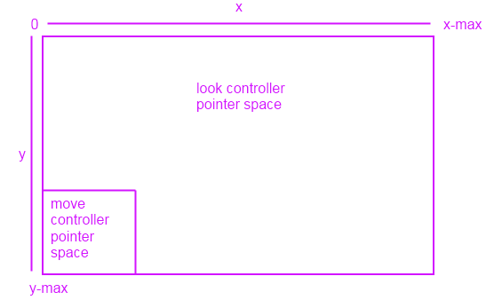

# <span id="dev_gaming.tutorial__adding_move-look_controls_to_your_directx_game"> </span>게임용 이동-보기 컨트롤


\[ Windows 10의 UWP 앱에 맞게 업데이트되었습니다. Windows 8.x 문서는 [보관](http://go.microsoft.com/fwlink/p/?linkid=619132)을 참조하세요. \]

기존 마우스 및 키보드 이동-보기 컨트롤(마우스 보기 컨트롤이라고도 함)을 DirectX 게임에 추가하는 방법을 알아봅니다.

또한 화면 왼쪽 아래 섹션에 정의되고 방향 입력처럼 작동하는 이동 컨트롤러, 나머지 화면에 대해 정의된 보기 컨트롤러, 플레이어가 해당 영역에서 터치한 마지막 위치의 중심에 있는 카메라와 함께 터치 장치의 이동-보기 지원을 살펴봅니다.

이 컨트롤 개념에 익숙하지 않다면 키보드(또는 터치 기반 방향 입력 상자)가 이 3D 공간에서 다리를 제어하고 다리가 앞뒤로 이동하거나 왼쪽과 오른쪽으로 공격할 수만 있는 것처럼 동작한다고 생각해 보세요. 마우스(또는 터치 포인터)는 머리를 제어합니다. 머리를 사용하여 왼쪽, 오른쪽, 위쪽, 아래쪽 또는 해당 평면의 다른 위치를 봅니다. 보기에 대상이 있으면 마우스를 사용하여 카메라 보기의 중심을 해당 대상에 맞춘 다음 앞으로 키를 눌러 대상 쪽으로 이동하거나 뒤로를 눌러 대상으로부터 멀리 이동합니다. 대상 주위에 원을 그리려면 대상의 중심에 카메라 보기를 유지하고 동시에 왼쪽 또는 오른쪽으로 이동합니다. 3D 환경을 탐색하는 데 매우 효과적인 컨트롤임을 확인할 수 있습니다.

일반적으로 게임에서는 이러한 컨트롤을 WASD 컨트롤이라고 합니다. 여기서 W, A, S 및 D 키는 x-z 평면 고정 카메라 이동에 사용되며 마우스는 x 및 y-축 주위의 카메라 회전을 제어합니다.

## 목표


-   마우스/키보드 및 터치 스크린에 대한 기본 이동-보기 컨트롤을 DirectX 게임에 추가합니다.
-   3D 환경을 탐색하는 데 사용되는 1인칭 카메라를 구현합니다.

## 터치 컨트롤 구현에 대한 참고 사항


터치 컨트롤에 대해 카메라의 보기 지점을 기준으로 x-z 평면에서의 이동을 처리하는 이동 컨트롤러와 카메라의 보기 지점을 목표로 하는 보기 컨트롤러의 두 가지 컨트롤러를 구현합니다. 이동 컨트롤러는 키보드 WASD 단추에 매핑되고 보기 컨트롤러는 마우스에 매핑됩니다. 그러나 터치 컨트롤인 경우 방향 입력 역할을 하는 화면 영역 또는 가상 WASD 단추를 보기 컨트롤의 입력 공간 역할을 하는 나머지 화면으로 정의해야 합니다.

화면 모양은 다음과 같습니다.



화면의 왼쪽 아래에서 터치 포인터(마우스 아님)를 이동하는 경우 위쪽으로 이동하면 카메라는 앞으로 이동하게 됩니다. 아래쪽으로 이동하면 카메라는 뒤로 이동하게 됩니다. 이동 컨트롤러의 포인터 공간 내에서 왼쪽 및 오른쪽 이동을 동일하게 유지합니다. 해당 공간 외부에서는 보기 컨트롤러가 되며 카메라가 향하도록 하려는 위치로 카메라를 터치하거나 끌면 됩니다.

## 기본 입력 이벤트 인프라 설정


먼저 마우스 및 키보드의 입력 이벤트를 처리하는 데 사용할 컨트롤 클래스를 만들고 해당 입력에 따라 카메라 관점을 업데이트해야 합니다. 이동-보기 컨트롤러를 구현하는 것이므로 **MoveLookController**라고 합니다.

```cpp
using namespace Windows::UI::Core;
using namespace Windows::System;
using namespace Windows::Foundation;
using namespace Windows::Devices::Input;
#include <DirectXMath.h>

// Methods to get input from the UI pointers
ref class MoveLookController
{
};  // class MoveLookController
```

이제 이동-보기 컨트롤러 및 1인칭 카메라의 상태를 정의하는 헤더와 함께 컨트롤을 구현하고 카메라의 상태를 업데이트하는 기본 메서드 및 이벤트 처리기를 만듭니다.

```cpp
#define ROTATION_GAIN 0.004f    // Sensitivity adjustment for the look controller
#define MOVEMENT_GAIN 0.1f      // Sensitivity adjustment for the move controller

ref class MoveLookController
{
private:
    // Properties of the controller object
    DirectX::XMFLOAT3 m_position;               // The position of the controller
    float m_pitch, m_yaw;           // Orientation euler angles in radians

    // Properties of the Move control
    bool m_moveInUse;               // Specifies whether the move control is in use
    uint32 m_movePointerID;         // Id of the pointer in this control
    DirectX::XMFLOAT2 m_moveFirstDown;          // Point where initial contact occurred
    DirectX::XMFLOAT2 m_movePointerPosition;   // Point where the move pointer is currently located
    DirectX::XMFLOAT3 m_moveCommand;            // The net command from the move control

    // Properties of the Look control
    bool m_lookInUse;               // Specifies whether the look control is in use
    uint32 m_lookPointerID;         // Id of the pointer in this control
    DirectX::XMFLOAT2 m_lookLastPoint;          // Last point (from last frame)
    DirectX::XMFLOAT2 m_lookLastDelta;          // For smoothing

    bool m_forward, m_back;         // States for movement
    bool m_left, m_right;
    bool m_up, m_down;


public:

    // Methods to get input from the UI pointers
    void OnPointerPressed(
        _In_ Windows::UI::Core::CoreWindow^ sender,
        _In_ Windows::UI::Core::PointerEventArgs^ args
        );

    void OnPointerMoved(
        _In_ Windows::UI::Core::CoreWindow^ sender,
        _In_ Windows::UI::Core::PointerEventArgs^ args
        );

    void OnPointerReleased(
        _In_ Windows::UI::Core::CoreWindow^ sender,
        _In_ Windows::UI::Core::PointerEventArgs^ args
        );

    void OnKeyDown(
        _In_ Windows::UI::Core::CoreWindow^ sender,
        _In_ Windows::UI::Core::KeyEventArgs^ args
        );

    void OnKeyUp(
        _In_ Windows::UI::Core::CoreWindow^ sender,
        _In_ Windows::UI::Core::KeyEventArgs^ args
        );

    // Set up the Controls that this controller supports
    void Initialize( _In_ Windows::UI::Core::CoreWindow^ window );

    void Update( Windows::UI::Core::CoreWindow ^window );
    
internal:
    // Accessor to set position of controller
    void SetPosition( _In_ DirectX::XMFLOAT3 pos );

    // Accessor to set position of controller
    void SetOrientation( _In_ float pitch, _In_ float yaw );

    // Returns the position of the controller object
    DirectX::XMFLOAT3 get_Position();

    // Returns the point  which the controller is facing
    DirectX::XMFLOAT3 get_LookPoint();


};  // class MoveLookController
```

코드에는 4개 그룹의 private 필드가 있습니다. 각 필드의 용도에 대해 검토하겠습니다.

먼저 카메라 보기에 대해 업데이트된 정보를 저장하는 유용한 필드 몇 가지를 정의합니다.

-   **m\_position**은 3D 장면에서 장면 좌표를 사용하는 카메라의 위치이므로 보기 기준면입니다.
-   **m\_pitch**는 카메라의 피치 또는 보기 기준면 x-축 기준의 위-아래 회전(라디안 단위)입니다.
-   **m\_yaw**는 카메라의 요 또는 보기 기준면 y-축 기준의 왼쪽-오른쪽 회전(라디안 단위)입니다.

이제 컨트롤러의 상태 및 위치에 대한 정보를 저장하는 데 사용하는 필드를 정의해 보겠습니다. 먼저 터치 기반 이동 컨트롤러에 필요한 필드를 정의합니다. 이동 컨트롤러의 키보드 구현에 특별히 필요한 사항은 없습니다. 특정 처리기를 사용하여 키보드 이벤트를 읽으면 됩니다.

-   **m\_moveInUse**는 이동 컨트롤러가 사용 중인지 여부를 나타냅니다.
-   **m\_movePointerID**는 현재 이동 포인터의 고유한 ID입니다. 포인터 ID 값을 확인할 때 이 ID를 사용하여 보기 포인터와 이동 포인터를 구분합니다.
-   **m\_moveFirstDown**는 플레이어가 처음으로 이동 컨트롤러 포인터 영역을 터치한 화면의 점입니다. 나중에 이 값을 사용하여 데드존을 설정함으로써 작은 이동으로 보기가 방해되지 않도록 합니다.
-   **m\_movePointerPosition**는 플레이어가 현재 포인터를 이동한 화면의 점입니다. **m\_moveFirstDown**을 기준으로 이 값을 검사하여 플레이어가 이동하려고 한 방향을 확인하는 데 사용합니다.
-   **m\_moveCommand**는 이동 컨트롤러에 대해 계산된 최종 명령으로 위쪽(앞으로), 아래쪽(뒤로), 왼쪽 또는 오른쪽입니다.

이제 마우스 및 터치 구현에서 보기 컨트롤러에 사용하는 필드를 정의합니다.

-   **m\_lookInUse**는 보기 컨트롤이 사용 중인지 여부를 나타냅니다.
-   **m\_lookPointerID**는 현재 보기 포인터의 고유한 ID입니다. 포인터 ID 값을 확인할 때 이 ID를 사용하여 보기 포인터와 이동 포인터를 구분합니다.
-   **m\_lookLastPoint**는 이전 프레임에서 캡처된 마지막 점(장면 좌표로 표시)입니다.
-   **m\_lookLastDelta**는 현재 **m\_position**과 **m\_lookLastPoint** 간의 계산된 차이입니다.

마지막으로 6개의 이동 수준에 대해 6개의 부울 값을 정의합니다. 이 값은 각 방향 이동 작업의 현재 상태(설정 또는 해제)를 나타내는 데 사용됩니다.

-   **m\_forward**, **m\_back**, **m\_left**, **m\_right**, **m\_up** and **m\_down**.

6개의 이벤트 처리기를 사용하여 컨트롤러의 상태를 업데이트하는 데 사용하는 입력 데이터를 캡처합니다.

-   **OnPointerPressed**. 플레이어가 게임 화면에서 포인터로 마우스 왼쪽 단추를 누르거나 화면을 터치했습니다.
-   **OnPointerMoved**. 플레이어가 게임 화면에서 포인터로 마우스를 이동하거나 화면에서 터치 포인터를 끌었습니다.
-   **OnPointerReleased**. 플레이어가 게임 화면에서 포인터로 마우스 왼쪽 단추를 해제하거나 화면 터치를 중지했습니다.
-   **OnKeyDown**. 플레이어가 키를 눌렀습니다.
-   **OnKeyUp**. 플레이어가 키를 놓았습니다.

마지막으로 이러한 메서드 및 속성을 사용하여 컨트롤러의 상태 정보를 초기화, 액세스 및 업데이트합니다.

-   **Initialize**. 앱에서 이 이벤트 처리기를 호출하여 컨트롤을 초기화하고 디스플레이 창에 대해 설명하는 [**CoreWindow**](https://msdn.microsoft.com/library/windows/apps/br208225) 개체에 연결합니다.
-   **SetPosition**. 앱에서 이 메서드를 호출하여 장면 공간에서 컨트롤의 x, y 및 z 좌표를 설정합니다.
-   **SetOrientation**. 앱에서 이 메서드를 호출하여 카메라의 피치 및 요를 설정합니다.
-   **get\_Position**. 앱에서 이 속성에 액세스하여 장면 공간에서 카메라의 현재 위치를 가져옵니다. 앱에 현재 카메라 위치를 전달하는 방법으로 이 속성을 사용합니다.
-   **get\_LookPoint**. 앱에서 이 속성에 액세스하여 컨트롤러 카메라가 향하고 있는 현재 점을 가져옵니다.
-   **Update**. 이동 및 보기 컨트롤러의 상태를 읽고 카메라 위치를 업데이트합니다. 앱의 주 루프에서 이 메서드를 계속 호출하여 장면 공간에서 카메라 컨트롤러 데이터 및 카메라 위치를 새로 고칩니다.

이제 이동-보기 컨트롤을 구현하는 데 필요한 모든 구성 요소가 있습니다. 따라서 이러한 요소를 함께 연결해 보겠습니다.

## 기본 입력 이벤트 만들기


Windows 런타임 이벤트 디스패처는 다음과 같이 클래스의 인스턴스를 처리할 이벤트 5개를 제공합니다.**MoveLookController**

-   [**PointerPressed**](https://msdn.microsoft.com/library/windows/apps/br208278)
-   [**PointerMoved**](https://msdn.microsoft.com/library/windows/apps/br208276)
-   [**PointerReleased**](https://msdn.microsoft.com/library/windows/apps/br208279)
-   [**KeyUp**](https://msdn.microsoft.com/library/windows/apps/br208271)
-   [**KeyDown**](https://msdn.microsoft.com/library/windows/apps/br208270)

이러한 이벤트는 [**CoreWindow**](https://msdn.microsoft.com/library/windows/apps/br208225) 유형에 구현됩니다. 이때 사용할 **CoreWindow** 개체가 있다고 가정합니다. 개체를 얻는 방법을 모르는 경우 [DirectX 보기를 표시하도록 UWP(유니버설 Windows 플랫폼) C++ 앱을 설정하는 방법](https://msdn.microsoft.com/library/windows/apps/hh465077)을 참조하세요.

앱이 실행되는 동안 이러한 이벤트가 발생하면 처리기에서 private 필드에 정의된 컨트롤러의 상태 정보를 업데이트합니다.

먼저 마우스 및 터치 포인터 이벤트 처리기를 채워 보겠습니다. 첫 번째 이벤트 처리기 **OnPointerPressed()**에서 포인터의 x-y 좌표를 사용자가 보기 컨트롤러 영역에서 마우스를 클릭하거나 화면을 터치할 때 디스플레이를 관리하는 [**CoreWindow**](https://msdn.microsoft.com/library/windows/apps/br208225)에서 가져옵니다.

**OnPointerPressed**

```cpp
void MoveLookController::OnPointerPressed(
_In_ CoreWindow^ sender,
_In_ PointerEventArgs^ args)
{
    // Get the current pointer position.
    uint32 pointerID = args->CurrentPoint->PointerId;
    DirectX::XMFLOAT2 position = DirectX::XMFLOAT2( args->CurrentPoint->Position.X, args->CurrentPoint->Position.Y );

    auto device = args->CurrentPoint->PointerDevice;
    auto deviceType = device->PointerDeviceType;
    if ( deviceType == PointerDeviceType::Mouse )
    {
        // Action, Jump, or Fire
    }

    // Check  if this pointer is in the move control.
    // Change the values  to percentages of the preferred screen resolution.
    // You can set the x value to <preferred resolution> * <percentage of width>
    // for example, ( position.x < (screenResolution.x * 0.15) ).

    if (( position.x < 300 && position.y > 380 ) && ( deviceType != PointerDeviceType::Mouse ))
    {
        if ( !m_moveInUse ) // if no pointer is in this control yet
        {
            // Process a DPad touch down event.
            m_moveFirstDown = position;                 // Save the location of the initial contact.
            m_movePointerPosition = position;
            m_movePointerID = pointerID;                // Store the id of the pointer using this control.
            m_moveInUse = TRUE;
        }
    }
    else // This pointer must be in the look control.
    {
        if ( !m_lookInUse ) // If no pointer is in this control yet...
        {
            m_lookLastPoint = position;                         // save the point for later move
            m_lookPointerID = args->CurrentPoint->PointerId;  // store the id of pointer using this control
            m_lookLastDelta.x = m_lookLastDelta.y = 0;          // these are for smoothing
            m_lookInUse = TRUE;
        }
    }
}
```

이 이벤트 처리기는 포인터가 마우스가 아닌지(이 샘플에서는 마우스와 터치 모두 지원), 이동 컨트롤러 영역에 있는지를 확인합니다. 두 조건이 모두 충족되면 방금 포인터를 눌렀는지 확인합니다. 특히 **m\_moveInUse**가 false인지 테스트하여 이 클릭이 이전 이동 또는 보기 입력과 관련이 없는지 확인합니다. 그럴 경우 처리기는 누르기 동작이 발생한 이동 컨트롤러 영역에서 점을 캡처하고 **m\_moveInUse**를 true로 설정하여 이 처리기가 다시 호출될 때 이동 컨트롤러 입력 상호 작업의 시작 위치를 덮어쓰지 않도록 합니다. 또한 이동 컨트롤러 포인터 ID를 현재 포인터의 ID로 업데이트합니다.

포인터가 마우스이거나 터치 포인터가 이동 컨트롤러 영역에 없는 경우에는 보기 컨트롤러 영역에 있어야 합니다. 사용자가 마우스 단추를 누르거나 터치하고 누른 현재 위치로 **m\_lookLastPoint**를 설정하고 델타를 재설정하며 보기 컨트롤러의 포인터 ID를 현재 포인터 ID로 업데이트합니다. 또한 보기 컨트롤러의 상태를 활성으로 설정합니다.

**OnPointerMoved**

```cpp
void MoveLookController::OnPointerMoved(
    _In_ CoreWindow ^sender,
    _In_ PointerEventArgs ^args)
{
    uint32 pointerID = args->CurrentPoint->PointerId;
    DirectX::XMFLOAT2 position = DirectX::XMFLOAT2(args->CurrentPoint->Position.X, args->CurrentPoint->Position.Y);

    // Decide which control this pointer is operating.
    if (pointerID == m_movePointerID)           // This is the move pointer.
    {
        // Move control
        m_movePointerPosition = position;       // Save the current position.

    }
    else if (pointerID == m_lookPointerID)      // This is the look pointer.
    {
        // Look control

        DirectX::XMFLOAT2 pointerDelta;
        pointerDelta.x = position.x - m_lookLastPoint.x;        // How far did pointer move
        pointerDelta.y = position.y - m_lookLastPoint.y;

        DirectX::XMFLOAT2 rotationDelta;
        rotationDelta.x = pointerDelta.x * ROTATION_GAIN;   // Scale for control sensitivity.
        rotationDelta.y = pointerDelta.y * ROTATION_GAIN;

        m_lookLastPoint = position;                     // Save for the next time through.

                                                        // Update our orientation based on the command.
        m_pitch -= rotationDelta.y;                     // Mouse y increases down, but pitch increases up.
        m_yaw -= rotationDelta.x;                       // Yaw is defined as CCW around the y-axis.

                                                        // Limit the pitch to straight up or straight down.
        m_pitch = (float)__max(-DirectX::XM_PI / 2.0f, m_pitch);
        m_pitch = (float)__min(+DirectX::XM_PI / 2.0f, m_pitch);
    }
}
```

**OnPointerMoved** 이벤트 처리기는 포인터가 이동할 때마다(이 경우 터치 스크린 포인터를 끌거나 왼쪽 단추를 누른 상태로 마우스 포인터를 이동) 실행됩니다. 포인터 ID가 이동 컨트롤러 포인터의 ID와 동일하면 이동 포인터이고, 그렇지 않으면 활성 포인터인 보기 컨트롤러인지 확인합니다.

이동 컨트롤러일 경우 포인터 위치만 업데이트합니다. **OnPointerPressed** 이벤트 처리기에서 캡처한 첫 번째 위치와 최종 위치를 비교하려고 하므로 [**PointerMoved**](https://msdn.microsoft.com/library/windows/apps/br208276) 이벤트가 계속 실행되는 한 계속 업데이트합니다.

보기 컨트롤러일 경우 약간 더 복잡할 수 있습니다. 새로운 보기 지점을 계산하고 카메라를 중심에 배치해야 합니다. 따라서 마지막 보기 지점과 현재 화면 위치 간의 델타를 계산한 다음 배율 인수를 곱하면 화면 이동 거리를 기준으로 보기 이동을 더 작거나 더 크게 만들 수 있습니다. 해당 값을 사용하여 피치 및 요를 계산합니다.

마지막으로 플레이어가 마우스 이동이나 화면 터치를 중지하면 이동 또는 보기 컨트롤러 동작을 비활성화해야 합니다. [
            **PointerReleased**](https://msdn.microsoft.com/library/windows/apps/br208279)가 실행될 때 호출하는 **OnPointerReleased**를 사용하여 **m\_moveInUse** 또는 **m\_lookInUse**를 FALSE로 설정하고 카메라 팬 이동을 해제한 다음 포인터 ID를 0으로 설정합니다.

**OnPointerReleased**

```cpp
void MoveLookController::OnPointerReleased(
_In_ CoreWindow ^sender,
_In_ PointerEventArgs ^args)
{
    uint32 pointerID = args->CurrentPoint->PointerId;
    DirectX::XMFLOAT2 position = DirectX::XMFLOAT2( args->CurrentPoint->Position.X, args->CurrentPoint->Position.Y );


    if ( pointerID == m_movePointerID )    // This was the move pointer.
    {
        m_moveInUse = FALSE;
        m_movePointerID = 0;
    }
    else if (pointerID == m_lookPointerID ) // This was the look pointer.
    {
        m_lookInUse = FALSE;
        m_lookPointerID = 0;
    }
}
```

지금까지 모든 터치 스크린 이벤트를 처리했습니다. 이제 키보드 기반 이동 컨트롤러의 키 입력 이벤트를 처리하겠습니다.

**OnKeyDown**

```cpp
void MoveLookController::OnKeyDown(
                                   __in CoreWindow^ sender,
                                   __in KeyEventArgs^ args )
{
    Windows::System::VirtualKey Key;
    Key = args->VirtualKey;

    // Figure out the command from the keyboard.
    if ( Key == VirtualKey::W )     // Forward
        m_forward = true;
    if ( Key == VirtualKey::S )     // Back
        m_back = true;
    if ( Key == VirtualKey::A )     // Left
        m_left = true;
    if ( Key == VirtualKey::D )     // Right
        m_right = true;
}
```

이러한 키 중 하나를 누르고 있는 한 이 이벤트 처리기에서는 해당 방향 이동 상태를 true로 설정합니다.

**OnKeyUp**

```cpp
void MoveLookController::OnKeyUp(
                                 __in CoreWindow^ sender,
                                 __in KeyEventArgs^ args)
{
    Windows::System::VirtualKey Key;
    Key = args->VirtualKey;

    // Figure out the command from the keyboard.
    if ( Key == VirtualKey::W )     // forward
        m_forward = false;
    if ( Key == VirtualKey::S )     // back
        m_back = false;
    if ( Key == VirtualKey::A )     // left
        m_left = false;
    if ( Key == VirtualKey::D )     // right
        m_right = false;
}
```

또한 키를 놓으면 다시 false로 설정합니다. **Update**를 호출하면 이러한 방향 이동 상태를 확인하고 그에 따라 카메라를 이동합니다. 터치 구현보다 약간 더 간단합니다.

## 터치 컨트롤 및 컨트롤러 상태 초기화


이제 이벤트를 연결하고 모든 컨트롤러 상태 필드를 초기화하겠습니다.

**Initialize**

```cpp
void MoveLookController::Initialize( _In_ CoreWindow^ window )
{

    // Opt in to recieve touch/mouse events.
    window->PointerPressed += 
    ref new TypedEventHandler<CoreWindow^, PointerEventArgs^>(this, &MoveLookController::OnPointerPressed);

    window->PointerMoved += 
    ref new TypedEventHandler<CoreWindow^, PointerEventArgs^>(this, &MoveLookController::OnPointerMoved);

    window->PointerReleased += 
    ref new TypedEventHandler<CoreWindow^, PointerEventArgs^>(this, &MoveLookController::OnPointerReleased);

    window->CharacterReceived +=
    ref new TypedEventHandler<CoreWindow^, CharacterReceivedEventArgs^>(this, &MoveLookController::OnCharacterReceived);

    window->KeyDown += 
    ref new TypedEventHandler<CoreWindow^, KeyEventArgs^>(this, &MoveLookController::OnKeyDown);

    window->KeyUp += 
    ref new TypedEventHandler<CoreWindow^, KeyEventArgs^>(this, &MoveLookController::OnKeyUp);

    // Initialize the state of the controller.
    m_moveInUse = FALSE;                // No pointer is in the Move control.
    m_movePointerID = 0;

    m_lookInUse = FALSE;                // No pointer is in the Look control.
    m_lookPointerID = 0;

    //  Need to init this as it is reset every frame.
    m_moveCommand = DirectX::XMFLOAT3( 0.0f, 0.0f, 0.0f );

    SetOrientation( 0, 0 );             // Look straight ahead when the app starts.

}
```

**Initialize**에서는 앱의 [**CoreWindow**](https://msdn.microsoft.com/library/windows/apps/br208225) 인스턴스에 대한 참조를 매개 변수로 사용하고 개발한 인벤트 처리기를 해당 **CoreWindow**의 적합한 이벤트에 등록합니다. 또한 이동 및 보기 포인터의 ID를 초기화하고, 터치 스크린 이동 컨트롤러 구현에 대한 명령 벡터를 0으로 설정하며, 앱이 시작될 때 카메라가 똑바로 앞을 보도록 설정합니다.

## 카메라의 위치/방향 가져오기 및 설정


뷰포트를 기준으로 카메라의 위치를 가져오고 설정하는 몇 가지 메서드를 정의해 보겠습니다.

```cpp
void MoveLookController::SetPosition( _In_ DirectX::XMFLOAT3 pos )
{
    m_position = pos;
}

// Accessor to set the position of the controller.
void MoveLookController::SetOrientation( _In_ float pitch, _In_ float yaw )
{
    m_pitch = pitch;
    m_yaw = yaw;
}

// Returns the position of the controller object.
DirectX::XMFLOAT3 MoveLookController::get_Position()
{
    return m_position;
}

// Returns the point at which the camera controller is facing.
DirectX::XMFLOAT3 MoveLookController::get_LookPoint()
{
    float y = sinf(m_pitch);        // Vertical
    float r = cosf(m_pitch);        // In the plane
    float z = r*cosf(m_yaw);        // Fwd-back
    float x = r*sinf(m_yaw);        // Left-right
    DirectX::XMFLOAT3 result(x,y,z);
    result.x += m_position.x;
    result.y += m_position.y;
    result.z += m_position.z;

    // Return m_position + DirectX::XMFLOAT3(x, y, z);
    return result;
}
```

## 컨트롤러 상태 정보 업데이트


이제 **m\_movePointerPosition** 에서 추적된 포인터 좌표 정보를 표준 좌표계의 새 좌표 정보로 변환하는 계산을 수행합니다. 앱에서는 메인 앱 루프를 새로 고칠 때마다 이 메서드를 호출합니다. 따라서 뷰포트로 투영하기 전에 보기 매트릭스를 업데이트하려면 앱에 전달한 새로운 보기 지점 위치 정보를 여기에서 계산해야 합니다.

```cpp
void MoveLookController::Update(CoreWindow ^window)
{
    // Check for input from the Move control.
    if (m_moveInUse)
    {
        DirectX::XMFLOAT2 pointerDelta(m_movePointerPosition);
        pointerDelta.x -= m_moveFirstDown.x;
        pointerDelta.y -= m_moveFirstDown.y;

        // Figure out the command from the touch-based virtual joystick.
        if (pointerDelta.x > 16.0f)      // Leave 32 pixel-wide dead spot for being still.
            m_moveCommand.x = 1.0f;
        else
            if (pointerDelta.x < -16.0f)
            m_moveCommand.x = -1.0f;

        if (pointerDelta.y > 16.0f)      // Joystick y is up, so change sign.
            m_moveCommand.y = -1.0f;
        else
            if (pointerDelta.y < -16.0f)
            m_moveCommand.y = 1.0f;
    }

    // Poll our state bits that are set by the keyboard input events.
    if (m_forward)
        m_moveCommand.y += 1.0f;
    if (m_back)
        m_moveCommand.y -= 1.0f;

    if (m_left)
        m_moveCommand.x -= 1.0f;
    if (m_right)
        m_moveCommand.x += 1.0f;

    if (m_up)
        m_moveCommand.z += 1.0f;
    if (m_down)
        m_moveCommand.z -= 1.0f;

    // Make sure that 45 degree cases are not faster.
    DirectX::XMFLOAT3 command = m_moveCommand;
    DirectX::XMVECTOR vector;
    vector = DirectX::XMLoadFloat3(&command);

    if (fabsf(command.x) > 0.1f || fabsf(command.y) > 0.1f || fabsf(command.z) > 0.1f)
    {
        vector = DirectX::XMVector3Normalize(vector);
        DirectX::XMStoreFloat3(&command, vector);
    }
    

    // Rotate command to align with our direction (world coordinates).
    DirectX::XMFLOAT3 wCommand;
    wCommand.x = command.x*cosf(m_yaw) - command.y*sinf(m_yaw);
    wCommand.y = command.x*sinf(m_yaw) + command.y*cosf(m_yaw);
    wCommand.z = command.z;

    // Scale for sensitivity adjustment.
    wCommand.x = wCommand.x * MOVEMENT_GAIN;
    wCommand.y = wCommand.y * MOVEMENT_GAIN;
    wCommand.z = wCommand.z * MOVEMENT_GAIN;

    // Our velocity is based on the command.
    // Also note that y is the up-down axis. 
    DirectX::XMFLOAT3 Velocity;
    Velocity.x = -wCommand.x;
    Velocity.z = wCommand.y;
    Velocity.y = wCommand.z;

    // Integrate
    m_position.x += Velocity.x;
    m_position.y += Velocity.y;
    m_position.z += Velocity.z;

    // Clear movement input accumulator for use during the next frame.
    m_moveCommand = DirectX::XMFLOAT3(0.0f, 0.0f, 0.0f);

}
```

플레이어가 터치 기반 이동 컨트롤러를 사용할 때 힘들게 이동하지 않도록 포인터 주위의 가상 데드존을 32픽셀 지름으로 설정합니다. 또한 명령 값과 이동 게인 속도를 더한 속도를 추가합니다. 이 동작을 원하는 대로 조정하여 이동 컨트롤러 영역에서 포인터가 이동하는 거리에 따라 이동의 속도를 늦추거나 빠르게 할 수 있습니다.

또한 속도를 계산할 때 이동 및 보기 컨트롤러에서 받은 좌표를 장면에 대한 보기 매트릭스를 계산하는 메서드로 전송하는 실제 보기 지점의 이동으로 변환합니다. 보기 컨트롤러로 클릭하여 이동하거나 왼쪽 또는 오른쪽으로 끄는 경우 장면의 보기 지점이 반대 방향으로 회전하여 카메라가 중심 축 주위로 흔들릴 수 있으므로 먼저 x 좌표를 반대로 합니다. 그런 다음, 이동 컨트롤러에서 위쪽/아래쪽 키 누름 또는 터치 끌기 동작(y-축 동작으로 읽음)이 보기 지점을 화면(z-축) 내외부로 이동하는 카메라 동작으로 변환되므로 y-축과 z-축을 바꿉니다.

플레이어에 대한 보기 지점의 최종 위치는 마지막 위치에 계산된 속도를 더한 위치이며 렌더러에서 **get\_Position** 메서드를 호출할 때(대부분 각 프레임을 설정하는 동안) 읽는 값입니다. 그런 다음 이동 명령을 0으로 재설정합니다.

## 새 카메라 위치로 보기 매트릭스 업데이트


카메라가 초점을 맞춘 장면 공간 좌표를 가져올 수 있으며 이 좌표는 앱에서 해당 작업을 수행하도록 할 때마다 업데이트됩니다(예: 메인 앱 루프에서 매 60초마다). 이 의사 코드에서는 구현할 수 있는 호출 동작을 제안합니다.

```cpp
myMoveLookController->Update( m_window );   

// Update the view matrix based on the camera position.
myFirstPersonCamera->SetViewParameters(
                 myMoveLookController->get_Position(),       // Point we are at
                 myMoveLookController->get_LookPoint(),      // Point to look towards
                 DirectX::XMFLOAT3( 0, 1, 0 )                   // Up-vector
                 ); 
```

축하합니다! 게임에서 터치 스크린 및 키보드/마우스 입력 터치 컨트롤에 대한 기본 이동-보기 컨트롤이 구현되었습니다.

> **참고**  
이 문서는 UWP(유니버설 Windows 플랫폼) 앱을 작성하는 Windows 10 개발자용입니다. Windows 8.x 또는 Windows Phone 8.x를 개발하는 경우 [보관된 문서](http://go.microsoft.com/fwlink/p/?linkid=619132)를 참조하세요.

 

 

 


<!--HONumber=Mar16_HO1-->


