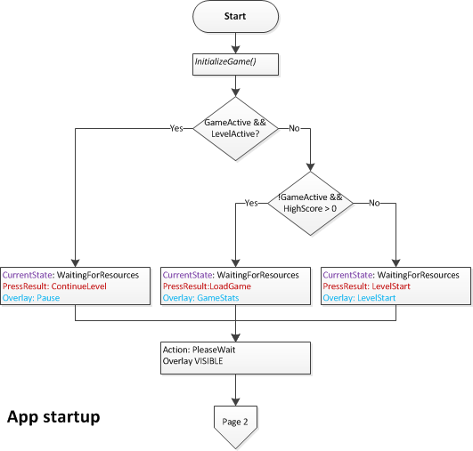
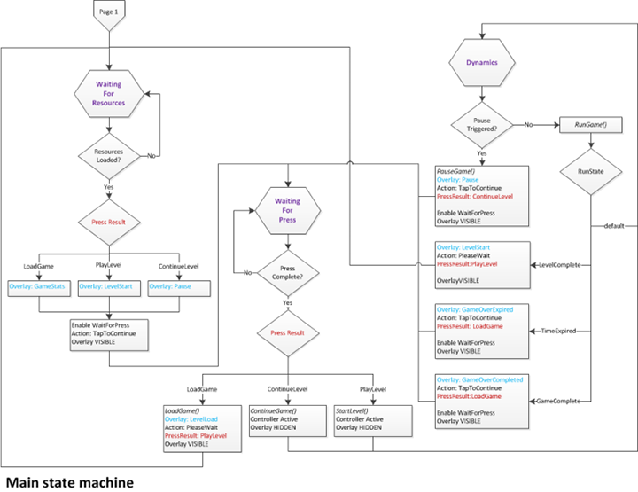

#  게임의 UWP(유니버설 Windows 플랫폼) 앱 프레임워크 정의


\[ Windows 10의 UWP 앱에 맞게 업데이트되었습니다. Windows 8.x 문서는 [보관](http://go.microsoft.com/fwlink/p/?linkid=619132)을 참조하세요. \]

DirectX로 작성된 UWP(유니버설 Windows 플랫폼) 게임 코딩의 첫 번째 부분은 게임 개체가 Windows와 조작할 수 있도록 하는 프레임워크의 구축입니다. 여기에는 사용자 인터페이스에 대한 이벤트, 조작 및 전환뿐만 아니라 이벤트 처리 일시 중단/다시 시작, 창 포커스 및 스내핑 같은 Windows 런타임 속성이 포함됩니다. 샘플 게임을 구조화하는 방법 및 플레이어 및 시스템 조작을 위한 상위 수준 상태 시스템을 정의하는 방법을 검토합니다.

## 목표


-   UWP DirectX 게임용 프레임워크를 설정하고 전체적인 게임 흐름을 정의하는 상태 시스템을 구현합니다.

## 뷰 공급자 초기화 및 시작


모든 UWP DirectX 게임에서는 실행 중인 앱의 인스턴스를 정의하는 앱 단일 항목인 Windows 런타임 개체에서 필요한 그래픽 리소스에 액세스하는 데 사용할 수 있는 뷰 공급자를 가져와야 합니다. Windows 런타임을 통해 앱은 그래픽 인터페이스에 직접 연결되지만 필요한 리소스와 해당 리소스를 처리하는 방법을 지정해야 합니다.

[게임 프로젝트 설정](tutorial--setting-up-the-games-infrastructure.md)에서 설명한 대로 Microsoft Visual Studio 2015는 **DirectX 11 앱(유니버설 Windows)** 템플릿을 선택하면 사용할 수 있는 **Sample3DSceneRenderer.cpp** 파일에서 DirectX용 기본 렌더러의 구현을 제공합니다.

뷰 공급자 및 렌더러 이해 및 만들기에 대한 자세한 내용은 [DirectX 보기를 표시하도록 C++ 및 DirectX로 작성된 UWP를 설정하는 방법](https://msdn.microsoft.com/library/windows/apps/hh465077)을 참조하세요.

앱 단일 항목이 호출하는 다음 5가지 메서드에 대한 구현을 제공해야 한다는 사실만 확실히 기억하시면 됩니다.

-   [**Initialize**](https://msdn.microsoft.com/library/windows/apps/hh700495)
-   [**SetWindow**](https://msdn.microsoft.com/library/windows/apps/hh700509)
-   [**Load**](https://msdn.microsoft.com/library/windows/apps/hh700501)
-   [**Run**](https://msdn.microsoft.com/library/windows/apps/hh700505)
-   [**Uninitialize**](https://msdn.microsoft.com/library/windows/apps/hh700523)

DirectX11 앱(유니버설 Windows) 템플릿에는 [App.h](#code_sample)의 **App**개체에 정의된 다음 5가지 메서드가 있습니다. 이 게임에서 이러한 메서드를 구현하는 방법을 살펴보겠습니다.

뷰 공급자의 Initialize 메서드

```cpp
void App::Initialize(
    _In_ CoreApplicationView^ applicationView
    )
{
    applicationView->Activated +=
        ref new TypedEventHandler<CoreApplicationView^, IActivatedEventArgs^>(this, &App::OnActivated);

    CoreApplication::Suspending +=
        ref new EventHandler<SuspendingEventArgs^>(this, &App::OnSuspending);

    CoreApplication::Resuming +=
        ref new EventHandler<Platform::Object^>(this, &App::OnResuming);

    m_controller = ref new MoveLookController();
    m_renderer = ref new GameRenderer();
    m_game = ref new Simple3DGame();
}
```

앱 단일 항목은 먼저 **Initialize**를 호출합니다. 따라서 주 창의 활성화를 처리하고 게임에서 갑작스러운 일시 중단(및 나중에 다시 시작 가능) 이벤트를 처리하도록 하는 등 UWP 게임의 기본 동작 대부분을 이 메서드에서 처리한다는 점은 매우 중요합니다.

게임 앱이 초기화되면 컨트롤러에 대한 특정 메모리를 할당하여 플레이어가 입력을 제공할 수 있도록 합니다. 또는 게임의 렌더러 및 상태 시스템의 초기화되지 않은 새 인스턴스를 만듭니다. 이 부분은 [주 게임 개체 정의](tutorial--defining-the-main-game-loop.md)에서 자세히 설명합니다.

현재 게임 앱은 일시 중단(또는 다시 시작) 메시지를 처리할 수 있고 컨트롤러 및 게임 자체에 대해 할당된 메모리가 있습니다. 그러나 작업할 창이 없으며 게임이 초기화되지 않았습니다. 따라서 몇 가지 작업을 더 수행해야 합니다.

뷰 공급자의 SetWindow 메서드

```cpp
void App::SetWindow(
    _In_ CoreWindow^ window
    )
{
    window->PointerCursor = ref new CoreCursor(CoreCursorType::Arrow, 0);

    window->SizeChanged +=
        ref new TypedEventHandler<CoreWindow^, WindowSizeChangedEventArgs^>(this, &App::OnWindowSizeChanged);

    window->Closed +=
        ref new TypedEventHandler<CoreWindow^, CoreWindowEventArgs^>(this, &App::OnWindowClosed);

    window->VisibilityChanged +=
        ref new TypedEventHandler<CoreWindow^, VisibilityChangedEventArgs^>(this, &App::OnVisibilityChanged);

    DisplayProperties::LogicalDpiChanged +=
        ref new DisplayPropertiesEventHandler(this, &App::OnLogicalDpiChanged);

    m_controller->Initialize(window);

    m_controller->SetMoveRect(
        XMFLOAT2(0.0f, window->Bounds.Height - GameConstants::TouchRectangleSize),
        XMFLOAT2(GameConstants::TouchRectangleSize, window->Bounds.Height)
        );
    m_controller->SetFireRect(
        XMFLOAT2(window->Bounds.Width - GameConstants::TouchRectangleSize, window->Bounds.Height - GameConstants::TouchRectangleSize),
        XMFLOAT2(window->Bounds.Width, window->Bounds.Height)
        );

    m_renderer->Initialize(window, DisplayProperties::LogicalDpi);
    SetGameInfoOverlay(GameInfoOverlayState::Loading);
    ShowGameInfoOverlay();
}
```

이제 앱 단일 항목은 [**SetWindow**](https://msdn.microsoft.com/library/windows/apps/hh700509)의 구현을 호출하여 게임의 주 창을 나타내는 [**CoreWindow**](https://msdn.microsoft.com/library/windows/apps/br208225) 개체를 제공하고 해당 리소스 및 이벤트를 게임에서 사용할 수 있도록 합니다. 작업할 창이 있기 때문에 게임에서 포인터(마우스 및 터치 컨트롤에서 사용)와 창 크기 조정, 닫기 및 DPI 변경(디스플레이 장치가 변경되는 경우)에 대한 기본 이벤트 같은 기본 사용자 인터페이스 구성 요소 및 이벤트 추가를 시작할 수 있습니다.

또한 조작할 창은 있으므로 게임 앱에서는 컨트롤러를 초기화하고 게임 개체 자체를 초기화합니다. 게임 앱은 컨트롤러(터치, 마우스 또는 XBox 360 컨트롤러)에서 입력을 읽을 수 있습니다.

컨트롤러를 초기화한 후 앱은 화면의 왼쪽 아래와 오른쪽 아래에 각각 이동 및 카메라 터치 컨트롤을 위해 2개의 사각형 영역을 정의합니다. 플레이어는 **SetMoveRect** 호출로 정의된 왼쪽 아래 사각형을 카메라를 전후좌우로 이동하기 위한 가상 컨트롤 패드로 사용합니다. **SetFireRect** 메서드로 정의된 오른쪽 아래 사각형은 탄약을 발사하는 가상 단추로 사용됩니다.

이제 모두 결합됩니다.

뷰 공급자의 Load 메서드

```cpp
void App::Load(
    Platform::String^ entryPoint
    )
{
    task<void>([this]()
    {
        m_game->Initialize(m_controller, m_renderer);

        return m_renderer->CreateGameDeviceResourcesAsync(m_game);

    }).then([this]()
    {
        // The finalize code needs to run in the same thread context
        // in which the m_renderer object was created because the D3D device context
        // can be accessed only on a single thread.
        m_renderer->FinalizeCreateGameDeviceResources();

        InitializeGameState();

        if (m_updateState == UpdateEngineState::WaitingForResources)
        {
            // In the middle of a game, so spin up the async task to load the level.
            create_task([this]()
            {
                return m_game->LoadLevelAsync();

            }).then([this]()
            {
                // The m_game object may need to deal with D3D device context work, so
                // the finalizer code needs to run in the same thread
                // context as the m_renderer object was created because the D3D 
                // device context can  be accessed only on a single thread.
                m_game->FinalizeLoadLevel();
                m_updateState = UpdateEngineState::ResourcesLoaded;

            }, task_continuation_context::use_current());
        }
    }, task_continuation_context::use_current());
}
```

주 창이 설정되면 앱 단일 항목에서 **Load**를 호출합니다. 샘플에서 이 메서드는 일련의 비동기 작업(구문은 [병렬 패턴 라이브러리](https://msdn.microsoft.com/library/windows/apps/dd492418.aspx)에 정의되어 있음)을 사용하여 게임 개체를 만들고, 그래픽 리소스를 로드하고, 게임의 상태 시스템을 초기화합니다. 비동기 작업 패턴을 사용하여 Load 메서드가 신속하게 완료되고 앱이 입력 처리를 시작할 수 있습니다. 이 메서드에서 앱은 리소스 파일이 로드될 때 진행률 표시줄도 표시합니다.

리소스 로드는 두 개의 개별 단계로 분리됩니다. Direct3D 11 디바이스 컨텍스트에 대한 액세스는 디바이스 컨텍스트가 만들어진 스레드로 제한되지만 개체 생성을 위한 Direct3D 11 디바이스 액세스는 자유 스레드 방식이기 때문입니다. **CreateGameDeviceResourcesAsync** 작업은 원래 스레드에서 실행되는 완료 작업(*FinalizeCreateGameDeviceResources*)과 별개의 스레드에서 실행됩니다. **LoadLevelAsync** 및 **FinalizeLoadLevel**을 사용하는 로드 수준 리소스에는 비슷한 패턴을 사용합니다.

게임 개체를 만들고 그래픽 리소스를 로드한 후 게임의 상태 시스템을 시작 상태로 초기화합니다(예: 초기 탄약 수, 수준 번호 및 개체 위치 설정). 플레이어가 게임을 다시 시작하는 것을 나타내는 게임 상태인 경우 최근 수준(플레이어가 게임을 일시 중단한 때의 수준)을 로드합니다.

**Load** 메서드에서는 시작 상태 또는 전역 값 설정과 같이 게임을 시작하기 전에 필요한 준비를 수행합니다. 게임 데이터나 자산을 미리 가져오려면 **SetWindow**나 **Initialize**가 아닌 이 메서드를 사용하는 것이 좋습니다. Windows에서는 게임이 입력 처리를 시작하기 전에 걸릴 수 있는 시간이 제한되어 있으므로 게임에서 모든 로드에 비동기 작업을 사용합니다. 로드에 많은 시간이 걸리는 경우(리소스가 많은 경우) 사용자에게 정기적으로 업데이트된 진행률 표시줄을 제공합니다.

게임을 직접 개발하는 경우 이러한 메서드를 기준으로 시작 코드를 디자인합니다. 다음에는 각 메서드에 대한 기본 제한 사항이 간략히 나와 있습니다.

-   **Initialize**를 사용하여 기본 클래스를 할당하고 기본 이벤트 처리기를 연결합니다.
-   **SetWindow**를 사용하여 주 창을 만들고 창 관련 이벤트를 연결합니다.
-   **Load**를 사용하여 나머지 설정을 처리하고 개체의 비동기 만들기 및 리소스 로드를 시작합니다. 단계적으로 생성되는 자산과 같은 임시 파일이나 데이터를 만들어야 하는 경우에도 이 메서드를 사용합니다.

따라서 샘플에서는 게임 상태 시스템의 인스턴스를 만들고 시작 구성으로 설정합니다. 또한 모든 시스템 및 입력 이벤트를 처리하고 콘텐츠를 표시할 창을 제공합니다. 이제 게임 플레이 코드를 실행할 수 있습니다.

뷰 공급자의 Run 메서드

```cpp
void App::Run()
{
    while (!m_windowClosed)
    {
        if (m_visible)
        {
            switch (m_updateState)
            {
            case UpdateEngineState::Deactivated:
            case UpdateEngineState::Snapped:
                if (!m_renderNeeded)
                {
                    // The app is not currently the active window, so just wait for events.
                    CoreWindow::GetForCurrentThread()->Dispatcher->ProcessEvents(CoreProcessEventsOption::ProcessOneAndAllPending);
                    break;
                }
                // Otherwise, fall through and do normal processing to get the rendering handled.
            default:
                CoreWindow::GetForCurrentThread()->Dispatcher->ProcessEvents(CoreProcessEventsOption::ProcessAllIfPresent);
                Update();
                m_renderer->Render();
                m_renderNeeded = false;
            }
        }
        else
        {
            CoreWindow::GetForCurrentThread()->Dispatcher->ProcessEvents(CoreProcessEventsOption::ProcessOneAndAllPending);
        }
    }
    m_game->OnSuspending();  // Exiting due to window close.  Make sure to save the state.
}
```

여기서는 게임 앱의 플레이 부분을 살펴봅니다. 3가지 메서드를 실행하고 스테이지를 설정했으면 게임 앱에서 **Run** 메서드를 실행하므로 즐기시면 됩니다.

게임 샘플에서는 플레이어가 게임 창을 닫을 때 종료되는 while 루프를 시작합니다. 이 샘플 코드는 게임 엔진 상태 시스템에서 다음 두 상태 중 하나로 전환됩니다.

-   게임 창이 비활성화(포커스를 잃음)되거나 사이드 창이 됩니다. 이 경우 게임이 이벤트 처리를 일시 중단하고 창이 포커스를 얻거나 비사이드될 때까지 기다립니다.
-   그렇지 않으면 게임이 고유한 상태를 업데이트하고 표시할 그래픽을 렌더링합니다.

게임에 포커스가 있으면 메시지가 도착할 때 메시지 큐의 모든 이벤트를 처리해야 하므로 **ProcessAllIfPresent** 옵션을 사용하여 [**CoreWindowDispatch.ProcessEvents**](https://msdn.microsoft.com/library/windows/apps/br208215)를 호출해야 합니다. 다른 옵션을 사용하면 메시지 이벤트 처리가 지연되어 게임이 응답하지 않는 것처럼 보이거나 터치 동작이 느리고 "고정"되지 않는 것처럼 느끼게 됩니다.

물론 앱이 표시되지 않거나, 일시 중단되거나, 사이드 상태가 된 경우 도착하지 않는 메시지를 계속 디스패치하느라 리소스를 사용하지 않도록 해야 합니다. 따라서 게임에서는 이벤트를 받을 때까지 차단하는 **ProcessOneAndAllPending**을 사용한 다음 해당 이벤트와 첫 번째 이벤트 처리 중 프로세스 큐에 도착하는 다른 이벤트를 처리합니다. 그러면 큐가 처리된 후 바로 [**ProcessEvents**](https://msdn.microsoft.com/library/windows/apps/br208215)가 반환됩니다.

게임이 실행되고 있습니다. 게임 상태를 전환하는 데 사용되는 이벤트를 디스패치하고 처리하고 있습니다. 그래픽이 게임 루프 주기로 업데이트되고 있습니다. 플레이어가 즐길 수 있길 바랍니다. 하지만 게임을 종료해야 합니다....

...그런 후에 리소스를 정리해야 합니다. 여기서 **Uninitialize**가 필요하게 됩니다.

뷰 공급자의 Uninitialize 메서드

```cpp
void App::Uninitialize()
{
}
```

게임 샘플에서는 게임이 종료되면 게임의 앱 단일 항목에서 모든 사항을 정리합니다. Windows 10에서는 앱 창을 닫아도 앱의 프로세스가 중단되지 않지만 대신 앱 단일 항목의 상태를 메모리에 기록합니다 시스템에서 메모리를 확보해야 하는 경우 수행해야 할 특별한 리소스 정리 작업이 있다면 해당 정리에 대한 코드를 이 메서드에 넣으세요.

이 자습서의 5가지 메서드를 다시 참조하여 기억해 두어야 합니다. 이제 게임 엔진의 전체 구조 및 해당 구조를 정의하는 상태 시스템에 대해 살펴보겠습니다.

## 게임 엔진 상태 초기화


사용자는 언제든지 일시 중단 상태에서 UWP 게임 앱을 다시 시작할 수 있으므로 앱의 가능한 상태 수에 제한이 없습니다.

게임 샘플은 시작할 때 다음 세 가지 상태 중 하나일 수 있습니다.

-   게임 루프가 실행되고 있으며 한 수준에 있습니다.
-   게임이 방금 완료되었으므로 게임 루프가 실행되고 있지 않습니다. 최고 점수가 설정되었습니다.
-   시작된 게임이 없거나 게임이 수준 사이에 있습니다. 최고 점수가 0입니다.

고유한 게임에 있는 상태 수가 더 많거나 더 적을 수 있습니다. 언제든지 UWP 게임을 종료할 수 있으며, 다시 시작할 때 플레이어는 게임이 재생 중지된 적이 없는 것처럼 동작하기를 기대한다는 것을 항상 명심하세요.

게임 샘플에서 코드 흐름은 다음과 같이 표시됩니다.

```cpp
void App::InitializeGameState()
{
    //
    // Set up the initial state machine for handling game playing state.
    //
    if (m_game->GameActive() && m_game->LevelActive())
    {
        m_updateState = UpdateEngineState::WaitingForResources;
        // ...

    }
    else if (!m_game->GameActive() && (m_game->HighScore().totalHits > 0))
    {
        m_updateState = UpdateEngineState::WaitingForPress;
        // ...
    }
    else
    {
        m_updateState = UpdateEngineState::WaitingForResources;
        // ...
    }
    SetAction(GameInfoOverlayCommand::PleaseWait);
    ShowGameInfoOverlay();
}
```

초기화는 앱 콜드 부팅이 아니라 앱이 종료된 후 다시 시작하는 것입니다. 샘플 게임은 항상 상태를 저장하여 앱이 항상 실행되고 있는 것처럼 표시되게 합니다. 일시 중단 상태는 게임 플레이가 일시 중단되었지만 게임 리소스가 여전히 메모리에 있음을 나타냅니다. 마찬가지로, 다시 시작 이벤트는 샘플 게임이 마지막으로 일시 중단 또는 종료된 위치에서 선택됨을 나타냅니다. 샘플 게임을 종료한 후 다시 시작하면 게임이 정상적으로 시작된 다음 플레이어가 게임을 즉시 계속할 수 있도록 마지막으로 알려진 상태를 확인합니다.

순서도는 게임 샘플의 초기화 프로세스에 대한 초기 상태와 전환을 배치합니다.



상태에 따라 다른 옵션이 플레이어에게 제공됩니다. 게임이 중간 수준에서 다시 시작되면 게임이 일시 중지된 것처럼 표시되며 오버레이에 계속 옵션이 제공됩니다. 완료된 상태에서 게임을 다시 시작하면 게임이 최고 점수와 새 게임을 플레이하는 옵션을 표시합니다. 마지막으로, 수준이 시작되기 전에 게임이 다시 시작되면 오버레이에서 사용자에게 시작 옵션을 제공합니다.

게임 샘플은 일시 중단 이벤트 없이 처음 시작되는 게임인 콜드 부팅 게임과 일시 중단 상태에서 다시 시작되는 게임을 구분하지 않습니다. 이 디자인은 모든 UWP 앱에 적합합니다.

## 이벤트 처리


샘플 코드에서는 **Initialize**, **SetWindow** 및 **Load**의 특정 이벤트에 대해 많은 처리기를 등록했습니다. 게임 방법이나 그래픽 개발을 진행하기 전에도 코드 샘플에서 이 작업을 제대로 수행했으므로 이러한 이벤트가 모두 중요하다는 사실도 추측할 수 있습니다. 맞습니다. 이러한 이벤트는 적절한 UWP 앱 환경에 기본적인 요소이며 UWP 앱은 언제든지 활성화, 비활성화, 크기 조정, 스냅, 스냅 취소, 일시 중단 또는 다시 시작할 수 있으므로 게임에서 최대한 빨리 해당 이벤트를 등록하고 환경을 원활하며 플레이어가 예측할 수 있게 유지하는 방식으로 처리해야 합니다.

다음은 샘플에 있는 이벤트 처리기와 해당 처리기에서 처리하는 이벤트입니다. 이러한 이벤트 처리기에 대한 전체 코드는 [이 섹션에 대한 전체 코드](#code_sample)에서 확인할 수 있습니다.

<table>
<colgroup>
<col width="50%" />
<col width="50%" />
</colgroup>
<thead>
<tr class="header">
<th align="left">이벤트 처리기</th>
<th align="left">설명</th>
</tr>
</thead>
<tbody>
<tr class="odd">
<td align="left">OnActivated</td>
<td align="left">[<strong>CoreApplicationView::Activated</strong>](https://msdn.microsoft.com/library/windows/apps/br225018)를 처리합니다. 게임 앱이 전경으로 전환되었음으로 주 창이 활성화됩니다.</td>
</tr>
<tr class="even">
<td align="left">OnLogicalDpiChanged</td>
<td align="left">[<strong>DisplayProperties::LogicalDpiChanged</strong>](https://msdn.microsoft.com/library/windows/apps/br226150)를 처리합니다. 주 게임 창의 DPI가 변경되었으며 게임 앱이 해당 리소스를 적절하게 조정합니다.
<div class="alert">
<strong>참고</strong> [<strong>CoreWindow</strong>](https://msdn.microsoft.com/library/windows/desktop/hh404559) 좌표는 [Direct2D](https://msdn.microsoft.com/library/windows/desktop/dd370987)에서와 같이 DIP(디바이스 독립적 픽셀) 단위입니다. 따라서 2D 자산이나 기본 요소를 올바르게 표시하려면 Direct2D에 DPI 변경을 알려야 합니다.
</div>
<div>
 
</div></td>
</tr>
<tr class="odd">
<td align="left">OnResuming</td>
<td align="left">[<strong>CoreApplication::Resuming</strong>](https://msdn.microsoft.com/library/windows/apps/br205859)을 처리합니다. 게임 앱이 일시 중단 상태에서 게임을 복원합니다.</td>
</tr>
<tr class="even">
<td align="left">OnSuspending</td>
<td align="left">[<strong>CoreApplication::Suspending</strong>](https://msdn.microsoft.com/library/windows/apps/br205860)을 처리합니다. 게임 앱에서 해당 상태를 디스크에 저장합니다. 상태를 저장소에 저장하려면 5초가 필요합니다.</td>
</tr>
<tr class="odd">
<td align="left">OnVisibilityChanged</td>
<td align="left">[<strong>CoreWindow::VisibilityChanged</strong>](https://msdn.microsoft.com/library/windows/apps/hh701591)를 처리합니다. 게임 앱의 가시성이 변경되어 표시되는 것으로 변환되거나 표시되지 않고 다른 앱 표시로 전환되었습니다.</td>
</tr>
<tr class="even">
<td align="left">OnWindowActivationChanged</td>
<td align="left">[<strong>CoreWindow::Activated</strong>](https://msdn.microsoft.com/library/windows/apps/br208255)를 처리합니다. 게임 앱의 주 창이 비활성화되거나 활성화되어 포커스를 제거하고 게임을 일시 중지하거나 포커스를 다시 얻어야 합니다. 두 경우 모두 오버레이에는 게임이 일시 중지된 것으로 표시됩니다.</td>
</tr>
<tr class="odd">
<td align="left">OnWindowClosed</td>
<td align="left">[<strong>CoreWindow::Closed</strong>](https://msdn.microsoft.com/library/windows/apps/br208261)를 처리합니다. 게임 앱에서 주 창을 닫고 게임을 일시 중단합니다.</td>
</tr>
<tr class="even">
<td align="left">OnWindowSizeChanged</td>
<td align="left">[<strong>CoreWindow::SizeChanged</strong>](https://msdn.microsoft.com/library/windows/apps/br208283)를 처리합니다. 게임 앱에서 크기 변경을 수용하도록 그래픽 리소스 및 오버레이를 다시 할당한 다음 렌더링 대상을 업데이트합니다.</td>
</tr>
</tbody>
</table>

 

이러한 이벤트는 UWP 앱 디자인의 일부이므로 직접 만든 게임에서 해당 이벤트를 처리해야 합니다.

## 게임 엔진 업데이트


샘플에서는 플레이어가 수행할 수 있는 모든 주요 작업을 처리하는 기본 상태 시스템을 **Run**의 게임 루프 내에서 구현했습니다. 이 상태 시스템의 최상위 수준에서는 게임 로드, 특정 레벨 플레이 또는 시스템 또는 플레이어에 의해 게임이 일시 중지된 후 레벨 진행을 처리합니다.

게임 샘플에는 게임의 가능한 세 가지 주요 상태(UpdateEngineState)가 있습니다.

-   **Waiting for resources**. 게임 루프가 순환되며 리소스(특히 그래픽 리소스)가 사용 가능할 때까지 전환할 수 없습니다. 리소스를 로드하는 비동기 작업이 완료되면 상태를 **ResourcesLoaded**로 업데이트합니다. 일반적으로 디스크에서 새 리소스를 로드해야 하는 수준 사이에 발생합니다. 게임 샘플에서 이 동작은 해당 시점에 샘플에 수준별 추가 리소스가 필요 없기 때문에 시뮬레이트됩니다.
-   **Waiting for press**. 게임 루프가 순환되며 특정 사용자 입력을 기다립니다. 이 입력은 게임을 로드하거나, 수준을 시작하거나, 수준을 계속하는 플레이어 작업입니다. 이 샘플 코드에서는 이러한 하위 상태를 PressResultState 열거형 값으로 나타냅니다.
-   **Dynamics**. 게임 루프가 사용자 플레이로 실행되고 있습니다. 사용자가 플레이하는 동안 게임이 전환할 수 있는 세 가지 상태(수준에 대해 설정된 시간 만료, 플레이어의 수준 완료 또는 플레이어의 모든 수준 완료)를 확인합니다.

다음은 코드 구조입니다. 전체 코드는 [이 섹션에 대한 전체 코드](#code_sample)에 있습니다.

게임 엔진을 업데이트하는 데 사용된 상태 시스템의 구조

```cpp
void App::Update()
{
    m_controller->Update();

    switch (m_updateState)
    {
    case UpdateEngineState::WaitingForResources:
        // Waiting for initial load.  Display an update once per 60 updates.
        loadCount++;
        if ((loadCount % 60) == 0)
        {
            m_loadingCount++;
            SetGameInfoOverlay(m_gameInfoOverlayState);
        }
        break;

    case UpdateEngineState::ResourcesLoaded:
        switch (m_pressResult)
        {
        case PressResultState::LoadGame:
            // ...
            break;

        case PressResultState::PlayLevel:
            // ...
            break;

        case PressResultState::ContinueLevel:
            // ...
            break;
        }
        // ...
        break;

    case UpdateEngineState::WaitingForPress:
        if (m_controller->IsPressComplete() || m_pressComplete)
        {
            m_pressComplete = false;

            switch (m_pressResult)
            {
            case PressResultState::LoadGame:
                // ...
                break;

            case PressResultState::PlayLevel:
                // ...
                break;

            case PressResultState::ContinueLevel:
                // ...
                break;
            }
        }
        break;

    case UpdateEngineState::Dynamics:
        if (m_controller->IsPauseRequested() || m_pauseRequested)
        {
            // ...
        }
        else 
        {
            GameState runState = m_game->RunGame();
            switch (runState)
            {
            case GameState::TimeExpired:
                // ...
                break;

            case GameState::LevelComplete:
                // ...
                break;

            case GameState::GameComplete:
                // ...
                break;
            }
        }

        if (m_updateState == UpdateEngineState::WaitingForPress)
        {
            // transitioning state, so enable waiting for the press event
            m_controller->WaitForPress(m_game->GameInfoOverlayUpperLeft(), m_game->GameInfoOverlayLowerRight());
        }
        if (m_updateState == UpdateEngineState::WaitingForResources)
        {
            // Transitioning state, so shut down the input controller until resources are loaded
            m_controller->Active(false);
        }

        break;
    }
}
```

시각적으로 주 게임 상태 시스템 모양은 다음과 같습니다.



게임 논리 자체에 대해서는 [주 게임 개체 정의](tutorial--defining-the-main-game-loop.md)에서 자세히 살펴봅니다. 지금까지 중요한 내용은 게임이 상태 시스템이라는 점입니다. 각 특정 상태에는 해당 상태를 정의하는 매우 구체적인 기준이 있어야 하며 상태 간 전환은 개별 사용자 입력 또는 시스템 동작(예: 그래픽 리소스 로드)을 기반으로 해야 합니다. 게임을 계획할 때 여기서 사용한 것과 같은 다이어그램을 그려 사용자나 시스템이 상위 수준에서 수행할 수 있는 모든 동작을 처리하도록 합니다. 게임은 매우 복잡할 수 있습니다. 상태 시스템은 이러한 복잡성을 시각화하여 관리하기 쉽게 만드는 강력한 도구입니다.

물론 앞에서 살펴본 대로 상태 시스템은 상태 시스템 내에 있습니다. 컨트롤러에 대해 하나의 상태 시스템이 있으며, 플레이어가 생성할 수 있는 모든 허용되는 입력을 처리합니다. 다이어그램에서 누르기는 특정 형식의 사용자 입력입니다. 이 상태 시스템은 더 높은 수준에서 작동하므로 정의가 중요하지 않으며, 컨트롤러에 대한 상태 시스템에서 이동 및 슈팅 동작에 영향을 주는 모든 전환과 연관된 렌더링 업데이트를 처리한다고 가정합니다. 입력 상태 관리는 [컨트롤 추가](tutorial--adding-controls.md)에서 검토합니다.

## 사용자 인터페이스 업데이트


플레이어가 시스템 상태에 대한 알림을 계속 받도록 하여 계임 규칙에 따라 상위 수준 상태를 변경할 수 있도록 해야 합니다. 이 게임 샘플에 포함된 대부분의 게임에서 이 동작은 게임 상태의 표현 및 점수, 탄약, 남은 기회 수 같은 기타 플레이 관련 정보를 포함하는 주의 표시를 통해 수행됩니다. 이 동작은 주 그래픽 파이프라인과 별도로 렌더링되고 3D 투영 위에 배치되므로 오버레이라고 합니다. 샘플 게임에서 이 오버레이는 Direct2D API를 사용하여 만듭니다. XAML을 사용하여 이 오버레이를 만들 수도 있으며, [게임 샘플 확장](tutorial-resources.md)에서 설명합니다.

사용자 인터페이스에 대한 구성 요소는 다음과 같이 두 가지가 있습니다.

-   점수 및 현재 게임 플레이 상태에 대한 정보를 포함하는 주의 표시.
-   게임의 일시 중지/일시 중단 상태 중 오버레이된 텍스트가 있는 검정색 사각형의 일시 중지 비트맵. 게임 오버레이입니다. 게임 오버레이는 나중에 [사용자 인터페이스 추가](tutorial--adding-a-user-interface.md)에서 살펴봅니다.

당연히 오버레이에도 상태 시스템이 있습니다. 오버레이는 레빌 시작 또는 게임 종료 메시지를 표시할 수 있습니다. 기본적으로 게임이 일시 중지되거나 일시 중단되면 플레이어에게 표시할 게임 상태에 대한 정보를 출력하는 캔버스입니다.

다음은 게임 샘플에서 오버레이의 상태 시스템을 구조화하는 방법입니다.

```cpp
void App::SetGameInfoOverlay(GameInfoOverlayState state)
{
    m_gameInfoOverlayState = state;
    switch (state)
    {

    case GameInfoOverlayState::Loading:
        m_renderer->InfoOverlay()->SetGameLoading(m_loadingCount);
        break;

    case GameInfoOverlayState::GameStats:
        // ...
        break;

    case GameInfoOverlayState::LevelStart:
        // ...
        break;

    case GameInfoOverlayState::GameOverCompleted:
        // ...
        break;

    case GameInfoOverlayState::GameOverExpired:
        // ...
        break;

    case GameInfoOverlayState::Pause:
        // ...
        break;
    }
}
```

게임 자체의 상태에 따라 오버레이에는 게임 시작 시 리소스 로드 화면, 게임 플레이 화면, 레벨 시작 메시지 화면, 시간이 초과되지 않고 모든 레벨이 완료된 게임 종료 화면, 시간이 초과된 게임 종료 화면, 일시 중지 메뉴 화면의 6가지 상태 화면이 표시됩니다.

게임의 그래픽 파이프라인에서 사용자 인터페이스를 분리하면 게임의 독립적인 그래픽 렌더링 엔진에서 작업을 수행하여 게임 코드의 복잡성을 현저하게 줄일 수 있습니다.

## 다음 단계


게임 샘플의 기본 구조를 살펴보고 DirectX를 사용하여 UWP 게임 앱을 개발하는 데 적합한 모델을 제공합니다. 그 외의 내용도 많이 있지만 여기서는 게임의 기본 구조만을 다룹니다. 이제 게임과 게임 기술 및 핵심 게임 개체로 해당 기술을 구현하는 방법을 자세히 살펴보겠습니다. 이 부분은 [주 게임 개체 정의](tutorial--defining-the-main-game-loop.md)에서 검토합니다.

또한 샘플 게임의 그래픽 엔진에 대해서도 더 자세히 살펴보아야 합니다. 이 부분은 [렌더링 파이프라인 어셈블](tutorial--assembling-the-rendering-pipeline.md)에서 검토합니다.

## 이 섹션에 대한 전체 샘플 코드


App.h

```cpp
///// THIS CODE AND INFORMATION IS PROVIDED "AS IS" WITHOUT WARRANTY OF
//// ANY KIND, EITHER EXPRESSED OR IMPLIED, INCLUDING BUT NOT LIMITED TO
//// THE IMPLIED WARRANTIES OF MERCHANTABILITY AND/OR FITNESS FOR A
//// PARTICULAR PURPOSE.
////
//// Copyright (c) Microsoft Corporation. All rights reserved

#pragma once

#include "Simple3DGame.h"

enum class UpdateEngineState
{
    WaitingForResources,
    ResourcesLoaded,
    WaitingForPress,
    Dynamics,
    Snapped,
    Suspended,
    Deactivated,
};

enum class PressResultState
{
    LoadGame,
    PlayLevel,
    ContinueLevel,
};

enum class GameInfoOverlayState
{
    Loading,
    GameStats,
    GameOverExpired,
    GameOverCompleted,
    LevelStart,
    Pause,
};

ref class App : public Windows::ApplicationModel::Core::IFrameworkView
{
internal:
    App();

public:
    // IFrameworkView Methods
    virtual void Initialize(_In_ Windows::ApplicationModel::Core::CoreApplicationView^ applicationView);
    virtual void SetWindow(_In_ Windows::UI::Core::CoreWindow^ window);
    virtual void Load(_In_ Platform::String^ entryPoint);
    virtual void Run();
    virtual void Uninitialize();

private:
    void InitializeGameState();

    // Event Handlers
    void OnSuspending(
        _In_ Platform::Object^ sender,
        _In_ Windows::ApplicationModel::SuspendingEventArgs^ args
        );

    void OnResuming(
        _In_ Platform::Object^ sender,
        _In_ Platform::Object^ args
        );

    void UpdateViewState();

    void OnWindowActivationChanged(
        _In_ Windows::UI::Core::CoreWindow^ sender,
        _In_ Windows::UI::Core::WindowActivatedEventArgs^ args
        );

    void OnWindowSizeChanged(
        _In_ Windows::UI::Core::CoreWindow^ sender,
        _In_ Windows::UI::Core::WindowSizeChangedEventArgs^ args
        );

    void OnWindowClosed(
        _In_ Windows::UI::Core::CoreWindow^ sender,
        _In_ Windows::UI::Core::CoreWindowEventArgs^ args
        );

    void OnLogicalDpiChanged(
        _In_ Platform::Object^ sender
        );

    void OnActivated(
        _In_ Windows::ApplicationModel::Core::CoreApplicationView^ applicationView,
        _In_ Windows::ApplicationModel::Activation::IActivatedEventArgs^ args
        );

    void OnVisibilityChanged(
        _In_ Windows::UI::Core::CoreWindow^ sender,
        _In_ Windows::UI::Core::VisibilityChangedEventArgs^ args
        );

    void Update();
    void SetGameInfoOverlay(GameInfoOverlayState state);
    void SetAction (GameInfoOverlayCommand command);
    void ShowGameInfoOverlay();
    void HideGameInfoOverlay();
    void SetSnapped();
    void HideSnapped();

    bool                                                m_windowClosed;
    bool                                                m_renderNeeded;
    bool                                                m_haveFocus;
    bool                                                m_visible;

    MoveLookController^                                 m_controller;
    GameRenderer^                                       m_renderer;
    Simple3DGame^                                       m_game;

    UpdateEngineState                                   m_updateState;
    UpdateEngineState                                   m_updateStateNext;
    PressResultState                                    m_pressResult;
    GameInfoOverlayState                                m_gameInfoOverlayState;
    GameInfoOverlayCommand                              m_gameInfoOverlayCommand;
    uint32                                              m_loadingCount;
};

ref class Direct3DApplicationSource : Windows::ApplicationModel::Core::IFrameworkViewSource
{
public:
    virtual Windows::ApplicationModel::Core::IFrameworkView^ CreateView();
};
```

App.cpp

```cpp
//--------------------------------------------------------------------------------------
//// THIS CODE AND INFORMATION IS PROVIDED "AS IS" WITHOUT WARRANTY OF
//// ANY KIND, EITHER EXPRESSED OR IMPLIED, INCLUDING BUT NOT LIMITED TO
//// THE IMPLIED WARRANTIES OF MERCHANTABILITY AND/OR FITNESS FOR A
//// PARTICULAR PURPOSE.
////
//// Copyright (c) Microsoft Corporation. All rights reserved

#include "pch.h"
#include "App.h"

using namespace concurrency;
using namespace DirectX;
using namespace Windows::ApplicationModel;
using namespace Windows::ApplicationModel::Activation;
using namespace Windows::ApplicationModel::Core;
using namespace Windows::Foundation;
using namespace Windows::Graphics::Display;
using namespace Windows::UI::Core;
using namespace Windows::UI::Input;
using namespace Windows::UI::ViewManagement;


App::App() :
    m_windowClosed(false),
    m_haveFocus(false),
    m_gameInfoOverlayCommand(GameInfoOverlayCommand::None),
    m_visible(true),
    m_loadingCount(0),
    m_updateState(UpdateEngineState::WaitingForResources)
{
}

//--------------------------------------------------------------------------------------

void App::Initialize(
    _In_ CoreApplicationView^ applicationView
    )
{
    applicationView->Activated +=
        ref new TypedEventHandler<CoreApplicationView^, IActivatedEventArgs^>(this, &App::OnActivated);

    CoreApplication::Suspending +=
        ref new EventHandler<SuspendingEventArgs^>(this, &App::OnSuspending);

    CoreApplication::Resuming +=
        ref new EventHandler<Platform::Object^>(this, &App::OnResuming);

    m_controller = ref new MoveLookController();
    m_renderer = ref new GameRenderer();
    m_game = ref new Simple3DGame();
}

//--------------------------------------------------------------------------------------

void App::SetWindow(
    _In_ CoreWindow^ window
    )
{
    window->PointerCursor = ref new CoreCursor(CoreCursorType::Arrow, 0);

    PointerVisualizationSettings^ visualizationSettings = PointerVisualizationSettings::GetForCurrentView();
    visualizationSettings->IsContactFeedbackEnabled = false;
    visualizationSettings->IsBarrelButtonFeedbackEnabled = false;

    window->SizeChanged +=
        ref new TypedEventHandler<CoreWindow^, WindowSizeChangedEventArgs^>(this, &App::OnWindowSizeChanged);

    window->Closed +=
        ref new TypedEventHandler<CoreWindow^, CoreWindowEventArgs^>(this, &App::OnWindowClosed);

    window->VisibilityChanged +=
        ref new TypedEventHandler<CoreWindow^, VisibilityChangedEventArgs^>(this, &App::OnVisibilityChanged);

    DisplayProperties::LogicalDpiChanged +=
        ref new DisplayPropertiesEventHandler(this, &App::OnLogicalDpiChanged);

    m_controller->Initialize(window);

    m_controller->SetMoveRect(
        XMFLOAT2(0.0f, window->Bounds.Height - GameConstants::TouchRectangleSize),
        XMFLOAT2(GameConstants::TouchRectangleSize, window->Bounds.Height)
        );
    m_controller->SetFireRect(
        XMFLOAT2(window->Bounds.Width - GameConstants::TouchRectangleSize, window->Bounds.Height - GameConstants::TouchRectangleSize),
        XMFLOAT2(window->Bounds.Width, window->Bounds.Height)
        );

    m_renderer->Initialize(window, DisplayProperties::LogicalDpi);
    SetGameInfoOverlay(GameInfoOverlayState::Loading);
    ShowGameInfoOverlay();
}

//--------------------------------------------------------------------------------------

void App::Load(
    _In_ Platform::String^ /* entryPoint */
    )
{
    create_task([this]()
    {
        // Asynchronously initialize the game class and load the renderer device resources.
        // By doing all this asynchronously, the game gets to its main loop more quickly
        // and loads all the necessary resources in parallel on other threads.
        m_game->Initialize(m_controller, m_renderer);

        return m_renderer->CreateGameDeviceResourcesAsync(m_game);

    }).then([this]()
    {
        // The finalize code needs to run in the same thread context
        // as the m_renderer object was created because the D3D device context
        // can ONLY be accessed on a single thread.
        m_renderer->FinalizeCreateGameDeviceResources();

        InitializeGameState();

        if (m_updateState == UpdateEngineState::WaitingForResources)
        {
            // In the middle of a game, so spin up the async task to load the level.
            create_task([this]()
            {
                return m_game->LoadLevelAsync();

            }).then([this]()
            {
                // The m_game object may need to deal with D3D device context work, so
                // again the finalize code needs to run in the same thread
                // context as the m_renderer object was created because the D3D 
                // device context can ONLY be accessed on a single thread.
                m_game->FinalizeLoadLevel();
                m_updateState = UpdateEngineState::ResourcesLoaded;

            }, task_continuation_context::use_current());
        }
    }, task_continuation_context::use_current());
}

//--------------------------------------------------------------------------------------

void App::Run()
{
    while (!m_windowClosed)
    {
        if (m_visible)
        {
            switch (m_updateState)
            {
            case UpdateEngineState::Deactivated:
            case UpdateEngineState::Snapped:
                if (!m_renderNeeded)
                {
                    // The App is not currently the active window, so just wait for events.
                    CoreWindow::GetForCurrentThread()->Dispatcher->ProcessEvents(CoreProcessEventsOption::ProcessOneAndAllPending);
                    break;
                }
                // Otherwise, fall through and do normal processing to get the rendering handled.
            default:
                CoreWindow::GetForCurrentThread()->Dispatcher->ProcessEvents(CoreProcessEventsOption::ProcessAllIfPresent);
                Update();
                m_renderer->Render();
                m_renderNeeded = false;
            }
        }
        else
        {
            CoreWindow::GetForCurrentThread()->Dispatcher->ProcessEvents(CoreProcessEventsOption::ProcessOneAndAllPending);
        }
    }
    m_game->OnSuspending();  // Exiting due to window close.  Make sure to save state.
}

//--------------------------------------------------------------------------------------

void App::Uninitialize()
{
}

//--------------------------------------------------------------------------------------

void App::OnWindowSizeChanged(
    _In_ CoreWindow^ window,
    _In_ WindowSizeChangedEventArgs^ /* args */
    )
{
    UpdateViewState();
    m_renderer->UpdateForWindowSizeChange();

    // The location of the GameInfoOverlay may have changed with the size change, so update the controller.
    m_controller->SetMoveRect(
        XMFLOAT2(0.0f, window->Bounds.Height - GameConstants::TouchRectangleSize),
        XMFLOAT2(GameConstants::TouchRectangleSize, window->Bounds.Height)
        );
    m_controller->SetFireRect(
        XMFLOAT2(window->Bounds.Width - GameConstants::TouchRectangleSize, window->Bounds.Height - GameConstants::TouchRectangleSize),
        XMFLOAT2(window->Bounds.Width, window->Bounds.Height)
        );

    if (m_updateState == UpdateEngineState::WaitingForPress)
    {
        m_controller->WaitForPress(m_renderer->GameInfoOverlayUpperLeft(), m_renderer->GameInfoOverlayLowerRight());
    }
}

//--------------------------------------------------------------------------------------

void App::OnWindowClosed(
    _In_ CoreWindow^ /* sender */,
    _In_ CoreWindowEventArgs^ /* args */
    )
{
    m_windowClosed = true;
}

//--------------------------------------------------------------------------------------

void App::OnLogicalDpiChanged(
    _In_ Platform::Object^ /* sender */
    )
{
    m_renderer->SetDpi(DisplayProperties::LogicalDpi);

    // The GameInfoOverlay may have been recreated as a result of DPI changes, so
    // regenerate the data.
    SetGameInfoOverlay(m_gameInfoOverlayState);
    SetAction(m_gameInfoOverlayCommand);
}

//--------------------------------------------------------------------------------------

void App::OnActivated(
    _In_ CoreApplicationView^ /* applicationView */,
    _In_ IActivatedEventArgs^ /* args */
    )
{
    CoreWindow::GetForCurrentThread()->Activated +=
        ref new TypedEventHandler<CoreWindow^, WindowActivatedEventArgs^>(this, &App::OnWindowActivationChanged);
    CoreWindow::GetForCurrentThread()->Activate();
}

//--------------------------------------------------------------------------------------

void App::OnVisibilityChanged(
    _In_ CoreWindow^ /* sender */,
    _In_ VisibilityChangedEventArgs^ args
    )
{
    m_visible = args->Visible;
}

//--------------------------------------------------------------------------------------

void App::InitializeGameState()
{
    // Set up the initial state machine for handling the Game playing state.
    if (m_game->GameActive() && m_game->LevelActive())
    {
        // The last time the game terminated it was in the middle
        // of a level.
        // We are waiting for the user to continue the game.
        m_updateState = UpdateEngineState::WaitingForResources;
        m_pressResult = PressResultState::ContinueLevel;
        SetGameInfoOverlay(GameInfoOverlayState::Pause);
        SetAction(GameInfoOverlayCommand::PleaseWait);
    }
    else if (!m_game->GameActive() && (m_game->HighScore().totalHits > 0))
    {
        // The last time the game terminated the game had been completed.
        // Show the high score.
        // We are waiting for the user to acknowledge the high score and start a new game.
        // The level resources for the first level will be loaded later.
        m_updateState = UpdateEngineState::WaitingForPress;
        m_pressResult = PressResultState::LoadGame;
        SetGameInfoOverlay(GameInfoOverlayState::GameStats);
        m_controller->WaitForPress(m_renderer->GameInfoOverlayUpperLeft(), m_renderer->GameInfoOverlayLowerRight());
        SetAction(GameInfoOverlayCommand::TapToContinue);
    }
    else
    {
        // This is either the first time the game has run or
        // the last time the game terminated the level was completed.
        // We are waiting for the user to begin the next level.
        m_updateState = UpdateEngineState::WaitingForResources;
        m_pressResult = PressResultState::PlayLevel;
        SetGameInfoOverlay(GameInfoOverlayState::LevelStart);
        SetAction(GameInfoOverlayCommand::PleaseWait);
    }
    ShowGameInfoOverlay();
}

//--------------------------------------------------------------------------------------

void App::Update()
{
    static uint32 loadCount = 0;

    m_controller->Update();

    switch (m_updateState)
    {
    case UpdateEngineState::WaitingForResources:
        // Waiting for the initial load.  Display an update once per 60 updates.
        loadCount++;
        if ((loadCount % 60) == 0)
        {
            m_loadingCount++;
            SetGameInfoOverlay(m_gameInfoOverlayState);
        }
        break;

    case UpdateEngineState::ResourcesLoaded:
        switch (m_pressResult)
        {
        case PressResultState::LoadGame:
            SetGameInfoOverlay(GameInfoOverlayState::GameStats);
            break;

        case PressResultState::PlayLevel:
            SetGameInfoOverlay(GameInfoOverlayState::LevelStart);
            break;

        case PressResultState::ContinueLevel:
            SetGameInfoOverlay(GameInfoOverlayState::Pause);
            break;
        }
        m_updateState = UpdateEngineState::WaitingForPress;
        SetAction(GameInfoOverlayCommand::TapToContinue);
        m_controller->WaitForPress(m_renderer->GameInfoOverlayUpperLeft(), m_renderer->GameInfoOverlayLowerRight());
        ShowGameInfoOverlay();
        m_renderNeeded = true;
        break;

    case UpdateEngineState::WaitingForPress:
        if (m_controller->IsPressComplete())
        {
            switch (m_pressResult)
            {
            case PressResultState::LoadGame:
                m_updateState = UpdateEngineState::WaitingForResources;
                m_pressResult = PressResultState::PlayLevel;
                m_controller->Active(false);
                m_game->LoadGame();
                SetAction(GameInfoOverlayCommand::PleaseWait);
                SetGameInfoOverlay(GameInfoOverlayState::LevelStart);
                ShowGameInfoOverlay();

                m_game->LoadLevelAsync().then([this]()
                {
                    m_game->FinalizeLoadLevel();
                    m_updateState = UpdateEngineState::ResourcesLoaded;

                }, task_continuation_context::use_current());
                break;

            case PressResultState::PlayLevel:
                m_updateState = UpdateEngineState::Dynamics;
                HideGameInfoOverlay();
                m_controller->Active(true);
                m_game->StartLevel();
                break;

            case PressResultState::ContinueLevel:
                m_updateState = UpdateEngineState::Dynamics;
                HideGameInfoOverlay();
                m_controller->Active(true);
                m_game->ContinueGame();
                break;
            }
        }
        break;

    case UpdateEngineState::Dynamics:
        if (m_controller->IsPauseRequested())
        {
            m_game->PauseGame();
            SetGameInfoOverlay(GameInfoOverlayState::Pause);
            SetAction(GameInfoOverlayCommand::TapToContinue);
            m_updateState = UpdateEngineState::WaitingForPress;
            m_pressResult = PressResultState::ContinueLevel;
            ShowGameInfoOverlay();
        }
        else
        {
            GameState runState = m_game->RunGame();
            switch (runState)
            {
            case GameState::TimeExpired:
                SetAction(GameInfoOverlayCommand::TapToContinue);
                SetGameInfoOverlay(GameInfoOverlayState::GameOverExpired);
                ShowGameInfoOverlay();
                m_updateState = UpdateEngineState::WaitingForPress;
                m_pressResult = PressResultState::LoadGame;
                break;

            case GameState::LevelComplete:
                SetAction(GameInfoOverlayCommand::PleaseWait);
                SetGameInfoOverlay(GameInfoOverlayState::LevelStart);
                ShowGameInfoOverlay();
                m_updateState = UpdateEngineState::WaitingForResources;
                m_pressResult = PressResultState::PlayLevel;

                m_game->LoadLevelAsync().then([this]()
                {
                    m_game->FinalizeLoadLevel();
                    m_updateState = UpdateEngineState::ResourcesLoaded;

                }, task_continuation_context::use_current());
                break;

            case GameState::GameComplete:
                SetAction(GameInfoOverlayCommand::TapToContinue);
                SetGameInfoOverlay(GameInfoOverlayState::GameOverCompleted);
                ShowGameInfoOverlay();
                m_updateState  = UpdateEngineState::WaitingForPress;
                m_pressResult = PressResultState::LoadGame;
                break;
            }
        }

        if (m_updateState == UpdateEngineState::WaitingForPress)
        {
            // Transitioning state, so enable waiting for the press event.
            m_controller->WaitForPress(m_renderer->GameInfoOverlayUpperLeft(), m_renderer->GameInfoOverlayLowerRight());
        }
        if (m_updateState == UpdateEngineState::WaitingForResources)
        {
            // Transitioning state, so shut down the input controller until resources are loaded.
            m_controller->Active(false);
        }
        break;
    }
}

//--------------------------------------------------------------------------------------

void App::OnWindowActivationChanged(
    _In_ Windows::UI::Core::CoreWindow^ /* sender */,
    _In_ Windows::UI::Core::WindowActivatedEventArgs^ args
    )
{
    if (args->WindowActivationState == CoreWindowActivationState::Deactivated)
    {
        m_haveFocus = false;

        switch (m_updateState)
        {
        case UpdateEngineState::Dynamics:
            // From Dynamic mode, when coming out of Deactivated rather than going directly back into game play
            // go to the paused state waiting for user input to continue.
            m_updateStateNext = UpdateEngineState::WaitingForPress;
            m_pressResult = PressResultState::ContinueLevel;
            SetGameInfoOverlay(GameInfoOverlayState::Pause);
            ShowGameInfoOverlay();
            m_game->PauseGame();
            m_updateState = UpdateEngineState::Deactivated;
            SetAction(GameInfoOverlayCommand::None);
            m_renderNeeded = true;
            break;

        case UpdateEngineState::WaitingForResources:
        case UpdateEngineState::WaitingForPress:
            m_updateStateNext = m_updateState;
            m_updateState = UpdateEngineState::Deactivated;
            SetAction(GameInfoOverlayCommand::None);
            ShowGameInfoOverlay();
            m_renderNeeded = true;
            break;
        }
        // Don't have focus, so shutdown input processing.
        m_controller->Active(false);
    }
    else if (args->WindowActivationState == CoreWindowActivationState::CodeActivated
        || args->WindowActivationState == CoreWindowActivationState::PointerActivated)
    {
        m_haveFocus = true;

        if (m_updateState == UpdateEngineState::Deactivated)
        {
            m_updateState = m_updateStateNext;

            if (m_updateState == UpdateEngineState::WaitingForPress)
            {
                SetAction(GameInfoOverlayCommand::TapToContinue);
                m_controller->WaitForPress(m_renderer->GameInfoOverlayUpperLeft(), m_renderer->GameInfoOverlayLowerRight());
            }
            else if (m_updateStateNext == UpdateEngineState::WaitingForResources)
            {
                SetAction(GameInfoOverlayCommand::PleaseWait);
            }
        }
    }
}

//--------------------------------------------------------------------------------------

void App::OnSuspending(
    _In_ Platform::Object^ /* sender */,
    _In_ SuspendingEventArgs^ args
    )
{
    // Save application state.
    // If your application needs time to complete a lengthy operation, it can request a deferral.
    // The SuspendingOperation has a deadline time. Make sure all your operations are complete by that time!
    // If the app doesn't return from this handler within five seconds, it will be terminated.
    SuspendingOperation^ op = args->SuspendingOperation;
    SuspendingDeferral^ deferral = op->GetDeferral();

    create_task([=]()
    {
        switch (m_updateState)
        {
        case UpdateEngineState::Dynamics:
            // Game is in the active game play state, Stop Game Timer and Pause play and save the state.
            SetAction(GameInfoOverlayCommand::None);
            SetGameInfoOverlay(GameInfoOverlayState::Pause);
            m_updateStateNext = UpdateEngineState::WaitingForPress;
            m_pressResult = PressResultState::ContinueLevel;
            m_game->PauseGame();
            break;

        case UpdateEngineState::WaitingForResources:
        case UpdateEngineState::WaitingForPress:
            m_updateStateNext = m_updateState;
            break;

        default:
            // If it is any other state, don't save as the next state as they are transient states and have already set m_updateStateNext
            break;
        }
        m_updateState = UpdateEngineState::Suspended;

        m_controller->Active(false);
        m_game->OnSuspending();

        deferral->Complete();
    });
}

//--------------------------------------------------------------------------------------

void App::OnResuming(
    _In_ Platform::Object^ /* sender */,
    _In_ Platform::Object^ /* args */
    )
{
    if (m_haveFocus)
    {
        m_updateState = m_updateStateNext;
    }
    else
    {
        m_updateState = UpdateEngineState::Deactivated;
    }

    if (m_updateState == UpdateEngineState::WaitingForPress)
    {
        SetAction(GameInfoOverlayCommand::TapToContinue);
        m_controller->WaitForPress(m_renderer->GameInfoOverlayUpperLeft(), m_renderer->GameInfoOverlayLowerRight());
    }
    m_game->OnResuming();
    ShowGameInfoOverlay();
    m_renderNeeded = true;
}

//--------------------------------------------------------------------------------------

void App::UpdateViewState()
{
    m_renderNeeded = true;

    if (ApplicationView::Value == ApplicationViewState::Snapped)
    {
        switch (m_updateState)
        {
        case UpdateEngineState::Dynamics:
            // From Dynamic mode, when coming out of SNAPPED layout rather than going directly back into game play,
            // go to the paused state and wait for user input to continue.
            m_updateStateNext = UpdateEngineState::WaitingForPress;
            m_pressResult = PressResultState::ContinueLevel;
            SetGameInfoOverlay(GameInfoOverlayState::Pause);
            SetAction(GameInfoOverlayCommand::TapToContinue);
            m_game->PauseGame();
            break;

        case UpdateEngineState::WaitingForResources:
        case UpdateEngineState::WaitingForPress:
            // Avoid corrupting the m_updateStateNext on a transition from Snapped -> Snapped.
            // Otherwise, just cache the current state and return to it when leaving SNAPPED layout.

            m_updateStateNext = m_updateState;
            break;

        default:
            break;
        }

        m_updateState = UpdateEngineState::Snapped;
        m_controller->Active(false);
        HideGameInfoOverlay();
        SetSnapped();
    }
    else if (ApplicationView::Value == ApplicationViewState::Filled ||
        ApplicationView::Value == ApplicationViewState::FullScreenLandscape ||
        ApplicationView::Value == ApplicationViewState::FullScreenPortrait)
    {
        if (m_updateState == UpdateEngineState::Snapped)
        {

            HideSnapped();
            ShowGameInfoOverlay();
            m_renderNeeded = true;

            if (m_haveFocus)
            {
                if (m_updateStateNext == UpdateEngineState::WaitingForPress)
                {
                    SetAction(GameInfoOverlayCommand::TapToContinue);
                    m_controller->WaitForPress(m_renderer->GameInfoOverlayUpperLeft(), m_renderer->GameInfoOverlayLowerRight());
                }
                else if (m_updateStateNext == UpdateEngineState::WaitingForResources)
                {
                    SetAction(GameInfoOverlayCommand::PleaseWait);
                }

                m_updateState = m_updateStateNext;
            }
            else
            {
                m_updateState = UpdateEngineState::Deactivated;
                SetAction(GameInfoOverlayCommand::None);
            }
        }
    }
}

//--------------------------------------------------------------------------------------

void App::SetGameInfoOverlay(GameInfoOverlayState state)
{
    m_gameInfoOverlayState = state;
    switch (state)
    {
    case GameInfoOverlayState::Loading:
        m_renderer->InfoOverlay()->SetGameLoading(m_loadingCount);
        break;

    case GameInfoOverlayState::GameStats:
        m_renderer->InfoOverlay()->SetGameStats(
            m_game->HighScore().levelCompleted + 1,
            m_game->HighScore().totalHits,
            m_game->HighScore().totalShots
            );
        break;

    case GameInfoOverlayState::LevelStart:
        m_renderer->InfoOverlay()->SetLevelStart(
            m_game->LevelCompleted() + 1,
            m_game->CurrentLevel()->Objective(),
            m_game->CurrentLevel()->TimeLimit(),
            m_game->BonusTime()
            );
        break;

    case GameInfoOverlayState::GameOverCompleted:
        m_renderer->InfoOverlay()->SetGameOver(
            true,
            m_game->LevelCompleted() + 1,
            m_game->TotalHits(),
            m_game->TotalShots(),
            m_game->HighScore().totalHits
            );
        break;

    case GameInfoOverlayState::GameOverExpired:
        m_renderer->InfoOverlay()->SetGameOver(
            false,
            m_game->LevelCompleted(),
            m_game->TotalHits(),
            m_game->TotalShots(),
            m_game->HighScore().totalHits
            );
        break;

    case GameInfoOverlayState::Pause:
        m_renderer->InfoOverlay()->SetPause();
        break;
    }
}

//--------------------------------------------------------------------------------------

void App::SetAction (GameInfoOverlayCommand command)
{
    m_gameInfoOverlayCommand = command;
    m_renderer->InfoOverlay()->SetAction(command);
}

//--------------------------------------------------------------------------------------

void App::ShowGameInfoOverlay()
{
    m_renderer->InfoOverlay()->ShowGameInfoOverlay();
}

//--------------------------------------------------------------------------------------

void App::HideGameInfoOverlay()
{
    m_renderer->InfoOverlay()->HideGameInfoOverlay();
}

//--------------------------------------------------------------------------------------

void App::SetSnapped()
{
    m_renderer->InfoOverlay()->SetPause();
    m_renderer->InfoOverlay()->ShowGameInfoOverlay();
}

//--------------------------------------------------------------------------------------

void App::HideSnapped()
{
    m_renderer->InfoOverlay()->HideGameInfoOverlay();
    SetGameInfoOverlay(m_gameInfoOverlayState);
}

//--------------------------------------------------------------------------------------

IFrameworkView^ DirectXAppSource::CreateView()
{
    return ref new App();
}

//--------------------------------------------------------------------------------------

[Platform::MTAThread]
int main(Platform::Array<Platform::String^>^)
{
    auto direct3DApplicationSource = ref new Direct3DApplicationSource();
    CoreApplication::Run(direct3DApplicationSource);
    return 0;
}

//--------------------------------------------------------------------------------------
```

 

 


<!--HONumber=Jun16_HO4-->


