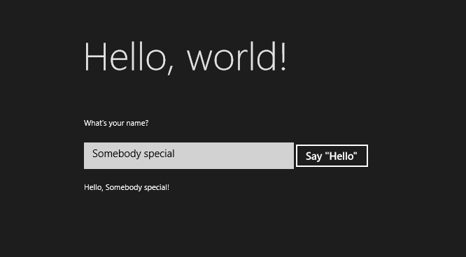
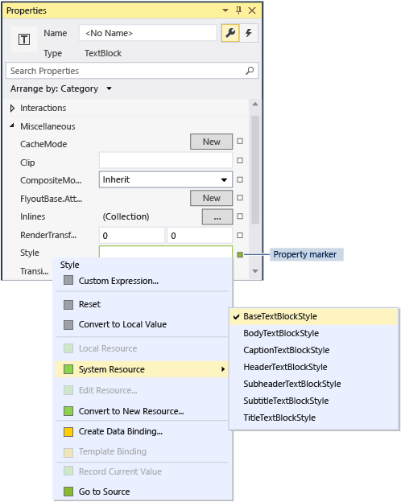

# C++로 "hello world" 앱 만들기(Windows 10)

Microsoft Visual Studio 2015에서 C++를 사용하여 Windows 10(Windows 10을 실행하는 휴대폰 포함)를 실행하는 앱을 개발할 수 있습니다. 이러한 앱에는 XAML(Extensible Application Markup Language)로 정의된 UI가 포함됩니다.

Windows 8.1 및 Windows Phone 8.1에서 실행되는 앱을 개발하려면 Microsoft Visual Studio 2013 업데이트 3 이상을 사용하고 [여기](https://msdn.microsoft.com/library/windows/apps/Dn263168)에 설명된 단계를 따릅니다. 가장 중요한 차이점은 Windows 8.1 및 Windows Phone 8.1에 대한 것으로, 데스크톱(또는 태블릿 장치)용 프로젝트 1개, 휴대폰용 프로젝트 1개, 공유 코드용 프로젝트 1개 이렇게 총 3개의 프로젝트가 포함된 솔루션을 사용합니다. Windows 10 개발의 경우 모든 코드가 동일한 프로젝트를 공유합니다.

다른 프로그래밍 언어의 자습서는 다음을 참조하세요.

-   [JavaScript를 사용하여 첫 Windows 스토어 앱 만들기](https://msdn.microsoft.com/library/windows/apps/BR211385)

-   [C# 또는 Visual Basic을 사용하여 첫 Windows 스토어 앱 만들기](https://msdn.microsoft.com/library/windows/apps/Hh974581)

## 시작하기 전에...

-   이 자습서를 완료하려면 Windows 10 또는 Windows 8.1을 실행하는 컴퓨터에서 Visual Studio 2015 Community 이상 또는 Visual Studio 2015의 비 Community 버전 중 하나를 사용해야 합니다. 다운로드하려면 [도구 얻기](http://go.microsoft.com/fwlink/p/?LinkId=532666)를 참조하세요.
-   유니버설 Windows 플랫폼 개발에 적합한 [SDK](http://go.microsoft.com/fwlink/?LinkId=533049)를 설치합니다.
-   또한 개발자 라이선스도 있어야 합니다. 자세한 방법은 [개발자 라이선스 얻기](https://msdn.microsoft.com/library/windows/apps/Hh974578)를 참조하세요.
-   표준 C++, XAML 및 [XAML 개요](https://msdn.microsoft.com/library/windows/apps/Mt185595)에 나오는 개념을 기본적으로 이해하고 있어야 합니다.
-   여기에서는 Visual Studio의 기본 창 레이아웃을 사용한다고 가정합니다. 기본 레이아웃으로 재설정하려면 메뉴 모음에서 **창** > **창 레이아웃 다시 설정**을 선택합니다.
-   XAML 디자이너를 로드할 때 NullReferenceException을 발생시킬 수 있는 Visual Studio 2015의 알려진 문제가 있습니다. 해결 방법을 적용하지 않으면 이 문제로 인해 이 자습서의 일부 단계가 차단됩니다. 이 문제 및 해결 방법에 대한 자세한 내용은 [이 MSDN 포럼 게시물](http://go.microsoft.com/fwlink/p/?LinkId=624036)을 참조하세요.

## C++ 데스크톱 앱과 Windows 스토어 앱 비교

C++를 사용한 Windows 데스크톱 프로그래밍에 대한 기본 지식이 있는 개발자에게 Windows 스토어 앱 및 Windows Phone 앱 프로그래밍의 일부 측면은 익숙하지만 또 어떤 측면은 추가 학습이 필요할 수 있습니다.

### 같은 점

-   Windows 런타임 환경에서 액세스할 수 없는 Windows 함수를 코드에서 호출하지 않는 한 STL 및 CRT(일부 예외 있음), 기타 C++ 라이브러리를 사용할 수 있습니다.

-   비주얼 디자이너에 익숙한 경우 여전히 Microsoft Visual Studio에 기본 제공된 디자이너를 사용하거나 전체 기능을 제공하는 Blend for Visual Studio를 사용할 수 있습니다. UI를 직접 코딩하는 데 익숙한 경우 XAML을 직접 코딩할 수 있습니다.

-   여전히 Windows 운영 체제 형식과 사용자 지정 형식을 사용하는 앱을 만듭니다.

-   여전히 Visual Studio 디버거, 프로파일러 및 기타 개발 도구를 사용합니다.

-   여전히 Visual C++ 컴파일러를 사용하여 네이티브 컴퓨터 코드로 컴파일되는 앱을 만듭니다. C++로 만든 Windows 스토어 앱은 관리되는 런타임 환경에서 실행되지 않습니다.

### 새로운 기능

-   Windows 스토어 앱 및 유니버설 Windows 앱의 디자인 원칙은 데스크톱 앱의 디자인 원칙과 매우 다릅니다. 창 테두리, 레이블, 대화 상자 등은 별로 중요하지 않고 내용이 가장 중요합니다. 뛰어난 유니버설 Windows 앱은 계획 단계 초기부터 이러한 원칙을 따릅니다.

-   XAML을 사용하여 전체 UI를 정의합니다. UI와 핵심 프로그램 논리 간의 구분은 MFC 또는 Win32 앱에서보다 Windows 유니버설 앱에서 훨씬 명확하게 나타납니다. 코드 파일에서 동작을 구현하기 위해 작업할 수도 있고 XAML 파일에서 UI의 모양을 구현하기 위해 작업할 수도 있습니다.

-   일부 기능에 Windows 장치 Win32를 여전히 사용할 수 있지만 주로 탐색이 용이하고 개체 지향적인 새 API인 Windows 런타임에 대해 프로그래밍을 수행합니다.

-   C++/CX를 사용하여 Windows 런타임 개체를 사용하고 만들 수 있습니다. C++/CX에서는 C++ 예외 처리, 대리자, 이벤트 및 동적으로 만들어진 개체에 대한 자동 참조 계산을 지원합니다. C++/CX를 사용할 경우 기본 COM 및 Windows 아키텍처의 세부 사항이 앱 코드에서 숨겨져 있습니다. 자세한 내용은 [C++/CX 언어 참조](https://msdn.microsoft.com/en-us/library/windows/apps/hh699871.aspx)를 참조하세요.

-   앱은 앱이 포함하는 형식, 사용하는 리소스 및 필요로 하는 기능(파일 액세스, 인터넷 액세스, 카메라 액세스 등)에 대한 메타데이터도 포함하는 패키지로 컴파일됩니다.

-   Windows 스토어 및 Windows Phone 스토어에서 인증 프로세스를 통해 앱의 안정성이 확인되면 그에 따라 수백 만의 잠재 고객을 두게 됩니다.

## C++로 작성한 Hello World 스토어 앱

첫 번째로 작성할 앱은 대화형 작업, 레이아웃 및 스타일의 일부 기본 기능을 보여 주는 "Hello World"입니다. Windows 유니버설 앱 프로젝트 템플릿에서 앱을 만듭니다. 이전에 Windows 8.1 및 Windows Phone 8.1용 앱을 개발한 경우 Windows 앱용 프로젝트 1개, 휴대폰 앱용 프로젝트 1개, 공유 코드용 프로젝트 1개 이렇게 총 3개의 프로젝트를 Visual Studio에서 사용해야 했던 사실을 기억할 수 있을 것입니다. Windows 10 UWP(유니버설 Windows 플랫폼)를 사용하면 Windows 10을 실행하는 데스크톱 및 노트북 컴퓨터, 태블릿, 휴대폰 등의 장치를 비롯한 모든 장치에서 실행되는 단 하나의 프로젝트를 사용할 수 있습니다.

다음과 같은 기본 사항에서 시작해 보겠습니다.

-   Visual Studio 2015 이상에서 유니버설 Windows 프로젝트를 만드는 방법

-   만든 다양한 프로젝트 및 파일을 이해하는 방법

-   Visual C++ 구성 요소 확장(C++/CX)에서 이러한 확장을 이해하는 방법과 사용하는 시기

**Visual Studio에서 솔루션 만들기**

1.  Visual Studio의 메뉴 모음에서 **파일** > **새로 만들기** > **프로젝트**를 선택합니다.

2.  **새 프로젝트** 대화 상자의 왼쪽 창에서 **설치됨** > **Visual C++** > **Windows** > **유니버설**을 확장합니다.

3.  가운데 창에서 **비어 있는 앱(범용 앱)**을 선택합니다.

4.  프로젝트 이름을 입력합니다. 여기에서는 HelloWorld라고 입력합니다.

 

5.  **확인** 단추를 선택합니다.

   UWP 프로젝트를 처음 만드는 경우 컴퓨터에서 개발자 모드를 활성화하지 않았다면 개발자 모드 활성화 대화 상자가 나타납니다. 링크를 클릭하여 개발자 모드를 설정할 수 있는 설정 페이지를 불러옵니다. 개발자 모드에서는 앱을 개발하고 로컬로 실행할 수 있습니다.

   프로젝트 파일이 생성됩니다.

다음 단계를 진행하기 전에 솔루션의 내용을 살펴보겠습니다.


### 프로젝트 파일 정보

프로젝트 폴더의 모든 .xaml 파일은 동일 폴더에 해당 .xaml.h 파일과 .xaml.cpp 파일이 있으며 생성된 파일 폴더(디스크에 있지만 프로젝트의 일부가 아님)에 .g 파일과 .g.hpp 파일이 있습니다. XAML 파일을 수정하여 UI 요소를 만든 다음 이들 요소를 데이터 원본에 연결합니다(DataBinding). .h 및 .cpp 파일을 수정하여 이벤트 처리기에 대한 사용자 지정 논리를 추가합니다. 자동으로 생성된 파일은 XAML 태그가 C++로 변환되었음을 나타냅니다. 코드 숨김 작동 방식을 더 잘 이해할 수 있도록 이러한 파일을 살펴보세요. 단, 수정하지는 마세요. 기본적으로 생성된 파일에는 XAML 루트 요소용 partial 클래스 정의가 포함되어 있으며, 이 클래스는 \*.xaml.h 및 .cpp 파일에서 수정하는 클래스와 동일합니다. 생성된 파일은 XAML UI 자식 요소를 작성하는 코드에서 참조할 수 있도록 클래스 멤버로 선언합니다. 빌드 시, 생성된 코드와 개발자가 작성한 코드가 전체 클래스 정의에 병합되어 컴파일됩니다.

먼저 프로젝트 파일을 살펴보겠습니다.

-   **App.xaml, App.xaml.h, App.xaml.cpp:** 앱의 진입점인 응용 프로그램 개체를 나타냅니다. App.xaml에는 페이지별 UI 태그가 포함되어 있지 않지만, 모든 페이지에서 액세스할 수 있도록 할 UI 스타일과 기타 요소를 추가할 수 있습니다. 코드 숨김 파일에는 **OnLaunched** 및 **OnSuspending** 이벤트에 대한 처리기가 포함되어 있습니다. 일반적으로 시작될 때 앱을 초기화하고 일시 중단되거나 종료될 때 정리를 수행하는 사용자 지정 코드를 여기에 추가할 수 있습니다.
-   **MainPage.xaml, MainPage.xaml.h, MainPage.xaml.cpp:** 앱의 기본 "시작" 페이지에 대한 XAML 태그 및 코드 숨김이 포함되어 있습니다. 탐색 지원 또는 기본 제공 컨트롤이 없습니다.
-   **pch.h, pch.cpp:** 미리 컴파일된 헤더 파일과 프로젝트에 해당 헤더 파일을 포함하는 파일입니다. pch.h에는 자주 변경되지 않고 솔루션의 다른 파일에 포함되어 있는 헤더를 포함할 수 있습니다.
-   **Package.appxmanifest:** 앱에 필요한 장치 기능과, 앱 버전 정보 및 기타 메타데이터를 설명하는 XML 파일입니다. **매니페스트 디자이너**에서 이 파일을 열려면 해당 파일을 두 번 클릭하면 됩니다.
-   **HelloWorld\_TemporaryKey.pfx:** Visual Studio에서 이 컴퓨터의 앱 배포를 지원하는 키입니다.

## 코드 개요

App.xaml.h, 공유 프로젝트의 App.xaml.cpp에 포함된 코드를 살펴보면 대부분이 친숙한 C++ 코드임을 알 수 있습니다. 그러나 Windows 런타임 앱을 처음 사용하거나 C++/CLI로 작업했던 경우 일부 구문 요소가 친숙하지 않을 수 있습니다. 다음은 C++/CX에서 가장 일반적으로 사용되는 표준 이외의 구문 요소입니다.

-   **Ref 클래스**

Windows API의 모든 형식 즉, XAML 컨트롤, 앱의 페이지, App 클래스 자체, 모든 장치 및 네트워크 개체, 모든 컨테이너 유형을 포함하는 거의 모든 Windows 런타임 클래스가 **ref class**로 선언됩니다. 일부 Windows 형식은 **value class** 또는 **value struct**입니다. ref 클래스는 모든 언어에서 사용할 수 있습니다. C++에서는 이러한 형식에 대한 수명이 자동 참조 계산(가비지 수집 아님)을 통해 제어되므로 이러한 개체를 명시적으로 삭제할 필요가 없습니다. 고유의 ref 클래스를 만들 수도 있습니다.

```cpp
    namespace HelloWorld
    {
        /// <summary>
        /// An empty page that can be used on its own or navigated to within a Frame.
        /// </summary>
        public ref class MainPage sealed
        {
        public:
            MainPage();

        };
    }
```    

모든 Windows 런타임 형식을 네임스페이스 내에서 선언해야 하며, ISO C++에서와는 달리 형식 자체에 접근성 한정자가 있습니다. **public** 한정자는 네임스페이스 외부에 있는 Windows 런타임 구성 요소에 이 클래스를 표시합니다. **sealed** 키워드는 이 클래스를 기본 클래스로 사용할 수 없음을 의미합니다. 거의 모든 ref 클래스가 봉인됩니다. 클래스 상속성은 Javascript에서 인식되지 않으므로 광범위하게 사용되지 않습니다.

-   **ref new** 및 **^ (hats)**

 ^(해트) 연산자를 사용하여 ref 클래스 변수를 선언하고, ref new 키워드로 개체를 인스턴스화합니다. 그 후에 C++ 포인터처럼 -> 연산자로 개체의 인스턴스 메서드에 액세스합니다. 정적 메서드는 ISO C++에서처럼 :: 연산자로 액세스합니다.

 다음 코드에서는 정규화된 이름을 사용하여 개체를 인스턴스화하고 -> 연산자를 사용하여 인스턴스 메서드를 호출합니다.

 ```cpp
    Windows::UI::Xaml::Media::Imaging::BitmapImage^ bitmapImage =
        ref new Windows::UI::Xaml::Media::Imaging::BitmapImage();
      
    bitmapImage->SetSource(fileStream);
    ```

   Typically, in a .cpp file we would add a `using namespace  Windows::UI::Xaml::Media::Imaging` directive and the auto keyword, so that the same code would look like this:

```cpp
    auto bitmapImage = ref new BitmapImage();
    bitmapImage->SetSource(fileStream);
```

-   **속성**

   ref 클래스에는 관리되는 언어에서처럼 사용 코드에 필드로 표시되는 특수 멤버 함수인 속성이 있을 수 있습니다.

```cpp
    public ref class SaveStateEventArgs sealed
            {
            public:

                // Declare the property
                property Windows::Foundation::Collections::IMap<Platform::String^, Platform::Object^>^ PageState
                {
                    Windows::Foundation::Collections::IMap<Platform::String^, Platform::Object^>^ get();
                }
    ...
    };

    ...
    // consume the property like a public field
    void PhotoPage::SaveState(Object^ sender, Common::SaveStateEventArgs^ e)
    {    
        if (mruToken != nullptr && !mruToken->IsEmpty())
        {
            e->PageState->Insert("mruToken", mruToken);
        }
    }
```

-   **대리자**

   관리되는 언어에서처럼 대리자는 특정 서명으로 함수를 캡슐화하는 참조 형식입니다. 대리자는 흔히 이벤트 및 이벤트 처리기와 함께 사용됩니다.

```cpp
    // Delegate declaration (within namespace scope)
    public delegate void LoadStateEventHandler(Platform::Object^ sender, LoadStateEventArgs^ e);

    // Event declaration (class scope)
    public ref class NavigationHelper sealed
    {
      public:
        event LoadStateEventHandler^ LoadState;
    };

    // Create the event handler in consuming class
    MainPage::MainPage()
    {
        auto navigationHelper = ref new Common::NavigationHelper(this);
        navigationHelper->LoadState += ref new Common::LoadStateEventHandler(this, &MainPage::LoadState);
    }
```

## 앱에 콘텐츠 추가

약간의 콘텐츠를 앱에 추가해 보겠습니다.

**1단계: 시작 페이지 수정**

1.  **솔루션 탐색기**에서 MainPage.xaml을 엽니다.
2.  다음 XAML을 닫는 태그 바로 앞에서 루트 [**Grid**](https://msdn.microsoft.com/library/windows/apps/BR242704)에 추가하여 UI에 대한 컨트롤을 만듭니다. 여기에는 사용자의 이름을 묻는 [**TextBlock**](https://msdn.microsoft.com/library/windows/apps/BR209652), 사용자의 이름을 수용하는 [**TextBox**](https://msdn.microsoft.com/library/windows/apps/BR209683) 요소, [**Button**](https://msdn.microsoft.com/library/windows/apps/BR209265) 및 또 다른 **TextBlock** 요소가 있는 [**StackPanel**](https://msdn.microsoft.com/library/windows/apps/BR209635)이 포함됩니다.

```xml
    <StackPanel x:Name="contentPanel" Margin="120,30,0,0">
        <TextBlock HorizontalAlignment="Left" Text="Hello World" FontSize="36"/>
        <TextBlock Text="What's your name?"/>
        <StackPanel x:Name="inputPanel" Orientation="Horizontal" Margin="0,20,0,20">
            <TextBox x:Name="nameInput" Width="300" HorizontalAlignment="Left"/>
            <Button x:Name="inputButton" Content="Say \"Hello\""/>
        </StackPanel>
        <TextBlock x:Name="greetingOutput"/>
    </StackPanel>
```

이 내용은 [탐색, 레이아웃 및 보기](https://msdn.microsoft.com/library/windows/apps/Dn263172) 문서에서 XAML 레이아웃에 대해 더 자세히 설명합니다.

3.  이제 매우 간단한 유니버설 Windows 앱을 만들었습니다. UWP 앱의 모양을 확인하려면 F5 키를 눌러 디버깅 모드에서 앱을 빌드, 배포 및 실행합니다.

먼저 기본 시작 화면이 나타납니다. Assets\\SplashScreen.scale-100.png라는 이미지와 앱의 매니페스트 파일에 지정되어 있는 배경색이 있습니다. 시작 화면을 사용자 지정하는 방법에 대해 알아보려면 [시작 화면 추가](https://msdn.microsoft.com/library/windows/apps/Hh465332)를 참조하세요.

시작 화면이 사라지고 나면 앱이 나타납니다. 앱의 기본 페이지가 표시됩니다.

Windows 키를 누르거나 시작 단추를 클릭하여 시작 메뉴로 이동하고 앱을 배포하여 시작 메뉴의 설치된 앱 목록에 앱이 추가되는지 확인합니다. 모든 앱 단추 옆의 새 링크를 클릭해도 나타납니다. 앱을 다시 실행하려면 해당 타일을 탭 또는 클릭하거나 Visual Studio에서 F5 키 또는 Ctrl+F5를 누릅니다.

 

   아직 기능은 많지 않지만 첫 유니버설 Windows 플랫폼 앱이 작성되었습니다. 축하합니다.

   디버깅을 중지하고 앱을 닫으려면 Visual Studio로 돌아가서 Shift+F5를 누릅니다.

   자세한 내용은 [Visual Studio에서 스토어 앱 실행](http://go.microsoft.com/fwlink/p/?LinkId=619619)을 참조하세요.

   앱에서는 [**TextBox**](https://msdn.microsoft.com/library/windows/apps/BR209683)에 입력할 수도 있지만 [**Button**](https://msdn.microsoft.com/library/windows/apps/BR209265)를 클릭해도 아무런 작동을 하지 않습니다. 이후 단계에서는 단추의 [**Click**](https://msdn.microsoft.com/library/windows/apps/BR227737) 이벤트에 대해 개인 설정 인사말을 표시하는 이벤트 처리기를 만듭니다.

## 모바일 장치 에뮬레이터에서 앱 시작


앱이 Windows 10 장치에서 실행되므로 Windows Phone에서 어떻게 표시되는지 살펴보겠습니다. 이 섹션에는 Windows 10을 실행하는 Windows Phone이 필요합니다. 또는 Windows Phone 에뮬레이터에 액세스해야 하며, HyperV를 지원하고 사용하는 실제 컴퓨터(가상 컴퓨터가 아님)에서 Visual Studio를 실행해야 합니다.

Visual Studio는 데스크톱 장치에서 디버깅하는 옵션 외에도 컴퓨터에 연결된 실제 모바일 장치 또는 모바일 장치 에뮬레이터에서 앱을 배포 및 디버깅하는 옵션도 제공합니다. 메모리 및 디스플레이 구성이 서로 다른 장치에 대한 에뮬레이터 중에서 선택할 수 있습니다.

-   **장치**
-   **에뮬레이터 10.0.0.0 WVGA 4인치 512MB**
-   기타 구성의 다양한 에뮬레이터

화면이 작고 메모리가 제한된 장치에서 앱을 테스트하는 것이 좋으므로 **에뮬레이터 10.0.0.0 WVGA 4인치 512MB** 옵션을 사용합니다.
**팁** Phone 에뮬레이터 사용에 대한 자세한 내용은 [에뮬레이터에서 Windows Phone 앱 실행](http://go.microsoft.com/fwlink/p/?LinkId=394233)을 참조하세요.

 

실제 장치에서 앱을 디버그하려면 개발용으로 등록된 장치가 있어야 합니다. 자세한 내용은 [Windows Phone 등록](https://msdn.microsoft.com/library/windows/apps/Dn614128)을 참조하세요.

**모바일 장치 에뮬레이터에서 디버깅을 시작하려면**

1.  **표준** 도구 모음의 대상 디바이스 메뉴()에서 **에뮬레이터 10.0.0.0 WVGA 4인치 512MB**를 선택합니다.
2.  도구 모음에서 **디버깅 시작** 단추()를 클릭합니다.

   –또는–

   **디버그** 메뉴에서 **디버깅 시작**을 클릭합니다.

   –또는–

   F5 키를 누릅니다.

모바일 장치 에뮬레이터에서 앱은 다음과 같이 표시됩니다.


Visual Studio에서 선택한 에뮬레이터를 시작한 다음 앱을 배포하고 시작합니다. 가장 먼저 눈에 띄는 것은 로컬 컴퓨터에 적절히 표시되는 120 픽셀의 왼쪽 여백이며, 이 여백으로 인해 모바일 장치의 작은 화면에 콘텐츠를 넣은 것처럼 보입니다. 이 자습서 뒷부분에서는 앱이 항상 멋지게 표시되도록 다양한 화면 크기에 맞게 UI를 적용하는 방법을 알아봅니다.

## 2단계: 이벤트 처리기 만들기

1.  MainPage.xaml의 XAML 또는 디자인 뷰에서 이전에 추가한 [**StackPanel**](https://msdn.microsoft.com/library/windows/apps/BR209635)의 "Say Hello" [**단추**](https://msdn.microsoft.com/library/windows/apps/BR209265)를 선택합니다.
2.  Alt+Enter를 눌러서 **속성 창**을 열고 나서 이벤트 단추()를 선택합니다.
3.  [
            **Click**](https://msdn.microsoft.com/library/windows/apps/BR227737) 이벤트를 찾습니다. 텍스트 상자에 **Click** 이벤트를 처리하는 함수의 이름을 입력합니다. 이 예제에서는 "Button\_Click"을 입력합니다.


4.  Enter 키를 누릅니다. 이벤트 처리기 메서드가 MainPage.xaml.cpp에서 만들어지고 이벤트 발생 시 실행될 코드를 추가할 수 있도록 열립니다.

   이와 동시에 MainPage.xaml에서 [**Button**](https://msdn.microsoft.com/library/windows/apps/BR209265)에 대한 XAML은 다음과 같이 [**Click**](https://msdn.microsoft.com/library/windows/apps/BR227737) 이벤트 처리기를 선언하도록 업데이트됩니다.

```xml
    <Button Content="Say \"Hello\"" Click="Button_Click"/>
```

xaml 코드에 수동으로 추가할 수도 있습니다. 이는 디자이너가 로드되지 않은 경우에 유용할 수 있습니다. 수동으로 입력한 경우 "Click"을 입력한 다음 IntelliSense에서 새 이벤트 처리기를 추가하는 옵션을 팝업하도록 합니다. 이렇게 하면 Visual Studio에서 필요한 메서드 선언 및 스텁을 만듭니다.

렌더링 중 처리되지 않은 예외가 발생한 경우에는 디자이너가 로드되지 않습니다. 디자이너에서의 렌더링에서는 디자인 타임 버전의 페이지가 실행됩니다. 이는 사용자 코드 실행을 비활성화하는 데 유용할 수 있습니다. 이렇게 하려면 **도구, 옵션** 대화 상자에서 설정을 변경하면 됩니다. **XAML 디자이너**에서 **XAML 디자이너에서 프로젝트 실행(지원되는 경우)**의 선택을 취소합니다.

5.  MainPage.xaml.cpp에서 방금 만든 **Button\_Click** 이벤트 처리기에 다음 코드를 추가합니다. 이 코드는 `nameInput`[**TextBox**](https://msdn.microsoft.com/library/windows/apps/BR209683) 컨트롤에서 사용자 이름을 검색한 다음 이 이름을 사용하여 인사말을 만듭니다. `greetingOutput`
            [
            **TextBlock**](https://msdn.microsoft.com/library/windows/apps/BR209652)에 결과가 표시됩니다.

```cpp
    void HelloWorld::MainPage::Button_Click(Platform::Object^ sender, Windows::UI::Xaml::RoutedEventArgs^ e)
    {
        greetingOutput->Text = "Hello, " + nameInput->Text + "!";
    }
```

6.  해당 프로젝트를 시작 프로젝트로 설정하고 나서 F5 키를 눌러서 앱을 빌드하고 실행합니다. 텍스트 상자에 이름을 입력하고 단추를 클릭하면 앱에서 개인 설정 인사말을 표시합니다.


## 3단계: 시작 페이지 스타일 지정

### 테마 선택

앱의 모양과 느낌은 손쉽게 사용자 지정할 수 있습니다. 기본적으로 앱은 밝은 스타일의 리소스를 사용합니다. 시스템 리소스에는 밝은 테마도 있습니다. 테스트해 보고 어떻게 보이는지 확인해 보겠습니다.

**어두운 테마로 전환하려면**

1.  App.xaml을 엽니다.
2.  여는 [**Application**](https://msdn.microsoft.com/library/windows/apps/BR242324) 태그에서 [**RequestedTheme**](https://msdn.microsoft.com/library/windows/apps/windows.ui.xaml.application.requestedtheme) 속성을 편집하고 해당 값을 **Dark**로 설정합니다.

```xml
   RequestedTheme="Light"
```

어두운 테마가 있는 전체 [**Application**](https://msdn.microsoft.com/library/windows/apps/BR242324) 태그는 다음과 같습니다.

```xml 
        <Application
        x:Class="HelloWorld.App"
        xmlns="http://schemas.microsoft.com/winfx/2006/xaml/presentation"
        xmlns:x="http://schemas.microsoft.com/winfx/2006/xaml"
        xmlns:local="using:HelloWorld" 
        RequestedTheme="Dark">
```

3.  F5 키를 눌러 앱을 빌드 및 실행합니다. 해당 프로젝트에 어두운 테마가 사용됩니다.



어떤 테마를 사용해야 할까요? 어느 것이든 원하는 것을 사용하면 됩니다. 주로 이미지 또는 동영상을 표시하는 앱에는 어두운 테마를 사용하는 것이 좋고, 텍스트가 많이 들어 있는 앱에는 밝은 테마를 사용하는 것이 좋습니다. 사용자 지정 색 구성표를 사용하려는 경우 앱의 모양과 느낌에 가장 잘 맞는 테마를 사용하세요. 이 자습서의 나머지 부분에서는 스크린샷에 밝은 테마를 사용합니다.

**참고** 테마는 앱이 시작될 때 적용되며 앱이 실행되는 동안에는 변경할 수 없습니다.

### 시스템 스타일 사용

지금은 Windows 앱의 텍스트가 매우 작아서 읽기가 어렵습니다. 시스템 스타일을 적용하여 수정해 보겠습니다.

**요소의 스타일을 변경하려면**

1.  Windows 프로젝트에서 MainPage.xaml을 엽니다.
2.  XAML 또는 디자인 뷰에서 이전에 추가한 "What's your name?"[**TextBlock**](https://msdn.microsoft.com/library/windows/apps/BR209652)을 선택합니다.
3.  **속성** 창(**F4**)의 오른쪽 위에서 속성 단추()를 선택합니다.
4.  **텍스트** 그룹을 확장하고 글꼴 크기를 18px로 설정합니다.
5.  **기타** 그룹을 확장하고 **스타일** 속성을 찾습니다.
6.  속성 마커(**스타일** 속성 오른쪽에 있는 녹색 상자)를 클릭하고 나서 메뉴에서 **시스템 리소스** > **BaseTextBlockStyle**을 선택합니다.

 **BaseTextBlockStyle**은 \\Program Files\\Windows Kits\\10\\Include\\winrt\\xaml\\design\\generic.xaml의 [**ResourceDictionary**](https://msdn.microsoft.com/library/windows/apps/BR208794)에 <root>정의된 리소스입니다.



 XAML 디자인 화면에서 텍스트의 모양이 변경됩니다. XAML 편집기에서 [**TextBlock**](https://msdn.microsoft.com/library/windows/apps/BR209652)에 대한 XAML이 업데이트됩니다.

```xml
   <TextBlock Text="What's your name?" Style="{StaticResource BasicTextStyle}"/><
```

7.  프로세스를 반복하여 글꼴 크기를 설정하고 `greetingOutput`[**TextBlock**](https://msdn.microsoft.com/library/windows/apps/BR209652) 요소에 **BaseTextBlockStyle**을 할당합니다.

  **팁** 이 [**TextBlock**](https://msdn.microsoft.com/library/windows/apps/BR209652)에는 텍스트가 없지만 XAML 디자인 화면 위로 포인터를 이동하면 포인터의 위치가 파란색 윤곽선으로 표시되므로 이를 선택할 수 있습니다.  

  이제 XAML은 다음과 같습니다.

```xml
    <StackPanel x:Name="contentPanel" Margin="120,30,0,0">
        <TextBlock Style="{ThemeResource BaseTextBlockStyle}" FontSize="16" Text="What's your name?"/>
        <StackPanel x:Name="inputPanel" Orientation="Horizontal" Margin="0,20,0,20">
            <TextBox x:Name="nameInput" Width="300" HorizontalAlignment="Left"/>
            <Button x:Name="inputButton" Content="Say \"Hello\"" Click="Button_Click"/>
        </StackPanel>
        <TextBlock Style="{ThemeResource BaseTextBlockStyle}" FontSize="16" x:Name="greetingOutput"/>
    </StackPanel>
```

8.  F5 키를 눌러 앱을 빌드 및 실행합니다. 이제 모양은 다음과 같습니다.

 

### 4단계: UI를 다양한 창 크기로 조정

이제 모바일 장치에서 멋지게 표시되도록 다양한 화면 크기에 맞게 UI를 적용할 수 있습니다. 이 작업을 수행하려면 [**VisualStateManager**](https://msdn.microsoft.com/library/windows/apps/BR209021)을(를) 추가하고 다양한 시각적 상태에 적용되는 속성을 설정합니다.

**UI 레이아웃을 조정하려면**

1.  XAML 편집기에서 이 XAML 블록을 루트 [**Grid**](https://msdn.microsoft.com/library/windows/apps/BR242704) 요소의 여는 태그 뒤에 추가합니다.

```xml
    <VisualStateManager.VisualStateGroups>
        <VisualStateGroup>
            <VisualState x:Name="wideState">
                <VisualState.StateTriggers>
                    <AdaptiveTrigger MinWindowWidth="641" />
                </VisualState.StateTriggers>
            </VisualState>
            <VisualState x:Name="narrowState">
                <VisualState.StateTriggers>
                    <AdaptiveTrigger MinWindowWidth="0" />
                </VisualState.StateTriggers>
                <VisualState.Setters>
                    <Setter Target="contentPanel.Margin" Value="20,30,0,0"/>
                    <Setter Target="inputPanel.Orientation" Value="Vertical"/>
                    <Setter Target="inputButton.Margin" Value="0,4,0,0"/>
                </VisualState.Setters>
            </VisualState>
        </VisualStateGroup>
    </VisualStateManager.VisualStateGroups>
```

2.  로컬 컴퓨터에서 앱을 디버그합니다. 641 DIP(장치 독립적인 픽셀)보다 좁은 경우가 아니라면 UI가 이전과 동일한 모양으로 표시됩니다.
3.  모바일 장치 에뮬레이터에서 앱을 디버그합니다. UI가 `narrowState`에 정의된 속성을 사용하며, 작은 화면에 올바르게 나타납니다.


이전 버전의 XAML에서 [**VisualStateManager**](https://msdn.microsoft.com/library/windows/apps/BR209021)을(를) 사용한 적이 있으면 여기의 XAML에서 단순화된 구문을 사용할 수 있습니다.

`wideState`라는 [**VisualState**](https://msdn.microsoft.com/library/windows/apps/BR209007)에는 해당 [**MinWindowWidth**](https://msdn.microsoft.com/en-us/library/windows/apps/windows.ui.xaml.adaptivetrigger.minwindowwidth) 속성이 641로 설정된 [**AdaptiveTrigger**](https://msdn.microsoft.com/library/windows/apps/Dn890382)가 있습니다. 즉, 창 너비가 최소값인 641 DIP(장치 독립적인 픽셀)보다 작지 않은 경우에만 상태가 적용됩니다. 이 상태에 대해 어떤 [**Setter**](https://msdn.microsoft.com/library/windows/apps/BR208817) 개체도 정의하지 않았으므로 페이지 내용에 대한 XAML에 정의된 레이아웃 속성을 사용합니다.

두 번째 [**VisualState**](https://msdn.microsoft.com/library/windows/apps/BR209007), `narrowState`에는 해당 [**MinWindowWidth**](https://msdn.microsoft.com/en-us/library/windows/apps/windows.ui.xaml.adaptivetrigger.minwindowwidth) 속성이 0으로 설정된 [**AdaptiveTrigger**](https://msdn.microsoft.com/library/windows/apps/Dn890382)가 있습니다. 창 너비가 0보다 크지만 641 DIP보다는 작은 경우에 이 상태가 적용됩니다. (641DIP에서 `wideState`이(가) 적용됩니다.) 이 상태에서는 UI에 있는 컨트롤의 레이아웃 속성을 변경하도록 일부 [**Setter**](https://msdn.microsoft.com/library/windows/apps/BR208817) 개체를 다음과 같이 정의합니다.

-   `contentPanel` 요소의 왼쪽 여백을 120에서 20으로 줄입니다.
-   `inputPanel` 요소의 [**Orientation**](https://msdn.microsoft.com/library/windows/apps/windows.ui.xaml.controls.stackpanel.orientation)을 **Horizontal**에서 **Vertical**로 변경합니다.
-   4 DIP의 상단 여백을 `inputButton` 요소에 추가합니다.

### 요약

축하합니다! 첫 번째 자습서를 완료했습니다. 이 자습서에서는 Windows 유니버설 앱에 콘텐츠 및 대화형 작업을 추가하는 방법과 앱의 모양을 변경하는 방법에 대해 알아보았습니다.

## 다음 단계

Windows 8.1 및/또는 Windows Phone 8.1을 대상으로 하는 Windows 유니버설 앱 프로젝트가 있는 경우 해당 프로젝트를 Windows 10으로 포팅할 수 있습니다. 이 포팅 작업을 위한 자동 프로세스가 없지만 수동으로 약간의 작업만 수행하면 됩니다. 새 Windows 유니버설 프로젝트로 시작하여 이 항목의 지침에 따라 최신 프로젝트 시스템 구조 및 매니페스트 파일을 다운로드하고, 프로젝트의 디렉터리 구조에 코드 파일을 복사하며, 프로젝트에 항목을 추가하고, [**VisualStateManager**](https://msdn.microsoft.com/library/windows/apps/BR209021)를 사용하여 XAML을 다시 작성하세요. 자세한 내용은 [Windows 런타임 8 프로젝트를 UWP(유니버설 Windows 플랫폼) 프로젝트로 포팅](https://msdn.microsoft.com/library/windows/apps/Mt188203) 및 [유니버설 Windows 플랫폼으로 포팅(C++)](http://go.microsoft.com/fwlink/p/?LinkId=619525)을 참조하세요.

기존 응용 프로그램의 새 UWP UI를 만드는 등의 목적으로 UWP 앱과 통합하려는 기존 C++ 코드가 있는 경우 [방법: 유니버설 Windows 프로젝트에서 C++ 코드 사용](http://go.microsoft.com/fwlink/p/?LinkId=619623)을 참조하세요.


<!--HONumber=Mar16_HO1-->


