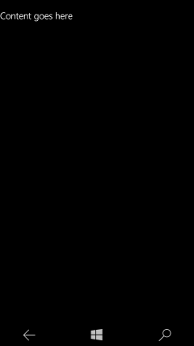
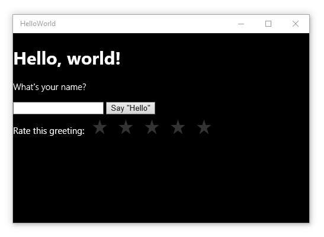

# "Hello, world" 앱 만들기(JS)

이 자습서에서는 JavaScript 및 HTML을 사용하여 Windows 10의 UWP(유니버설 Windows 플랫폼)를 대상으로 하는 간단한 "Hello, world" 앱을 만드는 방법을 설명합니다. Microsoft Visual Studio의 단일 프로젝트를 사용하여 Windows 10 장치에서 실행되는 앱을 빌드할 수 있습니다. 여기에서는 데스크톱과 모바일 장치 모두에서 원활하게 실행되는 앱을 만드는 데 집중합니다.

**중요** 이 자습서는 Microsoft Visual Studio 2015 및 Windows 10에서 사용하도록 고안되었습니다. 이전 버전에서는 제대로 적용되지 않습니다.

여기에서는 다음에 대한 방법을 알아봅니다.

-   새 프로젝트 만들기
-   시작 페이지에 HTML 콘텐츠 추가
-   터치, 펜 및 마우스 입력 처리
-   로컬 데스크톱 및 Visual Studio의 휴대폰 에뮬레이터에서 프로젝트를 실행합니다.
-   직접 사용자 지정 스타일 만들기
-   JavaScript용 Windows 라이브러리 컨트롤 사용

##시작하기 전에...


-   간단한 유니버설 앱을 만드는 데 사용하는 절차로 바로 들어갑니다. 따라서 이 자습서를 시작하기 전에 [Windows 10의 새로운 기능](https://dev.windows.com/whats-new-windows-10-dev-preview) 및 [유니버설 Windows 앱이란?](whats-a-uwp.md)의 개요 정보를 읽고 이해하는 것이 좋습니다.
-   이 자습서를 완료하려면 Windows 10 및 Visual Studio 2015가 필요합니다. 자세한 내용은 [설정](get-set-up.md)을 참조하세요.
-   또한, 여기에서는 Visual Studio의 기본 창 레이아웃을 사용한다고 가정합니다. 기본 레이아웃이 변경된 경우 **창** 메뉴에서 **창 레이아웃 다시 설정** 명령을 사용하여 다시 설정할 수 있습니다.

##1단계: Visual Studio에서 새 프로젝트 만들기


`HelloWorld`라는 새 앱을 만들겠습니다. 방법은 다음과 같습니다.

1.  Visual Studio 2015를 시작합니다.

    Visual Studio 2015 시작 화면이 나타납니다.

    (지금부터는 Visual Studio 2015를 간단히 Visual Studio로 지칭하겠습니다. )

2.  **파일** 메뉴에서 **새로 만들기** > **프로젝트**를 선택합니다.

    **새 프로젝트** 대화 상자가 나타납니다. 대화 상자의 왼쪽 창에서 표시할 템플릿 유형을 선택할 수 있습니다.

3.  왼쪽 창에서 **설치됨 > 템플릿 > JavaScript > Windows**를 차례로 확장한 후 **Windows 유니버설** 템플릿 그룹을 선택합니다. 대화 상자의 가운데 창에 UWP(유니버설 Windows 플랫폼) 앱용 프로젝트 템플릿 목록이 표시됩니다.

    

    이 자습서에서는 **Blank App** 템플릿을 사용합니다. 이 템플릿은 컴파일과 실행은 가능하지만 사용자 인터페이스 컨트롤이나 데이터는 포함되지 않은 최소한의 UWP 앱을 만듭니다. 이 자습서를 진행하면서 이 앱에 컨트롤과 데이터를 추가하게 됩니다.

4.  가운데 창에서 **비어 있는 앱(유니버설 Windows)** 템플릿을 선택합니다.

    **비어 있는 앱** 템플릿은 컴파일과 실행은 가능하지만 사용자 인터페이스 컨트롤이나 데이터는 포함되지 않은 최소한의 UWP 앱을 만듭니다. 이 자습서를 진행하면서 이 앱에 컨트롤을 추가하게 됩니다.

5.  **이름** 텍스트 상자에 "HelloWorld"를 입력합니다.
6.  **확인**을 클릭하여 프로젝트를 만듭니다.

    Visual Studio에서 프로젝트를 만들고 **솔루션 탐색기**에 표시합니다.

    

**Blank App**은 최소한의 템플릿이지만 여러 개의 파일이 포함되어 있습니다.

-   이름, 설명, 타일, 시작 페이지, 시작 화면 등 앱에 대한 설명과 앱에 포함된 파일의 목록이 수록되어 있는 매니페스트 파일(package.appxmanifest)
-   시작 메뉴에 표시되는 로고 이미지 집합(images/Square150x150Logo.scale-200.png, images/Square44x44Logo.scale-200.png, 및 images/Wide310x150Logo.scale-200.png)
-   Windows 스토어에서 해당 앱을 나타낼 이미지(images/StoreLogo.png)
-   앱 시작 시 표시되는 시작 화면(images/SplashScreen.scale-200.png)
-   앱 시작 시 실행되는 시작 페이지(default.html) 및 관련 JavaScript 파일(default.js)

해당 파일을 보고 편집하려면 **솔루션 탐색기**에서 해당 파일을 두 번 클릭합니다.

이러한 파일은 JavaScript를 사용하는 모든 UWP 앱에 필수적입니다. Visual Studio에서 만든 모든 프로젝트에는 해당 파일이 포함됩니다.

##2단계: 앱 시작


이제 매우 간단한 앱을 만들었습니다. 앱을 빌드, 배포 및 시작하고 앱의 모양을 확인할 시간입니다. 로컬 컴퓨터, 시뮬레이터, 에뮬레이터 또는 원격 장치에서 앱을 디버그할 수 있습니다. 다음은 Visual Studio의 대상 장치 메뉴입니다.


### 데스크톱 장치에서 앱 시작

기본적으로 앱은 로컬 컴퓨터에서 실행합니다. 대상 장치 메뉴는 데스크톱 장치 제품군의 장치에서 앱을 디버깅하기 위한 여러 옵션을 제공합니다.

-   **시뮬레이터**
-   **로컬 컴퓨터**
-   **원격 컴퓨터**

**로컬 컴퓨터에서 디버깅을 시작하려면**

1.  **표준** 도구 모음의 대상 디바이스 메뉴()에서 **로컬 컴퓨터**가 선택되었는지 확인합니다. 기본적으로 선택되어 있습니다.
2.  도구 모음에서 **디버깅 시작** 단추()를 클릭합니다.

   –또는–

   **디버그** 메뉴에서 **디버깅 시작**을 클릭합니다.

   –또는–

   F5 키를 누릅니다.

창에서 앱이 열리고 먼저 기본 시작 화면이 나타납니다. 시작 화면은 이미지(SplashScreen.png)와 배경색(앱의 매니페스트 파일에서 지정함)으로 정의됩니다.

시작 화면이 사라진 다음 앱이 나타납니다. 여기에는 검은색 화면에 "Content goes here" 텍스트가 표시됩니다.


Windows 키를 눌러 **시작** 메뉴를 연 후 모든 앱을 표시합니다. 로컬에서 앱을 배포하면 **시작** 메뉴에 해당 타일이 추가됩니다. 앱을 다시 실행하려면(디버깅 모드 아님) **시작** 메뉴에서 해당 타일을 탭하거나 클릭합니다.

아직 기능은 많지 않지만, 첫 UWP 앱을 빌드한 것을 축하드립니다.

**디버깅을 중지하려면**

-   도구 모음에서 **디버깅 중지** 단추()를 클릭합니다.

   –또는–

   **디버그** 메뉴에서 **디버깅 중지**를 클릭합니다.

   –또는–

   앱 창을 닫습니다.

### 모바일 장치 에뮬레이터에서 앱 시작

앱이 Windows 10 장치에서 실행되므로 Windows Phone에서 어떻게 표시되는지 살펴보겠습니다.

Visual Studio는 데스크톱 장치에서 디버깅하는 옵션 외에도 컴퓨터에 연결된 실제 모바일 장치 또는 모바일 장치 에뮬레이터에서 앱을 배포 및 디버깅하는 옵션도 제공합니다. 메모리 및 디스플레이 구성이 서로 다른 장치에 대한 에뮬레이터 중에서 선택할 수 있습니다.

-   **장치**
-   **에뮬레이터 <SDK version> WVGA 4인치 512MB**
-   **에뮬레이터 <SDK version> WVGA 4인치 1GB**
-   등(기타 구성의 다양한 에뮬레이터)

화면이 작고 메모리가 제한된 장치에서 앱을 테스트하는 것이 좋으므로 **에뮬레이터 10.0.10240.0 WVGA 4인치 512MB** 옵션을 사용합니다.
**모바일 장치 에뮬레이터에서 디버깅을 시작하려면**

1.  **표준** 도구 모음의 대상 디바이스 메뉴()에서 **에뮬레이터 10.0.10240.0 WVGA 4인치 512MB**를 선택합니다.
2.  도구 모음에서 **디버깅 시작** 단추()를 클릭합니다.

   –또는–

   **디버그** 메뉴에서 **디버깅 시작**을 클릭합니다.

   
Visual Studio에서 선택한 에뮬레이터를 시작한 다음 앱을 배포하고 시작합니다. 모바일 장치 에뮬레이터에서 앱은 다음과 같이 표시됩니다.



## 3단계: 시작 페이지 수정

Visual Studio가 작성한 파일 중 하나는 앱의 시작 페이지인 default.html입니다. 앱이 실행되면 시작 페이지의 콘텐츠가 표시됩니다. 시작 페이지에는 앱의 코드 파일과 스타일시트에 대한 참조도 포함되어 있습니다. 다음은 Visual Studio에서 개발자를 위해 생성한 시작 페이지입니다.

```html
<!DOCTYPE html>
<html>
<head>
    <meta charset="utf-8" />
    <title>HelloWorld</title>

    <!-- WinJS references -->
    <link href="WinJS/css/ui-dark.css" rel="stylesheet" />
    <script src="WinJS/js/base.js"></script>
    <script src="WinJS/js/ui.js"></script>

    <!-- HelloWorld references -->
    <link href="/css/default.css" rel="stylesheet" />
    <script src="/js/default.js"></script>
</head>
<body class="win-type-body">
    <p>Content goes here</p>
</body>
</html>
```

default.html 파일에 새로운 콘텐츠를 몇 가지 추가해 보겠습니다. 다른 HTML 파일에 콘텐츠를 추가하는 것과 같이[**body**](https://msdn.microsoft.com/library/windows/apps/Hh453011) 요소 내에 콘텐츠를 추가합니다. [몇 가지 예외](https://msdn.microsoft.com/library/windows/apps/Hh465380)를 제외하고 HTML5 요소를 사용하여 앱을 만들 수 있습니다. 이는 [**h1**](https://msdn.microsoft.com/library/windows/apps/Hh441078), [**p**](https://msdn.microsoft.com/library/windows/apps/Hh453431), [**button**](https://msdn.microsoft.com/library/windows/apps/Hh453017), [**div**](https://msdn.microsoft.com/library/windows/apps/Hh453133) 및 [**img**](https://msdn.microsoft.com/library/windows/apps/Hh466114)와 같은 HTML5 요소를 사용할 수 있음을 의미합니다.

**시작 페이지를 수정하려면**

1.  [
            **body**](https://msdn.microsoft.com/library/windows/apps/Hh453011) 요소의 기존 콘텐츠를 "Hello, world!"라는 첫 번째 수준 제목과 사용자의 이름을 묻는 텍스트, 사용자의 이름을 수용할 [**input**](https://msdn.microsoft.com/library/windows/apps/Hh453271) 요소, [**button**](https://msdn.microsoft.com/library/windows/apps/Hh453017) 및 [**div**](https://msdn.microsoft.com/library/windows/apps/Hh453133) 요소로 바꿉니다. **input**, **button** 및 **div**에 ID를 할당합니다.

 ```html
    <body class="win-type-body">
        <h1>Hello, world!</h1>
        <p>What' s your name?</p>
        <input id="nameInput" type="text" />
        <button id="helloButton">Say "Hello"</button>
        <div id="greetingOutput"></div>
    </body>
 ```

2.  로컬 컴퓨터에서 앱을 실행합니다. 다음과 같이 표시됩니다.


   [
            **input**](https://msdn.microsoft.com/library/windows/apps/Hh453271) 요소에 입력할 수는 있지만 지금은 [**button**](https://msdn.microsoft.com/library/windows/apps/Hh453017)을 클릭해도 아무것도 수행되지 않습니다. 일부 개체(예: **button**)는 특정 이벤트가 발생할 때 메시지를 보낼 수 있습니다. 이러한 이벤트 메시지는 이벤트에 응답하여 어떤 작업을 수행할 수 있는 기회를 제공합니다. 이벤트 처리기 메서드에서 이벤트에 응답할 코드를 넣습니다.

   다음 단계에서 [**button**](https://msdn.microsoft.com/library/windows/apps/Hh453017)에 대해 개인 설정 인사말을 표시하는 이벤트 처리기를 만들고 이벤트 처리기 코드를 default.js 파일에 추가하게 됩니다.

##4단계: 이벤트 처리기 만들기

새 프로젝트를 만들었을 때 Visual Studio가 /js/default.js 파일을 만들었습니다. 이 파일에는 앱의 수명 주기를 처리하는 코드가 포함됩니다. 또한 default.html 파일에 대화형 작업을 제공하는 추가 코드도 여기에 작성합니다.

default.js 파일을 엽니다.

코드 추가를 시작하기 전에 먼저 파일에 있는 코드의 처음과 마지막 몇 줄을 살펴보겠습니다.

```javascript
(function () {
    "use strict";

     // Omitted code 

 })(); 
```

무엇을 하는 것인지 궁금할 것입니다. 이 몇 줄의 코드는 default.js 코드의 나머지를 자체 실행 익명 함수로 래핑합니다. 자체 실행 익명 함수를 사용하면 이름 지정 충돌이나 수정하지 않으려는 값을 실수로 수정하는 상황을 쉽게 방지할 수 있습니다. 또한 글로벌 네임스페이스에서 불필요한 식별자를 없애 성능을 향상할 수 있습니다. 조금 이상해 보이지만 좋은 프로그래밍 방식입니다.

다음 줄의 코드는 JavaScript 코드를 위해 [strict 모드](https://msdn.microsoft.com/en-us/library/windows/apps/br230269.aspx)를 설정합니다. strict 모드는 코드에 대해 추가적인 오류 검사를 제공합니다. 예를 들어 암시적으로 선언된 변수를 사용하거나 읽기 전용 속성에 값을 지정하는 것을 방지합니다.

default.js에 있는 나머지 코드를 살펴보시기 바랍니다. 이러한 코드는 앱의 [**activated**](https://msdn.microsoft.com/library/windows/apps/BR212679) 및 [**checkpoint**](https://msdn.microsoft.com/library/windows/apps/BR229839) 이벤트를 처리합니다. 나중에 이러한 이벤트에 대해 보다 자세히 살펴보겠습니다. 지금은 앱이 시작될 때 **activated** 이벤트가 발생한다는 것만 알아 두세요.

```javascript
   (function () {
    "use strict";

    var app = WinJS.Application;
    var activation = Windows.ApplicationModel.Activation;

    app.onactivated = function (args) {
        if (args.detail.kind === activation.ActivationKind.launch) {
            if (args.detail.previousExecutionState !== activation.ApplicationExecutionState.terminated) {
                // TODO: This application has been newly launched. Initialize your application here.
            } else {
                // TODO: This application was suspended and then terminated.
                // To create a smooth user experience, restore application state here so that it looks like the app never stopped running.
            }
            args.setPromise(WinJS.UI.processAll());
        }
    };

    app.oncheckpoint = function (args) {
        // TODO: This application is about to be suspended. Save any state that needs to persist across suspensions here.
        // You might use the WinJS.Application.sessionState object, which is automatically saved and restored across suspension.
        // If you need to complete an asynchronous operation before your application is suspended, call args.setPromise().
    };

    app.start();
})();
```

[
            **button**](https://msdn.microsoft.com/library/windows/apps/Hh453017)에 대한 이벤트 처리기를 정의하겠습니다. 새 이벤트 처리기는 `nameInput`[**input**](https://msdn.microsoft.com/library/windows/apps/Hh453271) 컨트롤에서 사용자의 이름을 가져와 지난 섹션에서 만든 `greetingOutput`[**div**](https://msdn.microsoft.com/library/windows/apps/Hh453133) 요소로 인사말을 출력하는 데 사용합니다.

### 터치, 마우스 및 펜 입력에 대해 작동하는 이벤트 사용

UWP 앱에서는 터치, 마우스 및 기타 포인터 입력 형태 간의 차이에 대해 염려할 필요가 없습니다. [
            **click**](https://msdn.microsoft.com/library/windows/apps/Hh441312)과 같이 이미 알고 있는 이벤트를 사용할 수 있으며 그러한 이벤트는 모든 형태의 입력에 대해 작동합니다.

**팁** 또한 앱은 터치, 마우스 및 펜 입력에 대해 작동하고 이벤트를 트리거한 디바이스에 대한 추가 정보를 제공할 수 있는 *MSPointer\** 및 *MSGesture\** 이벤트도 사용할 수 있습니다. 자세한 내용은 [사용자 조작에 응답](https://msdn.microsoft.com/library/windows/apps/Hh700412)과 [제스처, 조작 및 조작 방식](https://msdn.microsoft.com/library/windows/apps/Hh761498)을 참조하세요.

계속해서 이벤트 처리기를 만들겠습니다.

**이벤트 처리기를 만들려면**

1.  default.js에서 [**app.oncheckpoint**](https://msdn.microsoft.com/library/windows/apps/BR229839) 이벤트 처리기 뒤, [**app.start**](https://msdn.microsoft.com/library/windows/apps/BR229705)에 대한 호출 앞에 `eventInfo`라는 이름의 단일 매개 변수를 사용하는 `buttonClickHandler`라는 이름의 [**click**](https://msdn.microsoft.com/library/windows/apps/Hh441312) 이벤트 처리기 함수를 만듭니다.
```javascript
    function buttonClickHandler(eventInfo) {
     
        }
    ```

2.  Inside our event handler, retrieve the user's name from the `nameInput` [**input**](https://msdn.microsoft.com/library/windows/apps/Hh453271) control and use it to create a greeting. Use the `greetingOutput` [**div**](https://msdn.microsoft.com/library/windows/apps/Hh453133) to display the result.
```javascript
    function buttonClickHandler(eventInfo) {
            var userName = document.getElementById("nameInput").value;
            var greetingString = "Hello, " + userName + "!";
            document.getElementById("greetingOutput").innerText = greetingString; 
        }
 ```

default.js에 이벤트 처리기를 추가했습니다. 이제 이벤트 처리기를 등록해야 합니다.

## 5단계: 앱 시작 시 이벤트 처리기 등록


이제 이벤트 처리기를 단추에 등록하기만 하면 됩니다. 권장되는 이벤트 처리기 등록 방법은 코드에서 [**addEventListener**](https://msdn.microsoft.com/library/windows/apps/Hh441145)를 호출하는 것입니다. 이벤트 처리기를 등록하기에 좋은 위치는 앱이 활성화될 때입니다. 다행히 Visual Studio에서 default.js 파일 내에 앱의 활성화를 처리하는 [**app.onactivated**](https://msdn.microsoft.com/library/windows/apps/BR212679) 이벤트 처리기에 대한 일부 코드를 생성했습니다. 이 코드를 살펴보겠습니다.

```javascript
    var app = WinJS.Application;
    var activation = Windows.ApplicationModel.Activation;

    app.onactivated = function (args) {
        if (args.detail.kind === activation.ActivationKind.launch) {
            if (args.detail.previousExecutionState !== activation.ApplicationExecutionState.terminated) {
                // TODO: This application has been newly launched. Initialize your application here.
            } else {
                // TODO: This application was suspended and then terminated.
                // To create a smooth user experience, restore application state here so that it looks like the app never stopped running.
            }
            args.setPromise(WinJS.UI.processAll());
        }
    };
```

[
            **onactivated**](https://msdn.microsoft.com/library/windows/apps/BR212679) 처리기 내에서 코드는 어떤 유형의 활성화가 발생했는지 확인합니다. 활성화 유형에는 여러 가지가 있습니다. 예를 들면, 사용자가 앱과 연결된 파일을 열려고 할 때 그리고 사용자가 앱을 실행할 때 앱이 활성화됩니다. 자세한 내용은 [앱 수명 주기](https://msdn.microsoft.com/library/windows/apps/Mt243287)를 참조하세요.

여기서는 [**launch**](https://msdn.microsoft.com/library/windows/apps/BR224693) 활성화를 살펴보아야 합니다. 앱은 실행되고 있지 않다가 사용자가 활성화할 때마다 *시작*됩니다.

```javascript
    app.onactivated = function (args) {
        if (args.detail.kind === activation.ActivationKind.launch) {
```

활성화가 시작 활성화이면 코드는 마지막 실행 시 앱이 종료된 방법을 확인합니다.

```javascript
            if (args.detail.previousExecutionState !== activation.ApplicationExecutionState.terminated) {
                // TODO: This application has been newly launched. Initialize your application here.
            } else {
                // TODO: This application was suspended and then terminated.
                // To create a smooth user experience, restore application state here so that it looks like the app never stopped running.
            }
```

그런 다음 [**WinJS.UI.processAll**](https://msdn.microsoft.com/library/windows/apps/Hh440975)을 호출합니다.

```javascript
            args.setPromise(WinJS.UI.processAll());
        }
    };
```    

코드는 앱이 과거에 종료되었는지 또는 이번에 처음으로 시작되는 것인지 여부에 관계없이 [**WinJS.UI.processAll**](https://msdn.microsoft.com/library/windows/apps/Hh440975)을 호출합니다. **WinJS.UI.processAll**은 [**setPromise**](https://msdn.microsoft.com/library/windows/apps/JJ215609) 메서드 호출에 포함되어 있으며, 앱의 페이지가 준비될 때까지 시작 화면이 없어지지 않도록 합니다.

**팁** [**WinJS.UI.processAll**](https://msdn.microsoft.com/library/windows/apps/Hh440975) 함수는 default.html 파일에서 WinJS 컨트롤을 검색하고 이를 초기화합니다. 지금까지는 이러한 컨트롤을 추가하지 않았지만 나중에 추가하고자 하는 경우에 대비하여 이 코드를 남겨두는 것이 좋습니다.

WinJS가 아닌 컨트롤에 대해 이벤트 처리기를 등록하기 좋은 위치는 [**WinJS.UI.processAll**](https://msdn.microsoft.com/library/windows/apps/Hh440975) 호출 바로 뒤입니다.

**이벤트 처리기를 등록하려면**

-   default.js의 [**onactivated**](https://msdn.microsoft.com/library/windows/apps/BR212679) 이벤트 처리기에서 `helloButton`을 검색하고 [**addEventListener**](https://msdn.microsoft.com/library/windows/apps/Hh441145)를 사용하여 [**click**](https://msdn.microsoft.com/library/windows/apps/Hh441312) 이벤트에 대해 이벤트 처리기를 등록합니다. 이 코드를 [**WinJS.UI.processAll**](https://msdn.microsoft.com/library/windows/apps/Hh440975)에 대한 호출 뒤에 추가합니다.

```javascript
   app.onactivated = function (args) {
            if (args.detail.kind === activation.ActivationKind.launch) {
                if (args.detail.previousExecutionState !== activation.ApplicationExecutionState.terminated) {
                    // TODO: This application has been newly launched. Initialize your application here.
                } else {
                    // TODO: This application was suspended and then terminated.
                    // To create a smooth user experience, restore application state here so that it looks like the app never stopped running.
                }
                args.setPromise(WinJS.UI.processAll());

             // Retrieve the button and register our event handler. 
                var helloButton = document.getElementById("helloButton");
                helloButton.addEventListener("click", buttonClickHandler, false);
            }
        };
```    

다음은 업데이트된 default.js 파일의 전체 코드입니다.

```javascript
   (function () {
    "use strict";

    var app = WinJS.Application;
    var activation = Windows.ApplicationModel.Activation;

    app.onactivated = function (args) {
        if (args.detail.kind === activation.ActivationKind.launch) {
            if (args.detail.previousExecutionState !== activation.ApplicationExecutionState.terminated) {
                // TODO: This application has been newly launched. Initialize your application here.
            } else {
                // TODO: This application was suspended and then terminated.
                // To create a smooth user experience, restore application state here so that it looks like the app never stopped running.
            }
            args.setPromise(WinJS.UI.processAll());

            // Retrieve the button and register our event handler. 
            var helloButton = document.getElementById("helloButton");
            helloButton.addEventListener("click", buttonClickHandler, false);
        }
    };

    app.oncheckpoint = function (args) {
        // TODO: This application is about to be suspended. Save any state that needs to persist across suspensions here.
        // You might use the WinJS.Application.sessionState object, which is automatically saved and restored across suspension.
        // If you need to complete an asynchronous operation before your application is suspended, call args.setPromise().
    };

    function buttonClickHandler(eventInfo) {
        var userName = document.getElementById("nameInput").value;
        var greetingString = "Hello, " + userName + "!";
        document.getElementById("greetingOutput").innerText = greetingString;
    }

    app.start();
})();
```

앱을 실행합니다. 텍스트 상자에 자신의 이름을 입력하고 단추를 클릭하면 앱에서 개인 설정 인사말을 표시합니다. 로컬 컴퓨터와 에뮬레이터에 표시되는 모양은 다음과 같습니다.


**참고** HTML에서 [**onclick**](https://msdn.microsoft.com/library/windows/apps/Hh441312) 이벤트를 설정하지 않고 코드에서 [**addEventListener**](https://msdn.microsoft.com/library/windows/apps/Hh441145)를 사용하여 이벤트를 등록하는 이유가 궁금하다면 [Coding basic apps](https://msdn.microsoft.com/library/windows/apps/Hh780660)에서 자세한 설명을 참조하세요.

## 6단계: JavaScript용 Windows 라이브러리 컨트롤 추가


표준 HTML 컨트롤 외에도 [**WinJS.UI.DatePicker**](https://msdn.microsoft.com/library/windows/apps/BR211681), [**WinJS.UI.FlipView**](https://msdn.microsoft.com/library/windows/apps/BR211711), [**WinjS.UI.ListView**](https://msdn.microsoft.com/library/windows/apps/BR211837) 및 [**WinJS.UI.Rating**](https://msdn.microsoft.com/library/windows/apps/BR211895) 컨트롤 등 JavaScript용 Windows 라이브러리의 새로운 컨트롤을 모두 사용할 수 있습니다.

HTML 컨트롤과 달리, WinJS 컨트롤에는 전용 태그 요소가 없으므로, `<rating />` 요소 등을 추가하여 [**Rating**](https://msdn.microsoft.com/library/windows/apps/BR211895) 컨트롤을 만들 수 없습니다. WinJS 컨트롤을 추가하려면 [**div**](https://msdn.microsoft.com/library/windows/apps/Hh453133) 요소를 만들고 [**data-win-control**](https://msdn.microsoft.com/library/windows/apps/Hh440969) 특성을 사용하여 원하는 컨트롤 유형을 지정합니다. **Rating** 컨트롤을 추가하려면 특성을 "WinJS.UI.Rating"으로 설정합니다.

[
            **Rating**](https://msdn.microsoft.com/library/windows/apps/BR211895) 컨트롤을 앱에 추가합니다.

1.  default.html 파일에서 [**label**](https://msdn.microsoft.com/library/windows/apps/Hh453321) 및 [**Rating**](https://msdn.microsoft.com/library/windows/apps/BR211895) 컨트롤을 `greetingOutput`[**div**](https://msdn.microsoft.com/library/windows/apps/Hh453133) 뒤에 추가합니다.

```html
        <body class="win-type-body">
        <h1>Hello, world!</h1>
        <p>What' s your name?</p>
        <input id="nameInput" type="text" />
        <button id="helloButton">Say "Hello"</button>
        <div id="greetingOutput"></div>
        <label for="ratingControlDiv">
            Rate this greeting:
        </label>
        <div id="ratingControlDiv" data-win-control="WinJS.UI.Rating">
        </div>
    </body>
```

    For the [**Rating**](https://msdn.microsoft.com/library/windows/apps/BR211895) to load, your page must call [**WinJS.UI.processAll**](https://msdn.microsoft.com/library/windows/apps/Hh440975). Because our app is using one of the Visual Studio templates, your default.js already includes a call to **WinJS.UI.processAll**, as described earlier, so you don't have to add any code.

2.  로컬 컴퓨터에서 앱을 실행합니다. 새로운 [**Rating**](https://msdn.microsoft.com/library/windows/apps/BR211895) 컨트롤을 살펴봅니다.

   

지금 [**Rating**](https://msdn.microsoft.com/library/windows/apps/BR211895) 컨트롤을 클릭하면 등급이 변경되지만, 다른 것은 바뀌지 않습니다. 사용자가 등급을 변경할 때 수행될 일을 위해 이벤트 처리기를 사용하겠습니다.

## 7단계: JavaScript용 Windows 라이브러리 컨트롤용 이벤트 처리기 등록


WinJS 컨트롤용 이벤트 처리기 등록은 표준 HTML 컨트롤용 이벤트 처리기 등록과 약간 다릅니다. 앞에서, [**onactivated**](https://msdn.microsoft.com/library/windows/apps/BR212679) 이벤트 처리기가 [**WinJS.UI.processAll**](https://msdn.microsoft.com/library/windows/apps/Hh440975) 메서드를 호출하여 태그에서 WinJS를 초기화하는 것에 대해 설명했습니다. **WinJS.UI.processAll**은 [**setPromise**](https://msdn.microsoft.com/library/windows/apps/JJ215609) 메서드에 대한 호출에 둘러싸입니다.

```javascript
            args.setPromise(WinJS.UI.processAll());           
```

[
            **Rating**](https://msdn.microsoft.com/library/windows/apps/BR211895)이 표준 HTML 컨트롤이면 [**WinJS.UI.processAll**](https://msdn.microsoft.com/library/windows/apps/Hh440975)에 대한 이 호출 뒤에 이벤트 처리기를 추가할 수 있습니다. 그러나 **Rating**과 같은 WinJS 컨트롤에서는 좀 더 복잡합니다. **WinJS.UI.processAll**은 자동으로 **Rating**을 만들기 때문에, **WinJS.UI.processAll**에서 처리를 완료할 때까지 **Rating**에 이벤트 처리기를 추가할 수 없습니다.

[
            **WinJS.UI.processAll**](https://msdn.microsoft.com/library/windows/apps/Hh440975)이 일반 메서드이면 호출 후에 [**Rating**](https://msdn.microsoft.com/library/windows/apps/BR211895) 이벤트 처리기를 등록할 수 있습니다. 그러나 **WinJS.UI.processAll** 메서드는 비동기식으로 작동하므로 **WinJS.UI.processAll**이 완료되기 전에 이 메서드 뒤에 오는 코드가 실행될 수 있습니다. 이 경우 어떻게 해야 할까요? **WinJS.UI.processAll**이 완료될 때 알림을 받기 위해 [**Promise**](https://msdn.microsoft.com/library/windows/apps/BR211867) 개체를 사용합니다.

모든 비동기 WinJS 메서드처럼 [**WinJS.UI.processAll**](https://msdn.microsoft.com/library/windows/apps/Hh440975)은 [**Promise**](https://msdn.microsoft.com/library/windows/apps/BR211867) 개체를 반환합니다. **Promise**는 미래에 뭔가가 발생할 것이라는 "약속"입니다. 이것이 발생하면 **Promise**가 완료되었다고 할 수 있습니다.

[
            **Promise**](https://msdn.microsoft.com/library/windows/apps/BR211867) 개체에는 "completed" 함수를 매개 변수로 사용하는 [**then**](https://msdn.microsoft.com/library/windows/apps/BR229728) 메서드가 있습니다. **Promise**는 완료 시 이 함수를 호출합니다.

코드를 "completed" 함수에 추가하고 [**Promise**](https://msdn.microsoft.com/library/windows/apps/BR211867) 개체의 [**then**](https://msdn.microsoft.com/library/windows/apps/BR229728) 메서드에 전달하면, [**WinJS.UI.processAll**](https://msdn.microsoft.com/library/windows/apps/Hh440975)이 완료된 후 코드가 실행되도록 할 수 있습니다.

1.  사용자가 등급을 선택할 때 등급 값이 출력되도록 하겠습니다. default.html 파일에서, 등급 값을 표시하기 위한 [**div**](https://msdn.microsoft.com/library/windows/apps/Hh453133) 요소를 만들고 **id** "ratingOutput"을 지정합니다.
```html
        <body class="win-type-body">
        <h1>Hello, world!</h1>
        <p>What' s your name?</p>
        <input id="nameInput" type="text" />
        <button id="helloButton">Say "Hello"</button>
        <div id="greetingOutput"></div>
        <label for="ratingControlDiv">
            Rate this greeting:
        </label>
        <div id="ratingControlDiv" data-win-control="WinJS.UI.Rating">
        </div>
        <div id="ratingOutput"></div>
    </body>
```

2.  default.js 파일에서 [**Rating**](https://msdn.microsoft.com/library/windows/apps/BR211895) 컨트롤의 [**change**](https://msdn.microsoft.com/library/windows/apps/BR211891) 이벤트(이름은 `ratingChanged`)에 대한 이벤트 처리기를 만듭니다. [
            **eventInfo**](https://msdn.microsoft.com/library/windows/apps/Hh465776) 매개 변수에는 새로운 사용자 등급을 제공하는 **detail.tentativeRating** 속성이 포함되어 있습니다. 이 값을 검색하고 출력 [**div**](https://msdn.microsoft.com/library/windows/apps/Hh453133)에 표시합니다.

```javascript
        function ratingChanged(eventInfo) {

            var ratingOutput = document.getElementById("ratingOutput");
            ratingOutput.innerText = eventInfo.detail.tentativeRating; 
        }
    ```

3.  Update the code in the [**onactivated**](https://msdn.microsoft.com/library/windows/apps/BR212679) event handler that calls [**WinJS.UI.processAll**](https://msdn.microsoft.com/library/windows/apps/Hh440975) by adding a call to the [**then**](https://msdn.microsoft.com/library/windows/apps/BR229728) method and passing it a `completed` function. In the `completed` function, retrieve the `ratingControlDiv` element that hosts the [**Rating**](https://msdn.microsoft.com/library/windows/apps/BR211895) control. Then use the [**winControl**](https://msdn.microsoft.com/library/windows/apps/Hh770814) property to retrieve the actual **Rating** control. (This example defines the `completed` function inline.)

```javascript
           args.setPromise(WinJS.UI.processAll().then(function completed() {

                    // Retrieve the div that hosts the Rating control.
                    var ratingControlDiv = document.getElementById("ratingControlDiv");

                    // Retrieve the actual Rating control.
                    var ratingControl = ratingControlDiv.winControl;

                    // Register the event handler. 
                    ratingControl.addEventListener("change", ratingChanged, false);

                }));
    ```

4.  While it's fine to register event handlers for HTML controls after the call to [**WinJS.UI.processAll**](https://msdn.microsoft.com/library/windows/apps/Hh440975), it's also OK to register them inside your `completed` function. For simplicity, let's go ahead and move all your event handler registrations inside the [**then**](https://msdn.microsoft.com/library/windows/apps/BR229728) event handler.

Here's the updated [**onactivated**](https://msdn.microsoft.com/library/windows/apps/BR212679) event handler:

```javascript
       app.onactivated = function (args) {
            if (args.detail.kind === activation.ActivationKind.launch) {
                if (args.detail.previousExecutionState !== activation.ApplicationExecutionState.terminated) {
                    // TODO: This application has been newly launched. Initialize your application here.
                } else {
                    // TODO: This application was suspended and then terminated.
                    // To create a smooth user experience, restore application state here so that it looks like the app never stopped running.
                }
                args.setPromise(WinJS.UI.processAll().then(function completed() {

                    // Retrieve the div that hosts the Rating control.
                    var ratingControlDiv = document.getElementById("ratingControlDiv");

                    // Retrieve the actual Rating control.
                    var ratingControl = ratingControlDiv.winControl;

                    // Register the event handler. 
                    ratingControl.addEventListener("change", ratingChanged, false);

                    // Retrieve the button and register our event handler. 
                    var helloButton = document.getElementById("helloButton");
                    helloButton.addEventListener("click", buttonClickHandler, false);

                }));

            }
        };
```        

5.  앱을 실행합니다. 등급 값을 선택하면 [**Rating**](https://msdn.microsoft.com/library/windows/apps/BR211895) 컨트롤 아래에 수치 값이 출력됩니다.


## 요약

축하합니다. JavaScript 및 HTML을 사용하여 Windows 10 및 UWP용 첫 번째 앱을 만들었습니다.


<!--HONumber=Mar16_HO1-->


