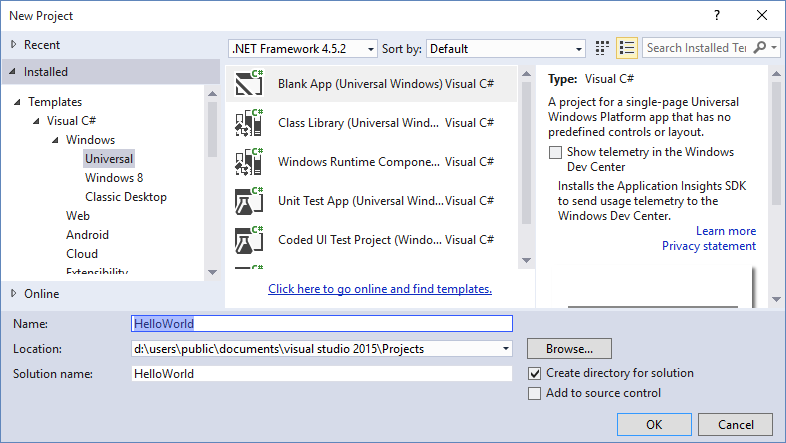

# "Hello, world" 앱 만들기(XAML)

이 자습서에서는 C#과 함께 XAML(Extensible Application Markup Language)을 사용하여 Windows 10의 UWP(유니버설 Windows 플랫폼)를 대상으로 하는 간단한 "Hello, world" 앱을 만드는 방법을 설명합니다. Microsoft Visual Studio의 단일 프로젝트를 사용하여 Windows 10 장치에서 실행되는 앱을 빌드할 수 있습니다. 여기에서는 데스크톱과 모바일 장치 모두에서 원활하게 실행되는 앱을 만드는 데 집중합니다.

**중요** 이 자습서는 Microsoft Visual Studio 2015 및 Windows 10에서 사용하도록 고안되었습니다. 이전 버전에서는 제대로 적용되지 않습니다.

여기에서는 다음에 대한 방법을 알아봅니다.

-   Windows 10 및 UWP를 대상으로 하는 새 Visual Studio 프로젝트를 만듭니다.
-   시작 페이지에 XAML 콘텐츠를 추가합니다.
-   터치, 펜 및 마우스 입력을 처리합니다.
-   로컬 데스크톱 및 Visual Studio의 휴대폰 에뮬레이터에서 프로젝트를 실행합니다.
-   UI를 다양한 화면 크기로 조정합니다.

## 시작하기 전에...


-   간단한 유니버설 앱을 만드는 데 사용하는 절차로 바로 들어갑니다. 따라서 이 자습서를 시작하기 전에 [Windows 10의 새로운 기능](https://dev.windows.com/whats-new-windows-10-dev-preview) 및 [유니버설 Windows 앱이란?](whats-a-uwp.md)의 개요 정보를 읽고 이해하는 것이 좋습니다.
-   이 자습서를 완료하려면 Windows 10 및 Visual Studio 2015가 필요합니다. 자세한 내용은 [설정](get-set-up.md)을 참조하세요.
-   [XAML 개요](https://msdn.microsoft.com/library/windows/apps/Mt185595)에 나오는 XAML의 기초와 개념을 이해하고 있어야 합니다.
-   또한, 여기에서는 Visual Studio의 기본 창 레이아웃을 사용한다고 가정합니다. 기본 레이아웃이 변경된 경우 **창** 메뉴에서 **창 레이아웃 다시 설정** 명령을 사용하여 다시 설정할 수 있습니다.

##  1단계: Visual Studio에서 새 프로젝트 만들기


1.  Visual Studio 2015를 시작합니다.

   Visual Studio 2015 시작 페이지가 표시됩니다. (지금부터는 Visual Studio 2015를 간단히 Visual Studio로 지칭하겠습니다. )

2.  **파일** 메뉴에서 **새로 만들기** > **프로젝트**를 선택합니다.

   **새 프로젝트** 대화 상자가 나타납니다. 대화 상자의 왼쪽 창에서 표시할 템플릿 유형을 선택할 수 있습니다.

3.  왼쪽 창에서 **설치됨 > 템플릿 > Visual C# > Windows**를 차례로 확장한 후 **유니버설** 템플릿 그룹을 선택합니다. 대화 상자의 가운데 창에 UWP(유니버설 Windows 플랫폼) 앱용 프로젝트 템플릿 목록이 표시됩니다.

   

4.  가운데 창에서 **비어 있는 앱(유니버설 Windows)** 템플릿을 선택합니다.

   **비어 있는 앱** 템플릿은 컴파일과 실행은 가능하지만 사용자 인터페이스 컨트롤이나 데이터는 포함되지 않은 최소한의 UWP 앱을 만듭니다. 이 자습서를 진행하면서 이 앱에 컨트롤을 추가하게 됩니다.

5.  **이름** 텍스트 상자에 "HelloWorld"를 입력합니다.
6.  **확인**을 클릭하여 프로젝트를 만듭니다.

   Visual Studio에서 프로젝트를 만들고 **솔루션 탐색기**에 표시합니다.

   

**새 앱**은 최소한의 템플릿이지만 많은 파일이 포함되어 있습니다.

-   이름, 설명, 타일, 시작 페이지 등 앱에 대한 설명과 앱에 포함된 파일의 목록이 수록되어 있는 매니페스트 파일(Package.appxmanifest)
-   시작 메뉴에 표시되는 로고 이미지 집합(Assets/Square150x150Logo.scale-200.png, Assets/Square44x44Logo.scale-200.png, and Assets/Wide310x150Logo.scale-200.png)
-   Windows 스토어에서 해당 앱을 나타낼 이미지(Assets/StoreLogo.png)
-   앱 시작 시 표시되는 시작 화면(Assets/SplashScreen.scale-200.png)
-   앱의 XAML 및 코드 파일(App.xaml 및 App.xaml.cs)
-   앱 시작 시 실행되는 시작 페이지(MainPage.xaml) 및 관련 코드 파일(MainPage.xaml.cs)

이러한 파일은 C#을 사용하는 모든 UWP 앱에 필수적입니다. Visual Studio에서 만든 모든 프로젝트에는 해당 파일이 포함됩니다.

## 2단계: 시작 페이지 수정


### 파일에 포함된 항목

프로젝트의 파일을 보고 편집하려면 **솔루션 탐색기**에서 해당 파일을 두 번 클릭합니다. 기본적으로 폴더와 같이 XAML 파일을 확장하여 관련 코드 파일을 볼 수 있습니다. XAML 파일은 디자인 화면과 XAML 편집기가 모두 표시되는 분할 보기로 열립니다.

이 자습서에서는 이전에 나열한 파일 중 App.xaml, MainPage.xaml 및 MainPage.xaml.cs만 다룹니다.

### App.xaml 및 App.xaml.cs

App.xaml은 앱 전체에서 사용되는 리소스를 선언하는 파일입니다. App.xaml.cs는 App.xaml의 코드 숨김 파일입니다. 코드 숨김은 XAML 페이지의 partial 클래스에 조인되는 코드입니다. XAML은 코드 숨김과 함께 완전한 클래스를 만듭니다. App.xaml.cs는 앱의 진입점입니다. 모든 코드 숨김 페이지와 같이 여기에는 `InitializeComponent` 메서드를 호출하는 생성자가 포함되어 있습니다. `InitializeComponent` 메서드는 작성하지 않습니다. 이 메서드는 Visual Studio에서 생성되며 그 주요 목적은 XAML 파일에 선언된 요소를 초기화하는 것입니다. App.xaml.cs에는 앱의 활성화와 일시 중단을 처리하는 메서드도 포함되어 있습니다.

### MainPage.xaml

MainPage.xaml에서는 앱의 UI를 정의합니다. XAML 마크업을 사용하여 직접 요소를 추가하거나 Visual Studio에서 제공하는 디자인 도구를 사용할 수 있습니다. MainPage.xaml.cs는 MainPage.xaml의 코드 숨김 페이지입니다. 여기에서 앱 논리와 이벤트 처리기를 추가합니다.

이러한 두 파일은 `HelloWorld` 네임스페이스의 [**Page**](https://msdn.microsoft.com/library/windows/apps/BR227503)에서 상속되는 `MainPage`이라는 새 클래스를 함께 정의합니다.

MainPage.xaml

```xml
    <Page
    x:Class="HelloWorld.MainPage"
    xmlns="http://schemas.microsoft.com/winfx/2006/xaml/presentation"
    xmlns:x="http://schemas.microsoft.com/winfx/2006/xaml"
    xmlns:local="using:HelloWorld"
    xmlns:d="http://schemas.microsoft.com/expression/blend/2008"
    xmlns:mc="http://schemas.openxmlformats.org/markup-compatibility/2006"
    mc:Ignorable="d">

    <Grid Background="{ThemeResource ApplicationPageBackgroundThemeBrush}">

    </Grid>
</Page>
```

MainPage.xaml.cs

```csharp
using Windows.UI.Xaml;
using Windows.UI.Xaml.Controls;

namespace HelloWorld
{
    /// <summary>
    /// An empty page that can be used on its own or navigated to within a Frame.
    /// </summary>
    public sealed partial class MainPage : Page
    {
        public MainPage()
        {
            this.InitializeComponent();
        }
    }
}
```

### 시작 페이지 수정

지금부터 약간의 콘텐츠를 앱에 추가해 보겠습니다.

**시작 페이지를 수정하려면**

1.  **솔루션 탐색기**에서 MainPage.xaml을 두 번 클릭하여 엽니다.
2.  XAML 편집기에서 UI에 대한 컨트롤을 추가합니다.

   루트 [**Grid**](https://msdn.microsoft.com/library/windows/apps/BR242704)에서 이 XAML을 추가합니다. 여기에는 제목이 [**TextBlock**](https://msdn.microsoft.com/library/windows/apps/BR209652)인 [**StackPanel**](https://msdn.microsoft.com/library/windows/apps/BR209635), 사용자의 이름을 묻는 **TextBlock**, 사용자의 이름을 수용할 [**TextBox**](https://msdn.microsoft.com/library/windows/apps/BR209683) 요소, [**Button**](https://msdn.microsoft.com/library/windows/apps/BR209265), 인사말을 보여 주는 또 다른 **TextBlock** 등이 포함되어 있습니다. 이러한 컨트롤 중 일부에는 코드에서 나중에 참조할 수 있는 이름이 있습니다.

```xml    
    <StackPanel x:Name="contentPanel" Margin="8,32,0,0">
        <TextBlock Text="Hello, world!" Margin="0,0,0,40"/>
        <TextBlock Text="What' s your name?"/>
        <StackPanel x:Name="inputPanel" Orientation="Horizontal" Margin="0,20,0,20">
            <TextBox x:Name="nameInput" Width="280" HorizontalAlignment="Left"/>
            <Button x:Name="inputButton" Content="Say &amp;quot;Hello&amp;quot;"/>
        </StackPanel>
        <TextBlock x:Name="greetingOutput"/>
    </StackPanel>
```    

    The controls that you added in the XAML editor show up in the design view.

## 3단계: 앱 시작


이제 매우 간단한 앱을 만들었습니다. 앱을 빌드, 배포 및 시작하고 앱의 모양을 확인할 시간입니다. 로컬 컴퓨터, 시뮬레이터, 에뮬레이터 또는 원격 장치에서 앱을 디버그할 수 있습니다. 다음은 Visual Studio의 대상 장치 메뉴입니다.


### 데스크톱 장치에서 앱 시작

기본적으로 앱은 로컬 컴퓨터에서 실행합니다. 대상 장치 메뉴는 데스크톱 장치 제품군의 장치에서 앱을 디버깅하기 위한 여러 옵션을 제공합니다.

-   **시뮬레이터**
-   **로컬 컴퓨터**
-   **원격 컴퓨터**

**로컬 컴퓨터에서 디버깅을 시작하려면**

1.  **표준** 도구 모음의 대상 디바이스 메뉴()에서 **로컬 컴퓨터**가 선택되었는지 확인합니다. 기본적으로 선택되어 있습니다.
2.  도구 모음에서 **디버깅 시작** 단추()를 클릭합니다.

   –또는–

   **디버그** 메뉴에서 **디버깅 시작**을 클릭합니다.

   –또는–

   F5 키를 누릅니다.

창에서 앱이 열리고 먼저 기본 시작 화면이 나타납니다. 시작 화면은 이미지(SplashScreen.png)와 배경색(앱의 매니페스트 파일에서 지정함)으로 정의됩니다.

시작 화면이 사라진 다음 앱이 나타납니다. 모양은 다음과 같습니다.


Windows 키를 눌러 **시작** 메뉴를 연 후 모든 앱을 표시합니다. 로컬에서 앱을 배포하면 **시작** 메뉴에 해당 타일이 추가됩니다. 앱을 다시 실행하려면(디버깅 모드 아님) **시작** 메뉴에서 해당 타일을 탭하거나 클릭합니다.

아직 기능은 많지 않지만, 첫 UWP 앱을 빌드한 것을 축하드립니다.

**디버깅을 중지하려면**

-   도구 모음에서 **디버깅 중지** 단추()를 클릭합니다.

   –또는–

   **디버그** 메뉴에서 **디버깅 중지**를 클릭합니다.

   –또는–

   앱 창을 닫습니다.

### 모바일 장치 에뮬레이터에서 앱 시작

앱이 Windows 10 장치에서 실행되므로 Windows Phone에서 어떻게 표시되는지 살펴보겠습니다.

Visual Studio는 데스크톱 장치에서 디버깅하는 옵션 외에도 컴퓨터에 연결된 실제 모바일 장치 또는 모바일 장치 에뮬레이터에서 앱을 배포 및 디버깅하는 옵션도 제공합니다. 메모리 및 디스플레이 구성이 서로 다른 장치에 대한 에뮬레이터 중에서 선택할 수 있습니다.

-   **장치**
-   **에뮬레이터 <SDK version> WVGA 4인치 512MB**
-   **에뮬레이터 <SDK version> WVGA 4인치 1GB**
-   등(기타 구성의 다양한 에뮬레이터)

화면이 작고 메모리가 제한된 장치에서 앱을 테스트하는 것이 좋으므로 **에뮬레이터 10.0.10240.0 WVGA 4인치 512MB** 옵션을 사용합니다.
**모바일 장치 에뮬레이터에서 디버깅을 시작하려면**

1.  **표준** 도구 모음의 대상 디바이스 메뉴()에서 **에뮬레이터 10.0.10240.0 WVGA 4인치 512MB**를 선택합니다.
2.  도구 모음에서 **디버깅 시작** 단추()를 클릭합니다.

   –또는–

   **디버그** 메뉴에서 **디버깅 시작**을 클릭합니다.

   –또는–

   F5 키를 누릅니다.

Visual Studio에서 선택한 에뮬레이터를 시작한 다음 앱을 배포하고 시작합니다. 모바일 장치 에뮬레이터에서 앱은 다음과 같이 표시됩니다.


가장 먼저 살펴볼 사항은 모바일 장치의 작은 화면에서 단추를 누르는 작업입니다. 이 자습서 뒷부분에서는 앱이 항상 멋지게 표시되도록 다양한 화면 크기에 맞게 UI를 적용하는 방법을 알아봅니다.

[
            **TextBox**](https://msdn.microsoft.com/library/windows/apps/BR209683)에 입력할 수는 있지만 지금은 [**Button**](https://msdn.microsoft.com/library/windows/apps/BR209265)을 클릭하거나 탭해도 아무것도 수행되지 않습니다. 다음 단계에서는 단추의 [**Click**](https://msdn.microsoft.com/library/windows/apps/BR227737) 이벤트에 대한 이벤트 처리기를 만들어 개인 설정 인사말을 표시합니다. 이벤트 처리기 코드를 MainPage.xaml.cs 파일에 추가하게 됩니다.

## 4단계: 이벤트 처리기 만들기


XAML 요소는 특정 이벤트가 발생할 때 메시지를 보낼 수 있습니다. 이러한 이벤트 메시지는 이벤트에 응답하여 어떤 작업을 수행할 수 있는 기회를 제공합니다. 이벤트 처리기 메서드에서 이벤트에 응답할 코드를 넣습니다. 많은 앱에서 가장 일반적인 이벤트 중 하나는 사용자가 [**Button**](https://msdn.microsoft.com/library/windows/apps/BR209265)을 클릭하는 것입니다.

단추의 [**Click**](https://msdn.microsoft.com/library/windows/apps/BR227737) 이벤트에 대한 이벤트 처리기를 만들어 보겠습니다. 이 이벤트 처리기는 `nameInput`[**TextBox**](https://msdn.microsoft.com/library/windows/apps/BR209683) 컨트롤에서 사용자의 이름을 가져와 `greetingOutput`[**TextBlock**](https://msdn.microsoft.com/library/windows/apps/BR209652)에 인사말을 출력하는 데 사용합니다.

### 터치, 마우스 및 펜 입력에 대해 작동하는 이벤트 사용

어떤 이벤트를 처리해야 하나요? 다양한 장치에서 실행될 수 있으므로 터치식 입력을 염두에 두고 Windows 스토어 앱을 디자인해야 합니다. 또한 앱은 마우스 또는 스타일러스의 입력도 처리할 수 있어야 합니다. 다행히 [**Click**](https://msdn.microsoft.com/library/windows/apps/BR227737) 및 [**DoubleTapped**](https://msdn.microsoft.com/library/windows/apps/BR208922)와 같은 이벤트는 장치 독립적입니다. Microsoft .NET 프로그래밍에 익숙한 경우 **MouseMove**, **TouchMove** 및 **StylusMove**와 같은 마우스, 터치 및 스타일러스 입력에 대한 별도의 이벤트를 보았을 것입니다. Windows 스토어 앱에서는 이러한 개별 이벤트가 터치, 마우스 및 스타일러스 입력에 대해 동일하게 작동하는 하나의 [**PointerMoved**](https://msdn.microsoft.com/library/windows/apps/BR208970) 이벤트로 대체됩니다.

**이벤트 처리기를 추가하려면**

1.  XAML 또는 디자인 뷰에서 MainPage.xaml에 추가한 "Say Hello" [**Button**](https://msdn.microsoft.com/library/windows/apps/BR209265)을 선택합니다.
2.  **속성 창**에서 이벤트 단추()를 클릭합니다.
3.  이벤트 목록 맨 위에서 [**Click**](https://msdn.microsoft.com/library/windows/apps/BR227737) 이벤트를 찾습니다. 해당 이벤트의 텍스트 상자에 **Click** 이벤트를 처리하는 함수의 이름을 입력합니다. 이 예제에서는 "Button\_Click"을 입력합니다.

   

4.  Enter 키를 누릅니다. 이벤트 처리기 메서드가 만들어지고 이벤트 발생 시 실행될 코드를 추가할 수 있도록 코드 편집기에서 열립니다.

    XAML 편집기에서 [**Button**](https://msdn.microsoft.com/library/windows/apps/BR209265)에 대한 XAML은 다음과 같이 [**Click**](https://msdn.microsoft.com/library/windows/apps/BR227737) 이벤트 처리기를 선언하도록 업데이트됩니다.

```xml   
   <Button x:Name="inputButton" Content="Say &amp;quot;Hello&amp;quot;" Click="Button_Click"/>
```    

5.  코드 숨김 페이지에서 만든 이벤트 처리기에 코드를 추가합니다. 이 이벤트 처리기에서 `nameInput`[**TextBox**](https://msdn.microsoft.com/library/windows/apps/BR209683) 컨트롤에서 사용자의 이름을 읽어 온 다음 이를 사용해 인사말을 만듭니다. `greetingOutput`
            [
            **TextBlock**](https://msdn.microsoft.com/library/windows/apps/BR209652)을 사용하여 결과를 표시합니다.
    
```csharp    
    private void Button_Click(object sender, RoutedEventArgs e)
    {
        greetingOutput.Text = "Hello, " + nameInput.Text + "!";
    }
```    

6.  로컬 컴퓨터에서 앱을 디버그합니다. 텍스트 상자에 자신의 이름을 입력하고 단추를 클릭하면 앱에서 개인 설정 인사말을 표시합니다.

## 5단계: UI를 다양한 창 크기로 조정


이제 모바일 장치에서 멋지게 표시되도록 다양한 화면 크기에 맞게 UI를 적용할 수 있습니다. 이 작업을 수행하려면 [**VisualStateManager**](https://msdn.microsoft.com/library/windows/apps/BR209021)을(를) 추가하고 다양한 시각적 상태에 적용되는 속성을 설정합니다.

**UI 레이아웃을 조정하려면**

1.  XAML 편집기에서 이 XAML 블록을 루트 [**Grid**](https://msdn.microsoft.com/library/windows/apps/BR242704) 요소의 여는 태그 뒤에 추가합니다.

```xml    
    <VisualStateManager.VisualStateGroups>
        <VisualStateGroup>
            <VisualState x:Name="wideState">
                <VisualState.StateTriggers>
                    <AdaptiveTrigger MinWindowWidth="641" />
                </VisualState.StateTriggers>
            </VisualState>
            <VisualState x:Name="narrowState">
                <VisualState.StateTriggers>
                    <AdaptiveTrigger MinWindowWidth="0" />
                </VisualState.StateTriggers>
                <VisualState.Setters>
                    <Setter Target="inputPanel.Orientation" Value="Vertical"/>
                    <Setter Target="inputButton.Margin" Value="0,4,0,0"/>
                </VisualState.Setters>
            </VisualState>
        </VisualStateGroup>
    </VisualStateManager.VisualStateGroups>
```    

2.  로컬 컴퓨터에서 앱을 디버그합니다. 창이 641픽셀보다 좁은 경우가 아니라면 UI가 이전과 동일한 모양으로 표시됩니다.
3.  모바일 장치 에뮬레이터에서 앱을 디버그합니다. UI가 `narrowState`에 정의된 속성을 사용하며, 작은 화면에 올바르게 나타납니다.


이전 버전의 XAML에서 [**VisualStateManager**](https://msdn.microsoft.com/library/windows/apps/BR209021)을(를) 사용한 적이 있으면 여기의 XAML에서 단순화된 구문을 사용할 수 있습니다.

`wideState`라는 [**VisualState**](https://msdn.microsoft.com/library/windows/apps/BR209007)에는 해당 [**MinWindowWidth**](https://msdn.microsoft.com/en-us/library/windows/apps/windows.ui.xaml.adaptivetrigger.minwindowwidth) 속성이 641로 설정된 [**AdaptiveTrigger**](https://msdn.microsoft.com/library/windows/apps/Dn890382)가 있습니다. 즉, 창 너비가 최소값인 641픽셀보다 작지 않은 경우에만 상태가 적용됩니다. 이 상태에 대해 어떤 [**Setter**](https://msdn.microsoft.com/library/windows/apps/BR208817) 개체도 정의하지 않았으므로 페이지 내용에 대한 XAML에 정의된 레이아웃 속성을 사용합니다.

두 번째 [**VisualState**](https://msdn.microsoft.com/library/windows/apps/BR209007), `narrowState`에는 해당 [**MinWindowWidth**](https://msdn.microsoft.com/en-us/library/windows/apps/windows.ui.xaml.adaptivetrigger.minwindowwidth) 속성이 0으로 설정된 [**AdaptiveTrigger**](https://msdn.microsoft.com/library/windows/apps/Dn890382)가 있습니다. 창 너비가 0보다 크지만 641픽셀보다는 작은 경우에 이 상태가 적용됩니다. (641픽셀에서 `wideState`이 적용됩니다.) 이 상태에서는 UI에 있는 컨트롤의 레이아웃 속성을 변경하도록 일부 [**Setter**](https://msdn.microsoft.com/library/windows/apps/BR208817) 개체를 다음과 같이 정의합니다.

-   `inputPanel` 요소의 [**Orientation**](https://msdn.microsoft.com/library/windows/apps/windows.ui.xaml.controls.stackpanel.orientation)을 **Horizontal**에서 **Vertical**로 변경합니다.
-   4의 상단 여백을 `inputButton` 요소에 추가합니다.

## 요약


축하합니다. Windows 10 및 UWP용 첫 번째 앱을 만들었습니다.


<!--HONumber=Mar16_HO1-->


