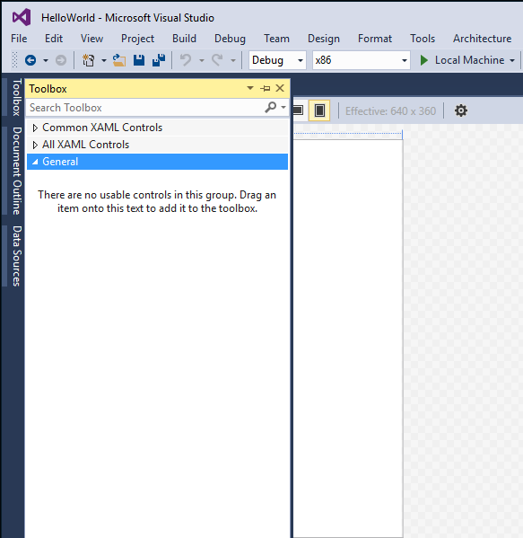
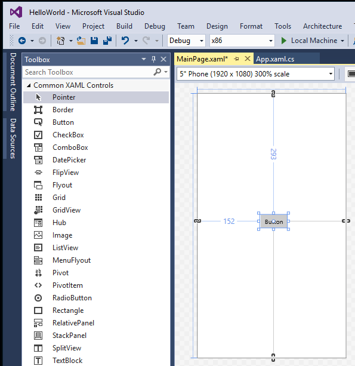
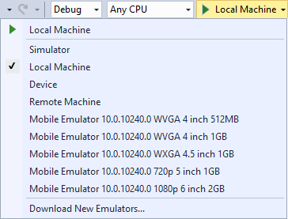

# <a name="create-a-hello-world-app-xaml"></a>Hello, world 앱 만들기(XAML)

이 자습서에서는 간단한을 만들려면 XAML과 C#을 사용 하는 방법을 "Hello, world" 앱 Windows10에서 유니버설 Windows 플랫폼 (UWP) 용입니다. Microsoft Visual Studio의 단일 프로젝트를 사용 하 여 모든 Windows10 장치에서 실행 되는 앱을 빌드할 수 있습니다.

여기에 배울 내용은 다음과 같습니다.

-   **Windows10** 및 **UWP**를 대상으로 하는 새 **Visual Studio 2017** 프로젝트를 만듭니다.
-   시작 페이지에서 UI를 변경하는 XAML을 작성합니다.
-   Visual Studio의 로컬 데스크톱에서 프로젝트를 실행합니다.
-   SpeechSynthesizer를 사용하여 단추를 누르면 앱이 말하게 합니다.


## <a name="before-you-start"></a>시작하기 전에...

-   [유니버설 Windows 앱이란?](universal-application-platform-guide.md)
-   [Visual Studio 2017(및 Windows 10) 다운로드](https://developer.microsoft.com/windows/downloads). 도움이 필요하면 [설정](get-set-up.md) 방법을 알아보세요.
-   또한, 여기에서는 Visual Studio의 기본 창 레이아웃을 사용한다고 가정합니다. 기본 레이아웃을 변경하는 경우 **창** 메뉴에서 **창 레이아웃 다시 설정** 명령을 사용하여 다시 설정할 수 있습니다.

> [!NOTE]
> 이 자습서에서는 Visual Studio Community 2017을 사용합니다. 다른 버전의 Visual Studio를 사용하는 경우 약간 다르게 보일 수 있습니다.

## <a name="video-summary"></a>비디오 요약

<iframe src="https://channel9.msdn.com/Blogs/One-Dev-Minute/Writing-Your-First-Windows-10-App/player" width="640" height="360" allowFullScreen frameBorder="0"></iframe>


## <a name="step-1-create-a-new-project-in-visual-studio"></a>1단계: Visual Studio에서 새 프로젝트 만들기

1.  Visual Studio 2017을 시작합니다.

2.  **파일** 메뉴에서 선택 **새로 만들기 > 프로젝트** *새 프로젝트* 대화 상자를 엽니다.

3.  왼쪽에 있는 템플릿 목록에서 선택 **설치 됨 > Visual C# > Windows 유니버설** UWP 프로젝트 템플릿 목록을 볼 수 있습니다.

    (유니버설 템플릿이 보이지 않으면 UWP 앱을 만들기 위한 구성 요소가 누락된 것일 수 있습니다. 설치 과정을 다시 실행하고 **새 프로젝트** 대화 상자에서 *Visual Studio 설치 관리자 열기*를 클릭하여 UWP 지원을 추가할 수 있습니다. 참조 [설정](get-set-up.md)합니다.)

    

4.  **빈 앱(유니버설 Windows)** 템플릿을 선택하고 "HelloWorld"를 **이름**으로 입력합니다. **확인**을 선택합니다.

    

> [!NOTE]
> Visual Studio를 처음 사용하는 경우 **개발자 모드**를 사용하도록 설정하라는 설정 대화 상자가 표시될 수 있습니다. 개발자 모드는 앱을 스토어에서만 실행하는 것이 아니라 직접 실행할 수 있는 권한처럼 특정 기능을 활성화하는 특수 설정입니다. 자세한 내용은 [디바이스를 개발에 사용하도록 설정](enable-your-device-for-development.md)을 읽어보세요. 이 가이드를 계속 하려면 **개발자 모드**를 선택하고 **예**를 클릭하여 대화 상자를 닫습니다.

 

5.  대상 버전/최소 버전 대화 상자가 나타납니다. 이 자습서에는 기본 설정이면 충분하므로 **확인**을 선택하여 프로젝트를 만듭니다.

    

6.  새 프로젝트가 열리면 해당 파일이 오른쪽의 **솔루션 탐색기** 창에 표시됩니다. 파일을 보려면 **속성** 탭 대신 **솔루션 탐색기** 탭을 선택해야 할 수 있습니다.

    

**새 앱**(유니버설 Window)은 최소한의 템플릿이지만 많은 파일이 포함되어 있습니다. 이러한 파일은 C#을 사용하는 모든 UWP 앱에 필수적입니다. Visual Studio에서 만든 모든 프로젝트에는 해당 파일이 포함됩니다.


### <a name="whats-in-the-files"></a>파일에 포함된 항목

프로젝트의 파일을 보고 편집하려면 **솔루션 탐색기**에서 해당 파일을 두 번 클릭합니다. 폴더와 같이 XAML 파일을 확장하여 관련 코드 파일을 봅니다. XAML 파일은 디자인 화면과 XAML 편집기가 모두 표시되는 분할 보기로 열립니다.
> [!NOTE]
> XAML이란? XAML(Extensible Application Markup Language)은 앱의 사용자 인터페이스를 정의하는 데 사용되는 언어입니다. 수동으로 입력하거나 Visual Studio 디자인 도구를 사용하여 만들 수 있습니다. .xaml 파일에는 논리가 포함된 .xaml.cs 코드 숨김 파일이 있습니다. XAML은 코드 숨김과 함께 완전한 클래스를 만듭니다. 자세한 내용은 [XAML 개요](https://msdn.microsoft.com/library/windows/apps/Mt185595)를 참조하세요.

*App.xaml 및 App.xaml.cs*

-   App.xaml은 앱 전체에서 사용되는 리소스를 선언하는 파일입니다.
-   App.xaml.cs는 App.xaml의 코드 숨김 파일입니다. 모든 코드 숨김 페이지와 같이 여기에는 `InitializeComponent` 메서드를 호출하는 생성자가 포함되어 있습니다. `InitializeComponent` 메서드는 작성하지 않습니다. 이 메서드는 Visual Studio에서 생성되며 그 주요 목적은 XAML 파일에 선언된 요소를 초기화하는 것입니다.
-   App.xaml.cs는 앱의 진입점입니다.
-   App.xaml.cs는 [활성화](../launch-resume/activate-an-app.md) 와 앱의 [일시 중단](../launch-resume/suspend-an-app.md) 처리 하는 방법을도 포함 되어 있습니다.

*MainPage.xaml*

-   MainPage.xaml에서는 앱의 UI를 정의합니다. XAML 마크업을 사용하여 직접 요소를 추가하거나 Visual Studio에서 제공하는 디자인 도구를 사용할 수 있습니다.
-   MainPage.xaml.cs는 MainPage.xaml의 코드 숨김 페이지입니다. 여기에서 앱 논리와 이벤트 처리기를 추가합니다.
-   이러한 두 파일은 `HelloWorld` 네임스페이스의 [**Page**](https://msdn.microsoft.com/library/windows/apps/BR227503)에서 상속되는 `MainPage`이라는 새 클래스를 함께 정의합니다.

*Package.appxmanifest*
-   이름, 설명, 타일, 시작 페이지 등 앱을 설명하는 매니페스트 파일입니다.
-   종속성, 리소스 및 앱에 포함 된 파일의 목록이 포함 되어 있습니다.

*로고 이미지 집합*
-   Assets/Square150x150Logo.scale-200.png와 Wide310x150Logo.scale 200.png 시작 메뉴에서 앱을 (보통 또는 전체 크기)를 나타냅니다.
-   Assets/Square44x44Logo.png 작업 관리자, 작업 표시줄 및 시작 메뉴의 앱 목록에 앱을 나타냅니다.
-   Assets/StoreLogo.png는 Microsoft Store에 앱을 나타냅니다.
-   Assets/SplashScreen.scale-200.png는 앱 시작 시 표시되는 시작 화면입니다.
-   Assets/LockScreenLogo.scale-200.png은 시스템이 잠겨 있을 때 잠금 화면에서 앱을 나타내는 데 사용할 수 있습니다.

## <a name="step-2-adding-a-button"></a>2단계: 단추 추가

### <a name="using-the-designer-view"></a>디자이너 보기 사용

페이지에 단추를 추가해 보겠습니다. 이 자습서에서는 이전에 나열한 파일 중 App.xaml, MainPage.xaml 및 MainPage.xaml.cs만 다룹니다.

1.  **MainPage.xaml**을 두 번 클릭하여 디자인 뷰에서 엽니다.

    화면 맨 윗부분에 그래픽 보기가 있고 아래에 XAML 코드 보기가 있습니다. 둘 중 하나를 변경할 수 있지만 현재는 그래픽 보기를 사용하겠습니다.

    

2.  왼쪽의 세로 **도구 상자** 탭을 클릭하여 UI 컨트롤 목록을 엽니다. (제목 표시줄의 고정 아이콘을 클릭하면 표시된 상태가 유지됩니다.)

    

3.  **공용 XAML 컨트롤**을 확장하고 **단추**를 디자인 캔버스의 중앙으로 끌어옵니다.

    

    XAML 코드 창을 보면 여기에도 단추가 추가된 것을 볼 수 있습니다.

 ```XAML
<Button x:name="button" Content="Button" HorizontalAlignment="Left" Margin = "152,293,0,0" VerticalAlignment="Top"/>
 ```

4.  단추의 텍스트를 변경합니다.

    XAML 코드 보기에서 클릭하고 콘텐츠를 "Button"에서 "Hello, world!"로 변경합니다.

```XAML
<Button x:name="button" Content="Hello, world!" HorizontalAlignment="Left" Margin = "152,293,0,0" VerticalAlignment="Top"/>
```

디자인 캔버스에 표시된 단추가 새 텍스트를 표시하기 위해 어떻게 업데이트되는지 확인합니다.


## <a name="step-3-start-the-app"></a>3단계: 앱 시작


이제 매우 간단한 앱을 만들었습니다. 앱을 빌드, 배포 및 시작하고 앱의 모양을 확인할 시간입니다. 로컬 컴퓨터, 시뮬레이터, 에뮬레이터 또는 원격 장치에서 앱을 디버그할 수 있습니다. 다음은 Visual Studio의 대상 장치 메뉴입니다.



### <a name="start-the-app-on-a-desktop-device"></a>데스크톱 장치에서 앱 시작

기본적으로 앱은 로컬 컴퓨터에서 실행합니다. 대상 장치 메뉴는 데스크톱 장치 제품군의 장치에서 앱을 디버깅하기 위한 여러 옵션을 제공합니다.

-   **시뮬레이터**
-   **로컬 컴퓨터**
-   **원격 컴퓨터**

**로컬 컴퓨터에서 디버깅을 시작하려면**

1.  **표준** 도구 모음의 대상 디바이스 메뉴()에서 **로컬 컴퓨터**가 선택되었는지 확인합니다. 기본적으로 선택되어 있습니다.
2.  도구 모음에서 **디버깅 시작** 단추()를 클릭합니다.

   –또는–

   **디버그** 메뉴에서 **디버깅 시작**을 클릭합니다.

   –또는–

   F5 키를 누릅니다.

창에서 앱이 열리고 먼저 기본 시작 화면이 나타납니다. 시작 화면은 이미지(SplashScreen.png)와 배경색(앱의 매니페스트 파일에서 지정함)으로 정의됩니다.

시작 화면이 사라진 다음 앱이 나타납니다. 모양은 다음과 같습니다.


Windows 키를 눌러 **시작** 메뉴를 연 후 모든 앱을 표시합니다. 로컬에서 앱을 배포하면 **시작** 메뉴에 해당 타일이 추가됩니다. 앱을 나중에 다시 실행하려면(디버깅 모드 아님) **시작** 메뉴에서 해당 타일을 탭하거나 클릭합니다.

아직 기능은 많지 않지만, 첫 UWP 앱을 빌드한 것을 축하드립니다.

**디버깅을 중지하려면**

   도구 모음에서 **디버깅 중지** 단추()를 클릭합니다.

   –또는–

   **디버그** 메뉴에서 **디버깅 중지**를 클릭합니다.

   –또는–

   앱 창을 닫습니다.

## <a name="step-4-event-handlers"></a>4단계: 이벤트 처리기

"이벤트 처리기"는 복잡하게 들릴 수 있지만 이벤트가 발생할 때(예: 사용자가 단추 클릭) 호출되는 코드에 대한 다른 이름일 뿐입니다.

1.  앱이 아직 실행 중인 경우 중지합니다.

2.  디자인 캔버스의 단추 컨트롤을 두 번 클릭하여 Visual Studio가 단추에 대한 이벤트 처리기를 만들도록 합니다.

  물론 모든 코드를 수동으로 만들 수도 있습니다. 또는 단추를 클릭하여 선택하고 오른쪽 아래의 **속성** 창을 확인할 수 있습니다. **이벤트**(작은 번개 모양)로 전환하면 이벤트 처리기의 이름을 추가할 수 있습니다.

3.  *MainPage.xaml.cs*, 코드 숨김 페이지에서 이벤트 처리기 코드를 편집합니다. 이 부분에서 점점 흥미로워집니다. 기본 이벤트 처리기는 다음과 같이 표시됩니다.

```cs
private void Button_Click(object sender, RoutedEventArgs e)
{

}
```

  다음과 같이 바꿔 보세요.

```cs
private async void Button_Click(object sender, RoutedEventArgs e)
{
    MediaElement mediaElement = new MediaElement();
    var synth = new Windows.Media.SpeechSynthesis.SpeechSynthesizer();
    Windows.Media.SpeechSynthesis.SpeechSynthesisStream stream = await synth.SynthesizeTextToStreamAsync("Hello, World!");
    mediaElement.SetSource(stream, stream.ContentType);
    mediaElement.Play();
}
```

메서드 서명을 이제 **비동기** 키워드를 포함 하거나 앱을 실행 하려고 할 때 오류가 발생 받게 있는지 확인 합니다.

### <a name="what-did-we-just-do"></a>방금 어떤 작업을 수행했나요?

이 코드는 일부 Windows API를 사용하여 음성 합성 개체를 만든 다음 여기에 말할 텍스트를 제공합니다. SpeechSynthesis 사용에 대한 자세한 내용은 [SpeechSynthesis 네임스페이스](https://msdn.microsoft.com/library/windows/apps/windows.media.speechsynthesis.aspx) 문서를 참조하세요.

앱을 실행하고 단추를 클릭하면 컴퓨터(또는 휴대폰)가 문자 그대로 "Hello, World!"라고 말합니다.


## <a name="summary"></a>요약

축 하 합니다, Windows10 및 UWP 용 첫 번째 앱을 만들었습니다!

XAML을 통해 앱에서 사용할 컨트롤을 배치하는 방법을 알아보려면 [표 자습서](../design/layout/grid-tutorial.md)를 살펴보거나 [다음 단계](learn-more.md)로 바로 이동하세요.

## <a name="see-also"></a>참고 항목

* [첫 번째 앱](your-first-app.md)
* [UWP 앱 게시](https://developer.microsoft.com/store/publish-apps)
* [UWP 앱 개발에 대한 방법 문서](https://developer.microsoft.com/windows/apps/develop)
* [UWP 개발자를 위한 코드 샘플](https://developer.microsoft.com/windows/samples)
* [유니버설 Windows 앱이란?](universal-application-platform-guide.md)
* [Windows 계정 등록](sign-up.md)
