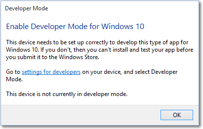

# 디바이스를 개발에 사용하도록 설정

## 앱 개발자 모드를 활성화하고, 앱을 테스트용으로 로드하고, 기타 개발자 기능에 액세스

게임, 웹 검색, 전자 메일, Office 앱 등의 일반적인 일상 활동에 컴퓨터를 사용하는 경우 개발자 모드를 활성화할 필요가 *없으며* 사실 활성화해서는 안 됩니다. 이 페이지의 나머지 정보를 볼 필요가 없으며, 이전에 하던 작업으로 안전하게 돌아가시면 됩니다. 들러 주셔서 감사합니다!

그러나 컴퓨터에서 Visual Studio를 사용하여 처음으로 소프트웨어를 개발하는 경우 개발용 PC 그리고 코드 테스트에 사용할 모든 장치에서 개발자 모드를 사용하도록 *설정해야* 합니다. 개발자 모드가 활성화되지 않은 상태에서 UWP 프로젝트를 열면 **개발자용** 설정 페이지가 열리거나 Visual Studio에 이 대화 상자가 표시됩니다.

이 대화 상자가 표시되면 **개발자용 설정**을 클릭하여 **개발자용** 설정 페이지를 엽니다.

> [!NOTE]
> 언제든지 **개발자용** 페이지로 이동하여 개발자 모드 사용 여부를 설정할 수 있습니다. 작업 표시줄의 Cortana 검색 상자에 "개발자용"을 입력하기만 하면 됩니다.

## 개발자용 설정에 액세스

개발자 모드를 활성화하거나 다른 설정에 액세스하려면:

1.  **개발자용** 설정 대화 상자에서 필요한 액세스 수준을 선택합니다.
2.  선택한 설정에 대한 고지 사항을 읽은 다음 **예**를 클릭하여 변경 내용을 적용합니다.

> [!NOTE]
> 개발자 모드를 사용하도록 설정하려면 관리자 권한이 필요합니다. 디바이스가 조직의 소유인 경우 이 옵션을 사용하지 못하게 설정해 놓았을 수도 있습니다.

다음은 데스크톱 장치 패밀리의 설정 페이지입니다.

다음은 모바일 장치 패밀리의 설정 페이지입니다.

## 테스트용으로 앱 로드 또는 개발자 모드 중에서 어떤 것을 선택해야 하나요?

 디바이스를 개발에 사용할 수도 있고 단순히 테스트 용도로만 사용할 수도 있습니다.

-   *Microsoft Store 앱* 은 기본 설정입니다. 사용하는 앱이 개발용 앱이 아니거나 회사에서 지급한 특수한 내부 앱을 사용하는 경우 이 설정을 계속 활성 상태로 유지하세요.
-   *테스트용 로드*는 Microsoft Store에서 인증되지 않은 앱을 설치한 후 실행 또는 테스트하는 것입니다. 예를 들어 회사에서만 사용하는 내부용 앱입니다.
-   *개발자 모드*를 사용하면 앱을 테스트용으로 로드할 수 있을 뿐만 아니라 Visual Studio에서 디버그 모드로 앱을 실행할 수 있습니다. 

기본적으로 Microsoft Store의 UWP(유니버설 Windows 플랫폼) 앱만 설치할 수 있습니다. 개발자 기능을 사용하도록 이러한 설정을 변경하면 장치의 보안 수준을 변경할 수 있습니다. 확인되지 않은 원본에서 앱을 설치하지 않아야 합니다.

### 앱 테스트용 로드

테스트용 로드 앱 설정은 일반적으로 Microsoft Store를 거치지 않고 관리되는 디바이스에 사용자 지정 앱을 설치해야 하는 회사 또는 학교에서 사용합니다. 이 경우 이전에 설정 페이지 이미지에 표시된 대로 조직에서 *UWP 앱* 설정을 사용하지 않는 정책을 적용하는 경우가 일반적입니다. 또한 조직에서는 필요한 인증서 및 테스트용 로드 앱의 설치 위치를 제공합니다. 자세한 내용은 TechNet 문서 [Windows 10에서 앱을 테스트용으로 로드](https://technet.microsoft.com/library/mt269549.aspx) 및 [Microsoft Intune에서 앱 배포 시작](https://technet.microsoft.com/library/dn646955.aspx)을 참조하세요.

디바이스 패밀리 관련 정보

-   데스크톱 디바이스 패밀리에서: 앱 패키지(.appx) 및 패키지("Add-AppDevPackage.ps1")로 만든 Windows PowerShell 스크립트를 실행하여 앱을 실행하는 데 필요한 모든 인증서를 설치할 수 있습니다. 자세한 내용은 [UWP 앱 패키징](../packaging/packaging-uwp-apps.md)을 참조하세요.

-   모바일 디바이스 패밀리에서: 필요한 인증서가 이미 설치되어 있는 경우 파일을 탭하여 메일로 전송되거나 SD 카드에 있는 .appx를 설치할 수 있습니다.

**앱 테스트용 로드**를 사용하면 신뢰할 수 있는 인증서가 없는 디바이스에 앱을 설치할 수 없으므로 개발자 모드보다 안전합니다.

> [!NOTE]
> 앱을 테스트용으로 로드하는 경우에도 여전히 신뢰할 수 있는 소스의 앱만을 설치해야 합니다. Microsoft Store에서 인증되지 않은 테스트용 로드 앱을 설치할 경우 이러한 앱을 테스트용으로 로드하는 데 필요한 모든 권한을 확보했으며 이러한 앱을 설치하고 실행하여 발생할 수 있는 피해에 대해 전적으로 책임을 진다는 점에 동의하는 것입니다. 이 [개인 정보 취급 방침](http://go.microsoft.com/fwlink/?LinkId=521839)의 &gt; Microsoft Store 섹션을 참조하세요.

### 개발자 모드

개발자 모드는 개발자 라이선스에 대한 Windows 8.1 요구 사항을 대체합니다.  테스트용 로드 외에도 개발자 모드 설정을 사용하면 디버깅 및 추가 배포 옵션을 사용하도록 설정할 수 있습니다. 여기에는 이 디바이스에 배포할 수 있도록 허용하는 SSH 서비스 시작이 포함됩니다. 이 서비스를 중지하려면 개발자 모드를 사용하지 않도록 설정해야 합니다.

데스크톱에서 개발자 모드를 사용하는 경우 다음이 포함된 기능 패키지가 설치됩니다.
- Microsoft 장치 포털. **장치 포털 사용** 옵션이 켜진 경우에만 장치 포털을 사용할 수 있고 방화벽 규칙이 구성됩니다.
- 앱의 원격 설치를 허용하는 SSH 서비스에 대한 방화벽 규칙을 설치 및 구성합니다. **디바이스 검색**을 사용한다고 설정하면 SSH 서버가 켜집니다.

## 추가 개발자 모드 기능

각 장치 패밀리에 추가적인 개발자 기능이 제공될 수 있습니다. 이러한 기능은 디바이스에서 개발자 모드를 사용하는 경우에만 제공되며 OS 버전에 따라 달라질 수 있습니다.

이 이미지는 Windows 10에 대한 개발자 기능을 표시합니다.

 

### 장치 포털

디바이스 포털에 대한 자세한 내용은 [Windows Device Portal 개요](../debug-test-perf/device-portal.md)를 참조하세요.

디바이스별 설치 지침은 다음을 참조하세요.
- [데스크톱 디바이스 포털](https://msdn.microsoft.com/windows/uwp/debug-test-perf/device-portal-desktop)
- [HoloLens용 디바이스 포털](https://developer.microsoft.com/windows/holographic/using_the_windows_device_portal)
- [IoT용 디바이스 포털](https://developer.microsoft.com/windows/iot/docs/DevicePortal)
- [모바일용 디바이스 포털](../debug-test-perf/device-portal-mobile.md)
- [Xbox용 디바이스 포털](../debug-test-perf/device-portal-xbox.md)

개발자 모드 또는 디바이스 포털을 사용하도록 설정하는 데 문제가 있는 경우 [알려진 문제](https://social.msdn.microsoft.com/Forums/en-US/home?forum=Win10SDKToolsIssues&sort=relevancedesc&brandIgnore=True&searchTerm=%22device+portal%22) 포럼에서 이 문제에 대한 해결 방법을 찾아보거나 [개발자 모드 패키지 설치 실패](#failure-to-install-developer-mode-package)를 방문하여 추가 세부 정보를 살펴보고 개발자 모드 패키지의 차단을 해제하려면 어떤 WSUS KB를 허용해야 하는지 확인하세요. 

### SSH

디바이스에서 디바이스 검색을 사용할 경우에 SSH 서비스를 사용할 수 있습니다.  이 서비스는 디바이스가 UWP 응용 프로그램용 원격 배포 대상인 경우에 사용됩니다.   서비스의 이름은 'SSH Server Broker' 및 'SSH Server Proxy'입니다.

> [!NOTE]
> SSH는 [GitHub](https://github.com/PowerShell/Win32-OpenSSH)에서 찾을 수 있는 Microsoft의 OpenSSH 구현이 아닙니다.  

SSH 서비스를 활용하기 위해 디바이스 검색을 사용하여 핀 페어링을 허용할 수 있습니다. 다른 SSH 서비스를 실행하려는 경우 다른 포트에서 설정하거나 개발자 모드 SSH 서비스를 끌 수 있습니다. SSH 서비스를 끄려면 디바이스 검색을 해제합니다.  

인증을 위한 암호를 수락하는 "DevToolsUser" 계정을 통해 SSH 로그인이 수행됩니다.  이 암호는 디바이스 검색 "페어링" 단추를 누른 후에 디바이스에 표시되는 PIN으로, PIN이 표시되는 동안에만 유효합니다.  SFTP 하위 시스템은 Visual Studio로부터 느슨한 파일 배포가 설치되는 DevelopmentFiles 폴더를 수동 관리하는 데도 사용됩니다. 

#### SSH 사용 현황에 대해 주의 사항
Windows에서 사용되는 기존 SSH 서버는 아직 프로토콜 호환이 되지 않기 때문에 SFTP 또는 SSH 클라이언트를 사용하기 위해서는 특별 구성이 필요할 수 있습니다.  특히, SFTP 하위 시스템은 버전 3 이하에서 실행되므로 이전 서버를 예상할 수 있도록 모든 연결 클라이언트를 구성해야 합니다.  이전 버전의 디바이스의 SSH 서버는 `ssh-dss`OpenSSH에서 지원이 중단된 공개 키 인증을 사용합니다.  이러한 디바이스를 연결하려면 `ssh-dss`를 수락하도록 SSH 클라이언트를 수동으로 구성해야 합니다.  

### 디바이스 검색

디바이스 검색을 사용하는 경우 mDNS를 통해 디바이스가 네트워크의 다른 디바이스에 표시되도록 허용합니다.  이 기능을 사용하면 디바이스 검색을 사용하도록 설정할 때 나타나는 "페어링" 단추를 눌러서 이 디바이스에 페어링할 SSH PIN을 얻을 수 있습니다.  이 디바이스를 대상으로 하는 첫 번째 Visual Studio 배포를 완료하려면 이러한 PIN 프롬프트가 화면에 표시되어야 합니다.  

디바이스를 배포 대상으로 할 경우에만 디바이스 검색을 사용해야 합니다. 예를 들어 Device Portal을 사용하여 테스트용으로 휴대폰에 앱을 배포할 경우 휴대폰에서 디바이스 검색을 사용해야 하지만 개발 PC에서는 사용하지 않습니다.

### Windows 탐색기, 원격 데스크톱 및 PowerShell에 최적화(데스크톱에만 해당)

 데스크톱 디바이스 패밀리의 **개발자용** 설정 페이지에는 개발 작업을 위해 PC를 최적화하는 데 사용할 수 있는 설정에 대한 바로 가기가 있습니다. 각 설정에서 확인란을 선택하고 **적용**을 클릭하거나 **설정 표시** 링크를 클릭하여 해당 옵션의 설정 페이지를 열 수 있습니다. 

## 참고
Windows 10 Mobile의 초기 버전에서 크래시 덤프 옵션은 개발자 설정 메뉴에 있었습니다.  이 옵션이 [장치 포털](../debug-test-perf/device-portal.md)로 이동되었으므로 꼭 USB를 통해서가 아니라 원격으로 사용이 가능합니다.  

Windows 10 PC에서 Windows 10 디바이스로 앱을 배포할 수 있도록 해주는 몇 가지 도구가 있습니다. 두 디바이스는 유선 또는 무선으로 연결하여 동일한 네트워크 서브넷에 연결되거나 USB로 연결되어야 합니다. 나열된 두 방법 모두 앱 패키지(.appx/.appxbundle)만 설치하고 인증서는 설치하지 않습니다.

-   Windows 10 응용 프로그램 배포(WinAppDeployCmd) 도구를 사용합니다. 자세한 내용은 [the WinAppDeployCmd 도구](http://msdn.microsoft.com/library/windows/apps/mt203806.aspx)를 참조하세요.
-   [장치 포털](../debug-test-perf/device-portal.md)을 사용하면 브라우저에서 Windows 10, 버전 1511 이상을 실행하는 모바일 디바이스로 배포할 수 있습니다. Device Portal의 **[앱](../debug-test-perf/device-portal.md#apps-manager)** 페이지를 사용하여 앱 패키지(.appx)를 업로드하고 디바이스에 설치할 수 있습니다.

## 개발자 모드 패키지 설치 실패
경우에 따라 네트워크 또는 관리 문제로 인해 개발자 모드가 제대로 설치되지 않습니다. 이 PC에 **원격**으로 배포하려면, 다시 말해서 브라우저 또는 디바이스 검색에서 디바이스 포털을 사용하여 SSH를 설정하려면 개발자 모드 패키지가 필요하지만 로컬 배포에는 필요하지 않습니다.  이러한 문제가 발생하더라도 Visual Studio를 사용하여 앱을 로컬로 배포하거나 이 디바이스에서 다른 디바이스로 배포할 수 있습니다. 

[알려진 문제](https://social.msdn.microsoft.com/Forums/en-US/home?forum=Win10SDKToolsIssues&sort=relevancedesc&brandIgnore=True&searchTerm=%22device+portal%22) 포럼을 참조하여 이러한 문제에 대한 해결 방법 등을 찾을 수 있습니다. 

> [!NOTE]
> 개발자 모드가 제대로 설치 하지 않는 경우 새 피드백 요청 합니다. **피드백 허브** 앱에 **추가 새 피드백**선택 하 고 **개발자 플랫폼** 범주 및 **개발자 모드** 하위 범주를 선택 합니다. 피드백 제출 Microsoft 발생 한 문제를 해결 하는 데 도움이 됩니다.

### 패키지 찾기 실패

"개발자 모드 패키지가 Windows 업데이트에서 없을 수 있습니다. 오류 코드 0x80004005 자세한 정보"   

이 오류는 네트워크 연결 문제, 엔터프라이즈 설정 또는 패키지 누락으로 인해 발생할 수 있습니다. 

이 문제를 해결하려면

1. 컴퓨터가 인터넷에 연결되어 있는지 확인합니다. 
2. 도메인에 가입된 컴퓨터를 사용하는 경우 네트워크 관리자에게 문의하세요. 모든 주문형 기능처럼 개발자 모드 패키지는 기본적으로 WSUS에서 차단됩니다. 2.1. 현재 및 이전 버전에서 개발자 모드 패키지의 잠금을 해제하려면 WSUS에서 KB 4016509, 3180030, 3197985를 허용해야 합니다.  
3. 설정 > 업데이트 및 보안 > Windows 업데이트에서 Windows 업데이트가 있는지 확인합니다.
4. 설정 &gt; 시스템 &gt; 앱 및 기능 &gt; 선택적 기능 관리 &gt; 기능 추가에서 Windows 개발자 모드 패키지가 있는지 확인합니다. 없는 경우 Windows는 컴퓨터에 적합한 패키지를 찾을 수 없습니다. 

위의 단계를 수행한 후 개발자 모드를 사용하도록 설정했다가 다시 사용하지 않도록 설정하여 문제를 해결하세요. 

### 패키지 설치 실패

"개발자 모드 패키지를 설치하지 못했습니다. 오류 코드 0x80004005 자세한 정보"

이 오류는 사용 중인 Windows 빌드와 개발자 모드 패키지 간의 비호환성으로 인해 발생할 수 있습니다. 

이 문제를 해결하려면

1. 설정 &gt; 업데이트 및 보안 &gt; Windows 업데이트에서 Windows 업데이트가 있는지 확인합니다.
2. 컴퓨터를 다시 부팅하여 모든 업데이트가 적용되도록 합니다.

## 그룹 정책 또는 레지스트리 키를 사용하여 디바이스를 사용하도록 설정

대부분의 개발자의 경우 디바이스를 디버깅에 사용할 수 있도록 설정 앱을 사용하려고 합니다. 자동화된 테스트와 같은 특정 시나리오에서 다른 방법으로 개발용 Windows 10 데스크톱 디바이스를 사용할 수 있습니다.  이러한 단계들은 SSH 서버를 사용하도록 설정하거나 원격 배포 및 디버깅을 위한 대상으로 허용하지 않는다는 점에 유의하세요. 

Windows 10 Home을 설치한 경우가 아니라면 gpedit.msc를 사용하여 디바이스를 사용하도록 그룹 정책을 설정할 수 있습니다. Windows 10 Home을 설치한 경우 regedit 또는 PowerShell 명령을 사용하여 장치를 사용하도록 레지스트리 키를 직접 설정해야 합니다.

**gpedit를 사용하여 장치를 사용하도록 설정**

1.  **Gpedit.msc**를 실행합니다.
2.  로컬 컴퓨터 정책 &gt; 컴퓨터 구성 &gt; 관리 템플릿 &gt; Windows 구성 요소 &gt; 앱 패키지 배포로 이동합니다.
3.  테스트용 로드를 사용하도록 설정하려면 다음을 사용하도록 정책을 편집합니다.

    -   **모든 신뢰할 수 있는 앱을 설치하도록 허용**

    - 또는 -

    개발자 모드를 사용하도록 설정하려면 아래 두 항목을 모두 사용하도록 정책을 편집합니다.

    -   **모든 신뢰할 수 있는 앱을 설치하도록 허용**
    -   **UWP 앱을 개발하고 IDE(통합 개발 환경)에서 이를 설치하도록 허용**

4.  컴퓨터를 다시 부팅합니다.

**regedit를 사용하여 장치를 사용하도록 설정**

1.  **regedit**를 실행합니다.
2.  테스트용 로드를 사용하도록 설정하려면 이 DWORD 값을 1로 설정합니다.

    -   **HKLM\\SOFTWARE\\Microsoft\\Windows\\CurrentVersion\\AppModelUnlock\\AllowAllTrustedApps**

    - 또는 -

    개발자 모드를 사용하도록 설정하려면 이 DWORD 값을 1로 설정합니다.

    -   **HKLM\\SOFTWARE\\Microsoft\\Windows\\CurrentVersion\\AppModelUnlock\\AllowDevelopmentWithoutDevLicense**

**PowerShell을 사용하여 장치를 사용하도록 설정**

1.  관리자 권한으로 PowerShell을 실행합니다.
2.  테스트용 로드를 사용하도록 설정하려면 다음 명령을 실행합니다.

    -   **PS C:\\WINDOWS\\system32&gt; reg add "HKEY\_LOCAL\_MACHINE\\SOFTWARE\\Microsoft\\Windows\\CurrentVersion\\AppModelUnlock" /t REG\_DWORD /f /v "AllowAllTrustedApps" /d "1"**

    - 또는 -

    개발자 모드를 사용하도록 설정하려면 다음 명령을 실행합니다.

    -   **PS C:\\WINDOWS\\system32&gt; reg add "HKEY\_LOCAL\_MACHINE\\SOFTWARE\\Microsoft\\Windows\\CurrentVersion\\AppModelUnlock" /t REG\_DWORD /f /v "AllowDevelopmentWithoutDevLicense" /d "1"**

## Windows 8.1에서 Windows 10으로 디바이스 업그레이드

Windows 8.1 장치에서 앱을 만들거나 테스트용으로 로드할 때는 개발자 라이선스를 설치해야 합니다. Windows 8.1에서 Windows 10으로 장치를 업그레이드하는 경우에도 이 정보가 유지됩니다. 업그레이드된 Windows 10 장치에서 이 정보를 제거하려면 다음 명령을 실행합니다. Windows 8.1에서 Windows 10 버전 1511 이상으로 직접 업그레이드하는 경우에는 이 단계가 필요하지 않습니다.

**개발자 라이선스를 등록 취소하려면**

1.  관리자 권한으로 PowerShell을 실행합니다.
2.  다음 명령을 실행합니다. **unregister-windowsdeveloperlicense**.

이후에도 이 디바이스에서 계속 개발하려면 이 항목에 설명된 대로 디바이스를 개발용으로 설정해야 합니다. 그러지 않으면 앱을 디버그하거나 앱의 패키지를 만들려고 할 때 오류가 발생할 수 있습니다. 다음은 이러한 오류의 예입니다.

오류: DEP0700: 앱을 등록하지 못했습니다.

## 참고 항목

* [첫 번째 앱](your-first-app.md)
* [UWP 앱 게시](https://developer.microsoft.com/store/publish-apps)
* [UWP 앱 개발에 대한 방법 문서](https://developer.microsoft.com/windows/apps/develop)
* [UWP 개발자를 위한 코드 샘플](https://developer.microsoft.com/windows/samples)
* [UWP 앱이란 무엇인가요?](universal-application-platform-guide.md)
* [Windows 계정 등록](sign-up.md)
