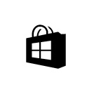
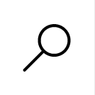

<link rel="stylesheet" href="https://az835927.vo.msecnd.net/sites/uwp/Resources/css/custom.css">

# 다음 작업

앱을 작성하려면 어디서부터 시작해야 할까요? 다음은 시작하는 데 도움이 되는 몇 가지 개발자 센터 항목입니다. UWP 플랫폼을 처음 접하는 경우 <a href="https://channel9.msdn.com/">Channel 9</a> 비디오 및 <a href="https://www.microsoftvirtualacademy.com">Microsoft Virtual Academy</a> 과정을 살펴보세요. XAML과 C#에 이미 익숙한 경우 아래 항목을 통해 시작할 수 있습니다.

UWP 항목을 검토하여 플랫폼에 대해 살펴본 다음 XAML 컨트롤을 사용하고 사용자 지정하여 사용자 인터페이스 만들기를 알아보는 것이 좋습니다. XAML의 주요 강점은 표시하려는 정보에 컨트롤을 결합하는 *데이터 바인딩*을 사용하는 것입니다. Windows 플랫폼을 처음 접하는 경우 이 개념을 이해하는 것이 중요합니다.

많은 시작 정보를 한 곳에 모은 [개발자 도구 키트](https://developer.microsoft.com/windows/projects/campaigns/welcome-toolbox) 사이트를 둘러볼 수도 있습니다.

<table class="wdg-noborder">

<tr>
 <td width=60></td>
    <td><h2>UWP 및 UWP 앱 수명 주기</h2>
앱은 어떻게 시작하고 다른 앱을 시작하면 어떻게 될까요? 다음을 참조하세요.
 <ul>
    <li><a href="https://msdn.microsoft.com/windows/uwp/get-started/universal-application-platform-guide">UWP(유니버설 Windows 플랫폼) 앱 지침</a></li>
    <li><a href="https://msdn.microsoft.com/windows/uwp/launch-resume/app-lifecycle">UWP 앱 수명 주기</a></li>
    <li><a href="https://developer.microsoft.com/windows/windows-10-for-developers">Windows 10의 새로운 기능</a></ul></td>  
</tr>
 
 
<tr>
 <td width=60></td>
    <td><h2>UX 및 UI</h2>
사용할 수 있는 컨트롤은 무엇이며 어떻게 사용할 수 있을까요? 다음 항목에서는 컨트롤과 코드가 함께 작동하는 방법과 앱의 모양에 맞게 사용자 지정할 수 있는 방법을 설명합니다.
 <ul>
    <li><a href="https://developer.microsoft.com/windows/design">디자인 및 UI</a></li>
    <li><a href="https://msdn.microsoft.com/windows/uwp/layout/layouts-with-xaml">XAML을 사용하여 페이지 레이아웃 정의</a></li>
    <li><a href="https://msdn.microsoft.com/windows/uwp/controls-and-patterns/controls-by-function">기능별 컨트롤</a></li>
      <li><a href="https://msdn.microsoft.com/windows/uwp/controls-and-patterns/controls-and-events-intro">컨트롤 및 패턴 소개</a></li>
     <li><a href="https://msdn.microsoft.com/windows/uwp/controls-and-patterns/styling-controls">컨트롤 스타일 지정</a></li>
      <li><a href="https://msdn.microsoft.com/windows/uwp/layout/screen-sizes-and-breakpoints-for-responsive-design">반응형 디자인에 대한 화면 크기 및 중단점</a></li>
    </ul></td>  
</tr>
 
 
<tr>
 <td width=60></td>
    <td><h2>데이터 및 서비스</h2>
코드가 목록과 그리드를 자동으로 채우게 하는 데이터 바인딩에 대해 알아봅니다. 외부 리소스에 연결하여 앱에 데이터를 가져오는 방법을 알아봅니다.
 <ul>
    <li><a href="https://msdn.microsoft.com/windows/uwp/data-binding/index">데이터 바인딩</a></li>
    <li><a href="https://msdn.microsoft.com/windows/uwp/controls-and-patterns/listview-and-gridview">Listview, Gridview 및 데이터 바인딩</a></li>
     <li><a href="https://msdn.microsoft.com/windows/uwp/data-access/index">데이터 액세스</a></li>
    </ul></td>  
</tr>
 

<tr>
 <td width=60></td>
    <td><h2>Publishing</h2>
전 세계와 작업을 공유하여 수익을 창출합니다. 스토어에 앱을 게시하는 프로세스를 안내합니다.
 <ul>
    <li><a href="https://msdn.microsoft.com/windows/uwp/publish/index">Windows 앱 게시</a></li>
    <li><a href="https://msdn.microsoft.com/windows/uwp/packaging/index">앱 패키징</a></li>
    </ul></td>  
</tr>
 
<tr>
 <td width=60></td>
    <td><h2>기타 리소스</h2>
샘플, 자습서, 비디오, 다른 도구 및 SDK입니다. 이를 통해 기술 수준을 한 단계 높일 수 있습니다.

    <ul>
    <li><a href="https://developer.microsoft.com/windows/develop">방법 문서</a></li>
    <li><a href="https://developer.microsoft.com/windows/samples">코드 샘플</a></li>
    <li><a href="https://msdn.microsoft.com/library/618ayhy6(VS.110).aspx">C# 참고자료</a></li>
    <li><a href="https://msdn.microsoft.com/library/windows/apps/bg124285.aspx">API 참조</a></li>
     <li><a href="https://msdn.microsoft.com/windows/uwp/xbox-apps/index">Xbox One용 앱 작성</a></li>
     <li><a href="https://www.microsoft.com/microsoft-hololens/developers">HoloLens 대상 개발</a></li>
     <li><a href="https://msdn.microsoft.com/windows/uwp/porting/index">Windows 10으로 앱 포팅</a></li>
      <li><a href="https://msdn.microsoft.com/windows/uwp/enterprise/index">엔터프라이즈용 앱 작성</a></li>
      <li><a href="https://blogs.windows.com/buildingapps/2016/08/17/introducing-the-uwp-community-toolkit/#D1IfVxCZMQGZqlc7.97">UWP 커뮤니티 도구 키트</a></li>
    </ul>
    </td>  
</tr>
 

</table>

## 개발자 센터에서 도움말 검색

[Microsoft 개발자 센터](http://devcenter.microsoft.com)에는 다양한 도구, 프레임워크 및 플랫폼에 대한 방대한 문서가 포함되어 있습니다. 항목과 샘플을 검색할 때 UWP 특정 콘텐츠를 읽고 있는지 확인해야 합니다. 올바른 콘텐츠를 읽고 있는지 어떻게 확인할 수 있나요?
개념 콘텐츠, 즉 비API 참조 콘텐츠는 항목의 URL에 UWP가 있습니다. API 콘텐츠에는 Windows 런타임 API가 포함된 경로가 있습니다. 

검색 엔진을 사용할 때 검색 문자열에 "Windows 앱 개발"을 추가하면 대게 UWP 콘텐츠로 안내합니다.

## 개발자 센터 중요 항목

다음은 개발자 센터의 주요 콘텐츠 섹션 목록입니다. 

<table style="width:100%">
<colgroup>
<col width="20%" />
<col width="80%" />
</colgroup>

<tbody>

<tr class="even" style="background-color: #f2f2f2">
<td align="left"><strong>디자인</strong></td>
<td align="left"><a href="http://go.microsoft.com/fwlink/p/?LinkId=533896">UWP 앱에 대한 디자인 지침</a></td>
</tr>

<tr class="odd" style="background-color: #ffffff">
<td align="left"><strong>개발</strong></td>
<td align="left"><a href="http://go.microsoft.com/fwlink/p/?LinkId=529575">앱에 사용할 수 있는 많은 기능에 대한 자세한 정보와 코딩 예제입니다.</a></td>
</tr>
<tr class="even" style="background-color: #f2f2f2">
<td align="left"><strong>언어 참조</strong></td>
<td align="left"><a href="https://msdn.microsoft.com/library/windows/apps/bg124285.aspx">UWP 개발에 사용할 수 있는 프로그래밍 언어입니다.</a></td>
</tr>
<tr class="odd" style="background-color: #ffffff">
<td align="left"><strong>게임</strong></td>
<td align="left"><a href="http://go.microsoft.com/fwlink/p/?LinkId=534184">DirectX로 게임을 개발합니다.</a></td>
</tr>
<tr class="even" style="background-color: #f2f2f2">
<td align="left"><strong>IoT(사물 인터넷)</strong></td>
<td align="left"><a href="http://go.microsoft.com/fwlink/p/?LinkId=534186">연결된 자체 디바이스를 빌드합니다.</a></td>
</tr>
<tr class="odd" style="background-color: #ffffff">
<td align="left"><strong>포팅</strong></td>
<td align="left"><a href="https://msdn.microsoft.com/library/windows/apps/Mt238321">Android 및 iOS 기술을 활용하여 UWP 앱을 신속하게 만듭니다.</a></td>
</tr>
<tr class="odd" style="background-color: #f2f2f2">
<td align="left"><strong>Windows 브리지</strong></td>
<td align="left"><a href="https://developer.microsoft.com/windows/bridges">이전 앱 및 iOS 앱을 UWP로 업데이트하기 위한 도구입니다.</a></td>
</tr>
<tr class="odd" style="background-color: #ffffff">
<td align="left"><strong>Xamarin</strong></td>
<td align="left"><a href="https://www.xamarin.com">C#을 사용하여 iOS, Android 및 Windows 10용 앱을 작성합니다.</a></td>
</tr>
<tr class="odd" style="background-color: #ffffff">
<td align="left"><strong>작업 코드 조각</strong></td>
<td align="left"><a href="https://github.com/Microsoft/Windows-task-snippets">작지만 유용한 작업을 수행하는 즉시 사용할 수 있는 코드입니다.</a></td>
</tr>
<tr class="odd" style="background-color: #f2f2f2">
<td align="left"><strong>방법 항목</strong></td>
<td align="left"><a href="https://developer.microsoft.com/windows/develop">특정 UWP 기능을 다루는 샘플 코드입니다.</a></td>
</tr>
</table>

<!--HONumber=Sep16_HO2-->

