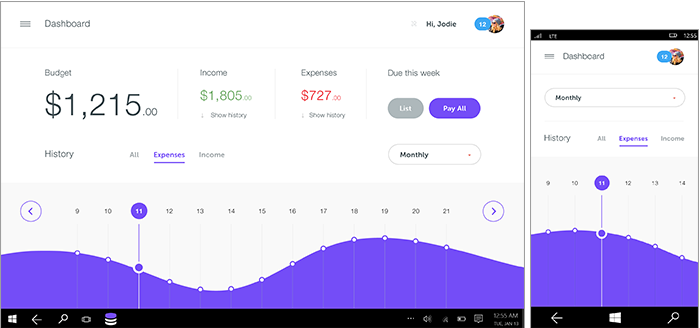

#  복잡한 UWP(유니버설 Windows 플랫폼) 앱 빌드

Microsoft 디자인 팀의 앱을 생성하는 프로세스는 개념, 구조, 역동성, 화면 효과 및 프로토타입의 5가지 단계로 구성됩니다. 유사한 프로세스를 채택하여 전 세계에 즐거움을 줄 새로운 환경을 만들어 보세요.

## 개념

**앱에 집중**

UWP(유니버설 Windows 플랫폼) 앱을 계획하는 경우 앱에서 수행할 작업과 대상 사용자뿐만 아니라 앱의 특성까지 결정해야 합니다. 모든 유용한 앱의 핵심은 확고한 기반을 제공하는 강력한 개념입니다.

사진 앱을 만든다고 가정합니다. 사용자가 사진을 이용하고 저장하며 공유하는 이유를 곰곰이 생각한 끝에 사용자는 사진을 통해 추억을 되새기고 다른 이와 소통하려 하고 사진을 안전하게 보관하길 원한다는 사실을 깨닫게 됩니다. 이 내용이 바로 앱에 구현하려는 특성이며, 이러한 환경 목표를 사용하여 나머지 디자인 프로세스를 진행합니다.

**앱에서 제공할 기능** 일반적인 개념으로 시작하여 사용자가 앱으로 할 수 있는 작업을 모두 나열하세요.

예를 들어 사람들이 여행을 계획하는 데 도움을 주는 앱을 빌드한다고 가정합니다. 다음과 같은 아이디어를 메모해 볼 수 있습니다.

-   여행 일정에 있는 모든 장소의 지도를 확보하여 여행 시 휴대합니다.
-   특정 도시에서 진행될 특별 행사를 알아봅니다.
-   여행 친구가 꼭 해봐야 할 활동과 주요 명소와 관련하여 공유 가능한 목록을 따로 작성할 수 있게 합니다.
-   여행 친구가 모든 사진을 정리하여 친구 및 가족과 공유할 수 있게 합니다.
-   항공 요금에 따른 추천 목적지를 확인합니다.
-   목적지 주변의 식당, 상점, 체험 활동과 관련한 통합 상품 목록을 검색합니다.

**앱의 특성** 잠시 아이디어 목록을 살펴보고 눈에 들어오는 특정 시나리오가 있는지 확인합니다. 목록의 시나리오 중에서 주력할 한 가지 시나리오를 선택하세요. 이 과정에서 좋은 아이디어를 많이 배제할 수도 있지만, 한 가지 시나리오를 최대 장점으로 만들기 위해서는 단호한 결정을 내려야 합니다.

한 가지 시나리오를 선택하고 일반 사용자에게 앱의 최대 장점을 잘 설명할 수 있는 문장을 하나 작성하세요. 예를 들어 다음과 같은 가치를 제공해야 합니다.

-   제 여행 앱은 친구들이 모여 단체 여행에 맞는 여행 일정을 짜는 데 매우 적합합니다.
-   제 운동 앱은 친구들이 운동 진행 상태를 추적하고 달성한 결과를 공유하는 데 매우 적합합니다.
-   제 장보기 앱은 가족들이 빠뜨리거나 중복으로 구입하는 물건이 없도록 주별로 장보기를 적절히 계획하는 데 매우 적합합니다.

앱의 "특성"을 설명하는 이와 같은 문장을 염두에 두고, 앱을 빌드할 때 여러 디자인 의사 결정을 내리고 양자택일 상황을 해결할 수 있습니다. 앱에서 사용자가 경험하게 하려는 시나리오에 중점을 두고 이 설명을 기능 목록으로 바꾸지 않도록 주의하세요. 앱이 제공하는 기능이 아니라 사용자가 할 수 있는 작업과 관련된 것이어야 합니다.

**깔때기형 디자인**

아이디어가 떠오르면 곧바로 개발을 시작하고 프로덕션까지 진행하고 싶을 것입니다. 하지만 이 과정에서 다른 흥미로운 아이디어가 떠오르면 어떻게 될까요? 당연히 두 아이디어의 상대적 장점에 관계없이 이미 투자한 아이디어를 고수하려고 할 것입니다. 다른 아이디어가 프로세스 초반에 떠올랐다면 얼마나 좋았을까요! 깔때기형 디자인은 최상의 아이디어를 최대한 빨리 알아내는 기술입니다.

"깔때기형"이라는 용어는 모양에서 나온 것입니다. 깔때기의 넓은 쪽에서 많은 아이디어가 들어오고 각 아이디어는 매우 낮은 충실도의 디자인 아티팩트(스케치 또는 텍스트 단락)로 실현됩니다. 이 아이디어 컬렉션이 깔때기의 좁은 쪽으로 이동함에 따라 아이디어 수는 감소하고 아이디어를 나타내는 아티팩트의 충실도는 향상됩니다. 각 아티팩트는 한 아이디어를 다른 아이디어와 비교해서 평가하거나 "이 아이디어가 유용한가요, 아니면 직관적인가요?"와 같은 특정 질문에 대답하는 데 필요한 정보만 캡처해야 합니다. *이보다 많은 시간과 노력을 각각에 투입하지 마세요*. 일부 아이디어는 테스트 과정에서 실패하며, 아이디어를 평가하는 데 필요한 것 이상을 투자하지 않았기 때문에 실패해도 상관없습니다. 테스트를 통과해서 깔때기로 더 깊이 이동하는 아이디어는 연속해서 높은 충실도 처리를 받습니다. 결국 최고 아이디어를 나타내는 단일 디자인 아티팩트만 남습니다. 이 아이디어는 먼저 떠올랐기 때문이 아니라 장점 때문에 끝까지 남게 된 것입니다. 최상의 앱을 디자인하게 됩니다.

## 구조

**조직을 통해 모든 과정 단순화**

개념에 만족할 경우 다음 단계인 앱의 청사진 만들기를 시작할 준비가 되었습니다. IA(정보 아키텍처)는 콘텐츠에 필요한 구조적 무결성을 제공합니다. IA는 앱의 탐색 모델 및 궁극적으로 앱의 정체성을 정의하는 데 도움이 됩니다. 콘텐츠 구성 방법과 사용자가 해당 콘텐츠를 검색하는 방법을 계획하면 사용자가 어떻게 앱을 경험할지 더 정확하게 파악할 수 있습니다.

좋은 IA는 사용자 시나리오를 가능하게 할 뿐만 아니라 시작할 주요 화면을 구상하는 데 도움이 됩니다. 예를 들어 [Audible](https://go.microsoft.com/fwlink/p/?LinkID=268089) 앱은 사용자 라이브러리, 저장소, 뉴스 및 통계에 대한 액세스를 제공하는 허브로 바로 시작됩니다. 집중된 환경이므로 사용자가 오디오북을 빠르게 가져오고 즐길 수 있습니다. 앱의 심층 수준에서는 보다 구체적인 작업에 중점을 둡니다.

관련된 지침은 [탐색 디자인 기본 사항](../design/basics/navigation-basics.md)을 참조하세요.

## 역동성

**개념 실행**

개념 단계에서 앱의 목적을 정의한다면 역동성 단계는 해당 목적의 실행과 관련이 있습니다. 이 단계는 와이어프레임을 사용하여 페이지 흐름(목표를 달성하기 위해 한 위치에서 앱 내의 다른 위치로 이동하는 방법) 스케치, 앱 UI 전체에서 사용되는 음성 및 단어에 대한 생각 등의 다양한 방법으로 수행될 수 있습니다. 와이어프레임은 앱의 사용자 흐름에 대한 중요한 결정에 도움이 되는 빠르고 낮은 충실도 도구입니다.

앱 흐름은 "특성" 설명에 밀접히 연결되어야 하며 구현하려는 단일 시나리오를 사용자가 달성하는 데 도움을 줄 수 있어야 합니다. 멋진 앱은 배우기 쉬우며 최소한의 작업만 필요합니다. 화면 간 수준에서 생각하기 시작해서 앱을 처음 사용하는 것처럼 확인합니다. 만들 페이지에 대한 사용자 시나리오를 파악하면 불필요한 많은 화면 터치 없이 사용자에게 원하는 것을 정확하게 제공할 수 있습니다. 역동성은 동작과도 관련이 있습니다. 올바른 동작 기능은 한 페이지에서 다음 페이지로의 유연성과 사용 편의성을 결정합니다.

이 단계에 도움이 되는 일반적인 기술:

-   대략적인 흐름 구성: 맨 먼저 오는 내용과 다음에 올 내용 결정
-   흐름 스토리보드 작성: 사용자들이 흐름을 완료하기 위해 UI를 따라 이동하는 방식
-   프로토타입 작성: 간단한 프로토타입으로 흐름 시도

**사용자가 할 수 있어야 하는 작업** 예를 들어 여행 앱은 "친구들이 모여 단체 여행에 맞는 여행 일정을 짜는 데 적합합니다." 사용할 흐름을 나열해 보세요.

-   일반 정보를 사용하여 여행 만들기
-   여행에 참가하도록 친구 초대
-   친구의 여행에 참가
-   다른 여행자가 추천하는 여행 일정 참조
-   목적지와 활동을 여행에 추가
-   친구가 추가한 목적지와 활동을 편집하고 의견 추가
-   친구 및 가족이 따르도록 여행 일정표 공유

## 시각 효과

**단어 없이 말하기**

앱의 역동성을 설정한 후에는 올바른 시각 효과로 앱을 꾸밀 수 있습니다. 멋진 시각 효과는 앱의 모양뿐만 아니라 앱이 어떤 느낌을 주며 애니메이션 및 동작을 통해 어떻게 생생하게 표현되는지를 정의합니다. 선택한 색상표, 아이콘 및 아트워크는 이러한 시각적 언어의 몇 가지 예입니다.

모든 앱에는 고유한 정체성이 있으므로 앱으로 수행할 수 있는 시각적 방향을 탐색해 보세요. 콘텐츠에 따라 모양과 느낌을 결정하세요. 모양이 콘텐츠를 통제하면 안 됩니다.

## 프로토타입

**앱 구체화**

프로토타입 작성은 앞에서 설명한 기술인 *깔때기형 디자인*의 한 단계로, 아이디어를 나타내는 아티팩트를 스케치 이상이지만 완전한 앱보다 덜 복잡한 형태로 개발합니다. 프로토타입은 사용자에게 표시되는 손으로 그린 화면 흐름일 수 있습니다. 테스트를 실행하는 사람은 실행 중인 앱을 시뮬레이트하기 위해 다른 화면을 아래에 배치하거나 페이지에 작은 UI 조각을 연결 또는 연결 해제하여 사용자의 신호에 응답할 수 있습니다. 또는 프로토타입은 운영자가 스크립트를 따르고 오른쪽 단추를 누를 경우 일부 워크플로를 시뮬레이트하는 매우 간단한 앱일 수 있습니다. 이 단계에서는 아이디어가 실제로 구현되기 시작하며 본격적으로 작업이 테스트됩니다. 앱 영역의 프로토타입을 작성하는 경우 시간을 들여서 이 작업이 가장 필요한 구성 요소를 만들고 구체화합니다.

새 개발자에게는 다음을 강조하고 싶습니다. 훌륭한 앱을 만드는 작업은 반복적인 프로세스입니다. 초기에 자주 프로토타입을 작성하는 것이 좋습니다. 모든 창의적인 작업과 마찬가지로 최상의 앱은 무수한 시행착오의 산물입니다.

## 포함할 기능 결정

사용자의 요구 사항과 이를 충족하는 방법을 알게 되었으므로 이제 도구 상자의 특정 도구를 확인합니다. UWP(유니버설 Windows 플랫폼)를 살펴보고 기능과 앱의 요구를 연결합니다. 각 기능에 대한 [사용자 환경(UX) 지침](https://developer.microsoft.com/windows/apps/design)을 따릅니다.
<!--need URL for landing page -->

일반 기술:

-   플랫폼 조사: 플랫폼이 제공하는 기능과 사용 방법을 확인합니다.
-   연결 다이어그램: 흐름과 기능을 연결합니다.
-   프로토타입: 기능을 실행하여 필요한 작업을 수행하는지 알아봅니다.

**앱 계약**  앱은 전체, 앱 간, 기능 간 사용자 흐름을 가능하게 하는 앱 계약에 참여할 수 있습니다.

-   **공유**  사용자가 다른 앱을 통해 다른 사람들과 앱의 콘텐츠를 공유하고 다른 사람 및 앱으로부터 공유 가능한 콘텐츠를 받을 수 있도록 합니다.
-   **원격 재생**  사용자가 앱에서 홈 네트워크의 다른 디바이스로 스트리밍되는 오디오, 동영상 또는 이미지를 즐길 수 있도록 합니다.
-   **파일 선택기 및 파일 선택기 확장**  로컬 파일 시스템, 연결된 저장 디바이스, 홈 그룹 또는 기타 앱에서 해당 앱으로 파일을 로드하고 저장할 수 있도록 합니다. 다른 앱에서 사용자 앱의 콘텐츠를 로드할 수 있도록 파일 선택기 확장을 제공할 수도 있습니다.

자세한 내용은 [앱 계약 및 확장](https://docs.microsoft.com/previous-versions/windows/apps/hh464906(v=win.10))을 참조하세요.
<!-- Win 8 page. Should have replacement. -->

**다양한 뷰, 양식 요소 및 하드웨어 구성**  Windows에서는 사용자가 모든 작업을 제어할 수 있으며 앱이 중심이 됩니다. 사용자가 해당 앱을 사용하기로 결정한 어떤 디바이스에서든, 어떤 입력 모드를 사용하든, 어떤 방향으로든, 어떤 하드웨어 구성에서든, 어떤 환경에서든 앱 UI가 두드러지게 하고 싶을 것입니다.

**터치 중심**  Windows에서는 마우스 기능을 단순히 에뮬레이트하는 것 이상의 독특하고 고유한 터치 환경을 제공합니다.

예를 들어 시맨틱 줌은 대량의 콘텐츠를 탐색할 수 있는 터치 최적화 방법입니다. 사용자는 콘텐츠 범주를 따라 이동하거나 스크롤한 다음 해당 범주를 확대하면서 점점 더 자세한 정보를 볼 수 있습니다. 이 기능을 사용하여 탭과 같은 전형적인 탐색 및 레이아웃 패턴보다 좀 더 감각적이고 시각적이며 유익하게 콘텐츠를 제공할 수 있습니다.

물론 회전, 이동, 살짝 밀기 등의 수많은 터치 조작도 이용할 수 있습니다. [터치 및 기타 사용자 조작](../design/input/input-primer.md)에 대해 자세히 알아보세요.

**매력적이고 신선한 느낌의 앱 구현**  앱에 신선한 느낌을 주고 사용자가 이러한 표준 환경을 선택하도록 유도하세요.

-   **애니메이션**  애니메이션 라이브러리를 통해 사용자가 앱을 빠르고 유연하게 사용할 수 있게 합니다. 사용자가 컨텍스트 변경을 이해하고 시각적 전환에 맞게 작업할 수 있도록 합니다. [UI에 애니메이션 효과 주기](../graphics/animations-overview.md)에 대해 자세히 알아보세요.
-   **알림 메시지**  알림 메시지를 통해 시간이 중요하거나 개인적으로 관련된 콘텐츠임을 알리고 앱이 닫힌 경우에도 앱으로 다시 초대합니다. [타일, 배지 및 알림 메시지](../design/shell/tiles-and-notifications/index.md)에 대해 자세히 알아보세요.
-   **앱 타일**  사용자를 앱으로 다시 유도할 수 있는 신선하고 적절한 업데이트를 제공합니다. 다음 섹션에서 이 내용에 대해 자세히 살펴보겠습니다. [앱 타일](../design/shell/tiles-and-notifications/creating-tiles.md)에 대해 자세히 알아보세요.

**개인 설정**

-   **설정**  앱 설정을 저장하여 사용자가 원하는 환경을 만들 수 있도록 합니다. 모든 설정을 하나의 화면에 통합하고 사용자가 이미 익숙한 일반 메커니즘을 통해 앱을 구성할 수 있도록 합니다. [앱 설정 추가](../design/app-settings/app-settings-and-data.md)에 대해 자세히 알아보세요.
-   **로밍**  사용자가 작업을 중단한 위치에서 다시 시작할 수 있도록 하고 가장 좋아하는 UX를 유지하는 데이터를 로밍하여 사용 중인 디바이스와 관계없이 모든 디바이스에서 지속적인 환경을 구축합니다. 로밍을 통해 설정 및 상태를 유지 관리하여 부엌에 있는 가족용 PC, 회사 PC, 개인용 태블릿, 기타 폼 팩터 등 어디에서든 앱을 쉽게 사용할 수 있게 합니다. [응용 프로그램 데이터 관리](../design/app-settings/store-and-retrieve-app-data.md)에 대해 살펴보고, [로밍 중인 응용 프로그램 데이터에 대한 지침](https://docs.microsoft.com/windows/uwp/design/app-settings/store-and-retrieve-app-data)을 참조하세요.
-   **사용자 타일**  사용자가 사용자 타일 이미지를 로드하여 개인에 맞는 앱을 구성하도록 하거나 앱의 콘텐츠를 Windows 전체의 개인 타일로 설정할 수 있도록 합니다.

**디바이스 기능**  앱이 최신 디바이스 기능을 충분히 활용하도록 합니다.

-   **근접 연결 제스처**  사용자가 실제로 디바이스를 함께 탭하여 물리적으로 가까이 있는 다른 사용자와 디바이스를 연결할 수 있게 합니다(멀티플레이어 게임). [근접 연결 및 탭하기](https://docs.microsoft.com/previous-versions/windows/apps/hh465229(v=win.10))에 대해 자세히 알아보세요.
-   **카메라 및 외부 스토리지 디바이스**  기본 제공되거나 연결된 카메라에 사용자를 연결하여 채팅 및 회의에 참여하거나, vlog를 녹화하거나, 프로필 사진을 찍거나, 주변 소식을 기록하거나, 앱에서 제공하는 여러 기능을 이용할 수 있게 합니다. [이동식 저장소의 콘텐츠 액세스](https://docs.microsoft.com/previous-versions/windows/apps/hh465189(v=win.10))에 대해 자세히 알아보세요.
-   **가속도계 및 기타 센서**    디바이스에는 수많은 센서가 달려 있습니다. 앱은 주변 광원에 따라 디스플레이를 흐리게 하거나 밝게 하고, 사용자가 디스플레이를 돌릴 경우 UI를 재배치하며, 물리적 이동에 반응할 수 있습니다. [센서](../devices-sensors/sensors.md)에 대해 자세히 알아보세요.
-   **지리적 위치**  표준 웹 데이터나 지리적 위치 센서의 지리적 위치 정보를 사용하여 사용자가 이동하거나, 지도상 위치를 찾거나, 근처에 있는 사람, 활동, 목적지 등과 관련한 알림을 받도록 도와줍니다. [지리적 위치](https://docs.microsoft.com/previous-versions/windows/apps/hh465139(v=win.10))에 대해 자세히 알아보세요.

여행 앱 예를 다시 살펴보겠습니다. 친구들이 그룹 여행에 맞는 여행 일정표를 협력해서 만드는 데 도움을 줄 수 있는 앱을 만들기 위해서는 다음과 같은 기능을 사용할 수 있습니다.

-   공유: 예정된 여행 및 여행 일정표를 여러 소셜 네트워크에 올려 여행하기 전부터 친구 및 가족과 들뜬 마음을 나눌 수 있습니다.
-   검색: 다른 사람의 공유 또는 공개 여행 일정표에서 활동이나 목적지를 검색하여 자신의 여행에 포함할 수 있습니다.
-   알림: 여행사에서 여행 일정표를 업데이트하면 알림을 받습니다.
-   설정: 여행 알림이 표시되거나 소셜 그룹에서 사용자의 여행 일정표를 검색할 수 있도록 허용하는 등, 사용자가 원하는 대로 앱을 구성할 수 있습니다.
-   시맨틱 줌: 여행 일정표의 시간표를 탐색하고 확대하여 계획한 활동에 대한 보다 자세히 목록을 확인합니다.
-   사용자 타일: 친구와 여행을 공유할 때 표시할 사진을 선택합니다.

## 앱으로 수익을 창출하는 방법 결정

앱을 통해 돈을 벌 수 있는 여러 가지 옵션이 있습니다. 앱에서 바로 광고 또는 앱에서 바로 판매 기능을 사용하려면 이러한 기능을 지원하도록 UI를 디자인할 수 있습니다. 자세한 내용은 [수익 창출 계획](../monetize/index.md)을 참조하세요.

## 앱의 UX 디자인

기본적인 사항을 결정하는 부분입니다. 이제 앱의 특성을 알고 있으며 지원하려는 흐름을 확인했으므로 UX(사용자 환경) 디자인의 기본 사항을 결정할 수 있습니다.

**UI 콘텐츠 구성 방법**   대부분의 앱 콘텐츠는 특정 형식의 그룹 또는 계층 구조로 구성할 수 있습니다. 콘텐츠의 최상위 그룹은 "특성" 설명의 핵심 요소를 반영해야 합니다.

여행 앱을 예로 들 경우 여러 가지 방법으로 여행 일정표를 그룹화할 수 있습니다. 앱의 핵심이 흥미로운 목적지를 검색하는 것이라면 모험적 요소, 일광욕 또는 낭만적 휴가 등의 관심사에 따라 그룹화할 수 있습니다. 그러나 앱의 핵심이 친구와의 여행을 계획하는 것이라면 가족, 친구 또는 직장과 같은 사교 모임에 따라 여행 일정표를 구성하는 것이 타당합니다.

콘텐츠 그룹화 방법을 선택하면 앱에 넣을 페이지나 뷰를 결정하는 데 도움이 됩니다. 자세한 내용은 UI 기본 사항을 참조하세요.

**UI 콘텐츠 표시 방법** UI 구성 방법을 결정한 후 UI가 구축되고 사용자에게 표시되는 방법을 지정하는 UX 목표를 지정할 수 있습니다. 모든 시나리오에서 사용자가 최대한 빨리 계속해서 앱을 사용하고 즐길 수 있는지 확인하려고 합니다. 이렇게 하려면 처음에 표시할 UI 부분을 결정하고 중요하지 않은 부분을 작성하는 데 시간을 소비하기 전에 해당 부분이 먼저 완료되도록 해야 합니다.

여행 앱에서는 사용자가 앱에서 수행하려는 첫 번째 작업이 특정 여행 일정표를 찾는 것입니다. 이 정보를 최대한 빠르게 제공하려면 **ListView** 컨트롤을 사용하여 먼저 여행 목록을 표시해야 합니다.

여행 목록을 표시한 후에는 친구의 여행에 대한 뉴스 피드와 같은 다른 기능을 로드할 수 있습니다.

**필요한 UI 영역 및 명령**   앞서 살펴본 흐름을 검토해 보세요. 각 흐름에 대해 사용자가 수행하는 단계를 대략적으로 구성합니다.

"친구 및 가족과 함께 할 여행 일정표 공유" 흐름을 살펴보겠습니다. 해당 사용자가 여행을 이미 만들었다고 가정합니다. 여행 일정표를 공유하려면 다음과 같은 단계가 필요할 수 있습니다.

1.  사용자는 앱을 열고 만든 여행 목록을 봅니다.
2.  공유하려는 여행을 탭합니다.
3.  화면에 여행 세부 정보가 나타납니다.
4.  공유를 시작하기 위한 UI에 액세스합니다.
5.  여행을 공유할 친구의 메일 주소나 이름을 선택하거나 입력합니다.
6.  공유를 확정하는 UI에 액세스합니다.
7.  앱이 여행을 공유한 사람 목록으로 여행 세부 정보를 업데이트합니다.

이 프로세스 동안 만들어야 하는 UI와 결정해야 하는 추가 세부 사항(예제: 아직 해당 앱을 사용하고 있지 않은 친구를 위한 표준 메일 상용구 초안 작성)을 확인합니다. 불필요한 단계를 제거할 수도 있습니다. 예를 들어 공유하기 전에는 사용자가 여행 세부 사항을 볼 필요가 없을 수 있습니다. 흐름이 명확할수록 사용하기 편리해집니다.

여러 화면의 사용 방법에 대한 자세한 내용은 다음을 참조하세요. <!--[Command design basics](../design/basics/commanding-basics.md)-->.

**흐름의 느낌** 사용자가 수행할 단계를 정의하고 나면 해당 흐름을 성능 목표로 전환할 수 있습니다. 자세한 내용은 [성능 계획](../debug-test-perf/planning-and-measuring-performance.md)을 참조하세요.

**명령 구성 방법**  대략적인 흐름 구성 단계를 사용하여 디자인해야 하는 잠재적 명령을 식별할 수 있습니다. 그런 후 앱에서 해당 명령을 사용할 위치를 고려합니다.

-   **항상 콘텐츠를 사용하려고 시도**  가능한 경우 항상 사용자가 콘텐츠에 실행되는 명령을 추가하기보다 앱의 캔버스에서 콘텐츠를 직접 조작할 수 있도록 합니다. 예를 들어 사용자가 여행 앱에서 활동을 선택하고 위쪽 또는 아래쪽 명령 단추를 사용하기보다 캔버스의 목록에 활동을 끌어다 놓아 여행 일정표를 다시 짤 수 있도록 합니다.
-   **콘텐츠를 사용할 수 없는 경우** 다음 UI 화면 중 하나에 명령을 배치합니다.

    -   [명령 모음](https://docs.microsoft.com/windows/uwp/controls-and-patterns/app-bars): 대부분의 명령을 명령 모음에 추가해야 합니다. 명령 모음은 사용자가 탭하여 표시할 때까지 대체로 숨겨져 있습니다.
    -   앱 캔버스: 사용자가 단일 목적을 갖는 페이지나 뷰를 표시하는 경우 해당 목적의 명령을 캔버스에 직접 제공할 수 있습니다. 이러한 명령은 일부에 불과합니다.
    -   [상황에 맞는 메뉴](https://docs.microsoft.com/windows/uwp/controls-and-patterns/menus): 클립보드 동작(예: 잘라내기, 복사, 붙여넣기) 또는 선택할 수 없는 콘텐츠에 적용되는 명령(예: 지도의 특정 위치에 고정핀 추가)에는 상황에 맞는 메뉴를 사용할 수 있습니다.

**각 보기에서 앱의 배치 방법 결정**  Windows에서는 가로 및 세로 방향을 지원하며, 전체 화면에서 최소 너비까지 모든 너비로 앱 크기 조정을 지원합니다. 모든 크기의 모든 화면에서 두 방향으로 모두 제대로 표시 및 작동하는 앱을 만들려고 합니다. 즉, 각 크기와 보기에 대한 UI 요소의 레이아웃을 계획해야 합니다. 이렇게 하면 사용자의 요구 및 기본 설정에 맞게 앱 UI가 유연하게 바뀝니다.

다양한 화면 크기 디자인에 대한 자세한 내용은 [반응형 디자인에 대한 화면 크기 및 중단점](https://docs.microsoft.com/windows/uwp/design/layout/screen-sizes-and-breakpoints-for-responsive-design)을 참조하세요.

## 좋은 첫인상 주기

사용자가 앱을 처음 시작할 때 어떻게 생각하거나 느끼고 무엇을 하기를 원하는지 생각해 보세요. "특성" 설명을 다시 참조해 보세요. 개인적으로 사용자들에게 앱이 어떤 특성을 갖는지 알려 줄 기회가 없더라도 첫인상을 통해 메시지를 전달할 수 있습니다. 다음을 이용해 보세요.

**타일 및 알림**    타일은 앱의 얼굴입니다. 사용자 시작 화면의 여러 앱 중에서 어떻게 하면 사용자가 해당 앱을 시작하도록 만들 수 있을까요? 타일에 앱 브랜드를 강조하고 앱의 좋은 점을 나타내세요. 앱이 항상 신선하고 작업에 적합하게 느껴져 사용자를 다시 앱으로 유도하는 타일 알림을 사용하세요.

**시작 화면**  시작 화면은 가능한 한 빠르게 로드되어야 하고, 앱 상태를 초기화하는 데 필요한 동안만 화면에 표시되어야 합니다. 시작 화면에는 앱의 개성을 잘 나타내는 내용을 표시해야 합니다.

**처음 시작**  사용자가 서비스에 등록하거나 계정에 로그인하거나 자체 콘텐츠를 추가하기 전에 어떤 화면을 보게 될까요? 사용자에게 정보를 요청하기 전에 앱의 가치를 입증해 보세요. 사람들에게 사용 확정을 요청하기 전에 살펴보고 앱의 기능을 이해할 수 있도록 샘플 콘텐츠를 보여 주는 것이 좋습니다.

**홈페이지**  홈페이지는 앱을 시작할 때마다 표시되는 페이지입니다. 여기에 표시되는 콘텐츠는 앱의 주요 특징을 소개하고 적절한 용도를 바로 보여 줍니다. 이 페이지에 한 가지 유용한 특성을 제공하여 사람들이 앱의 나머지 부분을 탐색하도록 유도합니다. 방문 페이지에서는 검색 기능보다 사용자의 주의를 분산시키는 요소 제거에 중점을 둡니다.

## 디자인 유효성 검사

앱 개발을 많이 진행하기 전에 지침, 사용자 인상 및 요구 사항을 기준으로 디자인 또는 프로토타입의 유효성을 검사하여 나중에 다시 작업하는 일이 없도록 합니다. 각 기능에는 앱을 세련되게 꾸미는 데 도움이 되는 UX 지침 세트와 Microsoft Store에 앱을 게시하기 위해 충족해야 하는 Store 요구 사항 세트가 있습니다. [Windows 앱 인증 키트](https://developer.microsoft.com/windows/develop/app-certification-kit)를 사용하여 기술 사양이 스토어 요구 사항에 맞는지 테스트할 수 있습니다. Microsoft Visual Studio의 성능 도구를 사용하여 모든 시나리오에서 최상의 환경을 사용자에게 제공하도록 설정할 수도 있습니다.

[UWP 앱에 대한 자세한 UX 지침](https://developer.microsoft.com/windows/apps/design)을 사용하여 중요한 기능에 집중할 수 있습니다. [Visual Studio 성능 도구](https://docs.microsoft.com/visualstudio/profiling/profiling-tools?view=vs-2015)를 사용하여 각 앱의 시나리오 성능을 분석할 수 있습니다.
