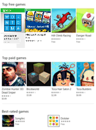

# <a name="intro-to-the-universal-windows-platform"></a>유니버설 Windows 플랫폼 개요

이 가이드에서는 다음에 대해 알아봅니다.

-   *디바이스 패밀리*의 정의 및 대상 디바이스 패밀리를 결정하는 방법
-   UI를 다양한 장치 폼팩터에 적응시킬 수 있는 새로운 UI 컨트롤 및 패널
-   앱에 사용할 수 있는 API 표면을 이해하고 제어하는 방법.

Windows 8에서는 Windows 앱 모델의 발전된 형태인 WinRT(Windows 런타임)를 도입했습니다. 이는 일반적인 응용 프로그램 아키텍처에 사용되었습니다.

Windows Phone 8.1을 사용할 수 있게 되면서 Windows 런타임은 Windows Phone 8.1과 Windows 사이에 정렬되었습니다. 이를 통해 개발자는 공유 코드베이스를 사용하여 Windows와 Windows Phone을 둘 다 대상으로 하는 *유니버설 Windows 8 앱*을 만들 수 있었습니다.

Windows 10에는 Windows 런타임 모델을 더욱 발전시키고 Windows 10 통합 코드로 가져오는 UWP(Windows 10유니버설 Windows 플랫폼)가 도입되었습니다. 이제 UWP는 코어의 일부로 Windows 10을 실행하는 모든 장치에서 사용 가능한 공통 앱 플랫폼을 제공합니다. 이러한 진화 덕분에 UWP를 대상으로 하는 앱은 모든 장치에 일반적인 WinRT API뿐만 아니라 앱이 실행되는 디바이스 패밀리에 특정한 API(Win32 및 .NET API 포함)를 호출할 수 있습니다. UWP는 장치 간에 보장된 핵심 API 계층을 제공합니다. 따라서 광범위한 장치에 설치할 수 있는 단일 앱 패키지를 만들 수 있습니다. 또한 단일 앱 패키지를 통해 Windows 스토어에서는 앱을 실행할 수 있는 모든 디바이스 유형에 연결되는 통합 배포 채널을 제공합니다.


UWP 앱은 폼 팩터 및 입력 형식이 서로 다른 광범위한 디바이스에서 실행되므로 각 디바이스에 맞게 조정하고 각 디바이스의 고유한 기능을 활용할 수 있습니다. 장치는 보장된 API 계층에 고유한 API를 추가합니다. 다른 장치에서 다른 환경을 제공하는 동안 앱이 하나의 장치 유형에 특정한 기능을 사용할 수 있도록 이러한 고유한 API에 조건부로 액세스하는 코드를 작성할 수 있습니다. 적응형 UI 컨트롤 및 새 레이아웃 패널은 광범위한 화면 해상도에서 UI를 조정하도록 도와줍니다.

## <a name="device-families"></a>디바이스 패밀리

Windows 8.1 및 Windows Phone 8.1 앱은 특정 OS(운영 체제)(Windows 또는 Windows Phone)를 대상으로 합니다. Windows 10에서는 더 이상 특정 운영 체제를 대상으로 하지 않습니다. 대신 하나 이상의 디바이스 패밀리를 대상으로 합니다. 디바이스 패밀리는 디바이스 패밀리 내의 장치에서 기대할 수 있는 API, 시스템 특성 및 동작을 식별합니다. 또한 스토어에서 앱을 설치할 수 있는 장치 집합을 결정합니다. 디바이스 패밀리 계층 구조는 다음과 같습니다.


디바이스 패밀리는 함께 수집되어 하나의 이름과 하나의 버전 번호가 지정된 API 집합입니다. 디바이스 패밀리는 OS의 기초입니다. PC에서는 데스크톱 디바이스 패밀리를 기반으로 하는 데스크톱 OS를 실행합니다. 휴대폰과 태블릿 등에서는 모바일 디바이스 패밀리를 기반으로 하는 모바일 OS를 실행합니다. 이런 식으로 구성됩니다.확인하세요.

유니버설 디바이스 패밀리는 특별합니다. 이는 직접적으로 OS의 기초가 아닙니다. 대신 유니버설 디바이스 패밀리의 API 집합은 자식 디바이스 패밀리에서 상속됩니다. 따라서 유니버설 디바이스 패밀리 API는 모든 OS와 모든 디바이스에 제공됩니다.

각 자식 디바이스 패밀리는 상속하는 디바이스 패밀리에 고유한 API를 추가합니다. 이로 인해 자식 디바이스 패밀리의 API 조합은 해당 디바이스 패밀리를 기반으로 하는 OS와 해당 OS를 실행하는 모든 디바이스에 제공됩니다.

디바이스 패밀리의 한 가지 이점은 휴대폰, 태블릿, 데스크톱 컴퓨터, Surface Hub, Xbox 콘솔, HoloLens 등의 다양한 디바이스 중 하나 또는 모든 디바이스에서 앱을 실행할 수 있다는 점입니다. 또한 앱에서 적응형 코드를 사용하여 유니버설 디바이스 패밀리에 속하지 않는 디바이스의 기능을 동적으로 검색하고 사용할 수 있습니다.

앱의 대상 디바이스 패밀리(또는 패밀리)를 결정하는 것은 사용자의 몫입니다. 또한 이러한 결정은 앱에 다음과 같이 중요한 영향을 미칩니다. 디바이스 패밀리 결정에 따라 다음 사항이 결정됩니다.

-   앱을 실행할 때 제공해야 하는(따라서 자유롭게 호출할 수 있는) 것으로 간주될 수 있는 API 집합
-   조건문 내에서만 안전한 API 호출 집합
-   스토어에서 앱을 설치할 수 있는 장치 집합(이에 따라 고려해야 하는 폼 팩터)

디바이스 패밀리를 선택할 때 두 가지 중요한 결과가 있습니다. 앱에서 무조건적으로 호출할 수 있는 API 표면과 앱에서 연결할 수 있는 장치 수입니다. 이 두 가지 요소는 서로 상반되는 효과가 있습니다. 예를 들어 UWP 앱은 특별히 유니버설 디바이스 패밀리를 대상으로 함에 따라 결과적으로 모든 장치에서 사용할 수 있는 앱입니다. 유니버설 디바이스 패밀리를 대상으로 하는 앱은 유니버설 디바이스 패밀리의 API만 제공하는 것으로 가정할 수 있습니다(이를 대상으로 하기 때문). 다른 API는 조건부로 호출해야 합니다. 또한 이러한 앱은 광범위한 장치에서 실행될 수 있으므로 뛰어난 적응형 UI와 포괄적인 입력 기능이 있어야 합니다. Windows 모바일 앱은 특별히 모바일 디바이스 패밀리를 대상으로 하며 해당 OS가 모바일 디바이스 패밀리(휴대폰, 태블릿 및 유사한 장치 포함)를 기반으로 하는 장치에 사용할 수 있는 앱입니다. 모바일 디바이스 패밀리 앱은 모바일 디바이스 패밀리의 모든 API를 제공하는 것으로 가정할 수 있으며, 해당 UI가 적당히 적응형이어야 합니다. IoT 디바이스 패밀리를 대상으로 하는 앱은 IoT 장치에만 설치할 수 있으며 IoT 디바이스 패밀리의 모든 API를 제공하는 것으로 가정할 수 있습니다. 이 앱은 특정 장치 유형에서만 실행되므로 해당 UI와 입력 기능이 매우 특수할 수 있습니다.

<iframe src="https://channel9.msdn.com/Blogs/One-Dev-Minute/Introduction-to-UWP-and-Device-Families/player" width="640" height="360" allowFullScreen frameBorder="0"></iframe>

다음은 대상 디바이스 패밀리를 결정할 때 도움이 되는 몇 가지 고려 사항입니다.

**앱의 범위를 최대화**

앱의 대상 장치 범위를 극대화하고 최대한 많은 장치에서 실행하려면 앱의 대상을 유니버설 디바이스 패밀리로 지정합니다. 이렇게 하면 앱이 자동으로 유니버설을 기반으로 하는 모든 디바이스 패밀리(다이어그램에서 모든 유니버설의 자식)를 대상으로 지정합니다. 즉, 이러한 디바이스 패밀리를 기반으로 하는 모든 OS와 해당 운영 체제를 실행하는 모든 장치에서 앱이 실행됩니다. 이러한 모든 디바이스에서 사용할 수 있는 API는 대상으로 지정한 유니버설 디바이스 패밀리의 특정 버전에 정의된 API 집합뿐입니다(이 릴리스의 경우 이 릴리스에서 해당 버전은 항상 10.0.x.0입니다. 앱에서 대상 디바이스 패밀리 버전 외부의 API를 호출할 수 있는 방법을 알아보려면 이 항목의 뒷부분에 있는 코드 작성을 참조하세요.

**앱을 한 가지 종류의 디바이스로 제한**

앱을 광범위한 디바이스에서 실행하지 않는 경우도 있습니다. 예를 들어 데스크톱 PC 또는 Xbox 콘솔에서만 실행할 수 있습니다. 이 경우 자식 디바이스 패밀리 중 하나에서 앱을 대상으로 선택할 수 있습니다. 예를 들어 데스크톱 디바이스 패밀리를 대상으로 하는 경우 앱에서 사용할 수 있는 API에는 유니버설 디바이스 패밀리에서 상속된 API와 데스크톱 디바이스 패밀리에 특정한 API가 포함됩니다.

**앱을 가능한 모든 장치의 하위 집합으로 제한**

유니버설 디바이스 패밀리 또는 자식 디바이스 패밀리 중 하나를 대상으로 지정하는 대신 둘 이상의 자식 디바이스 패밀리를 대상으로 지정할 수 있습니다. 데스크톱과 모바일을 대상으로 지정하는 것은 앱에 적합할 수 있습니다. 또는 데스크톱과 HoloLens. 또는 데스크톱, Xbox 및 Surface Hub 등.

**특정 버전의 디바이스 패밀리에 대한 지원 제외**

드문 경우지만, 특정 버전의 특정 디바이스 패밀리에 속한 장치를 제외하고 모든 곳에서 앱을 실행할 수 있습니다. 앱이 유니버설 디바이스 패밀리의 버전 10.0.x.0을 대상으로 하는 경우를 예로 들어 보겠습니다. 나중에 운영 체제 버전이 변경되는 경우(예: 10.0.x.2) 해당 시점에서 앱의 대상을 10.0.x.0 유니버설과 10.0.x.2 Xbox로 지정하여 버전 10.0.x.1 Xbox를 제외한 모든 곳에서 앱이 실행되도록 지정할 수 있습니다. 그러면 Xbox 10.0.x.1 이하에 속하는 디바이스 패밀리 버전 집합에서는 앱을 사용할 수 없게 됩니다.

기본적으로 Microsoft Visual Studio는 **Windows.Universal**을 앱 패키지 매니페스트 파일에서 대상 디바이스 패밀리로 지정합니다. 저장소 내에서 앱이 제공받는 디바이스 패밀리를 지정하려면 Package.appxmanifest 파일에서 [**TargetDeviceFamily**](https://msdn.microsoft.com/library/windows/apps/dn986903) 요소를 수동으로 구성합니다.

## <a name="ui-and-universal-input"></a>UI 및 유니버설 입력

UWP 앱은 입력 형식, 화면 해상도, DPI 밀도 및 기타 고유한 특성이 서로 다른 다양한 장치에서 실행될 수 있습니다. Windows 10에서는 앱을 실행할 수 있는 장치에 UI를 적응할 수 있도록 새로운 유니버설 컨트롤, 레이아웃 패널 및 도구를 제공합니다. 예를 들어 앱이 데스크톱 컴퓨터에서 실행될 때와 모바일 장치에서 실행될 때 화면 해상도의 차이를 활용할 수 있도록 UI를 조정할 수 있습니다.

앱 UI의 일부 측면은 장치 간에 자동으로 적응합니다. 단추 및 슬라이더와 같은 컨트롤은 디바이스 패밀리 및 입력 모드 간에 자동으로 적응합니다. 그러나 앱의 사용자 환경은 앱이 실행되는 장치에 따라 수동으로 적응해야 할 수도 있습니다. 예를 들어 사진 앱은 소형 핸드헬드 장치에서 실행되는 경우 한손으로 사용하기에 적합하도록 UI를 적응해야 합니다. 사진 앱을 데스크톱 컴퓨터에서 실행할 때는 추가 화면 공간을 활용하도록 UI를 적응해야 합니다.

Windows에서는 다음과 같은 기능으로 UI를 여러 장치에 맞게 조정하도록 도와줍니다.

-   유니버설 컨트롤 및 레이아웃 패널은 장치의 화면 해상도에 맞게 UI를 최적화하도록 도와줍니다.
-   일반적인 입력 처리는 터치, 펜, 마우스, 키보드 또는 Microsoft Xbox 컨트롤러와 같은 컨트롤러를 통해 입력을 받을 수 있도록 해줍니다.
-   도구는 서로 다른 화면 해상도에 적응되는 UI를 디자인하도록 도와줍니다.
-   적응형 크기 조정은 장치 간의 해상도 및 DPI 차이에 맞게 조정됩니다.

### <a name="universal-controls-and-layout-panels"></a>유니버설 컨트롤 및 레이아웃 패널

Windows 10에는 일정 및 분할 보기와 같은 새로운 컨트롤이 포함되어 있습니다. 이전에 Windows Phone에서만 제공된 피벗 컨트롤을 이제 유니버설 디바이스 패밀리에 사용할 수 있습니다.

큰 화면에서 원활하게 작동하도록 업데이트된 컨트롤은 장치에서 사용 가능한 화면 픽셀 수에 따라 자동으로 적응되며, 키보드, 마우스, 터치, 펜, Xbox 컨트롤러와 같은 컨트롤러 등 다양한 입력 형식과 원활하게 작동합니다.

앱을 실행할 장치의 화면 해상도에 따라 전체 UI 레이아웃을 적응해야 할 수도 있습니다. 예를 들어 데스크톱에서 실행되는 통신 앱은 마우스 입력에 적합한 컨트롤과 발신자의 화면 속 화면을 포함할 수 있습니다.


그러나 앱이 휴대폰에서 실행되는 경우에는 작업 화면이 작기 때문에 앱에서 화면 속 화면 보기를 제거하고 한손 조작에 용이하도록 통화 단추를 더 크게 만들 수 있습니다.


사용 가능한 화면 공간 크기에 따라 전체 UI 레이아웃을 적응할 수 있도록 Windows 10에 적응형 패널 및 디자인 상태가 도입되었습니다.

### <a name="design-adaptive-ui-with-adaptive-panels"></a>적응형 패널로 적응형 UI 디자인

레이아웃 패널은 사용 가능한 공간에 따라 해당 자식의 크기 및 위치를 지정합니다. 예를 들어 [**StackPanel**](https://msdn.microsoft.com/library/windows/apps/br209635)은 해당 자식을 순차적으로(가로 또는 세로) 정렬합니다. [**Grid**](https://msdn.microsoft.com/library/windows/apps/br242704)는 해당 자식을 셀에 배치하는 CSS 그리드와 유사합니다.

새 [**RelativePanel**](https://msdn.microsoft.com/library/windows/apps/dn879546)은 자식 요소 간의 관계에 의해 정의된 레이아웃 스타일을 구현합니다. 이는 화면 해상도 변경에 적응할 수 있는 앱 레이아웃을 만드는 데 사용됩니다. **RelativePanel**은 요소 간의 관계를 정의하여 요소 재배열 프로세스를 용이하게 하며, 이를 통해 중첩된 레이아웃을 사용하지 않고도 더욱 동적인 UI를 빌드할 수 있습니다.

다음 예제에서 **blueButton**은 방향 또는 레이아웃 변경에 관계없이 **textBox1**의 오른쪽에 나타나며, **orangeButton**은 텍스트가 입력될 때 **textBox1**의 너비가 변경되는 경우에도 **blueButton** 바로 아래에 정렬된 상태로 표시됩니다. 이전에는 이 효과를 내기 위해 **Grid**에 행과 열이 필요했지만 이제는 훨씬 적은 태그로 이를 처리할 수 있습니다.


```XML
<RelativePanel>
    <TextBox x:Name="textBox1" Text="textbox" Margin="5"/>
    <Button x:Name="blueButton" Margin="5" Background="LightBlue" Content="ButtonRight" RelativePanel.RightOf="textBox1"/>
    <Button x:Name="orangeButton" Margin="5" Background="Orange" Content="ButtonBelow" RelativePanel.RightOf="textBox1" RelativePanel.Below="blueButton"/>
</RelativePanel>
```

### <a name="use-visual-state-triggers-to-build-ui-that-can-adapt-to-available-screen-space"></a>시각적 상태 트리거를 사용하여 사용 가능한 화면 공간에 적응할 수 있는 UI를 빌드합니다.

UI는 창 크기 변경에 적응해야 할 수 있습니다. 적응형 시각적 상태는 창 크기의 변경에 응답하여 시각적 상태를 변경할 수 있도록 해줍니다.

StateTriggers는 시각적 상태가 활성화된 다음 상태 변경을 트리거한 창 크기에 적절하게 레이아웃 속성을 설정하는 임계값을 정의합니다.

다음 예제에서는 창 너비가 720픽셀 이상인 경우 **wideView**라는 시각적 상태가 트리거됩니다. 그런 다음 **Best-rated games** 패널이 **Top free games** 패널의 상단에 맞게 정렬되어 오른쪽에 표시됩니다.


창이 720픽셀 미만인 경우에는 **narrowView** 시각적 상태가 트리거됩니다. **wideView** 트리거는 더 이상 충족되지 않으므로 효과가 없기 때문입니다. **narrowView** 시각적 상태는 **Best-rated games** 패널을 **Top paid games** 패널의 왼쪽에 정렬된 상태로 아래에 배치합니다.



위에서 설명한 시각적 상태 트리거에 대한 XAML은 다음과 같습니다. 패널의 정의는 간결함을 위해 제거되었으며 아래에 "`...`"로 표시되어 있습니다.

```XML
<Grid Background="{ThemeResource ApplicationPageBackgroundThemeBrush}">
    <VisualStateManager.VisualStateGroups>
        <VisualStateGroup>
            <VisualState x:Name="wideView">
                <VisualState.StateTriggers>
                    <AdaptiveTrigger MinWindowWidth="720" />
                </VisualState.StateTriggers>
                <VisualState.Setters>
                    <Setter Target="best.(RelativePanel.RightOf)" Value="free"/>
                    <Setter Target="best.(RelativePanel.AlignTopWidth)" Value="free"/>
                </VisualState.Setters>
            </VisualState>
            <VisualState x:Name="narrowView">
                <VisualState.Setters>
                    <Setter Target="best.(RelativePanel.Below)" Value="paid"/>
                    <Setter Target="best.(RelativePanel.AlignLeftWithPanel)" Value="true"/>
                </VisualState.Setters>
                <VisualState.StateTriggers>
                    <AdaptiveTrigger MinWindowWidth="0" />
                </VisualState.StateTriggers>
            </VisualState>
        </VisualStateGroup>
    </VisualStateManager.VisualStateGroups>
    ...
</Grid>
```

### <a name="tooling"></a>도구

기본적으로 가장 광범위한 디바이스 패밀리를 대상으로 할 수 있습니다. 특정 장치에서 앱의 모양 및 레이아웃을 보려는 경우 Visual Studio에서 장치 미리 보기 도구 모음을 사용하여 중소형 모바일 장치, PC 또는 대형 TV 화면에서 UI를 미리 볼 수 있습니다. 이러한 방식으로 적응형 시각적 상태를 조정하고 테스트할 수 있습니다.


지원할 모든 디바이스 유형을 미리 결정할 필요가 없습니다. 나중에 추가 장치 크기를 프로젝트에 추가할 수 있습니다.

### <a name="adaptive-scaling"></a>적응형 크기 조정

Windows 10에는 기존 크기 조정 모델의 진화된 모델이 도입되었습니다. 배율 벡터 콘텐츠 외에 다양한 화면 크기 및 디스플레이 해상도에서 UI 요소에 대한 일관된 크기를 제공하는 통합된 배율 인수 집합이 있습니다. 배율 인수는 iOS 및 Android와 같은 다른 운영 체제의 배율 인수와도 호환됩니다. 따라서 이러한 플랫폼 간에 자산을 보다 쉽게 공유할 수 있습니다.

스토어에서는 장치의 DPI에 따라 다운로드할 자산을 선택합니다. 장치에 가장 적합한 자산만 다운로드됩니다.

### <a name="common-input-handling"></a>일반적인 입력 처리

마우스, 키보드, 터치, 펜 및 컨트롤러(예: Xbox 컨트롤러) 등의 다양한 입력을 처리하는 유니버설 컨트롤을 사용하는 유니버설 Windows 앱을 빌드할 수 있습니다. 기존에는 잉크가 펜 입력에만 연결되었지만 Windows 10에서는 일부 장치의 터치 및 모든 포인터 입력으로 잉크 작업을 수행할 수 있습니다. 잉크는 많은 장치(휴대폰 포함)에서 지원되며 몇 줄의 코드만으로 쉽게 통합할 수 있습니다.

다음 API는 입력에 대한 액세스를 제공합니다.

-   [**CoreIndependentInputSource**](https://msdn.microsoft.com/library/windows/apps/dn298460)는 주 스레드 또는 백그라운드 스레드에서 원시 입력을 사용할 수 있도록 해주는 새로운 API입니다.
-   [**PointerPoint**](https://msdn.microsoft.com/library/windows/apps/br242038)는 원시 터치, 마우스 및 펜 데이터를 **CoreInput**을 사용하여 주 스레드 또는 백그라운드 스레드에서 사용할 수 있는 일관된 단일 인터페이스 및 이벤트 집합에 통합합니다.
-   [**PointerDevice**](https://msdn.microsoft.com/library/windows/apps/br225633)는 디바이스에서 사용 가능한 입력 형식을 결정할 수 있도록 쿼리 디바이스 기능을 지원하는 디바이스 API입니다.
-   새 [**InkCanvas**](https://msdn.microsoft.com/library/windows/apps/dn858535) XAML 컨트롤 및 [**InkPresenter**](https://msdn.microsoft.com/library/windows/apps/dn922011) Windows 런타임 API를 사용하여 잉크 스트로크 데이터에 액세스할 수 있습니다.

## <a name="writing-code"></a>코드 작성


  [Visual Studio의 Windows 10 프로젝트](https://msdn.microsoft.com/library/windows/apps/dn609832.aspx#target_win10)에 대한 프로그래밍 언어 옵션에는 Visual C++, C#, Visual Basic 및 JavaScript가 포함됩니다. Visual C++, C# 및 Visual Basic의 경우 고화질 네이티브 UI 환경을 위해 XAML을 사용할 수 있습니다. Visual C++의 경우 XAML 대신 또는 XAML과 함께 DirectX를 사용하여 그릴 수 있습니다. JavaScript의 경우 프레젠테이션 계층이 HTML이므로 당연히 HTML이 플랫폼 간 웹 표준입니다. 대부분의 코드와 UI는 유니버설이며, 어디서든 같은 방식으로 실행됩니다. 하지만 특정 디바이스 패밀리에 맞게 조정된 코드 및 특정 폼 팩터에 맞게 조정된 UI의 경우 적응형 코드 및 적응형 UI를 사용할 수 있습니다. 다음과 같은 여러 가지 경우를 살펴보겠습니다.

**대상 디바이스 패밀리에서 구현하는 API 호출**

API를 호출하려면 해당 API가 앱의 대상 디바이스 패밀리에서 구현되었는지 알아야 합니다. 의심스러운 경우 API 참조 설명서에서 조회할 수 있습니다. 관련 항목을 열고 요구 사항 섹션을 보면 구현하는 디바이스 패밀리를 알 수 있습니다. 앱이 유니버설 디바이스 패밀리의 버전 10.0.x.0을 대상으로 하는 경우 [**Windows.UI.Core.SystemNavigationManager**](https://msdn.microsoft.com/library/windows/apps/dn893595) 클래스의 멤버를 호출해야 보겠습니다. 이 예제에서 디바이스 패밀리는 "유니버설"입니다. 호출할 클래스 멤버가 대상에 속해 있는지도 추가로 확인하는 것이 좋습니다. 따라서 이 예제에서는 이제 API가 앱을 설치할 수 있는 모든 장치에 제공되고 일반적인 방법으로 코드에서 API를 호출할 수 있다는 것을 알았습니다.

```csharp
    Windows.UI.Core.SystemNavigationManager.GetForCurrentView().BackRequested += TestView_BackRequested;
```

또 다른 예로, 앱이 Xbox 디바이스 패밀리 10.0.x.0 버전을 대상으로 하고 호출하려는 API에 대한 참조에 해당 API가 Xbox 디바이스 패밀리 버전 10.0.x.0에서 도입된 것으로 설명되어 있습니다. 이 경우에도 API는 앱을 설치할 수 있는 모든 장치에 제공됩니다. 따라서 일반적인 방법으로 코드에서 해당 API를 호출할 수 있습니다.

Visual Studio의 IntelliSense는 앱의 대상 디바이스 패밀리 또는 참조한 확장 SDK에 의해 구현되지 않은 API를 인식하지 못합니다. 따라서 확장 SDK를 참조하지 않은 경우 IntelliSense에 표시되는 모든 API는 대상 디바이스 패밀리에 있어야 한다는 것을 확인하고 자유롭게 호출할 수 있습니다.

**대상 디바이스 패밀리에서 구현되지 않은 API 호출**

API를 호출하려고 하지만 대상 디바이스 패밀리가 설명서에 나와 있지 않은 경우가 있습니다. 이 경우 해당 API를 호출하기 위해 적응형 코드를 작성할 수 있습니다.

**ApiInformation 클래스를 사용하여 적응형 코드 작성**

적응형 코드를 작성하는 두 단계가 있습니다. 첫 번째 단계에서는 액세스하려는 API를 프로젝트에 사용할 수 있도록 설정합니다. 이렇게 하려면 조건부로 호출할 API를 소유한 디바이스 패밀리를 나타내는 확장 SDK에 대한 참조를 추가합니다. [확장 SDK](../porting/w8x-to-uwp-porting-to-a-uwp-project.md#extension-sdks)를 참조하세요.

두 번째 단계에서는 코드의 조건에 [**Windows.Foundation.Metadata.ApiInformation**](https://msdn.microsoft.com/library/windows/apps/dn949001) 클래스를 사용하여 호출할 API의 존재 여부를 테스트합니다. 그러면 앱이 실행되는 모든 장치에서 이 조건이 평가되지만, API가 있어 호출에 사용할 수 있는 장치에 대해서만 true로 평가합니다.

소수의 API만 호출하려는 경우 다음과 같이 [**ApiInformation.IsTypePresent**](https://msdn.microsoft.com/library/windows/apps/dn949016) 메서드를 사용할 수 있습니다.

```csharp
    // Note: Cache the value instead of querying it more than once.
    bool isHardwareButtonsAPIPresent =
        Windows.Foundation.Metadata.ApiInformation.IsTypePresent("Windows.Phone.UI.Input.HardwareButtons");

    if (isHardwareButtonsAPIPresent)
    {
        Windows.Phone.UI.Input.HardwareButtons.CameraPressed +=
            HardwareButtons_CameraPressed;
    }
```

이 경우 클래스와 멤버의 요구 사항 정보가 같기 때문에 [**HardwareButtons**](https://msdn.microsoft.com/library/windows/apps/jj207557) 클래스의 존재는 [**CameraPressed**](https://msdn.microsoft.com/library/windows/apps/dn653805) 이벤트의 존재를 의미한다는 것을 확신할 수 있습니다. 그러나 향후 새 멤버가 이미 도입된 클래스에 추가되고, 이러한 멤버에 나중에 "도입된" 버전 번호가 지정됩니다. 이 경우 **IsTypePresent**를 사용하는 대신 **IsEventPresent**, **IsMethodPresent**, **IsPropertyPresent** 등의 메서드를 사용하여 개별 멤버의 존재 여부를 테스트할 수 있습니다. 예를 들면 다음과 같습니다.

```csharp
    bool isHardwareButtons_CameraPressedAPIPresent =
        Windows.Foundation.Metadata.ApiInformation.IsEventPresent
            ("Windows.Phone.UI.Input.HardwareButtons", "CameraPressed");
```

디바이스 패밀리 내의 API 집합은 API 계약이라고 하는 하위 분류로 나뉘어 있습니다. **ApiInformation.IsApiContractPresent** 메서드를 사용하여 API 계약의 존재 여부를 테스트할 수 있습니다. 이는 모두 같은 버전의 API 계약에 존재하는 많은 API의 존재 여부를 테스트하려는 경우에 유용합니다.

```csharp
    bool isWindows_Devices_Scanners_ScannerDeviceContract_1_0Present =
        Windows.Foundation.Metadata.ApiInformation.IsApiContractPresent
            ("Windows.Devices.Scanners.ScannerDeviceContract", 1, 0);
```

**UWP의 Win32 API**

C++/CX로 작성된 UWP 앱 또는 Windows 런타임 구성 요소는 UWP의 일부인 Win32 API에 액세스할 수 있습니다. 이러한 Win32 API는 모든 Windows 10 디바이스 패밀리에서 구현됩니다. 앱을 Windowsapp.lib와 연결합니다. Windowsapp.lib는 UWP API에 대한 내보내기를 제공하는 "umbrella" lib입니다. Windowsapp.lib에 연결하면 모든 Windows 10 디바이스 패밀리에 존재하는 dll에 대한 종속성이 앱에 추가됩니다.

UWP 앱에 사용할 수 있는 Win32 API의 전체 목록은 [UWP 앱의 API 집합](https://msdn.microsoft.com/library/windows/desktop/mt186421) 및 [UWP 앱의 Dll](https://msdn.microsoft.com/library/windows/desktop/mt186422)을 참조하세요.

## <a name="user-experience"></a>사용자 환경

유니버설 Windows 앱은 해당 앱이 실행되는 디바이스의 고유한 기능을 활용할 수 있도록 해줍니다. 앱은 데스크톱 디바이스의 모든 기능, 태블릿에서의 자연스러운 직접 조작(터치 및 펜 입력 포함), 모바일 디바이스의 이동성 및 편리성, [Surface Hub](http://go.microsoft.com/fwlink/?LinkId=526365)의 공동 작업 기능, UWP 앱을 지원하는 기타 디바이스를 활용할 수 있습니다.

좋은 [디자인](http://go.microsoft.com/fwlink/?LinkId=258848)은 사용자가 앱을 조작하는 방법 및 앱의 모양과 작동 방식을 결정하는 프로세스입니다. 사용자 환경은 앱 사용의 즐거움을 결정하는 데 중요한 역할을 하므로 이 단계를 간과해서는 안 됩니다. [디자인 기초](https://dev.windows.com/design)에서 유니버설 Windows 앱 디자인을 소개합니다. 사용자를 즐겁게 해주는 UWP 앱을 디자인하는 방법은 [디자이너용 UWP(유니버설 Windows 플랫폼) 앱 소개](https://msdn.microsoft.com/library/windows/apps/dn958439)를 참조하세요. 코딩을 시작하기 전에 [디바이스 입문](../input-and-devices/device-primer.md)을 참조하면 대상으로 지정하려는 다양한 폼 팩터에서 앱을 사용하는 조작 환경을 생각하는 데 도움이 됩니다.


다양한 디바이스에서의 조작 외에도 여러 디바이스의 이점을 수용하도록 [앱을 계획](https://msdn.microsoft.com/library/windows/apps/hh465427)해야 합니다. 예를 들면 다음과 같습니다.

-   디바이스 간에 동기화하려면 [클라우드 서비스](http://go.microsoft.com/fwlink/?LinkId=526377)를 사용합니다. 앱 환경에서 지원되는 [웹 서비스에 연결](https://msdn.microsoft.com/library/windows/apps/xaml/hh761504)하는 방법을 알아보세요.

-   벗어난 위치를 선택하여 사용자가 디바이스 간에 이동하도록 지원할 수 있는 방법을 고려합니다. [알림](https://msdn.microsoft.com/library/windows/apps/mt187203) 및 [앱에서 바로 구매](https://msdn.microsoft.com/library/windows/apps/mt219684)를 계획에 포함합니다. 이러한 기능은 장치 간에 작동해야 합니다.

-   [UWP 앱의 탐색 디자인 기본 사항](https://msdn.microsoft.com/library/windows/apps/dn958438)에 따라 모바일, 작은 화면 및 큰 화면 디바이스를 수용하도록 워크플로를 디자인합니다. 다양한 화면 크기와 해상도에 맞게 [사용자 인터페이스를 레이아웃](https://msdn.microsoft.com/library/windows/apps/dn958435)합니다.

-   작은 모바일 화면에 적합하지 않은 앱 기능이 있는지 고려합니다. 고정된 데스크톱 컴퓨터에 적합하지 않고 모바일 장치가 필요한 영역이 있을 수 있습니다. 예를 들어 [위치](https://msdn.microsoft.com/library/windows/apps/mt219698)와 관련된 대부분의 시나리오는 모바일 장치를 의미합니다.

-   여러 입력 형식을 수용할 방법을 고려합니다. [Cortana](https://msdn.microsoft.com/library/windows/apps/dn974233), [음성](https://msdn.microsoft.com/library/windows/apps/dn596121), [터치 조작](https://msdn.microsoft.com/library/windows/apps/hh465370), [터치 키보드](https://msdn.microsoft.com/library/windows/apps/hh972345) 등을 사용하여 앱을 조작하는 방법은 [조작에 대한 지침](https://msdn.microsoft.com/library/windows/apps/dn611861)을 참조하세요.

    기존 조작 환경은 [텍스트 및 텍스트 입력에 대한 지침](https://msdn.microsoft.com/library/windows/apps/dn611864)을 참조하세요.

## <a name="submit-a-universal-windows-app-through-your-dashboard"></a>대시보드를 통해 유니버설 Windows 앱 제출


새로운 통합 Windows 개발자 센터 대시보드에서는 모든 Windows 장치용 앱을 한곳에서 관리하고 제출할 수 있습니다. 새 기능 덕분에 프로세스는 간소화되고 더 세부적으로 제어할 수 있습니다. 자세한 [분석 보고서](https://msdn.microsoft.com/library/windows/apps/mt148522), 결합된 [지급 세부 정보](https://msdn.microsoft.com/library/windows/apps/dn986925), [앱을 홍보하고 고객 참여를 유도](https://msdn.microsoft.com/library/windows/apps/mt148526)하는 방법 등을 알아볼 수 있습니다.

Windows 스토어에 게시하기 위해 앱을 제출하는 방법은 [통합 Windows 개발자 센터 대시보드 사용](../publish/using-the-windows-dev-center-dashboard.md)을 참조하세요.

## <a name="see-also"></a>참고 항목 ##
자세한 소개 자료를 보려면 [Windows 10 - Windows 10 디바이스용 Windows 앱 빌드 소개](https://msdn.microsoft.com/magazine/dn973012.aspx)를 참조하세요.

