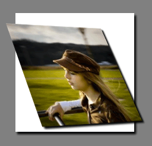
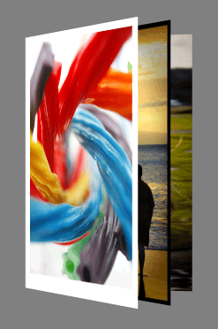
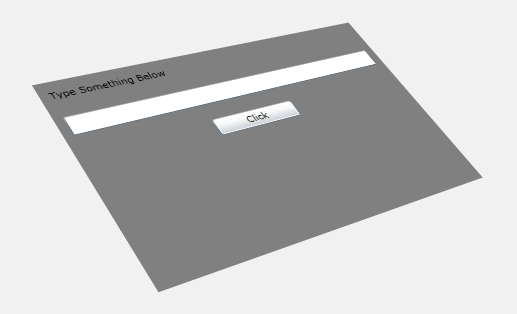
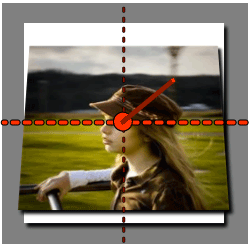
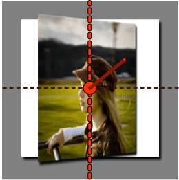
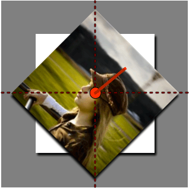
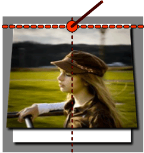
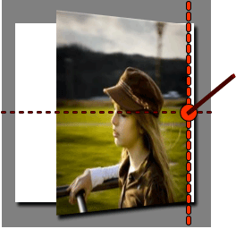

# XAML UI에 대한 3D 원근감 효과

\[ Windows 10의 UWP 앱에 맞게 업데이트되었습니다. Windows 8.x 문서는 [보관](http://go.microsoft.com/fwlink/p/?linkid=619132)을 참조하세요. \]

원근 변형을 사용하여 Windows 런타임 앱의 콘텐츠에 3D 효과를 적용할 수 있습니다. 예를 들어 아래와 같이 개체가 회전하면서 다가오거나 멀어지는 환상 효과를 만들 수 있습니다.



원근 변형을 사용하는 또 다른 방법은 아래와 같이 여러 개체를 서로를 기준으로 정렬하여 3D 효과를 만드는 것입니다.



정적 3D 효과를 만들 수 있을 뿐 아니라 원근 변형 속성에 애니메이션 효과를 적용하여 움직이는 3D 효과를 만들 수도 있습니다. 예를 보려면 [이 샘플을 실행하세요](http://go.microsoft.com/fwlink/p/?linkid=236111).

여기에는 이미지에 적용된 원근 변형만 나왔지만 이러한 효과를 컨트롤을 비롯한 모든 [**UIElement**](https://msdn.microsoft.com/library/windows/apps/BR208911)에 적용할 수도 있습니다. 예를 들어 아래와 같이 컨트롤의 전체 컨테이너에 3D 효과를 적용할 수 있습니다.



다음은 이 샘플을 만드는 데 사용되는 XAML 코드입니다.

```xml
<StackPanel Margin="35" Background="Gray">    
    <StackPanel.Projection>        
        <PlaneProjection RotationX="-35" RotationY="-35" RotationZ="15"  />    
    </StackPanel.Projection>    
    <TextBlock Margin="10">Type Something Below</TextBlock>    
    <TextBox Margin="10"></TextBox>    
    <Button Margin="10" Content="Click" Width="100" />
</StackPanel>
```

여기서는 3D 공간에서 개체를 회전하고 이동하는 데 사용되는 [**PlaneProjection**](https://msdn.microsoft.com/library/windows/apps/BR210192)의 속성에 중점을 둡니다. 다음 샘플을 사용하면 이러한 속성을 시험 삼아 사용해 보고 이러한 속성이 개체에 주는 효과를 확인할 수 있습니다.

[이 샘플 실행](http://go.microsoft.com/fwlink/p/?linkid=236112)

## PlaneProjection 클래스

[
            **PlaneProjection**](https://msdn.microsoft.com/library/windows/apps/BR210192)을 사용하여 UIElement의 [**Projection**](https://msdn.microsoft.com/library/windows/apps/windows.ui.xaml.uielement.projection) 속성을 설정하면 [**UIElement**](https://msdn.microsoft.com/library/windows/apps/BR208911)에 3D 효과를 적용할 수 있습니다. **PlaneProjection**은 변형이 공간에 렌더링되는 방법을 정의합니다. 다음 예에서는 간단한 사례를 보여 줍니다.

```xml
<Image Source="kid.png">
    <Image.Projection>
        <PlaneProjection RotationX="-35"   />
    </Image.Projection>
</Image>
```

이 그림에서는 이미지가 렌더링되는 모습을 보여 줍니다. x-축, y-축 및 z-축은 빨간색 선으로 표시됩니다. 이미지가 [**RotationX**](https://msdn.microsoft.com/library/windows/apps/windows.ui.xaml.media.planeprojection.rotationx) 속성을 사용하여 x-축을 기준으로 뒤로 35도 회전합니다.



[
            **RotationY**](https://msdn.microsoft.com/library/windows/apps/windows.ui.xaml.media.planeprojection.rotationy) 속성은 회전 중심의 y-축을 기준으로 이미지를 회전합니다.

```xml
<Image Source="kid.png">
    <Image.Projection>
        <PlaneProjection RotationY="-35"   />
    </Image.Projection>
</Image>
```



[
            **RotationZ**](https://msdn.microsoft.com/library/windows/apps/windows.ui.xaml.media.planeprojection.rotationz) 속성은 회전 중심의 z-축(개체면에 수직인 선)을 중심으로 이미지를 회전합니다.

```xml
<Image Source="kid.png">
    <Image.Projection>
        <PlaneProjection RotationZ="-45"/>
    </Image.Projection>
</Image>
```



회전 속성은 각 방향으로 회전할 양수 또는 음수 값을 지정할 수 있습니다. 절대 수는 360보다 클 수 있으며, 한 번의 전체 회전보다 큰 개체를 회전합니다. [이 샘플을 실행](http://go.microsoft.com/fwlink/p/?linkid=236112)하여 [**RotationX**](https://msdn.microsoft.com/library/windows/apps/windows.ui.xaml.media.planeprojection.rotationx), [**RotationY**](https://msdn.microsoft.com/library/windows/apps/windows.ui.xaml.media.planeprojection.rotationy) 및 [**RotationZ**](https://msdn.microsoft.com/library/windows/apps/windows.ui.xaml.media.planeprojection.rotationz) 속성에 대한 여러 값으로 효과를 실험할 수 있습니다.

[
            **CenterOfRotationX**](https://msdn.microsoft.com/library/windows/apps/windows.ui.xaml.media.planeprojection.centerofrotationx), [**CenterOfRotationY**](https://msdn.microsoft.com/library/windows/apps/windows.ui.xaml.media.planeprojection.centerofrotationy) 및 [**CenterOfRotationZ**](https://msdn.microsoft.com/library/windows/apps/windows.ui.xaml.media.planeprojection.centerofrotationz) 속성을 사용하여 회전 중심을 이동할 수 있습니다. 기본적으로 회전축은 개체의 중심을 일직선으로 통과하여 개체가 그 중심을 기준으로 회전하도록 합니다. 그러나 회전 중심을 개체의 바깥쪽 가장자리로 이동하면 이 가장자리를 기준으로 개체가 회전합니다. **CenterOfRotationX** 및 **CenterOfRotationY**의 기본값은 0.5이고 **CenterOfRotationZ**의 기본값은 0입니다. **CenterOfRotationX** 및 **CenterOfRotationY**의 경우 0과 1 사이의 값이 개체 내의 특정 위치에 피벗 점을 설정합니다. 값 0은 개체의 한쪽 가장자리를 나타내면 1은 다른 쪽 가장자리를 나타냅니다. 이 범위를 벗어나는 값도 사용할 수 있으며, 그럴 경우 해당 값에 따라 회전 중심이 이동합니다. 회전 중심의 z-축이 개체면을 통과하기 때문에 회전 중심을 음수 값을 사용하여 개체 뒤로 이동하거나 양수 값을 사용하여 개체 앞으로 이동할 수 있습니다.

[
            **CenterOfRotationX**](https://msdn.microsoft.com/library/windows/apps/windows.ui.xaml.media.planeprojection.centerofrotationx)는 개체와 평행인 x-축을 따라 회전 중심을 이동하고 [**CenterOfRotationY**](https://msdn.microsoft.com/library/windows/apps/windows.ui.xaml.media.planeprojection.centerofrotationy)는 개체의 y-축을 따라 회전 중심을 이동합니다. 다음 그림에서는 **CenterOfRotationY**의 다양한 값을 사용하는 방법을 보여 줍니다.

```xml
<Image Source="kid.png">
    <Image.Projection>
        <PlaneProjection RotationX="-35" CenterOfRotationY="0.5" />
    </Image.Projection>
</Image>
```

**CenterOfRotationY = "0.5"(기본값)**


```xml
<Image Source="kid.png">
    <Image.Projection>
        <PlaneProjection RotationX="-35" CenterOfRotationY="0.1"/>
    </Image.Projection>
</Image>
```

**CenterOfRotationY = "0.1"**



[
            **CenterOfRotationY**](https://msdn.microsoft.com/library/windows/apps/windows.ui.xaml.media.planeprojection.centerofrotationy) 속성을 기본값인 0.5로 설정하면 이미지가 중심을 기준으로 회전하고 0.1로 설정하면 위쪽 가장자리 근처에서 회전합니다. [
            **CenterOfRotationX**](https://msdn.microsoft.com/library/windows/apps/windows.ui.xaml.media.planeprojection.centerofrotationx) 속성을 변경하여 [**RotationY**](https://msdn.microsoft.com/library/windows/apps/windows.ui.xaml.media.planeprojection.rotationy) 속성이 개체를 회전하는 위치를 이동해도 이와 비슷하게 동작합니다.

```xml
<Image Source="kid.png">
    <Image.Projection>
        <PlaneProjection RotationY="-35" CenterOfRotationX="0.5" />
    </Image.Projection>
</Image>
```

**CenterOfRotationX = "0.5"(기본값)**


```xml
<Image Source="kid.png">
    <Image.Projection>
        <PlaneProjection RotationY="-35" CenterOfRotationX="0.5" />
    </Image.Projection>
</Image>
```

**CenterOfRotationX = "0.9"(오른쪽 가장자리)**



[
            **CenterOfRotationZ**](https://msdn.microsoft.com/library/windows/apps/windows.ui.xaml.media.planeprojection.centerofrotationz)를 사용하여 회전 중심을 개체면의 위 또는 아래에 놓습니다. 이런 식으로 별의 주위를 선회하는 위성처럼 점을 기준으로 개체를 회전할 수 있습니다.

여러 위치를 회전 중심으로 사용하여 개체를 시험 삼아 회전해 보려면 [이 슬라이더 샘플을 실행하세요](http://go.microsoft.com/fwlink/p/?linkid=236112)

## 개체 위치 지정

지금까지 개체를 공간에서 회전하는 방법에 대해 배웠습니다. 다음 속성을 사용하면 이러한 회전된 개체의 위치를 서로를 기준으로 지정할 수 있습니다.

-   [
            **LocalOffsetX**](https://msdn.microsoft.com/library/windows/apps/windows.ui.xaml.media.planeprojection.localoffsetx)는 회전된 개체면의 x-축을 따라 개체를 이동합니다.
-   [
            **LocalOffsetY**](https://msdn.microsoft.com/library/windows/apps/windows.ui.xaml.media.planeprojection.localoffsety)는 회전된 개체면의 y-축을 따라 개체를 이동합니다.
-   [
            **LocalOffsetZ**](https://msdn.microsoft.com/library/windows/apps/windows.ui.xaml.media.planeprojection.localoffsetz)는 회전된 개체면의 z-축을 따라 개체를 이동합니다.
-   [
            **GlobalOffsetX**](https://msdn.microsoft.com/library/windows/apps/windows.ui.xaml.media.planeprojection.globaloffsetx)는 화면에 정렬된 x-축을 따라 개체를 이동합니다.
-   [
            **GlobalOffsetY**](https://msdn.microsoft.com/library/windows/apps/windows.ui.xaml.media.planeprojection.globaloffsety)는 화면에 정렬된 y-축을 따라 개체를 이동합니다.
-   [
            **GlobalOffsetZ**](https://msdn.microsoft.com/library/windows/apps/windows.ui.xaml.media.planeprojection.globaloffsetz)는 화면에 정렬된 z-축을 따라 개체를 이동합니다.

**로컬 오프셋**

[
            **LocalOffsetX**](https://msdn.microsoft.com/library/windows/apps/windows.ui.xaml.media.planeprojection.localoffsetx), [**LocalOffsetY**](https://msdn.microsoft.com/library/windows/apps/windows.ui.xaml.media.planeprojection.localoffsety) 및 [**LocalOffsetZ**](https://msdn.microsoft.com/library/windows/apps/windows.ui.xaml.media.planeprojection.localoffsetz) 속성은 개체가 회전된 후 개체면의 각 축을 따라 개체를 변환합니다. 따라서 개체의 회전에 따라 개체가 변환되는 방향이 결정됩니다. 이러한 개념을 보여 주기 위해 다음 샘플에서는 **LocalOffsetX**에 0도에서 400도까지 애니메이션 효과를 주고 [**RotationY**](https://msdn.microsoft.com/library/windows/apps/windows.ui.xaml.media.planeprojection.rotationy)에 0도에서 65도까지 애니메이션 효과를 줍니다.

[이 샘플 실행](http://go.microsoft.com/fwlink/p/?linkid=236209)

위의 샘플에서는 개체가 자체 x-축을 따라 이동합니다. 애니메이션이 시작될 때 [**RotationY**](https://msdn.microsoft.com/library/windows/apps/windows.ui.xaml.media.planeprojection.rotationy) 값이 0에 가까우면, 즉 화면과 평행하면 개체가 화면을 따라 x 방향으로 이동합니다. 그러나 개체가 사용자 쪽으로 회전하면 개체가 개체면의 x-축을 따라 사용자 쪽으로 이동합니다. 반면에 **RotationY** 속성에 -65도까지 애니메이션 효과를 준 경우 개체가 곡선을 그리면서 멀어집니다.

[
            **LocalOffsetY**](https://msdn.microsoft.com/library/windows/apps/windows.ui.xaml.media.planeprojection.localoffsety)는 세로 축을 따라 이동한다는 점을 제외하고 [**LocalOffsetX**](https://msdn.microsoft.com/library/windows/apps/windows.ui.xaml.media.planeprojection.localoffsetx)와 유사하게 작동합니다. 따라서 [**RotationX**](https://msdn.microsoft.com/library/windows/apps/windows.ui.xaml.media.planeprojection.rotationx)를 변경하면 **LocalOffsetY**가 개체를 이동하는 방향도 달라집니다. 다음 샘플에서는 **LocalOffsetY**에 0도에서 400도까지 애니메이션 효과를 주고 **RotationX**에 0도에서 65도까지 애니메이션 효과를 줍니다.

[이 샘플 실행](http://go.microsoft.com/fwlink/p/?linkid=236210)

[
            **LocalOffsetZ**](https://msdn.microsoft.com/library/windows/apps/windows.ui.xaml.media.planeprojection.localoffsetz)는 벡터가 개체의 뒤쪽에서 개체의 중심을 일직선으로 통과한 것처럼 개체면에 수직이 되게 개체를 변환합니다. **LocalOffsetZ**의 작동 방식을 보여 주기 위해 다음 샘플에서는 **LocalOffsetZ**에 0도에서 400도까지 애니메이션 효과를 주고 [**RotationX**](https://msdn.microsoft.com/library/windows/apps/windows.ui.xaml.media.planeprojection.rotationx)에 0도에서 65도까지 애니메이션 효과를 줍니다.

[이 샘플 실행](http://go.microsoft.com/fwlink/p/?linkid=236211)

애니메이션이 시작될 때 [**RotationX**](https://msdn.microsoft.com/library/windows/apps/windows.ui.xaml.media.planeprojection.rotationx) 값이 0에 가까우면, 즉 화면과 평행하면 개체가 사용자 쪽으로 똑바로 이동합니다. 그러나 개체가 아래쪽을 향하면 개체가 아래쪽으로 이동합니다.

**글로벌 오프셋**

[
            **GlobalOffsetX**](https://msdn.microsoft.com/library/windows/apps/windows.ui.xaml.media.planeprojection.globaloffsetx), [**GlobalOffsetY**](https://msdn.microsoft.com/library/windows/apps/windows.ui.xaml.media.planeprojection.globaloffsety) 및 [**GlobalOffsetZ**](https://msdn.microsoft.com/library/windows/apps/windows.ui.xaml.media.planeprojection.globaloffsetz) 속성은 화면을 기준으로 한 축을 따라 개체를 변환합니다. 즉, 로컬 오프셋 속성과 달리 개체가 따라 이동하는 축이 개체에 적용된 회전과 별개입니다. 이러한 속성은 개체에 적용된 회전에 상관없이 단순히 개체를 화면의 x-축, y-축 또는 z-축을 따라 이동하려는 경우에 유용합니다.

다음 샘플에서는 [**GlobalOffsetX**](https://msdn.microsoft.com/library/windows/apps/windows.ui.xaml.media.planeprojection.globaloffsetx)에 0도에서 400도까지 애니메이션 효과를 주고 [**RotationY**](https://msdn.microsoft.com/library/windows/apps/windows.ui.xaml.media.planeprojection.rotationy)에 0도에서 65도까지 애니메이션 효과를 줍니다.

[이 샘플 실행](http://go.microsoft.com/fwlink/p/?linkid=236213)

이 샘플에서는 개체가 회전할 때 개체의 경로가 변경되지 않습니다. 이는 개체가 회전과 상관없이 화면의 x-축을 따라 이동하기 때문입니다.

## 개체 위치 지정

[
            **Matrix3DProjection**](https://msdn.microsoft.com/library/windows/apps/BR210128) 및 [**Matrix3D**](https://msdn.microsoft.com/library/windows/apps/BR243266) 유형을 사용하면 [**PlaneProjection**](https://msdn.microsoft.com/library/windows/apps/BR210192)을 사용할 때보다 더 복잡한 반3D 시나리오를 구현할 수 있습니다.. **Matrix3DProjection**은 임의의 모델 변형 매트릭스 및 원근 매트릭스를 요소에 적용할 수 있는 전체 3D 변환 매트릭스를 제공합니다. 이것은 모든 [**UIElement**](https://msdn.microsoft.com/library/windows/apps/BR208911)에 적용할 수 있습니다. 이러한 API는 최소한의 코드로 구성된 것이므로 이러한 API를 사용하려면 3D 변형 매트릭스를 제대로 만드는 코드를 작성해야 합니다. 따라서 간단한 3D 시나리오에는 **PlaneProjection**을 사용하는 것이 더 쉽습니다. Because of this, it is easier to use <bpt id="p1">**</bpt>PlaneProjection<ept id="p1">**</ept> for simple 3D scenarios.


<!--HONumber=May16_HO2-->


