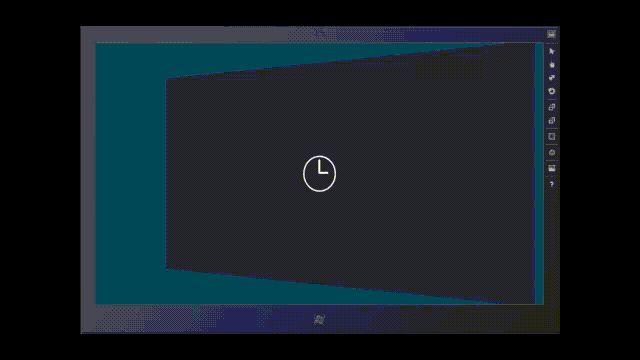

# 애니메이션 개요

\[ Windows 10의 UWP 앱에 맞게 업데이트되었습니다. Windows 8.x 문서는 [보관](http://go.microsoft.com/fwlink/p/?linkid=619132)을 참조하세요. \]


Windows 런타임의 애니메이션은 움직임과 대화형 작업을 추가하여 앱을 향상시킬 수 있습니다. Windows 런타임 애니메이션 라이브러리의 애니메이션을 사용하면 Windows 모양과 느낌을 앱에 통합할 수 있습니다. 이 항목에서는 애니메이션 및 각 애니메이션이 사용되는 일반적인 시나리오의 예를 간략하게 소개합니다.

**팁** XAML용 Windows 런타임 컨트롤에는 일부 유형의 애니메이션이 애니메이션 라이브러리에서 가져온 기본 제공 동작으로 포함되어 있습니다. 앱에서 이러한 컨트롤을 사용하면 직접 프로그래밍하지 않고도 애니메이션 효과를 준 모양과 느낌을 얻을 수 있습니다.

Windows 런타임 애니메이션 라이브러리의 애니메이션을 사용할 경우 다음과 같은 이점이 있습니다.

-   [애니메이션에 대한 지침](https://msdn.microsoft.com/library/windows/apps/Dn611854)에 따르는 동작
-   UI 상태를 빠르고 유연하게 전환하여 사용자에게 혼동을 주지 않고 정보를 알려 줍니다.
-   앱 내에서 사용자에게 전환을 나타내는 시각적 동작을 제공합니다.

예를 들어 사용자가 목록에 항목을 추가할 경우 새 항목을 목록에 바로 표시하는 대신 새 항목 위치에 애니메이션 효과를 주고, 목록의 다른 항목은 짧은 기간 동안 새 위치에 애니메이션 효과를 주어 추가된 항목을 위한 공간을 확보합니다. 이때 전환 동작은 컨트롤 조작이 사용자에게 보다 명확하게 나타나도록 합니다.

애니메이션 라이브러리는 모든 가능 시나리오에 대해 애니메이션 효과를 제공하지는 않습니다. XAML에서 사용자 지정 애니메이션을 만들고자 하는 경우가 있을 수 있습니다. 자세한 내용은 [스토리보드 애니메이션](storyboarded-animations.md)을 참조하세요.

## 애니메이션 유형

Windows 런타임 애니메이션 시스템 및 애니메이션 라이브러리는 컨트롤 및 UI의 다른 부분에 애니메이션 동작을 적용하는 더 큰 목적으로 사용할 수 있습니다. 애니메이션 유형에는 여러 가지가 있습니다.

-   *테마 전환*은 미리 정의된 Windows 런타임 XAML UI 유형의 컨트롤 또는 요소를 포함하여 UI에서 일부 조건이 변경될 경우 자동으로 적용됩니다. 이러한 애니메이션은 Windows 모양과 느낌을 지원하고 모든 앱이 조작 모드 변경 시 특정 UI 시나리오에 대해 수행하는 작업을 정의하므로 *테마 전환*이라고 합니다. 테마 전환은 애니메이션 라이브러리의 일부입니다.
-   *테마 애니메이션*은 미리 정의된 Windows 런타임 XAML UI 유형의 하나 이상의 속성에 대한 애니메이션입니다. 테마 애니메이션은 하나의 특정 요소를 대상으로 하고 컨트롤 내에서 특정 시각적 상태로 존재하는 반면, 테마 전환은 시각적 상태 외부에 있는 컨트롤의 속성에 할당되고 해당 상태 간 전환에 영향을 주므로 테마 애니메이션은 테마 전환과 다릅니다. 많은 Windows 런타임 XAML 컨트롤은 애니메이션이 시각적 상태에 따라 트리거되는, 컨트롤 템플릿의 일부인 스토리보드 내에 테마 애니메이션을 포함합니다. 템플릿을 수정하지 않는 한 해당 기본 제공 테마 애니메이션을 UI의 컨트롤에 사용할 수 있습니다. 그러나 템플릿을 대체하는 경우 기본 제공 컨트롤 테마 애니메이션도 제거됩니다. 해당 애니메이션을 복구하려면 컨트롤의 시각적 상태 집합 내에서 테마 애니메이션을 포함하는 스토리보드를 정의해야 합니다. 또한 시각적 상태 내에 없는 스토리보드에서 테마 애니메이션을 실행하고 [**Begin**](https://msdn.microsoft.com/library/windows/apps/BR210491) 메서드를 사용하여 시작할 수도 있지만 일반적이지 않습니다. 테마 애니메이션은 애니메이션 라이브러리의 일부입니다.
-   *시각적 전환*은 컨트롤이 정의된 시각적 상태 중 하나에서 다른 상태로 전환될 때 적용됩니다. 이러한 애니메이션은 직접 작성하는 사용자 지정 애니메이션으로, 일반적으로 컨트롤에 대해 작성한 사용자 지정 템플릿 및 해당 템플릿 내의 시각적 상태 정의와 연결되어 있습니다. 이 애니메이션은 상태 사이의 시간 동안에만 실행되며 이 시간은 일반적으로 최대 몇 초에 지나지 않을 정도로 짧습니다. 자세한 내용은 [시각적 상태에 대한 스토리보드 애니메이션의 "VisualTransition" 섹션](https://msdn.microsoft.com/library/windows/apps/xaml/JJ819808#VisualTransition)을 참조하세요.
-   *스토리보드 애니메이션*은 특히 앱 코드 또는 포함한 컨트롤 등의 구성 요소와 함께 제공된 코드로 시작될 때 적용됩니다. 스토리보드 애니메이션은 시간에 따라 Windows 런타임 종속성 속성의 값을 변경할 수 있습니다. 스토리보드 애니메이션은 UI 시나리오로 제한되지 않으며, 실제로 해당 용어에 익숙한 경우 이 애니메이션을 상태 시스템 기술로 간주하는 것이 유용할 수 있습니다. 스토리보드 애니메이션은 시각적 상태 사이의 전환 시간으로 제한되지 않으며 컨트롤 상태 변경에 관계없이 언제든지 실행될 수 있고 연속적으로 실행할 수도 있습니다. 자세한 내용은 [스토리보드 애니메이션](storyboarded-animations.md)을 참조하세요. 종속성 속성 및 이 속성이 있는 위치에 대한 자세한 내용은 [종속성 속성 개요](https://msdn.microsoft.com/library/windows/apps/Mt185583)를 참조하세요.

## 라이브러리에서 사용 가능한 애니메이션

애니메이션 라이브러리에는 다음 애니메이션이 제공됩니다. 애니메이션의 주 사용 시나리오, 정의 방법에 대해 자세히 알아보고 애니메이션 예제를 보려면 애니메이션의 이름을 클릭하세요.

-   [콘텐츠 및 시작 전환](./animations-overview.md#content-transition-and-entrance-transition): 보기의 안이나 밖으로 하나의 콘텐츠 또는 콘텐츠 집합에 애니메이션 효과를 줍니다.
-   [페이드 인/페이드 아웃 및 크로스페이드](./animations-overview.md#fade-in-out-and-crossfade): 임시 요소 또는 컨트롤을 표시하거나 콘텐츠 영역을 새로 고칩니다.
-   [포인터 위로/아래로](./animations-overview.md#pointer-up-down): 타일 탭 또는 클릭에 대한 시각적 피드백을 제공합니다.
-   [위치 변경](./animations-overview.md#reposition): 요소를 새 위치로 이동합니다.
-   [팝업 표시/숨기기](./animations-overview.md#show-hide-popup): 보기의 맨 위에 컨텍스트 UI를 표시합니다.
-   [가장자리 UI 표시/숨기기](./animations-overview.md#show-hide-edge-ui): 패널과 같은 큰 UI를 포함하여 가장자리 기반 UI를 보기의 안이나 밖으로 밉니다.
-   [목록 항목 변경](./animations-overview.md#list-item-changes): 목록에서 항목을 추가 또는 삭제하거나 항목의 순서를 변경합니다.
-   [끌기/놓기](./animations-overview.md#drag-drop): 끌어서 놓기 작업 중 시각적 피드백을 제공합니다.
-   [살짝 밀기 제스처](./animations-overview.md#swipe-gestures): 타일이 살짝 밀기 조작을 지원한다는 힌트를 주거나 살짝 밀기가 선택된 상태를 나타냅니다.

### 콘텐츠 전환 및 시작 전환

콘텐츠 전환 애니메이션([**ContentThemeTransition**](https://msdn.microsoft.com/library/windows/apps/BR243103))은 하나의 콘텐츠 또는 콘텐츠 집합을 현재 보기의 안이나 밖으로 이동하는 데 사용합니다. 예를 들어 콘텐츠 전환 애니메이션은 처음 페이지가 로드되었을 때나 페이지에서 한 섹션의 콘텐츠가 변경될 때 표시할 준비가 되지 않은 콘텐츠를 표시합니다.

XAML 애니메이션 라이브러리에는 페이지가 로드될 때 전체 페이지에 적용되는 애니메이션 개념은 없지만, 콘텐츠를 포함하는 페이지가 처음 로드되고 콘텐츠의 해당 부분이 렌더링될 때 콘텐츠에 적용할 수 있는 별도의 전환([**EntranceThemeTransition**](https://msdn.microsoft.com/library/windows/apps/BR210288))은 있습니다. 따라서 처음 표시되는 콘텐츠는 콘텐츠가 변경된 경우와 다른 피드백을 제공할 수 있습니다.

### 페이드 인/페이드 아웃 및 크로스페이드

페이드 인/페이드 아웃 애니메이션은 임시 UI 또는 컨트롤을 표시하거나 숨기는 데 사용합니다. XAML에서 이러한 애니메이션은 [**FadeInThemeAnimation**](https://msdn.microsoft.com/library/windows/apps/BR210298) 및 [**FadeOutThemeAnimation**](https://msdn.microsoft.com/library/windows/apps/BR210302)으로 표현됩니다. 하나의 예는 사용자 조작으로 새 컨트롤이 표시될 수 있는 앱 바에 있습니다. 또 다른 예는 일정 시간 동안 사용자 입력이 감지되지 않을 경우 흐려지는 이동 표시기 또는 임시 스크롤 막대입니다. 또한 콘텐츠가 동적으로 로드되어 앱이 자리 표시자 항목에서 최종 항목으로 전환할 때도 페이드 인 애니메이션을 사용해야 합니다.

크로스페이드 애니메이션은 항목의 상태가 변경될 때, 예를 들면 앱이 현재 보기의 콘텐츠를 새로 고칠 때 전환을 부드럽게 하기 위해 사용합니다. XAML 애니메이션 라이브러리는 전용 크로스페이드 애니메이션([**crossFade**](https://msdn.microsoft.com/library/windows/apps/BR212661)과 동일한 애니메이션 없음)을 제공하지 않지만 타이밍이 겹친 [**FadeInThemeAnimation**](https://msdn.microsoft.com/library/windows/apps/BR210298) 및 [**FadeOutThemeAnimation**](https://msdn.microsoft.com/library/windows/apps/BR210302)을 사용하여 동일한 결과를 얻을 수 있습니다.

### 포인터 위로/아래로

[
            **PointerUpThemeAnimation**](https://msdn.microsoft.com/library/windows/apps/Hh969168) 및 [**PointerDownThemeAnimation**](https://msdn.microsoft.com/library/windows/apps/Hh969164) 애니메이션은 성공한 타일 탭 또는 클릭에 대한 사용자 피드백을 제공하는 데 사용합니다. 예를 들어 사용자가 타일의 아래쪽을 클릭하거나 탭하면 포인터 아래로 애니메이션이 재생됩니다. 클릭 또는 탭이 해제되면 포인터 위로 애니메이션이 재생됩니다.

### 위치 변경

위치 변경 애니메이션([**RepositionThemeAnimation**](https://msdn.microsoft.com/library/windows/apps/BR210421) 또는 [**RepositionThemeTransition**](https://msdn.microsoft.com/library/windows/apps/BR210429))은 요소를 새 위치로 이동하는 데 사용합니다. 예를 들어 헤더 항목 컨트롤에서 헤더를 이동할 때 위치 변경 애니메이션이 사용됩니다.

### 팝업 표시/숨기기

[
            **PopInThemeAnimation**](https://msdn.microsoft.com/library/windows/apps/BR210383) 및 [**PopOutThemeAnimation**](https://msdn.microsoft.com/library/windows/apps/BR210391)은 현재 보기의 맨 위에 [**Popup**](https://msdn.microsoft.com/library/windows/apps/BR227842)이나 유사한 컨텍스트 UI를 표시하거나 숨기는 데 사용합니다. [
            **PopupThemeTransition**](https://msdn.microsoft.com/library/windows/apps/Hh969172)은 팝업을 빨리 해제하려는 경우에 유용한 피드백인 테마 전환입니다.

### 가장자리 UI 표시/숨기기

[
            **EdgeUIThemeTransition**](https://msdn.microsoft.com/library/windows/apps/Hh702324) 애니메이션은 가장자리 기반의 작은 UI를 보기의 안이나 밖으로 미는 데 사용합니다. 예를 들어 화면의 맨 위 또는 맨 아래에 사용자 지정 앱 바를 표시하거나 화면의 맨 위에 오류 및 경고에 대한 UI 화면을 표시할 때 이러한 애니메이션을 사용합니다.

[
            **PaneThemeTransition**](https://msdn.microsoft.com/library/windows/apps/Hh969160) 애니메이션은 창이나 패널을 표시하거나 숨기는 데 사용합니다. 이 애니메이션은 사용자 지정 키보드나 작업 창과 같이 가장자리 기반의 큰 UI에 적합합니다.

### 목록 항목 변경

[
            **AddDeleteThemeTransition**](https://msdn.microsoft.com/library/windows/apps/BR243047) 애니메이션은 기존 목록에서 항목을 추가하거나 삭제할 때 애니메이션 동작을 추가하는 데 사용합니다. 추가의 경우 전환은 먼저 목록에서 기존 항목의 위치를 변경하여 새 항목을 위한 공간을 확보한 다음 새 항목을 추가합니다. 삭제의 경우 전환은 목록에서 항목을 제거하고, 필요한 경우 삭제한 항목이 제거된 다음 나머지 목록 항목의 위치를 변경합니다.

목록에서 항목의 위치가 변경되는 경우 별도의 [**ReorderThemeTransition**](https://msdn.microsoft.com/library/windows/apps/BR210409)을 적용할 수도 있습니다. 이 전환은 관련된 삭제/추가 애니메이션을 사용하여 항목을 삭제하고 새 위치에 추가하는 경우와 다르게 애니메이션됩니다.

### 끌기/놓기

끌기 애니메이션([**DragItemThemeAnimation**](https://msdn.microsoft.com/library/windows/apps/BR243173), [**DragOverThemeAnimation**](https://msdn.microsoft.com/library/windows/apps/BR243177))과 놓기 애니메이션([**DropTargetItemThemeAnimation**](https://msdn.microsoft.com/library/windows/apps/BR243185))은 사용자가 항목을 끌거나 놓을 때 시각적 피드백을 제공하는 데 사용합니다.

활성화된 애니메이션은 사용자에게 놓은 항목 주위로 목록을 다시 정렬할 수 있음을 보여줍니다. 이는 항목을 현재 위치에 놓을 경우 목록의 어느 곳에 배치될지 사용자가 아는 데 도움이 됩니다. 이 애니메이션은 끌고 있는 항목을 목록의 다른 두 항목 사이에 놓을 수 있고 해당 두 항목이 사라지게 됨을 시각적 피드백으로 제공합니다.

### 살짝 밀기 제스처

[
            **SwipeHintThemeAnimation**](https://msdn.microsoft.com/library/windows/apps/Hh702489) 애니메이션은 타일이 살짝 밀기 조작을 지원함을 표시하는 데 사용합니다. 사용자는 아래쪽으로 살짝 밀어 타일을 선택할 수 있습니다. 사용자가 타일을 살짝 밀 수 있다는 것을 모르는 상태로 타일에 대해 길게 누르기 제스처를 취할 경우 살짝 밀기 힌트 애니메이션이 재생되어 사용자가 살짝 밀기를 통해 타일을 조작해야 한다는 것을 알려 줍니다.

[
            **SwipeBackThemeAnimation**](https://msdn.microsoft.com/library/windows/apps/Hh702477) 애니메이션은 타일이 선택되었음으로 표시하고 타일을 나머지 위치로 되돌려 놓는 데 사용합니다.

## 사용자 지정 컨트롤에 애니메이션 사용

다음 표에는 이러한 Windows 런타임 컨트롤의 사용자 지정 버전을 만들 때 사용해야 하는 애니메이션에 대한 권장 사항이 요약되어 있습니다.

| UI 유형 | 권장 애니메이션 |
|---------|-----------------------|
| 대화 상자 | [
            **FadeInThemeAnimation**](https://msdn.microsoft.com/library/windows/apps/BR210298) 및 [**FadeOutThemeAnimation**](https://msdn.microsoft.com/library/windows/apps/BR210302) |
| 플라이아웃 | [
            **PopInThemeAnimation**](https://msdn.microsoft.com/en-us/library/windows/apps/windows.ui.xaml.media.animation.popinthemeanimation.popinthemeanimation.aspx) 및 [**PopOutThemeAnimation**](https://msdn.microsoft.com/library/windows/apps/windows.ui.xaml.media.animation.popoutthemeanimation.popoutthemeanimation) |
| 도구 설명 | [
            **FadeInThemeAnimation**](https://msdn.microsoft.com/library/windows/apps/BR210298) 및 [**FadeOutThemeAnimation**](https://msdn.microsoft.com/library/windows/apps/BR210302) |
| 상황에 맞는 메뉴 | [
            **PopInThemeAnimation**](https://msdn.microsoft.com/en-us/library/windows/apps/windows.ui.xaml.media.animation.popinthemeanimation.popinthemeanimation.aspx) 및 [**PopOutThemeAnimation**](https://msdn.microsoft.com/library/windows/apps/windows.ui.xaml.media.animation.popoutthemeanimation.popoutthemeanimation) |
| 명령 모음 | [**EdgeUIThemeTransition**](https://msdn.microsoft.com/library/windows/apps/windows.ui.xaml.media.animation.edgeuithemetransition.edgeuithemetransition) |
| 작업 창 또는 가장자리 기반 패널 | [**PaneThemeTransition**](https://msdn.microsoft.com/library/windows/apps/windows.ui.xaml.media.animation.panethemetransition.panethemetransition) |
| 모든 UI 컨테이너의 콘텐츠 | [**ContentThemeTransition**](https://msdn.microsoft.com/library/windows/apps/windows.ui.xaml.media.animation.contentthemetransition.contentthemetransition) |
| 컨트롤 대상 또는 다른 어떤 애니메이션도 적용되지 않는 경우 | [
            **FadeInThemeAnimation**](https://msdn.microsoft.com/en-us/library/windows/apps/windows.ui.xaml.media.animation.fadeinthemeanimation.fadeinthemeanimation.aspx) 및 [**FadeOutThemeAnimation**](https://msdn.microsoft.com/library/windows/apps/BR210302) |

 

## 전환 애니메이션 예

앱에서 애니메이션을 사용하여 사용자 인터페이스를 향상시키거나 사용자에게 불편을 주지 않으면서 더 멋진 모습으로 만들 수 있습니다. 그 방법 중 하나는 UI에 애니메이션 전환을 적용하는 것입니다. 그러면 뭔가가 화면에 들어오거나 나갈 때 또는 다른 변화가 있을 때 애니메이션을 이용하여 그 변화에 사용자의 관심을 끌 수 있습니다. 예를 들어 단추가 단순히 표시되거나 사라지기보다는 빠른 속도로 페이드 인하거나 페이드 아웃할 수 있습니다. 일관된 권장 또는 일반 애니메이션 전환을 만드는 데 사용할 수 있도록 다양한 API가 마련되었습니다. 다음 예제는 단추에 애니메이션을 적용하여 빠른 속도로 미끄러지듯 나타나게 하는 방법을 보여 줍니다.

```xml
<Button Content="Transitioning Button">
     <Button.Transitions>
         <TransitionCollection> 
             <EntranceThemeTransition/>
         </TransitionCollection>
     </Button.Transitions>
 </Button>
 ```

이 코드에서 단추의 전환 컬렉션에 [**EntranceThemeTransition**](https://msdn.microsoft.com/library/windows/apps/BR210288) 개체를 추가합니다. 이제 단추가 처음으로 렌더링될 때 단순히 나타나기보다는 빠른 속도로 미끄러지듯 화면에 들어옵니다. 애니메이션 개체의 몇 가지 속성을 설정하여 미끄러지는 거리와 방향을 조정할 수 있습니다. 그러나 사실 이는 특정 시나리오를 위한, 즉 눈길을 끄는 입장을 연출하는 단순한 API입니다.

또한 앱의 스타일 리소스에서 전환 애니메이션 테마를 정의하여 동일하게 효과를 적용할 수 있습니다. 이 예제는 [**Style**](https://msdn.microsoft.com/library/windows/apps/BR208849)을 사용하여 적용한다는 점을 제외하고 이전의 예제와 동일합니다.

```xml
<UserControl.Resources>
     <Style x:Key="DefaultButtonStyle" TargetType="Button">
         <Setter Property="Transitions">
             <Setter.Value>
                 <TransitionCollection>
                     <EntranceThemeTransition/>
                 </TransitionCollection>
             </Setter.Value>
        </Setter>
    </Style>
</UserControl.Resources>
      
<StackPanel x:Name="LayoutRoot">
    <Button Style="{StaticResource DefaultButtonStyle}" Content="Transitioning Button"/>
</StackPanel>
```

이전의 예제는 개별 컨트롤에 테마 전환을 적용합니다. 그러나 테마 전환은 개체의 컨테이너에 적용할 경우 훨씬 더 흥미로워집니다. 이 작업을 하면 컨테이너의 모든 하위 개체가 전환에 참여합니다. 다음 예제에서는 직사각형의 [**Grid**](https://msdn.microsoft.com/library/windows/apps/BR242704)에 [**EntranceThemeTransition**](https://msdn.microsoft.com/library/windows/apps/BR210288)을 적용합니다.

```xml
<!-- If you set an EntranceThemeTransition animation on a panel, the
     children of the panel will automatically offset when they animate
     into view to create a visually appealing entrance. -->        
<ItemsControl Grid.Row="1" x:Name="rectangleItems">
    <ItemsControl.ItemContainerTransitions>
        <TransitionCollection>
            <EntranceThemeTransition/>
        </TransitionCollection>
    </ItemsControl.ItemContainerTransitions>
    <ItemsControl.ItemsPanel>
        <ItemsPanelTemplate>
            <WrapGrid Height="400"/>
        </ItemsPanelTemplate>
    </ItemsControl.ItemsPanel>
            
    <!-- The sequence children appear depends on their order in 
         the panel's children, not necessarily on where they render
         on the screen. Be sure to arrange your child elements in
         the order you want them to transition into view. -->
    <ItemsControl.Items>
        <Rectangle Fill="Red" Width="100" Height="100" Margin="10"/>
        <Rectangle Fill="Red" Width="100" Height="100" Margin="10"/>
        <Rectangle Fill="Red" Width="100" Height="100" Margin="10"/>
        <Rectangle Fill="Red" Width="100" Height="100" Margin="10"/>
        <Rectangle Fill="Red" Width="100" Height="100" Margin="10"/>
        <Rectangle Fill="Red" Width="100" Height="100" Margin="10"/>
        <Rectangle Fill="Red" Width="100" Height="100" Margin="10"/>
        <Rectangle Fill="Red" Width="100" Height="100" Margin="10"/>
        <Rectangle Fill="Red" Width="100" Height="100" Margin="10"/>
    </ItemsControl.Items>
</ItemsControl>
```

[
            **Grid**](https://msdn.microsoft.com/library/windows/apps/BR242704)의 하위 직사각형이 차례로 화면으로 전환되는데, 직사각형 각각에 이 애니메이션을 적용하여 한꺼번에 전환되는 것보다 큰 시각적인 즐거움을 선사합니다.

다음은 이 애니메이션을 보여 주는 동영상입니다.



<iframe src="https://videoplayercdn.osi.office.net/embed/bb48c68b-c15d-44e4-86e5-8a8065da7a2e?autoplay=true&mkt=en-us&csid=IA-en-us" width="640" height="360" allowFullScreen="true" frameBorder="0" scrolling="no" ></iframe>

컨테이너의 하위 개체 중 하나 이상의 위치가 바뀔 경우에도 이 하위 개체들은 재배치될 수 있습니다. 다음 예제에서는 직사각형의 그리드에 [**RepositionThemeTransition**](https://msdn.microsoft.com/library/windows/apps/BR210429)을 적용합니다. 직사각형 중 하나를 제거하면 나머지 직사각형들은 새로운 위치로 재배치됩니다.

```xml
<Button Content="Remove Rectangle" Click="RemoveButton_Click"/>
        
<ItemsControl Grid.Row="1" x:Name="rectangleItems">
    <ItemsControl.ItemContainerTransitions>
        <TransitionCollection>
                    
            <!-- Without this, there would be no animation when items 
                 are removed. -->
            <RepositionThemeTransition/>
        </TransitionCollection>
    </ItemsControl.ItemContainerTransitions>
    <ItemsControl.ItemsPanel>
        <ItemsPanelTemplate>
            <WrapGrid Height="400"/>
        </ItemsPanelTemplate>
    </ItemsControl.ItemsPanel>
            
    <!-- All these rectangles are just to demonstrate how the items
         in the grid re-flow into position when one of the child items
         are removed. -->
    <ItemsControl.Items>
        <Rectangle Fill="Red" Width="100" Height="100" Margin="10"/>
        <Rectangle Fill="Red" Width="100" Height="100" Margin="10"/>
        <Rectangle Fill="Red" Width="100" Height="100" Margin="10"/>
        <Rectangle Fill="Red" Width="100" Height="100" Margin="10"/>
        <Rectangle Fill="Red" Width="100" Height="100" Margin="10"/>
        <Rectangle Fill="Red" Width="100" Height="100" Margin="10"/>
        <Rectangle Fill="Red" Width="100" Height="100" Margin="10"/>
        <Rectangle Fill="Red" Width="100" Height="100" Margin="10"/>
        <Rectangle Fill="Red" Width="100" Height="100" Margin="10"/>
    </ItemsControl.Items>
</ItemsControl>
```

```cs
private void RemoveButton_Click(object sender, RoutedEventArgs e)
{
    if (rectangleItems.Items.Count > 0)
    {    
        rectangleItems.Items.RemoveAt(0);
    }                         
}
```

```cpp
// .h
private:
void RemoveButton_Click(Platform::Object^ sender, Windows::UI::Xaml::RoutedEventArgs^ e);

//.cpp
void BlankPage::RemoveButton_Click(Platform::Object^ sender, Windows::UI::Xaml::RoutedEventArgs^ e)
{
    if (rectangleItems->Items->Size > 0)
    {    
        rectangleItems->Items->RemoveAt(0);
    }
}
```

이 동영상에서는 제거할 직사각형에 대해 실행되는 애니메이션을 보여 줍니다.

하나의 개체 또는 개체 컨테이너에 여러 전환 애니메이션을 적용할 수 있습니다. 예를 들어 직사각형의 목록이 애니메이션 형태로 화면에 나타나게 하고 이들의 위치가 변경될 때도 애니메이션하려는 경우 다음과 같이 [**RepositionThemeTransition**](https://msdn.microsoft.com/library/windows/apps/BR210429) 및 [**EntranceThemeTransition**](https://msdn.microsoft.com/library/windows/apps/BR210288)을 적용할 수 있습니다.

```xml
...
<ItemsControl.ItemContainerTransitions>
    <TransitionCollection>
        <EntranceThemeTransition/>                    
        <RepositionThemeTransition/>
    </TransitionCollection>
</ItemsControl.ItemContainerTransitions>
...      
```

UI 요소를 추가하거나, 제거하거나, UI 요소의 순서를 다시 매기는 등의 작업을 수행할 때 UI 요소에 대한 애니메이션을 만들기 위한 몇 가지 전환 효과가 있습니다. 이러한 API의 이름에는 모두 "ThemeTransition"이 포함되어 있습니다.

| API | 설명 |
|-----|-------------|
| [**AddDeleteThemeTransition**](https://msdn.microsoft.com/library/windows/apps/BR243047) | 컨트롤에서 하위 개체나 콘텐츠를 추가하거나 삭제할 때 애니메이션 전환 동작을 제공합니다. 일반적으로 컨트롤은 항목 컨테이너입니다. |
| [**ContentThemeTransition**](https://msdn.microsoft.com/library/windows/apps/BR243103) | 컨트롤의 콘텐츠가 바뀔 때 애니메이션 전환 동작을 제공합니다. [
            **AddDeleteThemeTransition**](https://msdn.microsoft.com/library/windows/apps/BR243047)에 추가하여 이 API를 적용할 수 있습니다. |
| [**EdgeUIThemeTransition**](https://msdn.microsoft.com/library/windows/apps/Hh702324) | 작은 가장자리 UI 전환에 애니메이션 전환 동작을 제공합니다. |
| [**EntranceThemeTransition**](https://msdn.microsoft.com/library/windows/apps/BR210288) | 컨트롤이 처음으로 나타날 때 애니메이션 전환 동작을 제공합니다. |
| [**PaneThemeTransition**](https://msdn.microsoft.com/library/windows/apps/Hh969160) | 패널(큰 가장자리 UI) UI 전환에 애니메이션 전환 동작을 제공합니다. |
| [**PopupThemeTransition**](https://msdn.microsoft.com/library/windows/apps/Hh969172) | 컨트롤의 팝 인 구성 요소(예: 개체의 도구 설명 같은 UI)가 나타날 때 적용되는 애니메이션 전환 동작을 제공합니다. |
| [**ReorderThemeTransition**](https://msdn.microsoft.com/library/windows/apps/BR210409) | 목록 보기 컨트롤 항목의 순서가 바뀔 때 애니메이션 전환 동작을 제공합니다. 일반적으로 이는 끌어서 놓기 동작의 결과로 일어납니다. 여러 컨트롤과 테마가 애니메이션에 다양한 특성을 부여할 수 있습니다. |
| [**RepositionThemeTransition**](https://msdn.microsoft.com/library/windows/apps/BR210429) | 컨트롤의 위치가 바뀔 때 애니메이션 전환 동작을 제공합니다. |

 

## 테마 애니메이션 예

전환 애니메이션은 간단하게 적용할 수 있습니다. 그러나 애니메이션 효과의 타이밍 및 순서를 추가로 제어하는 것이 필요한 경우도 있습니다. 애니메이션의 동작에 대해 일관성 있는 테마를 사용하면서 테마 애니메이션을 사용하여 추가적인 제어가 가능합니다. 또한 테마 애니메이션에는 사용자 지정 애니메이션보다 태그가 덜 필요합니다. 여기서는 [**FadeOutThemeAnimation**](https://msdn.microsoft.com/library/windows/apps/BR210302)을 사용하여 직사각형이 화면에서 페이드 아웃하게 합니다.

```xml
<StackPanel>    
    <StackPanel.Resources>
        <Storyboard x:Name="myStoryboard">
            <FadeOutThemeAnimation TargetName="myRectangle" />
        </Storyboard>
    </StackPanel.Resources>
    <Rectangle PointerPressed="Rectangle_Tapped" x:Name="myRectangle"  
              Fill="Blue" Width="200" Height="300"/>
</StackPanel>
```

```cs
// When the user taps the rectangle, the animation begins.
private void Rectangle_Tapped(object sender, PointerRoutedEventArgs e)
{
    myStoryboard.Begin();
}
```

```vb
' When the user taps the rectangle, the animation begins.
Private Sub Rectangle_Tapped(sender As Object, e As PointerRoutedEventArgs)
    myStoryboard.Begin()
End Sub
```

```cpp
//.h
void Rectangle_Tapped(Platform::Object^ sender, Windows::UI::Xaml::Input::PointerRoutedEventArgs^ e);

//.cpp
void BlankPage::Rectangle_Tapped(Object^ sender, PointerRoutedEventArgs^ e)
{
    myStoryboard->Begin();
}
```

전환 애니메이션과 달리, 테마 애니메이션에는 자동으로 실행되는 기본 제공 트리거(전환)가 없습니다. XAML에서 정의할 때 테마 애니메이션을 포함하려면 [**Storyboard**](https://msdn.microsoft.com/library/windows/apps/BR210490)를 사용해야 합니다. 애니메이션의 기본 동작을 변경할 수도 있습니다. 예를 들어 [**FadeOutThemeAnimation**](https://msdn.microsoft.com/library/windows/apps/BR210302)에서 [**Duration**](https://msdn.microsoft.com/library/windows/apps/BR243207) 시간 값을 늘려 페이드 아웃의 속도를 늦출 수 있습니다.

**참고** 기본 애니메이션 기술을 보여 주기 위해 앱 코드를 사용해 [**Storyboard**](https://msdn.microsoft.com/library/windows/apps/BR210490)의 메서드를 호출하여 애니메이션을 시작합니다. [
            **Begin**](https://msdn.microsoft.com/library/windows/apps/BR210491), [**Stop**](https://msdn.microsoft.com/library/windows/apps/windows.ui.xaml.media.animation.storyboard.stop), [**Pause**](https://msdn.microsoft.com/en-us/library/windows/apps/windows.ui.xaml.media.animation.storyboard.pause.aspx), [**Resume**](https://msdn.microsoft.com/en-us/library/windows/apps/windows.ui.xaml.media.animation.storyboard.resume.aspx)**Storyboard** 메서드를 사용하여 **Storyboard** 애니메이션이 실행되는 방법을 제어할 수 있습니다. 그러나 일반적으로 앱에 라이브러리 애니메이션을 포함하는 방법은 아닙니다. 대신 컨트롤 또는 요소에 적용된 XAML 스타일 및 템플릿에 라이브러리 애니메이션을 통합합니다. 템플릿 및 시각적 상태에 대해 알아보는 과정은 약간 더 복잡합니다. 그러나 [시각적 상태에 대한 스토리보드 애니메이션](https://msdn.microsoft.com/library/windows/apps/xaml/JJ819808) 항목의 일부로 시각적 상태에서 라이브러리 애니메이션을 사용하는 방법을 설명합니다.

 

UI 요소에 다른 여러 테마 애니메이션을 적용하여 애니메이션 효과를 낼 수 있습니다. 이러한 API의 이름에는 모두 "ThemeAnimation"이 포함되어 있습니다.

| API | 설명 |
|-----|-------------|
| [**DragItemThemeAnimation**](https://msdn.microsoft.com/library/windows/apps/BR243173) | 끌고 있는 항목 요소에 적용되는 미리 구성된 애니메이션을 나타냅니다. |
| [**DragOverThemeAnimation**](https://msdn.microsoft.com/library/windows/apps/BR243177) | 끌고 있는 요소 아래의 요소에 적용되는 미리 구성된 애니메이션을 나타냅니다. |
| [**DropTargetItemThemeAnimation**](https://msdn.microsoft.com/library/windows/apps/BR243185) | 잠재적 놓기 대상 요소에 적용하는 미리 구성된 애니메이션 |
| [**FadeInThemeAnimation**](https://msdn.microsoft.com/library/windows/apps/BR210298) | 컨트롤이 처음으로 나타날 때 적용하는 미리 구성된 불투명 애니메이션 |
| [**FadeOutThemeAnimation**](https://msdn.microsoft.com/library/windows/apps/BR210302) | 컨트롤이 UI에서 제거되거나 숨겨질 때 적용하는 미리 구성된 불투명 애니메이션 |
| [**PointerDownThemeAnimation**](https://msdn.microsoft.com/library/windows/apps/Hh969164) | 항목이나 요소를 탭 또는 클릭하는 사용자 동작을 위한 미리 구성된 애니메이션 |
| [**PointerUpThemeAnimation**](https://msdn.microsoft.com/library/windows/apps/Hh969168) | 사용자가 항목이나 요소를 탭하고 동작이 해제된 후 실행되는 사용자 동작을 위한 미리 구성된 애니메이션 |
| [**PopInThemeAnimation**](https://msdn.microsoft.com/library/windows/apps/BR210383) | 컨트롤이 나타날 때 그 팝 인 구성 요소에 적용하는 미리 구성된 애니메이션. 이 애니메이션은 불투명과 변환을 결합합니다. |
| [**PopOutThemeAnimation**](https://msdn.microsoft.com/library/windows/apps/BR210391) | 컨트롤이 닫히거나 제거될 때 그 팝 인 구성 요소에 적용하는 미리 구성된 애니메이션. 이 애니메이션은 불투명과 변환을 결합합니다. |
| [**RepositionThemeAnimation**](https://msdn.microsoft.com/library/windows/apps/BR210421) | 다시 배치되는 개체를 위한 미리 구성된 애니메이션 |
| [**SplitCloseThemeAnimation**](https://msdn.microsoft.com/library/windows/apps/BR210454) | 분할 애니메이션을 사용하여 대상 UI를 숨기는 미리 구성된 애니메이션 |
| [**SplitOpenThemeAnimation**](https://msdn.microsoft.com/library/windows/apps/BR210472) | 분할 애니메이션을 사용하여 대상 UI를 표시하는 미리 구성된 애니메이션 |
| [**SwipeBackThemeAnimation**](https://msdn.microsoft.com/library/windows/apps/Hh702477) | 살짝 밀기 조작 이후에 어떤 요소가 레이아웃 슬롯에 다시 들어올 때 컨트롤에 적용하는 미리 구성된 애니메이션 |
| [**SwipeHintThemeAnimation**](https://msdn.microsoft.com/library/windows/apps/Hh702489) | 현재 살짝 밀기 제스처가 가능함을 나타내는 미리 구성된 애니메이션 |

 

## 직접 애니메이션 만들기

테마 애니메이션으로는 필요 사항을 해결하기에 부족할 경우 직접 애니메이션을 만들 수 있습니다. 하나 이상의 속성 값에 애니메이션 효과를 주어 개체에 애니메이션 효과를 줍니다. 예를 들어 직사각형의 너비, [**RotateTransform**](https://msdn.microsoft.com/library/windows/apps/BR242932)의 각도 또는 단추의 색상 값에 애니메이션 효과를 줄 수 있습니다. 이런 유형의 사용자 지정 애니메이션을 스토리보드 애니메이션이라고 하고, Windows 런타임에서 미리 구성된 애니메이션 유형으로 이미 제공하는 라이브러리 애니메이션과 구분합니다. 스토리보드 애니메이션의 경우 특정 유형의 값을 변경할 수 있는 애니메이션(예: **Double**을 애니메이션하는 [**DoubleAnimation**](https://msdn.microsoft.com/library/windows/apps/BR243136))을 사용하고 해당 애니메이션을 [**Storyboard**](https://msdn.microsoft.com/library/windows/apps/BR210490) 내에 배치하여 제어합니다.

애니메이션 효과를 주려는 속성은 *종속성 속성*이어야 합니다. 종속성 속성에 대한 자세한 내용은 [종속성 속성 개요](https://msdn.microsoft.com/library/windows/apps/Mt185583)를 참조하세요. 사용자 지정 스토리보드 애니메이션을 대상으로 하고 조정하는 방법을 비롯한 사용자 지정 스토리보드 애니메이션 만들기에 대한 자세한 내용은 [스토리보드 애니메이션](storyboarded-animations.md)을 참조하세요.

사용자 지정 스토리보드 애니메이션을 정의할 XAML에서 가장 큰 앱 UI 정의 영역은 XAML에서 컨트롤에 대한 시각적 상태를 정의하는 경우입니다. 이 작업은 새 컨트롤 클래스를 만들고 있거나 컨트롤 템플릿에 시각적 상태가 있는 기존 컨트롤의 템플릿을 다시 만들고 있기 때문에 수행합니다. 자세한 내용은 [시각적 상태에 대한 스토리보드 애니메이션](https://msdn.microsoft.com/library/windows/apps/xaml/JJ819808)을 참조하세요. 이러한 애니메이션은 대개 시간에 따라 전혀 전환되지 않고, 즉각적으로 발생하고, 상태에 대한 속성 변경 집합을 정의하기 위한 기술적인 면이 훨씬 큽니다. 컨트롤에 대한 시각적 상태가 표시되기 때문에 종종 라이브러리 애니메이션 자체를 포함하지만 UI에 시각적 애니메이션 동작을 적용할 필요는 없습니다. 이런 경우 일반적으로 짧은 기간이지만 테마 애니메이션은 시간에 따라 변경 내용을 적용합니다.

 

 


<!--HONumber=Mar16_HO1-->


