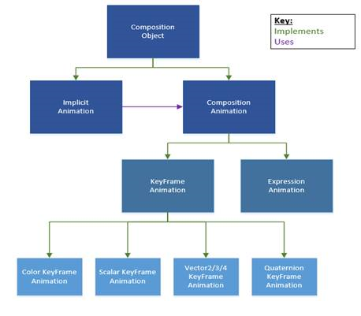

# 컴퍼지션 애니메이션

\[ Windows 10의 UWP 앱에 맞게 업데이트되었습니다. Windows 8.x 문서는 [보관](http://go.microsoft.com/fwlink/p/?linkid=619132)을 참조하세요. \]

Windows.UI.Composition WinRT API를 사용하면 통합된 API 계층에서 작성자 개체를 만들고, 변환하고, 조작할 수 있으며 작성자 개체에 애니메이션 효과를 줄 수 있습니다.  컴퍼지션 애니메이션은 응용 프로그램 UI에서 애니메이션을 실행하는 강력하고 효율적인 방법을 제공합니다. 컴퍼지션 애니메이션은 UI 스레드와 독립적인 60FPS에서 애니메이션이 실행되도록 하고 시간뿐만 아니라 입력 및 기타 속성을 사용하여 멋진 애니메이션 실행 환경을 구축하기 위한 유연성을 제공하도록 처음부터 디자인되었습니다.
이 항목에서는 컴퍼지션 개체의 속성에 애니메이션 효과를 주는 데 사용할 수 있는 기능에 대해 개략적으로 설명합니다.
이 문서에서는 시각적 계층 구조의 기본 사항을 잘 알고 있다고 가정합니다. 자세한 내용은 [여기를 참조](./composition-visual-tree.md)하세요. 컴퍼지션 애니메이션의 유형에는 **키 프레임 애니메이션**과 **식 애니메이션**이 있습니다.  

  
   
 
##컴퍼지션 애니메이션의 유형
**키 프레임 애니메이션**은 기존의 시간 기반 *프레임 단위* 애니메이션 환경을 제공합니다. 개발자는 애니메이션 타임라인의 특정 시점에서 애니메이션 속성에 필요한 값을 설명하는 *제어점*을 명시적으로 정의할 수 있습니다. 더 중요한 점은 감속/가속 함수(보간이라고도 함)를 사용하여 이러한 제어점 간을 전환하는 방법을 설명할 수 있다는 것입니다.  

**식 애니메이션**은 Windows 10 11월 업데이트(빌드 10586)에서 시각적 계층에 도입된 새로운 유형의 애니메이션입니다. 식 애니메이션은 개발자가 시각적 속성과 프레임마다 평가되고 업데이트될 불연속 값 간의 수학적 관계를 만들 수 있다는 사실을 기초로 합니다. 개발자는 컴퍼지션 개체나 속성 집합의 속성을 참조하고, 수학 함수 도우미를 사용하고 입력을 참조하여 이러한 수학적 관계를 얻을 수 있습니다. 식은 Windows 플랫폼에서 시차 및 고정 헤더와 같은 경험을 가능하고 원활하게 만듭니다.  

##컴퍼지션 애니메이션을 사용하는 이유
**성능**  
 유니버설 Windows 응용 프로그램을 빌드하는 경우 대부분의 개발자 코드는 UI 스레드에서 실행됩니다. 따라서 애니메이션이 다양한 디바이스 범주에서 원활하게 실행되도록 하기 위해 시스템에서는 애니메이션 계산을 수행하고 독립적인 스레드에서 작업하여 60FPS를 유지합니다. 즉, 개발자는 응용 프로그램이 고급 사용자 환경을 위해 다른 복잡한 작업을 수행하는 동안 시스템에 의지하여 원활한 애니메이션을 제공할 수 있습니다.    
 
**가능성**  
시각적 계층의 컴퍼지션 애니메이션에 대한 목표는 아름다운 UI를 가능하게 만드는 것입니다. Microsoft는 멋진 아이디어를 실현하고 UWP의 한계를 뛰어넘을 수 있도록 개발자에게 유연성과 다양한 애니메이션을 제공하려고 합니다.
 
 ([컴퍼지션 GitHub](http://go.microsoft.com/fwlink/?LinkID=789439)에서 API 사용 방법에 대한 샘플과 작동하는 API의 고화질 샘플도 확인할 수 있습니다.)  

**템플릿**  
 시각적 계층의 모든 컴퍼지션 애니메이션은 템플릿입니다. 즉, 개발자가 여러 개체에서 별도로 애니메이션을 만들 필요 없이 하나의 애니메이션을 사용할 수 있습니다. 이에 따라 개발자는 이전의 사용을 방해한다는 걱정 없이 동일한 애니메이션을 사용하고 다른 요구에 맞게 속성이나 매개 변수를 조정할 수 있습니다.  
 
##컴퍼지션 애니메이션으로 애니메이션 효과를 줄 수 있는 대상
컴퍼지션 애니메이션은 Visual 및 InsetClip과 같은 컴퍼지션 개체의 대부분의 속성에 적용할 수 있습니다. 컴퍼지션 효과 및 속성 집합에도 컴퍼지션 애니메이션을 적용할 수 있습니다. **애니메이션 효과를 줄 대상을 선택할 때 형식에 유의해야 합니다. 이 형식을 사용하여 생성하는 키 프레임 애니메이션의 형식이나 식이 계산되어야 하는 형식을 결정합니다.**  
 
###Visual
|애니메이션 효과를 줄 수 있는 Visual 속성|  종류|
|------|------|
|AnchorPoint|   Vector2|
|CenterPoint|   Vector3|
|오프셋|    Vector3|
|불투명도|   Scalar|
|방향|   Quaternion|
|RotationAngle| Scalar|
|RotationAngleInDegrees|    Scalar|
|RotationAxis|  Vector3|
|배율| Vector3|
|크기|  Vector2|
|TransformMatrix*|  Matrix4x4|
*전체 TransformMatrix 속성에 Matrix4x4로 애니메이션 효과를 주려는 경우 식 애니메이션을 사용해야 합니다. 그러지 않으면 행렬의 개별 셀을 대상으로 지정하고 거기에서 키 프레임 또는 식 애니메이션을 사용할 수 있습니다.  

###InsetClip
|애니메이션 효과를 줄 수 있는 InsetClip 속성|   종류|
|-------------------------------|-------|
|BottomInset|   Scalar|
|LeftInset| Scalar|
|RightInset|    Scalar|
|TopInset|  Scalar|

##Visual 하위 채널 속성
Visual의 속성에 애니메이션 효과를 줄 수 있을 뿐만 아니라 이러한 속성의 *하위 채널* 구성 요소도 애니메이션 대상으로 지정할 수 있습니다. 예를 들어 전체 Offset 대신 Visual의 X Offset에 애니메이션 효과를 주려고 할 수 있습니다. 애니메이션은 Vector3 Offset 속성 또는 Offset 속성의 Scalar X 구성 요소를 대상으로 지정할 수 있습니다. 속성의 개별 하위 채널 구성 요소를 대상으로 지정할 수 있을 뿐만 아니라 여러 구성 요소를 대상으로 지정할 수도 있습니다. 예를 들어 Scale의 X 및 Y 구성 요소를 대상으로 지정할 수 있습니다.

|애니메이션 효과를 줄 수 있는 Visual 하위 채널 속성|  종류|
|----------------------------------------|------|
|AnchorPoint.x, y|Scalar|
|AnchorPoint.xy|Vector2|
|CenterPoint.x, y, z|Scalar|
|CenterPoint.xy, xz, yz|Vector2|
|Offset.x, y, z|Scalar|
|Offset.xy, xz, yz|Vector2|
|RotationAxis.x, y, z|Scalar|
|RotationAxis.xy, xz, yz|Vector2|
|Scale.x, y, z|Scalar|
|Scale.xy, xz, yz|Vector2|
|Size.x, y|Scalar|
|Size.xy|Vector2|
|TransformMatrix._11 ... TransformMatrix._NN,|Scalar|
|TransformMatrix._11_12... TransformMatrix._NN_NN|Vector2|
|TransformMatrix._11_12_13 ... TransformMatrix._NN_NN_NN|Vector3|
|TransformMatrix._11_12_13_14|Vector4|
|Color*|    Colors(Windows.UI)|

*Brush 속성의 Color 하위 채널에 애니메이션 효과를 주는 것은 약간 다릅니다. StartAnimation()을 Visual.Brush에 연결하고 매개 변수에서 애니메이션 효과를 줄 속성을 "Color"로 선언합니다. 이에 대한 자세한 내용은 나중에 설명합니다.

##속성 집합 및 효과
컴퍼지션 Visual 및 InsetClip의 속성에 애니메이션 효과를 주는 것 외에도 PropertySet 또는 효과의 속성에 애니메이션 효과를 줄 수도 있습니다. 속성 집합의 경우 속성을 정의하고 컴퍼지션 속성 집합에 저장합니다. 해당 속성은 나중에 애니메이션의 대상이 될 수 있으며 다른 애니메이션에서 동시에 참조될 수도 있습니다. 이에 대해서는 다음 섹션에서 자세히 설명합니다.  

효과의 경우 컴퍼지션 효과 API를 사용하여 그래픽 효과를 정의할 수 있습니다([효과 개요](./composition-effects.md) 참조). 효과를 정의하는 것 외에도 효과의 속성 값에 애니메이션 효과를 줄 수도 있습니다. 이 작업은 Sprite 시각적 개체에 대한 Brush 속성의 속성 구성 요소를 대상으로 지정하여 수행할 수 있습니다.

##빠른 단계: 컴퍼지션 애니메이션 시작하기
다양한 유형의 애니메이션을 생성하고 사용하는 방법에 대해 자세히 살펴보기 전에 컴퍼지션 애니메이션을 만드는 방법에 대한 상위 수준의 빠른 단계가 아래에 나와 있습니다.  
1.  애니메이션 효과를 줄 속성, 하위 채널 속성 또는 효과 결정 - 형식을 기록해 둡니다.  
2.  애니메이션의 새 개체 만들기 – 키 프레임 애니메이션이거나 식 애니메이션입니다.  
    *  키 프레임 애니메이션의 경우 애니메이션 효과를 줄 속성의 형식과 일치하는 키 프레임 애니메이션 형식을 만들어야 합니다.  
    *  식 애니메이션의 형식은 하나밖에 없습니다.  
3.  애니메이션의 콘텐츠 정의 – 키 프레임을 삽입하거나 식 문자열을 정의합니다.  
    *  키 프레임 애니메이션의 경우 키 프레임의 값이 애니메이션 효과를 줄 속성과 동일한 형식이어야 합니다.  
    *  식 애니메이션의 경우 식 문자열이 애니메이션 효과를 줄 속성과 동일한 형식으로 계산되어야 합니다.  
4.  애니메이션 효과를 줄 속성을 포함하는 시각적 개체에서 애니메이션 시작 – StartAnimation을 호출하고 애니메이션 효과를 줄 속성의 이름(문자열 형식) 및 애니메이션의 개체를 매개 변수로 포함합니다.  

```cs
// KeyFrame Animation Example to target Opacity property
// Step 2 - Create your animation object
var animation = _compositor.CreateScalarKeyFrameAnimation();
// Step 3 - Define Content
animation.InsertKeyFrameAnimation(1.0f, 0.2f); 
// Step 4 - Attach animation to Visual property and start animation
_targetVisual.StartAnimation("Opacity", animation); 
  
// Expression Animation Example to target Opacity property
// Step 2 - Create your animation object
var expression = _compositor.CreateExpressionAnimation(); 
// Step 3 - Define Content (you can also define the string as part of the expression object
// declaration)
expression.Expression = "targetVisual.Offset.X / windowWidth";
expression.SetReferenceParameter("targetVisual", _target);
expression.SetScalarParameter("windowWidth", _xSizeWindow);
// Step 4 - Attach animation to Visual property and start animation
_targetVisual.StartAnimation("Opacity", expression);

```

##키 프레임 애니메이션 사용
키 프레임 애니메이션은 하나 이상의 키 프레임을 사용하는 시간 기반 애니메이션으로, 애니메이션 값이 시간에 따라 변경되는 방식을 지정합니다. 프레임은 표식 또는 제어점을 나타내므로 애니메이션 값이 지정된 시간에 무엇이어야 하는지 정의할 수 있습니다.  
 
###애니메이션 만들기 및 키 프레임 정의
키 프레임 애니메이션을 생성하려면 애니메이션 효과를 주려는 속성의 형식과 관련된 Compositor 개체의 생성자 메서드를 사용합니다. 키 프레임 애니메이션의 유형은 다음과 같습니다.
*   ColorKeyFrameAnimation
*   QuaternionKeyFrameAnimation
*   ScalarKeyFrameAnimation
*   Vector2KeyFrameAnimation
*   Vector3KeyFrameAnimation
*   Vector4KeyFrameAnimation  

Vector3 키 프레임 애니메이션을 만드는 예제:     
```cs
var animation = _compositor.CreateVector3KeyFrameAnimation(); 
```

각 키 프레임 애니메이션은 두 가지 구성 요소(필요한 경우 세 번째 구성 요소 사용)를 정의하는 개별 키 프레임 세그먼트를 삽입하여 생성됩니다.  
*   시간: 0.0 – 1.0 사이의 키 프레임의 정규화된 진행 상태
*   값: 시간 상태에서 애니메이션 값의 특정 값
*   (옵션) 감속/가속 함수: 이전과 현재 키 프레임 사이의 보간을 설명하는 함수(이 항목의 뒷부분에서 설명)  

애니메이션의 중간 지점에 키 프레임을 삽입하는 예제:
```cs
animation.InsertKeyFrame(0.5f, new Vector3(50.0f, 80.0f, 0.0f));
```

**참고:** 키 프레임 애니메이션으로 색에 애니메이션 효과를 주는 경우 몇 가지 추가 사항에 유의해야 합니다.
1.  애니메이션 효과를 주려는 속성 매개 변수로 **Color**를 사용하여 Visual 대신 Visual.Brush에 StartAnimation을 연결합니다.
2.  키 프레임의 "값" 구성 요소는 Windows.UI 네임스페이스의 Colors 개체에 의해 정의됩니다.
3.  InterpolationColorSpace 속성을 설정하여 보간이 수행될 색 공간을 정의할 수 있습니다. 가능한 값은  CompositionColorSpace.Rgb 및  CompositionColorSpace.Hsl입니다.


##키 프레임 애니메이션 속성
키 프레임 애니메이션 및 개별 키 프레임을 정의했으면 애니메이션의 여러 속성을 정의할 수 있습니다.
*   DelayTime – StartAnimation()이 호출된 후 애니메이션을 시작하기 전의 시간
*   Duration – 애니메이션의 지속 시간
*   IterationBehavior – 애니메이션의 수 또는 무한 반복 동작
*   IterationCount - 키 프레임 애니메이션이 반복되는 유한 횟수
*   KeyFrame Count - 특정 키 프레임 애니메이션에서 읽은 키 프레임 수
*   StopBehavior – StopAnimation이 호출될 때 애니메이션 효과를 주려는 속성 값의 동작 지정  

애니메이션의 Duration을 5초로 설정하는 예제:  
```cs
animation.Duration = TimeSpan.FromSeconds(5);
```

##감속/가속 함수
감속/가속 함수(CompositionEasingFunction)는 이전 키 프레임 값에서 현재 키 프레임 값까지 중간 값이 어떻게 진행되는지를 나타냅니다. 키 프레임에 감속/가속 함수를 제공하지 않는 경우 기본 곡선이 사용됩니다.  
지원되는 감속/가속 함수는 두 가지 유형이 있습니다.
*   선형
*   입방형 3차원  

입방형 3차원은 크기를 조정할 수 있는 부드러운 곡선을 설명하는 데 자주 사용되는 파라메트릭 함수입니다. 컴퍼지션 키 프레임 애니메이션과 함께 사용하는 경우 Vector2 개체인 두 제어점을 정의합니다. 이러한 제어점은 곡선의 모양을 정의하는 데 사용됩니다. 두 제어점이 입방형 3차원의 곡선을 생성하는 방식을 시각화하려면 [이 사이트](http://cubic-bezier.com/#0,-0.01,.48,.99) 등의 유사한 사이트를 사용하는 것이 좋습니다.

감속/가속 함수를 만들려면 Compositor 개체의 생성자 메서드를 사용합니다. 선형 감속/가속 함수와 기본 easeIn 입방형 3차원을 만드는 두 예제는 다음과 같습니다.  
```cs
var linear = _compositor.CreateLinearEasingFunction();
var easeIn = _compositor.CreateCubicBezierEasingFunction(new Vector2(0.5f, 0.0f), new Vector2(1.0f, 1.0f));
```
키 프레임에 감속/가속 함수를 추가하려면 애니메이션에 삽입할 때 키 프레임에 대한 세 번째 매개 변수에 삽입하기만 하면 됩니다.   
키 프레임을 사용하여 easeIn 감속/가속 함수에서 추가하는 예제:  
```cs
animation.InsertKeyFrame(0.5f, new Vector3(50.0f, 80.0f, 0.0f), easeIn);
```

##키 프레임 애니메이션 시작 및 중지
애니메이션과 키 프레임을 정의한 후에는 애니메이션을 연결할 준비가 됩니다. 애니메이션을 시작할 때 애니메이션 효과를 줄 Visual, 애니메이션 효과를 줄 대상 속성 및 애니메이션에 대한 참조를 지정합니다. 이렇게 하려면 StartAnimation() 함수를 호출합니다. 속성에 대해 StartAnimation()을 호출하면 이전에 실행 중인 모든 애니메이션이 연결이 끊기고 제거됩니다.  
**참고:** 애니메이션 효과를 주도록 선택하는 속성에 대한 참조는 문자열 형식입니다.  

Visual의 Offset 속성에서 애니메이션을 설정하고 시작하는 예제:  
```cs
targetVisual.StartAnimation("Offset", animation);
```  

하위 채널 속성을 대상으로 지정하려면 애니메이션 효과를 주려는 속성을 정의하는 문자열에 하위 채널을 추가합니다. 위의 예제에서 구문이 StartAnimation("Offset.X, animation2)으로 변경되며, 여기서 animation2는 ScalarKeyFrameAnimation입니다.  

애니메이션을 시작한 후 애니메이션이 완료되기 전에 중지할 수도 있습니다. 이 작업은 StopAnimation() 함수를 사용하여 수행됩니다.  
Visual의 Offset 속성에서 애니메이션을 중지하는 예제:    
```cs
targetVisual.StopAnimation("Offset");
```

애니메이션이 명시적으로 중지될 때 애니메이션의 동작을 정의할 수도 있습니다. 이렇게 하려면 애니메이션의 중지 동작 속성을 정의합니다. 다음 세 가지 옵션이 있습니다.
*   LeaveCurrentValue: 애니메이션이 애니메이션 효과를 준 속성의 값을 마지막으로 계산된 애니메이션의 값으로 표시합니다.
*   SetToFinalValue: 애니메이션이 애니메이션 효과를 준 속성의 값을 최종 키 프레임의 값으로 표시합니다.
*   SetToInitialValue: 애니메이션이 애니메이션 효과를 준 속성의 값을 첫 번째 키 프레임의 값으로 표시합니다.  

키 프레임 애니메이션의 StopBehavior 속성을 설정하는 예제:  
```cs
animation.StopBehavior = AnimationStopBehavior.LeaveCurrentValue;
```

##애니메이션 완료 이벤트
키 프레임 애니메이션을 사용하는 경우 개발자는 선택한 애니메이션(또는 애니메이션 그룹)이 완료될 때 애니메이션 일괄 처리를 통해 집계할 수 있습니다. 키 프레임 애니메이션 완료 이벤트만 일괄 처리할 수 있습니다. 식은 확정된 끝을 포함하지 않으므로 완료 이벤트를 발생시키지 않습니다. 식 애니메이션이 일괄 처리 내에서 시작되는 경우 애니메이션이 예상대로 실행되고 일괄 처리가 발생하는 시기에 영향을 주지 않습니다.    

일괄 처리에서 모든 애니메이션이 완료되면 일괄 처리 완료 이벤트가 발생합니다. 일괄 처리의 이벤트가 발생하는 데 걸리는 시간은 일괄 처리에서 가장 길거나 가장 지연된 애니메이션에 따라 다릅니다.
일부 다른 작업을 예약하기 위해 선택한 애니메이션 그룹이 언제 완료되는지 알아야 하는 경우 종료 상태 집계가 유용합니다.  

일괄 처리는 완료 이벤트가 발생하면 삭제됩니다. 또한 언제든지 Dispose()를 호출하여 조기에 리소스를 해제할 수 있습니다. 일괄 처리된 애니메이션이 조기에 종료되고 완료 이벤트를 수집하지 않으려면 수동으로 일괄 처리를 삭제할 수 있습니다. 애니메이션이 중단되거나 취소되는 경우 완료 이벤트가 발생하고 완료 이벤트가 설정된 일괄 처리에 집계됩니다. 이 방법은 [Windows/컴퍼지션 GitHub](http://go.microsoft.com/fwlink/p/?LinkId=789439)의 Animation_Batch SDK 샘플에서 보여 줍니다.  
 
##범위 일괄 처리
특정 애니메이션 그룹을 집계하거나 단일 애니메이션의 완료 이벤트를 대상으로 지정하려면 범위 일괄 처리를 만듭니다.    
```cs
CompositionScopedBatch myScopedBatch = _compositor.CreateScopedBatch(CompositionBatchTypes.Animation);
``` 
범위 일괄 처리를 만든 후 시작된 모든 애니메이션은 Suspend 또는 End 함수를 사용하여 일괄 처리가 명시적으로 일시 중단되거나 종료될 때까지 집계됩니다.    

Suspend 함수를 호출하면 Resume이 호출될 때까지 애니메이션 종료 상태의 집계가 중지됩니다. 이를 통해 제공된 일괄 처리에서 콘텐츠를 명시적으로 제외할 수 있습니다.  

아래의 예제에서 VisualA의 Offset 속성을 대상으로 하는 애니메이션은 일괄 처리에 포함되지 않습니다.  
```cs
myScopedBatch.Suspend();
VisualA.StartAnimation("Offset", myAnimation);
myScopeBatch.Resume();
```

일괄 처리를 완료하려면 End()를 호출해야 합니다. 종료 호출이 없는 경우 일괄 처리는 계속 열려 있게 되어 영원히 개체를 수집합니다.  
 
다음 코드 조각 및 아래의 다이어그램에서는 일괄 처리에서 애니메이션을 집계하여 종료 상태를 추적하는 방법의 예를 보여 줍니다. 이 예제에서 애니메이션 1, 3 및 4에는 이 일괄 처리로 추적되는 종료 상태가 있지만 애니메이션 2에는 없습니다.  
```cs
myScopedBatch.End();
CompositionScopedBatch myScopedBatch =  _compositor.CreateScopedBatch(CompositionBatchTypes.Animation);
// Start Animation1
[…]
myScopedBatch.Suspend();
// Start Animation2 
[…]
myScopedBatch.Resume();
// Start Animation3
[…]
// Start Animation4
[…]
myScopedBatch.End();
```  

 
##단일 애니메이션의 완료 이벤트 일괄 처리
단일 애니메이션이 언제 종료되는지 알고 싶은 경우에는 대상으로 지정할 애니메이션만 포함하는 범위 일괄 처리를 만들어야 합니다. 예:  
```cs
CompositionScopedBatch myScopedBatch =  _compositor.CreateScopedBatch(CompositionBatchTypes.Animation);
Visual.StartAnimation("Opacity", myAnimation);
myScopedBatch.End();
```

##일괄 처리의 완료 이벤트 검색

한 애니메이션이나 여러 애니메이션을 일괄 처리하는 경우 일괄 처리의 완료 이벤트를 동일한 방식으로 검색합니다. 대상 일괄 처리의 Completed 이벤트에 대한 이벤트 처리 메서드를 등록합니다.  

```cs
myScopedBatch.Completed += OnBatchCompleted;
``` 

##일괄 처리 상태
기존 일괄 처리의 상태를 확인하는 데 사용할 수 있는 두 가지 속성은 IsActive와 IsEnded입니다.  

IsActive 속성은 대상 일괄 처리가 애니메이션 집계에 열려 있는 경우 true를 반환합니다. 일괄 처리가 일시 중단되거나 종료된 경우에는 IsActive가 false를 반환합니다.   

특정 일괄 처리에 애니메이션을 추가할 수 없는 경우 IsEnded 속성은 true를 반환합니다. 특정 일괄 처리에 대해 End()를 명시적으로 호출하면 일괄 처리가 종료됩니다.  
 
##식 애니메이션 사용
식 애니메이션은 Windows 10 11월 업데이트(10586)에서 컴퍼지션 팀이 도입한 새로운 유형의 애니메이션입니다. 상위 수준에서 식 애니메이션은 불연속 값과 다른 컴포지션 개체 속성에 대한 참조 간의 수학적 수식/관계를 기반으로 합니다. 보간 함수(입방형 3차원, 4차, 5차 등)를 사용하여 시간이 지남에 따라 값이 어떻게 변경되는지를 설명하는 키 프레임 애니메이션과 달리, 식 애니메이션은 수학적 수식을 사용하여 애니메이션 효과를 준 값이 프레임마다 계산되는 방식을 정의합니다. 식 애니메이션에는 정의된 기간이 없다는 점에 유의해야 합니다. 식 에니메이션은 시작된 후 명시적으로 중지될 때까지 실행되며 수학적 수식을 사용하여 애니메이션 효과를 주는 속성의 값을 결정합니다.

**그렇다면 식 애니메이션이 유용한 이유는 무엇일까요?** 식 애니메이션의 실질적인 강점은 다른 개체의 매개 변수 또는 속성에 대한 참조가 포함된 수학적 관계를 만드는 기능에서 제공됩니다. 즉, 다른 컴퍼지션 개체, 로컬 변수 또는 컴퍼지션 속성 집합의 공유 값에 대한 속성의 값을 참조하는 수식을 사용할 수 있습니다. 이 참조 모델과 프레임마다 계산되는 수식 때문에 수식을 정의하는 값이 변경되면 수식의 출력도 변경됩니다. 이에 따라 불연속 값이 미리 정의되어야 하는 기존의 키 프레임 애니메이션을 뛰어넘는 가능성이 열립니다. 예를 들어 고정 헤더 및 시차와 같은 경험은 식 애니메이션을 사용하여 쉽게 기술될 수 있습니다.

**참고:** 여기에서 사용되는 "식" 또는 "식 문자열"이라는 용어는 식 애니메이션 개체를 정의하는 수학적 수식을 나타냅니다.

##식 애니메이션 만들기 및 연결
식 애니메이션을 만드는 구문으로 이동하기 전에 언급할 몇 가지 핵심적인 원칙은 다음과 같습니다.  
*   식 애니메이션은 정의된 수학적 수식을 사용하여 애니메이션 효과를 주는 속성의 값을 프레임마다 결정합니다.
*   수학적 수식은 식에 문자열로 입력됩니다.
*   수학적 수식의 출력은 애니메이션 효과를 주려는 속성과 동일한 형식으로 계산되어야 합니다. 두 형식이 일치하지 않는 경우 식이 계산될 때 오류가 발생합니다. 수식이 Nan(숫자/0)으로 계산되는 경우 마지막으로 계산된 값이 사용됩니다.
*   식 애니메이션의 *수명은 무한*합니다. 식 애니메이션은 중지될 때까지 계속 실행됩니다.  

식 애니메이션을 만들려면 컴퍼지션 개체의 생성자를 사용하면 됩니다. 이 생성자에서 수학적 식을 정의합니다.  
 
두 스칼라 값의 합을 계산하는 매우 기본적인 식이 정의된 생성자의 예제(다음 섹션에서 더 복잡한 식에 대해 설명함):  
```cs
var expression = _compositor.CreateExpressionAnimation("0.2 + 0.3");
```
키 프레임 애니메이션과 마찬가지로 식 애니메이션을 정의했으면 Visual에 연결하고 애니메이션 효과를 주려는 속성을 선언해야 합니다. 아래에서는 위의 예제를 계속하여 Visual의 Opacity 속성(Scalar 형식)에 식 애니메이션을 연결합니다.  
```cs
targetVisual.StartAnimation("Opacity", expression);
```

##식 문자열의 구성 요소
이전 섹션의 예제에서는 함께 추가될 두 개의 간단한 스칼라 값을 보여 줍니다. 이 예제가 식의 올바른 예제이지만 식으로 수행할 수 있는 작업의 잠재력을 완전히 보여 주지는 않습니다. 위의 예제에 대해 유의할 한 가지 사항은 불연속 값이기 때문에 프레임마다 식이 0.5로 계산되고 애니메이션의 수명 중에 변경되지 않습니다. 식의 진정한 잠재력은 값이 주기적으로나 항상 변경될 수 있는 수학적 관계를 정의하는 것에서 비롯됩니다.  
 
이러한 유형의 식을 구성할 수 있는 다양한 부분을 살펴보겠습니다.  

###연산자, 우선 순위 및 연결
식 문자열은 수식의 여러 구성 요소 간의 수학적 관계를 기술하는 일반적인 연산자의 사용을 지원합니다.  

|범주|  연산자|
|--------|-----------|
|단항| -|
|곱셈|    * /|
|덧셈|  + -|

마찬가지로 식은 계산될 때 C# 언어 사양에서 정의된 대로 연산자 우선 순위 및 연결을 준수합니다. 즉, 식은 연산의 기본 순서를 준수합니다.  

아래의 예제에서 식이 계산될 때 괄호가 먼저 계산된 후 연산 순서에 따라 식의 나머지 부분이 계산됩니다.  
```cs
"(5.0 * (72.4 – 36.0) + 5.0" // (5.0 * 36.4 + 5) -> (182 + 5) -> 187
```

###속성 매개 변수
속성 매개 변수는 식 애니메이션의 가장 강력한 구성 요소 중 하나입니다. 식 문자열에서 컴퍼지션 시각적 개체, 컴퍼지션 속성 집합, 기타 C# 개체 등의 다른 개체로부터 속성의 값을 참조할 수 있습니다.   

식 문자열에서 이러한 참조를 사용하려면 식 애니메이션에 대한 매개 변수로 참조를 정의하기만 하면 됩니다. 이 작업은 식에서 사용되는 문자열을 실제 개체에 매핑하여 수행됩니다. 이에 따라 시스템에서는 식을 계산할 때 값을 계산하기 위해 조사할 항목을 알 수 있습니다. 식에 포함하려는 개체의 형식과 관련된 여러 가지 형식의 매개 변수가 있습니다.  

|종류|  매개 변수를 만드는 함수|
|----|------------------------------|
|Scalar|    SetScalarParameter(String ref, Scalar obj)|
|Vector|    SetVector2Parameter(String ref, Vector2 obj)<br/>SetVector3Parameter(String ref, Vector3 obj)<br/>SetVector4Parameter(String ref, Vector4 obj)|
|Matrix|    SetMatrix3x2Parameter(String ref, Matrix3x2 obj)<br/>SetMatrix4x4Parameter(String ref, Matrix4x4 obj)|
|Quaternion|    SetQuaternionParameter(String ref, Quaternion obj)|
|색상| SetColorParameter(String ref, Color obj)|
|CompositionObject| SetReferenceParameter(String ref, Composition object obj)|

아래의 예제에서는 다른 두 컴퍼지션 시각적 개체와 기본 System.Numerics Vector3 개체의 Offset을 참조할 식 애니메이션을 만듭니다.  
```cs
var commonOffset = new Vector3(25.0, 17.0, 10.0);
var expression = _compositor.CreateExpressionAnimation("SomeOffset / ParentOffset + additionalOffset);
expression.SetVector3Parameter("SomeOffset", childVisual.Offset);
expression.SetVector3Parameter("ParentOffset", parentVisual.Offset);
expression.SetVector3Parameter("additionalOffset", commonOffset);
```

또한 위에서 설명한 동일한 모델을 사용하여 식에서 속성 집합의 값을 참조할 수 있습니다. 컴퍼지션 속성 집합은 애니메이션에서 사용되는 데이터를 저장하는 유용한 수단이며 다른 컴퍼지션 개체의 수명에 연결되지 않은 공유 및 재사용이 가능한 데이터를 만드는 데 유용합니다. 속성 집합 값은 다른 속성 참조와 유사하게 식에서 참조될 수 있습니다. 속성 집합에 대해서는 뒷부분의 섹션에서 자세히 설명합니다.  

속성 집합이 로컬 변수 대신 commonOffset을 정의하는 데 사용되는 식으로 위의 예제를 직접 수정할 수 있습니다.
```cs
_sharedProperties = _compositor.CreatePropertySet();
_sharedProperties.InsertVector3("commonOffset", offset);
var expression = _compositor.CreateExpressionAnimation("SomeOffset / ParentOffset + sharedProperties.commonOffset);
expression.SetVector3Parameter("SomeOffset", childVisual.Offset);
expression.SetVector3Parameter("ParentOffset", parentVisual.Offset);
expression.SetReferenceParameter("sharedProperties", _sharedProperties);
```

마지막으로, 다른 개체의 속성을 참조할 때 식 문자열 내에서나 참조 매개 변수의 일부로 하위 채널 속성을 참조할 수도 있습니다.  
 
아래의 예제에서는 두 시각적 개체에 대한 Offset 속성의 x 하위 채널을 참조합니다. 하나는 식 문자열 자체에서 참조하고 다른 하나는 매개 변수 참조를 만들 때 참조합니다.
Offset의 X 구성 요소를 참조할 때 매개 변수 형식을 이전 예제에서와 같이 Vector3 대신 Scalar 매개 변수로 변경합니다.  
```cs
var expression = _compositor.CreateExpressionAnimation("xOffset/ ParentOffset.X");
expression.SetScalarParameter("xOffset", childVisual.Offset.X);
expression.SetVector3Parameter("ParentOffset", parentVisual.Offset);
```

###식 도우미 함수 및 생성자
연산자 및 속성 매개 변수에 액세스하는 것 외에도 식에서 사용할 수학 함수의 목록을 활용할 수 있습니다. 이러한 함수는 System.Numerics 개체를 사용하여 유사하게 수행할 계산과 연산을 다양한 형식에 대해 수행하기 위해 제공됩니다.  

아래의 예제에서는 Clamp 도우미 함수를 이용하는 스칼라 대상의 식을 만듭니다.  
```cs
var expression = _compositor.CreateExpressionAnimation("Clamp((scroller.Offset.y * -1.0) – container.Offset.y, 0, container.Size.y – header.Size.y)"
```

도우미 함수의 목록뿐만 아니라 식 문자열 내에서 기본 제공 생성자 메서드도 사용할 수 있습니다. 이 메서드는 제공된 매개 변수에 따라 해당 형식의 인스턴스를 생성합니다.  

아래의 예제에서는 식 문자열에서 새 Vector3을 정의하는 식을 만듭니다.  
```cs
var expression = _compositor.CreateExpressionAnimation("Offset / Vector3(targetX, targetY, targetZ");
```

부록 섹션에서 도우미 함수와 생성자의 전체 목록을 찾을 수 있으며, 목록의 각 형식에 대한 링크는 다음과 같습니다.  
*   [Scalar](#scalar)
*   [Vector2](#vector2)
*   [Vector3](#vector3)
*   [Matrix3x2](#matrix3x2)
*   [Matrix4x4](#matrix4x4)
*   [Quaternion](#quaternion)
*   [색상](#color)  

###식 키워드
식 문자열이 계산될 때 다르게 처리되는 특수 "키워드"를 이용할 수 있습니다. "키워드"로 간주되는 문자열은 속성 참조의 문자열 매개 변수 부분으로 사용할 수 없습니다.  
 
|키워드|   설명|
|-------|--------------|
|This.StartingValue| 애니메이션 효과를 줄 속성의 원래 시작 값에 대한 참조를 제공합니다.|
|This.CurrentValue| 속성의 현재 "알려진" 값에 대한 참조를 제공합니다.|
|Pi| Pi 값에 대한 키워드 참조를 제공합니다.|

this.StartingValue 키워드의 사용을 보여 주는 예제:  
```cs
var expression = _compositor.CreateExpressionAnimation("this.StartingValue + delta");
```

###조건이 포함된 식
연산자, 속성 참조, 함수 및 생성자를 사용하여 수학적 관계를 지원하는 것 외에도 3항 연산자가 포함된 식도 만들 수 있습니다.  
```
(condition ? ifTrue_expression : ifFalse_expression)
```

조건문을 사용하면 특정 조건에 따라 다른 수학적 관계가 시스템에서 사용되어 애니메이션 효과를 주는 속성의 값이 계산되도록 식을 작성할 수 있습니다. 3항 연산자는 true 또는 false 문에 대한 식으로 중첩될 수 있습니다.  

다음 조건부 연산자는 조건문에서 지원됩니다. 
*   같음(==)
*   같지 않음(!=)
*   보다 작음(&lt;)
*   작거나 같음(&lt;=)
*   보다 큼(&gt;)
*   크거나 같음(&gt;=)  

다음 접속사는 조건문의 연산자 또는 함수로 지원됩니다.
*   제외: ! / Not(bool1)
*   및: &amp;&amp; / And(bool1, bool2)
*   또는: || / Or(bool1, bool2)  

다음은 조건을 사용하는 식 애니메이션의 예제입니다.  
```cs
var expression = _compositor.CreateExpressionAnimation("target.Offset.x > 50 ? 0.0f + (target.Offset.x / parent.Offset.x) : 1.0f");
```

##식 키 프레임
이 문서의 앞부분에서 키 프레임 애니메이션을 만드는 방법을 설명하고 식 애니메이션과 식 문자열을 구성하는 데 사용할 수 있는 다양한 모든 부분을 소개했습니다. 식 애니메이션의 강력한 기능을 이용하고 싶지만 키 프레임 애니메이션에서 제공하는 시간 보간을 원하는 경우에는 어떻게 해야 할까요? 바로 식 키 프레임을 사용하면 됩니다.  

키 프레임 애니메이션에서 각 제어점에 대한 불연속 값을 정의하는 대신 값을 식 문자열로 설정할 수 있습니다. 이러한 경우 시스템에서는 식 문자열을 사용하여 타임라인의 지정된 지점에 있어야 하는 애니메이션 효과를 주는 속성의 값을 계산합니다. 그런 다음 일반 키 프레임 애니메이션에서와 같이 이 값에 보간합니다.    

식 키 프레임을 사용하기 위해 특수한 애니메이션을 만들 필요는 없습니다. 표준 키 프레임 애니메이션에 식 키 프레임을 삽입하고 시간과 식 문자열을 값으로 제공하면 됩니다. 아래의 예제에서는 식 문자열을 키 프레임 중 하나의 값으로 사용하여 이 방법을 보여 줍니다.   
```cs
var animation = _compositor.CreateScalarKeyFrameAnimation();
animation.InsertExpressionKeyFrame(0.25, "VisualBOffset.X / VisualAOffset.Y");
animation.InsertKeyFrame(1.00f, 0.8f);
```

##식 샘플
아래의 코드에서는 스크롤 뷰어에서 입력 값을 가져오는 기본적인 시차 경험을 위해 식 애니메이션을 설정하는 예를 보여 줍니다.
```cs
// Get scrollviewer
ScrollViewer myScrollViewer = ThumbnailList.GetFirstDescendantOfType<ScrollViewer>();
_scrollProperties = ElementCompositionPreview.GetScrollViewerManipulationPropertySet(myScrollViewer);

// Setup the expression
_parallaxExpression = compositor.CreateExpressionAnimation();
_parallaxExpression.SetScalarParameter("StartOffset", 0.0f);
_parallaxExpression.SetScalarParameter("ParallaxValue", 0.5f);
_parallaxExpression.SetScalarParameter("ItemHeight", 0.0f);
_parallaxExpression.SetReferenceParameter("ScrollManipulation", _scrollProperties);
_parallaxExpression.Expression = "(ScrollManipulation.Translation.Y + StartOffset - (0.5 *  ItemHeight)) * ParallaxValue - (ScrollManipulation.Translation.Y + StartOffset - (0.5   * ItemHeight))";
```

##속성 집합을 사용하여 애니메이션 효과 주기
컴퍼지션 속성 집합을 사용하면 여러 애니메이션에서 공유할 수 있고 다른 컴퍼지션 개체의 수명에 연결되지 않은 값을 저장할 수 있습니다. 속성 집합은 일반적인 값을 저장한 다음 나중에 애니메이션에서 쉽게 참조하는 데 매우 유용합니다. 또한 속성 집합을 사용하여 식을 실행하는 응용 프로그램 논리에 따라 데이터를 저장할 수도 있습니다.  

속성 집합을 만들려면 Compositor 개체의 생성자 메서드를 사용합니다.  
```cs
_sharedProperties = _compositor.CreatePropertySet();
```

속성 집합을 만들었으면 속성과 값을 속성 집합에 추가할 수 있습니다.  
```cs
_sharedProperties.InsertVector3("NewOffset", offset);
```

앞에서 살펴본 것과 유사하게 식 애니메이션에서 이 속성 집합 값을 참조할 수 있습니다.  
```cs
var expression = _compositor.CreateExpressionAnimation("this.target.Offset + sharedProperties.NewOffset");
expression.SetReferenceParameter("sharedProperties", _sharedProperties);
targetVisual.StartAnimation("Offset", expression);
```

속성 집합 값에 애니메이션 효과를 줄 수도 있습니다. 이 작업은 PropertySet 개체에 애니메이션을 연결한 다음 문자열에서 속성 이름을 참조하여 수행됩니다. 아래에서는 키 프레임 애니메이션을 사용하여 속성 집합의 NewOffset 속성에 애니메이션 효과를 줍니다.  
```cs
var keyFrameAnimation = _compositor.CreateVector3KeyFrameAnimation()
keyFrameAnimation.InsertKeyFrame(0.5f, new Vector3(25.0f, 68.0f, 0.0f);
keyFrameAnimation.InsertKeyFrame(1.0f, new Vector3(89.0f, 125.0f, 0.0f);
_sharedProperties.StartAnimation("NewOffset", keyFrameAnimation);
```


이 코드가 앱에서 실행되면 식 애니메이션이 연결된 애니메이션 효과를 준 속성 값이 어떻게 될지 궁금할 수도 있습니다. 이 경우 식에서 처음에 값이 출력되지만 키 프레임 애니메이션이 속성 집합의 속성에 애니메이션 효과를 주기 시작하면 수식이 프레임마다 계산되므로 식 값도 업데이트됩니다. 이는 식 및 키 프레임 애니메이션을 사용하는 속성 집합의 장점입니다.  
 
##ManipulationPropertySet
컴퍼지션 속성 집합을 이용하는 것 외에도 개발자는 XAML ScrollViewer의 속성에 대한 액세스를 허용하는 ManipulationPropertySet에 액세스할 수 있습니다. 그런 다음 식 애니메이션에서 이러한 속성을 사용 및 참조하여 시차 및 고정 헤더와 같은 환경을 제공할 수 있습니다. 참고: 스크롤 가능한 콘텐츠가 있는 XAML 컨트롤(ListView, GridView 등)의 ScrollViewer를 잡고 해당 ScrollViewer를 사용하여 스크롤 가능한 컨트롤의 ManipulationPropertySet를 가져올 수 있습니다.  

식에서 스크롤 뷰어의 다음 속성을 참조할 수 있습니다.  

|속성| 형식|  
|--------|-----|  
|Translation| Vector3|  
|Pan| Vector3|  
|배율| Vector3|  
|CenterPoint| Vector3|  
|Matrix| Matrix4x4|  

ManipulationPropertySet에 대한 참조를 가져오려면 ElementCompositionPreview의 GetScrollViewerManipulationPropertySet 메서드를 활용합니다.  
```csharp
CompositionPropertySet manipPropSet = ElementCompositionPreview.GetScrollViewerManipulationPropertySet(myScroller);
```

이 속성 집합에 대한 참조가 있을 경우 속성 집합에 있는 스크롤 뷰어의 속성을 참조할 수 있습니다. 첫 번째 단계에서는 참조 매개 변수를 만듭니다.  
```csharp
ExpressionAnimation exp = compositor.CreateExpressionAnimation();
exp.SetReferenceParameter("ScrollManipulation", manipPropSet);
```

참조 매개 변수를 설정한 후 식에서 ManipulationPropertySet 속성을 참조할 수 있습니다.  
```csharp
exp.Expression = “ScrollManipulation.Translation.Y / ScrollBounds”;
_target.StartAnimation(“Opacity”, exp);
```


 
 
##부록
###구조 형식별 식 함수
###Scalar  

|함수 및 생성자 연산| 설명|  
|-----------------------------------|--------------|  
|Abs(Float value)|  float 매개 변수의 절대값을 나타내는 Float를 반환합니다.|  
|Clamp(Float value, Float min, Float max)|  min보다 크고 max보다 작은 float 값, 값이 min보다 작은 경우 min 또는 값이 max보다 큰 경우 max를 반환합니다.|  
|Max(Float value1, Float value2)|  value1과 value2 중에서 큰 float를 반환합니다.|  
|Min(Float value1, Float value2)|  value1과 value2 중에서 작은 float를 반환합니다.|  
|Lerp(Float value1, Float value2, Float progress)|  진행률에 따라 두 스칼라 값 간의 계산된 선형 보간 계산을 나타내는 float를 반환합니다(참고: 진행률은 0.0에서 1.0 사이임).|  
|Slerp(Float value1, Float value2, Float progress)| 진행률에 따라 두 Float 값 간의 계산된 구면 보간을 나타내는 Float를 반환합니다(참고: 진행률은 0.0에서 1.0 사이임).|  
|Mod(Float value1, Float value2)|   value1과 value2의 나누기에서 발생한 Float 나머지를 반환합니다.|  
|Ceil(Float value)|     그다음 큰 정수로 반올림된 Float 매개 변수를 반환합니다.|  
|Floor(Float value)|    그다음 작은 정수로 반내림된 Float 매개 변수를 반환합니다.|  
|Sqrt(Float value)| Float 매개 변수의 제곱근을 반환합니다.|  
|Square(Float value)|   Float 매개 변수의 제곱을 반환합니다.|  
|Sin(Float value1)||
|Asin(Float value2)|    Float 매개 변수의 Sin 또는 ArcSin을 반환합니다.|
|Cos(Float value1)||
|ACos(Float value2)|    Float 매개 변수의 Cos 또는 ArcCos를 반환합니다.|
|Tan(Float value1)||
|ATan(Float value2)|    Float 매개 변수의 Tan 또는 ArcTan을 반환합니다.|
|Round(Float value)|    가장 가까운 정수로 반올림한 Float 매개 변수를 반환합니다.|
|Log10(Float value)|    Float 매개 변수의 상용 로그 결과를 반환합니다.|
|Ln(Float value)|   Float 매개 변수의 자연 로그 결과를 반환합니다.|
|Pow(Float value, Float power)| Float 매개 변수를 특정 횟수만큼 거듭제곱한 결과를 반환합니다.|
|ToDegrees(Float radians)|  도로 변환된 Float 매개 변수를 반환합니다.|
|ToRadians(Float degrees)|  라디안으로 변환된 Float 매개 변수를 반환합니다.|

###Vector2  

|함수 및 생성자 연산|   설명|
|-----------------------------------|--------------|
|Abs(Vector2 value)|   각 구성 요소에 절대값이 적용된 Vector2를 반환합니다.|
|Clamp(Vector2 value1, Vector2 min, Vector2 max)|  각각의 개별 구성 요소에 대해 범위로 고정된 값을 포함하는 Vector2를 반환합니다.|
|Max(Vector2 value1, Vector2 value2)|  value1 및 value2의 해당 구성 요소 각각에 대해 Max를 수행한 Vector2를 반환합니다.|
|Min(Vector2 value1, Vector2 value2)|  value1 및 value2의 해당 구성 요소 각각에 대해 Min을 수행한 Vector2를 반환합니다.|
|Scale(Vector2 value, Float factor)|    벡터의 각 구성 요소를 배율 인수로 곱한 Vector2를 반환합니다.|
|Transform(Vector2 value, Matrix3x2 matrix)|    Vector2와 Matrix3x2 간의 선형 변환(벡터를 행렬과 곱함)에서 생성된 Vector2를 반환합니다.|
|Lerp(Vector2 value1, Vector2 value2, Float progress)|  진행률에 따라 두 Vector2 값 간의 계산된 선형 보간 계산을 나타내는 Vector2를 반환합니다(참고: 진행률은 0.0에서 1.0 사이임).|
|Length(Vector2 value)| Vector2의 길이/크기를 나타내는 Float 값을 반환합니다.|
|LengthSquared(Vector2)|    Vector2에 대한 길이/크기의 제곱을 나타내는 Float 값을 반환합니다.|
|Distance(Vector2 value1, Vector2 value2)|  두 Vector2 값 간의 거리를 나타내는 Float 값을 반환합니다.|
|DistanceSquared(Vector2 value1, Vector2 value2)|   두 Vector2 값 간의 거리의 제곱을 나타내는 Float 값을 반환합니다.|
|Normalize(Vector2 value)|  모든 구성 요소가 정규화된 매개 변수의 단위 벡터를 나타내는 Vector2를 반환합니다.|
|Vector2(Float x, Float y)| 두 Float 매개 변수를 사용하여 Vector2를 생성합니다.|

###Vector3  

|함수 및 생성자 연산|   설명|
|-----------------------------------|--------------|
|Abs(Vector3 value)|   각 구성 요소에 절대값이 적용된 Vector3을 반환합니다.|
|Clamp(Vector3 value1, Vector3 min, Vector3 max)|  각각의 개별 구성 요소에 대해 범위로 고정된 값을 포함하는 Vector3을 반환합니다.|
|Max(Vector3 value1, Vector3 value2)|  value1 및 value2의 해당 구성 요소 각각에 대해 Max를 수행한 Vector3을 반환합니다.|
|Min(Vector3 value1, Vector3 value2)|  value1 및 value2의 해당 구성 요소 각각에 대해 Min을 수행한 Vector3을 반환합니다.|
|Scale(Vector3 value, Float factor)|    벡터의 각 구성 요소를 배율 인수로 곱한 Vector3을 반환합니다.|
|Lerp(Vector3 value1, Vector3 value2, Float progress)|  진행률에 따라 두 Vector3 값 간의 계산된 선형 보간 계산을 나타내는 Vector3을 반환합니다(참고: 진행률은 0.0에서 1.0 사이임).|
|Length(Vector3 value)| Vector3의 길이/크기를 나타내는 Float 값을 반환합니다.|
|LengthSquared(Vector3)|    Vector3에 대한 길이/크기의 제곱을 나타내는 Float 값을 반환합니다.|
|Distance(Vector3 value1, Vector3 value2)|  두 Vector3 값 간의 거리를 나타내는 Float 값을 반환합니다.|
|DistanceSquared(Vector3 value1, Vector3 value2)|   두 Vector3 값 간의 거리의 제곱을 나타내는 Float 값을 반환합니다.|
|Normalize(Vector3 value)|  모든 구성 요소가 정규화된 매개 변수의 단위 벡터를 나타내는 Vector3을 반환합니다.|
|Vector3(Float x, Float y, Float z)|    세 Float 매개 변수를 사용하여 Vector3을 생성합니다.|

###Vector4  

|함수 및 생성자 연산|   설명|
|-----------------------------------|--------------|
|Abs(Vector4 value)|   각 구성 요소에 절대값이 적용된 Vector3을 반환합니다.|
|Clamp(Vector4 value1, Vector4 min, Vector4 max)|  각각의 개별 구성 요소에 대해 범위로 고정된 값을 포함하는 Vector4를 반환합니다.|
|Max(Vector4 value1 Vector4 value2)|   value1 및 value2의 해당 구성 요소 각각에 대해 Max를 수행한 Vector4를 반환합니다.|
|Min(Vector4 value1 Vector4 value2)|   value1 및 value2의 해당 구성 요소 각각에 대해 Min을 수행한 Vector4를 반환합니다.|
|Scale(Vector3 value, Float factor)|    벡터의 각 구성 요소를 배율 인수로 곱한 Vector3을 반환합니다.|
|Transform(Vector4 value, Matrix4x4 matrix)|    Vector4와 Matrix4x4 간의 선형 변환(벡터를 행렬과 곱함)에서 생성된 Vector4를 반환합니다.|
|Lerp(Vector4 value1, Vector4 value2, Float progress)|  진행률에 따라 두 Vector4 값 간의 계산된 선형 보간 계산을 나타내는 Vector4를 반환합니다(참고: 진행률은 0.0에서 1.0 사이임).|
|Length(Vector4 value)| Vector4의 길이/크기를 나타내는 Float 값을 반환합니다.|
|LengthSquared(Vector4)|    Vector4에 대한 길이/크기의 제곱을 나타내는 Float 값을 반환합니다.|
|Distance(Vector4 value1, Vector4 value2)|  두 Vector4 값 간의 거리를 나타내는 Float 값을 반환합니다.|
|DistanceSquared(Vector4 value1, Vector4 value2)|   두 Vector4 값 간의 거리의 제곱을 나타내는 Float 값을 반환합니다.|
|Normalize(Vector4 value)|  모든 구성 요소가 정규화된 매개 변수의 단위 벡터를 나타내는 Vector4를 반환합니다.|
|Vector4(Float x, Float y, Float z, Float w)|   4개의 Float 매개 변수를 사용하여 Vector4를 생성합니다.|

###Matrix3x2  

|함수 및 생성자 연산|   설명|
|-----------------------------------|--------------|
|Scale(Matrix3x2 value, Float factor)|  행렬의 각 구성 요소를 배율 인수로 곱한 Matrix3x2를 반환합니다.|
|Inverse(Matrix 3x2 value)| 역수 행렬을 나타내는 Matrix3x2 개체를 반환합니다.|
|Lerp(Matrix3x2 value1, Matrix3x2 value2, Float progress)|  진행률에 따라 두 Matrix3x2 값 간의 계산된 선형 보간 계산을 나타내는 Matrix3x2를 반환합니다(참고: 진행률은 0.0에서 1.0 사이임).|
|Matrix3x2(Float M11, Float M12, Float M21, Float M22, Float M31, Float M32)|   6개의 Float 매개 변수를 사용하여 Matrix3x2를 생성합니다.|
|Matrix3x2.CreateFromScale(Vector2 scale)|  배율을 나타내는 Vector2에서 Matrix3x2를 생성합니다.<br/>\[scale.X, 0.0<br/> 0.0, scale.Y<br/> 0.0, 0.0 \]|
|Matrix3x2.CreateFromTranslation(Vector2 translation)|  변환을 나타내는 Vector2에서 Matrix3x2를 생성합니다.<br/>\[1.0, 0.0,<br/> 0.0, 1.0,<br/> translation.X, translation.Y\]|
    
###Matrix4x4  

|함수 및 생성자 연산|   설명|
|-----------------------------------|--------------|
|Scale(Matrix4x4 value, Float factor)|  행렬의 각 구성 요소를 배율 인수로 곱한 Matrix4x4를 반환합니다.|
|Inverse(Matrix4x4)|    역수 행렬을 나타내는 Matrix4x4 개체를 반환합니다.|
|Lerp(Matrix4x4 value1, Matrix4x4 value2, Float progress)|  진행률에 따라 두 Matrix4x4 값 간의 계산된 선형 보간 계산을 나타내는 Matrix4x4를 반환합니다(참고: 진행률은 0.0에서 1.0 사이임).|
|Matrix4x4(Float M11, Float M12, Float M13, Float M14,<br/>Float M21, Float M22, Float M23, Float M24,<br/>    Float M31, Float M32, Float M33, Float M34,<br/>    Float M41, Float M42, Float M43, Float M44)| 16개의 Float 매개 변수를 사용하여 Matrix4x4를 생성합니다.|
|Matrix4x4.CreateFromScale(Vector3 scale)|  배율을 나타내는 Vector3에서 Matrix4x4를 생성합니다.<br/>\[scale.X, 0.0, 0.0, 0.0,<br/> 0.0, scale.Y, 0.0, 0.0,<br/> 0.0, 0.0, scale.Z, 0.0,<br/> 0.0, 0.0, 0.0, 1.0\]|
|Matrix4x4.CreateFromTranslation(Vector3 translation)|  변환을 나타내는 Vector3에서 Matrix4x4를 생성합니다.<br/>\[1.0, 0.0, 0.0, 0.0,<br/> 0.0, 1.0, 0.0, 0.0,<br/> 0.0, 0.0, 1.0, 0.0,<br/> translation.X, translation.Y, translation.Z, 1.0\]|
|Matrix4x4.CreateFromAxisAngle(Vector3 axis, Float angle)|  Vector3 축과 각도를 나타내는 Float에서 Matrix4x4를 생성합니다.|

###Quaternion  

|함수 및 생성자 연산|   설명|
|-----------------------------------|--------------|
|Slerp(Quaternion value1, Quaternion value2, Float progress)|   진행률에 따라 두 Quaternion 값 간의 계산된 구면 보간을 나타내는 Quaternion을 반환합니다(참고: 진행률은 0.0에서 1.0 사이임).|
|Concatenate(Quaternion value1 Quaternion value2)|  두 Quaternion의 연결(결합된 두 개별 회전을 나타내는 Quaternion이라고도 함)을 나타내는 Quaternion을 반환합니다.|
|Length(Quaternion value)|  Quaternion의 길이/크기를 나타내는 Float 값을 반환합니다.|
|LengthSquared(Quaternion)| Quaternion에 대한 길이/크기의 제곱을 나타내는 Float 값을 반환합니다.|
|Normalize(Quaternion value)|   구성 요소가 정규화된 Quaternion을 반환합니다.|
|Quaternion.CreateFromAxisAngle(Vector3 axis, Scalar angle)|    Vector3 축과 각도를 나타내는 Scalar에서 Quaternion을 생성합니다.|
|Quaternion(Float x, Float y, Float z, Float w)|    4개의 Float 값에서 Quaternion을 생성합니다.|

###색상

|함수 및 생성자 연산|   설명|
|-----------------------------------|--------------|
|ColorLerp(Color colorTo, Color colorFrom, Float progress)| 지정된 진행률에 따라 두 색 개체 간의 계산된 선형 보간 값을 나타내는 Color 개체를 반환합니다(참고: 진행률은 0.0에서 1.0 사이임).|
|ColorLerpRGB(Color colorTo, Color colorFrom, Float progress)|  RGB 색 공간의 지정된 진행률에 따라 두 개체 간의 계산된 선형 보간 값을 나타내는 Color 개체를 반환합니다.|
|ColorLerpHSL(Color colorTo, Color colorFrom, Float progress)|  HSL 색 공간의 지정된 진행률에 따라 두 개체 간의 계산된 선형 보간 값을 나타내는 Color 개체를 반환합니다.|
|ColorArgb(Float a, Float r, Float g, Float b)| ARGB 구성 요소에 의해 정의된 색을 나타내는 개체를 생성합니다.|
|ColorHsl(Float h, Float s, Float l)|   HSL 구성 요소에 의해 정의된 색을 나타내는 개체를 생성합니다(참고: 색조는 0에서 2pi 사이로 정의됨).|


<!--HONumber=Jul16_HO1-->


